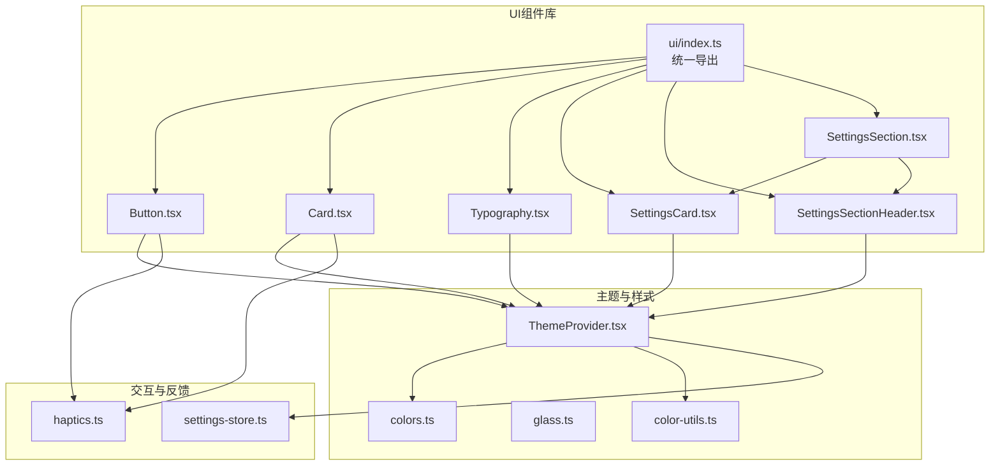
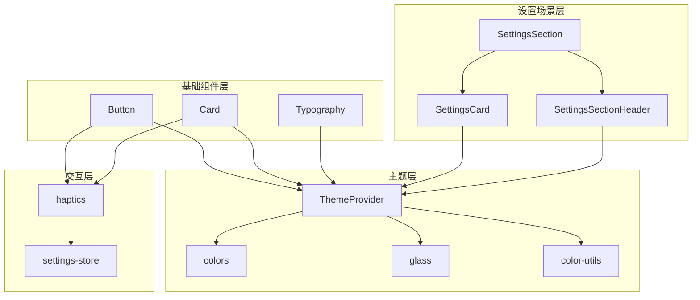
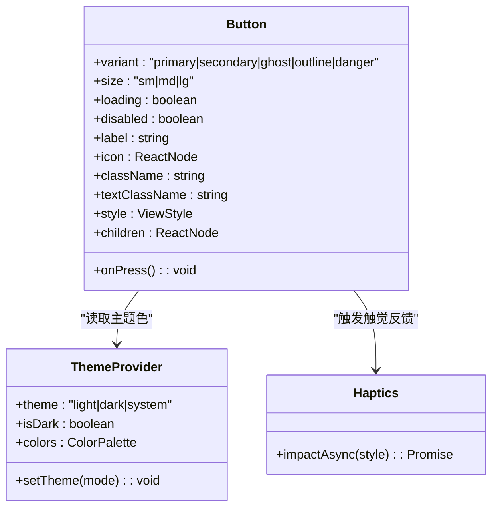
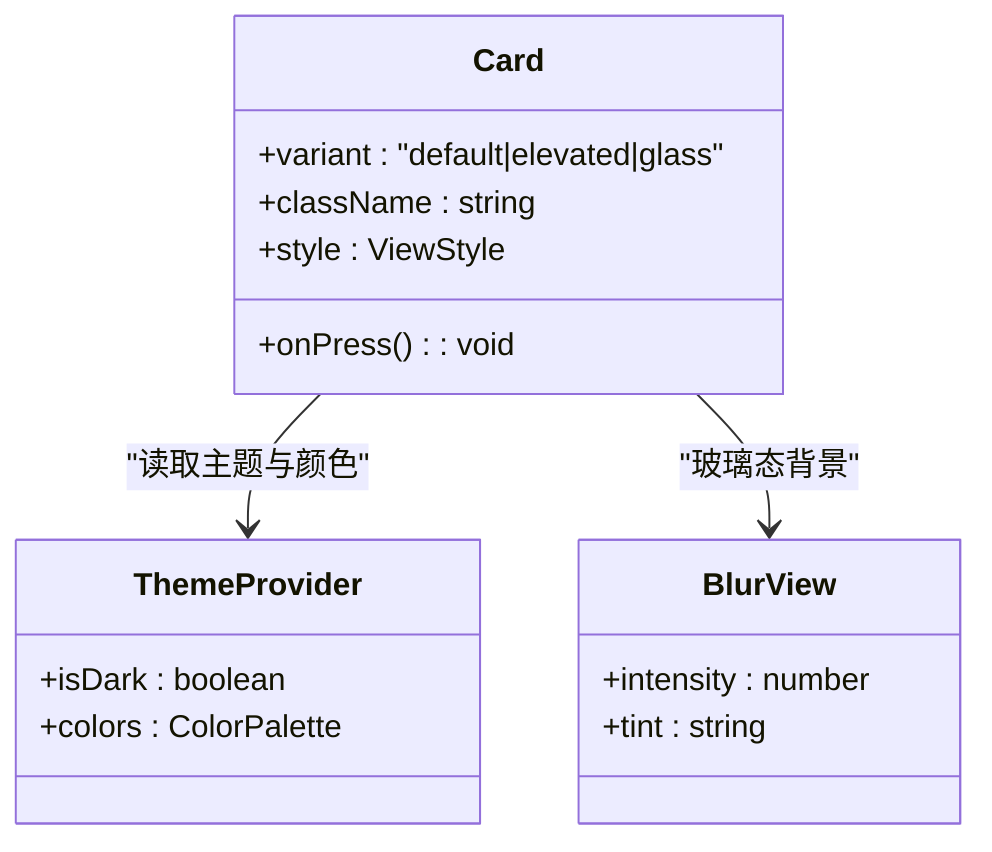
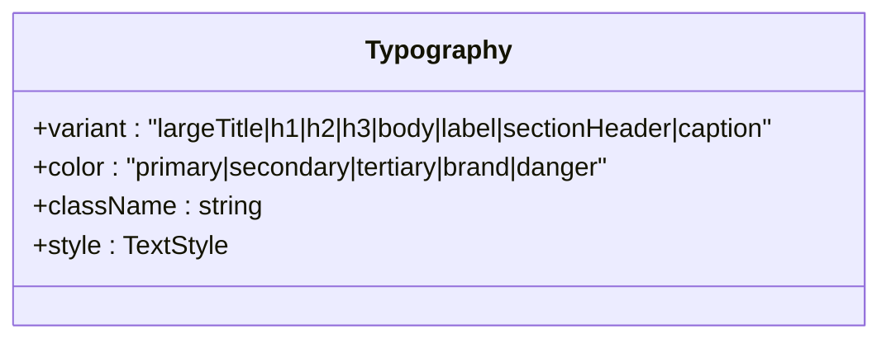
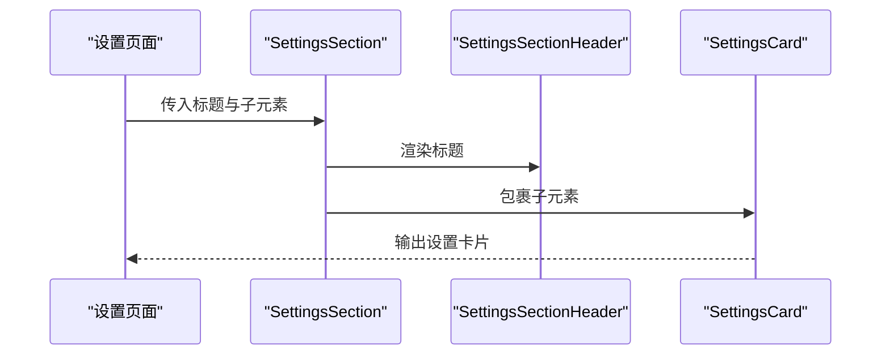
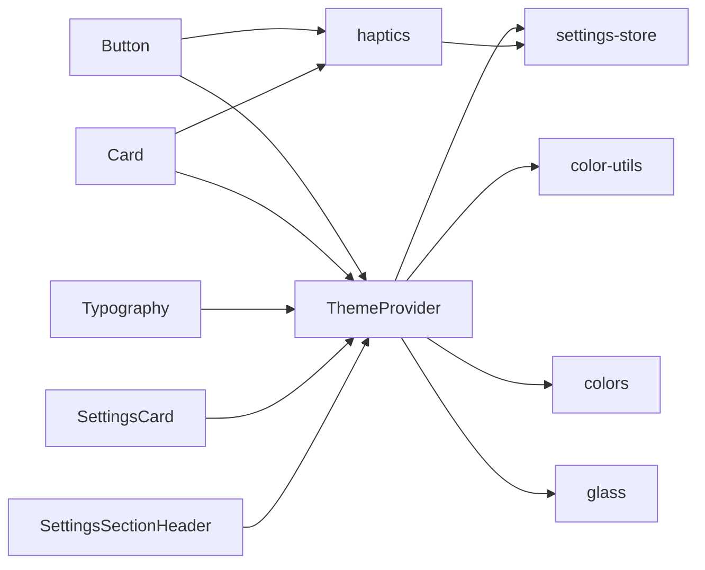

# 组件架构设计

<cite>
**本文引用的文件**
- [src/components/ui/index.ts](file://src/components/ui/index.ts)
- [src/components/ui/Button.tsx](file://src/components/ui/Button.tsx)
- [src/components/ui/Card.tsx](file://src/components/ui/Card.tsx)
- [src/components/ui/Typography.tsx](file://src/components/ui/Typography.tsx)
- [src/theme/ThemeProvider.tsx](file://src/theme/ThemeProvider.tsx)
- [src/theme/colors.ts](file://src/theme/colors.ts)
- [src/theme/glass.ts](file://src/theme/glass.ts)
- [src/lib/haptics.ts](file://src/lib/haptics.ts)
- [src/features/settings/components/SettingsSection.tsx](file://src/features/settings/components/SettingsSection.tsx)
- [src/components/ui/SettingsCard.tsx](file://src/components/ui/SettingsCard.tsx)
- [src/components/ui/SettingsSectionHeader.tsx](file://src/components/ui/SettingsSectionHeader.tsx)
- [src/components/ui/SettingsInput.tsx](file://src/components/ui/SettingsInput.tsx)
- [src/store/settings-store.ts](file://src/store/settings-store.ts)
- [src/lib/color-utils.ts](file://src/lib/color-utils.ts)
</cite>

## 目录
1. [引言](#引言)
2. [项目结构](#项目结构)
3. [核心组件](#核心组件)
4. [架构总览](#架构总览)
5. [详细组件分析](#详细组件分析)
6. [依赖分析](#依赖分析)
7. [性能考虑](#性能考虑)
8. [故障排查指南](#故障排查指南)
9. [结论](#结论)
10. [附录](#附录)

## 引言
本文件面向Nexara的UI组件体系，系统阐述组件的组织结构、模块化设计原则、导出机制、分类体系与依赖关系管理；深入解析基础组件（Button、Card、Typography等）的设计理念与实现方式；分析组件间协作模式与数据流向；总结可复用性与扩展机制；给出组件开发最佳实践、命名规范、测试策略与性能优化建议。目标是帮助开发者快速理解并高效扩展UI组件库。

## 项目结构
Nexara的UI组件主要位于src/components/ui目录，并通过统一的index.ts进行集中导出，形成“基础UI组件库”的模块化入口。同时，主题系统、动效与触觉反馈等横切能力在theme、lib等目录中提供支撑。设置类组件（SettingsCard、SettingsSectionHeader、SettingsSection等）作为业务场景组件，复用基础UI组件并遵循统一风格。

图表来源
- [src/components/ui/index.ts:1-25](file://src/components/ui/index.ts#L1-L25)
- [src/components/ui/Button.tsx:1-161](file://src/components/ui/Button.tsx#L1-L161)
- [src/components/ui/Card.tsx:1-105](file://src/components/ui/Card.tsx#L1-L105)
- [src/components/ui/Typography.tsx:1-49](file://src/components/ui/Typography.tsx#L1-L49)
- [src/theme/ThemeProvider.tsx:1-63](file://src/theme/ThemeProvider.tsx#L1-L63)
- [src/theme/colors.ts:1-42](file://src/theme/colors.ts#L1-L42)
- [src/theme/glass.ts:1-187](file://src/theme/glass.ts#L1-L187)
- [src/lib/haptics.ts:1-52](file://src/lib/haptics.ts#L1-L52)
- [src/features/settings/components/SettingsSection.tsx:1-21](file://src/features/settings/components/SettingsSection.tsx#L1-L21)
- [src/components/ui/SettingsCard.tsx:1-33](file://src/components/ui/SettingsCard.tsx#L1-L33)
- [src/components/ui/SettingsSectionHeader.tsx:1-33](file://src/components/ui/SettingsSectionHeader.tsx#L1-L33)
- [src/store/settings-store.ts:1-244](file://src/store/settings-store.ts#L1-L244)
- [src/lib/color-utils.ts:1-90](file://src/lib/color-utils.ts#L1-L90)

章节来源
- [src/components/ui/index.ts:1-25](file://src/components/ui/index.ts#L1-L25)

## 核心组件
本节聚焦基础UI组件：Button、Card、Typography，以及设置类组件：SettingsCard、SettingsSectionHeader、SettingsSection。它们共同构成Nexara的视觉与交互基石。

- Button：支持多种变体与尺寸，内置加载态、禁用态与触觉反馈；通过主题系统动态应用品牌色与明暗色板；使用动画库实现按压缩放反馈。
- Card：支持默认、提升与玻璃三种形态；可选点击反馈与触觉反馈；玻璃态使用模糊视图实现半透明背景。
- Typography：统一文本层级与色彩，支持多级标题、正文、标签、说明等变体；允许覆盖颜色与类名。
- SettingsCard/SettingsSectionHeader/SettingsSection：围绕设置页面的卡片容器与标题样式，复用Typography与主题色，保持设置界面的一致性。

章节来源
- [src/components/ui/Button.tsx:1-161](file://src/components/ui/Button.tsx#L1-L161)
- [src/components/ui/Card.tsx:1-105](file://src/components/ui/Card.tsx#L1-L105)
- [src/components/ui/Typography.tsx:1-49](file://src/components/ui/Typography.tsx#L1-L49)
- [src/components/ui/SettingsCard.tsx:1-33](file://src/components/ui/SettingsCard.tsx#L1-L33)
- [src/components/ui/SettingsSectionHeader.tsx:1-33](file://src/components/ui/SettingsSectionHeader.tsx#L1-L33)
- [src/features/settings/components/SettingsSection.tsx:1-21](file://src/features/settings/components/SettingsSection.tsx#L1-L21)

## 架构总览
Nexara的组件架构采用“基础组件库 + 主题系统 + 交互反馈 + 设置场景组件”的分层设计：

- 基础组件库：Button、Card、Typography等，提供通用UI能力，依赖主题系统与动效库。
- 主题系统：ThemeProvider提供主题模式、明暗切换、品牌色动态生成与持久化；colors与glass定义色值与玻璃效果常量。
- 交互反馈：haptics封装触觉反馈，受设置中心的全局开关控制；组件在交互时触发轻量触觉反馈。
- 设置场景组件：SettingsCard、SettingsSectionHeader、SettingsSection等，复用基础组件，形成设置页的统一风格。

图表来源
- [src/theme/ThemeProvider.tsx:1-63](file://src/theme/ThemeProvider.tsx#L1-L63)
- [src/theme/colors.ts:1-42](file://src/theme/colors.ts#L1-L42)
- [src/theme/glass.ts:1-187](file://src/theme/glass.ts#L1-L187)
- [src/lib/color-utils.ts:1-90](file://src/lib/color-utils.ts#L1-L90)
- [src/components/ui/Button.tsx:1-161](file://src/components/ui/Button.tsx#L1-L161)
- [src/components/ui/Card.tsx:1-105](file://src/components/ui/Card.tsx#L1-L105)
- [src/components/ui/Typography.tsx:1-49](file://src/components/ui/Typography.tsx#L1-L49)
- [src/components/ui/SettingsCard.tsx:1-33](file://src/components/ui/SettingsCard.tsx#L1-L33)
- [src/components/ui/SettingsSectionHeader.tsx:1-33](file://src/components/ui/SettingsSectionHeader.tsx#L1-L33)
- [src/features/settings/components/SettingsSection.tsx:1-21](file://src/features/settings/components/SettingsSection.tsx#L1-L21)
- [src/lib/haptics.ts:1-52](file://src/lib/haptics.ts#L1-L52)
- [src/store/settings-store.ts:1-244](file://src/store/settings-store.ts#L1-L244)

## 详细组件分析

### Button组件分析
Button通过变体与尺寸参数化外观，结合主题色与动效库实现一致的交互体验。其设计要点包括：
- 参数化变体：primary、secondary、ghost、outline、danger，分别映射不同的背景、边框与文字颜色。
- 尺寸体系：sm、md、lg三档，统一内边距与字号。
- 加载与禁用：loading与disabled状态统一降权处理，避免误操作。
- 动效与触觉：按压时缩放反馈，点击后延迟触发触觉反馈，尊重用户设置。
- 内容渲染：优先children，其次loading，最后label+icon组合。

图表来源
- [src/components/ui/Button.tsx:1-161](file://src/components/ui/Button.tsx#L1-L161)
- [src/theme/ThemeProvider.tsx:1-63](file://src/theme/ThemeProvider.tsx#L1-L63)
- [src/lib/haptics.ts:1-52](file://src/lib/haptics.ts#L1-L52)

章节来源
- [src/components/ui/Button.tsx:1-161](file://src/components/ui/Button.tsx#L1-L161)

### Card组件分析
Card提供容器型组件的统一风格，支持点击反馈与玻璃态模糊背景：
- 变体：default、elevated、glass，分别对应普通背景、阴影与模糊背景。
- 点击反馈：按压缩放，配合轻量触觉反馈。
- 玻璃态：使用模糊视图与动态透明度，适配明暗主题。
- 内容层：在玻璃态下提供可定制的背景色与透明度，确保内容可读性。

图表来源
- [src/components/ui/Card.tsx:1-105](file://src/components/ui/Card.tsx#L1-L105)
- [src/theme/ThemeProvider.tsx:1-63](file://src/theme/ThemeProvider.tsx#L1-L63)
- [src/theme/glass.ts:1-187](file://src/theme/glass.ts#L1-L187)

章节来源
- [src/components/ui/Card.tsx:1-105](file://src/components/ui/Card.tsx#L1-L105)

### Typography组件分析
Typography提供统一的文本层级与色彩体系，便于在不同主题下保持一致性：
- 变体：largeTitle、h1、h2、h3、body、label、sectionHeader、caption，覆盖页面标题到细小说明的完整体系。
- 颜色：primary、secondary、tertiary、brand、danger，支持语义化与状态色。
- 类名合并：基于Tailwind与clsx/twMerge，保证样式覆盖与冲突最小化。

图表来源
- [src/components/ui/Typography.tsx:1-49](file://src/components/ui/Typography.tsx#L1-L49)

章节来源
- [src/components/ui/Typography.tsx:1-49](file://src/components/ui/Typography.tsx#L1-L49)

### 设置场景组件分析
设置场景组件围绕设置页的布局与风格需求，复用基础组件与主题系统：
- SettingsSection：聚合标题与卡片容器，形成设置分组。
- SettingsSectionHeader：左侧强调色块与标题文本，统一设置页头部风格。
- SettingsCard：设置项的卡片容器，支持无内边距模式。

图表来源
- [src/features/settings/components/SettingsSection.tsx:1-21](file://src/features/settings/components/SettingsSection.tsx#L1-L21)
- [src/components/ui/SettingsSectionHeader.tsx:1-33](file://src/components/ui/SettingsSectionHeader.tsx#L1-L33)
- [src/components/ui/SettingsCard.tsx:1-33](file://src/components/ui/SettingsCard.tsx#L1-L33)

章节来源
- [src/features/settings/components/SettingsSection.tsx:1-21](file://src/features/settings/components/SettingsSection.tsx#L1-L21)
- [src/components/ui/SettingsSectionHeader.tsx:1-33](file://src/components/ui/SettingsSectionHeader.tsx#L1-L33)
- [src/components/ui/SettingsCard.tsx:1-33](file://src/components/ui/SettingsCard.tsx#L1-L33)

## 依赖分析
- 组件到主题系统：Button、Card、Typography、SettingsCard、SettingsSectionHeader均依赖ThemeProvider提供的颜色与主题模式；Glass常量用于玻璃态背景。
- 主题到存储：ThemeProvider从设置存储中读取主题模式与品牌色，持久化到本地存储；颜色动态生成由color-utils完成。
- 交互到设置：haptics根据设置中心的全局开关决定是否触发触觉反馈；Button与Card在交互时调用impactAsync。

图表来源
- [src/components/ui/Button.tsx:1-161](file://src/components/ui/Button.tsx#L1-L161)
- [src/components/ui/Card.tsx:1-105](file://src/components/ui/Card.tsx#L1-L105)
- [src/components/ui/Typography.tsx:1-49](file://src/components/ui/Typography.tsx#L1-L49)
- [src/components/ui/SettingsCard.tsx:1-33](file://src/components/ui/SettingsCard.tsx#L1-L33)
- [src/components/ui/SettingsSectionHeader.tsx:1-33](file://src/components/ui/SettingsSectionHeader.tsx#L1-L33)
- [src/theme/ThemeProvider.tsx:1-63](file://src/theme/ThemeProvider.tsx#L1-L63)
- [src/store/settings-store.ts:1-244](file://src/store/settings-store.ts#L1-L244)
- [src/lib/color-utils.ts:1-90](file://src/lib/color-utils.ts#L1-L90)
- [src/theme/colors.ts:1-42](file://src/theme/colors.ts#L1-L42)
- [src/theme/glass.ts:1-187](file://src/theme/glass.ts#L1-L187)
- [src/lib/haptics.ts:1-52](file://src/lib/haptics.ts#L1-L52)

章节来源
- [src/theme/ThemeProvider.tsx:1-63](file://src/theme/ThemeProvider.tsx#L1-L63)
- [src/store/settings-store.ts:1-244](file://src/store/settings-store.ts#L1-L244)
- [src/lib/color-utils.ts:1-90](file://src/lib/color-utils.ts#L1-L90)
- [src/theme/colors.ts:1-42](file://src/theme/colors.ts#L1-L42)
- [src/theme/glass.ts:1-187](file://src/theme/glass.ts#L1-L187)
- [src/lib/haptics.ts:1-52](file://src/lib/haptics.ts#L1-L52)

## 性能考虑
- 动画与触觉：Button与Card的按压缩放使用共享值与弹簧动画，避免频繁重排；触觉反馈采用延迟触发，降低主线程压力。
- 玻璃态渲染：Card的玻璃态使用BlurView，强度与透明度按平台与主题动态调整，兼顾美观与性能。
- 主题计算：颜色动态生成在useMemo中缓存，减少重复计算；主题模式持久化避免每次启动的IO开销。
- 样式合并：使用clsx与twMerge合并类名，减少无效样式叠加带来的重绘。
- 数据流：设置中心使用zustand与持久化中间件，仅序列化必要字段，降低存储与恢复成本。

## 故障排查指南
- 主题色异常：检查设置中心的accentColor合法性（六位或三位十六进制），若非法会被修复为默认值；确认ThemeProvider已正确初始化并持久化主题模式。
- 玻璃态不生效：确认平台支持与BlurView可用；检查Glass常量中的强度与透明度配置是否合理。
- 触觉反馈无效：确认设置中心的hapticsEnabled为true；检查haptics封装函数的错误捕获与延迟触发逻辑。
- Button/ Card点击无反馈：确认未处于loading或disabled状态；检查Pressable事件绑定与动画样式应用。

章节来源
- [src/store/settings-store.ts:1-244](file://src/store/settings-store.ts#L1-L244)
- [src/theme/ThemeProvider.tsx:1-63](file://src/theme/ThemeProvider.tsx#L1-L63)
- [src/theme/glass.ts:1-187](file://src/theme/glass.ts#L1-L187)
- [src/lib/haptics.ts:1-52](file://src/lib/haptics.ts#L1-L52)
- [src/components/ui/Button.tsx:1-161](file://src/components/ui/Button.tsx#L1-L161)
- [src/components/ui/Card.tsx:1-105](file://src/components/ui/Card.tsx#L1-L105)

## 结论
Nexara的组件架构以“基础组件库 + 主题系统 + 交互反馈 + 场景组件”为核心，通过统一的导出机制与清晰的职责划分，实现了高内聚、低耦合的模块化设计。Button、Card、Typography等基础组件在外观、交互与可访问性方面具备一致体验；主题系统与动态色彩生成保障了跨平台与跨主题的视觉一致性；设置场景组件复用基础组件，形成统一的设置页风格。该架构易于扩展与维护，适合长期演进。

## 附录

### 组件导出机制与分类体系
- 导出机制：ui/index.ts集中导出所有基础UI组件与设置场景组件，形成统一入口，便于按需引入与Tree Shaking。
- 分类体系：基础UI组件（Button、Card、Typography等）、设置场景组件（SettingsCard、SettingsSectionHeader、SettingsSection等）与主题/样式相关工具（ThemeProvider、colors、glass、color-utils）分层组织。

章节来源
- [src/components/ui/index.ts:1-25](file://src/components/ui/index.ts#L1-L25)
- [src/features/settings/components/SettingsSection.tsx:1-21](file://src/features/settings/components/SettingsSection.tsx#L1-L21)

### 组件协作与数据流向
- Button与Card的点击事件通过主题上下文与触觉反馈协同工作，最终回调上层业务逻辑。
- SettingsSection内部组合SettingsSectionHeader与SettingsCard，形成设置分组的完整结构。
- 主题系统贯穿组件树，为所有组件提供一致的颜色与样式上下文。

章节来源
- [src/components/ui/Button.tsx:1-161](file://src/components/ui/Button.tsx#L1-L161)
- [src/components/ui/Card.tsx:1-105](file://src/components/ui/Card.tsx#L1-L105)
- [src/features/settings/components/SettingsSection.tsx:1-21](file://src/features/settings/components/SettingsSection.tsx#L1-L21)
- [src/theme/ThemeProvider.tsx:1-63](file://src/theme/ThemeProvider.tsx#L1-L63)

### 可复用性与扩展机制
- 可复用性：通过变体、尺寸、颜色等参数化设计，组件可在不同场景复用；主题系统与样式合并工具保证一致性。
- 扩展机制：新增组件遵循现有命名与导出规范；如需新变体，应在主题系统与样式常量中同步扩展；触觉反馈与动画行为应保持一致的触发时机与延迟策略。

### 组件开发最佳实践与命名规范
- 命名规范：组件文件采用帕斯卡命名；导出统一通过index.ts集中管理；样式类名遵循Tailwind约定。
- 参数设计：优先使用枚举类型约束变体与尺寸；提供className/style扩展点；对交互状态（loading/disabled）进行统一处理。
- 主题集成：组件内部通过ThemeProvider读取颜色与主题模式；避免硬编码颜色值。
- 动效与反馈：统一使用共享值与弹簧动画；触觉反馈需尊重用户设置并延迟触发。

### 组件测试策略
- 单元测试：针对Button与Card的关键分支（变体、尺寸、loading、disabled、点击反馈）编写快照与交互测试。
- 主题测试：验证明暗主题与品牌色变化下的颜色输出与样式一致性。
- 场景测试：设置场景组件的组合渲染与布局稳定性。
- 性能测试：动画帧率与触觉反馈延迟的基准测试。