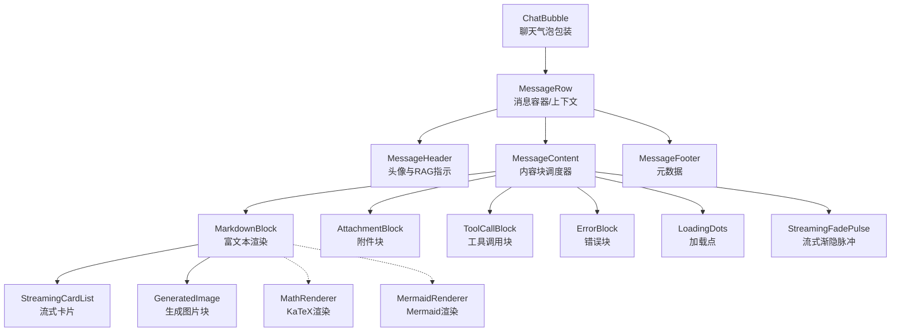
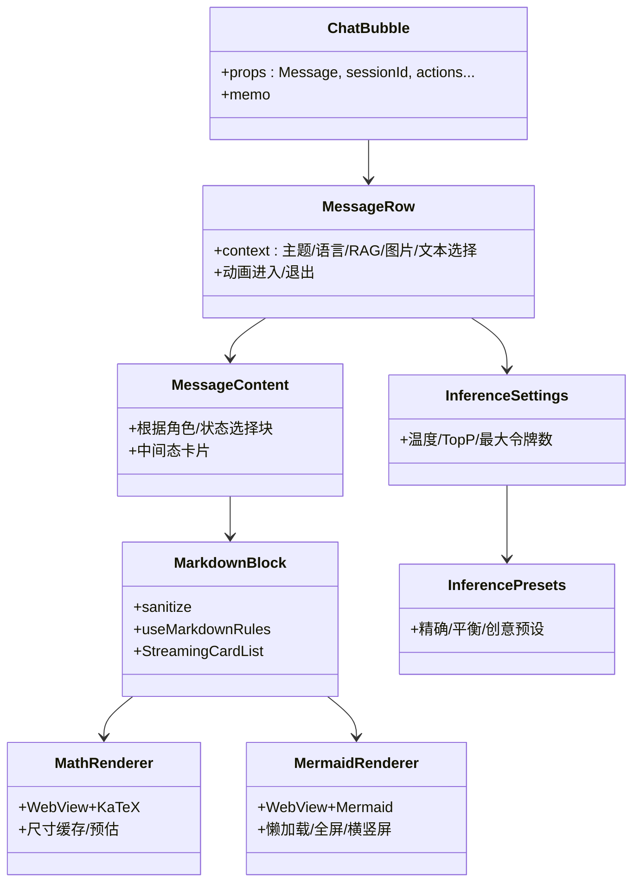
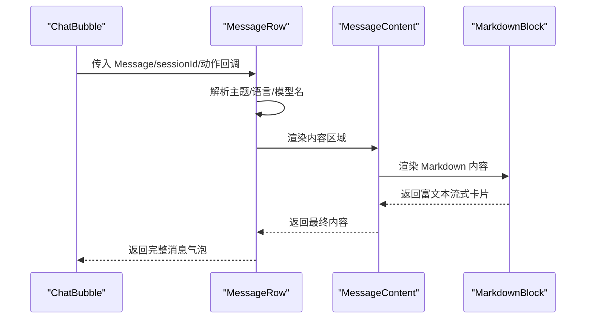
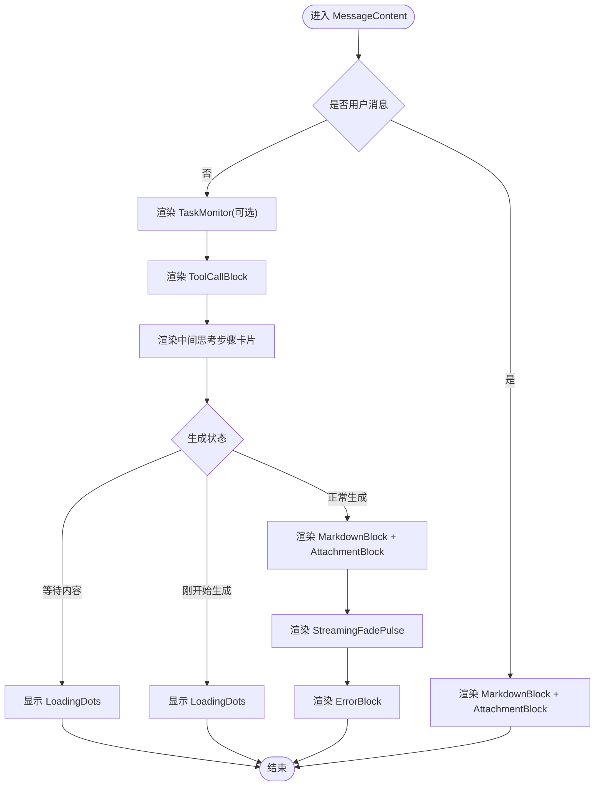
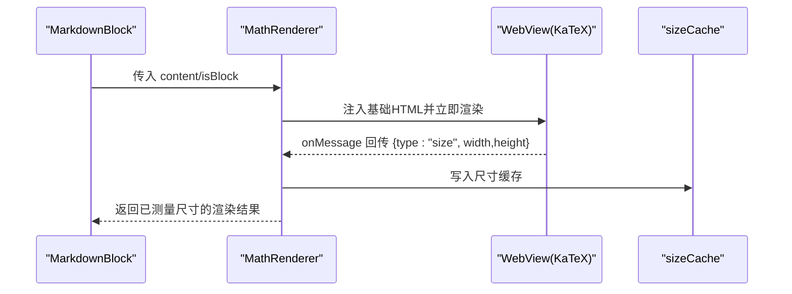
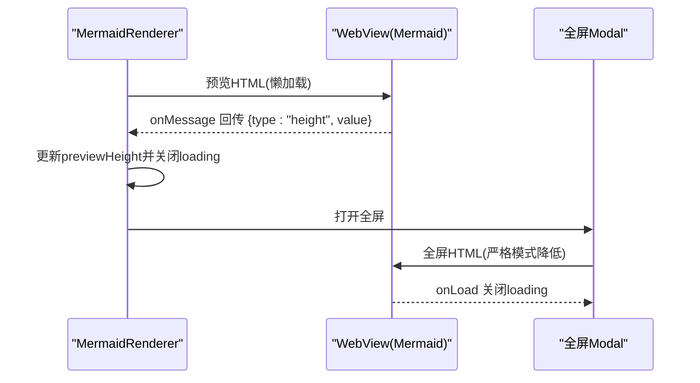
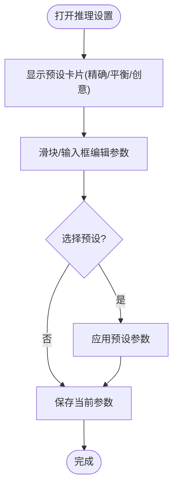
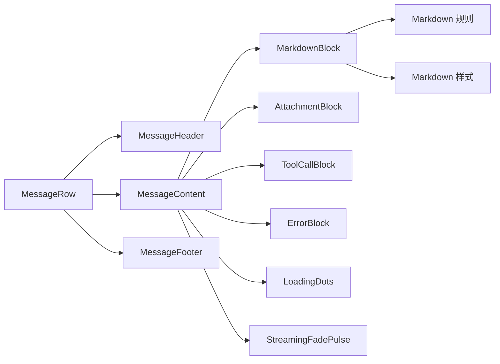
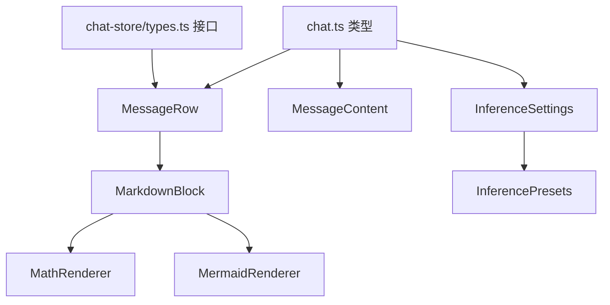

# 聊天组件

<cite>
**本文引用的文件**
- [ChatBubble.tsx](file://src/features/chat/components/ChatBubble.tsx)
- [MessageRow.tsx](file://src/features/chat/components/message/MessageRow.tsx)
- [MessageContent.tsx](file://src/features/chat/components/message/MessageContent.tsx)
- [MarkdownBlock.tsx](file://src/features/chat/components/message/blocks/MarkdownBlock.tsx)
- [MathRenderer.tsx](file://src/components/chat/MathRenderer.tsx)
- [MermaidRenderer.tsx](file://src/components/chat/MermaidRenderer.tsx)
- [InferenceSettings.tsx](file://src/components/chat/InferenceSettings.tsx)
- [InferencePresets.tsx](file://src/components/chat/InferencePresets.tsx)
- [chat.ts 类型定义](file://src/types/chat.ts)
- [message-utils.ts](file://src/features/chat/utils/message-utils.ts)
- [message-styles.ts](file://src/features/chat/components/message/styles/message-styles.ts)
- [markdown-theme.ts](file://src/features/chat/components/message/styles/markdown-theme.ts)
- [chat 类型共享接口](file://src/store/chat/types.ts)
</cite>

## 目录
1. [简介](#简介)
2. [项目结构](#项目结构)
3. [核心组件](#核心组件)
4. [架构总览](#架构总览)
5. [详细组件分析](#详细组件分析)
6. [依赖关系分析](#依赖关系分析)
7. [性能考量](#性能考量)
8. [故障排查指南](#故障排查指南)
9. [结论](#结论)
10. [附录](#附录)

## 简介
本文件面向 Nexara 聊天系统，聚焦以下目标：
- 深入解析聊天气泡组件的实现机制，覆盖消息渲染、样式适配与交互行为
- 详解推理设置与预设管理组件的功能特性与交互逻辑
- 分析数学公式渲染器与 Mermaid 图表渲染器的实现原理与性能策略
- 解释消息块组件的组合模式与数据处理流程
- 提供定制化方法与扩展指南
- 给出性能优化策略与用户体验改进建议

## 项目结构
Nexara 的聊天组件采用“原子化微组件 + 容器/上下文”的分层架构：
- ChatBubble 作为对外包装，承载消息上下文并向下传递给 MessageRow
- MessageRow 是消息容器与上下文提供者，组织 Header、Content、Footer
- MessageContent 负责根据角色与状态选择渲染块（Markdown、附件、工具调用、错误、流式脉冲等）
- MarkdownBlock 通过 Markdown 规则与样式系统渲染富文本，并集成图片查看器
- 数学与图表渲染器分别通过 WebView 渲染 KaTeX 与 Mermaid，支持懒加载、全屏与横竖屏切换
- 推理设置与预设组件提供温度、TopP、最大令牌数等参数的可视化编辑与快捷预设

**图表来源**
- [ChatBubble.tsx:1-44](file://src/features/chat/components/ChatBubble.tsx#L1-L44)
- [MessageRow.tsx:1-130](file://src/features/chat/components/message/MessageRow.tsx#L1-L130)
- [MessageContent.tsx:1-98](file://src/features/chat/components/message/MessageContent.tsx#L1-L98)
- [MarkdownBlock.tsx:1-52](file://src/features/chat/components/message/blocks/MarkdownBlock.tsx#L1-L52)

**章节来源**
- [ChatBubble.tsx:1-44](file://src/features/chat/components/ChatBubble.tsx#L1-L44)
- [MessageRow.tsx:1-130](file://src/features/chat/components/message/MessageRow.tsx#L1-L130)
- [MessageContent.tsx:1-98](file://src/features/chat/components/message/MessageContent.tsx#L1-L98)
- [MarkdownBlock.tsx:1-52](file://src/features/chat/components/message/blocks/MarkdownBlock.tsx#L1-L52)

## 核心组件
- 聊天气泡包装：ChatBubble 将 MessageRow 包装为对外稳定接口，保持向后兼容
- 消息容器与上下文：MessageRow 提供主题、语言、RAG 状态、图片查看、文本选择等上下文
- 内容调度器：MessageContent 根据角色与生成状态决定渲染顺序与占位
- 富文本块：MarkdownBlock 负责渲染 Markdown，集成图片查看与流式卡片
- 数学渲染器：MathRenderer 使用 WebView + KaTeX，支持行内/块级公式，带尺寸缓存与预估尺寸
- Mermaid 渲染器：MermaidRenderer 使用 WebView + Mermaid，支持懒加载卡片、全屏交互与横竖屏切换
- 推理设置与预设：InferenceSettings 与 InferencePresets 提供温度、TopP、最大令牌数的可视化编辑与快捷预设

**章节来源**
- [ChatBubble.tsx:1-44](file://src/features/chat/components/ChatBubble.tsx#L1-L44)
- [MessageRow.tsx:1-130](file://src/features/chat/components/message/MessageRow.tsx#L1-L130)
- [MessageContent.tsx:1-98](file://src/features/chat/components/message/MessageContent.tsx#L1-L98)
- [MarkdownBlock.tsx:1-52](file://src/features/chat/components/message/blocks/MarkdownBlock.tsx#L1-L52)
- [MathRenderer.tsx:1-604](file://src/components/chat/MathRenderer.tsx#L1-L604)
- [MermaidRenderer.tsx:1-352](file://src/components/chat/MermaidRenderer.tsx#L1-L352)
- [InferenceSettings.tsx:1-124](file://src/components/chat/InferenceSettings.tsx#L1-L124)
- [InferencePresets.tsx:1-115](file://src/components/chat/InferencePresets.tsx#L1-L115)

## 架构总览
Nexara 聊天组件遵循“容器/上下文 + 原子块”的组合模式：
- 容器层：ChatBubble → MessageRow，负责布局、主题、上下文与交互入口
- 内容层：MessageContent，按角色与状态选择渲染块
- 块层：Markdown、附件、工具调用、错误、加载与流式脉冲
- 渲染器层：MathRenderer、MermaidRenderer 通过 WebView 渲染外部库，保证复杂内容的高质量展示
- 设置层：InferenceSettings + InferencePresets 提供参数编辑与预设切换

**图表来源**
- [ChatBubble.tsx:1-44](file://src/features/chat/components/ChatBubble.tsx#L1-L44)
- [MessageRow.tsx:1-130](file://src/features/chat/components/message/MessageRow.tsx#L1-L130)
- [MessageContent.tsx:1-98](file://src/features/chat/components/message/MessageContent.tsx#L1-L98)
- [MarkdownBlock.tsx:1-52](file://src/features/chat/components/message/blocks/MarkdownBlock.tsx#L1-L52)
- [MathRenderer.tsx:1-604](file://src/components/chat/MathRenderer.tsx#L1-L604)
- [MermaidRenderer.tsx:1-352](file://src/components/chat/MermaidRenderer.tsx#L1-L352)
- [InferenceSettings.tsx:1-124](file://src/components/chat/InferenceSettings.tsx#L1-L124)
- [InferencePresets.tsx:1-115](file://src/components/chat/InferencePresets.tsx#L1-L115)

## 详细组件分析

### 聊天气泡与消息容器
- ChatBubble：作为对外包装，直接透传属性并渲染 MessageRow，确保与既有系统兼容
- MessageRow：
  - 提供主题、语言、用户信息、模型名解析、RAG 展开状态、图片查看、文本选择等上下文
  - 根据角色决定气泡样式与圆角方向，使用动画入场/出场增强体验
  - 为子组件提供统一的上下文，屏蔽细节差异

**图表来源**
- [ChatBubble.tsx:41-43](file://src/features/chat/components/ChatBubble.tsx#L41-L43)
- [MessageRow.tsx:40-129](file://src/features/chat/components/message/MessageRow.tsx#L40-L129)
- [MessageContent.tsx:14-97](file://src/features/chat/components/message/MessageContent.tsx#L14-L97)
- [MarkdownBlock.tsx:13-51](file://src/features/chat/components/message/blocks/MarkdownBlock.tsx#L13-L51)

**章节来源**
- [ChatBubble.tsx:1-44](file://src/features/chat/components/ChatBubble.tsx#L1-L44)
- [MessageRow.tsx:1-130](file://src/features/chat/components/message/MessageRow.tsx#L1-L130)

### 消息内容块与渲染流程
- MessageContent：
  - 用户消息：渲染 Markdown 与附件
  - 助手消息：先渲染任务监控卡片（若存在），再渲染工具调用块；随后根据生成状态渲染中间思考卡片、Markdown、附件、流式脉冲与错误块
  - 加载态：根据是否已有内容与是否开始生成，选择不同加载占位
- MarkdownBlock：
  - 使用 Markdown 规则与样式系统渲染
  - 内容经安全净化，提取图片并支持图片查看器
  - 通过流式卡片组件呈现逐步生成的内容

**图表来源**
- [MessageContent.tsx:14-97](file://src/features/chat/components/message/MessageContent.tsx#L14-L97)
- [MarkdownBlock.tsx:13-51](file://src/features/chat/components/message/blocks/MarkdownBlock.tsx#L13-L51)

**章节来源**
- [MessageContent.tsx:1-98](file://src/features/chat/components/message/MessageContent.tsx#L1-L98)
- [MarkdownBlock.tsx:1-52](file://src/features/chat/components/message/blocks/MarkdownBlock.tsx#L1-L52)

### 数学公式渲染器（KaTeX）
- 设计要点：
  - 使用 WebView 承载 KaTeX 渲染，避免原生富文本复杂度
  - 行内公式采用预估尺寸，块级公式允许有限自适应，减少布局抖动
  - 引入全局尺寸缓存，避免重复测量与无限重试
  - HTML 直接注入内容，消除“空 -> 渲染”闪烁
- 关键流程：
  - 初始化解析本地资源 URI
  - 首次渲染立即在 WebView 中执行渲染并回传尺寸
  - 将尺寸写入缓存，后续复用以稳定布局
  - 通过透明背景与固定尺寸容器控制可见性与稳定性

**图表来源**
- [MathRenderer.tsx:75-260](file://src/components/chat/MathRenderer.tsx#L75-L260)

**章节来源**
- [MathRenderer.tsx:1-604](file://src/components/chat/MathRenderer.tsx#L1-L604)

### Mermaid 图表渲染器
- 设计要点：
  - 懒加载卡片模式：预览区固定高度，加载完成后上报高度并收起
  - 全屏交互：Modal 展示，支持横竖屏切换与加载遮罩
  - 主题与安全级别：根据主题切换 Mermaid 主题，全屏模式放宽安全级别
  - 高度上报：通过 onMessage 获取容器滚动高度，限制范围避免过度拉伸
- 关键流程：
  - 清洗内容（去除围栏）
  - 生成 HTML（含 Mermaid 脚本与初始化参数）
  - 预览 WebView 上报高度，全屏 WebView 加载完成关闭加载遮罩
  - 提供旋转图标与横竖屏切换逻辑

**图表来源**
- [MermaidRenderer.tsx:32-252](file://src/components/chat/MermaidRenderer.tsx#L32-L252)

**章节来源**
- [MermaidRenderer.tsx:1-352](file://src/components/chat/MermaidRenderer.tsx#L1-L352)

### 推理设置与预设管理
- InferenceSettings：
  - 提供温度、TopP、最大令牌数的可视化编辑
  - 值的优先级：会话 > 助手默认 > 全局默认，确保灵活覆盖
  - 使用滑块与输入框，实时反馈数值
- InferencePresets：
  - 精确（低温度）、平衡（中温度）、创意（高温度）三类预设
  - 基于当前温度粗略判定当前激活项，点击一键应用对应参数
  - 支持触觉反馈与高亮边框

**图表来源**
- [InferenceSettings.tsx:16-123](file://src/components/chat/InferenceSettings.tsx#L16-L123)
- [InferencePresets.tsx:18-114](file://src/components/chat/InferencePresets.tsx#L18-L114)

**章节来源**
- [InferenceSettings.tsx:1-124](file://src/components/chat/InferenceSettings.tsx#L1-L124)
- [InferencePresets.tsx:1-115](file://src/components/chat/InferencePresets.tsx#L1-L115)
- [chat.ts 类型定义:6-13](file://src/types/chat.ts#L6-L13)

### 消息块组合模式与数据处理
- 组合模式：
  - MessageRow 作为容器，聚合 Header/Footer 与 Content
  - MessageContent 依据角色与生成状态，组合多个块（Markdown、附件、工具调用、错误、加载、流式脉冲）
  - MarkdownBlock 通过 Markdown 规则与样式系统渲染，支持图片查看器
- 数据处理：
  - MarkdownBlock 对内容进行安全净化与图片提取
  - 流式卡片用于展示逐步生成的内容片段
  - 任务监控卡片用于展示规划任务状态（若存在）

**图表来源**
- [MessageRow.tsx:94-129](file://src/features/chat/components/message/MessageRow.tsx#L94-L129)
- [MessageContent.tsx:14-97](file://src/features/chat/components/message/MessageContent.tsx#L14-L97)
- [MarkdownBlock.tsx:13-51](file://src/features/chat/components/message/blocks/MarkdownBlock.tsx#L13-L51)

**章节来源**
- [MessageRow.tsx:1-130](file://src/features/chat/components/message/MessageRow.tsx#L1-L130)
- [MessageContent.tsx:1-98](file://src/features/chat/components/message/MessageContent.tsx#L1-L98)
- [MarkdownBlock.tsx:1-52](file://src/features/chat/components/message/blocks/MarkdownBlock.tsx#L1-L52)

## 依赖关系分析
- 类型与状态：
  - chat.ts 定义了 Message、Session、InferenceParams 等核心类型
  - chat-store/types.ts 定义了消息/会话/工具执行/审批等管理接口
- 组件间耦合：
  - ChatBubble 仅依赖 MessageRow，耦合度低
  - MessageRow 依赖上下文与多处 store（主题、设置、RAG、聊天），但通过上下文解耦
  - MarkdownBlock 依赖 Markdown 规则与样式，以及图片查看器
- 外部依赖：
  - MathRenderer 依赖 WebView 与 KaTeX 资源
  - MermaidRenderer 依赖 WebView 与 Mermaid 资源
  - 推理设置依赖主题与国际化

**图表来源**
- [chat.ts 类型定义:135-167](file://src/types/chat.ts#L135-L167)
- [chat.ts 类型定义:6-13](file://src/types/chat.ts#L6-L13)
- [chat 类型共享接口:35-73](file://src/store/chat/types.ts#L35-L73)
- [MessageRow.tsx:1-130](file://src/features/chat/components/message/MessageRow.tsx#L1-L130)
- [MessageContent.tsx:1-98](file://src/features/chat/components/message/MessageContent.tsx#L1-L98)
- [MarkdownBlock.tsx:1-52](file://src/features/chat/components/message/blocks/MarkdownBlock.tsx#L1-L52)
- [MathRenderer.tsx:1-604](file://src/components/chat/MathRenderer.tsx#L1-L604)
- [MermaidRenderer.tsx:1-352](file://src/components/chat/MermaidRenderer.tsx#L1-L352)
- [InferenceSettings.tsx:1-124](file://src/components/chat/InferenceSettings.tsx#L1-L124)
- [InferencePresets.tsx:1-115](file://src/components/chat/InferencePresets.tsx#L1-L115)

**章节来源**
- [chat.ts 类型定义:1-314](file://src/types/chat.ts#L1-L314)
- [chat 类型共享接口:1-163](file://src/store/chat/types.ts#L1-L163)

## 性能考量
- 布局稳定性
  - MathRenderer 使用尺寸缓存与预估尺寸，避免动态测量导致的布局抖动与无限重试
  - MermaidRenderer 预览区高度限制与懒加载，减少首屏计算压力
- 渲染性能
  - WebView 渲染复杂公式与图表，避免原生富文本的高复杂度实现
  - MarkdownBlock 使用 memo 化与流式卡片，仅渲染必要内容
- 交互优化
  - MessageRow 使用动画入场/出场，提升过渡体验
  - MermaidRenderer 全屏模式硬件加速与横竖屏切换，改善大图浏览体验
- 存储与计算
  - message-utils 的内容提取策略过滤噪声，保留核心语义，有助于检索与摘要

**章节来源**
- [MathRenderer.tsx:75-260](file://src/components/chat/MathRenderer.tsx#L75-L260)
- [MermaidRenderer.tsx:32-252](file://src/components/chat/MermaidRenderer.tsx#L32-L252)
- [MessageRow.tsx:96-129](file://src/features/chat/components/message/MessageRow.tsx#L96-L129)
- [message-utils.ts:12-57](file://src/features/chat/utils/message-utils.ts#L12-L57)

## 故障排查指南
- 数学公式不显示或闪烁
  - 检查 WebView 是否 ready，确认 HTML 注入与脚本加载成功
  - 确认尺寸缓存命中，避免重复测量
  - 参考路径：[MathRenderer.tsx:96-118](file://src/components/chat/MathRenderer.tsx#L96-L118)
- Mermaid 图表渲染失败或空白
  - 检查本地资源解析与 CDN 回退链路
  - 确认主题与安全级别设置，全屏模式放宽安全级别
  - 参考路径：[MermaidRenderer.tsx:40-43](file://src/components/chat/MermaidRenderer.tsx#L40-L43)
- Markdown 内容异常或图片无法查看
  - 检查内容净化与图片提取逻辑
  - 确认图片查看器回调正确传递
  - 参考路径：[MarkdownBlock.tsx:32-40](file://src/features/chat/components/message/blocks/MarkdownBlock.tsx#L32-L40)
- 推理参数未生效
  - 检查值的优先级：会话 > 助手默认 > 全局默认
  - 确认预设选择与手动编辑的合并逻辑
  - 参考路径：[InferenceSettings.tsx:19-30](file://src/components/chat/InferenceSettings.tsx#L19-L30)

**章节来源**
- [MathRenderer.tsx:96-118](file://src/components/chat/MathRenderer.tsx#L96-L118)
- [MermaidRenderer.tsx:40-43](file://src/components/chat/MermaidRenderer.tsx#L40-L43)
- [MarkdownBlock.tsx:32-40](file://src/features/chat/components/message/blocks/MarkdownBlock.tsx#L32-L40)
- [InferenceSettings.tsx:19-30](file://src/components/chat/InferenceSettings.tsx#L19-L30)

## 结论
Nexara 聊天组件通过“容器/上下文 + 原子块”的架构实现了高内聚、低耦合的消息渲染体系。数学与图表渲染器采用 WebView 承载外部库，兼顾质量与性能；推理设置与预设提供了直观的参数编辑与快速切换能力。整体设计在保证可维护性的同时，兼顾了用户体验与性能优化。

## 附录
- 样式与主题
  - 消息样式与 Markdown 主题分别由 message-styles 与 markdown-theme 提供，支持深浅主题与颜色变量
  - 参考路径：[message-styles.ts:5-72](file://src/features/chat/components/message/styles/message-styles.ts#L5-L72), [markdown-theme.ts:5-59](file://src/features/chat/components/message/styles/markdown-theme.ts#L5-L59)
- 类型与接口
  - 核心类型与管理接口定义见 chat.ts 与 chat-store/types.ts
  - 参考路径：[chat.ts 类型定义:135-167](file://src/types/chat.ts#L135-L167), [chat 类型共享接口:35-73](file://src/store/chat/types.ts#L35-L73)