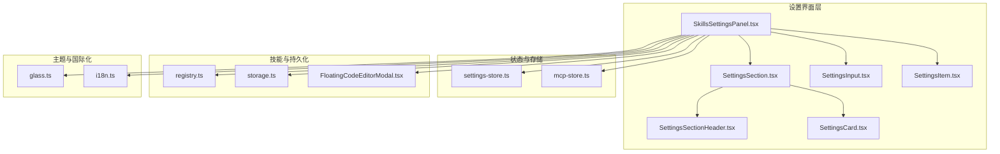
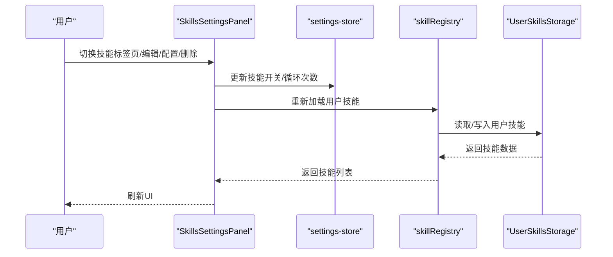
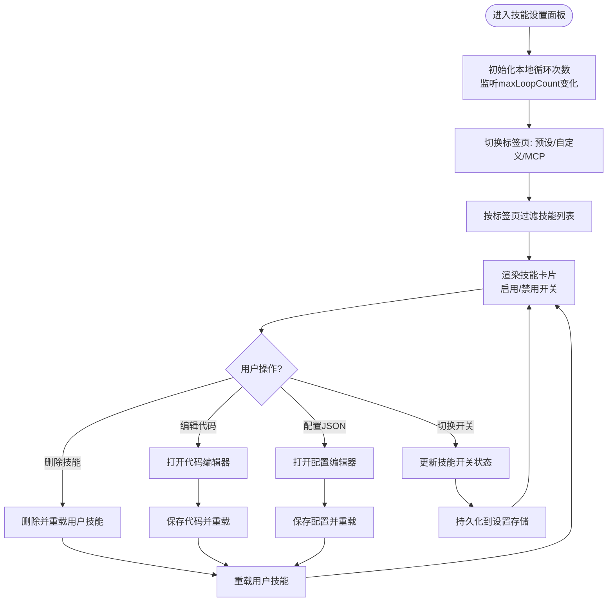
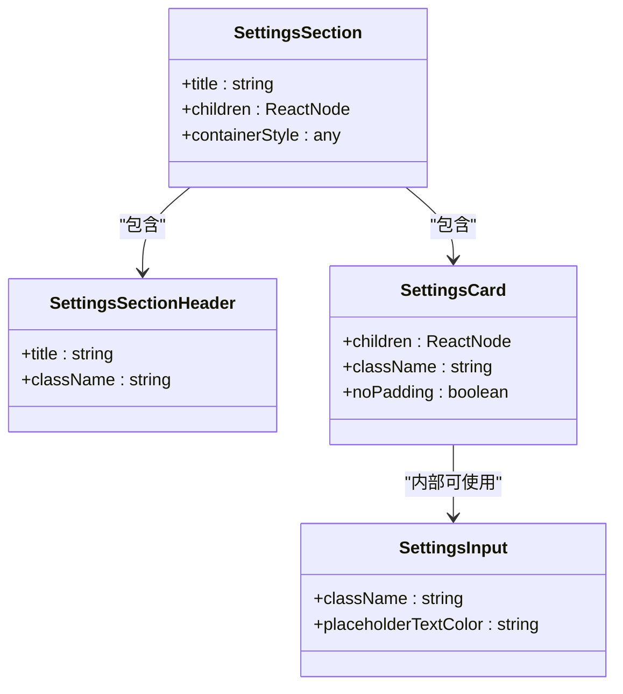
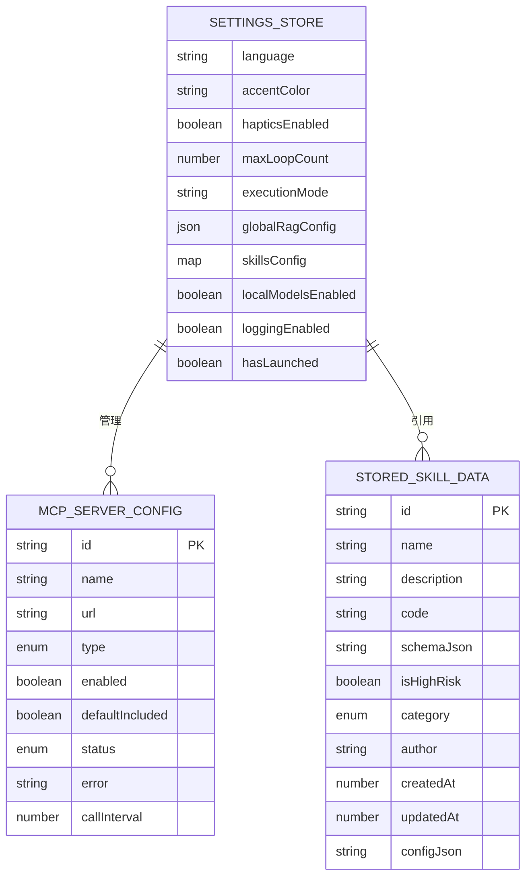
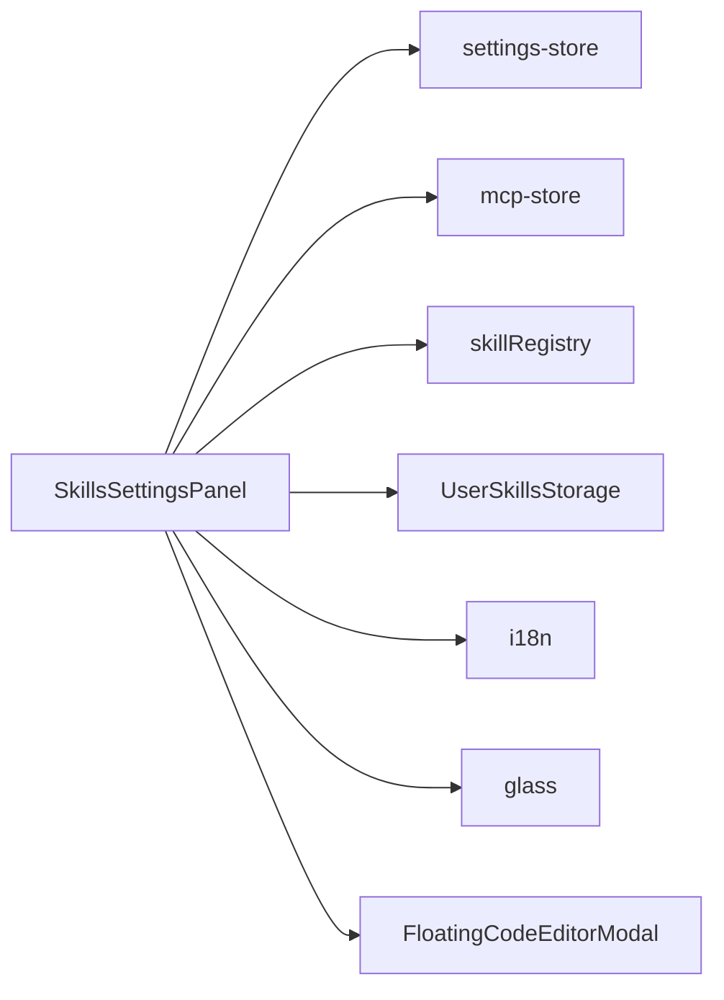

# 设置组件

<cite>
**本文档引用的文件**
- [SkillsSettingsPanel.tsx](file://src/components/settings/SkillsSettingsPanel.tsx)
- [SettingsCard.tsx](file://src/components/ui/SettingsCard.tsx)
- [SettingsInput.tsx](file://src/components/ui/SettingsInput.tsx)
- [SettingsSectionHeader.tsx](file://src/components/ui/SettingsSectionHeader.tsx)
- [SettingsItem.tsx](file://src/features/settings/components/SettingsItem.tsx)
- [SettingsSection.tsx](file://src/features/settings/components/SettingsSection.tsx)
- [settings-store.ts](file://src/store/settings-store.ts)
- [mcp-store.ts](file://src/store/mcp-store.ts)
- [registry.ts](file://src/lib/skills/registry.ts)
- [storage.ts](file://src/lib/skills/storage.ts)
- [i18n.ts](file://src/lib/i18n.ts)
- [glass.ts](file://src/theme/glass.ts)
- [FloatingCodeEditorModal.tsx](file://src/components/ui/FloatingCodeEditorModal.tsx)
</cite>

## 目录
1. [简介](#简介)
2. [项目结构](#项目结构)
3. [核心组件](#核心组件)
4. [架构总览](#架构总览)
5. [详细组件分析](#详细组件分析)
6. [依赖分析](#依赖分析)
7. [性能考虑](#性能考虑)
8. [故障排除指南](#故障排除指南)
9. [结论](#结论)
10. [附录](#附录)

## 简介
本文件聚焦 Nexara 设置模块中的“技能设置面板”，系统性阐述其设计与实现：包括技能卡片组件的呈现与交互、设置区域头部与输入组件的功能特性、表单验证与数据绑定机制、设置项的动态生成与条件显示逻辑、扩展与自定义方法，以及设置数据的持久化与同步策略。文档旨在帮助开发者与产品人员快速理解并高效维护该功能。

## 项目结构
设置组件围绕“设置区域容器 + 卡片 + 头部 + 输入 + 列表项”的分层组织展开，配合状态存储与技能注册中心，形成清晰的职责边界与可扩展性。

图表来源
- [SkillsSettingsPanel.tsx:1-461](file://src/components/settings/SkillsSettingsPanel.tsx#L1-L461)
- [SettingsSection.tsx:1-21](file://src/features/settings/components/SettingsSection.tsx#L1-L21)
- [SettingsCard.tsx:1-33](file://src/components/ui/SettingsCard.tsx#L1-L33)
- [SettingsSectionHeader.tsx:1-33](file://src/components/ui/SettingsSectionHeader.tsx#L1-L33)
- [SettingsInput.tsx:1-29](file://src/components/ui/SettingsInput.tsx#L1-L29)
- [SettingsItem.tsx:1-111](file://src/features/settings/components/SettingsItem.tsx#L1-L111)
- [settings-store.ts:1-244](file://src/store/settings-store.ts#L1-L244)
- [mcp-store.ts:1-72](file://src/store/mcp-store.ts#L1-L72)
- [registry.ts:1-189](file://src/lib/skills/registry.ts#L1-L189)
- [storage.ts:1-152](file://src/lib/skills/storage.ts#L1-L152)
- [FloatingCodeEditorModal.tsx:1-263](file://src/components/ui/FloatingCodeEditorModal.tsx#L1-L263)
- [glass.ts:1-187](file://src/theme/glass.ts#L1-L187)
- [i18n.ts:1-800](file://src/lib/i18n.ts#L1-L800)

章节来源
- [SkillsSettingsPanel.tsx:1-461](file://src/components/settings/SkillsSettingsPanel.tsx#L1-L461)
- [SettingsSection.tsx:1-21](file://src/features/settings/components/SettingsSection.tsx#L1-L21)

## 核心组件
- 技能设置面板：负责渲染“最大思考轮数”、“智能体技能”三大区域；提供 MCP 服务器管理、用户自定义技能编辑与配置、技能启用/禁用等交互。
- 设置区域容器：封装标题、卡片与内边距，统一风格与间距。
- 设置输入组件：提供简洁一致的输入框样式与占位文本颜色。
- 设置项组件：用于列表项的图标、标题、副标题、右侧元素与指示箭头，统一交互与视觉。
- 状态存储：集中管理语言、主题色、模型默认值、RAG 全局配置、技能开关、循环次数、日志开关等。
- 技能注册中心：统一注册与管理内置、用户与 MCP 技能，支持动态重载与会话级过滤。
- 用户技能持久化：基于文件系统存储用户自定义技能，支持加载、保存、删除与水合为可执行技能对象。
- 浮动代码编辑器：提供代码与 JSON 配置的弹窗编辑体验，含行号、键盘适配与保存回调。

章节来源
- [SettingsSection.tsx:1-21](file://src/features/settings/components/SettingsSection.tsx#L1-L21)
- [SettingsCard.tsx:1-33](file://src/components/ui/SettingsCard.tsx#L1-L33)
- [SettingsInput.tsx:1-29](file://src/components/ui/SettingsInput.tsx#L1-L29)
- [SettingsItem.tsx:1-111](file://src/features/settings/components/SettingsItem.tsx#L1-L111)
- [settings-store.ts:1-244](file://src/store/settings-store.ts#L1-L244)
- [registry.ts:1-189](file://src/lib/skills/registry.ts#L1-L189)
- [storage.ts:1-152](file://src/lib/skills/storage.ts#L1-L152)
- [FloatingCodeEditorModal.tsx:1-263](file://src/components/ui/FloatingCodeEditorModal.tsx#L1-L263)

## 架构总览
技能设置面板采用“视图组件 + 状态存储 + 技能注册中心 + 文件系统持久化”的分层架构。视图组件负责 UI 呈现与用户交互；状态存储负责数据持久化与跨页面共享；注册中心负责技能生命周期与动态过滤；文件系统负责用户自定义技能的序列化与反序列化。

图表来源
- [SkillsSettingsPanel.tsx:102-167](file://src/components/settings/SkillsSettingsPanel.tsx#L102-L167)
- [settings-store.ts:191-195](file://src/store/settings-store.ts#L191-L195)
- [registry.ts:84-99](file://src/lib/skills/registry.ts#L84-L99)
- [storage.ts:26-56](file://src/lib/skills/storage.ts#L26-L56)

## 详细组件分析

### 技能设置面板（SkillsSettingsPanel）
- 功能定位
  - 最大思考轮数：提供数值调整与“无限模式”警告，支持长按递增/递减与节流保存。
  - 智能体技能：三标签页（预设/自定义/MCP），按类别过滤技能列表；支持启用/禁用、编辑代码、配置 JSON、删除技能。
  - MCP 服务器管理：新增、编辑、删除、同步、状态展示、工具列表展示、调用频率限制等。
- 数据绑定与验证
  - 技能开关通过状态存储进行双向绑定；循环次数本地状态与持久化状态同步。
  - 用户自定义技能通过文件系统持久化，编辑器保存时进行 JSON 合并与水合。
- 动态生成与条件显示
  - 根据标签页动态生成技能卡片；MCP 标签页渲染 MCP 服务器管理组件。
  - 无限模式下高亮提示；无技能时显示空状态。
- 扩展与自定义
  - 支持用户自定义技能（用户分类），提供代码与配置编辑入口。
  - 支持 MCP 服务器接入，按服务器维度聚合工具并进行会话级过滤。

图表来源
- [SkillsSettingsPanel.tsx:102-167](file://src/components/settings/SkillsSettingsPanel.tsx#L102-L167)
- [SkillsSettingsPanel.tsx:177-264](file://src/components/settings/SkillsSettingsPanel.tsx#L177-L264)

章节来源
- [SkillsSettingsPanel.tsx:1-461](file://src/components/settings/SkillsSettingsPanel.tsx#L1-L461)

### 设置区域容器与头部
- SettingsSection：组合标题与卡片容器，统一外层布局与内边距。
- SettingsSectionHeader：左侧强调色条 + 标题，简洁一致的视觉风格。
- SettingsCard：统一背景、边框、圆角与内边距，支持无内边距模式。
- SettingsInput：统一输入框样式与占位文本颜色，便于在设置页复用。

图表来源
- [SettingsSection.tsx:11-20](file://src/features/settings/components/SettingsSection.tsx#L11-L20)
- [SettingsSectionHeader.tsx:12-32](file://src/components/ui/SettingsSectionHeader.tsx#L12-L32)
- [SettingsCard.tsx:12-32](file://src/components/ui/SettingsCard.tsx#L12-L32)
- [SettingsInput.tsx:11-28](file://src/components/ui/SettingsInput.tsx#L11-L28)

章节来源
- [SettingsSection.tsx:1-21](file://src/features/settings/components/SettingsSection.tsx#L1-L21)
- [SettingsSectionHeader.tsx:1-33](file://src/components/ui/SettingsSectionHeader.tsx#L1-L33)
- [SettingsCard.tsx:1-33](file://src/components/ui/SettingsCard.tsx#L1-L33)
- [SettingsInput.tsx:1-29](file://src/components/ui/SettingsInput.tsx#L1-L29)

### 设置项组件（列表项）
- 提供图标、标题、副标题、右侧元素与指示箭头，统一交互反馈与视觉层级。
- 支持禁用态、分隔线与触觉反馈，保证一致的用户体验。

章节来源
- [SettingsItem.tsx:1-111](file://src/features/settings/components/SettingsItem.tsx#L1-L111)

### 状态存储与持久化
- settings-store：集中管理语言、主题色、模型默认值、RAG 全局配置、技能开关、循环次数、日志开关等；使用持久化中间件与 JSON 存储，支持部分字段序列化与水合修复。
- mcp-store：管理 MCP 服务器列表，支持增删改与状态维护，持久化存储。
- registry：统一注册与管理内置、用户与 MCP 技能，支持动态重载与会话级过滤。
- storage：用户自定义技能的文件系统持久化，支持加载、保存、删除与水合为可执行技能对象。

图表来源
- [settings-store.ts:10-73](file://src/store/settings-store.ts#L10-L73)
- [mcp-store.ts:6-18](file://src/store/mcp-store.ts#L6-L18)
- [storage.ts:7-19](file://src/lib/skills/storage.ts#L7-L19)

章节来源
- [settings-store.ts:1-244](file://src/store/settings-store.ts#L1-L244)
- [mcp-store.ts:1-72](file://src/store/mcp-store.ts#L1-L72)
- [registry.ts:1-189](file://src/lib/skills/registry.ts#L1-L189)
- [storage.ts:1-152](file://src/lib/skills/storage.ts#L1-L152)

### 表单验证与数据绑定机制
- 表单验证
  - 主题色：通过正则校验十六进制颜色格式，非法值被忽略并记录警告。
  - 循环次数：本地状态限制范围并在保存时同步至持久化存储。
  - 用户自定义技能：编辑器保存时进行 JSON 合并与水合，运行时参数与默认配置合并。
- 数据绑定
  - 技能开关：通过状态存储的 setter 实现双向绑定，即时持久化。
  - MCP 服务器：通过 store 的 setter 实现增删改与状态维护。
  - 国际化：通过 i18n 提供的翻译键渲染标题与描述，支持多语言切换。

章节来源
- [settings-store.ts:97-104](file://src/store/settings-store.ts#L97-L104)
- [SkillsSettingsPanel.tsx:70-93](file://src/components/settings/SkillsSettingsPanel.tsx#L70-L93)
- [storage.ts:107-117](file://src/lib/skills/storage.ts#L107-L117)
- [i18n.ts:327-358](file://src/lib/i18n.ts#L327-L358)

### 动态生成与条件显示逻辑
- 技能卡片动态生成：遍历技能列表，按类别与标签页过滤，渲染启用/禁用开关与操作按钮。
- 条件显示：MCP 标签页渲染 MCP 服务器管理组件；无限模式高亮警告；无技能时显示空状态。
- 会话级过滤：注册中心支持按会话活跃 MCP 服务器与技能 ID 列表进行过滤，满足动态路由需求。

章节来源
- [SkillsSettingsPanel.tsx:169-175](file://src/components/settings/SkillsSettingsPanel.tsx#L169-L175)
- [SkillsSettingsPanel.tsx:224-256](file://src/components/settings/SkillsSettingsPanel.tsx#L224-L256)
- [registry.ts:130-172](file://src/lib/skills/registry.ts#L130-L172)

### 扩展方法与自定义选项
- 新增 MCP 服务器：支持名称、URL、传输类型（SSE/HTTP）、默认包含、启用状态、调用频率限制等。
- 编辑用户自定义技能：提供代码编辑器与配置编辑器，支持 JSON 参数与警告提示。
- 自定义主题色：支持十六进制颜色输入与预设选择，非法值自动修复。
- 会话级工具路由：支持按会话活跃 MCP 服务器与技能 ID 列表进行过滤，原生联网优化。

章节来源
- [SkillsSettingsPanel.tsx:266-460](file://src/components/settings/SkillsSettingsPanel.tsx#L266-L460)
- [FloatingCodeEditorModal.tsx:39-262](file://src/components/ui/FloatingCodeEditorModal.tsx#L39-L262)
- [settings-store.ts:95-104](file://src/store/settings-store.ts#L95-L104)
- [registry.ts:130-172](file://src/lib/skills/registry.ts#L130-L172)

### 设置数据的持久化与同步策略
- settings-store：使用持久化中间件与 JSON 存储，仅序列化关键字段，支持水合修复与脏值保护。
- mcp-store：独立持久化 MCP 服务器配置，支持状态与错误字段的维护。
- storage：用户自定义技能文件存储，支持加载、保存、删除与水合，运行时参数与默认配置合并。
- 同步策略：本地状态与持久化状态双向同步；MCP 服务器状态与 UI 保持一致；技能列表在用户操作后重载。

章节来源
- [settings-store.ts:208-242](file://src/store/settings-store.ts#L208-L242)
- [mcp-store.ts:32-71](file://src/store/mcp-store.ts#L32-L71)
- [storage.ts:26-56](file://src/lib/skills/storage.ts#L26-L56)
- [registry.ts:84-99](file://src/lib/skills/registry.ts#L84-L99)

## 依赖分析
- 视图组件依赖状态存储与国际化资源，确保 UI 与数据解耦。
- 技能设置面板依赖技能注册中心与文件系统存储，实现技能的动态加载与持久化。
- MCP 服务器管理依赖 MCP 状态存储与桥接服务，实现服务器状态与工具列表的展示与同步。

图表来源
- [SkillsSettingsPanel.tsx:1-461](file://src/components/settings/SkillsSettingsPanel.tsx#L1-L461)
- [settings-store.ts:1-244](file://src/store/settings-store.ts#L1-L244)
- [mcp-store.ts:1-72](file://src/store/mcp-store.ts#L1-L72)
- [registry.ts:1-189](file://src/lib/skills/registry.ts#L1-L189)
- [storage.ts:1-152](file://src/lib/skills/storage.ts#L1-L152)
- [i18n.ts:1-800](file://src/lib/i18n.ts#L1-L800)
- [glass.ts:1-187](file://src/theme/glass.ts#L1-L187)
- [FloatingCodeEditorModal.tsx:1-263](file://src/components/ui/FloatingCodeEditorModal.tsx#L1-L263)

章节来源
- [SkillsSettingsPanel.tsx:1-461](file://src/components/settings/SkillsSettingsPanel.tsx#L1-L461)

## 性能考虑
- 动画与交互：使用共享动画值与节流保存，避免频繁重绘与无效写入。
- 列表渲染：按标签页过滤与懒加载，减少不必要的渲染。
- 持久化策略：仅序列化必要字段，降低存储体积与读写开销。
- 错误处理：对非法输入与异常状态进行保护与降级，保证 UI 稳定性。

## 故障排除指南
- 主题色无效：检查十六进制格式，非法值会被忽略并记录警告。
- 技能编辑失败：检查代码编译与 JSON 配置格式，确保可执行与可解析。
- MCP 服务器连接失败：检查 URL、传输类型与网络状态，查看错误字段与状态提示。
- 循环次数异常：检查本地状态与持久化状态一致性，确认保存流程是否触发。

章节来源
- [settings-store.ts:97-104](file://src/store/settings-store.ts#L97-L104)
- [storage.ts:74-86](file://src/lib/skills/storage.ts#L74-L86)
- [SkillsSettingsPanel.tsx:266-460](file://src/components/settings/SkillsSettingsPanel.tsx#L266-L460)

## 结论
技能设置面板通过清晰的分层架构与完善的持久化策略，实现了技能的灵活管理与扩展。其动态生成与条件显示逻辑满足多场景需求，表单验证与数据绑定机制保障了数据一致性与安全性。配合 MCP 服务器管理与用户自定义技能编辑，为用户提供强大的可配置能力。

## 附录
- 国际化键：技能设置面板标题、描述与按钮文案均来自 i18n 翻译键，支持多语言切换。
- 主题常量：统一的玻璃效果与阴影常量，确保视觉一致性与平台适配。

章节来源
- [i18n.ts:327-358](file://src/lib/i18n.ts#L327-L358)
- [glass.ts:12-115](file://src/theme/glass.ts#L12-L115)