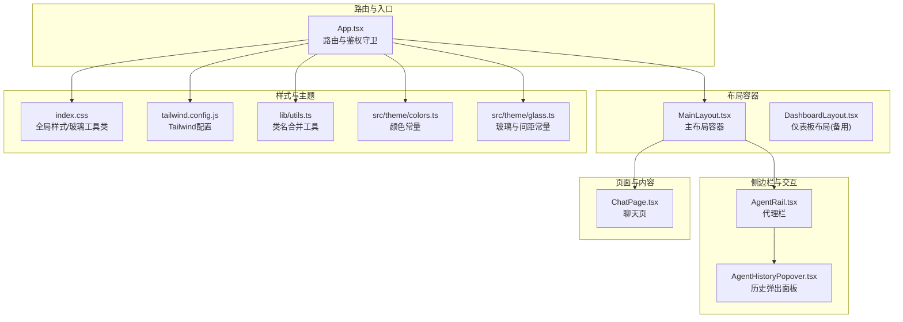
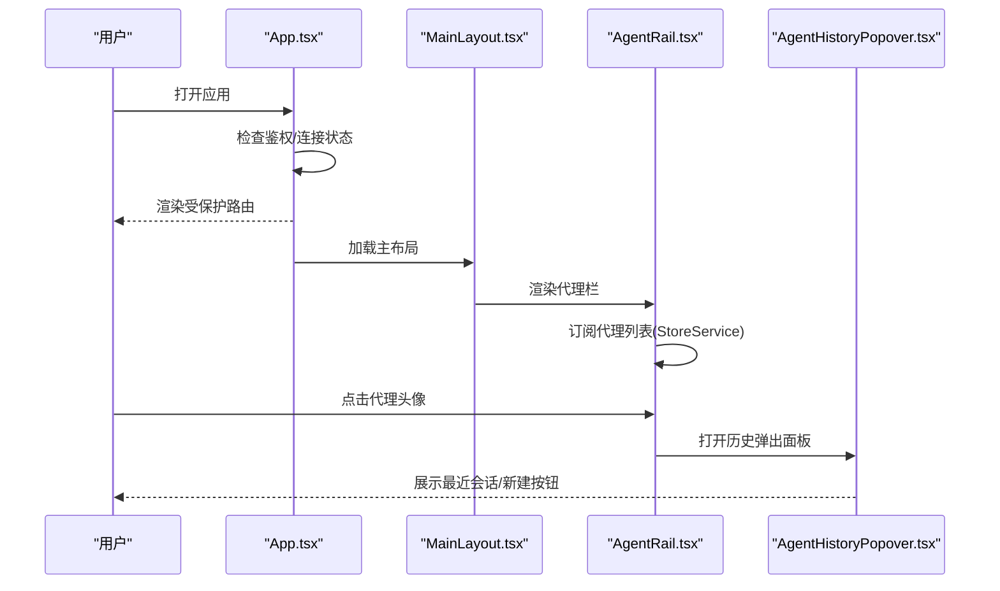
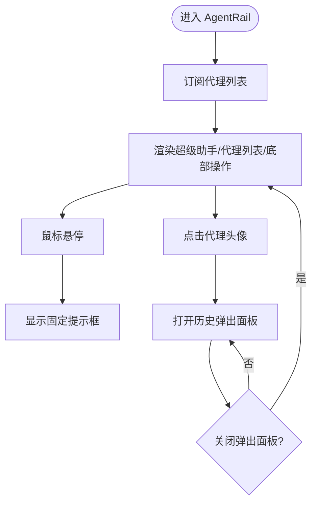
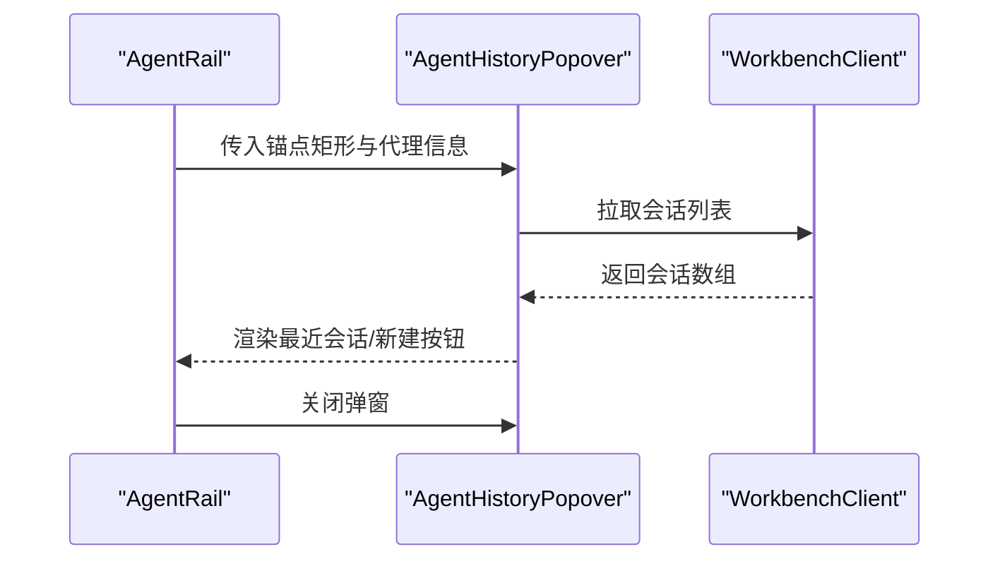
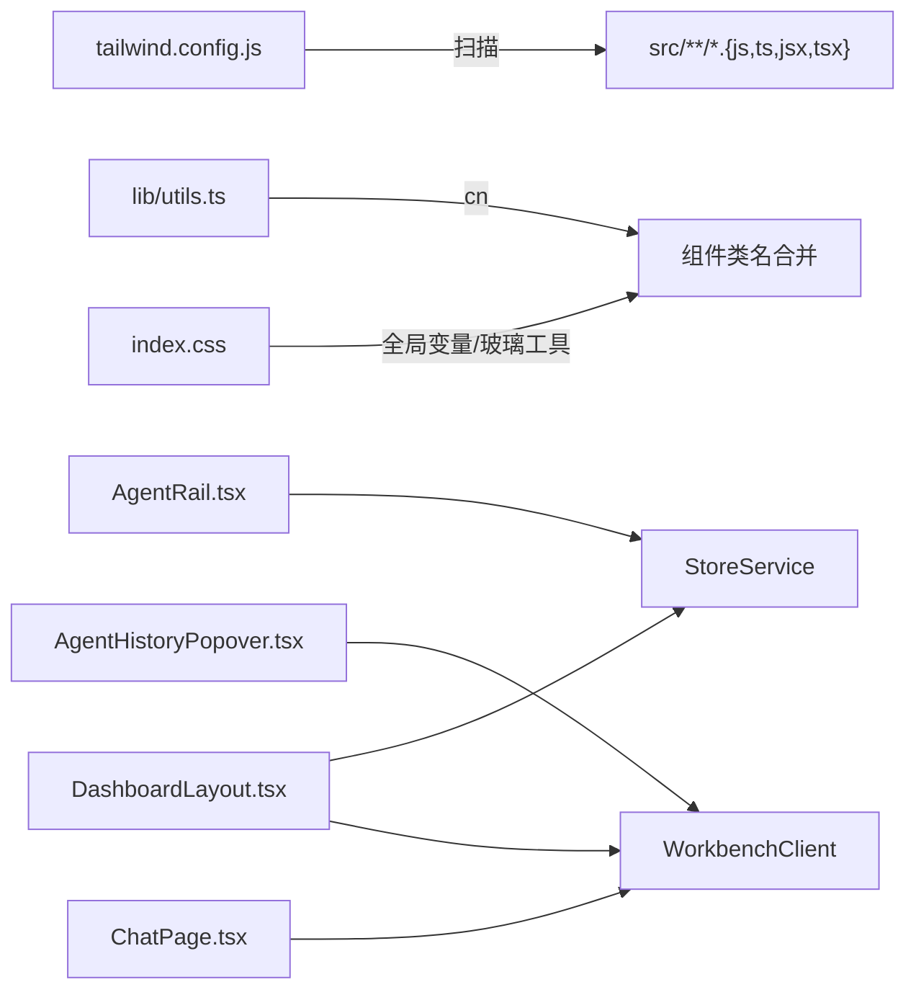

# UI布局系统

<cite>
**本文引用的文件**
- [web-client/src/components/layout/MainLayout.tsx](file://web-client/src/components/layout/MainLayout.tsx)
- [web-client/src/components/layout/AgentRail.tsx](file://web-client/src/components/layout/AgentRail.tsx)
- [web-client/src/components/layout/AgentHistoryPopover.tsx](file://web-client/src/components/layout/AgentHistoryPopover.tsx)
- [web-client/src/components/DashboardLayout.tsx](file://web-client/src/components/DashboardLayout.tsx)
- [web-client/src/pages/ChatPage.tsx](file://web-client/src/pages/ChatPage.tsx)
- [web-client/src/components/ui/glass-card.tsx](file://web-client/src/components/ui/glass-card.tsx)
- [web-client/src/App.tsx](file://web-client/src/App.tsx)
- [web-client/src/index.css](file://web-client/src/index.css)
- [web-client/tailwind.config.js](file://web-client/tailwind.config.js)
- [web-client/package.json](file://web-client/package.json)
- [src/theme/colors.ts](file://src/theme/colors.ts)
- [src/theme/glass.ts](file://src/theme/glass.ts)
- [web-client/src/lib/utils.ts](file://web-client/src/lib/utils.ts)
</cite>

## 目录
1. [简介](#简介)
2. [项目结构](#项目结构)
3. [核心组件](#核心组件)
4. [架构总览](#架构总览)
5. [组件详解](#组件详解)
6. [依赖关系分析](#依赖关系分析)
7. [性能与体验](#性能与体验)
8. [故障排查指南](#故障排查指南)
9. [结论](#结论)
10. [附录：样式与主题规范](#附录样式与主题规范)

## 简介
本文件系统性梳理 Web 客户端的 UI 布局体系，聚焦基于 TailwindCSS 的样式架构与设计系统，覆盖颜色体系、字体排版、间距规范；深入解析主布局组件（侧边栏导航、主内容区、响应式布局）的设计原理；详解 Agent Rail 代理栏的实现与交互；阐释玻璃拟态（glass morphism）效果的技术实现与视觉原则；提供组件库使用与自定义样式的实践方法，并给出移动端适配与跨浏览器兼容策略。

## 项目结构
Web 客户端采用 React + Vite 构建，TailwindCSS v4 作为原子化样式框架，配合 Framer Motion 实现动效，Lucide React 提供图标，clsx/tailwind-merge 统一类名合并，zustand 管理状态。布局系统主要由路由层、主布局容器、侧边栏与弹出面板、以及页面级组件构成。

**图表来源**
- [web-client/src/App.tsx:1-147](file://web-client/src/App.tsx#L1-L147)
- [web-client/src/components/layout/MainLayout.tsx:1-24](file://web-client/src/components/layout/MainLayout.tsx#L1-L24)
- [web-client/src/components/layout/AgentRail.tsx:1-179](file://web-client/src/components/layout/AgentRail.tsx#L1-L179)
- [web-client/src/components/layout/AgentHistoryPopover.tsx:1-165](file://web-client/src/components/layout/AgentHistoryPopover.tsx#L1-L165)
- [web-client/src/components/DashboardLayout.tsx:1-282](file://web-client/src/components/DashboardLayout.tsx#L1-L282)
- [web-client/src/pages/ChatPage.tsx:1-490](file://web-client/src/pages/ChatPage.tsx#L1-L490)
- [web-client/src/index.css:1-105](file://web-client/src/index.css#L1-L105)
- [web-client/tailwind.config.js:1-13](file://web-client/tailwind.config.js#L1-L13)
- [web-client/src/lib/utils.ts:1-7](file://web-client/src/lib/utils.ts#L1-L7)
- [src/theme/colors.ts:1-42](file://src/theme/colors.ts#L1-L42)
- [src/theme/glass.ts:1-187](file://src/theme/glass.ts#L1-L187)

**章节来源**
- [web-client/src/App.tsx:1-147](file://web-client/src/App.tsx#L1-L147)
- [web-client/src/components/layout/MainLayout.tsx:1-24](file://web-client/src/components/layout/MainLayout.tsx#L1-L24)
- [web-client/src/components/layout/AgentRail.tsx:1-179](file://web-client/src/components/layout/AgentRail.tsx#L1-L179)
- [web-client/src/components/layout/AgentHistoryPopover.tsx:1-165](file://web-client/src/components/layout/AgentHistoryPopover.tsx#L1-L165)
- [web-client/src/components/DashboardLayout.tsx:1-282](file://web-client/src/components/DashboardLayout.tsx#L1-L282)
- [web-client/src/pages/ChatPage.tsx:1-490](file://web-client/src/pages/ChatPage.tsx#L1-L490)
- [web-client/src/index.css:1-105](file://web-client/src/index.css#L1-L105)
- [web-client/tailwind.config.js:1-13](file://web-client/tailwind.config.js#L1-L13)
- [web-client/src/lib/utils.ts:1-7](file://web-client/src/lib/utils.ts#L1-L7)
- [src/theme/colors.ts:1-42](file://src/theme/colors.ts#L1-L42)
- [src/theme/glass.ts:1-187](file://src/theme/glass.ts#L1-L187)

## 核心组件
- 主布局容器：负责整体布局骨架与 Outlet 内容渲染，承载侧边栏与主内容区。
- 代理栏（Agent Rail）：左侧固定导航，包含超级助手入口、代理列表、底部操作、悬停提示与历史弹出面板。
- 历史弹出面板：点击代理头像时展示最近会话列表，支持新建会话或打开历史会话。
- 聊天页：主内容区的核心页面，包含消息流、输入区、模型选择、功能开关等。
- 玻璃卡片组件：通用的玻璃拟态容器，支持悬停高光与倾斜动效。
- 全局样式与主题：通过 CSS 变量与 Tailwind 工具类统一背景、玻璃、渐变与动画。

**章节来源**
- [web-client/src/components/layout/MainLayout.tsx:1-24](file://web-client/src/components/layout/MainLayout.tsx#L1-L24)
- [web-client/src/components/layout/AgentRail.tsx:1-179](file://web-client/src/components/layout/AgentRail.tsx#L1-L179)
- [web-client/src/components/layout/AgentHistoryPopover.tsx:1-165](file://web-client/src/components/layout/AgentHistoryPopover.tsx#L1-L165)
- [web-client/src/pages/ChatPage.tsx:1-490](file://web-client/src/pages/ChatPage.tsx#L1-L490)
- [web-client/src/components/ui/glass-card.tsx:1-58](file://web-client/src/components/ui/glass-card.tsx#L1-L58)
- [web-client/src/index.css:1-105](file://web-client/src/index.css#L1-L105)

## 架构总览
应用通过路由守卫控制登录态与连接状态，进入受保护路由后加载主布局容器。主布局容器内嵌 Agent Rail 与 Outlet，Outlet 根据当前路径渲染具体页面（如聊天页）。Agent Rail 通过 StoreService 订阅代理数据，结合 Framer Motion 实现平滑动效与高亮指示器；点击代理头像触发历史弹出面板，展示最近会话并支持新建会话。

**图表来源**
- [web-client/src/App.tsx:1-147](file://web-client/src/App.tsx#L1-L147)
- [web-client/src/components/layout/MainLayout.tsx:1-24](file://web-client/src/components/layout/MainLayout.tsx#L1-L24)
- [web-client/src/components/layout/AgentRail.tsx:1-179](file://web-client/src/components/layout/AgentRail.tsx#L1-L179)
- [web-client/src/components/layout/AgentHistoryPopover.tsx:1-165](file://web-client/src/components/layout/AgentHistoryPopover.tsx#L1-L165)

## 组件详解

### 主布局容器（MainLayout）
- 结构职责：提供全屏布局骨架，左侧放置 Agent Rail，右侧为 Outlet 占位，用于渲染当前页面。
- 样式要点：使用 Flex 布局与相对定位，右侧内容区设置 z-index 与溢出隐藏，确保弹出层与滚动区域正确层级。
- 路由集成：与 App.tsx 的路由守卫配合，仅在认证后渲染。

**章节来源**
- [web-client/src/components/layout/MainLayout.tsx:1-24](file://web-client/src/components/layout/MainLayout.tsx#L1-L24)
- [web-client/src/App.tsx:112-140](file://web-client/src/App.tsx#L112-L140)

### 代理栏（AgentRail）
- 功能概览：
  - 超级助手入口：高亮显示当前激活状态，使用布局动效标识活动轨道。
  - 代理列表：过滤并截取前若干个代理，支持悬停缩放与环形高亮。
  - 底部操作：库与设置入口，根据路径高亮。
  - 新建代理：跳转至广场（Plaza）进行新增。
  - 历史弹出：点击代理头像弹出最近会话面板。
  - 悬停提示：固定定位的提示框，跟随鼠标位置。
- 交互细节：
  - 使用 Framer Motion 的 layoutId 实现活动指示器的平滑过渡。
  - 使用 clsx 合并条件类名，动态切换激活态与悬停态。
  - 通过 StoreService 获取代理列表，订阅更新事件。
- 样式要点：
  - 固定宽度与圆角背景，使用 backdrop-blur 与半透明边框实现玻璃感。
  - 激活态使用品牌色阴影与高亮边框，悬停态提升对比度。

**图表来源**
- [web-client/src/components/layout/AgentRail.tsx:1-179](file://web-client/src/components/layout/AgentRail.tsx#L1-L179)

**章节来源**
- [web-client/src/components/layout/AgentRail.tsx:1-179](file://web-client/src/components/layout/AgentRail.tsx#L1-L179)

### 历史弹出面板（AgentHistoryPopover）
- 功能概览：在指定锚点右侧展示最近会话列表，支持新建会话与打开历史会话。
- 交互细节：
  - 使用 Framer Motion 实现弹入/弹出动画。
  - 点击外部区域自动关闭。
  - 从 WorkbenchClient 拉取会话数据并按时间排序。
- 样式要点：使用 GlassCard 作为容器，内部采用分组与悬停态增强可读性。

**图表来源**
- [web-client/src/components/layout/AgentRail.tsx:154-163](file://web-client/src/components/layout/AgentRail.tsx#L154-L163)
- [web-client/src/components/layout/AgentHistoryPopover.tsx:1-165](file://web-client/src/components/layout/AgentHistoryPopover.tsx#L1-L165)

**章节来源**
- [web-client/src/components/layout/AgentHistoryPopover.tsx:1-165](file://web-client/src/components/layout/AgentHistoryPopover.tsx#L1-L165)

### 聊天页（ChatPage）
- 功能概览：渲染消息流、输入区、模型选择、功能开关（RAG/Web搜索/推理）、令牌统计与滚动控制。
- 交互细节：
  - 自适应文本域高度，支持多行输入。
  - 滚动到底部与“回到底部”悬浮按钮联动。
  - 流式生成状态管理与中止能力。
- 样式要点：使用渐变边框、玻璃输入与模糊背景，营造沉浸式对话环境。

**章节来源**
- [web-client/src/pages/ChatPage.tsx:1-490](file://web-client/src/pages/ChatPage.tsx#L1-L490)

### 玻璃卡片组件（GlassCard）
- 功能概览：通用的玻璃拟态容器，支持鼠标跟踪高光与悬停缩放。
- 技术要点：
  - 使用 Framer Motion 的 useMotionValue 与 useMotionTemplate 实现径向高光。
  - 使用 cn 合并类名，确保样式可叠加与覆盖。
- 适用场景：弹出面板、卡片、悬浮层等需要半透明与模糊背景的 UI。

**章节来源**
- [web-client/src/components/ui/glass-card.tsx:1-58](file://web-client/src/components/ui/glass-card.tsx#L1-L58)
- [web-client/src/lib/utils.ts:1-7](file://web-client/src/lib/utils.ts#L1-L7)

### 备用仪表板布局（DashboardLayout）
- 功能概览：移动端抽屉式侧边栏，包含主菜单、代理与会话树、连接状态与登出。
- 交互细节：
  - 移动端点击菜单按钮展开侧边栏，点击遮罩层收起。
  - 支持展开/折叠代理分组，点击新建会话。
- 样式要点：使用 backdrop-blur-xl 实现玻璃效果，深浅主题下边框与背景色一致。

**章节来源**
- [web-client/src/components/DashboardLayout.tsx:1-282](file://web-client/src/components/DashboardLayout.tsx#L1-L282)

## 依赖关系分析
- 样式与工具
  - TailwindCSS v4：作为原子化样式基础，通过 tailwind.config.js 指定扫描范围。
  - clsx 与 tailwind-merge：统一类名合并，避免冲突与重复。
  - index.css：提供全局变量、玻璃工具类与动画，补充 Tailwind 未覆盖的视觉细节。
- 动效与图标
  - Framer Motion：用于 AgentRail 的活动指示器与弹出面板的入场/出场动画。
  - Lucide React：提供统一图标配色与尺寸。
- 状态与服务
  - StoreService：提供代理列表与会话树数据，AgentRail 与 DashboardLayout 订阅更新。
  - WorkbenchClient：提供会话、消息与配置等运行时数据，ChatPage 与 AgentHistoryPopover 使用。

**图表来源**
- [web-client/tailwind.config.js:1-13](file://web-client/tailwind.config.js#L1-L13)
- [web-client/src/lib/utils.ts:1-7](file://web-client/src/lib/utils.ts#L1-L7)
- [web-client/src/index.css:1-105](file://web-client/src/index.css#L1-L105)
- [web-client/src/components/layout/AgentRail.tsx:1-179](file://web-client/src/components/layout/AgentRail.tsx#L1-L179)
- [web-client/src/components/layout/AgentHistoryPopover.tsx:1-165](file://web-client/src/components/layout/AgentHistoryPopover.tsx#L1-L165)
- [web-client/src/pages/ChatPage.tsx:1-490](file://web-client/src/pages/ChatPage.tsx#L1-L490)
- [web-client/src/components/DashboardLayout.tsx:1-282](file://web-client/src/components/DashboardLayout.tsx#L1-L282)

**章节来源**
- [web-client/package.json:12-32](file://web-client/package.json#L12-L32)
- [web-client/src/App.tsx:1-147](file://web-client/src/App.tsx#L1-L147)

## 性能与体验
- 动画与渲染
  - 使用 Framer Motion 的 layoutId 与 spring 动画，保证活动指示器与弹出面板的流畅过渡。
  - 玻璃卡片的径向高光通过 useMotionValue 与 useMotionTemplate 实现，建议在低端设备上适度降低高光半径或禁用。
- 滚动与布局
  - ChatPage 使用自适应文本域与平滑滚动，避免频繁重排。
  - AgentRail 与 DashboardLayout 的侧边栏均使用 translateX 控制显隐，减少对文档流的影响。
- 交互反馈
  - 悬停态与激活态使用过渡动画，提升可感知性。
  - 提供“回到底部”悬浮按钮，改善长消息流的可访问性。

[本节为通用指导，不直接分析具体文件，故无章节来源]

## 故障排查指南
- 代理列表不更新
  - 检查 StoreService 是否正确初始化与订阅，确认事件名称与回调绑定。
  - 确认 App.tsx 中 AuthGuard 在认证成功后调用 storeService.init。
- 弹出面板无法关闭
  - 检查 AgentHistoryPopover 的点击外部关闭逻辑是否生效。
  - 确认 fixed 定位与 z-index 层级，避免被其他元素遮挡。
- 玻璃效果异常
  - 确认浏览器对 backdrop-filter 的支持，必要时降级为纯色背景。
  - 检查 index.css 中 .glass/.glass-panel 的 backdrop-filter 值。
- 移动端侧边栏问题
  - 检查 DashboardLayout 的 translateX 与 overlay 点击逻辑。
  - 确认移动端样式断点与触摸事件处理。

**章节来源**
- [web-client/src/App.tsx:16-110](file://web-client/src/App.tsx#L16-L110)
- [web-client/src/components/layout/AgentRail.tsx:1-179](file://web-client/src/components/layout/AgentRail.tsx#L1-L179)
- [web-client/src/components/layout/AgentHistoryPopover.tsx:1-165](file://web-client/src/components/layout/AgentHistoryPopover.tsx#L1-L165)
- [web-client/src/index.css:40-80](file://web-client/src/index.css#L40-L80)
- [web-client/src/components/DashboardLayout.tsx:80-120](file://web-client/src/components/DashboardLayout.tsx#L80-L120)

## 结论
该 UI 布局系统以 TailwindCSS 为核心，结合 CSS 变量与玻璃工具类，构建了统一的视觉语言；通过 Agent Rail 与历史弹出面板实现高效代理与会话导航；借助 Framer Motion 提升交互流畅度。整体架构清晰、模块职责明确，具备良好的扩展性与可维护性。

[本节为总结性内容，不直接分析具体文件，故无章节来源]

## 附录：样式与主题规范

### 颜色体系
- 品牌色：主色、深色、浅色用于强调与高亮。
- 状态色：成功、错误、警告、信息用于反馈与状态指示。
- 灰阶/语义色：明暗两套背景、表面、文本与边框色，满足深浅主题一致性。

**章节来源**
- [src/theme/colors.ts:1-42](file://src/theme/colors.ts#L1-L42)

### 字体排版与间距
- 字体：默认使用 Inter，保证跨平台可读性与抗锯齿。
- 间距：遵循 4px 基础单位，提供常用间距预设，便于组件间对齐与留白。

**章节来源**
- [web-client/src/index.css:3-27](file://web-client/src/index.css#L3-L27)
- [src/theme/glass.ts:146-187](file://src/theme/glass.ts#L146-L187)

### 玻璃拟态（Glass Morphism）实现与原则
- 技术实现
  - CSS 变量：通过 --glass-bg、--glass-border 控制背景与边框，配合 backdrop-filter blur 达到模糊效果。
  - 组件封装：GlassCard 封装通用玻璃容器，支持鼠标跟踪高光与悬停缩放。
- 视觉原则
  - 背景半透明白/黑基底，搭配低强度边框与阴影，确保内容可读性与层次感。
  - 不同场景采用不同模糊强度与透明度：头部/输入区（高模糊低透明）、浮层（中模糊中透明）、底部面板（低模糊高透明）。

**章节来源**
- [web-client/src/index.css:40-80](file://web-client/src/index.css#L40-L80)
- [web-client/src/components/ui/glass-card.tsx:1-58](file://web-client/src/components/ui/glass-card.tsx#L1-L58)
- [src/theme/glass.ts:12-68](file://src/theme/glass.ts#L12-L68)

### 组件库使用与自定义样式
- 类名合并：统一使用 cn 工具，避免重复与冲突。
- 玻璃容器：优先使用 GlassCard，按需开启 enableTilt 与自定义 spotlightColor。
- 动效：使用 Framer Motion 的基础动效 API，保持与现有动画风格一致。

**章节来源**
- [web-client/src/lib/utils.ts:1-7](file://web-client/src/lib/utils.ts#L1-L7)
- [web-client/src/components/ui/glass-card.tsx:12-38](file://web-client/src/components/ui/glass-card.tsx#L12-L38)
- [web-client/package.json:17-31](file://web-client/package.json#L17-L31)

### 移动端适配与跨浏览器兼容
- 移动端适配
  - DashboardLayout 提供抽屉式侧边栏与移动端头部触发器，使用 translateX 控制显隐。
  - ChatPage 的输入区与消息流在小屏设备上优化滚动与留白。
- 跨浏览器兼容
  - backdrop-filter 在部分浏览器存在兼容性问题，建议提供降级方案（纯色背景）。
  - Tailwind v4 与 PostCSS/Autoprefixer 已处理大部分兼容性问题，仍需关注个别属性支持情况。

**章节来源**
- [web-client/src/components/DashboardLayout.tsx:21-120](file://web-client/src/components/DashboardLayout.tsx#L21-L120)
- [web-client/src/pages/ChatPage.tsx:465-486](file://web-client/src/pages/ChatPage.tsx#L465-L486)
- [web-client/src/index.css:40-56](file://web-client/src/index.css#L40-L56)
- [web-client/package.json:33-49](file://web-client/package.json#L33-L49)