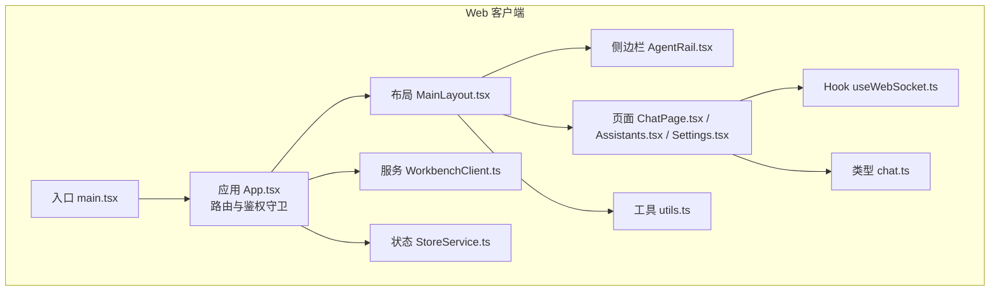
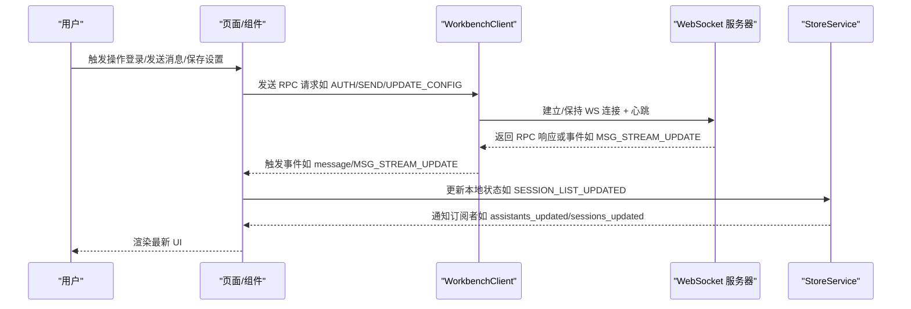
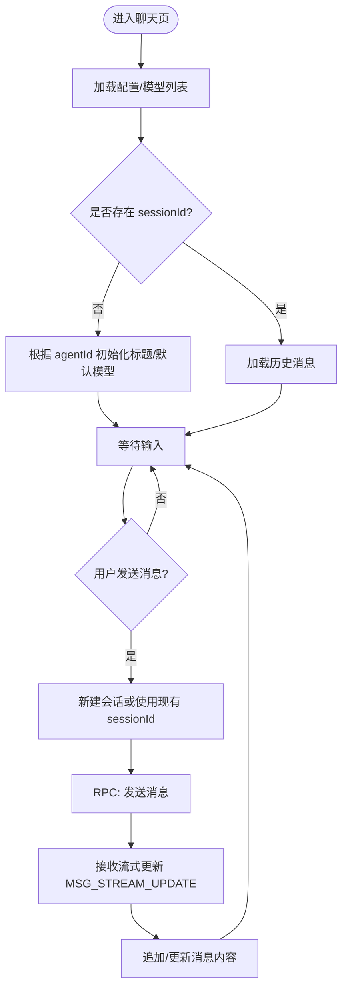
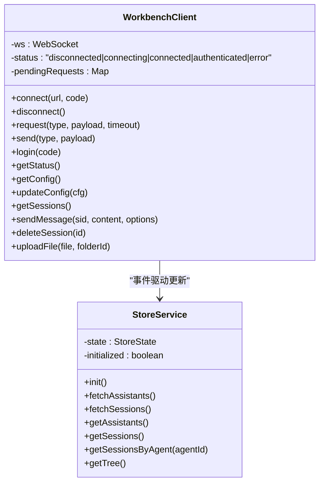
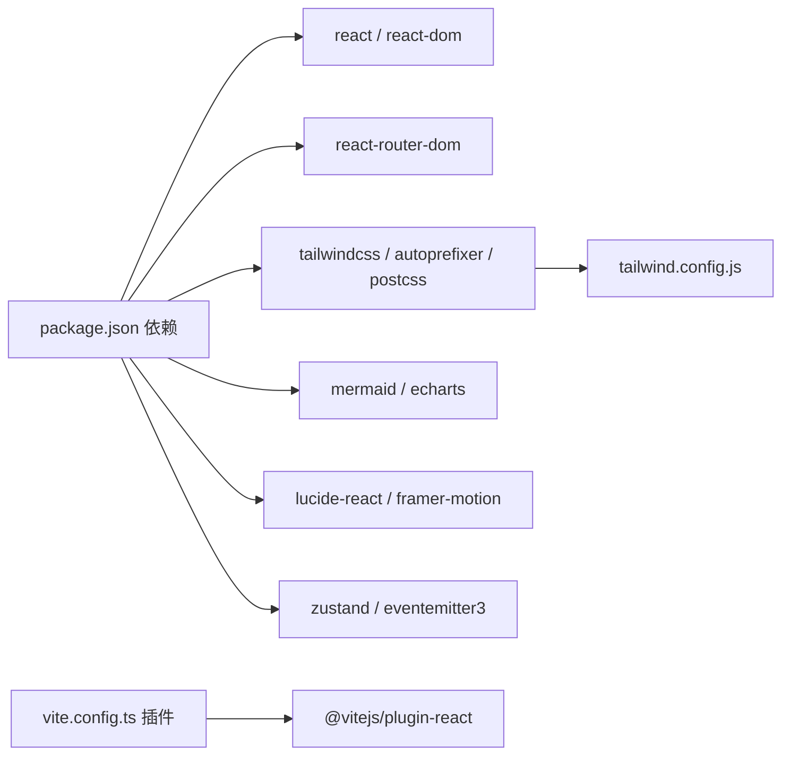

# Web客户端

<cite>
**本文引用的文件**   
- [web-client/package.json](file://web-client/package.json)
- [web-client/vite.config.ts](file://web-client/vite.config.ts)
- [web-client/tailwind.config.js](file://web-client/tailwind.config.js)
- [web-client/src/main.tsx](file://web-client/src/main.tsx)
- [web-client/src/App.tsx](file://web-client/src/App.tsx)
- [web-client/src/services/WorkbenchClient.ts](file://web-client/src/services/WorkbenchClient.ts)
- [web-client/src/services/StoreService.ts](file://web-client/src/services/StoreService.ts)
- [web-client/src/hooks/useWebSocket.ts](file://web-client/src/hooks/useWebSocket.ts)
- [web-client/src/pages/ChatPage.tsx](file://web-client/src/pages/ChatPage.tsx)
- [web-client/src/components/layout/MainLayout.tsx](file://web-client/src/components/layout/MainLayout.tsx)
- [web-client/src/components/layout/AgentRail.tsx](file://web-client/src/components/layout/AgentRail.tsx)
- [web-client/src/pages/Assistants.tsx](file://web-client/src/pages/Assistants.tsx)
- [web-client/src/pages/Settings.tsx](file://web-client/src/pages/Settings.tsx)
- [web-client/src/types/chat.ts](file://web-client/src/types/chat.ts)
- [web-client/src/lib/utils.ts](file://web-client/src/lib/utils.ts)
</cite>

## 目录
1. [简介](#简介)
2. [项目结构](#项目结构)
3. [核心组件](#核心组件)
4. [架构总览](#架构总览)
5. [详细组件分析](#详细组件分析)
6. [依赖关系分析](#依赖关系分析)
7. [性能考虑](#性能考虑)
8. [故障排除指南](#故障排除指南)
9. [结论](#结论)
10. [附录](#附录)

## 简介
本文件为 Nexara Web 客户端（web-client）的详细技术文档，面向前端工程师与产品/运营人员，系统阐述 Web 客户端的架构设计、构建配置、UI 组件组织、与移动端工作台（Workbench）的通信机制（WebSocket、RPC 请求/响应）、以及关键页面（助手管理、聊天界面、设置面板等）的实现逻辑与用户体验设计。同时提供部署与性能优化建议、开发调试与故障排除方法。

## 项目结构
Web 客户端采用 Vite + React 18 + TailwindCSS 的现代前端栈，代码位于 web-client 目录中，主要目录与职责如下：
- src：应用源码
  - components：可复用 UI 组件与布局组件
  - pages：页面级组件（路由对应）
  - services：与后端通信的服务封装（WorkbenchClient、StoreService）
  - hooks：自定义 Hook（如 useWebSocket）
  - types：类型定义
  - lib：工具函数与国际化等
- public：静态资源
- 构建与样式配置：vite.config.ts、tailwind.config.js、package.json、postcss.config.js 等

图表来源
- [web-client/src/main.tsx:1-11](file://web-client/src/main.tsx#L1-L11)
- [web-client/src/App.tsx:1-147](file://web-client/src/App.tsx#L1-L147)
- [web-client/src/components/layout/MainLayout.tsx:1-24](file://web-client/src/components/layout/MainLayout.tsx#L1-L24)
- [web-client/src/components/layout/AgentRail.tsx:1-179](file://web-client/src/components/layout/AgentRail.tsx#L1-L179)
- [web-client/src/pages/ChatPage.tsx:1-490](file://web-client/src/pages/ChatPage.tsx#L1-L490)
- [web-client/src/pages/Assistants.tsx:1-126](file://web-client/src/pages/Assistants.tsx#L1-L126)
- [web-client/src/pages/Settings.tsx:1-303](file://web-client/src/pages/Settings.tsx#L1-L303)
- [web-client/src/services/WorkbenchClient.ts:1-317](file://web-client/src/services/WorkbenchClient.ts#L1-L317)
- [web-client/src/services/StoreService.ts:1-136](file://web-client/src/services/StoreService.ts#L1-L136)
- [web-client/src/hooks/useWebSocket.ts:1-115](file://web-client/src/hooks/useWebSocket.ts#L1-L115)
- [web-client/src/types/chat.ts:1-31](file://web-client/src/types/chat.ts#L1-L31)
- [web-client/src/lib/utils.ts:1-7](file://web-client/src/lib/utils.ts#L1-L7)

章节来源
- [web-client/package.json:1-52](file://web-client/package.json#L1-L52)
- [web-client/vite.config.ts:1-17](file://web-client/vite.config.ts#L1-L17)
- [web-client/tailwind.config.js:1-13](file://web-client/tailwind.config.js#L1-L13)
- [web-client/src/main.tsx:1-11](file://web-client/src/main.tsx#L1-L11)
- [web-client/src/App.tsx:1-147](file://web-client/src/App.tsx#L1-L147)

## 核心组件
- 应用入口与路由
  - 入口：在 main.tsx 中挂载 StrictMode 与 App。
  - 路由：使用 React Router v6，App.tsx 中定义浏览器路由器与嵌套路由，包含首页、助手、设置、库、知识图谱、聊天页等。
  - 鉴权守卫：AuthGuard 基于 WorkbenchClient 的状态切换登录态，并在断开时进行短暂宽限期避免刷新抖动。
- 通信层
  - WorkbenchClient：封装 WebSocket 连接、心跳、鉴权、RPC 请求/响应、事件派发；提供 CMD_* 方法与文件上传等能力。
  - StoreService：基于 WorkbenchClient 的事件驱动，维护助手列表、会话树等本地状态，供页面消费。
  - useWebSocket：简化版 Hook，演示如何建立 WS 连接、鉴权、消息流式处理（用于对比理解）。
- 页面与布局
  - MainLayout：左侧 AgentRail + 主内容区 Outlet。
  - AgentRail：展示助手列表、超级助手入口、库与设置导航、悬浮历史弹出层与提示气泡。
  - ChatPage：聊天主界面，支持模型选择、RAG/Web 搜索/推理开关、流式消息更新、滚动控制、令牌统计等。
  - Assistants：助手列表与搜索。
  - Settings：多分区设置页，含通用、模型、RAG 基础/检索/知识图谱、备份、用量等。
- 工具与样式
  - utils.ts：clsx + tailwind-merge 的合并工具。
  - Tailwind：content 覆盖 src 下所有文件，按需生成样式。

章节来源
- [web-client/src/main.tsx:1-11](file://web-client/src/main.tsx#L1-L11)
- [web-client/src/App.tsx:1-147](file://web-client/src/App.tsx#L1-L147)
- [web-client/src/services/WorkbenchClient.ts:1-317](file://web-client/src/services/WorkbenchClient.ts#L1-L317)
- [web-client/src/services/StoreService.ts:1-136](file://web-client/src/services/StoreService.ts#L1-L136)
- [web-client/src/hooks/useWebSocket.ts:1-115](file://web-client/src/hooks/useWebSocket.ts#L1-L115)
- [web-client/src/components/layout/MainLayout.tsx:1-24](file://web-client/src/components/layout/MainLayout.tsx#L1-L24)
- [web-client/src/components/layout/AgentRail.tsx:1-179](file://web-client/src/components/layout/AgentRail.tsx#L1-L179)
- [web-client/src/pages/ChatPage.tsx:1-490](file://web-client/src/pages/ChatPage.tsx#L1-L490)
- [web-client/src/pages/Assistants.tsx:1-126](file://web-client/src/pages/Assistants.tsx#L1-L126)
- [web-client/src/pages/Settings.tsx:1-303](file://web-client/src/pages/Settings.tsx#L1-L303)
- [web-client/src/lib/utils.ts:1-7](file://web-client/src/lib/utils.ts#L1-L7)
- [web-client/tailwind.config.js:1-13](file://web-client/tailwind.config.js#L1-L13)

## 架构总览
Web 客户端通过 WorkbenchClient 与后端工作台建立长连接，采用 RPC 消息协议进行命令调用与事件订阅。StoreService 将后端推送的状态转换为本地可观察的数据结构，页面组件通过事件监听与请求方法完成交互。

图表来源
- [web-client/src/services/WorkbenchClient.ts:1-317](file://web-client/src/services/WorkbenchClient.ts#L1-L317)
- [web-client/src/services/StoreService.ts:1-136](file://web-client/src/services/StoreService.ts#L1-L136)
- [web-client/src/App.tsx:1-147](file://web-client/src/App.tsx#L1-L147)

## 详细组件分析

### 应用与路由（App.tsx）
- 功能要点
  - 使用 React Router 浏览器路由器，定义根路由与子路由，支持重定向与兜底。
  - 鉴权守卫：根据本地 token 与 WorkbenchClient 状态决定是否进入受保护区域；断线时提供 2.5 秒宽限期避免频繁闪烁。
  - 初始化：认证成功后初始化 StoreService，确保助手与会话数据可用。
- 关键流程
  - 初始检查：读取本地 token，若存在则尝试连接；否则直接进入登录态。
  - 状态变更：监听 statusChange 与 auth_fail，动态切换登录态与 UI。
  - 路由渲染：受保护区域包裹 MainLayout，再由 MainLayout 的 Outlet 渲染具体页面。

章节来源
- [web-client/src/App.tsx:1-147](file://web-client/src/App.tsx#L1-L147)

### 布局与导航（MainLayout.tsx、AgentRail.tsx）
- MainLayout
  - 结构：左侧 AgentRail + 右侧 Outlet 占位，整体相对定位，便于子页面叠加元素。
- AgentRail
  - 功能：超级助手入口、助手列表（过滤与截断）、库/设置导航、悬浮历史弹窗、悬停标签提示。
  - 交互：点击展开助手历史弹窗，鼠标悬停显示标签；根据当前路径高亮指示。
  - 性能：仅渲染前若干助手，避免大列表渲染压力。

章节来源
- [web-client/src/components/layout/MainLayout.tsx:1-24](file://web-client/src/components/layout/MainLayout.tsx#L1-L24)
- [web-client/src/components/layout/AgentRail.tsx:1-179](file://web-client/src/components/layout/AgentRail.tsx#L1-L179)

### 聊天界面（ChatPage.tsx）
- 功能要点
  - 会话加载：根据 sessionId 获取历史消息与标题；首次加载时显示加载态。
  - 流式渲染：监听 MSG_STREAM_UPDATE/MSG_STREAM_COMPLETE，增量更新消息内容；生成结束自动刷新历史。
  - 模型选择：从配置中拉取可用模型，格式化名称；默认选中助手默认模型。
  - 控制项：RAG 开关、Web 搜索、推理开关，均持久化到本地存储。
  - 用户体验：输入框自适应高度、滚动到底部按钮、生成中状态指示、令牌统计。
  - 交互：发送消息（支持回车）、中止生成、删除/重算消息、删除会话。
- 关键流程
  - 新建会话：若无 sessionId 且有 agentId，则先创建会话并更新 URL，再发送消息。
  - 乐观 UI：先插入临时用户消息，再发起 RPC，保证交互即时性。
  - 事件驱动：通过 WorkbenchClient 的 message 事件统一处理各类状态变化。

图表来源
- [web-client/src/pages/ChatPage.tsx:1-490](file://web-client/src/pages/ChatPage.tsx#L1-L490)
- [web-client/src/types/chat.ts:1-31](file://web-client/src/types/chat.ts#L1-L31)

章节来源
- [web-client/src/pages/ChatPage.tsx:1-490](file://web-client/src/pages/ChatPage.tsx#L1-L490)
- [web-client/src/types/chat.ts:1-31](file://web-client/src/types/chat.ts#L1-L31)

### 助手管理（Assistants.tsx）
- 功能要点
  - 展示助手卡片：颜色、名称、描述、默认模型、预设标识。
  - 搜索过滤：按名称/描述模糊匹配。
  - 操作入口：创建助手、编辑、删除（占位）。
- 数据来源：通过 WorkbenchClient.request('CMD_GET_AGENTS') 拉取助手列表。

章节来源
- [web-client/src/pages/Assistants.tsx:1-126](file://web-client/src/pages/Assistants.tsx#L1-L126)

### 设置面板（Settings.tsx）
- 功能要点
  - 多分区设置：通用、模型、RAG 基础/检索/知识图谱、备份、用量。
  - 配置加载：workbenchClient.getConfig()；保存：updateConfig。
  - 模型管理：增删提供方、启用/禁用模型、切换能力（联网/视觉/推理）。
  - RAG 配置：分节更新 rag 字段。
- 交互：使用动画过渡切换分区，保存按钮统一提交。

章节来源
- [web-client/src/pages/Settings.tsx:1-303](file://web-client/src/pages/Settings.tsx#L1-L303)

### 通信与状态（WorkbenchClient.ts、StoreService.ts）
- WorkbenchClient
  - 连接与鉴权：connect(url, code) → ws.onopen → AUTH；支持 token 与 access code 两种方式。
  - 心跳：每 10 秒发送一次 HEARTBEAT，维持连接活性。
  - RPC：request() 生成随机 id（本地回退），超时处理；send() 直接发送。
  - 事件：emit('message'/具体消息类型)，支持 AUTH_OK/AUTH_FAIL 等系统消息。
  - 文件上传：uploadFile() 支持图片（DataURL）与文本文件。
- StoreService
  - 订阅：监听 SESSION_LIST_UPDATED 等事件，触发刷新。
  - 初始化：并发拉取助手与会话，排序与分组（按 agentId）。
  - 查询：提供 getAssistants/getSessions/getSessionsByAgent/getTree。

图表来源
- [web-client/src/services/WorkbenchClient.ts:1-317](file://web-client/src/services/WorkbenchClient.ts#L1-L317)
- [web-client/src/services/StoreService.ts:1-136](file://web-client/src/services/StoreService.ts#L1-L136)

章节来源
- [web-client/src/services/WorkbenchClient.ts:1-317](file://web-client/src/services/WorkbenchClient.ts#L1-L317)
- [web-client/src/services/StoreService.ts:1-136](file://web-client/src/services/StoreService.ts#L1-L136)

### Hook 对比（useWebSocket.ts）
- 作用：演示如何手动建立 WS 连接、鉴权、接收 TOKEN/CHAT_RESPONSE 并更新本地消息数组。
- 与 WorkbenchClient 的差异：该 Hook 更贴近传统 WS 使用场景，而 WorkbenchClient 提供了更完整的 RPC 语义与事件体系。

章节来源
- [web-client/src/hooks/useWebSocket.ts:1-115](file://web-client/src/hooks/useWebSocket.ts#L1-L115)

## 依赖关系分析
- 构建与打包
  - Vite：使用 @vitejs/plugin-react，Rollup 输出文件名带 bundle 后缀，便于缓存控制。
  - TypeScript：分别配置 app/node/工程根配置，确保类型安全。
- 样式系统
  - Tailwind：content 覆盖 src 下全部文件，按需生成类名；未扩展主题，保持简洁。
- 依赖生态
  - React 18、React Router、Lucide Icons、Framer Motion、Tailwind 相关工具、ECharts/Mermaid 等可视化库已声明，实际使用视页面需要。

图表来源
- [web-client/package.json:1-52](file://web-client/package.json#L1-L52)
- [web-client/vite.config.ts:1-17](file://web-client/vite.config.ts#L1-L17)
- [web-client/tailwind.config.js:1-13](file://web-client/tailwind.config.js#L1-L13)

章节来源
- [web-client/package.json:1-52](file://web-client/package.json#L1-L52)
- [web-client/vite.config.ts:1-17](file://web-client/vite.config.ts#L1-L17)
- [web-client/tailwind.config.js:1-13](file://web-client/tailwind.config.js#L1-L13)

## 性能考虑
- 打包与缓存
  - Rollup 输出命名包含 bundle 后缀，有利于长期缓存策略；建议生产环境配合 CDN 与 HTTP 缓存头。
  - 按需引入可视化库（Mermaid/ECharts），避免首屏体积过大。
- 运行时优化
  - ChatPage：消息列表使用稳定 key，避免不必要的重渲染；滚动位置与底部按钮仅在需要时显示。
  - AgentRail：限制助手列表数量，减少 DOM 节点；悬浮弹窗按需渲染。
  - StoreService：批量初始化并发拉取，组织会话树时避免重复计算。
- 样式与主题
  - Tailwind 按需生成，避免全局污染；使用 twMerge 合并类名，减少冲突。
- 网络与连接
  - WorkbenchClient 心跳与错误处理完善；建议在 UI 层增加“重连提示”与“离线提示”。

## 故障排除指南
- 登录/鉴权问题
  - 现象：长时间停留在连接中或反复回到登录页。
  - 排查：检查本地 wb_token 是否有效；确认 WorkbenchClient 的 statusChange 事件是否收到 AUTH_OK/AUTH_FAIL；必要时清除无效 token。
- 连接中断
  - 现象：页面提示断开或无法发送消息。
  - 排查：查看 WS 地址协议（http→ws）与端口（3000→3001）是否正确；确认心跳是否持续；检查浏览器网络面板与后端日志。
- 聊天无响应
  - 现象：发送消息后无流式更新。
  - 排查：确认 MSG_STREAM_UPDATE/MSG_STREAM_COMPLETE 事件是否到达；检查 WorkbenchClient.request('CMD_SEND_MESSAGE') 是否返回；查看 StoreService 是否触发 SESSION_LIST_UPDATED。
- 设置保存失败
  - 现象：点击保存无反馈或报错。
  - 排查：检查 workbenchClient.updateConfig 的返回；确认后端是否接受当前配置结构。
- 样式异常
  - 现象：类名冲突或样式不生效。
  - 排查：确认 Tailwind content 路径覆盖到目标文件；使用 twMerge 合并类名；避免内联样式覆盖。

章节来源
- [web-client/src/services/WorkbenchClient.ts:1-317](file://web-client/src/services/WorkbenchClient.ts#L1-L317)
- [web-client/src/App.tsx:1-147](file://web-client/src/App.tsx#L1-L147)
- [web-client/src/pages/ChatPage.tsx:1-490](file://web-client/src/pages/ChatPage.tsx#L1-L490)
- [web-client/src/pages/Settings.tsx:1-303](file://web-client/src/pages/Settings.tsx#L1-L303)
- [web-client/tailwind.config.js:1-13](file://web-client/tailwind.config.js#L1-L13)

## 结论
Web 客户端以清晰的分层架构实现了与移动端工作台的高效通信：通过 WorkbenchClient 抽象出稳定的 RPC 语义与事件系统，StoreService 将后端状态转化为本地可观测数据，页面组件围绕事件与请求进行交互。结合 TailwindCSS 的实用样式体系与 React 18 的特性，Web 客户端在功能完整性与用户体验上达到良好平衡。后续可在缓存策略、离线提示、可视化按需加载等方面进一步优化。

## 附录
- 部署建议
  - 构建：使用 npm run build 生成静态产物；确保 public 目录与 index.html 正确。
  - 代理：若后端运行在不同主机/端口，需在 Vite 或反向代理中配置跨域与 WS 升级。
  - 安全：生产环境建议启用 HTTPS，避免本地 HTTP 上的令牌与访问码风险。
- 开发调试
  - 使用浏览器开发者工具监控 Network 面板中的 WS 事件与 RPC 响应。
  - 在 App.tsx 中的日志输出有助于定位鉴权与连接状态问题。
  - StoreService 的事件日志可用于验证数据同步是否正常。