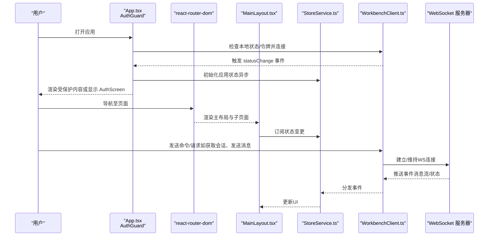
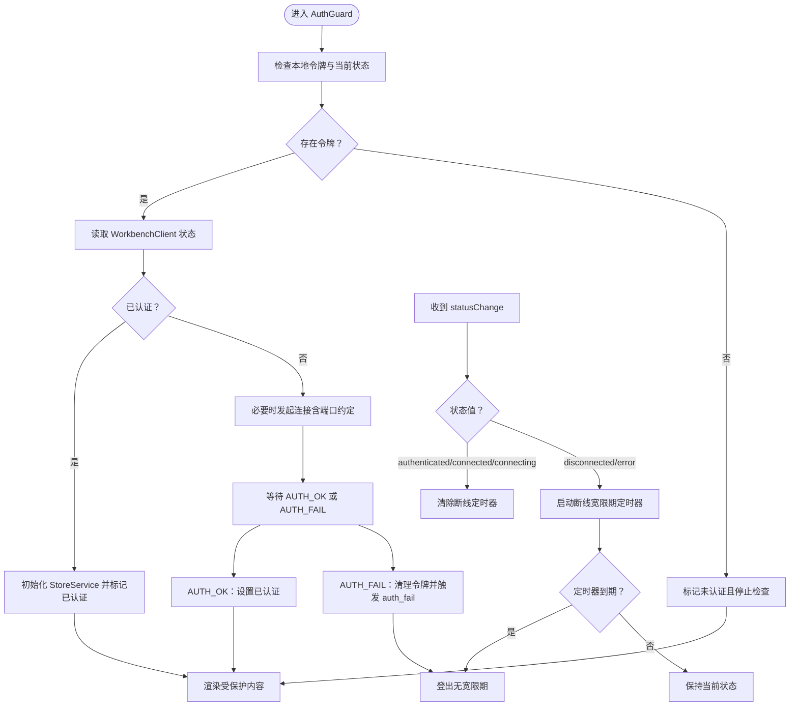
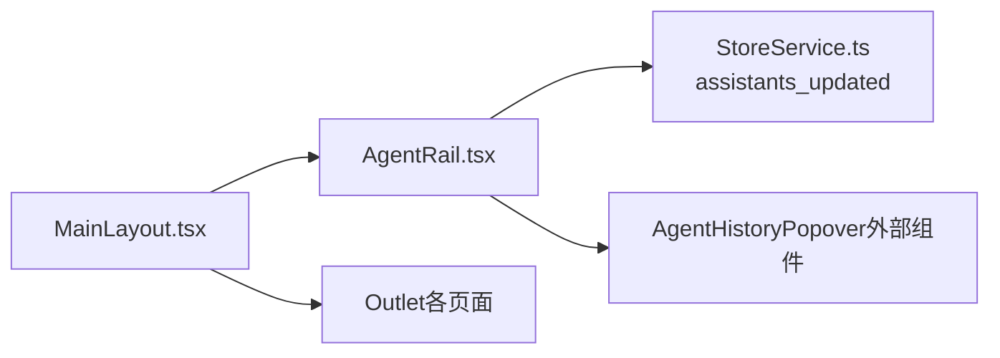
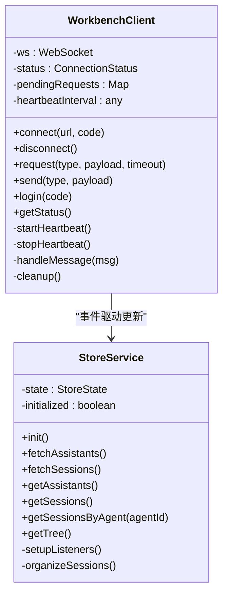
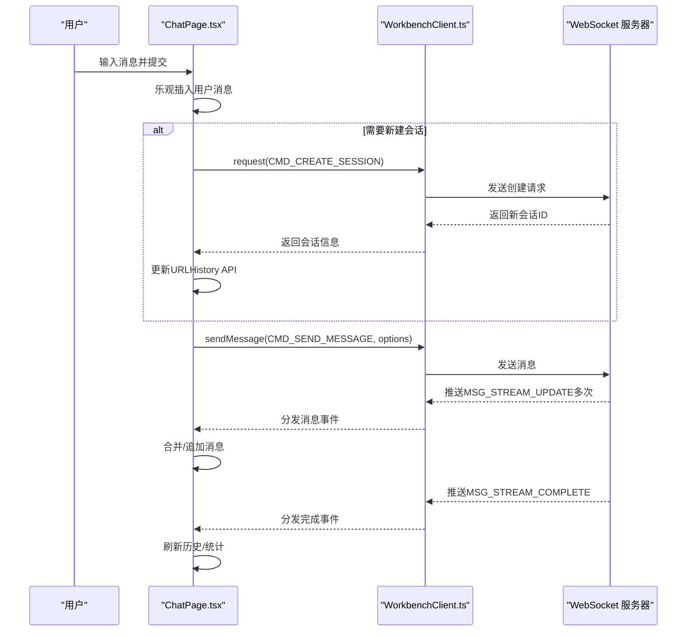
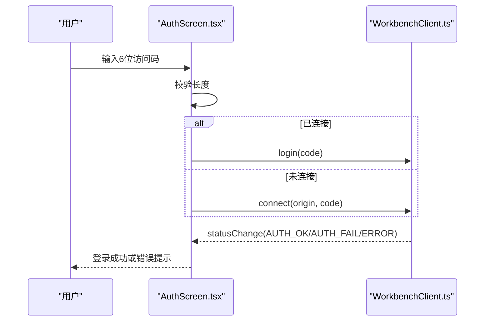
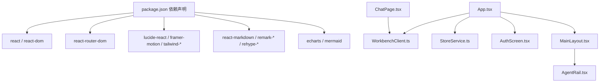

# 架构设计

<cite>
**本文引用的文件**
- [web-client/src/App.tsx](file://web-client/src/App.tsx)
- [web-client/src/main.tsx](file://web-client/src/main.tsx)
- [web-client/vite.config.ts](file://web-client/vite.config.ts)
- [web-client/package.json](file://web-client/package.json)
- [web-client/src/services/WorkbenchClient.ts](file://web-client/src/services/WorkbenchClient.ts)
- [web-client/src/services/StoreService.ts](file://web-client/src/services/StoreService.ts)
- [web-client/src/hooks/useWebSocket.ts](file://web-client/src/hooks/useWebSocket.ts)
- [web-client/src/pages/ChatPage.tsx](file://web-client/src/pages/ChatPage.tsx)
- [web-client/src/components/AuthScreen.tsx](file://web-client/src/components/AuthScreen.tsx)
- [web-client/src/components/layout/MainLayout.tsx](file://web-client/src/components/layout/MainLayout.tsx)
- [web-client/src/components/layout/AgentRail.tsx](file://web-client/src/components/layout/AgentRail.tsx)
- [web-client/tailwind.config.js](file://web-client/tailwind.config.js)
- [web-client/index.html](file://web-client/index.html)
</cite>

## 目录
1. [简介](#简介)
2. [项目结构](#项目结构)
3. [核心组件](#核心组件)
4. [架构总览](#架构总览)
5. [详细组件分析](#详细组件分析)
6. [依赖关系分析](#依赖关系分析)
7. [性能考量](#性能考量)
8. [故障排查指南](#故障排查指南)
9. [结论](#结论)
10. [附录](#附录)

## 简介
本文件面向Nexara Web客户端（基于React 18 + Vite），系统化阐述现代前端架构设计，重点覆盖：
- 路由与认证守卫（AuthGuard）：自动重连、令牌与会话状态管理
- 主布局系统：侧边栏导航、内容区组织与响应式布局
- WebSocket客户端：连接管理、心跳与请求/响应模型
- 状态管理：集中式服务层与事件驱动模式
- 架构决策与权衡：性能优化与可维护性

## 项目结构
Web客户端采用Vite构建，使用React 18作为UI框架，TailwindCSS提供样式基础，路由通过react-router-dom实现。核心目录与职责概览：
- 入口与构建：main.tsx、index.html、vite.config.ts、package.json
- 应用根与路由：App.tsx（包含AuthGuard与路由配置）
- 布局与页面：layout（主布局、侧边栏）、pages（业务页面如ChatPage）
- 服务层：WorkbenchClient（WebSocket通信）、StoreService（应用状态聚合）
- 认证与聊天：AuthScreen（登录界面）、useWebSocket（聊天专用Hook）

```mermaid
graph TB
subgraph "入口与构建"
HTML["index.html"]
MAIN["main.tsx"]
VITE["vite.config.ts"]
PKG["package.json"]
end
subgraph "应用与路由"
APP["App.tsx"]
ROUTER["react-router-dom 路由器"]
LAYOUT["MainLayout.tsx"]
RAIL["AgentRail.tsx"]
end
subgraph "服务层"
WBC["WorkbenchClient.ts"]
STORE["StoreService.ts"]
end
subgraph "页面与组件"
AUTH["AuthScreen.tsx"]
CHAT["ChatPage.tsx"]
WS["useWebSocket.ts"]
end
HTML --> MAIN --> APP
APP --> ROUTER
ROUTER --> LAYOUT
LAYOUT --> RAIL
APP --> AUTH
APP --> CHAT
CHAT --> WBC
AUTH --> WBC
LAYOUT --> STORE
RAIL --> STORE
WBC < --> STORE
```

图表来源
- [web-client/src/main.tsx:1-11](file://web-client/src/main.tsx#L1-L11)
- [web-client/src/App.tsx:112-140](file://web-client/src/App.tsx#L112-L140)
- [web-client/src/components/layout/MainLayout.tsx:1-24](file://web-client/src/components/layout/MainLayout.tsx#L1-L24)
- [web-client/src/components/layout/AgentRail.tsx:1-179](file://web-client/src/components/layout/AgentRail.tsx#L1-L179)
- [web-client/src/services/WorkbenchClient.ts:18-317](file://web-client/src/services/WorkbenchClient.ts#L18-L317)
- [web-client/src/services/StoreService.ts:30-136](file://web-client/src/services/StoreService.ts#L30-L136)
- [web-client/src/components/AuthScreen.tsx:10-160](file://web-client/src/components/AuthScreen.tsx#L10-L160)
- [web-client/src/pages/ChatPage.tsx:1-490](file://web-client/src/pages/ChatPage.tsx#L1-L490)
- [web-client/src/hooks/useWebSocket.ts:1-115](file://web-client/src/hooks/useWebSocket.ts#L1-L115)

章节来源
- [web-client/src/main.tsx:1-11](file://web-client/src/main.tsx#L1-L11)
- [web-client/vite.config.ts:1-17](file://web-client/vite.config.ts#L1-L17)
- [web-client/package.json:1-52](file://web-client/package.json#L1-L52)
- [web-client/tailwind.config.js:1-13](file://web-client/tailwind.config.js#L1-L13)
- [web-client/index.html:1-14](file://web-client/index.html#L1-L14)

## 核心组件
- 应用根与路由：App.tsx定义BrowserRouter与路由表，并以AuthGuard包裹主布局，实现认证守卫与自动重连逻辑。
- 认证屏：AuthScreen负责6位访问码输入、连接与登录流程，监听WorkbenchClient状态变化。
- 主布局：MainLayout提供全局容器与Outlet占位；AgentRail承载侧边导航与历史弹出面板。
- 服务层：
  - WorkbenchClient：WebSocket客户端，封装连接、心跳、RPC请求/响应、认证事件与错误处理。
  - StoreService：应用状态聚合器，监听Workbench消息，维护助手与会话树。
- 页面与Hook：
  - ChatPage：聊天页面，集成消息流、生成控制、模型选择与工具开关。
  - useWebSocket：独立的聊天WebSocket Hook（与WorkbenchClient并存，用于演示或特定场景）。

章节来源
- [web-client/src/App.tsx:16-110](file://web-client/src/App.tsx#L16-L110)
- [web-client/src/components/AuthScreen.tsx:10-160](file://web-client/src/components/AuthScreen.tsx#L10-L160)
- [web-client/src/components/layout/MainLayout.tsx:4-23](file://web-client/src/components/layout/MainLayout.tsx#L4-L23)
- [web-client/src/components/layout/AgentRail.tsx:13-179](file://web-client/src/components/layout/AgentRail.tsx#L13-L179)
- [web-client/src/services/WorkbenchClient.ts:18-317](file://web-client/src/services/WorkbenchClient.ts#L18-L317)
- [web-client/src/services/StoreService.ts:30-136](file://web-client/src/services/StoreService.ts#L30-L136)
- [web-client/src/pages/ChatPage.tsx:11-490](file://web-client/src/pages/ChatPage.tsx#L11-L490)
- [web-client/src/hooks/useWebSocket.ts:11-115](file://web-client/src/hooks/useWebSocket.ts#L11-L115)

## 架构总览
下图展示从用户交互到后端服务的数据流与组件协作：



图表来源
- [web-client/src/App.tsx:16-110](file://web-client/src/App.tsx#L16-L110)
- [web-client/src/services/WorkbenchClient.ts:29-94](file://web-client/src/services/WorkbenchClient.ts#L29-L94)
- [web-client/src/services/StoreService.ts:44-74](file://web-client/src/services/StoreService.ts#L44-L74)

## 详细组件分析

### 认证守卫（AuthGuard）与自动重连
- 设计要点
  - 使用本地存储令牌与WorkbenchClient状态双重判断，乐观加载但尊重显式断开。
  - 断线时引入短暂宽限期避免刷新/深链导致的闪烁。
  - 显式“认证失败”事件用于强制登出，不误判为连接错误。
- 关键行为
  - 连接中/已连接：等待认证挑战；若无令牌则保持未认证。
  - 已认证：初始化StoreService并渲染受保护内容。
  - 断开/错误：启动定时器，超时后登出；期间若恢复连接则清除定时器。
- 与WorkbenchClient的事件绑定
  - 监听statusChange与auth_fail，动态更新认证态与初始化StoreService。



图表来源
- [web-client/src/App.tsx:16-110](file://web-client/src/App.tsx#L16-L110)
- [web-client/src/services/WorkbenchClient.ts:251-288](file://web-client/src/services/WorkbenchClient.ts#L251-L288)

章节来源
- [web-client/src/App.tsx:16-110](file://web-client/src/App.tsx#L16-L110)
- [web-client/src/services/WorkbenchClient.ts:251-288](file://web-client/src/services/WorkbenchClient.ts#L251-L288)

### 主布局系统：侧边栏导航与内容区
- MainLayout
  - 提供左右分栏容器：左侧AgentRail、右侧Outlet承载具体页面。
  - 统一背景与层级，保证内容区滚动与覆盖物的视觉一致性。
- AgentRail
  - 上部“超级助手”入口；中部助手列表（过滤与截断）；底部库与设置入口。
  - 鼠标悬停显示固定提示；点击展开该助手的历史会话弹出面板。
  - 与StoreService联动，订阅助手列表更新，动态渲染。



图表来源
- [web-client/src/components/layout/MainLayout.tsx:4-23](file://web-client/src/components/layout/MainLayout.tsx#L4-L23)
- [web-client/src/components/layout/AgentRail.tsx:13-179](file://web-client/src/components/layout/AgentRail.tsx#L13-L179)
- [web-client/src/services/StoreService.ts:44-74](file://web-client/src/services/StoreService.ts#L44-L74)

章节来源
- [web-client/src/components/layout/MainLayout.tsx:4-23](file://web-client/src/components/layout/MainLayout.tsx#L4-L23)
- [web-client/src/components/layout/AgentRail.tsx:13-179](file://web-client/src/components/layout/AgentRail.tsx#L13-L179)
- [web-client/src/services/StoreService.ts:44-74](file://web-client/src/services/StoreService.ts#L44-L74)

### WebSocket 客户端与连接管理
- WorkbenchClient
  - 状态机：disconnected → connecting → connected → authenticated → error。
  - 自动心跳：每10秒发送一次HEARTBEAT，维持长连接活性。
  - 请求/响应模型：request方法生成唯一ID（在非HTTPS环境退化为时间戳+随机数），超时处理与pendingRequests管理。
  - 认证流程：连接成功后优先尝试令牌认证，否则使用访问码；AUTH_FAIL时清理无效令牌并发出auth_fail事件。
  - 事件分发：统一emit消息事件与具体类型事件，便于上层订阅。
- useWebSocket（聊天专用Hook）
  - 独立的WS连接，用于演示或特定聊天场景；与WorkbenchClient并行存在。
  - 支持认证、消息流接收与本地消息队列更新。



图表来源
- [web-client/src/services/WorkbenchClient.ts:18-317](file://web-client/src/services/WorkbenchClient.ts#L18-L317)
- [web-client/src/services/StoreService.ts:30-136](file://web-client/src/services/StoreService.ts#L30-L136)

章节来源
- [web-client/src/services/WorkbenchClient.ts:18-317](file://web-client/src/services/WorkbenchClient.ts#L18-L317)
- [web-client/src/hooks/useWebSocket.ts:11-115](file://web-client/src/hooks/useWebSocket.ts#L11-L115)

### 聊天页面与消息流
- 功能特性
  - 会话加载与消息渲染：根据sessionId拉取历史，支持流式更新与完成回调。
  - 生成控制：思考/搜索/生成状态指示；支持中断生成。
  - 本地优化：乐观UI（先插入用户消息再发送）、滚动追踪与自动定位。
  - 工具与模型：RAG/Web搜索/推理开关；模型选择菜单与格式化名称。
- 与WorkbenchClient协作
  - 订阅消息事件（MSG_STREAM_UPDATE/MSG_STREAM_COMPLETE等），按会话ID过滤。
  - 发送消息时可携带模型与功能选项；删除/重生成消息直接调用对应命令。
- 与StoreService协作
  - 新建会话后同步URL并导航，避免组件卸载导致的状态丢失。



图表来源
- [web-client/src/pages/ChatPage.tsx:118-262](file://web-client/src/pages/ChatPage.tsx#L118-L262)
- [web-client/src/services/WorkbenchClient.ts:222-241](file://web-client/src/services/WorkbenchClient.ts#L222-L241)

章节来源
- [web-client/src/pages/ChatPage.tsx:11-490](file://web-client/src/pages/ChatPage.tsx#L11-L490)

### 认证屏与登录流程
- 输入与校验：6位数字输入框，自动跳转与回退；长度不足提示。
- 连接策略：若已连接则直接AUTH，否则先connect再AUTH。
- 状态反馈：监听statusChange与auth_fail，成功则回调onLogin，失败显示错误。



图表来源
- [web-client/src/components/AuthScreen.tsx:67-92](file://web-client/src/components/AuthScreen.tsx#L67-L92)
- [web-client/src/services/WorkbenchClient.ts:267-283](file://web-client/src/services/WorkbenchClient.ts#L267-L283)

章节来源
- [web-client/src/components/AuthScreen.tsx:10-160](file://web-client/src/components/AuthScreen.tsx#L10-L160)
- [web-client/src/services/WorkbenchClient.ts:267-283](file://web-client/src/services/WorkbenchClient.ts#L267-L283)

## 依赖关系分析
- 构建与运行时
  - Vite插件：@vitejs/plugin-react；Rollup输出命名策略。
  - 依赖：react、react-router-dom、react-markdown、mermaid、echarts、zustand、tailwindcss等。
- 组件间耦合
  - App.tsx对WorkbenchClient与StoreService有直接依赖；页面通过服务层间接使用。
  - AgentRail与StoreService松耦合，仅通过事件订阅更新。
  - ChatPage与WorkbenchClient强耦合，负责消息流与命令调用。
- 外部接口
  - WebSocket服务器：遵循WorkbenchClient约定的消息类型与端口规则。



图表来源
- [web-client/package.json:12-31](file://web-client/package.json#L12-L31)
- [web-client/src/App.tsx:12-13](file://web-client/src/App.tsx#L12-L13)
- [web-client/src/services/WorkbenchClient.ts:18-317](file://web-client/src/services/WorkbenchClient.ts#L18-L317)
- [web-client/src/services/StoreService.ts:30-136](file://web-client/src/services/StoreService.ts#L30-L136)

章节来源
- [web-client/package.json:12-31](file://web-client/package.json#L12-L31)
- [web-client/vite.config.ts:6-15](file://web-client/vite.config.ts#L6-L15)

## 性能考量
- 构建与打包
  - Rollup输出文件名带“.bundle”后缀，有利于CDN缓存与版本区分。
  - React插件启用快速开发体验，生产构建结合TypeScript编译。
- 运行时优化
  - WorkbenchClient的心跳与超时机制降低空闲连接成本，避免内存泄漏。
  - StoreService批量初始化（Promise.all）减少首次渲染等待。
  - ChatPage使用局部状态与事件驱动，避免不必要的重渲染。
- 可维护性
  - 事件驱动的服务层解耦UI与网络层；明确的请求/响应模型便于测试与扩展。
  - 统一的Tailwind配置与原子类提升样式一致性与复用性。

## 故障排查指南
- 认证失败
  - 现象：AUTH_FAIL事件触发，令牌被移除，UI强制登出。
  - 排查：确认访问码正确、服务器端口与协议匹配（ws/wss）。
- 连接不稳定
  - 现象：频繁disconnected/error。
  - 排查：检查网络、代理与防火墙；确认心跳是否持续；查看浏览器开发者工具Network面板。
- 会话消息缺失
  - 现象：消息流不完整或未更新。
  - 排查：确认订阅了正确的消息事件类型；检查sessionId是否一致；验证服务端推送。
- 本地状态异常
  - 现象：助手或会话列表为空。
  - 排查：确认StoreService初始化完成；检查WorkbenchClient事件监听是否生效。

章节来源
- [web-client/src/services/WorkbenchClient.ts:267-283](file://web-client/src/services/WorkbenchClient.ts#L267-L283)
- [web-client/src/services/StoreService.ts:44-74](file://web-client/src/services/StoreService.ts#L44-L74)
- [web-client/src/pages/ChatPage.tsx:81-116](file://web-client/src/pages/ChatPage.tsx#L81-L116)

## 结论
该Web客户端以React 18 + Vite为基础，采用事件驱动的服务层与清晰的路由/布局分离，实现了可靠的认证守卫、稳健的WebSocket连接管理与可扩展的状态聚合。通过心跳、超时与断线宽限期等机制保障连接稳定性；通过事件与Hook模式提升可维护性与可测试性。建议后续在以下方面持续演进：
- 引入统一的错误边界与日志上报
- 对StoreService增加持久化策略（如IndexedDB）
- 为WorkbenchClient增加指数退避重连策略
- 丰富Tailwind主题变量与暗色模式切换

## 附录
- 开发与预览
  - dev：vite
  - build：tsc -b && vite build
  - preview：vite preview
- 样式配置
  - Tailwind content路径包含index.html与src目录，确保原子类被正确扫描与摇树。

章节来源
- [web-client/package.json:6-10](file://web-client/package.json#L6-L10)
- [web-client/tailwind.config.js:3-6](file://web-client/tailwind.config.js#L3-L6)