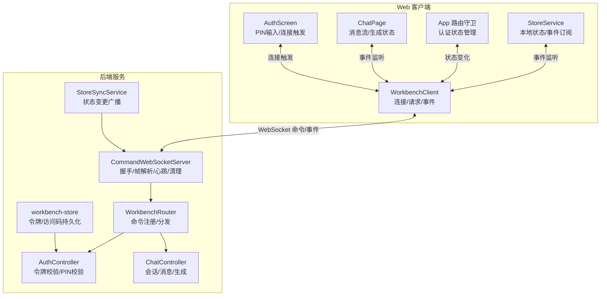
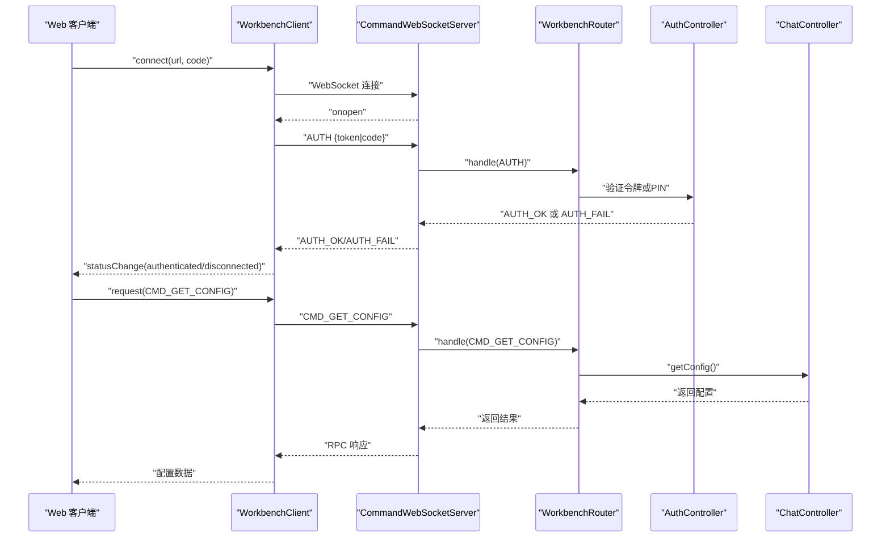
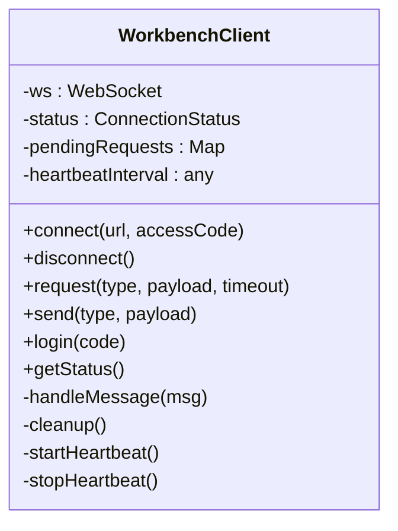
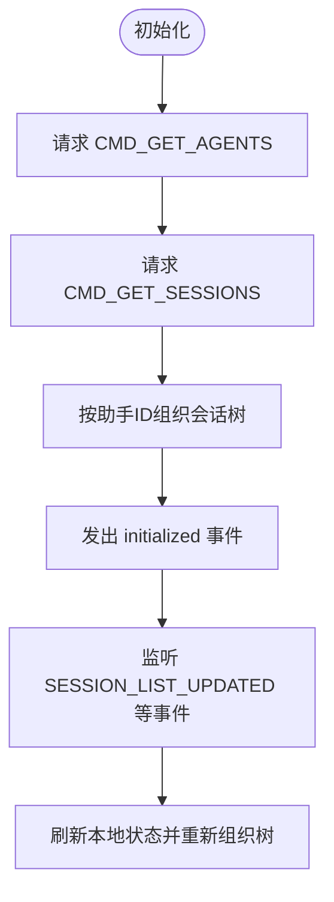
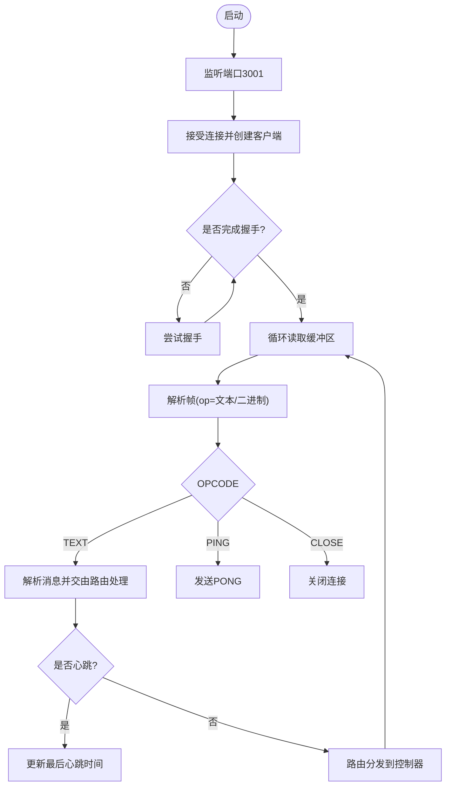
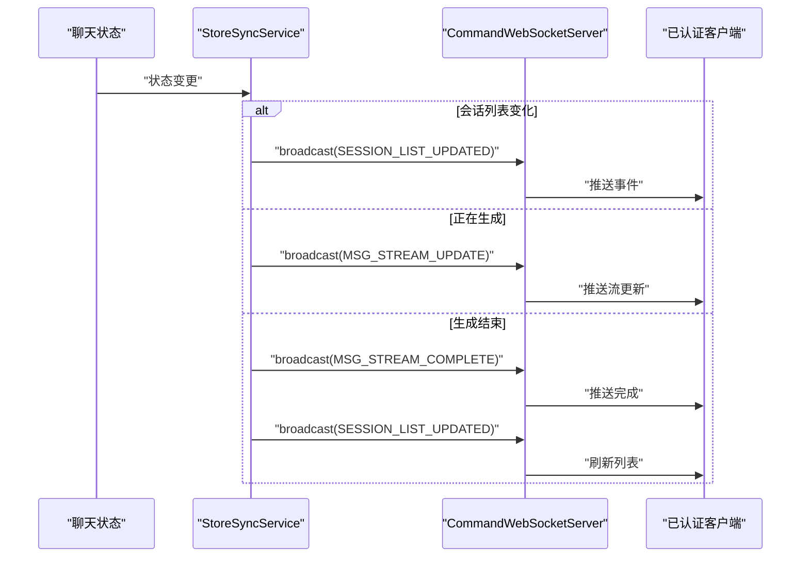
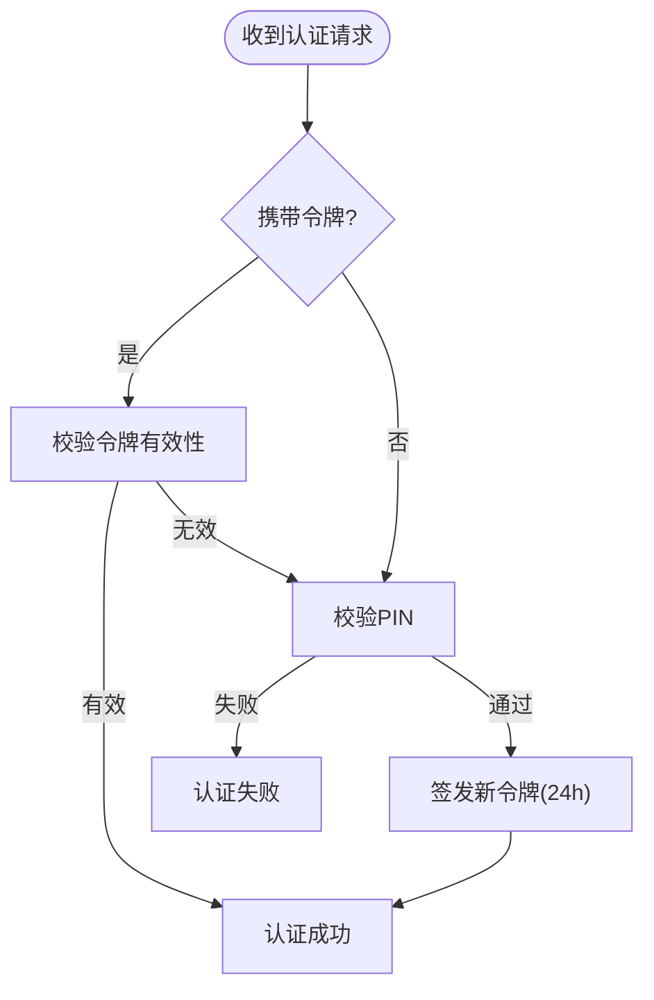
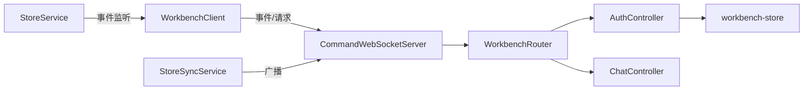
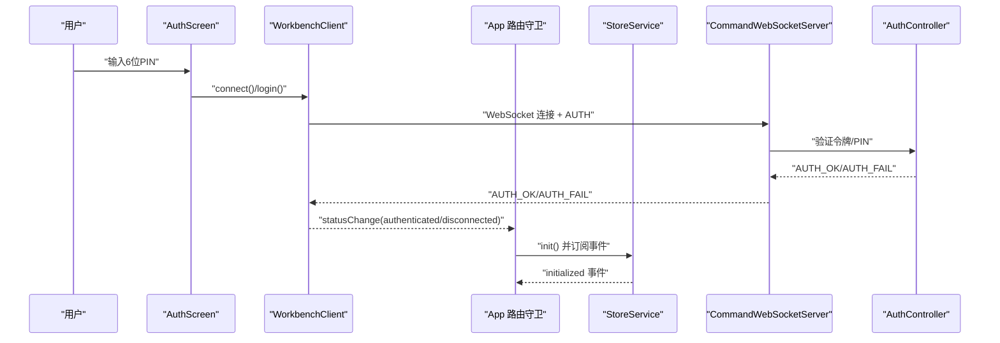

# 通信机制

<cite>
**本文引用的文件**
- [web-client/src/services/WorkbenchClient.ts](file://web-client/src/services/WorkbenchClient.ts)
- [web-client/src/hooks/useWebSocket.ts](file://web-client/src/hooks/useWebSocket.ts)
- [web-client/src/services/StoreService.ts](file://web-client/src/services/StoreService.ts)
- [src/services/workbench/CommandWebSocketServer.ts](file://src/services/workbench/CommandWebSocketServer.ts)
- [src/services/workbench/StoreSyncService.ts](file://src/services/workbench/StoreSyncService.ts)
- [src/services/workbench/controllers/AuthController.ts](file://src/services/workbench/controllers/AuthController.ts)
- [src/services/workbench/controllers/ChatController.ts](file://src/services/workbench/controllers/ChatController.ts)
- [src/services/workbench/WorkbenchRouter.ts](file://src/services/workbench/WorkbenchRouter.ts)
- [src/store/workbench-store.ts](file://src/store/workbench-store.ts)
- [web-client/src/App.tsx](file://web-client/src/App.tsx)
- [web-client/src/pages/ChatPage.tsx](file://web-client/src/pages/ChatPage.tsx)
- [web-client/src/components/AuthScreen.tsx](file://web-client/src/components/AuthScreen.tsx)
</cite>

## 目录
1. [引言](#引言)
2. [项目结构](#项目结构)
3. [核心组件](#核心组件)
4. [架构总览](#架构总览)
5. [详细组件分析](#详细组件分析)
6. [依赖关系分析](#依赖关系分析)
7. [性能考量](#性能考量)
8. [故障排查指南](#故障排查指南)
9. [结论](#结论)
10. [附录](#附录)

## 引言
本文件面向Web客户端的通信机制，系统性阐述WebSocket连接建立与维护、心跳与断线重连策略、Workbench Client服务架构（命令发送、事件监听、状态同步）、Store Service数据同步（本地存储与远程状态同步）、认证流程与安全机制（令牌管理与权限控制），以及通信错误处理与调试方法（日志与性能监控）。内容以实际源码为依据，辅以可视化图表帮助不同背景读者理解。

## 项目结构
Web客户端位于web-client目录，核心通信逻辑由WorkbenchClient封装；后端在src/services/workbench下实现自定义TCP WebSocket服务器与路由分发，并通过StoreSyncService进行状态广播。前端页面通过StoreService订阅WorkbenchClient事件，实现UI与后端状态的双向同步。

**图表来源**
- [web-client/src/services/WorkbenchClient.ts:18-317](file://web-client/src/services/WorkbenchClient.ts#L18-L317)
- [web-client/src/services/StoreService.ts:30-136](file://web-client/src/services/StoreService.ts#L30-L136)
- [web-client/src/App.tsx:16-110](file://web-client/src/App.tsx#L16-L110)
- [web-client/src/pages/ChatPage.tsx:81-116](file://web-client/src/pages/ChatPage.tsx#L81-L116)
- [web-client/src/components/AuthScreen.tsx:67-92](file://web-client/src/components/AuthScreen.tsx#L67-L92)
- [src/services/workbench/CommandWebSocketServer.ts:33-488](file://src/services/workbench/CommandWebSocketServer.ts#L33-L488)
- [src/services/workbench/WorkbenchRouter.ts:18-75](file://src/services/workbench/WorkbenchRouter.ts#L18-L75)
- [src/services/workbench/controllers/AuthController.ts:17-55](file://src/services/workbench/controllers/AuthController.ts#L17-L55)
- [src/services/workbench/controllers/ChatController.ts:5-130](file://src/services/workbench/controllers/ChatController.ts#L5-L130)
- [src/services/workbench/StoreSyncService.ts:5-127](file://src/services/workbench/StoreSyncService.ts#L5-L127)
- [src/store/workbench-store.ts:22-56](file://src/store/workbench-store.ts#L22-L56)

**章节来源**
- [web-client/src/services/WorkbenchClient.ts:18-317](file://web-client/src/services/WorkbenchClient.ts#L18-L317)
- [src/services/workbench/CommandWebSocketServer.ts:33-488](file://src/services/workbench/CommandWebSocketServer.ts#L33-L488)

## 核心组件
- WorkbenchClient：封装WebSocket连接、请求-响应、事件派发、心跳与断线清理，提供命令调用方法（如获取配置、会话、发送消息等）。
- StoreService：基于WorkbenchClient事件驱动的本地状态管理，负责拉取助手列表与会话树，并向UI发出更新事件。
- CommandWebSocketServer：自定义TCP WebSocket服务器，实现握手、帧解析、写队列、心跳检测与超时清理。
- WorkbenchRouter：命令注册与分发器，统一处理请求-响应与错误返回。
- StoreSyncService：监听聊天状态变化，向已认证客户端广播会话列表更新与消息流更新。
- 认证控制器：支持令牌与PIN两种认证方式，令牌具备过期时间与定期清理。
- 工作台状态存储：持久化访问码与活动令牌，供认证控制器使用。

**章节来源**
- [web-client/src/services/WorkbenchClient.ts:18-317](file://web-client/src/services/WorkbenchClient.ts#L18-L317)
- [web-client/src/services/StoreService.ts:30-136](file://web-client/src/services/StoreService.ts#L30-L136)
- [src/services/workbench/CommandWebSocketServer.ts:33-488](file://src/services/workbench/CommandWebSocketServer.ts#L33-L488)
- [src/services/workbench/WorkbenchRouter.ts:18-75](file://src/services/workbench/WorkbenchRouter.ts#L18-L75)
- [src/services/workbench/StoreSyncService.ts:5-127](file://src/services/workbench/StoreSyncService.ts#L5-L127)
- [src/services/workbench/controllers/AuthController.ts:17-55](file://src/services/workbench/controllers/AuthController.ts#L17-L55)
- [src/store/workbench-store.ts:22-56](file://src/store/workbench-store.ts#L22-L56)

## 架构总览
Web客户端通过WorkbenchClient与后端CommandWebSocketServer建立WebSocket连接，采用“命令-响应”模型进行RPC调用，并通过事件驱动实现状态同步。认证阶段支持令牌与PIN两种方式，令牌具备过期时间并在后台自动清理。StoreSyncService在后端监听聊天状态变化并向客户端广播，确保UI实时更新。

**图表来源**
- [web-client/src/services/WorkbenchClient.ts:29-94](file://web-client/src/services/WorkbenchClient.ts#L29-L94)
- [src/services/workbench/CommandWebSocketServer.ts:415-444](file://src/services/workbench/CommandWebSocketServer.ts#L415-L444)
- [src/services/workbench/WorkbenchRouter.ts:34-71](file://src/services/workbench/WorkbenchRouter.ts#L34-L71)
- [src/services/workbench/controllers/AuthController.ts:18-53](file://src/services/workbench/controllers/AuthController.ts#L18-L53)
- [src/services/workbench/controllers/ChatController.ts:6-19](file://src/services/workbench/controllers/ChatController.ts#L6-L19)

## 详细组件分析

### WorkbenchClient（Web 客户端）
- 连接管理：支持重复连接防护、协议转换（http/ws）、端口约定（3000→3001）、状态事件派发。
- 请求-响应：为每个请求分配唯一ID（非UUID回退方案），设置超时，清理挂起请求。
- 事件系统：统一处理RPC响应与系统事件（如AUTH_OK/AUTH_FAIL），并派发通用消息事件。
- 心跳与断线：周期性发送HEARTBEAT，断开时清理定时器与挂起请求。
- 命令封装：提供代理方法（如获取配置、会话、发送消息、统计、文件上传等）。

**图表来源**
- [web-client/src/services/WorkbenchClient.ts:18-317](file://web-client/src/services/WorkbenchClient.ts#L18-L317)

**章节来源**
- [web-client/src/services/WorkbenchClient.ts:29-94](file://web-client/src/services/WorkbenchClient.ts#L29-L94)
- [web-client/src/services/WorkbenchClient.ts:222-241](file://web-client/src/services/WorkbenchClient.ts#L222-L241)
- [web-client/src/services/WorkbenchClient.ts:251-288](file://web-client/src/services/WorkbenchClient.ts#L251-L288)
- [web-client/src/services/WorkbenchClient.ts:299-313](file://web-client/src/services/WorkbenchClient.ts#L299-L313)

### StoreService（Web 客户端）
- 初始化：并发拉取助手与会话，完成后发出初始化事件。
- 事件驱动：监听SESSION_LIST_UPDATED等事件，触发本地状态刷新与树重组。
- 数据组织：按助手ID分组会话，未知助手ID时归入“unknown”。

**图表来源**
- [web-client/src/services/StoreService.ts:49-86](file://web-client/src/services/StoreService.ts#L49-L86)
- [web-client/src/services/StoreService.ts:88-116](file://web-client/src/services/StoreService.ts#L88-L116)

**章节来源**
- [web-client/src/services/StoreService.ts:49-86](file://web-client/src/services/StoreService.ts#L49-L86)
- [web-client/src/services/StoreService.ts:88-116](file://web-client/src/services/StoreService.ts#L88-L116)

### CommandWebSocketServer（后端）
- 启动与路由注册：监听端口3001，注册各类命令处理器。
- 握手与帧解析：实现WebSocket握手与帧解包，支持Ping/Pong与Close。
- 写队列与分片：写操作入队保证原子性，按1400字节分片可靠传输。
- 心跳与清理：周期扫描客户端最后心跳时间，超时断开。
- 广播：向已认证客户端广播事件（如会话列表更新、消息流更新）。

**图表来源**
- [src/services/workbench/CommandWebSocketServer.ts:44-178](file://src/services/workbench/CommandWebSocketServer.ts#L44-L178)
- [src/services/workbench/CommandWebSocketServer.ts:192-297](file://src/services/workbench/CommandWebSocketServer.ts#L192-L297)
- [src/services/workbench/CommandWebSocketServer.ts:415-444](file://src/services/workbench/CommandWebSocketServer.ts#L415-L444)
- [src/services/workbench/CommandWebSocketServer.ts:471-484](file://src/services/workbench/CommandWebSocketServer.ts#L471-L484)

**章节来源**
- [src/services/workbench/CommandWebSocketServer.ts:44-178](file://src/services/workbench/CommandWebSocketServer.ts#L44-L178)
- [src/services/workbench/CommandWebSocketServer.ts:192-297](file://src/services/workbench/CommandWebSocketServer.ts#L192-L297)
- [src/services/workbench/CommandWebSocketServer.ts:471-484](file://src/services/workbench/CommandWebSocketServer.ts#L471-L484)

### StoreSyncService（后端）
- 订阅聊天状态：监听会话列表变化与生成状态变化。
- 会话列表更新：检测会话数量或ID列表变化，广播SESSION_LIST_UPDATED。
- 消息流更新：检测当前生成会话的最后一条消息长度变化，广播MSG_STREAM_UPDATE；生成结束时广播MSG_STREAM_COMPLETE并刷新会话列表。

**图表来源**
- [src/services/workbench/StoreSyncService.ts:34-48](file://src/services/workbench/StoreSyncService.ts#L34-L48)
- [src/services/workbench/StoreSyncService.ts:50-77](file://src/services/workbench/StoreSyncService.ts#L50-L77)
- [src/services/workbench/StoreSyncService.ts:79-107](file://src/services/workbench/StoreSyncService.ts#L79-L107)
- [src/services/workbench/StoreSyncService.ts:109-123](file://src/services/workbench/StoreSyncService.ts#L109-L123)

**章节来源**
- [src/services/workbench/StoreSyncService.ts:34-48](file://src/services/workbench/StoreSyncService.ts#L34-L48)
- [src/services/workbench/StoreSyncService.ts:50-77](file://src/services/workbench/StoreSyncService.ts#L50-L77)
- [src/services/workbench/StoreSyncService.ts:79-107](file://src/services/workbench/StoreSyncService.ts#L79-L107)
- [src/services/workbench/StoreSyncService.ts:109-123](file://src/services/workbench/StoreSyncService.ts#L109-L123)

### 认证流程与安全机制
- 令牌认证：若存在有效令牌且未过期，则直接认证成功并返回令牌。
- PIN认证：输入6位PIN或保留后门PIN，通过后颁发新令牌，有效期24小时。
- 令牌清理：每小时清理一次过期令牌，避免内存膨胀。
- 权限控制：未认证客户端仅允许发送AUTH命令；其他命令将被拒绝并返回AUTH_REQUIRED。

**图表来源**
- [src/services/workbench/controllers/AuthController.ts:17-55](file://src/services/workbench/controllers/AuthController.ts#L17-L55)
- [src/store/workbench-store.ts:22-56](file://src/store/workbench-store.ts#L22-L56)

**章节来源**
- [src/services/workbench/controllers/AuthController.ts:17-55](file://src/services/workbench/controllers/AuthController.ts#L17-L55)
- [src/store/workbench-store.ts:22-56](file://src/store/workbench-store.ts#L22-L56)

### ChatController（命令实现示例）
- 会话管理：获取会话列表、获取历史、创建/删除会话。
- 消息交互：发送消息（触发生成但不阻塞）、中止生成、删除/重生成消息。
- 返回格式：列表摘要（轻量）与完整会话（按需拉取）。

**章节来源**
- [src/services/workbench/controllers/ChatController.ts:6-130](file://src/services/workbench/controllers/ChatController.ts#L6-L130)

## 依赖关系分析
- WorkbenchClient依赖浏览器原生WebSocket与eventemitter3事件系统，内部封装请求-响应与心跳。
- CommandWebSocketServer依赖react-native-tcp-socket实现自定义TCP WebSocket，自行实现握手与帧协议。
- WorkbenchRouter作为命令分发中心，将消息路由至对应控制器。
- StoreSyncService订阅聊天状态并通过CommandWebSocketServer广播事件。
- 认证控制器依赖工作台状态存储进行令牌持久化与清理。

**图表来源**
- [web-client/src/services/WorkbenchClient.ts:18-317](file://web-client/src/services/WorkbenchClient.ts#L18-L317)
- [src/services/workbench/CommandWebSocketServer.ts:33-488](file://src/services/workbench/CommandWebSocketServer.ts#L33-L488)
- [src/services/workbench/WorkbenchRouter.ts:18-75](file://src/services/workbench/WorkbenchRouter.ts#L18-L75)
- [src/services/workbench/controllers/AuthController.ts:17-55](file://src/services/workbench/controllers/AuthController.ts#L17-L55)
- [src/services/workbench/controllers/ChatController.ts:5-130](file://src/services/workbench/controllers/ChatController.ts#L5-L130)
- [src/services/workbench/StoreSyncService.ts:5-127](file://src/services/workbench/StoreSyncService.ts#L5-L127)
- [src/store/workbench-store.ts:22-56](file://src/store/workbench-store.ts#L22-L56)
- [web-client/src/services/StoreService.ts:30-136](file://web-client/src/services/StoreService.ts#L30-L136)

**章节来源**
- [web-client/src/services/WorkbenchClient.ts:18-317](file://web-client/src/services/WorkbenchClient.ts#L18-L317)
- [src/services/workbench/CommandWebSocketServer.ts:33-488](file://src/services/workbench/CommandWebSocketServer.ts#L33-L488)
- [src/services/workbench/WorkbenchRouter.ts:18-75](file://src/services/workbench/WorkbenchRouter.ts#L18-L75)
- [src/services/workbench/StoreSyncService.ts:5-127](file://src/services/workbench/StoreSyncService.ts#L5-L127)

## 性能考量
- 写队列与分片：后端写操作入队并按1400字节分片，避免大包阻塞与丢包风险。
- 心跳与清理：10秒心跳+30秒超时策略，降低僵尸连接占用。
- RPC超时：前端请求默认10秒超时，避免长时间挂起。
- 广播策略：StoreSyncService区分会话列表更新与消息流更新，减少不必要的全量同步。
- 本地缓存：StoreService按事件驱动更新本地状态，降低重复RPC次数。

[本节为通用性能建议，无需特定文件引用]

## 故障排查指南
- 连接失败
  - 检查URL与端口（http→ws，3000→3001），确认后端服务已启动。
  - 查看浏览器控制台与后端日志中的握手与帧解析错误。
- 认证失败
  - 若令牌无效或过期，前端会清除本地令牌并回到登录页；检查后端令牌清理定时任务。
  - PIN错误将返回AUTH_FAIL，前端显示错误提示并保持断开状态。
- 断线与重连
  - 前端在断开时清理挂起请求与心跳定时器；可手动触发重连或等待UI自动处理。
  - 后端10秒扫描一次心跳，超过30秒无心跳将主动断开。
- 消息流异常
  - 检查MSG_STREAM_UPDATE广播是否到达；确认StoreSyncService处于运行状态。
  - ChatPage监听消息事件并更新UI，若无更新，检查事件绑定与会话ID匹配。

**章节来源**
- [web-client/src/services/WorkbenchClient.ts:67-93](file://web-client/src/services/WorkbenchClient.ts#L67-L93)
- [web-client/src/services/WorkbenchClient.ts:299-313](file://web-client/src/services/WorkbenchClient.ts#L299-L313)
- [src/services/workbench/CommandWebSocketServer.ts:471-484](file://src/services/workbench/CommandWebSocketServer.ts#L471-L484)
- [src/services/workbench/StoreSyncService.ts:79-107](file://src/services/workbench/StoreSyncService.ts#L79-L107)
- [web-client/src/pages/ChatPage.tsx:81-116](file://web-client/src/pages/ChatPage.tsx#L81-L116)

## 结论
该通信体系以WorkbenchClient为中心，结合后端CommandWebSocketServer与StoreSyncService，实现了可靠的命令-响应与事件驱动状态同步。认证采用令牌+PIN双通道，具备过期清理与权限拦截。心跳与清理机制保障了长连接的稳定性与资源占用的可控性。通过事件驱动与本地缓存，前端UI能够及时反映后端状态变化，提供流畅的交互体验。

[本节为总结性内容，无需特定文件引用]

## 附录

### Web 客户端连接与认证流程（端到端）

**图表来源**
- [web-client/src/components/AuthScreen.tsx:67-92](file://web-client/src/components/AuthScreen.tsx#L67-L92)
- [web-client/src/services/WorkbenchClient.ts:29-94](file://web-client/src/services/WorkbenchClient.ts#L29-L94)
- [web-client/src/App.tsx:23-92](file://web-client/src/App.tsx#L23-L92)
- [web-client/src/services/StoreService.ts:49-59](file://web-client/src/services/StoreService.ts#L49-L59)
- [src/services/workbench/CommandWebSocketServer.ts:415-444](file://src/services/workbench/CommandWebSocketServer.ts#L415-L444)
- [src/services/workbench/controllers/AuthController.ts:18-53](file://src/services/workbench/controllers/AuthController.ts#L18-L53)