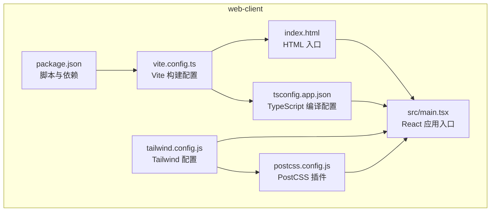
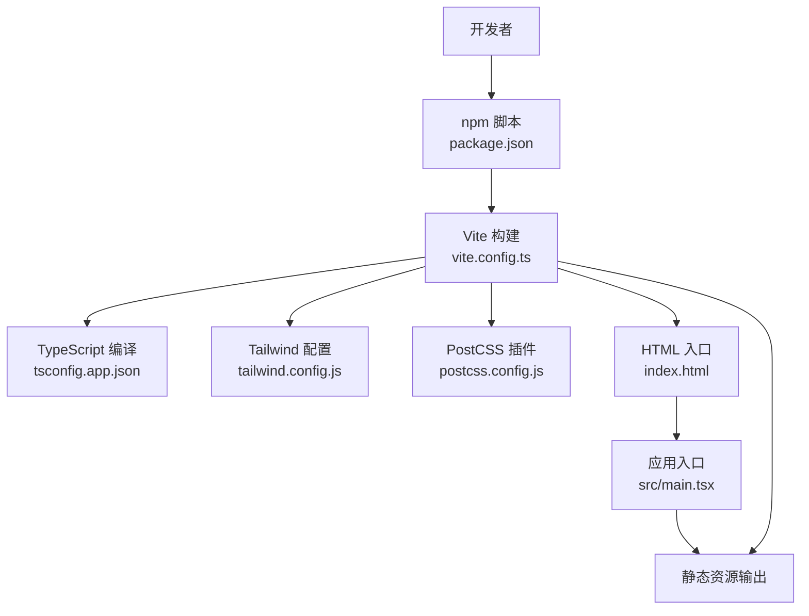
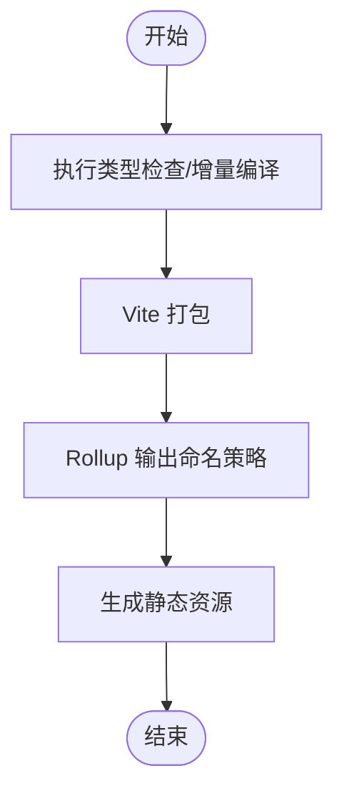
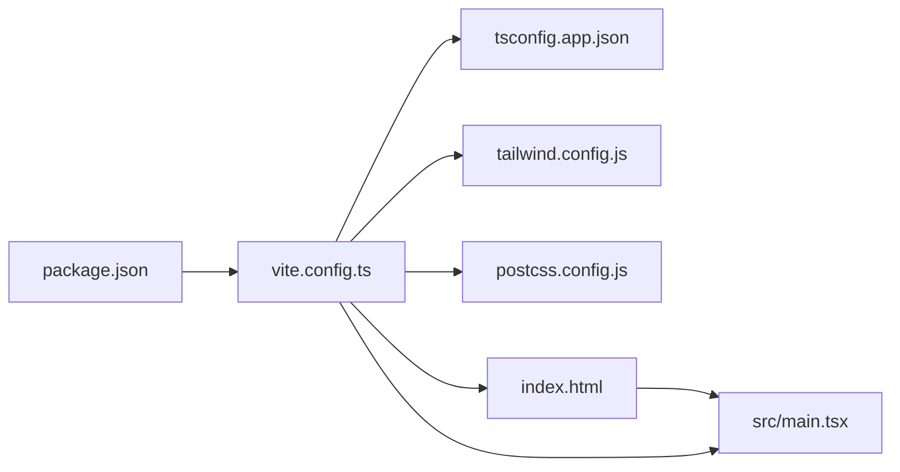

# 部署配置

<cite>
**本文引用的文件**
- [vite.config.ts](file://web-client/vite.config.ts)
- [package.json](file://web-client/package.json)
- [tailwind.config.js](file://web-client/tailwind.config.js)
- [postcss.config.js](file://web-client/postcss.config.js)
- [tsconfig.app.json](file://web-client/tsconfig.app.json)
- [index.html](file://web-client/index.html)
- [main.tsx](file://web-client/src/main.tsx)
- [README.md](file://README.md)
</cite>

## 目录
1. [简介](#简介)
2. [项目结构](#项目结构)
3. [核心组件](#核心组件)
4. [架构总览](#架构总览)
5. [详细组件分析](#详细组件分析)
6. [依赖关系分析](#依赖关系分析)
7. [性能考量](#性能考量)
8. [故障排查指南](#故障排查指南)
9. [结论](#结论)
10. [附录](#附录)

## 简介
本指南聚焦于 Web 客户端（web-client）的部署配置与优化实践，围绕 Vite 构建配置、打包优化、代码分割、资源处理、生产部署、静态文件生成、CDN 与缓存策略、环境变量与配置组织、容器化与 CI/CD 流水线、性能监控与错误追踪、以及常见部署问题排查等方面展开。该仓库明确指出 Web 面板采用 Vite + React 18 + TailwindCSS 4 的技术栈，并通过内置静态文件服务器为浏览器提供远程管理能力。

章节来源
- [README.md: 36-40:36-40](file://README.md#L36-L40)
- [README.md: 59-60:59-60](file://README.md#L59-L60)
- [README.md: 132-133:132-133](file://README.md#L132-L133)

## 项目结构
web-client 目录是本次部署关注的核心，包含构建脚本、Vite 配置、TypeScript 编译配置、TailwindCSS 与 PostCSS 配置、入口 HTML 与应用入口脚本等。其关键文件如下：
- 构建与脚本：package.json
- 构建配置：vite.config.ts
- 样式管线：tailwind.config.js、postcss.config.js
- 类型与编译：tsconfig.app.json
- 应用入口：index.html、src/main.tsx

图表来源
- [package.json: 1-52:1-52](file://web-client/package.json#L1-L52)
- [vite.config.ts: 1-17:1-17](file://web-client/vite.config.ts#L1-L17)
- [tsconfig.app.json: 1-36:1-36](file://web-client/tsconfig.app.json#L1-L36)
- [tailwind.config.js: 1-13:1-13](file://web-client/tailwind.config.js#L1-L13)
- [postcss.config.js: 1-7:1-7](file://web-client/postcss.config.js#L1-L7)
- [index.html: 1-14:1-14](file://web-client/index.html#L1-L14)
- [main.tsx: 1-11:1-11](file://web-client/src/main.tsx#L1-L11)

章节来源
- [package.json: 6-11:6-11](file://web-client/package.json#L6-L11)
- [vite.config.ts: 5-16:5-16](file://web-client/vite.config.ts#L5-L16)
- [tsconfig.app.json: 19-24:19-24](file://web-client/tsconfig.app.json#L19-L24)
- [tailwind.config.js: 3-6:3-6](file://web-client/tailwind.config.js#L3-L6)
- [postcss.config.js: 1-6:1-6](file://web-client/postcss.config.js#L1-L6)
- [index.html: 1-14:1-14](file://web-client/index.html#L1-L14)
- [main.tsx: 1-11:1-11](file://web-client/src/main.tsx#L1-L11)

## 核心组件
- 构建与脚本（package.json）
  - 提供开发、构建、预览与代码质量检查脚本，构建流程先执行类型检查/增量编译，再进行打包。
  - 关键脚本路径参考：[package.json: 6-11:6-11](file://web-client/package.json#L6-L11)
- Vite 构建配置（vite.config.ts）
  - 使用 React 插件，启用 Rollup 输出命名策略，统一产物命名以利于缓存与 CDN 管理。
  - 关键配置路径参考：[vite.config.ts: 5-16:5-16](file://web-client/vite.config.ts#L5-L16)
- TypeScript 编译配置（tsconfig.app.json）
  - 采用 Bundler 模式解析模块，启用严格模式与无 emit，确保类型安全与更佳的打包体积。
  - 关键配置路径参考：[tsconfig.app.json: 19-24:19-24](file://web-client/tsconfig.app.json#L19-L24)
- 样式管线（tailwind.config.js、postcss.config.js）
  - Tailwind content 扫描范围覆盖根 HTML 与 src 下所有 TS/JS/TSX/JSX 文件；PostCSS 集成 Tailwind 与 autoprefixer。
  - 关键配置路径参考：[tailwind.config.js: 3-6:3-6](file://web-client/tailwind.config.js#L3-L6)、[postcss.config.js: 1-6:1-6](file://web-client/postcss.config.js#L1-L6)
- 应用入口（index.html、src/main.tsx）
  - HTML 提供挂载点与基础 meta；React 应用在 main.tsx 中挂载到 DOM。
  - 关键入口路径参考：[index.html: 9-12:9-12](file://web-client/index.html#L9-L12)、[main.tsx: 6-10:6-10](file://web-client/src/main.tsx#L6-L10)

章节来源
- [package.json: 6-11:6-11](file://web-client/package.json#L6-L11)
- [vite.config.ts: 5-16:5-16](file://web-client/vite.config.ts#L5-L16)
- [tsconfig.app.json: 19-24:19-24](file://web-client/tsconfig.app.json#L19-L24)
- [tailwind.config.js: 3-6:3-6](file://web-client/tailwind.config.js#L3-L6)
- [postcss.config.js: 1-6:1-6](file://web-client/postcss.config.js#L1-L6)
- [index.html: 9-12:9-12](file://web-client/index.html#L9-L12)
- [main.tsx: 6-10:6-10](file://web-client/src/main.tsx#L6-L10)

## 架构总览
下图展示了从开发到生产的典型流程：开发者运行构建脚本，Vite 基于配置进行打包，输出静态资源；index.html 作为入口加载应用。

图表来源
- [package.json: 6-11:6-11](file://web-client/package.json#L6-L11)
- [vite.config.ts: 5-16:5-16](file://web-client/vite.config.ts#L5-L16)
- [tsconfig.app.json: 19-24:19-24](file://web-client/tsconfig.app.json#L19-L24)
- [tailwind.config.js: 3-6:3-6](file://web-client/tailwind.config.js#L3-L6)
- [postcss.config.js: 1-6:1-6](file://web-client/postcss.config.js#L1-L6)
- [index.html: 9-12:9-12](file://web-client/index.html#L9-L12)
- [main.tsx: 6-10:6-10](file://web-client/src/main.tsx#L6-L10)

## 详细组件分析

### Vite 构建配置与优化策略
- 插件与基础配置
  - 使用 React 插件提升开发体验与按需转换效率。
  - 参考路径：[vite.config.ts: 2](file://web-client/vite.config.ts#L2)
- Rollup 输出命名策略
  - 统一入口、分片与静态资源命名，便于 CDN 缓存与版本控制。
  - 参考路径：[vite.config.ts: 8-14:8-14](file://web-client/vite.config.ts#L8-L14)
- 生产构建流程
  - 构建脚本先执行类型检查/增量编译，再进行打包，有助于提前发现类型问题。
  - 参考路径：[package.json: 8](file://web-client/package.json#L8)

图表来源
- [package.json: 8](file://web-client/package.json#L8)
- [vite.config.ts: 8-14:8-14](file://web-client/vite.config.ts#L8-L14)

章节来源
- [vite.config.ts: 5-16:5-16](file://web-client/vite.config.ts#L5-L16)
- [package.json: 8](file://web-client/package.json#L8)

### 代码分割与资源处理
- 代码分割
  - Vite 默认按路由与动态导入进行代码分割；结合 Rollup 输出命名策略，有利于浏览器缓存命中与增量更新。
  - 参考路径：[vite.config.ts: 8-14:8-14](file://web-client/vite.config.ts#L8-L14)
- 资源处理
  - 静态资源（如图片、字体等）默认由 Vite 处理；可通过插件扩展（如压缩、哈希命名等）进一步优化。
  - 参考路径：[vite.config.ts: 12](file://web-client/vite.config.ts#L12)

章节来源
- [vite.config.ts: 8-14:8-14](file://web-client/vite.config.ts#L8-L14)

### 样式管线与 Tailwind 集成
- Tailwind 内容扫描
  - 扫描根 HTML 与 src 下所有 TS/JS/TSX/JSX 文件，确保仅产出所需样式。
  - 参考路径：[tailwind.config.js: 3-6:3-6](file://web-client/tailwind.config.js#L3-L6)
- PostCSS 集成
  - 集成 Tailwind 与 autoprefixer，保证现代浏览器兼容性与样式优化。
  - 参考路径：[postcss.config.js: 1-6:1-6](file://web-client/postcss.config.js#L1-L6)

章节来源
- [tailwind.config.js: 3-6:3-6](file://web-client/tailwind.config.js#L3-L6)
- [postcss.config.js: 1-6:1-6](file://web-client/postcss.config.js#L1-L6)

### 应用入口与运行时加载
- HTML 入口
  - 提供挂载点与基础 meta，确保应用正确渲染。
  - 参考路径：[index.html: 9-12:9-12](file://web-client/index.html#L9-L12)
- React 应用入口
  - main.tsx 将 App 组件挂载到 DOM，形成运行时加载链路。
  - 参考路径：[main.tsx: 6-10:6-10](file://web-client/src/main.tsx#L6-L10)

章节来源
- [index.html: 9-12:9-12](file://web-client/index.html#L9-L12)
- [main.tsx: 6-10:6-10](file://web-client/src/main.tsx#L6-L10)

### 生产环境部署流程
- 静态文件生成
  - 使用构建脚本生成静态资源，输出目录由 Vite 控制；结合统一命名策略便于 CDN 缓存。
  - 参考路径：[package.json: 8](file://web-client/package.json#L8)、[vite.config.ts: 8-14:8-14](file://web-client/vite.config.ts#L8-L14)
- CDN 配置与缓存策略
  - 建议对 JS/CSS 设置长缓存，对 HTML 设置短缓存；资源名含哈希可实现强缓存与失效回退。
  - 参考路径：[vite.config.ts: 10-12:10-12](file://web-client/vite.config.ts#L10-L12)
- 环境变量与配置组织
  - 建议通过 Vite 环境变量前缀区分构建期与运行期变量；在仓库中未发现专用环境文件，可新增 .env.* 文件并按需引入。
  - 参考路径：[vite.config.ts: 5-6:5-6](file://web-client/vite.config.ts#L5-L6)

章节来源
- [package.json: 8](file://web-client/package.json#L8)
- [vite.config.ts: 8-14:8-14](file://web-client/vite.config.ts#L8-L14)
- [vite.config.ts: 10-12:10-12](file://web-client/vite.config.ts#L10-L12)

### Docker 容器化部署与 CI/CD 流水线
- 容器化部署
  - 建议使用多阶段构建：构建阶段安装依赖并执行构建，运行阶段使用轻量级静态服务（如 nginx）提供静态文件。
  - 参考路径：[package.json: 6-11:6-11](file://web-client/package.json#L6-L11)
- CI/CD 流水线
  - 建议流水线包含：安装依赖、类型检查、构建、测试、制品上传与部署；结合缓存策略加速构建。
  - 参考路径：[package.json: 6-11:6-11](file://web-client/package.json#L6-L11)

章节来源
- [package.json: 6-11:6-11](file://web-client/package.json#L6-L11)

### 性能监控与错误追踪
- 分析工具与调试配置
  - 建议在生产环境开启资源加载监控与错误上报；结合浏览器开发者工具与网络面板定位性能瓶颈。
  - 参考路径：[vite.config.ts: 8-14:8-14](file://web-client/vite.config.ts#L8-L14)
- 缓存与资源优化
  - 通过统一命名与哈希策略提升缓存命中率；对大资源进行压缩与懒加载。
  - 参考路径：[vite.config.ts: 10-12:10-12](file://web-client/vite.config.ts#L10-L12)

章节来源
- [vite.config.ts: 8-14:8-14](file://web-client/vite.config.ts#L8-L14)
- [vite.config.ts: 10-12:10-12](file://web-client/vite.config.ts#L10-L12)

## 依赖关系分析
- 组件耦合与职责
  - package.json 定义构建脚本，驱动 Vite；vite.config.ts 提供构建配置；tsconfig.app.json 确保类型安全；tailwind.config.js 与 postcss.config.js 负责样式管线；index.html 与 main.tsx 形成运行时入口。
- 外部依赖与集成点
  - Vite 与 React 插件、TailwindCSS 与 autoprefixer、TypeScript 编译器共同构成前端构建链路。
- 潜在循环依赖
  - 当前配置未见循环依赖迹象；保持配置文件单一职责可降低耦合风险。

图表来源
- [package.json: 6-11:6-11](file://web-client/package.json#L6-L11)
- [vite.config.ts: 5-16:5-16](file://web-client/vite.config.ts#L5-L16)
- [tsconfig.app.json: 19-24:19-24](file://web-client/tsconfig.app.json#L19-L24)
- [tailwind.config.js: 3-6:3-6](file://web-client/tailwind.config.js#L3-L6)
- [postcss.config.js: 1-6:1-6](file://web-client/postcss.config.js#L1-L6)
- [index.html: 9-12:9-12](file://web-client/index.html#L9-L12)
- [main.tsx: 6-10:6-10](file://web-client/src/main.tsx#L6-L10)

章节来源
- [package.json: 6-11:6-11](file://web-client/package.json#L6-L11)
- [vite.config.ts: 5-16:5-16](file://web-client/vite.config.ts#L5-L16)
- [tsconfig.app.json: 19-24:19-24](file://web-client/tsconfig.app.json#L19-L24)
- [tailwind.config.js: 3-6:3-6](file://web-client/tailwind.config.js#L3-L6)
- [postcss.config.js: 1-6:1-6](file://web-client/postcss.config.js#L1-L6)
- [index.html: 9-12:9-12](file://web-client/index.html#L9-L12)
- [main.tsx: 6-10:6-10](file://web-client/src/main.tsx#L6-L10)

## 性能考量
- 打包体积与加载时间
  - 使用严格的 TypeScript 配置与按需转换减少冗余；结合代码分割与懒加载降低首屏负担。
  - 参考路径：[tsconfig.app.json: 19-24:19-24](file://web-client/tsconfig.app.json#L19-L24)、[vite.config.ts: 8-14:8-14](file://web-client/vite.config.ts#L8-L14)
- 缓存与资源优化
  - 统一命名策略与哈希命名提升缓存命中；对静态资源进行压缩与按需加载。
  - 参考路径：[vite.config.ts: 10-12:10-12](file://web-client/vite.config.ts#L10-L12)
- 样式与渲染
  - Tailwind 内容扫描仅产出所需样式，避免全局样式膨胀；PostCSS 自动前缀提升兼容性。
  - 参考路径：[tailwind.config.js: 3-6:3-6](file://web-client/tailwind.config.js#L3-L6)、[postcss.config.js: 1-6:1-6](file://web-client/postcss.config.js#L1-L6)

章节来源
- [tsconfig.app.json: 19-24:19-24](file://web-client/tsconfig.app.json#L19-L24)
- [vite.config.ts: 8-14:8-14](file://web-client/vite.config.ts#L8-L14)
- [vite.config.ts: 10-12:10-12](file://web-client/vite.config.ts#L10-L12)
- [tailwind.config.js: 3-6:3-6](file://web-client/tailwind.config.js#L3-L6)
- [postcss.config.js: 1-6:1-6](file://web-client/postcss.config.js#L1-L6)

## 故障排查指南
- 构建失败或产物异常
  - 检查构建脚本顺序与依赖安装是否完整；确认 Vite 配置与 Rollup 输出命名策略未被覆盖。
  - 参考路径：[package.json: 8](file://web-client/package.json#L8)、[vite.config.ts: 8-14:8-14](file://web-client/vite.config.ts#L8-L14)
- 样式未生效或打包异常
  - 核对 Tailwind content 扫描范围与 PostCSS 插件配置；确保入口 HTML 与应用入口正确挂载。
  - 参考路径：[tailwind.config.js: 3-6:3-6](file://web-client/tailwind.config.js#L3-L6)、[postcss.config.js: 1-6:1-6](file://web-client/postcss.config.js#L1-L6)、[index.html: 9-12:9-12](file://web-client/index.html#L9-L12)、[main.tsx: 6-10:6-10](file://web-client/src/main.tsx#L6-L10)
- 缓存与资源加载问题
  - 检查资源命名策略与 CDN 缓存头设置；确认 HTML 未被缓存过久。
  - 参考路径：[vite.config.ts: 10-12:10-12](file://web-client/vite.config.ts#L10-L12)

章节来源
- [package.json: 8](file://web-client/package.json#L8)
- [vite.config.ts: 8-14:8-14](file://web-client/vite.config.ts#L8-L14)
- [tailwind.config.js: 3-6:3-6](file://web-client/tailwind.config.js#L3-L6)
- [postcss.config.js: 1-6:1-6](file://web-client/postcss.config.js#L1-L6)
- [index.html: 9-12:9-12](file://web-client/index.html#L9-L12)
- [main.tsx: 6-10:6-10](file://web-client/src/main.tsx#L6-L10)
- [vite.config.ts: 10-12:10-12](file://web-client/vite.config.ts#L10-L12)

## 结论
本指南基于现有配置文件梳理了 web-client 的部署要点：以 Vite 为核心构建工具，结合严格的 TypeScript 配置与 TailwindCSS/PostCSS 样式管线，形成可维护且高性能的前端构建链路。建议在实际生产中补充环境变量管理、CDN 缓存策略、容器化与 CI/CD 流水线配置，并持续通过性能监控与错误追踪完善上线质量保障。

## 附录
- 关键配置文件清单
  - 构建与脚本：[package.json:1-52](file://web-client/package.json#L1-L52)
  - 构建配置：[vite.config.ts:1-17](file://web-client/vite.config.ts#L1-L17)
  - 类型与编译：[tsconfig.app.json:1-36](file://web-client/tsconfig.app.json#L1-L36)
  - 样式配置：[tailwind.config.js:1-13](file://web-client/tailwind.config.js#L1-L13)、[postcss.config.js:1-7](file://web-client/postcss.config.js#L1-L7)
  - 应用入口：[index.html:1-14](file://web-client/index.html#L1-L14)、[src/main.tsx:1-11](file://web-client/src/main.tsx#L1-L11)
- 仓库背景与技术栈
  - 参考路径：[README.md: 36-40:36-40](file://README.md#L36-L40)、[README.md: 59-60:59-60](file://README.md#L59-L60)、[README.md: 132-133:132-133](file://README.md#L132-L133)