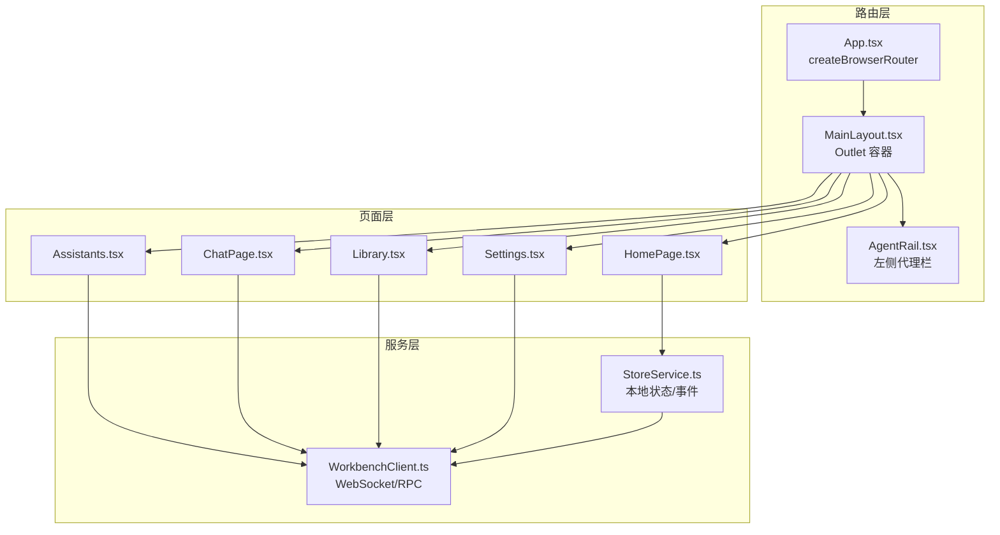
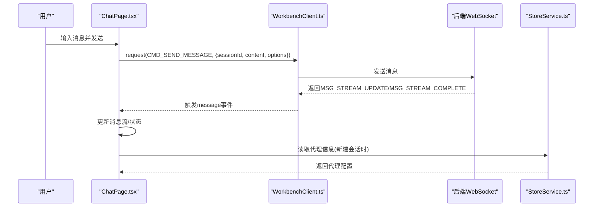
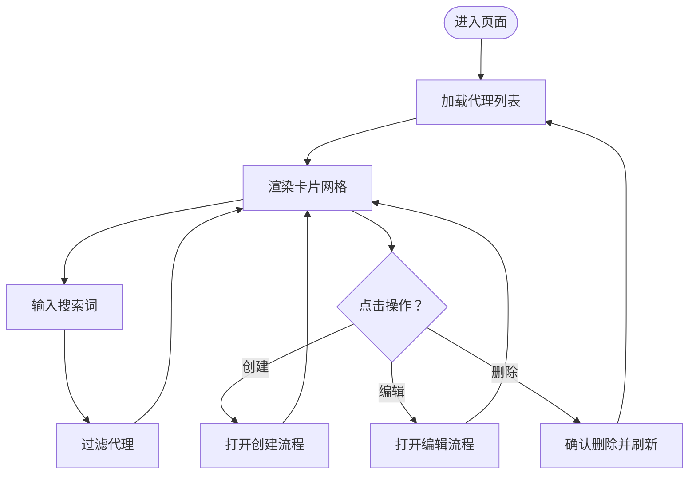
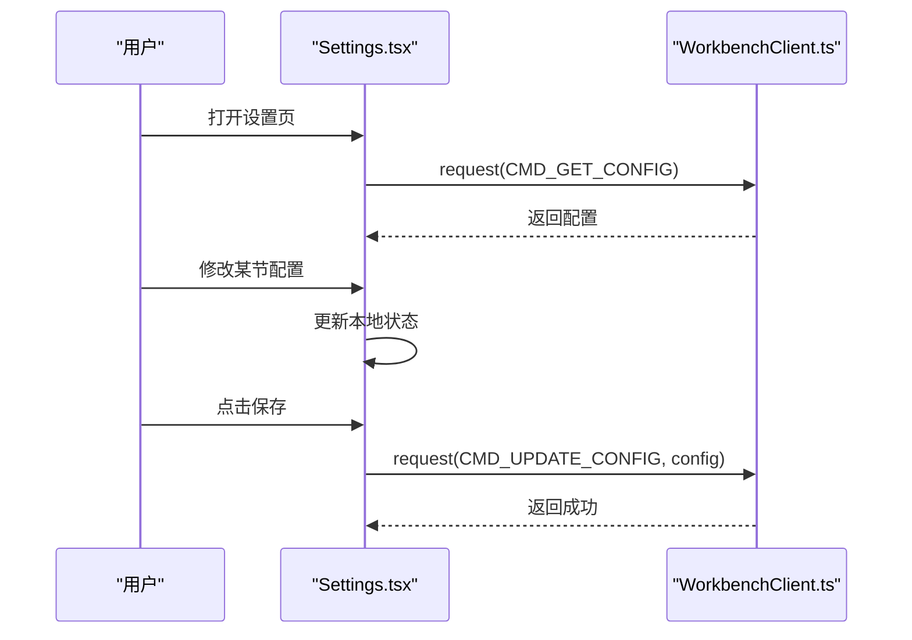
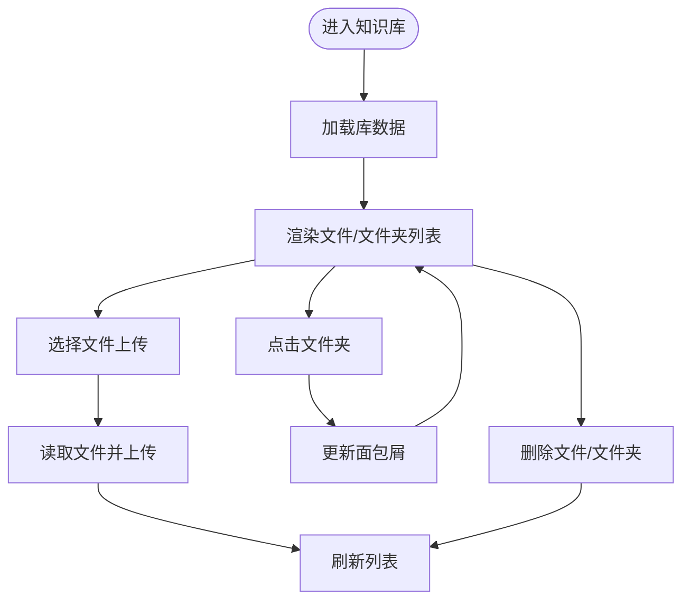
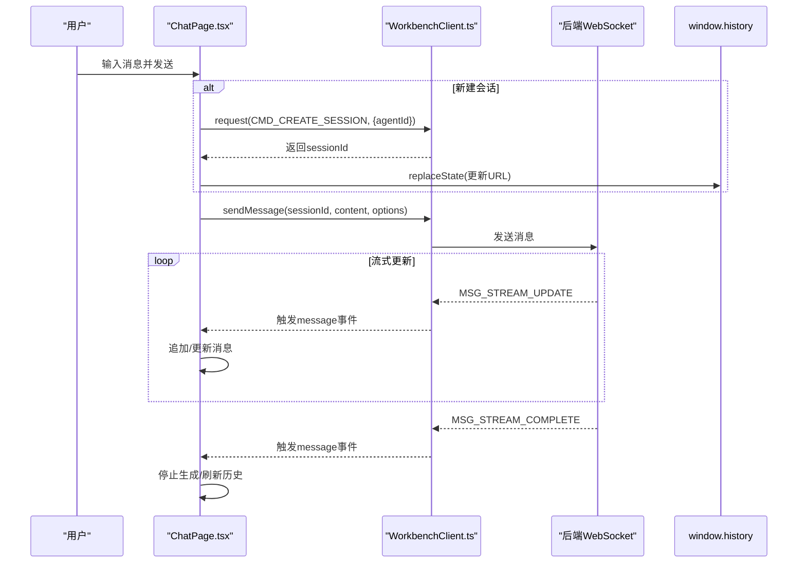
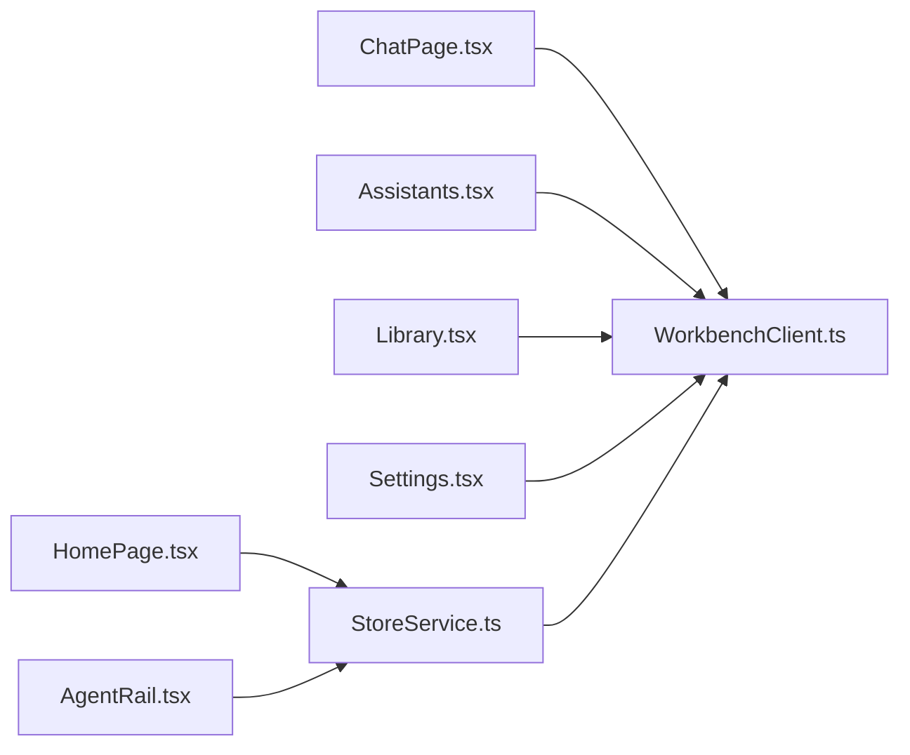

# 页面组件

<cite>
**本文引用的文件**
- [App.tsx](file://web-client/src/App.tsx)
- [MainLayout.tsx](file://web-client/src/components/layout/MainLayout.tsx)
- [AgentRail.tsx](file://web-client/src/components/layout/AgentRail.tsx)
- [HomePage.tsx](file://web-client/src/pages/HomePage.tsx)
- [Assistants.tsx](file://web-client/src/pages/Assistants.tsx)
- [ChatPage.tsx](file://web-client/src/pages/ChatPage.tsx)
- [Library.tsx](file://web-client/src/pages/Library.tsx)
- [Settings.tsx](file://web-client/src/pages/Settings.tsx)
- [MessageBubble.tsx](file://web-client/src/components/MessageBubble.tsx)
- [WorkbenchClient.ts](file://web-client/src/services/WorkbenchClient.ts)
- [StoreService.ts](file://web-client/src/services/StoreService.ts)
- [chat.ts](file://web-client/src/types/chat.ts)
- [GeneralSection.tsx](file://web-client/src/pages/settings/GeneralSection.tsx)
- [ModelSection.tsx](file://web-client/src/pages/settings/ModelSection.tsx)
</cite>

## 目录
1. [简介](#简介)
2. [项目结构](#项目结构)
3. [核心组件](#核心组件)
4. [架构总览](#架构总览)
5. [详细组件分析](#详细组件分析)
6. [依赖关系分析](#依赖关系分析)
7. [性能考量](#性能考量)
8. [故障排查指南](#故障排查指南)
9. [结论](#结论)
10. [附录](#附录)

## 简介
本文件面向Web客户端页面组件，系统性梳理助手管理、聊天、知识库与设置等页面的功能实现、UI设计、状态管理、数据获取与用户交互模式，并解释页面间导航与路由配置。同时提供开发最佳实践与性能优化建议，帮助开发者快速理解与迭代这些页面组件。

## 项目结构
Web客户端采用基于React Router的SPA架构，通过主布局容器承载左侧“代理栏”与右侧内容区，页面通过路由进行切换。核心页面包括首页、助手管理、聊天、知识库与设置；服务层通过WorkbenchClient封装WebSocket通信与RPC请求；StoreService负责本地状态聚合与事件分发。

图表来源
- [App.tsx:112-140](file://web-client/src/App.tsx#L112-L140)
- [MainLayout.tsx:4-23](file://web-client/src/components/layout/MainLayout.tsx#L4-L23)
- [AgentRail.tsx:13-179](file://web-client/src/components/layout/AgentRail.tsx#L13-L179)
- [HomePage.tsx:9-153](file://web-client/src/pages/HomePage.tsx#L9-L153)
- [Assistants.tsx:15-126](file://web-client/src/pages/Assistants.tsx#L15-L126)
- [ChatPage.tsx:11-490](file://web-client/src/pages/ChatPage.tsx#L11-L490)
- [Library.tsx:24-256](file://web-client/src/pages/Library.tsx#L24-L256)
- [Settings.tsx:54-303](file://web-client/src/pages/Settings.tsx#L54-L303)
- [WorkbenchClient.ts:18-317](file://web-client/src/services/WorkbenchClient.ts#L18-L317)
- [StoreService.ts:30-136](file://web-client/src/services/StoreService.ts#L30-L136)

章节来源
- [App.tsx:112-140](file://web-client/src/App.tsx#L112-L140)
- [MainLayout.tsx:4-23](file://web-client/src/components/layout/MainLayout.tsx#L4-L23)
- [AgentRail.tsx:13-179](file://web-client/src/components/layout/AgentRail.tsx#L13-L179)

## 核心组件
- 路由与认证守卫：App.tsx定义路由表与认证守卫，处理连接状态变化与登录流程。
- 主布局：MainLayout.tsx提供全局布局容器，左侧AgentRail，右侧Outlet承载具体页面。
- 代理栏：AgentRail.tsx展示代理入口、历史弹出与底部导航，联动StoreService。
- 首页：HomePage.tsx提供代理网格与快捷搜索，跳转到聊天或管理页面。
- 助手管理：Assistants.tsx展示代理列表、搜索与操作（创建、编辑、删除）。
- 聊天页面：ChatPage.tsx实现消息流式渲染、模型选择、工具开关、滚动与状态指示。
- 知识库：Library.tsx实现文档/文件夹浏览、上传、删除与面包屑导航。
- 设置：Settings.tsx实现多节配置（通用、模型、RAG基础/检索/KG、备份、用量），保存配置。
- 消息气泡：MessageBubble.tsx渲染Markdown、数学公式、代码块、Mermaid/ECharts图示与引用/推理面板。
- 服务：WorkbenchClient.ts封装WebSocket连接、心跳、认证、RPC请求与事件派发；StoreService聚合代理与会话数据并发出变更事件。

章节来源
- [App.tsx:15-147](file://web-client/src/App.tsx#L15-L147)
- [MainLayout.tsx:4-23](file://web-client/src/components/layout/MainLayout.tsx#L4-L23)
- [AgentRail.tsx:13-179](file://web-client/src/components/layout/AgentRail.tsx#L13-L179)
- [HomePage.tsx:9-153](file://web-client/src/pages/HomePage.tsx#L9-L153)
- [Assistants.tsx:15-126](file://web-client/src/pages/Assistants.tsx#L15-L126)
- [ChatPage.tsx:11-490](file://web-client/src/pages/ChatPage.tsx#L11-L490)
- [Library.tsx:24-256](file://web-client/src/pages/Library.tsx#L24-L256)
- [Settings.tsx:54-303](file://web-client/src/pages/Settings.tsx#L54-L303)
- [MessageBubble.tsx:25-330](file://web-client/src/components/MessageBubble.tsx#L25-L330)
- [WorkbenchClient.ts:18-317](file://web-client/src/services/WorkbenchClient.ts#L18-L317)
- [StoreService.ts:30-136](file://web-client/src/services/StoreService.ts#L30-L136)

## 架构总览
Web客户端采用“页面组件 + 服务层”的分层架构：
- 页面组件负责UI与交互，调用服务层完成数据获取与命令下发。
- 服务层通过WorkbenchClient统一管理与后端的WebSocket通信，抽象RPC请求与事件监听。
- StoreService在前端维护代理与会话等状态，订阅WorkbenchClient事件以保持本地状态与后端一致。

图表来源
- [ChatPage.tsx:81-116](file://web-client/src/pages/ChatPage.tsx#L81-L116)
- [WorkbenchClient.ts:251-288](file://web-client/src/services/WorkbenchClient.ts#L251-L288)
- [StoreService.ts:61-74](file://web-client/src/services/StoreService.ts#L61-L74)

## 详细组件分析

### 助手管理页面（Assistants）
- 功能要点
  - 列表展示：从WorkbenchClient获取代理列表，支持按名称/描述搜索过滤。
  - 操作能力：创建新代理、编辑、删除（非预设代理）。
  - 加载态与占位：加载中使用骨架屏。
- 数据与状态
  - 使用useState维护代理数组与搜索关键词；useEffect在挂载时拉取数据。
  - 通过workbenchClient.request('CMD_GET_AGENTS')获取数据。
- 用户交互
  - 悬停显示操作菜单；输入框支持实时搜索。
- 设计与可访问性
  - 卡片式布局，颜色与头像标识；支持“系统预设”标签。

图表来源
- [Assistants.tsx:20-38](file://web-client/src/pages/Assistants.tsx#L20-L38)
- [Assistants.tsx:72-112](file://web-client/src/pages/Assistants.tsx#L72-L112)

章节来源
- [Assistants.tsx:15-126](file://web-client/src/pages/Assistants.tsx#L15-L126)
- [WorkbenchClient.ts:103-105](file://web-client/src/services/WorkbenchClient.ts#L103-L105)

### 设置页面（Settings）
- 功能要点
  - 多节配置：通用语言切换、模型提供商与模型能力开关、RAG基础/检索/知识图谱、备份、用量统计。
  - 保存机制：统一保存配置至后端，支持节内局部更新。
- 数据与状态
  - 通过workbenchClient.getConfig()初始化配置；各节组件通过回调更新状态。
  - 提供添加/删除提供商、启用/禁用模型、切换能力等交互。
- 用户交互
  - 左侧导航切换节；顶部保存按钮提交整体配置。
- 设计与可访问性
  - 使用动画过渡与玻璃卡片风格，强调可读性与层级感。

图表来源
- [Settings.tsx:66-90](file://web-client/src/pages/Settings.tsx#L66-L90)
- [Settings.tsx:267-295](file://web-client/src/pages/Settings.tsx#L267-L295)
- [WorkbenchClient.ts:111-113](file://web-client/src/services/WorkbenchClient.ts#L111-L113)

章节来源
- [Settings.tsx:54-303](file://web-client/src/pages/Settings.tsx#L54-L303)
- [GeneralSection.tsx:5-57](file://web-client/src/pages/settings/GeneralSection.tsx#L5-L57)
- [ModelSection.tsx:39-341](file://web-client/src/pages/settings/ModelSection.tsx#L39-L341)

### 知识库页面（Library）
- 功能要点
  - 文档/文件夹浏览：从后端获取库数据，支持当前目录筛选。
  - 文件操作：上传、删除；文件类型限制为文本/Markdown/JSON/CSV等。
  - 文件夹操作：创建、删除；支持面包屑导航定位路径。
- 数据与状态
  - 通过workbenchClient.getLibrary()获取文档与文件夹列表。
  - 上传采用FileReader读取内容并调用workbenchClient.uploadFile()。
- 用户交互
  - 点击文件夹进入子目录；悬停显示删除按钮；空态提示与引导。

图表来源
- [Library.tsx:38-49](file://web-client/src/pages/Library.tsx#L38-L49)
- [Library.tsx:55-69](file://web-client/src/pages/Library.tsx#L55-L69)
- [Library.tsx:107-121](file://web-client/src/pages/Library.tsx#L107-L121)

章节来源
- [Library.tsx:24-256](file://web-client/src/pages/Library.tsx#L24-L256)
- [WorkbenchClient.ts:164-208](file://web-client/src/services/WorkbenchClient.ts#L164-L208)

### 聊天页面（ChatPage）
- 功能要点
  - 消息流式渲染：监听MSG_STREAM_UPDATE/MSG_STREAM_COMPLETE事件，增量更新消息。
  - 会话管理：支持新建会话、删除会话、重新生成消息、删除消息。
  - 工具与模式：RAG开关、网络搜索、推理模式，均持久化到localStorage。
  - 模型选择：从配置中提取可用模型，格式化显示名称。
  - 令牌统计：根据消息长度估算输入/输出/总计。
- 数据与状态
  - 通过workbenchClient.getConfig()获取模型列表；通过workbenchClient.request('CMD_GET_HISTORY')加载历史。
  - 通过workbenchClient.sendMessage()/abortGeneration()/regenerateMessage()/deleteMessage()与后端交互。
- 用户交互
  - 自动滚动至底部；滚动到底部显示“回到底部”悬浮按钮；支持键盘快捷键发送。
- 设计与可访问性
  - 深色主题背景，强调气泡与边框层次；状态指示器随思考/搜索/生成动态变化。

图表来源
- [ChatPage.tsx:224-262](file://web-client/src/pages/ChatPage.tsx#L224-L262)
- [ChatPage.tsx:81-112](file://web-client/src/pages/ChatPage.tsx#L81-L112)
- [WorkbenchClient.ts:129-143](file://web-client/src/services/WorkbenchClient.ts#L129-L143)

章节来源
- [ChatPage.tsx:11-490](file://web-client/src/pages/ChatPage.tsx#L11-L490)
- [MessageBubble.tsx:25-330](file://web-client/src/components/MessageBubble.tsx#L25-L330)
- [chat.ts:1-31](file://web-client/src/types/chat.ts#L1-L31)

### 首页（HomePage）
- 功能要点
  - 快捷查询：输入框提交到超级助手（super_assistant）会话。
  - 代理网格：展示可用代理，点击进入对应聊天。
  - 创建代理：跳转到助手管理页面。
- 数据与状态
  - 通过storeService.getAssistants()获取代理列表；监听assistants_updated事件更新。
- 用户交互
  - 表单提交触发导航；网格项带悬停效果与点击反馈。

章节来源
- [HomePage.tsx:9-153](file://web-client/src/pages/HomePage.tsx#L9-L153)
- [StoreService.ts:61-74](file://web-client/src/services/StoreService.ts#L61-L74)

### 代理栏（AgentRail）
- 功能要点
  - 展示常用代理入口与超级助手入口；底部包含“知识库”“设置”导航。
  - 支持代理历史弹出与悬停提示。
- 数据与状态
  - 订阅storeService的assistants_updated事件，动态更新代理列表。
- 用户交互
  - 点击代理或超级助手触发导航；悬停显示标签提示。

章节来源
- [AgentRail.tsx:13-179](file://web-client/src/components/layout/AgentRail.tsx#L13-L179)
- [StoreService.ts:44-47](file://web-client/src/services/StoreService.ts#L44-L47)

## 依赖关系分析
- 组件耦合
  - 页面组件与服务层解耦：页面仅通过WorkbenchClient与StoreService暴露的方法交互。
  - AgentRail与StoreService强耦合，用于代理列表与导航联动。
- 外部依赖
  - WebSocket通信：WorkbenchClient封装连接、心跳、认证与RPC。
  - React Router：App.tsx集中定义路由与重定向。
- 可能的循环依赖
  - 当前文件组织避免了直接循环导入；若后续扩展，需确保服务层不反向依赖页面组件。

图表来源
- [ChatPage.tsx:11-490](file://web-client/src/pages/ChatPage.tsx#L11-L490)
- [Assistants.tsx:15-126](file://web-client/src/pages/Assistants.tsx#L15-L126)
- [Library.tsx:24-256](file://web-client/src/pages/Library.tsx#L24-L256)
- [Settings.tsx:54-303](file://web-client/src/pages/Settings.tsx#L54-L303)
- [HomePage.tsx:9-153](file://web-client/src/pages/HomePage.tsx#L9-L153)
- [AgentRail.tsx:13-179](file://web-client/src/components/layout/AgentRail.tsx#L13-L179)
- [StoreService.ts:30-136](file://web-client/src/services/StoreService.ts#L30-L136)
- [WorkbenchClient.ts:18-317](file://web-client/src/services/WorkbenchClient.ts#L18-L317)

章节来源
- [App.tsx:112-140](file://web-client/src/App.tsx#L112-L140)
- [MainLayout.tsx:4-23](file://web-client/src/components/layout/MainLayout.tsx#L4-L23)

## 性能考量
- 渲染优化
  - ChatPage使用自动高度文本域与条件渲染，减少不必要的重排。
  - MessageBubble对长内容采用懒展开与受控折叠，降低首屏压力。
- 状态与缓存
  - StoreService聚合代理与会话，避免重复请求；通过事件驱动更新，减少手动同步。
  - Settings将工具开关状态写入localStorage，避免每次进入重算。
- 网络与连接
  - WorkbenchClient内置心跳与超时控制，避免长时间无响应导致的卡顿。
  - App.tsx的认证守卫在断线时提供短暂宽限期，避免频繁闪烁。
- 图表与富文本
  - Mermaid/ECharts在需要时渲染，避免全局加载；代码块与数学公式按需解析。

[本节为通用指导，无需特定文件来源]

## 故障排查指南
- 连接问题
  - 现象：页面显示“连接中”或空白。
  - 排查：检查WorkbenchClient连接状态事件与App.tsx的认证守卫逻辑；确认WebSocket地址与端口约定。
- 认证失败
  - 现象：反复要求登录或提示认证失败。
  - 排查：查看WorkbenchClient的AUTH_FAIL事件与App.tsx的auth_fail处理；确认本地token有效性。
- 聊天无响应
  - 现象：发送消息后无流式更新。
  - 排查：检查workbenchClient.on('message')监听是否生效；确认CMD_SEND_MESSAGE返回的事件类型。
- 设置保存失败
  - 现象：点击保存无反应或报错。
  - 排查：检查CMD_UPDATE_CONFIG返回值与错误处理；确认配置结构未被意外修改。
- 知识库上传失败
  - 现象：上传后列表不变或报错。
  - 排查：检查uploadFile的文件读取与CMD_UPLOAD_FILE参数；确认后端允许的文件类型。

章节来源
- [WorkbenchClient.ts:267-283](file://web-client/src/services/WorkbenchClient.ts#L267-L283)
- [App.tsx:16-110](file://web-client/src/App.tsx#L16-L110)
- [ChatPage.tsx:81-116](file://web-client/src/pages/ChatPage.tsx#L81-L116)
- [Settings.tsx:78-90](file://web-client/src/pages/Settings.tsx#L78-L90)
- [Library.tsx:55-69](file://web-client/src/pages/Library.tsx#L55-L69)

## 结论
Web客户端页面组件围绕“页面 + 服务”的清晰分层构建，借助WorkbenchClient与StoreService实现了稳定的前后端交互与本地状态管理。聊天页面具备完善的流式渲染与工具集成，助手管理与知识库页面覆盖核心业务场景，设置页面提供灵活的配置能力。遵循本文的最佳实践与性能建议，可进一步提升用户体验与开发效率。

[本节为总结性内容，无需特定文件来源]

## 附录
- 开发最佳实践
  - 将UI与业务逻辑分离，页面组件只负责渲染与交互，数据与命令通过服务层处理。
  - 对长列表与富文本渲染采用懒加载与受控展开，避免一次性渲染造成卡顿。
  - 使用事件驱动的状态更新，减少手动同步与竞态。
  - 在路由层统一处理认证与连接状态，保证页面一致性。
- 性能优化建议
  - ChatPage：对消息列表使用虚拟滚动（如需）；对Markdown渲染结果进行缓存。
  - Settings：对Provider/Model列表使用分页或延迟加载；保存时合并多次变更。
  - Library：对大文件上传增加进度条与取消能力；对文件夹树状结构做本地缓存。
  - AgentRail：对代理历史弹出使用Portal与防抖，避免频繁DOM操作。

[本节为通用指导，无需特定文件来源]