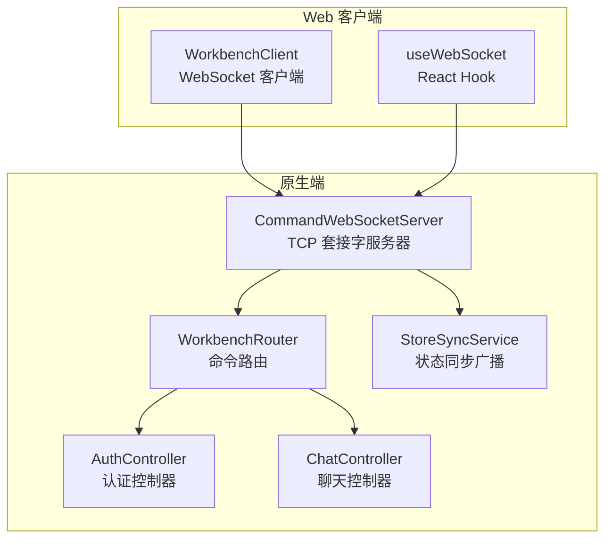
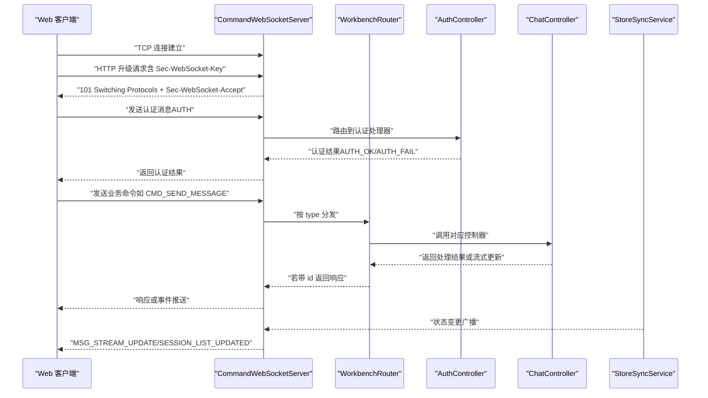
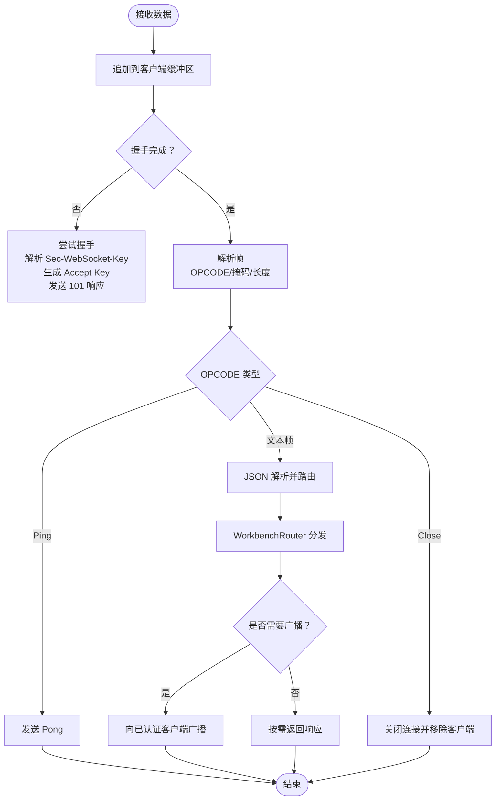
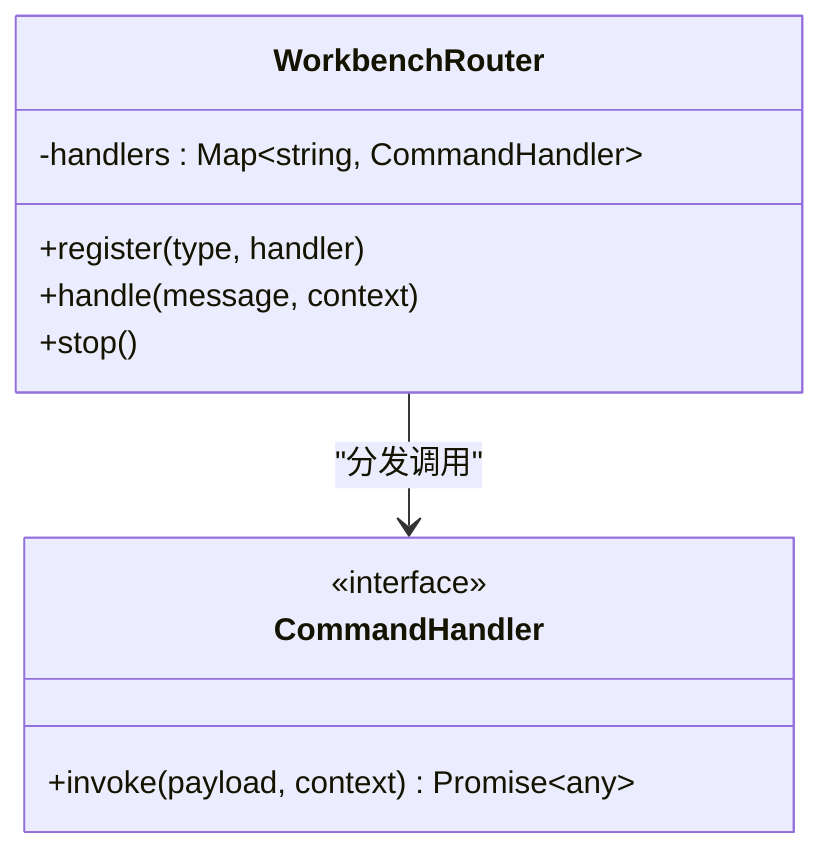
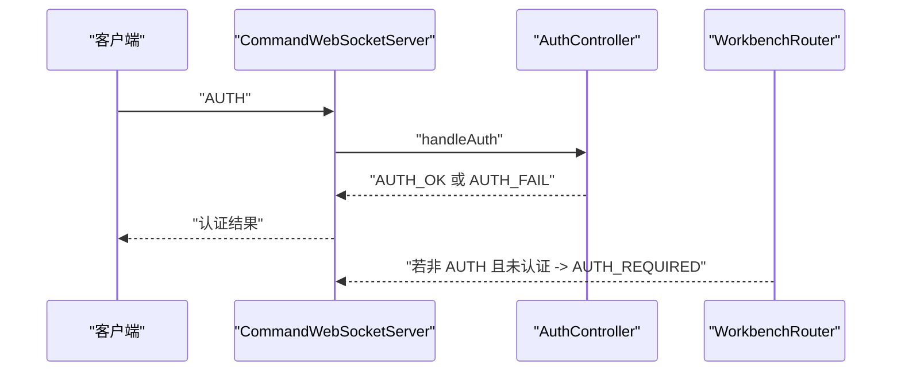
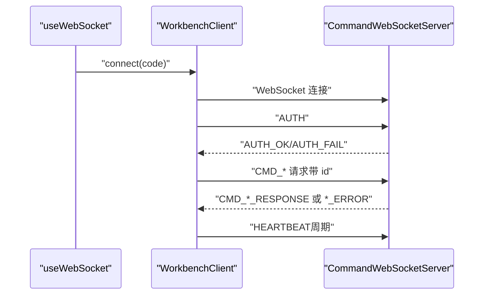
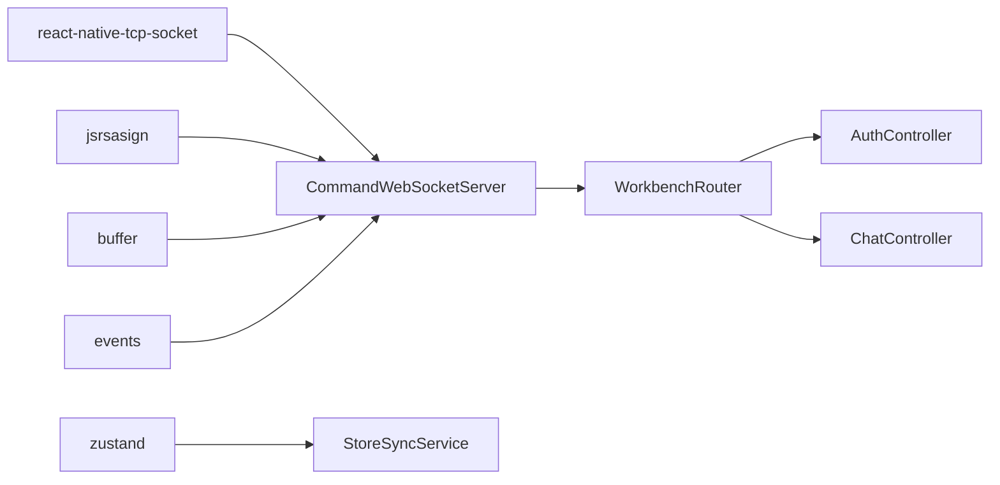

# WebSocket通信机制

<cite>
**本文引用的文件**
- [CommandWebSocketServer.ts](file://src/services/workbench/CommandWebSocketServer.ts)
- [WorkbenchRouter.ts](file://src/services/workbench/WorkbenchRouter.ts)
- [AuthController.ts](file://src/services/workbench/controllers/AuthController.ts)
- [ChatController.ts](file://src/services/workbench/controllers/ChatController.ts)
- [StoreSyncService.ts](file://src/services/workbench/StoreSyncService.ts)
- [useWebSocket.ts](file://web-client/src/hooks/useWebSocket.ts)
- [WorkbenchClient.ts](file://web-client/src/services/WorkbenchClient.ts)
- [package.json](file://package.json)
</cite>

## 目录
1. [简介](#简介)
2. [项目结构](#项目结构)
3. [核心组件](#核心组件)
4. [架构总览](#架构总览)
5. [详细组件分析](#详细组件分析)
6. [依赖分析](#依赖分析)
7. [性能考虑](#性能考虑)
8. [故障排查指南](#故障排查指南)
9. [结论](#结论)
10. [附录](#附录)

## 简介
本文件系统性阐述 Nexara 中基于 TCP 套接字的命令型 WebSocket 通信机制，重点围绕 CommandWebSocketServer 的实现细节展开，包括：
- TCP 套接字服务器与监听端口
- WebSocket 握手流程（含 Sec-WebSocket-Key 验证、Magic String 处理与 Accept Key 计算）
- 帧解析与数据传输协议（OPCODE 解析、掩码处理、分片重组、心跳机制）
- 客户端管理（连接状态跟踪、写队列管理、内存缓冲区处理）
- 消息格式规范、错误处理策略与性能优化技巧
- 实际通信示例与调试方法

## 项目结构
Nexara 的 WebSocket 服务位于原生工作台服务目录，采用“TCP 套接字 + 自定义 WebSocket 协议”的混合实现，服务于移动端与 Web 客户端。

**图表来源**
- [CommandWebSocketServer.ts:33-190](file://src/services/workbench/CommandWebSocketServer.ts#L33-L190)
- [WorkbenchRouter.ts:18-75](file://src/services/workbench/WorkbenchRouter.ts#L18-L75)
- [StoreSyncService.ts:5-127](file://src/services/workbench/StoreSyncService.ts#L5-L127)
- [AuthController.ts:17-55](file://src/services/workbench/controllers/AuthController.ts#L17-L55)
- [ChatController.ts:5-130](file://src/services/workbench/controllers/ChatController.ts#L5-L130)
- [WorkbenchClient.ts:18-317](file://web-client/src/services/WorkbenchClient.ts#L18-L317)
- [useWebSocket.ts:11-115](file://web-client/src/hooks/useWebSocket.ts#L11-L115)

**章节来源**
- [CommandWebSocketServer.ts:33-190](file://src/services/workbench/CommandWebSocketServer.ts#L33-L190)
- [WorkbenchRouter.ts:18-75](file://src/services/workbench/WorkbenchRouter.ts#L18-L75)
- [StoreSyncService.ts:5-127](file://src/services/workbench/StoreSyncService.ts#L5-L127)
- [AuthController.ts:17-55](file://src/services/workbench/controllers/AuthController.ts#L17-L55)
- [ChatController.ts:5-130](file://src/services/workbench/controllers/ChatController.ts#L5-L130)
- [WorkbenchClient.ts:18-317](file://web-client/src/services/WorkbenchClient.ts#L18-L317)
- [useWebSocket.ts:11-115](file://web-client/src/hooks/useWebSocket.ts#L11-L115)

## 核心组件
- CommandWebSocketServer：TCP 套接字服务器，负责客户端接入、握手、帧解析、消息路由、写队列与心跳清理。
- WorkbenchRouter：命令路由，将消息类型映射到具体控制器处理，并支持请求-响应模式与错误回传。
- StoreSyncService：Zustand 状态订阅者，将聊天状态变更广播给已认证客户端。
- AuthController/ChatController：业务控制器，实现认证与聊天相关命令。
- WorkbenchClient/useWebSocket：Web 客户端，封装 WebSocket 连接、认证、心跳与请求-响应。

**章节来源**
- [CommandWebSocketServer.ts:33-190](file://src/services/workbench/CommandWebSocketServer.ts#L33-L190)
- [WorkbenchRouter.ts:18-75](file://src/services/workbench/WorkbenchRouter.ts#L18-L75)
- [StoreSyncService.ts:5-127](file://src/services/workbench/StoreSyncService.ts#L5-L127)
- [AuthController.ts:17-55](file://src/services/workbench/controllers/AuthController.ts#L17-L55)
- [ChatController.ts:5-130](file://src/services/workbench/controllers/ChatController.ts#L5-L130)
- [WorkbenchClient.ts:18-317](file://web-client/src/services/WorkbenchClient.ts#L18-L317)
- [useWebSocket.ts:11-115](file://web-client/src/hooks/useWebSocket.ts#L11-L115)

## 架构总览
下图展示从客户端发起连接到服务端处理与广播的整体流程。

**图表来源**
- [CommandWebSocketServer.ts:44-178](file://src/services/workbench/CommandWebSocketServer.ts#L44-L178)
- [WorkbenchRouter.ts:34-71](file://src/services/workbench/WorkbenchRouter.ts#L34-L71)
- [AuthController.ts:18-53](file://src/services/workbench/controllers/AuthController.ts#L18-L53)
- [ChatController.ts:75-95](file://src/services/workbench/controllers/ChatController.ts#L75-L95)
- [StoreSyncService.ts:34-48](file://src/services/workbench/StoreSyncService.ts#L34-L48)

## 详细组件分析

### CommandWebSocketServer 实现原理
- TCP 套接字服务器
  - 监听端口：固定端口 3001，绑定 0.0.0.0，支持重试与端口占用处理。
  - 客户端连接：为每个连接分配唯一 id（远端地址+端口），初始化缓冲区与写队列。
- 握手流程
  - 通过检测头部结束标记判断是否收到完整 HTTP 请求头。
  - 提取 Sec-WebSocket-Key，拼接 Magic String 后计算 SHA-1 并转 Base64 得到 Accept Key。
  - 发送 101 Switching Protocols 响应，标记握手完成。
- 帧解析与数据传输协议
  - 固定头部长度：首字节含 FIN/Opcode，第二字节含 MASK 位与长度编码。
  - 支持 126/127 扩展长度字段；掩码键占 4 字节。
  - 当前实现仅处理文本帧与控制帧（Close/Ping），Ping 自动回复 Pong。
  - 写入采用二进制帧（0x2）以避免浏览器严格 UTF-8 校验导致的分片问题。
  - 写入采用分块（约 1400 字节）+ base64 编码，配合 drain 事件保证可靠性。
- 客户端管理
  - 写队列：每个客户端维护任务队列，串行执行写操作，避免竞态。
  - 心跳：客户端每 10 秒发送 HEARTBEAT，服务端 30 秒未收到心跳则断开。
  - 缓冲区：累积 socket 数据，按帧边界逐步解析，支持粘包/半包。
- 广播与事件
  - StoreSyncService 在状态变化时触发广播，推送 MSG_STREAM_UPDATE/MSG_STREAM_COMPLETE/SESSION_LIST_UPDATED 等事件。

**图表来源**
- [CommandWebSocketServer.ts:192-297](file://src/services/workbench/CommandWebSocketServer.ts#L192-L297)
- [WorkbenchRouter.ts:34-71](file://src/services/workbench/WorkbenchRouter.ts#L34-L71)
- [StoreSyncService.ts:95-123](file://src/services/workbench/StoreSyncService.ts#L95-L123)

**章节来源**
- [CommandWebSocketServer.ts:44-178](file://src/services/workbench/CommandWebSocketServer.ts#L44-L178)
- [CommandWebSocketServer.ts:203-239](file://src/services/workbench/CommandWebSocketServer.ts#L203-L239)
- [CommandWebSocketServer.ts:246-297](file://src/services/workbench/CommandWebSocketServer.ts#L246-L297)
- [CommandWebSocketServer.ts:307-413](file://src/services/workbench/CommandWebSocketServer.ts#L307-L413)
- [CommandWebSocketServer.ts:415-458](file://src/services/workbench/CommandWebSocketServer.ts#L415-L458)
- [CommandWebSocketServer.ts:471-484](file://src/services/workbench/CommandWebSocketServer.ts#L471-L484)

### WorkbenchRouter 路由机制
- 注册命令处理器：以消息 type 为键，注册对应处理函数。
- 请求-响应模式：若消息包含 id，则在处理完成后返回同 id 的 *_RESPONSE 或 *_ERROR。
- 错误处理：捕获异常并返回 ERROR 消息，避免服务崩溃。
- 特殊处理：AUTH 命令在未认证状态下允许访问，其他命令会被拒绝。

**图表来源**
- [WorkbenchRouter.ts:18-75](file://src/services/workbench/WorkbenchRouter.ts#L18-L75)

**章节来源**
- [WorkbenchRouter.ts:18-75](file://src/services/workbench/WorkbenchRouter.ts#L18-L75)

### 认证与会话控制
- 认证流程
  - 支持两种认证路径：令牌（Token）与访问码（Access Code）。
  - 令牌有效期 24 小时，定期清理过期令牌。
  - 未认证客户端仅能发送 AUTH 命令；其他命令将被拒绝并返回 AUTH_REQUIRED。
- 会话与消息
  - 支持获取会话列表、历史、创建/删除会话、发送消息、中止生成、删除/重生成消息等。
  - 发送消息后立即返回“正在生成”状态，后续通过 StoreSyncService 推送流式更新。

**图表来源**
- [AuthController.ts:18-53](file://src/services/workbench/controllers/AuthController.ts#L18-L53)
- [CommandWebSocketServer.ts:415-444](file://src/services/workbench/CommandWebSocketServer.ts#L415-L444)
- [WorkbenchRouter.ts:34-71](file://src/services/workbench/WorkbenchRouter.ts#L34-L71)

**章节来源**
- [AuthController.ts:17-55](file://src/services/workbench/controllers/AuthController.ts#L17-L55)
- [ChatController.ts:5-130](file://src/services/workbench/controllers/ChatController.ts#L5-L130)
- [CommandWebSocketServer.ts:415-444](file://src/services/workbench/CommandWebSocketServer.ts#L415-L444)

### StoreSyncService 状态同步
- 订阅 Zustand 聊天存储，检测会话列表变化与消息流式更新。
- 流式更新：当助手消息内容增长时，广播 MSG_STREAM_UPDATE；生成结束后广播 MSG_STREAM_COMPLETE 并刷新会话列表。
- 广播目标：仅对已认证且握手完成的客户端推送。

**章节来源**
- [StoreSyncService.ts:34-123](file://src/services/workbench/StoreSyncService.ts#L34-L123)
- [CommandWebSocketServer.ts:446-458](file://src/services/workbench/CommandWebSocketServer.ts#L446-L458)

### Web 客户端通信示例
- WorkbenchClient
  - 连接：自动尝试令牌认证，否则使用访问码；每 10 秒发送 HEARTBEAT。
  - 请求-响应：为每个请求生成随机 id，等待响应或超时。
  - 事件：订阅 AUTH_OK/AUTH_FAIL 与各类业务事件。
- useWebSocket（React Hook）
  - 连接：根据页面协议选择 ws/wss，端口 3001。
  - 认证：连接后立即发送 AUTH 消息。
  - 事件：处理 AUTH_OK/AUTH_FAIL 与消息流。

**图表来源**
- [WorkbenchClient.ts:29-94](file://web-client/src/services/WorkbenchClient.ts#L29-L94)
- [WorkbenchClient.ts:222-241](file://web-client/src/services/WorkbenchClient.ts#L222-L241)
- [WorkbenchClient.ts:299-313](file://web-client/src/services/WorkbenchClient.ts#L299-L313)
- [useWebSocket.ts:16-92](file://web-client/src/hooks/useWebSocket.ts#L16-L92)

**章节来源**
- [WorkbenchClient.ts:18-317](file://web-client/src/services/WorkbenchClient.ts#L18-L317)
- [useWebSocket.ts:11-115](file://web-client/src/hooks/useWebSocket.ts#L11-L115)

## 依赖分析
- 核心依赖
  - react-native-tcp-socket：提供 TCP 套接字能力。
  - jsrsasign：SHA-1 与 Base64 工具，用于握手 Accept Key 计算。
  - buffer/events：Buffer 与事件发射器，支撑帧解析与事件分发。
- 业务依赖
  - zustand：状态管理，StoreSyncService 订阅聊天状态。
  - 控制器模块：AuthController/ChatController 等，承载具体业务逻辑。

**图表来源**
- [package.json:82-95](file://package.json#L82-L95)
- [CommandWebSocketServer.ts:1-17](file://src/services/workbench/CommandWebSocketServer.ts#L1-L17)
- [StoreSyncService.ts:1-3](file://src/services/workbench/StoreSyncService.ts#L1-L3)
- [WorkbenchRouter.ts:1-16](file://src/services/workbench/WorkbenchRouter.ts#L1-L16)

**章节来源**
- [package.json:14-95](file://package.json#L14-L95)
- [CommandWebSocketServer.ts:1-17](file://src/services/workbench/CommandWebSocketServer.ts#L1-L17)
- [StoreSyncService.ts:1-3](file://src/services/workbench/StoreSyncService.ts#L1-L3)
- [WorkbenchRouter.ts:1-16](file://src/services/workbench/WorkbenchRouter.ts#L1-L16)

## 性能考虑
- 写入可靠性
  - 分块写入（约 1400 字节）+ base64 编码，降低桥接层风险。
  - drain 事件与超时兜底，避免阻塞写队列。
- 心跳与清理
  - 客户端 10 秒一次心跳，服务端 30 秒超时断开，减少僵尸连接。
- 广播优化
  - StoreSyncService 仅对已认证客户端广播，避免无意义推送。
  - 流式更新采用全量覆盖策略，简化一致性处理。
- 帧处理
  - 严格按帧边界解析，避免重复解码；Ping/Pong 低开销控制帧。

**章节来源**
- [CommandWebSocketServer.ts:370-413](file://src/services/workbench/CommandWebSocketServer.ts#L370-L413)
- [CommandWebSocketServer.ts:471-484](file://src/services/workbench/CommandWebSocketServer.ts#L471-L484)
- [StoreSyncService.ts:95-123](file://src/services/workbench/StoreSyncService.ts#L95-L123)

## 故障排查指南
- 握手失败
  - 现象：客户端无法升级为 WebSocket。
  - 排查：确认请求头包含 Sec-WebSocket-Key；检查 Magic String 与 Accept Key 计算链路。
  - 参考
    - [CommandWebSocketServer.ts:203-239](file://src/services/workbench/CommandWebSocketServer.ts#L203-L239)
    - [CommandWebSocketServer.ts:241-244](file://src/services/workbench/CommandWebSocketServer.ts#L241-L244)
- 写入异常
  - 现象：部分数据丢失或阻塞。
  - 排查：关注 drain 事件回调与超时逻辑；检查分块大小与 base64 编解码。
  - 参考
    - [CommandWebSocketServer.ts:379-413](file://src/services/workbench/CommandWebSocketServer.ts#L379-L413)
- 认证失败
  - 现象：AUTH_FAIL 或被拒绝访问其他命令。
  - 排查：核对令牌有效期与访问码；确认未认证客户端仅能发送 AUTH。
  - 参考
    - [AuthController.ts:18-53](file://src/services/workbench/controllers/AuthController.ts#L18-L53)
    - [CommandWebSocketServer.ts:424-429](file://src/services/workbench/CommandWebSocketServer.ts#L424-L429)
- 心跳超时
  - 现象：服务端主动断开连接。
  - 排查：检查客户端心跳频率与网络稳定性。
  - 参考
    - [CommandWebSocketServer.ts:471-484](file://src/services/workbench/CommandWebSocketServer.ts#L471-L484)
    - [WorkbenchClient.ts:299-313](file://web-client/src/services/WorkbenchClient.ts#L299-L313)

**章节来源**
- [CommandWebSocketServer.ts:203-239](file://src/services/workbench/CommandWebSocketServer.ts#L203-L239)
- [CommandWebSocketServer.ts:241-244](file://src/services/workbench/CommandWebSocketServer.ts#L241-L244)
- [CommandWebSocketServer.ts:379-413](file://src/services/workbench/CommandWebSocketServer.ts#L379-L413)
- [AuthController.ts:18-53](file://src/services/workbench/controllers/AuthController.ts#L18-L53)
- [CommandWebSocketServer.ts:424-429](file://src/services/workbench/CommandWebSocketServer.ts#L424-L429)
- [CommandWebSocketServer.ts:471-484](file://src/services/workbench/CommandWebSocketServer.ts#L471-L484)
- [WorkbenchClient.ts:299-313](file://web-client/src/services/WorkbenchClient.ts#L299-L313)

## 结论
Nexara 的 WebSocket 通信机制以 CommandWebSocketServer 为核心，结合自定义握手与帧协议，在移动端通过 TCP 套接字实现了稳定可靠的命令型通信。配合 WorkbenchRouter 的命令路由、StoreSyncService 的状态同步以及 Web 客户端的心跳与请求-响应模型，整体具备良好的扩展性与可维护性。建议在生产环境中持续监控握手成功率、写入吞吐与心跳存活率，并根据业务场景优化广播策略与帧大小。

## 附录

### WebSocket 消息格式规范
- 通用字段
  - type：命令类型（如 AUTH、CMD_SEND_MESSAGE、CMD_GET_SESSIONS 等）
  - id：请求-响应标识（可选）
  - payload：命令载荷（可选）
  - error：错误信息（可选）
- 认证
  - 客户端发送：{ type: "AUTH", payload: { code 或 token } }
  - 服务端返回：
    - 成功：{ type: "AUTH_OK", payload: { token } }
    - 失败：{ type: "AUTH_FAIL" }
- 业务命令
  - 示例：{ type: "CMD_SEND_MESSAGE", payload: { sessionId, content, options }, id: "..." }
  - 响应：{ id, type: "CMD_SEND_MESSAGE_RESPONSE", payload }
  - 错误：{ id, type: "CMD_SEND_MESSAGE_ERROR", error }
- 心跳
  - 客户端：{ type: "HEARTBEAT" }
  - 服务端：自动回复 Pong（内部处理）

**章节来源**
- [AuthController.ts:18-53](file://src/services/workbench/controllers/AuthController.ts#L18-L53)
- [ChatController.ts:75-95](file://src/services/workbench/controllers/ChatController.ts#L75-L95)
- [WorkbenchRouter.ts:34-71](file://src/services/workbench/WorkbenchRouter.ts#L34-L71)
- [CommandWebSocketServer.ts:431-434](file://src/services/workbench/CommandWebSocketServer.ts#L431-L434)