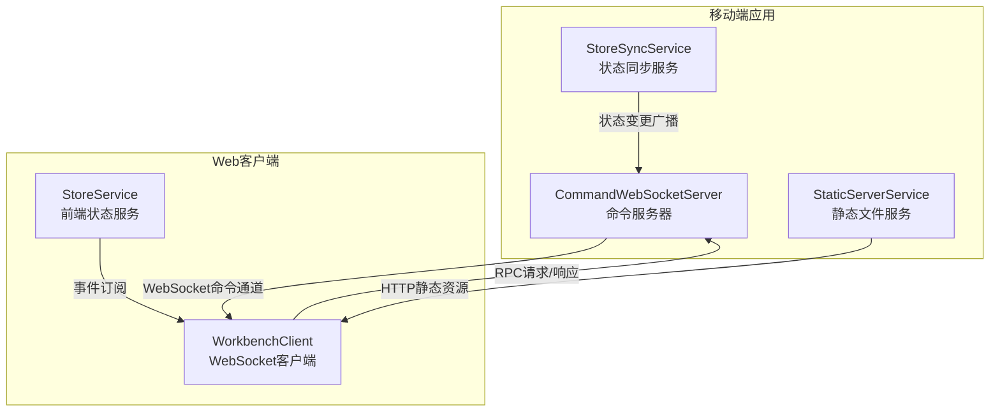
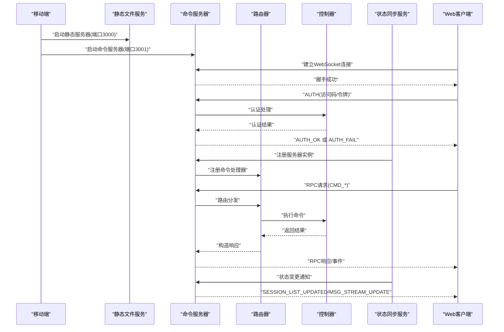
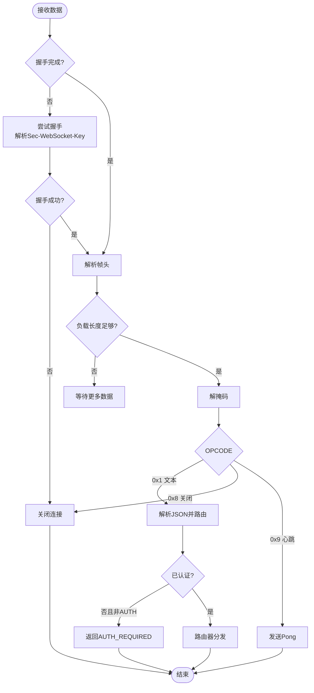
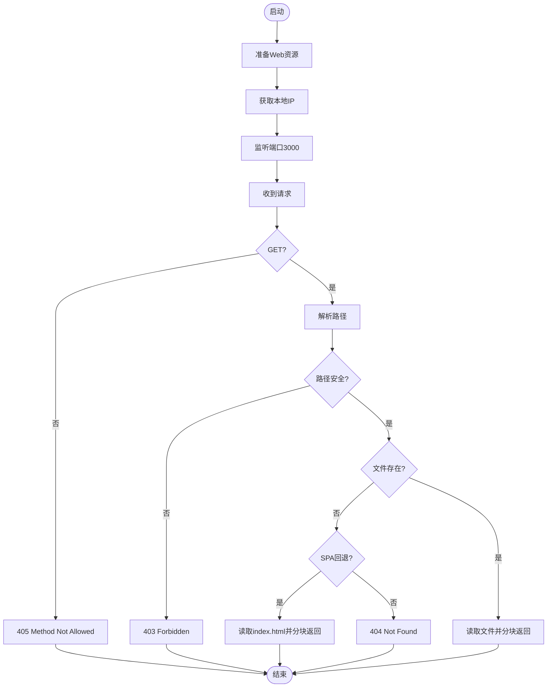
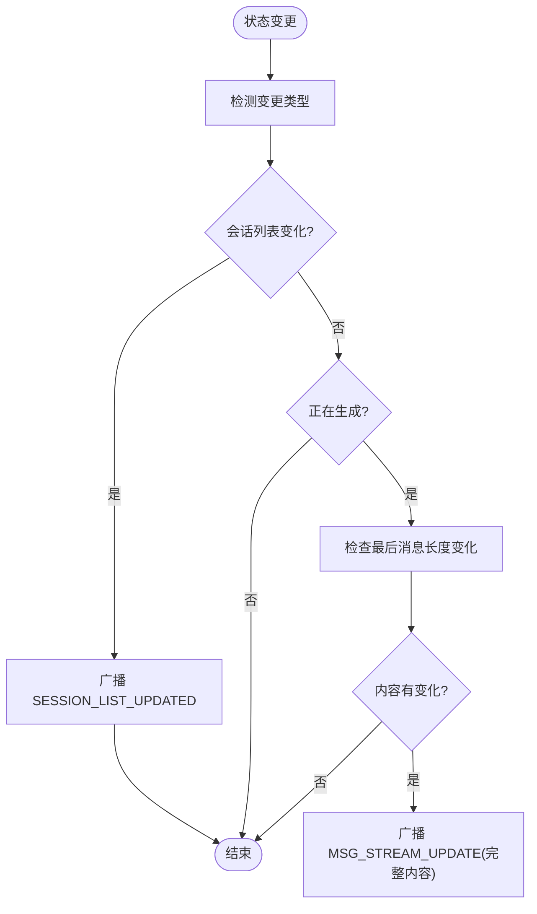
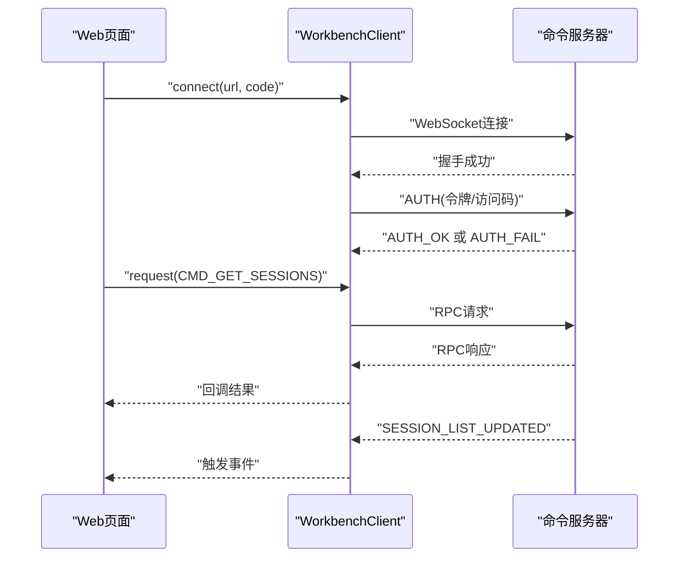
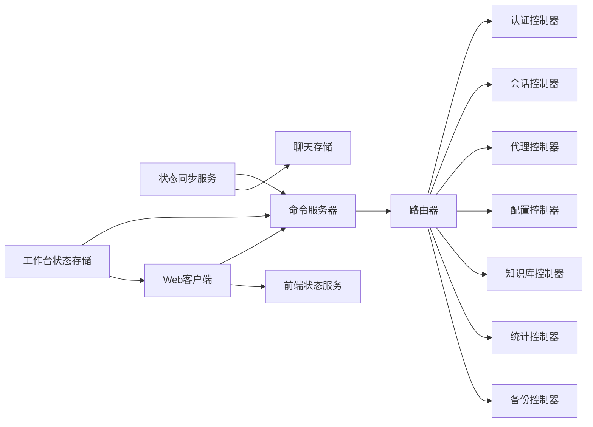

# Workbench远程管理

<cite>
**本文档引用的文件**
- [CommandWebSocketServer.ts](file://src/services/workbench/CommandWebSocketServer.ts)
- [StaticServerService.ts](file://src/services/workbench/StaticServerService.ts)
- [StoreSyncService.ts](file://src/services/workbench/StoreSyncService.ts)
- [WorkbenchRouter.ts](file://src/services/workbench/WorkbenchRouter.ts)
- [AuthController.ts](file://src/services/workbench/controllers/AuthController.ts)
- [AgentController.ts](file://src/services/workbench/controllers/AgentController.ts)
- [ChatController.ts](file://src/services/workbench/controllers/ChatController.ts)
- [ConfigController.ts](file://src/services/workbench/controllers/ConfigController.ts)
- [LibraryController.ts](file://src/services/workbench/controllers/LibraryController.ts)
- [StatsController.ts](file://src/services/workbench/controllers/StatsController.ts)
- [BackupController.ts](file://src/services/workbench/controllers/BackupController.ts)
- [workbench-store.ts](file://src/store/workbench-store.ts)
- [chat-store.ts](file://src/store/chat-store.ts)
- [WorkbenchClient.ts](file://web-client/src/services/WorkbenchClient.ts)
- [StoreService.ts](file://web-client/src/services/StoreService.ts)
- [useWebSocket.ts](file://web-client/src/hooks/useWebSocket.ts)
</cite>

## 目录
1. [简介](#简介)
2. [项目结构](#项目结构)
3. [核心组件](#核心组件)
4. [架构总览](#架构总览)
5. [详细组件分析](#详细组件分析)
6. [依赖关系分析](#依赖关系分析)
7. [性能考量](#性能考量)
8. [故障排除指南](#故障排除指南)
9. [结论](#结论)
10. [附录](#附录)

## 简介
本文件为Nexara Workbench远程管理系统的全面技术文档，聚焦于Workbench的架构设计与WebSocket通信机制，涵盖命令服务器、静态文件服务与状态同步服务。文档深入解析Web客户端与移动端的实时同步机制、数据传输协议与状态一致性保障，并阐述远程管理功能的实现原理（会话管理、代理控制、知识库操作、设置配置）。同时提供安全认证机制与访问控制策略、部署配置指南、性能监控与故障排除方法，并给出实际使用场景与最佳实践。

## 项目结构
Workbench系统由三部分组成：
- 命令服务器：基于TCP的WebSocket兼容服务器，负责命令路由与客户端认证。
- 静态文件服务：内嵌HTTP静态服务器，提供Web客户端资源托管。
- 状态同步服务：监听本地状态变化，向已认证客户端广播增量更新。

图表来源
- [CommandWebSocketServer.ts:33-178](file://src/services/workbench/CommandWebSocketServer.ts#L33-L178)
- [StaticServerService.ts:21-236](file://src/services/workbench/StaticServerService.ts#L21-L236)
- [StoreSyncService.ts:5-124](file://src/services/workbench/StoreSyncService.ts#L5-L124)
- [WorkbenchClient.ts:18-314](file://web-client/src/services/WorkbenchClient.ts#L18-L314)
- [StoreService.ts:30-133](file://web-client/src/services/StoreService.ts#L30-L133)

章节来源
- [CommandWebSocketServer.ts:33-178](file://src/services/workbench/CommandWebSocketServer.ts#L33-L178)
- [StaticServerService.ts:21-236](file://src/services/workbench/StaticServerService.ts#L21-L236)
- [StoreSyncService.ts:5-124](file://src/services/workbench/StoreSyncService.ts#L5-L124)
- [WorkbenchClient.ts:18-314](file://web-client/src/services/WorkbenchClient.ts#L18-L314)
- [StoreService.ts:30-133](file://web-client/src/services/StoreService.ts#L30-L133)

## 核心组件
- 命令服务器（CommandWebSocketServer）：实现自定义WebSocket握手、帧解析、心跳检测与写队列，注册命令路由并广播状态变更。
- 静态文件服务（StaticServerService）：打包Web客户端资源，通过TCP-HTTP提供静态内容，支持SPA回退与分块传输。
- 状态同步服务（StoreSyncService）：订阅本地Zustand状态，按需广播会话列表更新与流式消息更新。
- 路由器（WorkbenchRouter）：集中注册命令处理器，统一处理请求-响应与错误返回。
- 控制器（Controllers）：按功能域实现具体命令处理逻辑，如认证、代理、聊天、配置、知识库、统计与备份。
- 客户端（WorkbenchClient）：Web端WebSocket客户端，封装RPC请求、认证流程与心跳维护。
- 前端状态服务（StoreService）：订阅后端事件，拉取最新数据并组织前端树形结构。

章节来源
- [CommandWebSocketServer.ts:33-178](file://src/services/workbench/CommandWebSocketServer.ts#L33-L178)
- [StaticServerService.ts:21-236](file://src/services/workbench/StaticServerService.ts#L21-L236)
- [StoreSyncService.ts:5-124](file://src/services/workbench/StoreSyncService.ts#L5-L124)
- [WorkbenchRouter.ts:18-74](file://src/services/workbench/WorkbenchRouter.ts#L18-L74)
- [AuthController.ts:17-54](file://src/services/workbench/controllers/AuthController.ts#L17-L54)
- [ChatController.ts:5-129](file://src/services/workbench/controllers/ChatController.ts#L5-L129)
- [WorkbenchClient.ts:18-314](file://web-client/src/services/WorkbenchClient.ts#L18-L314)
- [StoreService.ts:30-133](file://web-client/src/services/StoreService.ts#L30-L133)

## 架构总览
Workbench采用“本地局域网内嵌服务器 + WebSocket命令通道”的架构。移动端启动静态文件服务与命令服务器，Web客户端通过WebSocket连接命令服务器进行认证与RPC调用；静态文件服务提供Web界面资源。状态同步服务监听本地状态变化并通过命令服务器广播增量更新，确保Web端与移动端实时一致。

图表来源
- [CommandWebSocketServer.ts:44-178](file://src/services/workbench/CommandWebSocketServer.ts#L44-L178)
- [WorkbenchRouter.ts:34-71](file://src/services/workbench/WorkbenchRouter.ts#L34-L71)
- [AuthController.ts:18-53](file://src/services/workbench/controllers/AuthController.ts#L18-L53)
- [StoreSyncService.ts:15-123](file://src/services/workbench/StoreSyncService.ts#L15-L123)
- [WorkbenchClient.ts:29-94](file://web-client/src/services/WorkbenchClient.ts#L29-L94)

## 详细组件分析

### 命令服务器（CommandWebSocketServer）
- 自定义WebSocket握手：解析HTTP升级请求，计算Accept Key，返回101切换协议。
- 帧解析与处理：支持文本与二进制帧、Ping/Pong心跳、掩码解码与OPCODE处理。
- 写队列与可靠传输：使用队列保证并发写入顺序，分片写入并等待drain事件，超时兜底。
- 认证拦截：未认证客户端仅允许AUTH命令，其他命令返回AUTH_REQUIRED。
- 心跳与清理：定时检查客户端心跳，超时断开；支持广播消息。
- 命令路由：在启动时注册所有命令处理器，统一通过路由器分发。

图表来源
- [CommandWebSocketServer.ts:192-444](file://src/services/workbench/CommandWebSocketServer.ts#L192-L444)

章节来源
- [CommandWebSocketServer.ts:33-178](file://src/services/workbench/CommandWebSocketServer.ts#L33-L178)
- [CommandWebSocketServer.ts:192-444](file://src/services/workbench/CommandWebSocketServer.ts#L192-L444)

### 静态文件服务（StaticServerService）
- 资源准备：将Web客户端构建产物复制到应用文档目录，保留.bundle扩展名以匹配引用。
- TCP-HTTP服务器：监听端口3000，仅支持GET方法；对路径进行安全校验，禁止目录穿越。
- SPA回退：当请求的静态资源不存在时，回退到index.html，支持单页应用路由。
- 分块传输：大文件按16KB分片写入，处理写阻塞与drain事件，确保可靠性。
- IP与URL：动态获取设备局域网IPv4地址，拼接完整访问URL并上报状态。

图表来源
- [StaticServerService.ts:24-236](file://src/services/workbench/StaticServerService.ts#L24-L236)

章节来源
- [StaticServerService.ts:21-236](file://src/services/workbench/StaticServerService.ts#L21-L236)

### 状态同步服务（StoreSyncService）
- 订阅本地状态：监听Zustand聊天存储，识别会话列表变更与流式生成状态。
- 会话列表更新：当会话数量或ID列表发生变化时广播SESSION_LIST_UPDATED，避免频繁发送全量数据。
- 流式消息更新：检测当前生成会话的最后一条助手消息内容长度变化，广播MSG_STREAM_UPDATE，携带完整内容以确保一致性。
- 生成完成通知：生成结束后广播MSG_STREAM_COMPLETE并刷新会话列表，清理缓存。

图表来源
- [StoreSyncService.ts:34-123](file://src/services/workbench/StoreSyncService.ts#L34-L123)

章节来源
- [StoreSyncService.ts:5-124](file://src/services/workbench/StoreSyncService.ts#L5-L124)

### 路由器（WorkbenchRouter）
- 命令注册：以字符串类型为键注册处理器，支持重复注册但不重复覆盖。
- 请求-响应：若消息包含ID，则在处理器返回后发送对应类型的RESPONSE消息；异常时发送ERROR消息。
- 错误处理：捕获处理器异常并返回标准化错误消息。

章节来源
- [WorkbenchRouter.ts:18-74](file://src/services/workbench/WorkbenchRouter.ts#L18-L74)

### 认证控制器（AuthController）
- 双重认证：支持令牌认证与访问码认证；令牌24小时有效期，定期清理过期令牌。
- 自动续发：首次认证成功后下发新令牌，客户端可保存在本地存储中。

章节来源
- [AuthController.ts:17-54](file://src/services/workbench/controllers/AuthController.ts#L17-L54)

### 会话管理（ChatController）
- 会话列表：返回轻量摘要，包含标题、代理ID、更新时间与最后消息片段。
- 历史记录：返回完整会话数据，对超长内容进行日志提示。
- 创建/删除：校验代理存在性，生成唯一ID并加入存储。
- 消息操作：发送消息触发后台生成，支持中断、删除与重新生成。

章节来源
- [ChatController.ts:5-129](file://src/services/workbench/controllers/ChatController.ts#L5-L129)

### 代理控制（AgentController）
- 列表/更新/创建/删除：直接操作代理存储，返回最新状态或确认信息。

章节来源
- [AgentController.ts:4-47](file://src/services/workbench/controllers/AgentController.ts#L4-L47)

### 配置管理（ConfigController）
- 获取配置：合并默认模型、全局RAG配置与提供商列表。
- 更新配置：支持全量同步，先更新后删除多余项，保证与客户端一致。

章节来源
- [ConfigController.ts:5-69](file://src/services/workbench/controllers/ConfigController.ts#L5-L69)

### 知识库操作（LibraryController）
- 库数据：加载文档与文件夹，返回统计信息。
- 文件操作：上传、删除、创建/删除文件夹。
- 图谱数据：根据文档ID、会话ID或代理ID获取图谱数据。

章节来源
- [LibraryController.ts:4-53](file://src/services/workbench/controllers/LibraryController.ts#L4-L53)

### 统计与备份（StatsController/BackupController）
- 统计：提供全局与按模型维度的令牌用量统计，支持重置。
- 备份：通过AsyncStorage读写WebDAV配置。

章节来源
- [StatsController.ts:4-22](file://src/services/workbench/controllers/StatsController.ts#L4-L22)
- [BackupController.ts:6-28](file://src/services/workbench/controllers/BackupController.ts#L6-L28)

### Web客户端（WorkbenchClient）
- 连接与认证：自动尝试令牌认证，失败则使用访问码；支持心跳与断线清理。
- RPC封装：为每个命令提供request方法，统一处理超时与响应。
- 事件驱动：订阅后端事件（如会话列表更新），拉取最新数据并更新前端状态。

图表来源
- [WorkbenchClient.ts:29-94](file://web-client/src/services/WorkbenchClient.ts#L29-L94)
- [WorkbenchClient.ts:222-241](file://web-client/src/services/WorkbenchClient.ts#L222-L241)
- [WorkbenchClient.ts:251-288](file://web-client/src/services/WorkbenchClient.ts#L251-L288)

章节来源
- [WorkbenchClient.ts:18-314](file://web-client/src/services/WorkbenchClient.ts#L18-L314)
- [StoreService.ts:30-133](file://web-client/src/services/StoreService.ts#L30-L133)

## 依赖关系分析
- 命令服务器依赖路由器与各控制器，通过注册命令类型实现功能扩展。
- 状态同步服务依赖聊天存储，向命令服务器广播事件。
- Web客户端依赖命令服务器提供的RPC接口，配合前端状态服务实现数据拉取与事件订阅。
- 移动端工作台状态存储用于维护服务器状态、访问码与活动令牌。

图表来源
- [CommandWebSocketServer.ts:134-167](file://src/services/workbench/CommandWebSocketServer.ts#L134-L167)
- [WorkbenchRouter.ts:18-74](file://src/services/workbench/WorkbenchRouter.ts#L18-L74)
- [StoreSyncService.ts:15-123](file://src/services/workbench/StoreSyncService.ts#L15-L123)
- [WorkbenchClient.ts:18-314](file://web-client/src/services/WorkbenchClient.ts#L18-L314)
- [workbench-store.ts:22-55](file://src/store/workbench-store.ts#L22-L55)

章节来源
- [CommandWebSocketServer.ts:134-167](file://src/services/workbench/CommandWebSocketServer.ts#L134-L167)
- [WorkbenchRouter.ts:18-74](file://src/services/workbench/WorkbenchRouter.ts#L18-L74)
- [StoreSyncService.ts:15-123](file://src/services/workbench/StoreSyncService.ts#L15-L123)
- [WorkbenchClient.ts:18-314](file://web-client/src/services/WorkbenchClient.ts#L18-L314)
- [workbench-store.ts:22-55](file://src/store/workbench-store.ts#L22-L55)

## 性能考量
- 写队列与分片：命令服务器对大帧进行1400字节分片写入并等待drain，避免阻塞与丢包。
- 心跳与超时：10秒心跳周期，30秒无心跳断开，降低无效连接占用。
- 分块传输：静态服务器对大文件按16KB分片写入，处理写阻塞与drain事件。
- 广播优化：状态同步服务仅在必要时广播，避免频繁全量推送。
- 会话列表更新：通过ID列表与长度快速判断变更，减少带宽消耗。

章节来源
- [CommandWebSocketServer.ts:370-413](file://src/services/workbench/CommandWebSocketServer.ts#L370-L413)
- [CommandWebSocketServer.ts:471-484](file://src/services/workbench/CommandWebSocketServer.ts#L471-L484)
- [StaticServerService.ts:147-176](file://src/services/workbench/StaticServerService.ts#L147-L176)
- [StoreSyncService.ts:50-77](file://src/services/workbench/StoreSyncService.ts#L50-L77)

## 故障排除指南
- 服务器启动失败（端口占用）：命令服务器与静态服务器均内置重试机制，若端口被占用将逐步延时重试并最终报错。请检查端口占用情况并释放端口。
- 连接断开：命令服务器每10秒检查一次心跳，超过30秒无心跳将主动销毁连接。请检查网络稳定性与防火墙设置。
- 写入失败：命令服务器对写阻塞进行drain监听与超时兜底，若持续失败请检查对端是否关闭连接。
- 认证失败：若令牌过期或访问码错误，服务器将返回认证失败消息。请重新输入访问码或清除本地令牌后重试。
- 静态资源404：静态服务器对非法路径进行安全过滤，确保路径合法。若出现404，请确认资源已正确复制到WWW目录。
- SPA回退：当请求的静态资源不存在时，服务器会回退到index.html。若页面空白，请检查构建产物是否完整。

章节来源
- [CommandWebSocketServer.ts:113-130](file://src/services/workbench/CommandWebSocketServer.ts#L113-L130)
- [CommandWebSocketServer.ts:471-484](file://src/services/workbench/CommandWebSocketServer.ts#L471-L484)
- [CommandWebSocketServer.ts:389-412](file://src/services/workbench/CommandWebSocketServer.ts#L389-L412)
- [AuthController.ts:38-52](file://src/services/workbench/controllers/AuthController.ts#L38-L52)
- [StaticServerService.ts:68-72](file://src/services/workbench/StaticServerService.ts#L68-L72)
- [StaticServerService.ts:82-120](file://src/services/workbench/StaticServerService.ts#L82-L120)

## 结论
Workbench通过本地嵌入式静态服务器与命令服务器，结合WebSocket命令通道与状态同步机制，实现了移动端与Web端的高效协同。其设计强调安全性（访问码与令牌）、可靠性（心跳与分片传输）与易扩展性（路由器+控制器模式）。通过合理的事件广播与增量更新策略，系统在低带宽环境下也能保持良好的用户体验。

## 附录

### 命令类型与用途
- AUTH：认证访问码或令牌。
- CMD_GET_AGENTS / CMD_UPDATE_AGENT / CMD_CREATE_AGENT / CMD_DELETE_AGENT：代理管理。
- CMD_GET_SESSIONS / CMD_GET_HISTORY / CMD_CREATE_SESSION / CMD_DELETE_SESSION / CMD_SEND_MESSAGE / CMD_ABORT_GENERATION / CMD_DELETE_MESSAGE / CMD_REGENERATE_MESSAGE：会话与消息管理。
- CMD_GET_CONFIG / CMD_UPDATE_CONFIG：配置管理。
- CMD_GET_LIBRARY / CMD_UPLOAD_FILE / CMD_DELETE_FILE / CMD_CREATE_FOLDER / CMD_DELETE_FOLDER / CMD_GET_GRAPH：知识库与图谱。
- CMD_GET_STATS / CMD_RESET_STATS：统计。
- CMD_GET_WEBDAV / CMD_UPDATE_WEBDAV：备份配置。

章节来源
- [CommandWebSocketServer.ts:134-167](file://src/services/workbench/CommandWebSocketServer.ts#L134-L167)
- [WorkbenchRouter.ts:34-71](file://src/services/workbench/WorkbenchRouter.ts#L34-L71)

### 安全认证与访问控制
- 访问码认证：支持固定访问码与开发者回退码。
- 令牌认证：24小时有效期，定期清理过期令牌。
- 未认证限制：仅允许AUTH命令，其他命令返回AUTH_REQUIRED。
- 令牌持久化：移动端工作台状态存储中维护活动令牌集合。

章节来源
- [AuthController.ts:17-54](file://src/services/workbench/controllers/AuthController.ts#L17-L54)
- [workbench-store.ts:22-55](file://src/store/workbench-store.ts#L22-L55)

### 部署配置指南
- 端口：静态服务器3000，命令服务器3001。
- 资源：确保Web客户端构建产物已复制到应用文档目录。
- 网络：确保设备在同一局域网内，防火墙允许本地端口通信。
- 权限：移动端需要后台运行权限与电池优化豁免（可选）。

章节来源
- [StaticServerService.ts:24-236](file://src/services/workbench/StaticServerService.ts#L24-L236)
- [CommandWebSocketServer.ts:44-178](file://src/services/workbench/CommandWebSocketServer.ts#L44-L178)

### 实际使用场景与最佳实践
- 场景一：远程查看与编辑会话历史。客户端通过CMD_GET_HISTORY获取完整会话，再通过CMD_DELETE_MESSAGE/CMD_REGENERATE_MESSAGE进行精细化操作。
- 场景二：批量导入知识库。客户端通过CMD_UPLOAD_FILE上传文件，随后通过CMD_GET_LIBRARY刷新视图。
- 场景三：跨端实时协作。移动端生成消息时，StoreSyncService广播MSG_STREAM_UPDATE，Web端即时渲染。
- 最佳实践：优先使用令牌认证；合理设置RAG参数；利用SPA回退与分块传输提升体验；定期清理过期令牌与无效连接。

章节来源
- [ChatController.ts:21-129](file://src/services/workbench/controllers/ChatController.ts#L21-L129)
- [LibraryController.ts:21-52](file://src/services/workbench/controllers/LibraryController.ts#L21-L52)
- [StoreSyncService.ts:79-123](file://src/services/workbench/StoreSyncService.ts#L79-L123)