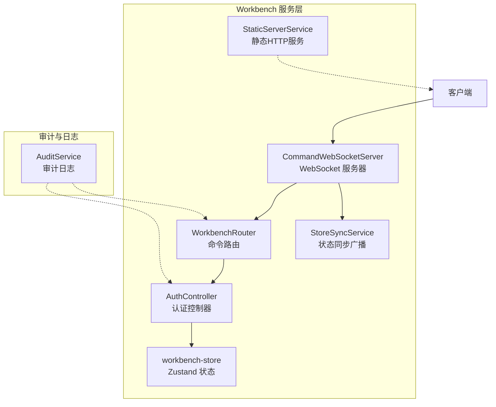
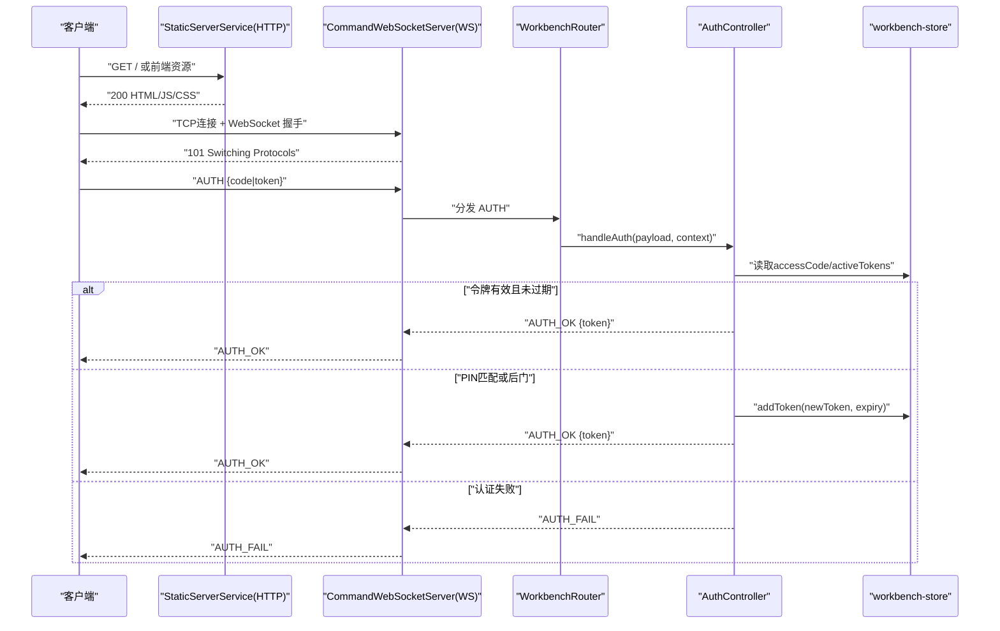
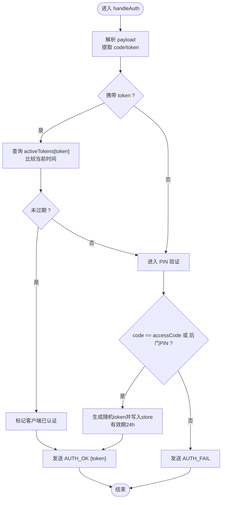
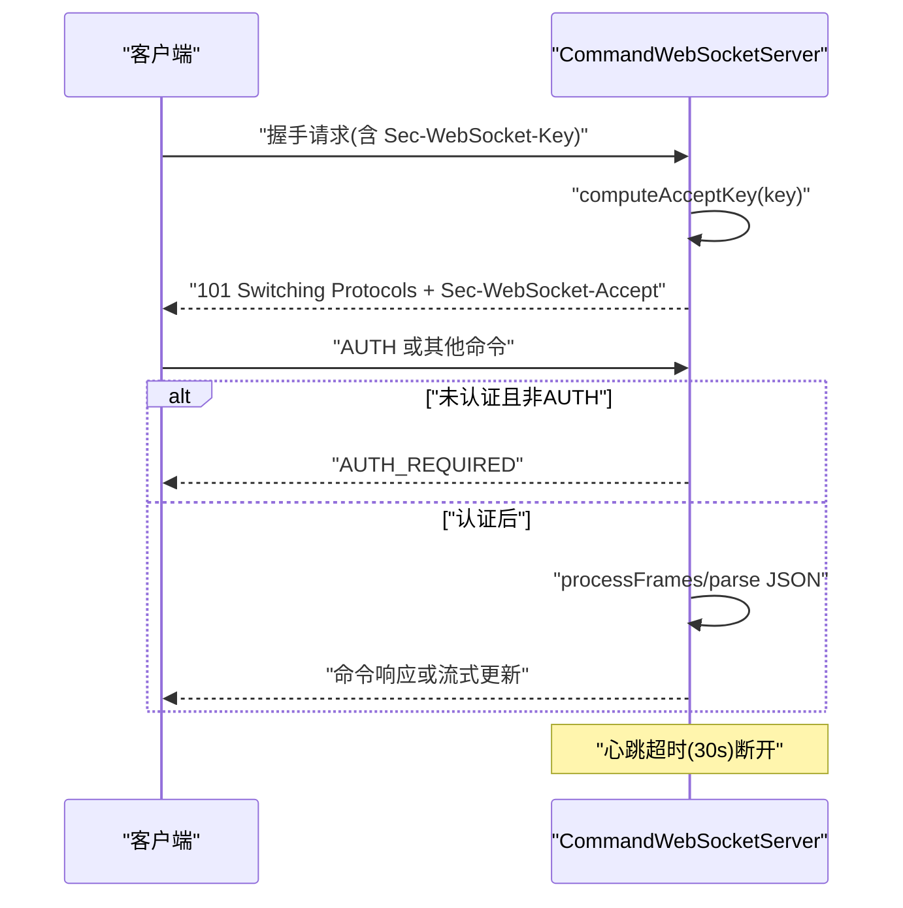
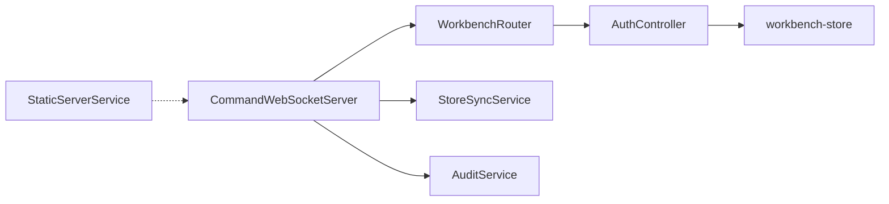

# 安全认证机制

<cite>
**本文引用的文件**
- [AuthController.ts](file://src/services/workbench/controllers/AuthController.ts)
- [CommandWebSocketServer.ts](file://src/services/workbench/CommandWebSocketServer.ts)
- [WorkbenchRouter.ts](file://src/services/workbench/WorkbenchRouter.ts)
- [workbench-store.ts](file://src/store/workbench-store.ts)
- [audit-service.ts](file://src/lib/services/audit-service.ts)
- [audit-report-final.md](file://docs/audit-report-final.md)
- [StaticServerService.ts](file://src/services/workbench/StaticServerService.ts)
- [StoreSyncService.ts](file://src/services/workbench/StoreSyncService.ts)
- [build-release.sh](file://build-release.sh)
- [withAndroidSigning.js](file://plugins/withAndroidSigning.js)
</cite>

## 目录
1. [简介](#简介)
2. [项目结构](#项目结构)
3. [核心组件](#核心组件)
4. [架构总览](#架构总览)
5. [详细组件分析](#详细组件分析)
6. [依赖关系分析](#依赖关系分析)
7. [性能考量](#性能考量)
8. [故障排查指南](#故障排查指南)
9. [结论](#结论)
10. [附录](#附录)

## 简介
本文件面向Nexara的Workbench安全认证机制，聚焦于认证流程、授权策略与会话管理，剖析AuthController的实现原理（身份验证、令牌生成与有效期管理），说明WebSocket连接的安全保护（握手验证、连接限制与异常处理），并给出安全威胁防护建议（DDoS、暴力破解、会话劫持）、安全配置指南、密钥管理与审计日志功能，最后提供安全最佳实践、漏洞防护与应急响应策略。

## 项目结构
Workbench安全相关的关键模块位于src/services/workbench目录，围绕命令式WebSocket服务器、路由分发、控制器与状态存储展开；同时配合审计服务与静态资源HTTP服务，形成从客户端到服务端的端到端安全闭环。

图表来源
- [CommandWebSocketServer.ts:33-178](file://src/services/workbench/CommandWebSocketServer.ts#L33-L178)
- [WorkbenchRouter.ts:18-72](file://src/services/workbench/WorkbenchRouter.ts#L18-L72)
- [AuthController.ts:17-54](file://src/services/workbench/controllers/AuthController.ts#L17-L54)
- [workbench-store.ts:22-55](file://src/store/workbench-store.ts#L22-L55)
- [StaticServerService.ts:21-236](file://src/services/workbench/StaticServerService.ts#L21-L236)
- [StoreSyncService.ts:5-32](file://src/services/workbench/StoreSyncService.ts#L5-L32)
- [audit-service.ts:26-85](file://src/lib/services/audit-service.ts#L26-L85)

章节来源
- [CommandWebSocketServer.ts:33-178](file://src/services/workbench/CommandWebSocketServer.ts#L33-L178)
- [WorkbenchRouter.ts:18-72](file://src/services/workbench/WorkbenchRouter.ts#L18-L72)
- [AuthController.ts:17-54](file://src/services/workbench/controllers/AuthController.ts#L17-L54)
- [workbench-store.ts:22-55](file://src/store/workbench-store.ts#L22-L55)
- [StaticServerService.ts:21-236](file://src/services/workbench/StaticServerService.ts#L21-L236)
- [StoreSyncService.ts:5-32](file://src/services/workbench/StoreSyncService.ts#L5-L32)
- [audit-service.ts:26-85](file://src/lib/services/audit-service.ts#L26-L85)

## 核心组件
- 认证控制器(AuthController)
  - 支持两种认证路径：令牌验证与PIN验证
  - 令牌有效期为24小时，周期性清理过期令牌
  - 生成新令牌并写入状态存储
- WebSocket服务器(CommandWebSocketServer)
  - 实现RFC 6455 WebSocket握手，基于Sec-WebSocket-Key计算Accept
  - 未认证客户端仅允许发送AUTH命令
  - 心跳检测与超时断连，写入队列保障原子性
- 路由分发(WorkbenchRouter)
  - 注册命令处理器，统一分发与错误处理
- 状态存储(workbench-store)
  - 存储accessCode、activeTokens、连接数等
  - 通过持久化减少重启后状态丢失
- 审计服务(audit-service)
  - 异步批量写入审计日志，支持查询与统计
- 静态HTTP服务(StaticServerService)
  - 提供Web界面静态资源托管，支持SPA回退
- 状态同步(StoreSyncService)
  - 将聊天状态变更广播至已认证客户端

章节来源
- [AuthController.ts:17-54](file://src/services/workbench/controllers/AuthController.ts#L17-L54)
- [CommandWebSocketServer.ts:192-484](file://src/services/workbench/CommandWebSocketServer.ts#L192-L484)
- [WorkbenchRouter.ts:18-72](file://src/services/workbench/WorkbenchRouter.ts#L18-L72)
- [workbench-store.ts:22-55](file://src/store/workbench-store.ts#L22-L55)
- [audit-service.ts:26-85](file://src/lib/services/audit-service.ts#L26-L85)
- [StaticServerService.ts:21-236](file://src/services/workbench/StaticServerService.ts#L21-L236)
- [StoreSyncService.ts:5-32](file://src/services/workbench/StoreSyncService.ts#L5-L32)

## 架构总览
Workbench采用“静态HTTP服务 + 命令式WebSocket服务”的双栈架构。静态HTTP服务负责Web界面与资源分发；WebSocket服务承载命令与实时流式输出。认证在WebSocket层进行，未认证客户端仅能发起认证请求；认证成功后获得令牌并在后续命令中携带。

图表来源
- [StaticServerService.ts:48-125](file://src/services/workbench/StaticServerService.ts#L48-L125)
- [CommandWebSocketServer.ts:203-239](file://src/services/workbench/CommandWebSocketServer.ts#L203-L239)
- [WorkbenchRouter.ts:34-71](file://src/services/workbench/WorkbenchRouter.ts#L34-L71)
- [AuthController.ts:18-53](file://src/services/workbench/controllers/AuthController.ts#L18-L53)
- [workbench-store.ts:35-42](file://src/store/workbench-store.ts#L35-L42)

## 详细组件分析

### 认证控制器(AuthController)实现原理
- 输入处理
  - 支持字符串PIN或对象{code|token}两种输入形式
- 令牌验证
  - 若携带token，则查询activeTokens并判断是否在有效期内
  - 有效则标记客户端为已认证，并返回AUTH_OK
- PIN验证与令牌发放
  - 若PIN等于accessCode或硬编码后门PIN，则标记为已认证
  - 生成新token并写入activeTokens，有效期24小时
- 定时清理
  - 每小时扫描一次activeTokens，移除过期令牌

图表来源
- [AuthController.ts:18-53](file://src/services/workbench/controllers/AuthController.ts#L18-L53)
- [workbench-store.ts:35-42](file://src/store/workbench-store.ts#L35-L42)

章节来源
- [AuthController.ts:17-54](file://src/services/workbench/controllers/AuthController.ts#L17-L54)
- [workbench-store.ts:22-55](file://src/store/workbench-store.ts#L22-L55)

### WebSocket连接安全保护
- 握手验证
  - 解析HTTP头中的Sec-WebSocket-Key，拼接Magic String后计算SHA-1并Base64编码，返回Sec-WebSocket-Accept
  - 未找到Key则关闭连接
- 连接限制与异常处理
  - 未认证客户端仅允许发送AUTH命令，其他命令返回AUTH_REQUIRED
  - 心跳超时(30秒)主动断开，避免僵尸连接
  - 写入采用队列与分片，确保原子性与可靠性
- 帧处理
  - 支持文本帧与Ping/Pong，对掩码帧进行解掩码
  - 严格按长度字段解析负载，避免粘包/半包

图表来源
- [CommandWebSocketServer.ts:203-239](file://src/services/workbench/CommandWebSocketServer.ts#L203-L239)
- [CommandWebSocketServer.ts:415-444](file://src/services/workbench/CommandWebSocketServer.ts#L415-L444)
- [CommandWebSocketServer.ts:471-484](file://src/services/workbench/CommandWebSocketServer.ts#L471-L484)

章节来源
- [CommandWebSocketServer.ts:192-484](file://src/services/workbench/CommandWebSocketServer.ts#L192-L484)

### 授权策略与会话管理
- 授权策略
  - 未认证客户端仅能调用AUTH命令
  - 认证成功后，客户端可调用已注册命令
  - 会话状态通过StoreSyncService向已认证客户端广播
- 会话管理
  - activeTokens作为内存态令牌表，结合定时清理实现生命周期管理
  - accessCode来自持久化状态，重启后仍可复用

章节来源
- [CommandWebSocketServer.ts:415-444](file://src/services/workbench/CommandWebSocketServer.ts#L415-L444)
- [StoreSyncService.ts:5-32](file://src/services/workbench/StoreSyncService.ts#L5-L32)
- [workbench-store.ts:22-55](file://src/store/workbench-store.ts#L22-L55)

### 审计日志与安全配置
- 审计日志
  - 异步批量写入，事务提交，失败回滚
  - 支持按会话、动作、资源类型、时间范围查询
  - 提供最近错误查询与24小时统计
- 安全配置与密钥管理
  - Android签名密钥通过脚本注入构建环境，避免硬编码
  - Gradle签名配置从secure.properties读取，若不存在回退调试签名

章节来源
- [audit-service.ts:26-203](file://src/lib/services/audit-service.ts#L26-L203)
- [build-release.sh:1-43](file://build-release.sh#L1-L43)
- [withAndroidSigning.js:18-42](file://plugins/withAndroidSigning.js#L18-L42)

## 依赖关系分析
- 组件耦合
  - CommandWebSocketServer依赖WorkbenchRouter与AuthController
  - AuthController依赖workbench-store进行令牌与PIN校验
  - StoreSyncService依赖chat-store进行状态广播
  - AuditService独立于业务，提供通用审计能力
- 外部依赖
  - jsrsasign用于WebSocket握手Accept计算
  - react-native-tcp-socket提供底层TCP套接字
  - AsyncStorage与persist用于状态持久化

图表来源
- [CommandWebSocketServer.ts:7-15](file://src/services/workbench/CommandWebSocketServer.ts#L7-L15)
- [WorkbenchRouter.ts:18-28](file://src/services/workbench/WorkbenchRouter.ts#L18-L28)
- [AuthController.ts:1-2](file://src/services/workbench/controllers/AuthController.ts#L1-L2)
- [workbench-store.ts:1-3](file://src/store/workbench-store.ts#L1-L3)
- [StoreSyncService.ts:1-3](file://src/services/workbench/StoreSyncService.ts#L1-L3)
- [audit-service.ts:1-2](file://src/lib/services/audit-service.ts#L1-L2)

章节来源
- [CommandWebSocketServer.ts:7-15](file://src/services/workbench/CommandWebSocketServer.ts#L7-L15)
- [WorkbenchRouter.ts:18-28](file://src/services/workbench/WorkbenchRouter.ts#L18-L28)
- [AuthController.ts:1-2](file://src/services/workbench/controllers/AuthController.ts#L1-L2)
- [workbench-store.ts:1-3](file://src/store/workbench-store.ts#L1-L3)
- [StoreSyncService.ts:1-3](file://src/services/workbench/StoreSyncService.ts#L1-L3)
- [audit-service.ts:1-2](file://src/lib/services/audit-service.ts#L1-L2)

## 性能考量
- 写入可靠性
  - WebSocket写入采用队列与分片，避免阻塞与丢包
- 周期清理
  - 认证令牌每小时清理一次，避免内存膨胀
- 广播效率
  - StoreSyncService按变更检测与增量广播，降低带宽占用

章节来源
- [CommandWebSocketServer.ts:307-413](file://src/services/workbench/CommandWebSocketServer.ts#L307-L413)
- [AuthController.ts:6-15](file://src/services/workbench/controllers/AuthController.ts#L6-L15)
- [StoreSyncService.ts:50-77](file://src/services/workbench/StoreSyncService.ts#L50-L77)

## 故障排查指南
- 认证失败
  - 检查accessCode与输入PIN是否一致
  - 确认activeTokens中是否存在token且未过期
- 握手失败
  - 确认客户端是否正确发送Sec-WebSocket-Key
  - 查看服务器日志中握手响应是否返回
- 连接断开
  - 检查心跳是否正常上报
  - 确认未认证客户端尝试发送非AUTH命令
- 审计日志异常
  - 检查批量写入是否触发回滚
  - 查询最近错误与统计数据定位问题

章节来源
- [CommandWebSocketServer.ts:415-444](file://src/services/workbench/CommandWebSocketServer.ts#L415-L444)
- [audit-service.ts:49-85](file://src/lib/services/audit-service.ts#L49-L85)

## 结论
当前Workbench安全机制以轻量令牌认证为核心，配合WebSocket握手与心跳机制实现基本的访问控制与连接管理。审计服务提供基础的日志能力，但整体仍存在硬编码后门、无加密传输、无速率限制与细粒度权限控制等风险点。建议优先移除后门、引入TLS加密、增强认证与速率限制，并完善访问控制与审计策略，以满足企业级安全要求。

## 附录

### 安全威胁防护措施
- DDoS攻击防护
  - 速率限制：对AUTH命令与高频命令实施限速
  - 连接数限制：根据设备性能设定最大并发连接
  - 心跳超时：30秒无心跳断开，释放资源
- 暴力破解防范
  - 限制PIN尝试次数与冷却时间
  - 引入验证码或二次验证
- 会话劫持防护
  - 使用不可预测的随机令牌，缩短有效期
  - 引入绑定策略（如设备指纹、IP白名单）

章节来源
- [audit-report-final.md:667-730](file://docs/audit-report-final.md#L667-L730)
- [CommandWebSocketServer.ts:471-484](file://src/services/workbench/CommandWebSocketServer.ts#L471-L484)
- [AuthController.ts:4-15](file://src/services/workbench/controllers/AuthController.ts#L4-L15)

### 安全配置指南
- 移除硬编码后门
  - 立即移除PIN校验中的后门常量
- TLS加密传输
  - 在WebSocket层引入TLS，或通过反向代理强制HTTPS
- 密钥管理
  - 使用脚本与插件从安全环境读取密钥，避免硬编码
- 审计日志
  - 启用结构化日志，保留至少30天审计记录

章节来源
- [audit-report-final.md:667-730](file://docs/audit-report-final.md#L667-L730)
- [build-release.sh:1-43](file://build-release.sh#L1-L43)
- [withAndroidSigning.js:18-42](file://plugins/withAndroidSigning.js#L18-L42)

### 安全最佳实践
- 最小权限原则：仅授予必要功能访问
- 多因素认证：PIN + 令牌 + 可选二次验证
- 定期轮换：令牌与密钥定期更换
- 安全审计：启用审计日志并定期审查
- 应急响应：建立认证失败、令牌泄露、DDoS等预案

章节来源
- [audit-report-final.md:730-796](file://docs/audit-report-final.md#L730-L796)