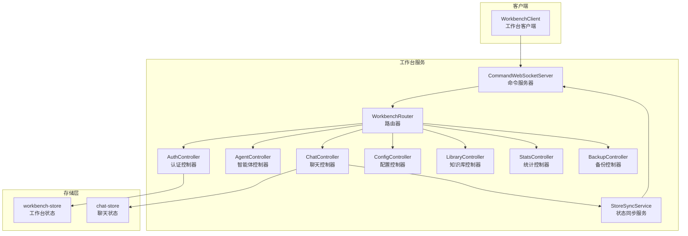
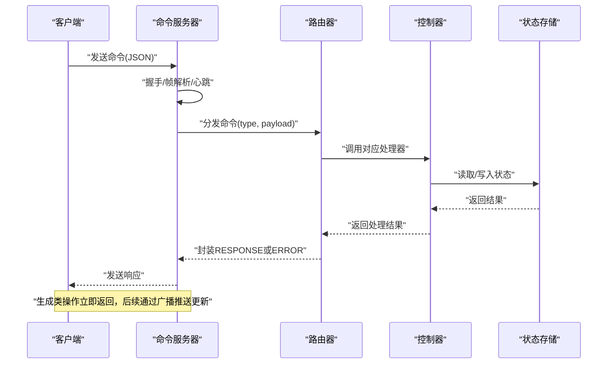
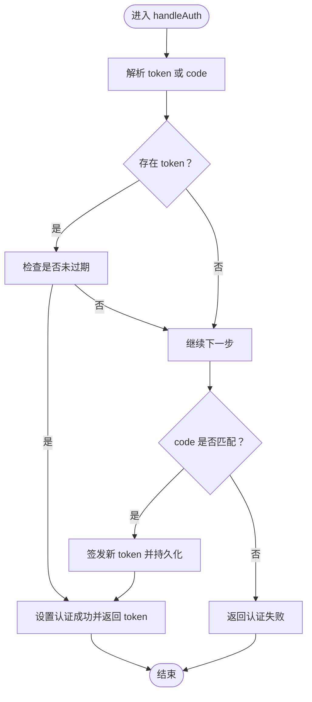
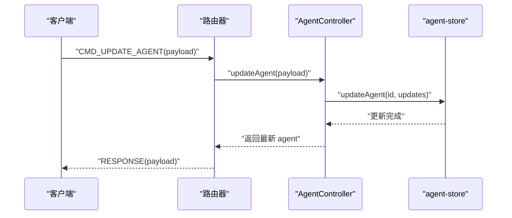
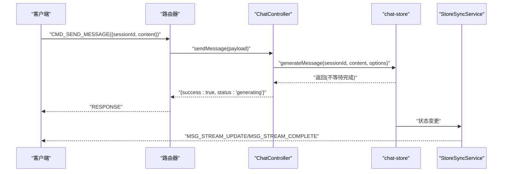
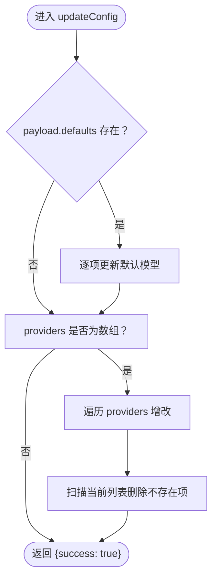
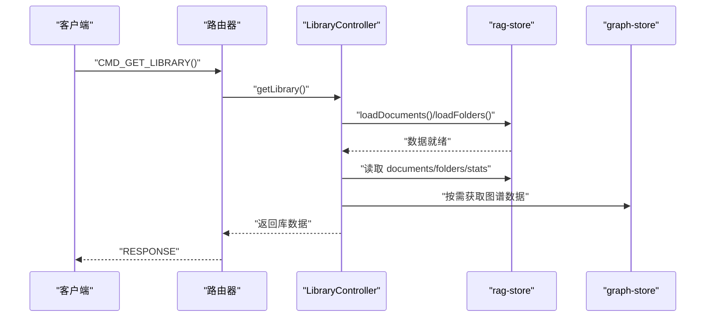
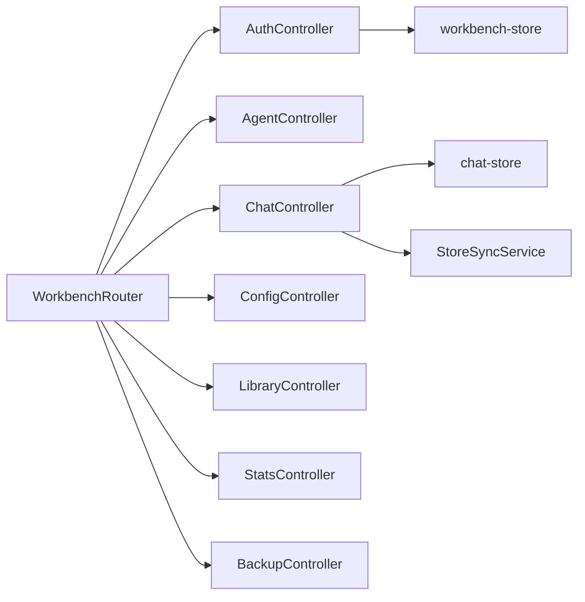

# 控制器层架构

<cite>
**本文引用的文件**
- [AuthController.ts](file://src/services/workbench/controllers/AuthController.ts)
- [AgentController.ts](file://src/services/workbench/controllers/AgentController.ts)
- [ChatController.ts](file://src/services/workbench/controllers/ChatController.ts)
- [ConfigController.ts](file://src/services/workbench/controllers/ConfigController.ts)
- [LibraryController.ts](file://src/services/workbench/controllers/LibraryController.ts)
- [StatsController.ts](file://src/services/workbench/controllers/StatsController.ts)
- [BackupController.ts](file://src/services/workbench/controllers/BackupController.ts)
- [WorkbenchRouter.ts](file://src/services/workbench/WorkbenchRouter.ts)
- [CommandWebSocketServer.ts](file://src/services/workbench/CommandWebSocketServer.ts)
- [StoreSyncService.ts](file://src/services/workbench/StoreSyncService.ts)
- [workbench-store.ts](file://src/store/workbench-store.ts)
- [chat-store.ts](file://src/store/chat-store.ts)
- [WorkbenchClient.ts](file://web-client/src/services/WorkbenchClient.ts)
</cite>

## 目录
1. [引言](#引言)
2. [项目结构](#项目结构)
3. [核心组件](#核心组件)
4. [架构总览](#架构总览)
5. [详细组件分析](#详细组件分析)
6. [依赖关系分析](#依赖关系分析)
7. [性能考量](#性能考量)
8. [故障排查指南](#故障排查指南)
9. [结论](#结论)
10. [附录](#附录)

## 引言
本文件系统性梳理 Nexara 工作台控制器层的架构设计与实现细节，覆盖认证、智能体、聊天、配置、知识库、统计与备份七大控制器的职责边界、请求处理流程、与服务层/存储层的交互方式、安全机制与可扩展性，并提供测试策略与性能优化建议。目标是帮助开发者快速理解并高效扩展控制器层功能。

## 项目结构
控制器层位于工作台服务模块中，采用“命令式 WebSocket + 路由分发”的轻量架构：
- 命令服务器负责 TCP-HTTP/WebSocket 接入、握手、帧解析、心跳与广播。
- 路由器将命令类型映射到具体控制器方法，统一处理请求-响应与错误包装。
- 控制器通过 Zustand 状态存储读写业务数据，部分复杂逻辑下沉到 StoreSyncService 进行状态同步与事件广播。
- 客户端通过浏览器 WebSocket 连接工作台，以 RPC 风格的命令进行交互。

图表来源
- [CommandWebSocketServer.ts:134-166](file://src/services/workbench/CommandWebSocketServer.ts#L134-L166)
- [WorkbenchRouter.ts:18-72](file://src/services/workbench/WorkbenchRouter.ts#L18-L72)
- [AuthController.ts:17-54](file://src/services/workbench/controllers/AuthController.ts#L17-L54)
- [AgentController.ts:4-47](file://src/services/workbench/controllers/AgentController.ts#L4-L47)
- [ChatController.ts:5-129](file://src/services/workbench/controllers/ChatController.ts#L5-L129)
- [ConfigController.ts:5-70](file://src/services/workbench/controllers/ConfigController.ts#L5-L70)
- [LibraryController.ts:4-53](file://src/services/workbench/controllers/LibraryController.ts#L4-L53)
- [StatsController.ts:4-22](file://src/services/workbench/controllers/StatsController.ts#L4-L22)
- [BackupController.ts:6-28](file://src/services/workbench/controllers/BackupController.ts#L6-L28)
- [StoreSyncService.ts:5-124](file://src/services/workbench/StoreSyncService.ts#L5-L124)
- [workbench-store.ts:22-55](file://src/store/workbench-store.ts#L22-L55)
- [chat-store.ts:108-200](file://src/store/chat-store.ts#L108-L200)
- [WorkbenchClient.ts:18-316](file://web-client/src/services/WorkbenchClient.ts#L18-L316)

章节来源
- [CommandWebSocketServer.ts:134-166](file://src/services/workbench/CommandWebSocketServer.ts#L134-L166)
- [WorkbenchRouter.ts:18-72](file://src/services/workbench/WorkbenchRouter.ts#L18-L72)

## 核心组件
- 认证控制器(AuthController)
  - 职责：基于访问码或令牌完成鉴权；维护短期令牌有效期；清理过期令牌。
  - 关键点：支持开发者回退码；令牌过期自动清理；仅允许未认证客户端调用 AUTH 命令。
- 智能体控制器(AgentController)
  - 职责：获取、创建、更新、删除智能体；对输入进行基础校验。
  - 关键点：返回最新状态；可选广播更新（注释掉）。
- 聊天控制器(ChatController)
  - 职责：会话管理、消息操作、生成触发与中断；返回轻量摘要或完整历史。
  - 关键点：生成异步触发，不阻塞请求；大体量历史记录日志提示；严格参数校验。
- 配置控制器(ConfigController)
  - 职责：读取与全量同步配置（默认模型、全局 RAG、提供商列表）。
  - 关键点：按需更新默认模型；全量同步提供商列表（增删改）。
- 知识库控制器(LibraryController)
  - 职责：文档/文件夹管理、向量化统计、图谱数据获取。
  - 关键点：加载时确保数据就绪；上传/删除返回成功标记。
- 统计控制器(StatsController)
  - 职责：读取全局与按模型维度的令牌统计；重置统计。
- 备份控制器(BackupController)
  - 职责：读取/保存 WebDAV 备份配置（本地持久化）。
  - 关键点：异常转为错误响应或抛出，便于 UI 展示空配置。

章节来源
- [AuthController.ts:17-54](file://src/services/workbench/controllers/AuthController.ts#L17-L54)
- [AgentController.ts:4-47](file://src/services/workbench/controllers/AgentController.ts#L4-L47)
- [ChatController.ts:5-129](file://src/services/workbench/controllers/ChatController.ts#L5-L129)
- [ConfigController.ts:5-70](file://src/services/workbench/controllers/ConfigController.ts#L5-L70)
- [LibraryController.ts:4-53](file://src/services/workbench/controllers/LibraryController.ts#L4-L53)
- [StatsController.ts:4-22](file://src/services/workbench/controllers/StatsController.ts#L4-L22)
- [BackupController.ts:6-28](file://src/services/workbench/controllers/BackupController.ts#L6-L28)

## 架构总览
控制器层采用“命令-响应”模式，客户端通过 WebSocket 发送 JSON 命令，服务器在路由器中查找处理器，执行后按需返回响应或错误。认证阶段限制未认证客户端仅能调用 AUTH 命令；生成类操作采用“启动即返回”的异步模式，通过 StoreSyncService 广播流式更新。

图表来源
- [CommandWebSocketServer.ts:415-444](file://src/services/workbench/CommandWebSocketServer.ts#L415-L444)
- [WorkbenchRouter.ts:34-71](file://src/services/workbench/WorkbenchRouter.ts#L34-L71)
- [StoreSyncService.ts:34-48](file://src/services/workbench/StoreSyncService.ts#L34-L48)

## 详细组件分析

### 认证控制器(AuthController)
- 设计要点
  - 使用工作台状态存储维护活动令牌与过期时间，定时清理过期令牌。
  - 支持令牌校验与访问码校验（含开发者回退码），通过上下文设置认证状态并返回令牌或失败。
- 请求处理流程
  - 解析 payload 中的 token 或 code。
  - 若存在有效 token 则直接认证成功并返回 token。
  - 否则校验访问码，通过则签发新 token 并持久化。
  - 认证失败返回失败消息。
- 错误处理
  - 严格区分“令牌无效/过期”与“访问码错误”，避免混淆。
- 安全机制
  - 未认证客户端仅允许调用 AUTH。
  - 令牌有效期短（24 小时），降低泄露风险。
  - 开发者回退码仅用于开发场景。

图表来源
- [AuthController.ts:18-53](file://src/services/workbench/controllers/AuthController.ts#L18-L53)
- [workbench-store.ts:35-42](file://src/store/workbench-store.ts#L35-L42)

章节来源
- [AuthController.ts:17-54](file://src/services/workbench/controllers/AuthController.ts#L17-L54)
- [workbench-store.ts:22-55](file://src/store/workbench-store.ts#L22-L55)

### 智能体控制器(AgentController)
- 功能定位
  - 提供智能体的 CRUD 操作，返回最新状态。
- 参数验证
  - 更新/删除必须携带 id；创建时要求关键字段。
- 与服务层交互
  - 直接读写智能体存储，必要时可广播更新（预留）。
- 错误处理
  - 缺少必要参数时抛出错误，由路由器包装为 ERROR 响应。

图表来源
- [AgentController.ts:10-26](file://src/services/workbench/controllers/AgentController.ts#L10-L26)
- [CommandWebSocketServer.ts:136-139](file://src/services/workbench/CommandWebSocketServer.ts#L136-L139)

章节来源
- [AgentController.ts:4-47](file://src/services/workbench/controllers/AgentController.ts#L4-L47)

### 聊天控制器(ChatController)
- 功能定位
  - 会话列表摘要、完整历史、创建/删除会话、发送消息、中断生成、删除/重生成消息。
- 参数验证与安全
  - 所有关键操作均进行参数校验；发送/重生成消息采用“启动即返回”模式，避免阻塞。
- 与服务层交互
  - 调用聊天存储发起生成；生成过程通过 StoreSyncService 广播流式更新。
- 性能注意
  - 大体量历史记录会打印长度日志，便于诊断。
  - 生成前不 await 全流程，仅确保启动成功。

图表来源
- [ChatController.ts:75-95](file://src/services/workbench/controllers/ChatController.ts#L75-L95)
- [StoreSyncService.ts:79-123](file://src/services/workbench/StoreSyncService.ts#L79-L123)

章节来源
- [ChatController.ts:5-129](file://src/services/workbench/controllers/ChatController.ts#L5-L129)
- [StoreSyncService.ts:34-124](file://src/services/workbench/StoreSyncService.ts#L34-L124)

### 配置控制器(ConfigController)
- 功能定位
  - 读取默认模型、全局 RAG 配置与提供商列表；全量同步提供商配置。
- 数据一致性
  - 对提供商列表采用“全量同步”策略：先增改，再删除缺失项，保证最终一致。
- 与服务层交互
  - 读取设置存储与 API 存储；更新时逐项调用对应 setter。

图表来源
- [ConfigController.ts:25-69](file://src/services/workbench/controllers/ConfigController.ts#L25-L69)

章节来源
- [ConfigController.ts:5-70](file://src/services/workbench/controllers/ConfigController.ts#L5-L70)

### 知识库控制器(LibraryController)
- 功能定位
  - 文档/文件夹管理、向量化统计、图谱数据获取。
- 数据加载策略
  - 获取库时确保文档与文件夹均已加载，避免客户端多次往返。
- 与服务层交互
  - 通过 RAG 存储与图谱存储读写数据。

图表来源
- [LibraryController.ts:5-19](file://src/services/workbench/controllers/LibraryController.ts#L5-L19)

章节来源
- [LibraryController.ts:4-53](file://src/services/workbench/controllers/LibraryController.ts#L4-L53)

### 统计控制器(StatsController)
- 功能定位
  - 读取全局与按模型维度的令牌统计；支持按模型或全局重置。
- 与服务层交互
  - 直接读取/重置令牌统计存储。

章节来源
- [StatsController.ts:4-22](file://src/services/workbench/controllers/StatsController.ts#L4-L22)

### 备份控制器(BackupController)
- 功能定位
  - 读取/保存 WebDAV 备份配置（本地持久化）。
- 错误处理
  - 读取失败返回空对象；保存失败抛出错误，由客户端捕获并展示。

章节来源
- [BackupController.ts:6-28](file://src/services/workbench/controllers/BackupController.ts#L6-L28)

## 依赖关系分析
- 控制器与路由器
  - 路由器注册命令类型到控制器方法，统一处理请求-响应与错误包装。
- 控制器与存储层
  - 认证：工作台状态存储；聊天：聊天状态存储；配置：设置与 API 存储；统计：令牌统计存储；知识库：RAG 与图谱存储。
- 控制器与服务层
  - 聊天生成通过 StoreSyncService 广播流式更新，实现“启动即返回”的用户体验。
- 客户端集成
  - 客户端以 RPC 风格发送命令，自动处理超时、心跳与认证状态切换。

图表来源
- [WorkbenchRouter.ts:18-72](file://src/services/workbench/WorkbenchRouter.ts#L18-L72)
- [CommandWebSocketServer.ts:134-166](file://src/services/workbench/CommandWebSocketServer.ts#L134-L166)
- [workbench-store.ts:22-55](file://src/store/workbench-store.ts#L22-L55)
- [chat-store.ts:108-200](file://src/store/chat-store.ts#L108-L200)
- [StoreSyncService.ts:5-124](file://src/services/workbench/StoreSyncService.ts#L5-L124)

章节来源
- [WorkbenchRouter.ts:18-72](file://src/services/workbench/WorkbenchRouter.ts#L18-L72)
- [CommandWebSocketServer.ts:134-166](file://src/services/workbench/CommandWebSocketServer.ts#L134-L166)

## 性能考量
- 流式更新与广播
  - 生成类操作立即返回，通过广播推送增量内容，避免长连接阻塞。
- 大数据量日志
  - 历史记录与帧大小超过阈值时打印日志，便于定位性能瓶颈。
- 写入可靠性
  - 采用队列化写入与分片传输，结合 drain 回调与超时保护，提升稳定性。
- 心跳与超时
  - 定期心跳检测与超时断连，减少僵尸连接占用资源。

章节来源
- [CommandWebSocketServer.ts:307-413](file://src/services/workbench/CommandWebSocketServer.ts#L307-L413)
- [StoreSyncService.ts:79-123](file://src/services/workbench/StoreSyncService.ts#L79-L123)

## 故障排查指南
- 认证失败
  - 检查 token 是否过期或无效；确认访问码正确；留意开发者回退码仅限开发使用。
- 请求无响应
  - 确认客户端已认证；检查命令类型是否注册；关注路由器未知命令警告。
- 生成未返回
  - 生成操作已启动但未阻塞请求属预期；通过 MSG_STREAM_UPDATE/MSG_STREAM_COMPLETE 监听进度。
- 备份配置异常
  - 读取失败返回空对象；保存失败抛出错误，检查本地存储权限与网络配置。

章节来源
- [AuthController.ts:18-53](file://src/services/workbench/controllers/AuthController.ts#L18-L53)
- [WorkbenchRouter.ts:55-70](file://src/services/workbench/WorkbenchRouter.ts#L55-L70)
- [StoreSyncService.ts:79-123](file://src/services/workbench/StoreSyncService.ts#L79-L123)
- [BackupController.ts:6-28](file://src/services/workbench/controllers/BackupController.ts#L6-L28)

## 结论
控制器层以简洁的命令-响应模型实现高内聚、低耦合的业务编排：认证控制器保障接入安全，各业务控制器聚焦单一职责并通过状态存储与服务层协同完成复杂流程。通过 StoreSyncService 实现的流式广播与“启动即返回”的生成模式，显著提升了用户体验与系统吞吐。建议在扩展新控制器时遵循现有模式：明确命令类型、严格参数校验、最小化错误传播、利用广播推送状态变更。

## 附录
- API 使用方法（客户端侧）
  - 连接与认证：客户端连接工作台后自动尝试令牌或访问码认证，认证成功后进入已认证状态。
  - 常用命令
    - 获取/更新配置：CMD_GET_CONFIG、CMD_UPDATE_CONFIG
    - 会话管理：CMD_GET_SESSIONS、CMD_CREATE_SESSION、CMD_DELETE_SESSION
    - 发送消息与中断：CMD_SEND_MESSAGE、CMD_ABORT_GENERATION
    - 删除/重生成消息：CMD_DELETE_MESSAGE、CMD_REGENERATE_MESSAGE
    - 获取知识库与图谱：CMD_GET_LIBRARY、CMD_GET_GRAPH
    - 获取/重置统计：CMD_GET_STATS、CMD_RESET_STATS
    - WebDAV 备份：CMD_GET_WEBDAV、CMD_UPDATE_WEBDAV
  - 参考路径
    - [WorkbenchClient.ts:29-316](file://web-client/src/services/WorkbenchClient.ts#L29-L316)

章节来源
- [WorkbenchClient.ts:18-316](file://web-client/src/services/WorkbenchClient.ts#L18-L316)