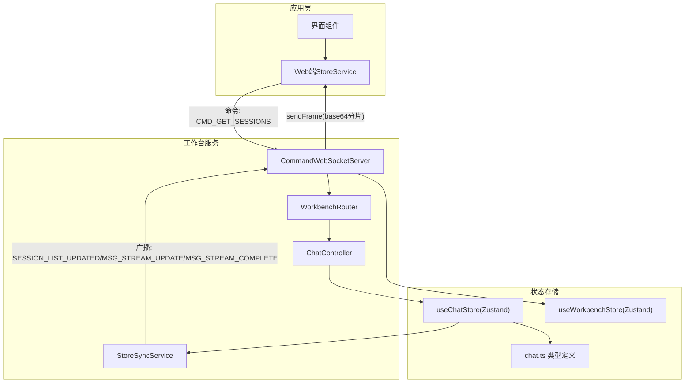
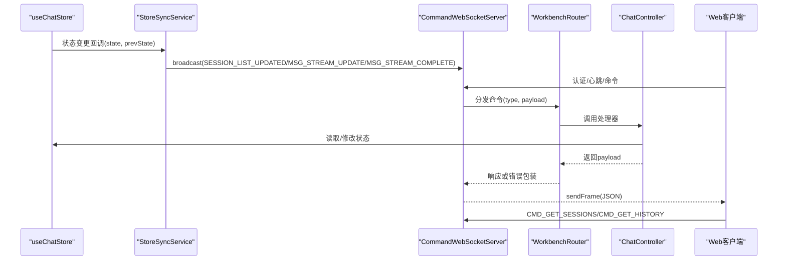
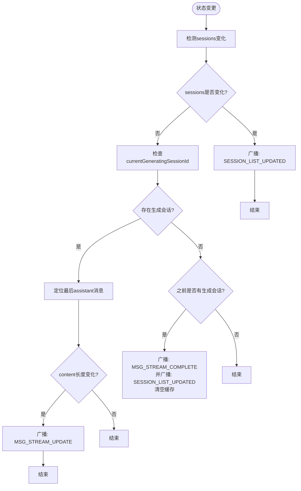
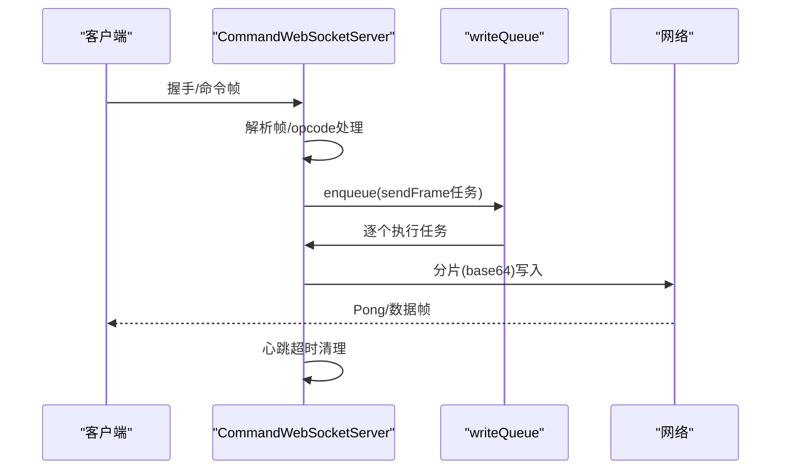
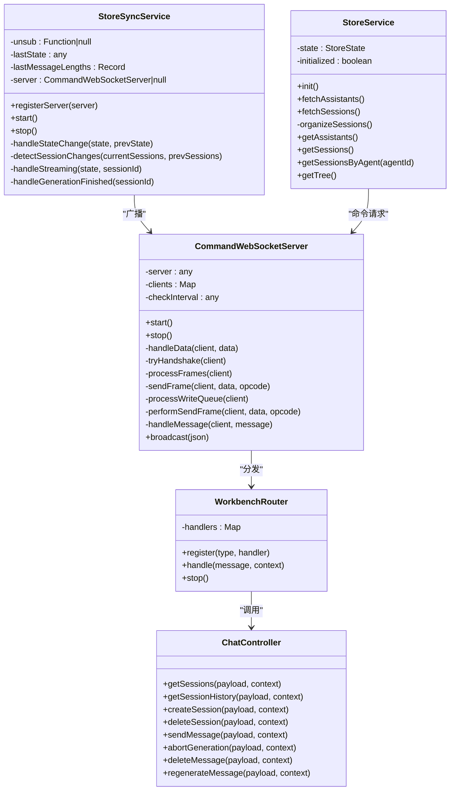
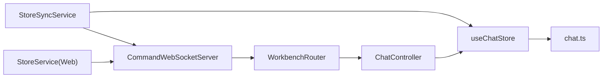

# 状态同步服务

<cite>
**本文引用的文件**
- [StoreSyncService.ts](file://src/services/workbench/StoreSyncService.ts)
- [CommandWebSocketServer.ts](file://src/services/workbench/CommandWebSocketServer.ts)
- [chat-store.ts](file://src/store/chat-store.ts)
- [chat.ts](file://src/types/chat.ts)
- [workbench-store.ts](file://src/store/workbench-store.ts)
- [StoreService.ts](file://web-client/src/services/StoreService.ts)
- [ChatController.ts](file://src/services/workbench/controllers/ChatController.ts)
- [WorkbenchRouter.ts](file://src/services/workbench/WorkbenchRouter.ts)
- [http-transport.ts](file://src/lib/mcp/transports/http-transport.ts)
- [sse-transport.ts](file://src/lib/mcp/transports/sse-transport.ts)
</cite>

## 目录
1. [简介](#简介)
2. [项目结构](#项目结构)
3. [核心组件](#核心组件)
4. [架构总览](#架构总览)
5. [详细组件分析](#详细组件分析)
6. [依赖关系分析](#依赖关系分析)
7. [性能考量](#性能考量)
8. [故障排除指南](#故障排除指南)
9. [结论](#结论)
10. [附录](#附录)

## 简介
本文件面向Nexara工作台的状态同步服务，聚焦StoreSyncService的工作原理与实现细节，涵盖以下主题：
- 状态变更检测与增量同步机制
- 双向数据同步策略（服务端广播与客户端拉取）
- 与各Store的集成方式（状态订阅、变更广播、冲突解决）
- 同步协议设计（消息格式、序列化策略、传输优化）
- 状态一致性保障、离线处理与重连恢复策略
- 同步性能监控、调试工具与故障排除
- 实际状态同步示例与配置方法

## 项目结构
围绕状态同步的关键文件组织如下：
- StoreSyncService：负责订阅Zustand聊天状态，检测变更并广播消息
- CommandWebSocketServer：TCP套接字实现的WebSocket风格服务端，承载命令路由与广播
- ChatController：会话相关命令的处理器，提供轻量会话列表与完整会话历史获取
- WorkbenchRouter：命令注册与分发中心
- StoreService（Web客户端）：监听服务端广播事件，按需拉取最新数据
- chat-store与chat.ts：Zustand聊天状态与类型定义
- workbench-store：工作台侧状态（连接数等）
- http-transport与sse-transport：MCP传输层示例（与同步协议互补）

图表来源
- [CommandWebSocketServer.ts:134-178](file://src/services/workbench/CommandWebSocketServer.ts#L134-L178)
- [WorkbenchRouter.ts:18-72](file://src/services/workbench/WorkbenchRouter.ts#L18-L72)
- [ChatController.ts:6-34](file://src/services/workbench/controllers/ChatController.ts#L6-L34)
- [StoreSyncService.ts:15-32](file://src/services/workbench/StoreSyncService.ts#L15-L32)
- [chat-store.ts:108-210](file://src/store/chat-store.ts#L108-L210)
- [workbench-store.ts:5-20](file://src/store/workbench-store.ts#L5-L20)
- [StoreService.ts:30-47](file://web-client/src/services/StoreService.ts#L30-L47)

章节来源
- [CommandWebSocketServer.ts:134-178](file://src/services/workbench/CommandWebSocketServer.ts#L134-L178)
- [WorkbenchRouter.ts:18-72](file://src/services/workbench/WorkbenchRouter.ts#L18-L72)
- [ChatController.ts:6-34](file://src/services/workbench/controllers/ChatController.ts#L6-L34)
- [StoreSyncService.ts:15-32](file://src/services/workbench/StoreSyncService.ts#L15-L32)
- [chat-store.ts:108-210](file://src/store/chat-store.ts#L108-L210)
- [workbench-store.ts:5-20](file://src/store/workbench-store.ts#L5-L20)
- [StoreService.ts:30-47](file://web-client/src/services/StoreService.ts#L30-L47)

## 核心组件
- StoreSyncService
  - 订阅useChatStore状态变化，检测会话列表变更与流式生成更新
  - 通过CommandWebSocketServer广播消息，驱动客户端刷新
- CommandWebSocketServer
  - 提供命令路由、认证拦截、心跳清理、帧组装与分片发送
  - 支持二进制帧与base64编码传输，适配React Native桥接
- ChatController
  - 提供CMD_GET_SESSIONS（轻量列表）、CMD_GET_HISTORY（完整会话）
  - 处理消息发送、中断生成、删除消息、重新生成等
- WorkbenchRouter
  - 注册命令处理器，统一处理请求-响应与错误包装
- StoreService（Web客户端）
  - 监听服务端广播事件，按需拉取最新数据，维护本地树形结构

章节来源
- [StoreSyncService.ts:5-32](file://src/services/workbench/StoreSyncService.ts#L5-L32)
- [CommandWebSocketServer.ts:33-488](file://src/services/workbench/CommandWebSocketServer.ts#L33-L488)
- [ChatController.ts:5-130](file://src/services/workbench/controllers/ChatController.ts#L5-L130)
- [WorkbenchRouter.ts:18-72](file://src/services/workbench/WorkbenchRouter.ts#L18-L72)
- [StoreService.ts:30-136](file://web-client/src/services/StoreService.ts#L30-L136)

## 架构总览
StoreSyncService与CommandWebSocketServer形成“状态订阅—广播—命令路由”的闭环：
- StoreSyncService订阅useChatStore，识别会话列表变化与流式消息更新
- 通过server.broadcast向已认证且握手完成的客户端推送增量消息
- 客户端收到广播后，按需发起CMD_GET_SESSIONS或CMD_GET_HISTORY拉取完整数据
- WorkbenchRouter将命令分发到对应控制器，控制器操作useChatStore并返回结果

图表来源
- [StoreSyncService.ts:34-123](file://src/services/workbench/StoreSyncService.ts#L34-L123)
- [CommandWebSocketServer.ts:415-444](file://src/services/workbench/CommandWebSocketServer.ts#L415-L444)
- [WorkbenchRouter.ts:34-71](file://src/services/workbench/WorkbenchRouter.ts#L34-L71)
- [ChatController.ts:6-34](file://src/services/workbench/controllers/ChatController.ts#L6-L34)

## 详细组件分析

### StoreSyncService：状态变更检测与广播
- 初始化与订阅
  - 启动时保存初始状态，并订阅useChatStore，每次状态变化都会进入handleStateChange
- 会话列表变更检测
  - 当sessions数组发生变化时，比较长度与ID列表，若不同则广播SESSION_LIST_UPDATED
  - 该策略避免频繁发送完整列表，降低带宽占用
- 流式生成更新
  - 通过currentGeneratingSessionId跟踪正在生成的会话
  - 读取最后一条assistant消息，基于content长度差判断增量更新
  - 广播MSG_STREAM_UPDATE携带sessionId、messageId、content与isDone=false
  - 生成完成后广播MSG_STREAM_COMPLETE，并再次广播SESSION_LIST_UPDATED以刷新最后消息与更新时间
- 冲突与幂等性
  - 当前实现采用“全量内容广播”确保一致性，适合局域网场景
  - lastMessageLengths缓存用于增量检测，避免重复广播

图表来源
- [StoreSyncService.ts:34-123](file://src/services/workbench/StoreSyncService.ts#L34-L123)

章节来源
- [StoreSyncService.ts:15-123](file://src/services/workbench/StoreSyncService.ts#L15-L123)

### CommandWebSocketServer：命令路由与传输优化
- 服务器生命周期
  - start()注册命令路由，启动后调用storeSyncService.start()开始监听状态变化
  - stop()关闭服务、清理客户端、停止路由与清理定时器
- 握手与帧处理
  - 实现WebSocket风格握手，计算Accept Key并通过sendFrame发送
  - 支持文本帧(opcode=0x1)与Ping/Pong(opcode=0x9/0xA)，Close(opcode=0x8)断开
- 写入队列与分片
  - sendFrame将消息头与负载拼接，按1400字节分片，以base64写入socket，避免RN桥接问题
  - writeQueue保证写入原子性，drain事件与超时兜底
- 广播与心跳
  - broadcast仅向已认证且握手完成的客户端发送
  - 心跳超时（30秒）自动断开，定期清理无效连接

图表来源
- [CommandWebSocketServer.ts:192-297](file://src/services/workbench/CommandWebSocketServer.ts#L192-L297)
- [CommandWebSocketServer.ts:307-413](file://src/services/workbench/CommandWebSocketServer.ts#L307-L413)
- [CommandWebSocketServer.ts:471-484](file://src/services/workbench/CommandWebSocketServer.ts#L471-L484)

章节来源
- [CommandWebSocketServer.ts:44-178](file://src/services/workbench/CommandWebSocketServer.ts#L44-L178)
- [CommandWebSocketServer.ts:192-297](file://src/services/workbench/CommandWebSocketServer.ts#L192-L297)
- [CommandWebSocketServer.ts:307-413](file://src/services/workbench/CommandWebSocketServer.ts#L307-L413)
- [CommandWebSocketServer.ts:471-484](file://src/services/workbench/CommandWebSocketServer.ts#L471-L484)

### ChatController：会话命令处理
- CMD_GET_SESSIONS
  - 返回轻量会话摘要（id/title/agentId/updatedAt/lastMessage/modelId），便于快速渲染
- CMD_GET_HISTORY
  - 返回完整会话对象；对大对象进行日志记录以便监控
- CMD_SEND_MESSAGE
  - 触发后台生成，不阻塞请求；StoreSyncService负责后续流式更新广播
- 中断/删除/重新生成
  - 提供abortGeneration/deleteMessage/regenerateMessage命令入口

章节来源
- [ChatController.ts:6-130](file://src/services/workbench/controllers/ChatController.ts#L6-L130)

### WorkbenchRouter：命令注册与分发
- register(type, handler)
  - 注册命令处理器，支持重复注册（路由注册为单例，幂等安全）
- handle(message, context)
  - 根据type查找处理器，执行并按是否含id决定响应或错误包装
  - 未注册命令返回ERROR

章节来源
- [WorkbenchRouter.ts:18-72](file://src/services/workbench/WorkbenchRouter.ts#L18-L72)

### Web端StoreService：事件监听与按需拉取
- 监听SESSION_LIST_UPDATED事件，触发CMD_GET_SESSIONS拉取最新列表
- 维护assistants与sessionsByAgent树形结构，按agentId分组
- 初始化时并发拉取助手与会话列表

章节来源
- [StoreService.ts:30-136](file://web-client/src/services/StoreService.ts#L30-L136)

### 类关系与数据模型

图表来源
- [StoreSyncService.ts:5-126](file://src/services/workbench/StoreSyncService.ts#L5-L126)
- [CommandWebSocketServer.ts:33-488](file://src/services/workbench/CommandWebSocketServer.ts#L33-L488)
- [WorkbenchRouter.ts:18-72](file://src/services/workbench/WorkbenchRouter.ts#L18-L72)
- [ChatController.ts:5-130](file://src/services/workbench/controllers/ChatController.ts#L5-L130)
- [StoreService.ts:30-136](file://web-client/src/services/StoreService.ts#L30-L136)

## 依赖关系分析
- StoreSyncService依赖useChatStore与CommandWebSocketServer
- CommandWebSocketServer依赖WorkbenchRouter与各控制器
- ChatController依赖useChatStore与useAgentStore
- Web端StoreService依赖WorkbenchClient（通过事件监听与命令请求）
- 类型层面依赖chat.ts中的Session/Message等定义

图表来源
- [StoreSyncService.ts:1-3](file://src/services/workbench/StoreSyncService.ts#L1-L3)
- [CommandWebSocketServer.ts:1-17](file://src/services/workbench/CommandWebSocketServer.ts#L1-L17)
- [ChatController.ts:1-3](file://src/services/workbench/controllers/ChatController.ts#L1-L3)
- [chat-store.ts:1-29](file://src/store/chat-store.ts#L1-L29)
- [chat.ts:1-314](file://src/types/chat.ts#L1-L314)
- [StoreService.ts:1-2](file://web-client/src/services/StoreService.ts#L1-L2)

章节来源
- [StoreSyncService.ts:1-3](file://src/services/workbench/StoreSyncService.ts#L1-L3)
- [CommandWebSocketServer.ts:1-17](file://src/services/workbench/CommandWebSocketServer.ts#L1-L17)
- [ChatController.ts:1-3](file://src/services/workbench/controllers/ChatController.ts#L1-L3)
- [chat-store.ts:1-29](file://src/store/chat-store.ts#L1-L29)
- [chat.ts:1-314](file://src/types/chat.ts#L1-L314)
- [StoreService.ts:1-2](file://web-client/src/services/StoreService.ts#L1-L2)

## 性能考量
- 增量同步策略
  - 会话列表：通过ID/标题差异检测，减少全量推送
  - 流式内容：基于content长度差增量广播，避免重复传输
- 传输优化
  - 分片与base64编码：适配RN桥接，提升可靠性
  - 大包日志：超过阈值记录日志，便于性能分析
- 写入原子性
  - 写队列与drain事件处理，避免拥塞与丢包
- 心跳与清理
  - 30秒超时断开，定期清理无效连接，维持服务健康

章节来源
- [StoreSyncService.ts:50-106](file://src/services/workbench/StoreSyncService.ts#L50-L106)
- [CommandWebSocketServer.ts:370-413](file://src/services/workbench/CommandWebSocketServer.ts#L370-L413)
- [CommandWebSocketServer.ts:471-484](file://src/services/workbench/CommandWebSocketServer.ts#L471-L484)

## 故障排除指南
- 无法接收会话列表更新
  - 检查客户端是否收到SESSION_LIST_UPDATED事件并触发CMD_GET_SESSIONS
  - 确认Web端StoreService监听逻辑正常
- 流式更新不显示
  - 确认currentGeneratingSessionId存在且最后一条消息角色为assistant
  - 检查MSG_STREAM_UPDATE广播是否到达客户端
- 服务端写入异常
  - 查看writeQueue与drain事件处理日志
  - 关注大包日志与分片写入情况
- 认证与命令拦截
  - 未认证客户端仅允许AUTH命令；其他命令返回AUTH_REQUIRED
  - 确保握手完成与认证流程正确

章节来源
- [StoreService.ts:44-86](file://web-client/src/services/StoreService.ts#L44-L86)
- [StoreSyncService.ts:79-106](file://src/services/workbench/StoreSyncService.ts#L79-L106)
- [CommandWebSocketServer.ts:415-444](file://src/services/workbench/CommandWebSocketServer.ts#L415-L444)
- [CommandWebSocketServer.ts:455-458](file://src/services/workbench/CommandWebSocketServer.ts#L455-L458)

## 结论
StoreSyncService通过轻量的会话列表检测与基于长度差的流式增量广播，结合CommandWebSocketServer的可靠传输与命令路由，实现了低延迟、高一致性的状态同步。配合Web端StoreService的事件驱动与按需拉取，整体方案在局域网环境下具备良好的实时性与可维护性。

## 附录

### 同步协议设计
- 消息格式
  - 类型：SESSION_LIST_UPDATED、MSG_STREAM_UPDATE、MSG_STREAM_COMPLETE
  - 载荷：包含sessionId、messageId、content、isDone等字段
- 序列化策略
  - JSON字符串化后通过sendFrame发送，二进制帧避免严格UTF-8解码问题
- 传输优化
  - 分片与base64编码，写队列与drain事件处理
  - 大包日志辅助性能分析

章节来源
- [StoreSyncService.ts:95-122](file://src/services/workbench/StoreSyncService.ts#L95-L122)
- [CommandWebSocketServer.ts:446-458](file://src/services/workbench/CommandWebSocketServer.ts#L446-L458)
- [CommandWebSocketServer.ts:370-413](file://src/services/workbench/CommandWebSocketServer.ts#L370-L413)

### 状态一致性与冲突解决
- 一致性
  - 流式广播采用全量内容，确保最终一致性
  - 生成完成广播MSG_STREAM_COMPLETE后，刷新会话列表以同步最后消息与更新时间
- 冲突解决
  - 客户端收到SESSION_LIST_UPDATED后主动拉取最新列表，覆盖本地缓存
  - 命令路由对未知命令返回ERROR，避免未定义行为

章节来源
- [StoreSyncService.ts:109-123](file://src/services/workbench/StoreSyncService.ts#L109-L123)
- [WorkbenchRouter.ts:65-71](file://src/services/workbench/WorkbenchRouter.ts#L65-L71)

### 离线处理与重连恢复
- 心跳与断线
  - 30秒无心跳断开，客户端需自行重连
  - 重连后通过CMD_GET_SESSIONS获取最新会话列表
- 传输健壮性
  - 分片与drain事件兜底，避免丢包与拥塞

章节来源
- [CommandWebSocketServer.ts:471-484](file://src/services/workbench/CommandWebSocketServer.ts#L471-L484)
- [StoreService.ts:44-86](file://web-client/src/services/StoreService.ts#L44-L86)

### 同步性能监控与调试
- 日志
  - 大包发送日志、握手与错误日志、写队列异常日志
- 监控指标
  - connectedClients来自useWorkbenchStore，可用于观察连接数
- 调试建议
  - 使用CMD_GET_SESSIONS与CMD_GET_HISTORY验证数据一致性
  - 观察MSG_STREAM_UPDATE频率与内容长度，评估增量策略效果

章节来源
- [CommandWebSocketServer.ts:374-377](file://src/services/workbench/CommandWebSocketServer.ts#L374-L377)
- [CommandWebSocketServer.ts:80-104](file://src/services/workbench/CommandWebSocketServer.ts#L80-L104)
- [workbench-store.ts:5-20](file://src/store/workbench-store.ts#L5-L20)
- [ChatController.ts:28-33](file://src/services/workbench/controllers/ChatController.ts#L28-L33)

### 实际状态同步示例与配置方法
- 示例：创建新会话并开始生成
  - 客户端发送CMD_CREATE_SESSION，服务端返回新会话
  - 客户端发送CMD_SEND_MESSAGE，服务端触发后台生成
  - StoreSyncService检测到流式更新，广播MSG_STREAM_UPDATE
  - 客户端收到更新后继续拉取最新会话历史
- 配置方法
  - 服务端端口与路由注册在CommandWebSocketServer.start中完成
  - 命令处理器在WorkbenchRouter.register中注册
  - 客户端事件监听与命令请求在StoreService中实现

章节来源
- [ChatController.ts:36-95](file://src/services/workbench/controllers/ChatController.ts#L36-L95)
- [StoreService.ts:44-86](file://web-client/src/services/StoreService.ts#L44-L86)
- [CommandWebSocketServer.ts:134-178](file://src/services/workbench/CommandWebSocketServer.ts#L134-L178)
- [WorkbenchRouter.ts:21-28](file://src/services/workbench/WorkbenchRouter.ts#L21-L28)