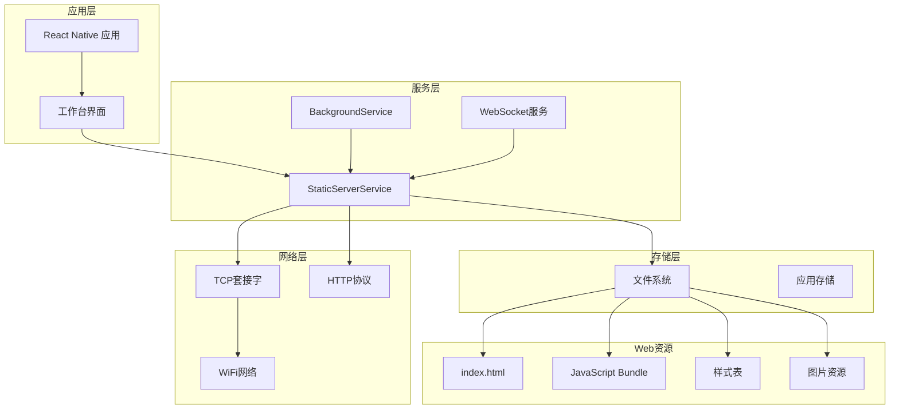
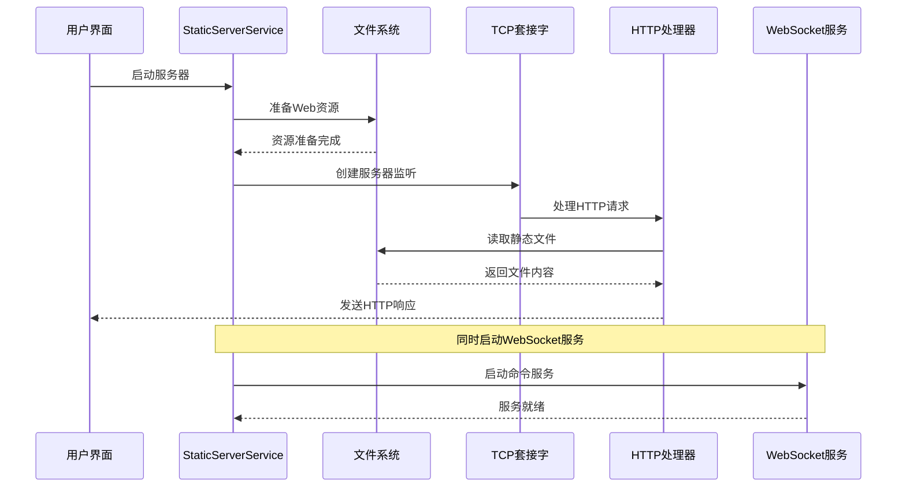
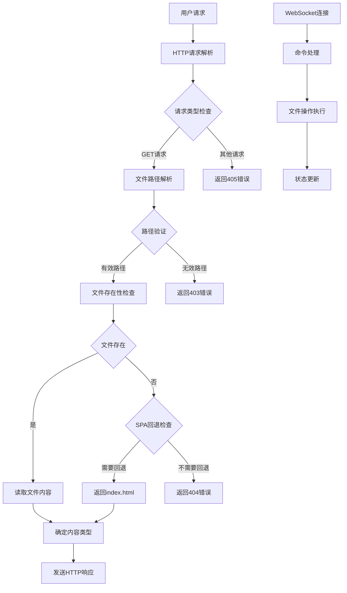
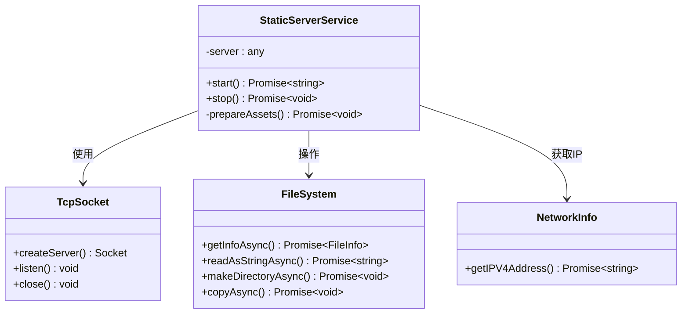
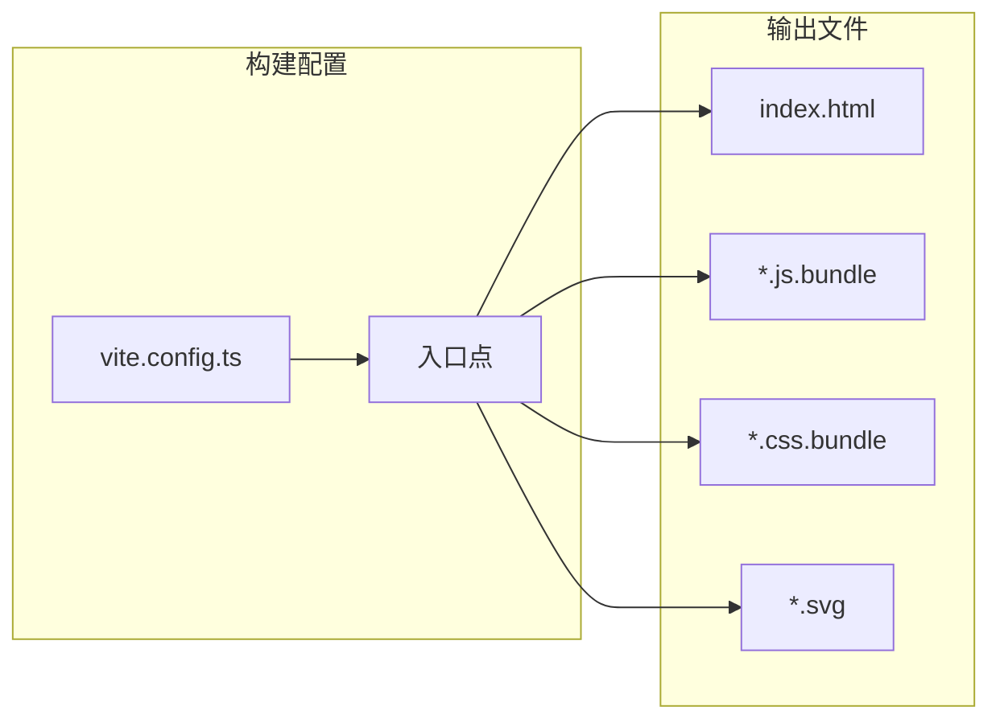
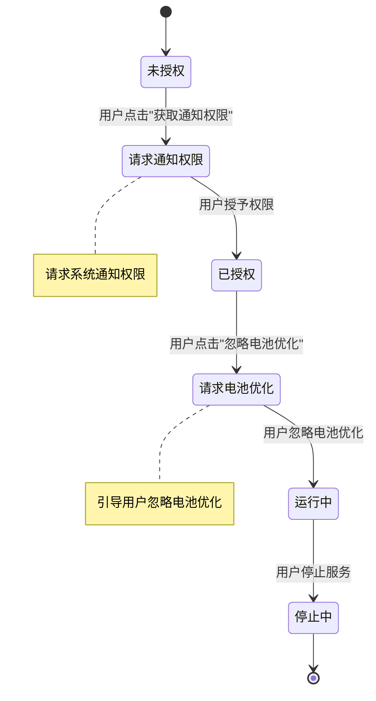
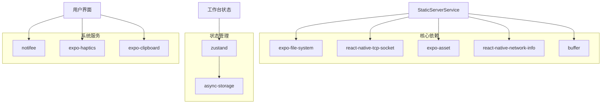
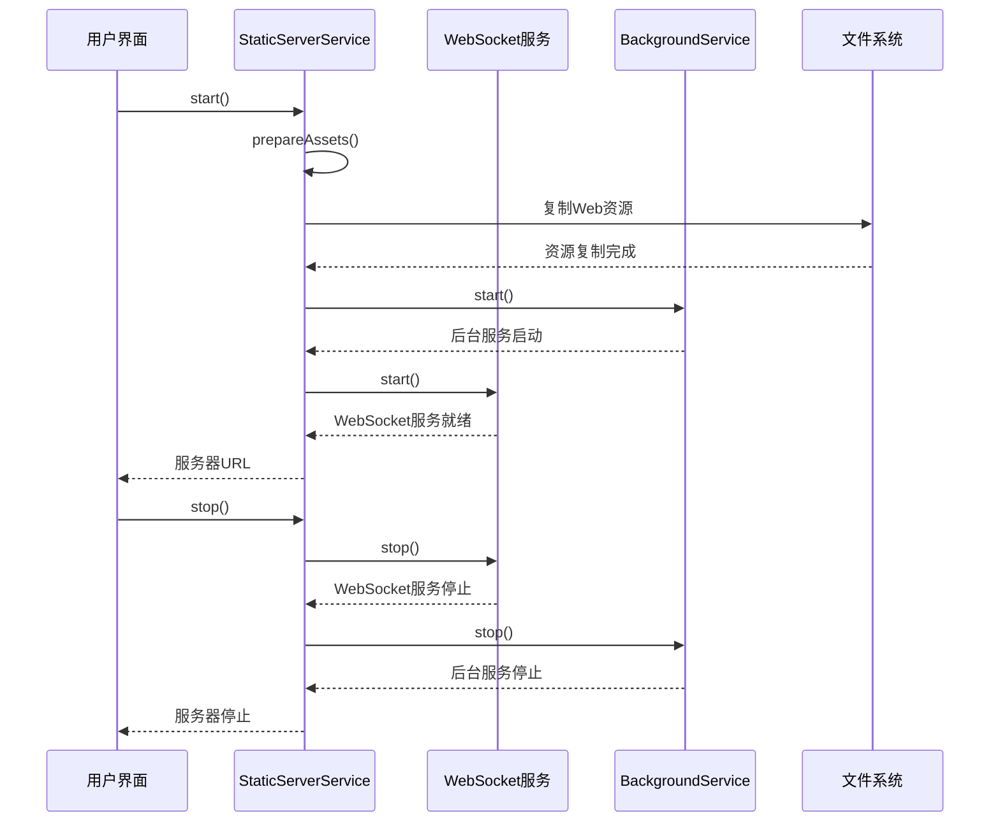
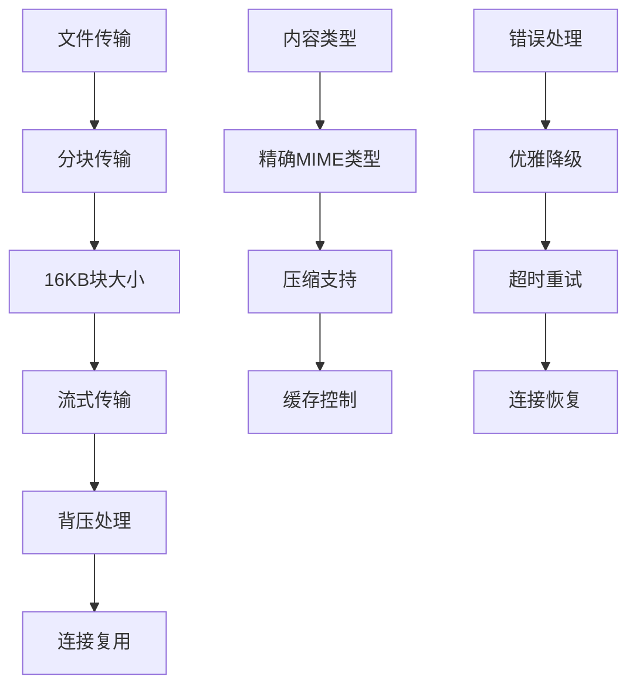

# 静态文件服务

<cite>
**本文档引用的文件**
- [StaticServerService.ts](file://src/services/workbench/StaticServerService.ts)
- [workbench-store.ts](file://src/store/workbench-store.ts)
- [BackgroundService.ts](file://src/services/BackgroundService.ts)
- [workbench.tsx](file://app/settings/workbench.tsx)
- [vite.config.ts](file://web-client/vite.config.ts)
- [index.html](file://web-client/dist/index.html)
- [index.js.bundle](file://web-client/dist/assets/index.js.bundle)
</cite>

## 目录
1. [简介](#简介)
2. [项目结构](#项目结构)
3. [核心组件](#核心组件)
4. [架构概览](#架构概览)
5. [详细组件分析](#详细组件分析)
6. [依赖关系分析](#依赖关系分析)
7. [性能考虑](#性能考虑)
8. [故障排除指南](#故障排除指南)
9. [结论](#结论)
10. [附录](#附录)

## 简介

Nexara静态文件服务是一个基于React Native的本地静态文件服务器实现，专门为移动应用提供Web界面支持。该服务通过TCP套接字实现HTTP协议，将React Native应用打包的Web资源作为静态文件提供给浏览器访问。

该系统的核心目标是：
- 在移动设备上提供本地Web服务
- 支持SPA（单页应用程序）路由
- 提供安全的访问控制机制
- 实现高效的资源缓存和传输
- 支持后台运行和电池优化

## 项目结构

静态文件服务在项目中的组织结构如下：



**图表来源**
- [StaticServerService.ts:1-301](file://src/services/workbench/StaticServerService.ts#L1-L301)
- [workbench.tsx:1-373](file://app/settings/workbench.tsx#L1-L373)

**章节来源**
- [StaticServerService.ts:1-301](file://src/services/workbench/StaticServerService.ts#L1-L301)
- [workbench.tsx:1-373](file://app/settings/workbench.tsx#L1-L373)

## 核心组件

### StaticServerService类

StaticServerService是整个静态文件服务的核心实现，负责以下关键功能：

#### 主要职责
- **HTTP服务器启动和管理**：使用TCP套接字创建HTTP服务器
- **静态文件提供**：从应用文档目录提供Web资源
- **SPA路由支持**：实现单页应用程序的路由回退机制
- **资源缓存**：将Web资源预拷贝到本地存储
- **错误处理**：提供完整的异常处理和恢复机制

#### 关键配置参数
- **端口设置**：默认使用3000端口
- **存储目录**：应用文档目录下的www子目录
- **资源映射**：预定义的Web资源清单

**章节来源**
- [StaticServerService.ts:21-301](file://src/services/workbench/StaticServerService.ts#L21-L301)

### 工作台状态管理

工作台状态管理器负责维护服务器的状态信息：

#### 状态属性
- **serverStatus**：服务器当前状态（idle/starting/running/error）
- **serverUrl**：服务器访问URL
- **accessCode**：访问验证码
- **connectedClients**：连接客户端数量

#### 存储机制
- 使用Zustand进行状态管理
- 结合AsyncStorage实现持久化存储
- 支持部分状态序列化（仅存储必要数据）

**章节来源**
- [workbench-store.ts:1-56](file://src/store/workbench-store.ts#L1-L56)

### 后台服务管理

后台服务确保服务器在应用后台运行时保持稳定：

#### 功能特性
- **前台服务**：创建持续运行的前台服务
- **通知管理**：显示服务运行状态通知
- **权限请求**：自动请求必要的系统权限
- **电池优化**：引导用户忽略电池优化

**章节来源**
- [BackgroundService.ts:1-117](file://src/services/BackgroundService.ts#L1-L117)

## 架构概览

静态文件服务采用分层架构设计，各组件职责明确且相互协作：



**图表来源**
- [StaticServerService.ts:24-236](file://src/services/workbench/StaticServerService.ts#L24-L236)
- [workbench.tsx:50-79](file://app/settings/workbench.tsx#L50-L79)

### 数据流架构



**图表来源**
- [StaticServerService.ts:48-184](file://src/services/workbench/StaticServerService.ts#L48-L184)

## 详细组件分析

### HTTP服务器实现

#### 请求处理流程

StaticServerService实现了完整的HTTP请求处理机制：



**图表来源**
- [StaticServerService.ts:1-301](file://src/services/workbench/StaticServerService.ts#L1-L301)

#### 文件路由处理

HTTP服务器的文件路由处理遵循以下规则：

1. **请求解析**：从原始HTTP请求中提取方法和URL
2. **方法验证**：仅接受GET请求，拒绝其他HTTP方法
3. **路径规范化**：将根路径重定向到index.html
4. **安全检查**：防止路径遍历攻击
5. **文件查找**：在本地文件系统中定位请求的文件
6. **SPA回退**：对于未找到的非静态资源返回index.html

**章节来源**
- [StaticServerService.ts:48-125](file://src/services/workbench/StaticServerService.ts#L48-L125)

### 资源管理机制

#### 预构建资源

Web客户端使用Vite进行构建，生成的资源具有特定的命名约定：



**图表来源**
- [vite.config.ts:1-17](file://web-client/vite.config.ts#L1-L17)

#### 资源复制策略

静态服务器启动时会将Web资源复制到应用的本地存储中：

1. **目录创建**：确保www目录存在
2. **资源映射**：根据预定义映射复制文件
3. **扩展名保留**：保持.bundle扩展名以匹配HTML引用
4. **错误处理**：提供重试机制确保资源完整性

**章节来源**
- [StaticServerService.ts:250-297](file://src/services/workbench/StaticServerService.ts#L250-L297)

### 安全防护机制

#### 访问控制

系统实现了多层安全防护：

1. **验证码机制**：每次启动服务器时生成随机6位验证码
2. **路径安全**：检测并阻止路径遍历尝试
3. **方法限制**：仅允许GET请求访问静态资源
4. **状态管理**：通过工作台状态跟踪服务器运行状态

#### 权限管理



**图表来源**
- [BackgroundService.ts:85-113](file://src/services/BackgroundService.ts#L85-L113)

**章节来源**
- [workbench.tsx:50-79](file://app/settings/workbench.tsx#L50-L79)
- [BackgroundService.ts:1-117](file://src/services/BackgroundService.ts#L1-L117)

## 依赖关系分析

### 外部依赖

静态文件服务依赖以下关键外部库：



**图表来源**
- [StaticServerService.ts:1-8](file://src/services/workbench/StaticServerService.ts#L1-L8)
- [workbench-store.ts:1-5](file://src/store/workbench-store.ts#L1-L5)
- [workbench.tsx:1-17](file://app/settings/workbench.tsx#L1-L17)

### 内部组件交互



**图表来源**
- [StaticServerService.ts:24-248](file://src/services/workbench/StaticServerService.ts#L24-L248)
- [workbench.tsx:50-79](file://app/settings/workbench.tsx#L50-L79)

**章节来源**
- [StaticServerService.ts:1-301](file://src/services/workbench/StaticServerService.ts#L1-L301)
- [workbench.tsx:1-373](file://app/settings/workbench.tsx#L1-L373)

## 性能考虑

### 缓存策略

静态文件服务采用了多层次的缓存机制：

1. **预加载缓存**：启动时将所有Web资源复制到本地存储
2. **内存缓存**：已读取的文件内容在内存中缓存
3. **浏览器缓存**：通过适当的HTTP头控制浏览器缓存行为

### 传输优化



**图表来源**
- [StaticServerService.ts:147-176](file://src/services/workbench/StaticServerService.ts#L147-L176)

### 并发处理

系统支持多个并发连接：

- **连接池管理**：合理管理同时活跃的连接数
- **资源竞争避免**：确保文件系统操作的线程安全
- **内存使用控制**：限制同时处理的文件大小

## 故障排除指南

### 常见问题及解决方案

#### 服务器启动失败

**症状**：服务器无法启动，显示错误状态

**可能原因**：
1. 端口被占用（默认3000端口）
2. 网络权限不足
3. 文件系统访问失败

**解决步骤**：
1. 检查端口占用情况
2. 确认网络权限已授予
3. 验证应用存储权限

#### 资源加载失败

**症状**：浏览器无法加载页面或资源

**可能原因**：
1. Web资源未正确复制到本地存储
2. 文件路径映射错误
3. MIME类型识别失败

**解决步骤**：
1. 重新启动服务器
2. 检查资源文件完整性
3. 验证文件扩展名匹配

#### 后台运行问题

**症状**：应用进入后台后服务器停止运行

**解决步骤**：
1. 授予通知权限
2. 忽略电池优化
3. 在最近应用中锁定应用

**章节来源**
- [StaticServerService.ts:196-212](file://src/services/workbench/StaticServerService.ts#L196-L212)
- [BackgroundService.ts:94-113](file://src/services/BackgroundService.ts#L94-L113)

### 调试工具

#### 日志监控

系统提供了详细的日志输出：
- 服务器启动和停止事件
- HTTP请求处理过程
- 错误和异常信息
- 文件操作状态

#### 状态检查

通过工作台界面可以实时监控：
- 服务器运行状态
- 当前连接客户端数量
- 访问验证码
- 服务器URL

## 结论

Nexara静态文件服务提供了一个完整、可靠的本地Web服务解决方案。其设计特点包括：

**技术优势**：
- 基于原生TCP套接字的高效实现
- 完整的SPA路由支持
- 多层次的安全防护机制
- 友好的用户体验设计

**架构特点**：
- 清晰的分层架构
- 良好的模块化设计
- 完善的错误处理机制
- 支持后台运行

**应用场景**：
- 移动应用内嵌Web界面
- 开发调试环境
- 本地演示和展示
- 离线Web应用支持

该服务为React Native应用提供了强大的Web服务能力，是构建混合应用的理想选择。

## 附录

### 配置选项

| 选项名称 | 默认值 | 描述 |
|---------|--------|------|
| 服务器端口 | 3000 | HTTP服务器监听端口 |
| 存储目录 | documentDirectory/www | 静态文件存储位置 |
| 缓冲区大小 | 16KB | 文件传输分块大小 |
| 最大重试次数 | 10次 | 端口占用时的重试次数 |

### 使用示例

#### 基本使用
```typescript
// 启动服务器
await staticServerService.start();

// 停止服务器  
await staticServerService.stop();
```

#### 集成到应用
```typescript
// 在应用启动时初始化
useEffect(() => {
    const init = async () => {
        await staticServerService.start();
        // 启动其他相关服务
    };
    init();
}, []);
```

### 最佳实践

1. **权限管理**：确保正确处理系统权限请求
2. **错误处理**：实现完善的异常捕获和恢复机制
3. **性能优化**：合理配置缓存和传输参数
4. **安全性**：定期更新访问验证码，监控连接状态
5. **测试验证**：在不同网络环境下测试服务稳定性