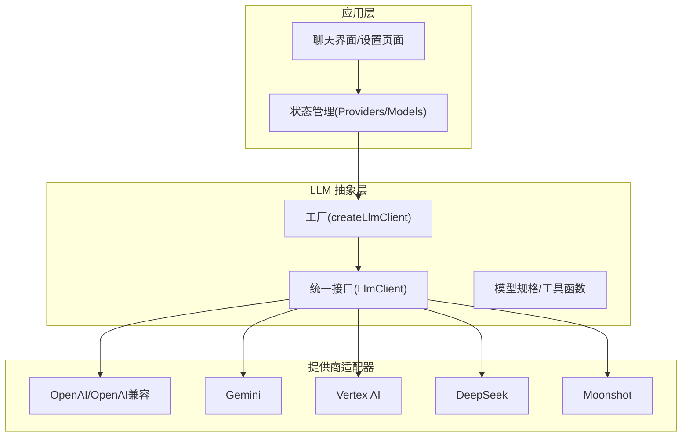
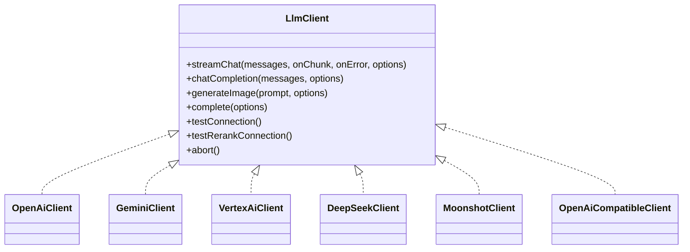
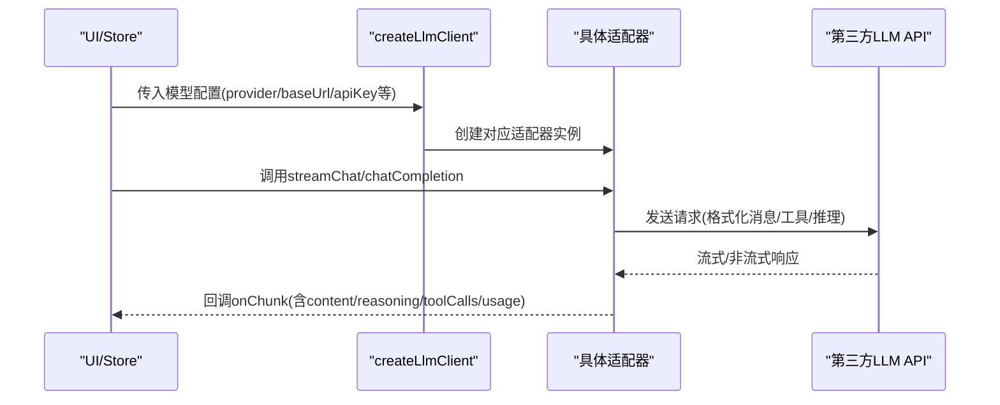
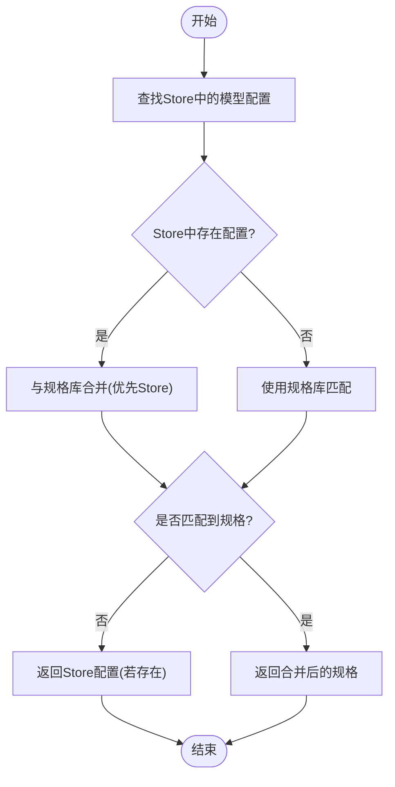
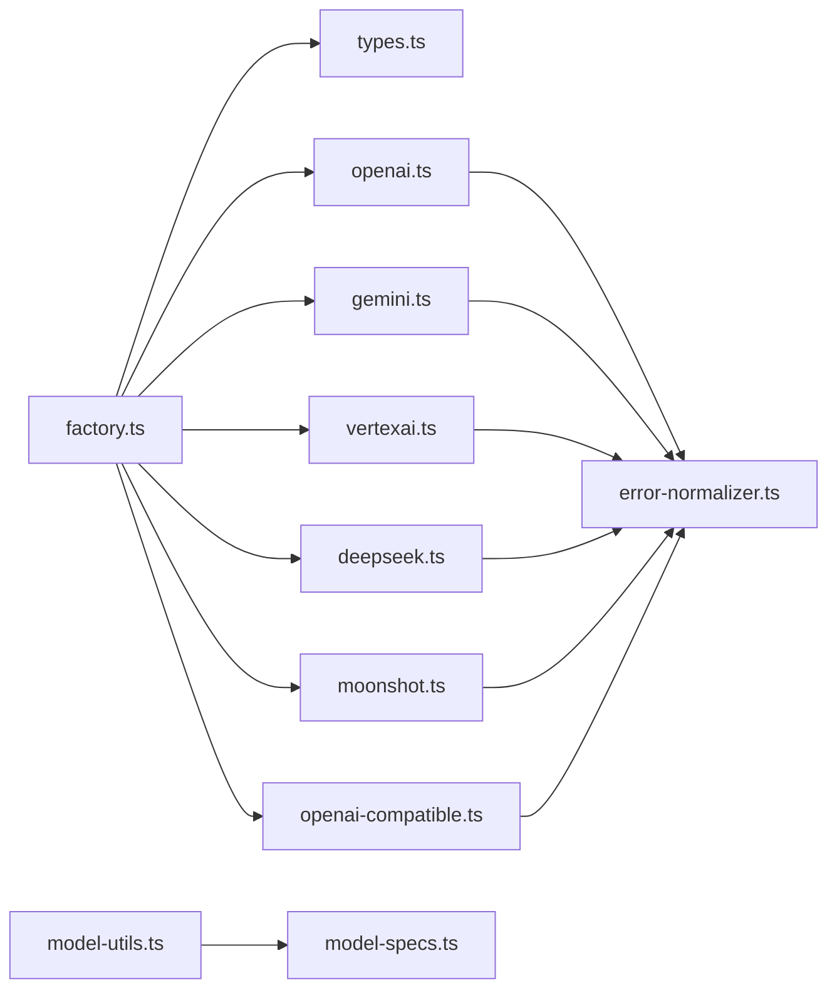

# 多提供商模型集成

<cite>
**本文档引用的文件**
- [README.md](file://README.md)
- [factory.ts](file://src/lib/llm/factory.ts)
- [types.ts](file://src/lib/llm/types.ts)
- [model-specs.ts](file://src/lib/llm/model-specs.ts)
- [model-utils.ts](file://src/lib/llm/model-utils.ts)
- [openai.ts](file://src/lib/llm/providers/openai.ts)
- [gemini.ts](file://src/lib/llm/providers/gemini.ts)
- [vertexai.ts](file://src/lib/llm/providers/vertexai.ts)
- [deepseek.ts](file://src/lib/llm/providers/deepseek.ts)
- [moonshot.ts](file://src/lib/llm/providers/moonshot.ts)
- [openai-compatible.ts](file://src/lib/llm/providers/openai-compatible.ts)
- [error-normalizer.ts](file://src/lib/llm/error-normalizer.ts)
</cite>

## 目录
1. [简介](#简介)
2. [项目结构](#项目结构)
3. [核心组件](#核心组件)
4. [架构总览](#架构总览)
5. [详细组件分析](#详细组件分析)
6. [依赖关系分析](#依赖关系分析)
7. [性能考量](#性能考量)
8. [故障排查指南](#故障排查指南)
9. [结论](#结论)
10. [附录](#附录)

## 简介
本项目为 Android 平台的 AI 助手客户端，采用多提供商模型架构，支持 12+ 云上 AI 服务（OpenAI、Anthropic、Gemini、Vertex AI、DeepSeek、Moonshot、智谱、SiliconFlow、GitHub Copilot、Cloudflare 等），同时提供本地推理与 RAG 知识引擎。其核心目标是通过统一抽象层屏蔽不同提供商的差异，实现模型发现、请求路由、工具调用、流式响应与错误处理的一致体验。

## 项目结构
- LLM 抽象与工厂位于 src/lib/llm 下，包含统一接口、工厂方法、模型规格与工具函数。
- 各提供商适配器位于 src/lib/llm/providers 下，分别实现 OpenAI 兼容、Gemini、Vertex AI、DeepSeek、Moonshot 等。
- 错误标准化与日志记录位于同目录下，保障跨提供商的统一错误处理与可观测性。
- 应用层通过 store 与 UI 组件调用 LLM 工厂创建客户端实例，完成对话与工具调用。

**图表来源**
- [factory.ts:23-96](file://src/lib/llm/factory.ts#L23-L96)
- [types.ts:45-83](file://src/lib/llm/types.ts#L45-L83)

**章节来源**
- [README.md:12-46](file://README.md#L12-L46)

## 核心组件
- 统一接口 LlmClient：定义流式对话、非流式对话、图片生成、补全、连接测试、中止等能力，并约定工具调用与推理输出的回调结构。
- 工厂 createLlmClient：根据配置中的 provider 字段选择具体适配器，注入 API Key、基础 URL、温度、是否嵌入模型等参数。
- 模型规格与工具函数：MODEL_SPECS 提供模型上下文长度、能力标签、图标等元数据；model-utils 提供模型能力查询、强制推理判断、名称解析等。
- 错误标准化：ErrorNormalizer 将各提供商错误归类为网络、鉴权、限流、配额、超时、无效请求、服务器错误、未知等类别，并提供重试建议。

**章节来源**
- [types.ts:45-83](file://src/lib/llm/types.ts#L45-L83)
- [factory.ts:23-96](file://src/lib/llm/factory.ts#L23-L96)
- [model-specs.ts:307-346](file://src/lib/llm/model-specs.ts#L307-L346)
- [model-utils.ts:25-68](file://src/lib/llm/model-utils.ts#L25-L68)
- [error-normalizer.ts:40-124](file://src/lib/llm/error-normalizer.ts#L40-L124)

## 架构总览
多提供商架构通过“抽象层 + 工厂 + 适配器”实现：
- 抽象层：LlmClient 统一方法签名与回调结构，屏蔽提供商差异。
- 工厂层：按 provider 选择适配器，注入配置参数，封装 baseUrl、apiKey、温度、推理开关等。
- 适配器层：针对不同提供商的 API 协议、流式格式、工具调用、推理内容、错误码进行定制化处理。
- 规格与工具：通过 MODEL_SPECS 与 model-utils 提供模型能力与兼容性检查，辅助 UI 与路由决策。

**图表来源**
- [types.ts:45-83](file://src/lib/llm/types.ts#L45-L83)
- [openai.ts:7-30](file://src/lib/llm/providers/openai.ts#L7-L30)
- [gemini.ts:7-19](file://src/lib/llm/providers/gemini.ts#L7-L19)
- [vertexai.ts:13-70](file://src/lib/llm/providers/vertexai.ts#L13-L70)
- [deepseek.ts:7-27](file://src/lib/llm/providers/deepseek.ts#L7-L27)
- [moonshot.ts:16-36](file://src/lib/llm/providers/moonshot.ts#L16-L36)
- [openai-compatible.ts:7-27](file://src/lib/llm/providers/openai-compatible.ts#L7-L27)

## 详细组件分析

### 抽象层与工厂
- 统一接口 LlmClient：定义流式与非流式对话、工具调用、推理内容、图片生成、补全、连接测试、中止等方法，回调结构包含 content、reasoning、toolCalls、usage 等字段，便于 UI 与状态管理统一处理。
- 工厂 createLlmClient：根据 provider 值选择适配器，注入 apiKey、baseUrl、model、temperature、是否嵌入模型、Vertex AI 的项目/区域/密钥等参数；对 OpenAI、Zhipu、SiliconFlow、GitHub、Cloudflare、GitHub Copilot 等走 OpenAI 兼容路径；对 Moonshot、DeepSeek、Gemini、Vertex AI、OpenAI 兼容分别走专用适配器。
- 模型规格与工具函数：MODEL_SPECS 提供模型上下文长度、类型、能力标签、图标等；model-utils 提供模型能力查询、强制推理判断、名称解析、高参数模型识别等。

**图表来源**
- [factory.ts:23-96](file://src/lib/llm/factory.ts#L23-L96)
- [types.ts:45-83](file://src/lib/llm/types.ts#L45-L83)

**章节来源**
- [factory.ts:23-96](file://src/lib/llm/factory.ts#L23-L96)
- [model-specs.ts:307-346](file://src/lib/llm/model-specs.ts#L307-L346)
- [model-utils.ts:25-68](file://src/lib/llm/model-utils.ts#L25-L68)

### OpenAI 适配器
- 特性：支持流式与非流式、工具调用（OpenAI function calling）、推理内容（reasoning_content）处理、<think> 标签清理、温度限制（如 GLM/Zhipu 限制 < 1.0）、嵌入与重排序端点、图片生成、FIM 补全（DeepSeek Beta）。
- 错误处理：网络错误、401/403、429、配额超限、超时、4xx/5xx 统一标准化。
- 连接测试：根据是否嵌入模型自动切换端点，捕获 HTML 错误页。

**章节来源**
- [openai.ts:33-468](file://src/lib/llm/providers/openai.ts#L33-L468)

### Gemini 适配器
- 特性：支持多模态（文本/图片/本地文件）、原生 Google 搜索、函数声明工具、推理思考（Thinking）模式、引用标注（citations）、流式解析、文件内联数据上传与缩略图生成。
- 错误处理：HTML 错误页检测、JSON 解析失败容错。
- 连接测试：生成内容端点测试。

**章节来源**
- [gemini.ts:99-478](file://src/lib/llm/providers/gemini.ts#L99-L478)

### Vertex AI 适配器
- 特性：支持服务账号 JWT 鉴权、多模态消息、函数调用、推理思考、引用标注、严格交替对话轮次规范化、文件内联数据上传、签名（thought_signature）传递与捕获、流式解析与队列处理。
- 错误处理：令牌获取失败、HTML 错误页、网络错误。
- 连接测试：生成内容端点测试。

**章节来源**
- [vertexai.ts:228-800](file://src/lib/llm/providers/vertexai.ts#L228-L800)

### DeepSeek 适配器
- 特性：支持 <think> 标签处理与泄漏内容清理、推理内容（reasoning_content）在 Reasoner 模型中的保留、工具调用严格格式（tool_call_id/name）、FIM Beta 端点。
- 错误处理：网络错误、4xx/5xx 标准化。
- 连接测试：嵌入与重排序端点测试。

**章节来源**
- [deepseek.ts:131-540](file://src/lib/llm/providers/deepseek.ts#L131-L540)

### Moonshot 适配器
- 特性：禁用严格模式（避免 400）、保留 reasoning_content（Kimi 思维模型上下文）、工具调用增强解析。
- 错误处理：网络错误、4xx/5xx 标准化。
- 连接测试：聊天补全端点测试。

**章节来源**
- [moonshot.ts:104-332](file://src/lib/llm/providers/moonshot.ts#L104-L332)

### OpenAI 兼容适配器
- 特性：通用兼容 OpenAI 协议的第三方服务，支持流式解析、<think> 标签清理、工具调用、usage 报告、URL 自动清洗、负载净化（去除 null/默认值）。
- 错误处理：HTML 错误页检测、网络错误、4xx/5xx 标准化。
- 连接测试：聊天补全端点测试。

**章节来源**
- [openai-compatible.ts:128-494](file://src/lib/llm/providers/openai-compatible.ts#L128-L494)

### 模型发现与兼容性检查
- 模型规格：MODEL_SPECS 提供模型上下文长度、类型（chat/reasoning/image/embedding/rerank）、能力标签（vision/internet/reasoning）、强制推理、图标等；支持字符串与正则匹配。
- 能力查询：model-utils 提供模型类型、能力标签、图标、名称解析、强制推理判断、高参数模型识别等。
- 上下文长度回退：若 API 未返回上下文长度，则从 MODEL_SPECS 或名称中的 k/m 数字推断。

**图表来源**
- [model-utils.ts:25-68](file://src/lib/llm/model-utils.ts#L25-L68)
- [model-specs.ts:307-346](file://src/lib/llm/model-specs.ts#L307-L346)

**章节来源**
- [model-specs.ts:33-300](file://src/lib/llm/model-specs.ts#L33-L300)
- [model-utils.ts:75-129](file://src/lib/llm/model-utils.ts#L75-L129)

### 请求路由策略
- 工厂路由：根据 provider 值选择适配器，注入 baseUrl、apiKey、温度、推理开关、嵌入/重排序标志等。
- 工具与推理：根据模型能力与用户设置决定是否启用工具调用与推理模式；Gemini/Vertex AI 对推理模式有特殊处理。
- 多模态：对 Gemini/Vertex AI 支持本地文件内联上传与缩略图生成，避免大尺寸 Base64 导致卡顿。

**章节来源**
- [factory.ts:23-96](file://src/lib/llm/factory.ts#L23-L96)
- [gemini.ts:122-214](file://src/lib/llm/providers/gemini.ts#L122-L214)
- [vertexai.ts:282-398](file://src/lib/llm/providers/vertexai.ts#L282-L398)

### API 密钥管理、限流与错误处理
- 密钥管理：工厂与适配器均通过构造函数接收 apiKey；Vertex AI 支持服务账号 JSON 鉴权并缓存访问令牌。
- 限流与配额：ErrorNormalizer 对 429、配额超限、超时进行分类与重试建议；提供 retryAfter 计算与友好文案。
- 错误处理：统一标准化错误类别，区分网络、鉴权、限流、无效请求、服务器错误、未知等；对 HTML 错误页进行检测与提示。

**章节来源**
- [vertexai.ts:72-139](file://src/lib/llm/providers/vertexai.ts#L72-L139)
- [error-normalizer.ts:40-124](file://src/lib/llm/error-normalizer.ts#L40-L124)

### 模型兼容性检查与降级策略
- 兼容性检查：通过 model-utils 的能力查询与强制推理判断，结合 MODEL_SPECS 的能力标签，决定是否启用推理与工具调用。
- 降级策略：当某提供商出现限流/配额/超时/网络错误时，可回退至备用提供商；对推理模型与高参数模型采用更保守的降级策略（如关闭推理或工具调用）。

**章节来源**
- [model-utils.ts:75-129](file://src/lib/llm/model-utils.ts#L75-L129)
- [error-normalizer.ts:65-85](file://src/lib/llm/error-normalizer.ts#L65-L85)

### 新提供商接入指南
- 步骤
  1) 在 src/lib/llm/providers 下新增适配器类，实现 LlmClient 接口（streamChat/chatCompletion/generateImage/complete/testConnection/abort）。
  2) 在 factory.ts 的 createLlmClient 中添加 provider 分支，注入 baseUrl、apiKey、温度、推理开关等参数。
  3) 若需要特殊能力（如推理、工具、多模态、重排序），在适配器中实现相应逻辑并在 model-utils 中补充能力标签。
  4) 编写连接测试与错误处理，确保标准化错误分类与重试建议。
  5) 在 MODEL_SPECS 中补充模型规格（上下文长度、能力标签、图标等），或通过 Store 配置覆盖。
- 测试方法
  - 单元测试：模拟请求与响应，验证流式解析、工具调用、推理内容、错误分类。
  - 集成测试：使用真实 API Key 进行连接测试与对话测试，覆盖流式与非流式、工具调用、多模态场景。
  - 回归测试：对已支持的模型与能力进行回归验证，确保新增适配器不影响现有行为。

**章节来源**
- [factory.ts:23-96](file://src/lib/llm/factory.ts#L23-L96)
- [types.ts:45-83](file://src/lib/llm/types.ts#L45-L83)
- [model-specs.ts:33-300](file://src/lib/llm/model-specs.ts#L33-L300)

## 依赖关系分析

**图表来源**
- [factory.ts:1-21](file://src/lib/llm/factory.ts#L1-L21)
- [openai.ts:1-7](file://src/lib/llm/providers/openai.ts#L1-L7)
- [gemini.ts:1-6](file://src/lib/llm/providers/gemini.ts#L1-L6)
- [vertexai.ts:1-7](file://src/lib/llm/providers/vertexai.ts#L1-L7)
- [deepseek.ts:1-6](file://src/lib/llm/providers/deepseek.ts#L1-L6)
- [moonshot.ts:1-6](file://src/lib/llm/providers/moonshot.ts#L1-L6)
- [openai-compatible.ts:1-6](file://src/lib/llm/providers/openai-compatible.ts#L1-L6)
- [error-normalizer.ts:1-25](file://src/lib/llm/error-normalizer.ts#L1-L25)
- [model-utils.ts:1-3](file://src/lib/llm/model-utils.ts#L1-L3)
- [model-specs.ts:1-7](file://src/lib/llm/model-specs.ts#L1-L7)

**章节来源**
- [factory.ts:1-21](file://src/lib/llm/factory.ts#L1-L21)
- [error-normalizer.ts:1-25](file://src/lib/llm/error-normalizer.ts#L1-L25)
- [model-utils.ts:1-3](file://src/lib/llm/model-utils.ts#L1-L3)
- [model-specs.ts:1-7](file://src/lib/llm/model-specs.ts#L1-L7)

## 性能考量
- 流式解析：各适配器均采用增量解析与缓冲策略，减少内存占用与首包延迟。
- 文件处理：Gemini/Vertex AI 对大尺寸 Base64 图片进行文件落盘与缩略图生成，避免 UI 卡顿。
- 连接复用：在严格限额的提供商（如 GLM/Zhipu）中显式中止 XHR，避免并发连接残留。
- 令牌清理：对 DeepSeek 特有思考标签进行清理，避免泄漏内容影响 UI。
- 重试与退避：ErrorNormalizer 提供 retryAfter 与友好等待时间展示，降低用户重试成本。

[本节为通用性能讨论，无需具体文件分析]

## 故障排查指南
- 网络错误：检查网络连通性与代理设置；确认 baseUrl 正确（如 OneAPI/新 API 需要 /v1）。
- 鉴权错误：核对 API Key 是否有效、过期或权限不足。
- 限流与配额：关注 429 与配额超限错误，遵循 retryAfter 或等待配额恢复。
- HTML 错误页：某些网关/代理会返回 HTML 错误页，需检查 baseUrl 与服务端配置。
- 工具调用失败：检查工具 schema 严格模式与参数完整性；对 Moonshot 禁用严格模式。
- 推理内容异常：确认模型是否支持推理模式，Gemini/Vertex AI 的推理开关与签名传递。

**章节来源**
- [error-normalizer.ts:44-124](file://src/lib/llm/error-normalizer.ts#L44-L124)
- [openai-compatible.ts:170-178](file://src/lib/llm/providers/openai-compatible.ts#L170-L178)
- [moonshot.ts:98-98](file://src/lib/llm/providers/moonshot.ts#L98-L98)

## 结论
本项目通过统一抽象层与工厂模式，成功将多家 AI 服务提供商整合为一致的调用体验。借助模型规格库与工具函数，实现了模型能力检查与兼容性降级；通过错误标准化与连接测试，提升了系统的可观测性与稳定性。未来可在路由策略中引入更精细的负载均衡与故障转移、完善成本控制与用量统计、扩展更多提供商适配器与本地推理能力。

[本节为总结，无需具体文件分析]

## 附录
- 支持的提供商与特性概览
  - OpenAI：流式/非流式、工具调用、推理内容、图片生成、FIM 补全、嵌入/重排序。
  - Gemini：多模态、原生搜索、函数声明工具、推理思考、引用标注、文件内联。
  - Vertex AI：服务账号鉴权、多模态、函数调用、推理思考、签名传递、文件内联。
  - DeepSeek：<think> 标签处理、推理内容保留、工具调用严格格式、FIM Beta。
  - Moonshot：禁用严格模式、推理内容保留、工具调用增强。
  - OpenAI 兼容：通用协议、流式解析、<think> 标签清理、工具调用、usage 报告。

**章节来源**
- [README.md:16-46](file://README.md#L16-L46)
- [openai.ts:33-468](file://src/lib/llm/providers/openai.ts#L33-L468)
- [gemini.ts:99-478](file://src/lib/llm/providers/gemini.ts#L99-L478)
- [vertexai.ts:228-800](file://src/lib/llm/providers/vertexai.ts#L228-L800)
- [deepseek.ts:131-540](file://src/lib/llm/providers/deepseek.ts#L131-L540)
- [moonshot.ts:104-332](file://src/lib/llm/providers/moonshot.ts#L104-L332)
- [openai-compatible.ts:128-494](file://src/lib/llm/providers/openai-compatible.ts#L128-L494)