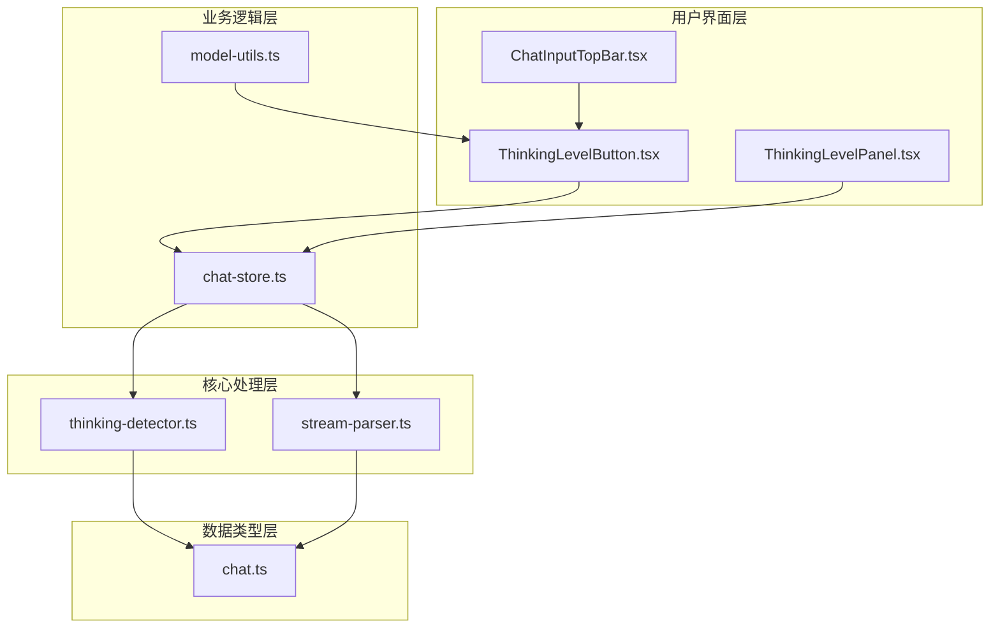
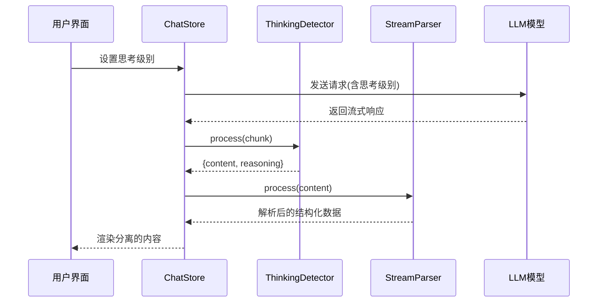
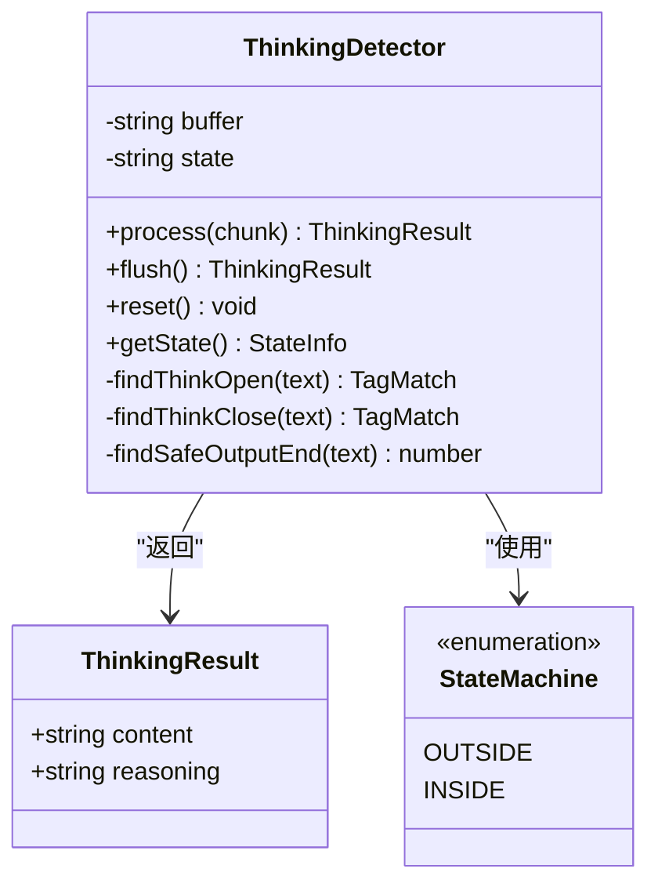
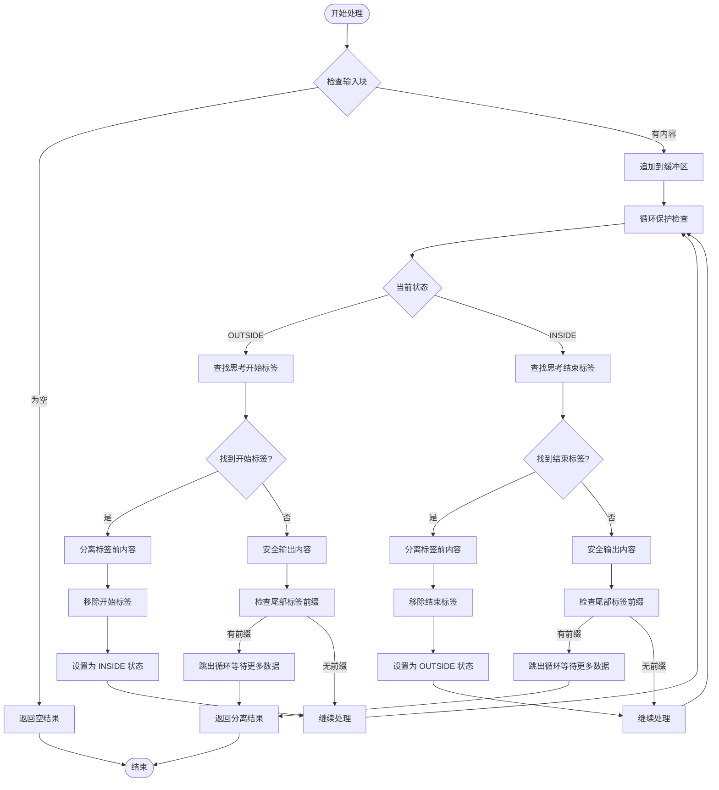
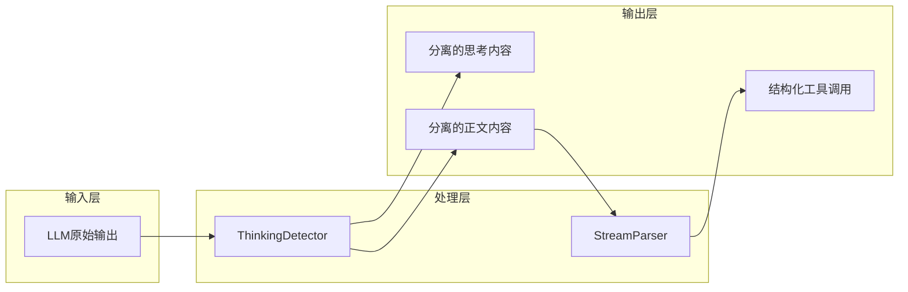
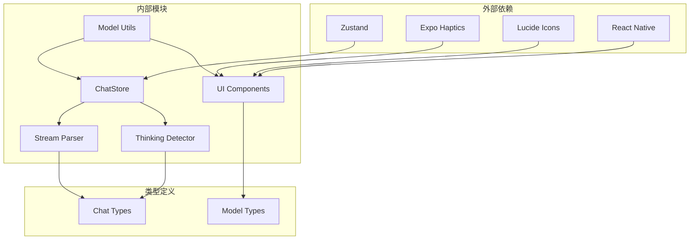

# 思维检测器组件

<cite>
**本文档引用的文件**
- [thinking-detector.ts](file://src/lib/llm/thinking-detector.ts)
- [ThinkingLevelPanel.tsx](file://src/features/chat/components/SessionSettingsSheet/ThinkingLevelPanel.tsx)
- [ThinkingLevelButton.tsx](file://src/features/chat/components/input/ThinkingLevelButton.tsx)
- [chat-store.ts](file://src/store/chat-store.ts)
- [model-utils.ts](file://src/lib/llm/model-utils.ts)
- [stream-parser.ts](file://src/lib/llm/stream-parser.ts)
- [ChatInputTopBar.tsx](file://src/features/chat/components/input/ChatInputTopBar.tsx)
- [chat.ts](file://src/types/chat.ts)
</cite>

## 目录
1. [简介](#简介)
2. [项目结构](#项目结构)
3. [核心组件](#核心组件)
4. [架构概览](#架构概览)
5. [详细组件分析](#详细组件分析)
6. [依赖关系分析](#依赖关系分析)
7. [性能考量](#性能考量)
8. [故障排除指南](#故障排除指南)
9. [结论](#结论)

## 简介

思维检测器组件是 Nexara 应用程序中一个关键的 AI 模型配置和内容分离系统。该组件负责处理 Gemini 2.0 Thinking 模型的思考过程检测、内容分离以及用户界面交互。它通过统一的思维标签检测器来准确分离思考内容（reasoning）和正文内容（content），支持多种思考标签格式，并提供直观的用户界面来控制模型的思考深度。

该系统的核心价值在于：
- **统一内容分离**：准确分离思考过程和正式回复内容
- **多格式支持**：支持 HTML 注释、XML 标签等多种思考标签格式
- **用户友好界面**：提供直观的思考深度控制面板
- **性能优化**：高效的流式处理和内存管理

## 项目结构

思维检测器组件分布在应用程序的多个层次中：

**图表来源**
- [thinking-detector.ts:1-227](file://src/lib/llm/thinking-detector.ts#L1-L227)
- [ThinkingLevelPanel.tsx:1-133](file://src/features/chat/components/SessionSettingsSheet/ThinkingLevelPanel.tsx#L1-L133)
- [ThinkingLevelButton.tsx:1-181](file://src/features/chat/components/input/ThinkingLevelButton.tsx#L1-L181)

**章节来源**
- [thinking-detector.ts:1-227](file://src/lib/llm/thinking-detector.ts#L1-L227)
- [ThinkingLevelPanel.tsx:1-133](file://src/features/chat/components/SessionSettingsSheet/ThinkingLevelPanel.tsx#L1-L133)
- [ThinkingLevelButton.tsx:1-181](file://src/features/chat/components/input/ThinkingLevelButton.tsx#L1-L181)

## 核心组件

### 思维检测器类 (ThinkingDetector)

思维检测器是整个系统的核心组件，负责处理 LLM 流式输出中的思考内容分离。

**主要特性：**
- **状态机设计**：维护 OUTSIDE 和 INSIDE 两种状态
- **多格式支持**：支持 HTML 注释和 XML 标签格式
- **边界处理**：智能处理标签跨 chunk 分割的情况
- **性能优化**：使用循环保护和安全输出机制

**关键接口：**
- `process(chunk: string)`: 处理新的流式数据块
- `flush()`: 强制刷新缓冲区内容
- `reset()`: 重置检测器状态
- `getState()`: 获取当前状态信息

### 思考级别控制组件

系统提供了两个用户界面组件来控制思考级别：

**ThinkingLevelButton**：
- 位于聊天输入栏顶部
- 提供快速访问的思考级别选择
- 支持手势反馈和视觉指示

**ThinkingLevelPanel**：
- 位于会话设置面板中
- 提供详细的思考级别说明
- 支持完整的设置选项

**章节来源**
- [thinking-detector.ts:37-146](file://src/lib/llm/thinking-detector.ts#L37-L146)
- [ThinkingLevelPanel.tsx:21-89](file://src/features/chat/components/SessionSettingsSheet/ThinkingLevelPanel.tsx#L21-L89)
- [ThinkingLevelButton.tsx:18-181](file://src/features/chat/components/input/ThinkingLevelButton.tsx#L18-L181)

## 架构概览

思维检测器组件采用分层架构设计，确保了良好的模块化和可维护性：

**图表来源**
- [chat-store.ts:1369-1385](file://src/store/chat-store.ts#L1369-L1385)
- [thinking-detector.ts:47-106](file://src/lib/llm/thinking-detector.ts#L47-L106)
- [stream-parser.ts:42-247](file://src/lib/llm/stream-parser.ts#L42-L247)

**章节来源**
- [chat-store.ts:1369-1385](file://src/store/chat-store.ts#L1369-L1385)
- [thinking-detector.ts:47-106](file://src/lib/llm/thinking-detector.ts#L47-L106)
- [stream-parser.ts:42-247](file://src/lib/llm/stream-parser.ts#L42-L247)

## 详细组件分析

### 思维检测器实现分析

思维检测器采用了高效的状态机算法来处理复杂的文本分离需求：

**图表来源**
- [thinking-detector.ts:37-146](file://src/lib/llm/thinking-detector.ts#L37-L146)

**算法流程：**

**图表来源**
- [thinking-detector.ts:55-103](file://src/lib/llm/thinking-detector.ts#L55-L103)

### 用户界面组件分析

#### ThinkingLevelButton 组件

该组件提供了快速访问的思考级别控制功能：

**核心功能：**
- 实时显示当前思考级别
- 支持手势反馈（Impact Feedback）
- 智能模型支持检测
- 响应式颜色编码

**状态管理：**
- 使用 Zustand 状态管理
- 集成 Haptics 触觉反馈
- 支持动态模型切换

#### ThinkingLevelPanel 组件

该组件提供了完整的思考级别设置面板：

**界面特性：**
- 清晰的级别说明
- 视觉化的级别指示器
- 支持的模型类型说明
- 直观的选择交互

**数据绑定：**
- 自动同步会话状态
- 实时更新界面显示
- 支持撤销操作

**章节来源**
- [ThinkingLevelButton.tsx:18-181](file://src/features/chat/components/input/ThinkingLevelButton.tsx#L18-L181)
- [ThinkingLevelPanel.tsx:21-89](file://src/features/chat/components/SessionSettingsSheet/ThinkingLevelPanel.tsx#L21-L89)

### 数据流处理分析

系统采用分层的数据处理架构：

**图表来源**
- [thinking-detector.ts:47-106](file://src/lib/llm/thinking-detector.ts#L47-L106)
- [stream-parser.ts:42-247](file://src/lib/llm/stream-parser.ts#L42-L247)

**章节来源**
- [thinking-detector.ts:47-106](file://src/lib/llm/thinking-detector.ts#L47-L106)
- [stream-parser.ts:42-247](file://src/lib/llm/stream-parser.ts#L42-L247)

## 依赖关系分析

思维检测器组件的依赖关系展现了清晰的分层架构：

**图表来源**
- [chat-store.ts:1-800](file://src/store/chat-store.ts#L1-L800)
- [model-utils.ts:1-253](file://src/lib/llm/model-utils.ts#L1-L253)
- [thinking-detector.ts:1-227](file://src/lib/llm/thinking-detector.ts#L1-L227)

**依赖特点：**
- **低耦合**：各组件职责明确，相互依赖最小化
- **高内聚**：相同功能集中在相应模块中
- **清晰边界**：UI 层、业务逻辑层、核心处理层界限分明

**章节来源**
- [chat-store.ts:1-800](file://src/store/chat-store.ts#L1-L800)
- [model-utils.ts:1-253](file://src/lib/llm/model-utils.ts#L1-L253)
- [thinking-detector.ts:1-227](file://src/lib/llm/thinking-detector.ts#L1-L227)

## 性能考量

思维检测器组件在设计时充分考虑了性能优化：

### 时间复杂度分析
- **单次处理**：O(n) 线性时间复杂度，其中 n 为输入块长度
- **状态转换**：O(1) 常数时间复杂度
- **内存使用**：O(k) 线性空间复杂度，k 为缓冲区大小

### 优化策略
1. **循环保护**：防止无限循环的保护机制
2. **安全输出**：智能处理标签边界，避免数据丢失
3. **增量处理**：支持流式增量处理，减少内存占用
4. **状态机优化**：高效的双状态机设计

### 内存管理
- **缓冲区管理**：智能的缓冲区增长和收缩
- **垃圾回收**：及时释放不再使用的字符串引用
- **循环引用防护**：避免潜在的内存泄漏

## 故障排除指南

### 常见问题及解决方案

**问题1：思考内容未正确分离**
- **症状**：思考过程和正文内容混合在一起
- **原因**：标签格式不匹配或边界处理异常
- **解决**：检查标签格式一致性，确认思维检测器配置

**问题2：性能下降**
- **症状**：处理大量数据时响应缓慢
- **原因**：缓冲区过大或循环保护触发
- **解决**：优化输入块大小，检查循环保护机制

**问题3：界面显示异常**
- **症状**：思考级别按钮显示错误或无响应
- **原因**：状态同步问题或模型支持检测失败
- **解决**：检查 Zustand 状态管理，验证模型配置

### 调试技巧
1. **状态监控**：使用 `getState()` 方法检查内部状态
2. **日志记录**：在关键节点添加调试日志
3. **单元测试**：为边界情况编写专门的测试用例
4. **性能分析**：使用 React DevTools 分析组件渲染性能

**章节来源**
- [thinking-detector.ts:141-146](file://src/lib/llm/thinking-detector.ts#L141-L146)
- [chat-store.ts:1369-1385](file://src/store/chat-store.ts#L1369-L1385)

## 结论

思维检测器组件是 Nexara 应用程序中一个精心设计的系统，它成功地解决了 AI 模型思考内容分离这一复杂问题。通过采用分层架构、状态机算法和用户友好的界面设计，该组件实现了以下目标：

**技术成就：**
- 实现了高效的思维内容分离算法
- 提供了直观的用户控制界面
- 确保了系统的高性能和稳定性
- 建立了清晰的模块化架构

**用户体验：**
- 简洁直观的思考级别控制
- 即时的视觉反馈和触觉反馈
- 智能的模型支持检测
- 无缝的集成体验

**未来发展方向：**
- 支持更多 AI 模型的思考内容格式
- 增强性能监控和诊断功能
- 扩展用户自定义配置选项
- 优化移动端性能表现

该组件为整个应用程序提供了坚实的 AI 内容处理基础，是实现高质量 AI 交互体验的关键基础设施。