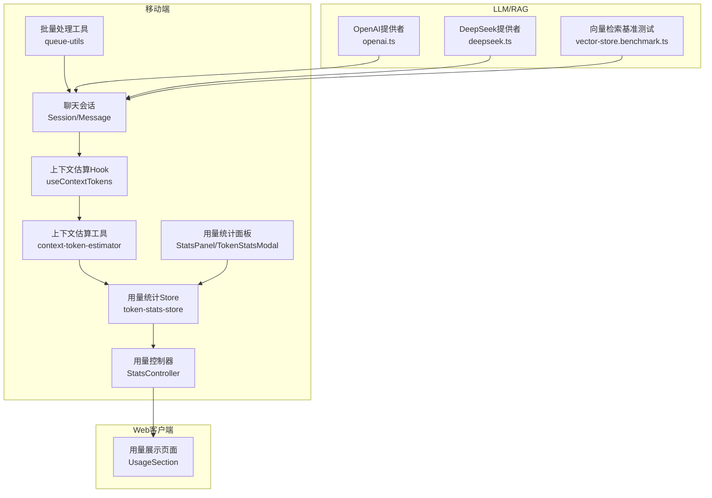
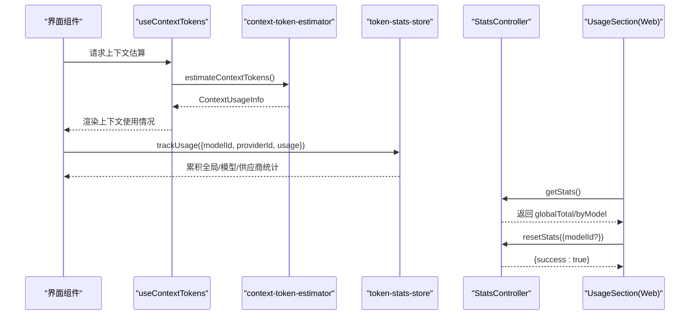
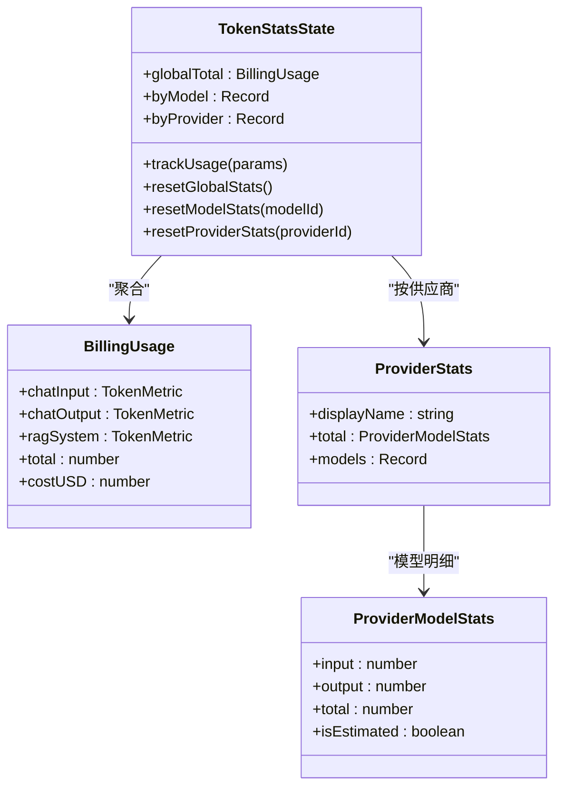
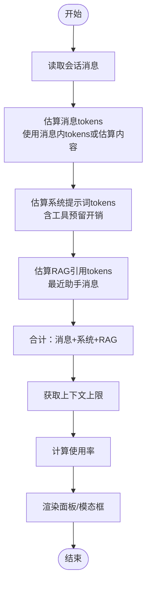
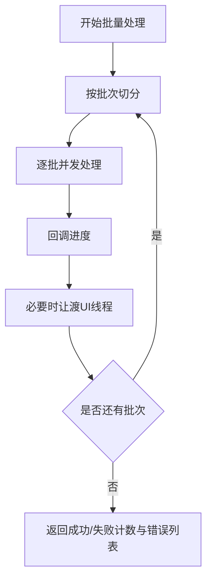
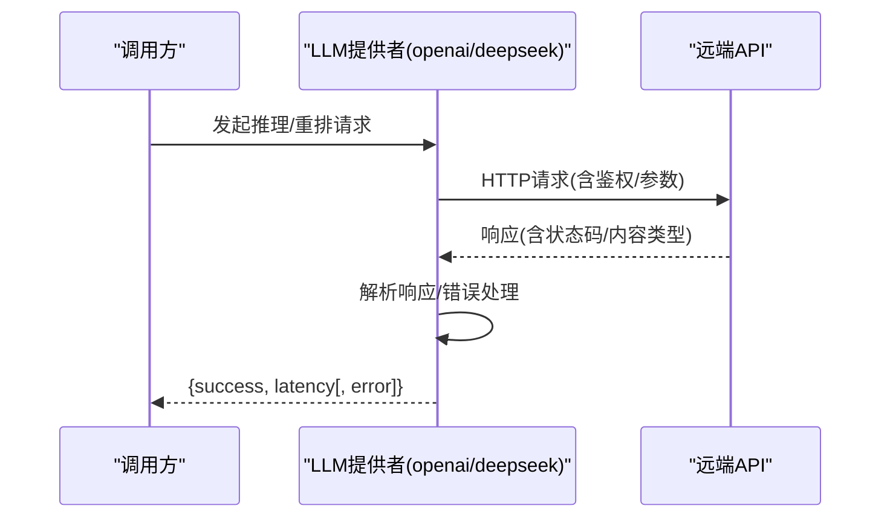
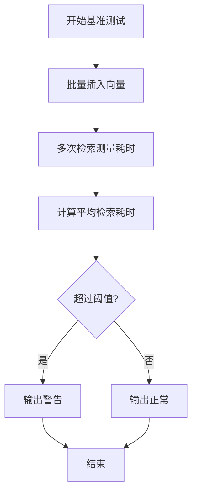
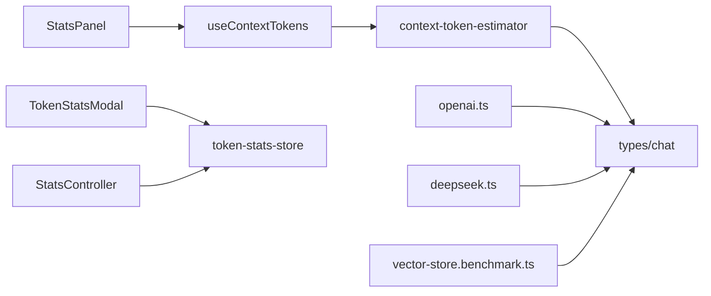

# 性能监控与优化

<cite>
**本文引用的文件**
- [src/services/workbench/controllers/StatsController.ts](file://src/services/workbench/controllers/StatsController.ts)
- [src/store/token-stats-store.ts](file://src/store/token-stats-store.ts)
- [src/features/chat/components/SessionSettingsSheet/StatsPanel.tsx](file://src/features/chat/components/SessionSettingsSheet/StatsPanel.tsx)
- [src/features/chat/hooks/useContextTokens.ts](file://src/features/chat/hooks/useContextTokens.ts)
- [src/features/chat/utils/context-token-estimator.ts](file://src/features/chat/utils/context-token-estimator.ts)
- [src/lib/queue-utils.ts](file://src/lib/queue-utils.ts)
- [src/types/chat.ts](file://src/types/chat.ts)
- [web-client/src/pages/settings/UsageSection.tsx](file://web-client/src/pages/settings/UsageSection.tsx)
- [src/features/chat/components/TokenStatsModal.tsx](file://src/features/chat/components/TokenStatsModal.tsx)
- [src/lib/llm/providers/openai.ts](file://src/lib/llm/providers/openai.ts)
- [src/lib/llm/providers/deepseek.ts](file://src/lib/llm/providers/deepseek.ts)
- [src/lib/rag/__tests__/vector-store.benchmark.ts](file://src/lib/rag/__tests__/vector-store.benchmark.ts)
</cite>

## 目录
1. [简介](#简介)
2. [项目结构](#项目结构)
3. [核心组件](#核心组件)
4. [架构总览](#架构总览)
5. [详细组件分析](#详细组件分析)
6. [依赖关系分析](#依赖关系分析)
7. [性能考量](#性能考量)
8. [故障排查指南](#故障排查指南)
9. [结论](#结论)
10. [附录](#附录)

## 简介
本技术文档聚焦于多提供商环境下的性能监控与优化，围绕响应时间、吞吐量、成功率与成本统计进行系统化梳理，并结合代码库中的上下文估算、用量统计、批量处理与RAG检索指标等实现，给出实时监控仪表板、历史趋势分析、性能预警与成本控制策略。同时提供性能测试方法、基准测试与A/B测试的实施建议，帮助在多提供商环境下完成性能对比、负载分布与瓶颈识别。

## 项目结构
本项目采用前端与工作台服务分离的结构，性能相关能力主要分布在以下区域：
- 用量统计与聚合：Zustand 状态管理 + AsyncStorage 持久化
- 上下文估算与可视化：Hooks + 工具函数 + UI 组件
- 批量处理与UI线程让渡：队列工具
- 多提供商LLM与RAG：提供者实现与检索指标
- Web客户端：用量统计展示与重置入口

图表来源
- [src/features/chat/hooks/useContextTokens.ts:26-77](file://src/features/chat/hooks/useContextTokens.ts#L26-L77)
- [src/features/chat/utils/context-token-estimator.ts:134-178](file://src/features/chat/utils/context-token-estimator.ts#L134-L178)
- [src/store/token-stats-store.ts:124-177](file://src/store/token-stats-store.ts#L124-L177)
- [src/services/workbench/controllers/StatsController.ts:4-22](file://src/services/workbench/controllers/StatsController.ts#L4-L22)
- [src/features/chat/components/SessionSettingsSheet/StatsPanel.tsx:14-249](file://src/features/chat/components/SessionSettingsSheet/StatsPanel.tsx#L14-L249)
- [src/features/chat/components/TokenStatsModal.tsx:54-85](file://src/features/chat/components/TokenStatsModal.tsx#L54-L85)
- [src/lib/queue-utils.ts:5-48](file://src/lib/queue-utils.ts#L5-L48)
- [src/lib/llm/providers/openai.ts:496-532](file://src/lib/llm/providers/openai.ts#L496-L532)
- [src/lib/llm/providers/deepseek.ts:578-619](file://src/lib/llm/providers/deepseek.ts#L578-L619)
- [src/lib/rag/__tests__/vector-store.benchmark.ts:44-77](file://src/lib/rag/__tests__/vector-store.benchmark.ts#L44-L77)
- [web-client/src/pages/settings/UsageSection.tsx:1-45](file://web-client/src/pages/settings/UsageSection.tsx#L1-L45)

章节来源
- [src/features/chat/hooks/useContextTokens.ts:26-77](file://src/features/chat/hooks/useContextTokens.ts#L26-L77)
- [src/features/chat/utils/context-token-estimator.ts:134-178](file://src/features/chat/utils/context-token-estimator.ts#L134-L178)
- [src/store/token-stats-store.ts:124-177](file://src/store/token-stats-store.ts#L124-L177)
- [src/services/workbench/controllers/StatsController.ts:4-22](file://src/services/workbench/controllers/StatsController.ts#L4-L22)
- [src/features/chat/components/SessionSettingsSheet/StatsPanel.tsx:14-249](file://src/features/chat/components/SessionSettingsSheet/StatsPanel.tsx#L14-L249)
- [src/features/chat/components/TokenStatsModal.tsx:54-85](file://src/features/chat/components/TokenStatsModal.tsx#L54-L85)
- [src/lib/queue-utils.ts:5-48](file://src/lib/queue-utils.ts#L5-L48)
- [src/lib/llm/providers/openai.ts:496-532](file://src/lib/llm/providers/openai.ts#L496-L532)
- [src/lib/llm/providers/deepseek.ts:578-619](file://src/lib/llm/providers/deepseek.ts#L578-L619)
- [src/lib/rag/__tests__/vector-store.benchmark.ts:44-77](file://src/lib/rag/__tests__/vector-store.benchmark.ts#L44-L77)
- [web-client/src/pages/settings/UsageSection.tsx:1-45](file://web-client/src/pages/settings/UsageSection.tsx#L1-L45)

## 核心组件
- 用量统计Store与聚合
  - 全局用量、按模型用量、按供应商用量的聚合与持久化，支持估算标记与成本占位
  - 提供重置全局/模型/供应商统计的能力
- 上下文估算与可视化
  - Hooks 将消息、系统提示词、RAG引用内容估算整合，输出使用率与上下文限制
  - UI 组件以卡片与进度条直观展示上下文构成与使用情况
- 批量处理与UI让渡
  - 分批处理大任务，通过小延迟让渡事件循环，避免UI冻结
- 多提供商性能指标采集
  - LLM提供者实现中记录请求耗时，便于后续构建响应时间与成功率指标
- RAG检索指标与基准
  - 检索元数据包含阶段、耗时、召回数量等；基准测试记录插入与平均检索耗时

章节来源
- [src/store/token-stats-store.ts:31-88](file://src/store/token-stats-store.ts#L31-L88)
- [src/features/chat/hooks/useContextTokens.ts:26-77](file://src/features/chat/hooks/useContextTokens.ts#L26-L77)
- [src/features/chat/utils/context-token-estimator.ts:184-214](file://src/features/chat/utils/context-token-estimator.ts#L184-L214)
- [src/lib/queue-utils.ts:5-48](file://src/lib/queue-utils.ts#L5-L48)
- [src/lib/llm/providers/openai.ts:496-532](file://src/lib/llm/providers/openai.ts#L496-L532)
- [src/lib/rag/__tests__/vector-store.benchmark.ts:44-77](file://src/lib/rag/__tests__/vector-store.benchmark.ts#L44-L77)

## 架构总览
多提供商环境下的性能监控由“数据采集—聚合—展示—策略执行”闭环组成：
- 数据采集：上下文估算、用量统计、LLM请求耗时、RAG检索元数据
- 聚合：Store 层按全局/模型/供应商维度累计，支持估算标记与成本占位
- 展示：移动端与Web端分别提供实时面板与用量页面
- 策略：基于指标进行成本控制、预算管理与资源调度

图表来源
- [src/features/chat/hooks/useContextTokens.ts:26-77](file://src/features/chat/hooks/useContextTokens.ts#L26-L77)
- [src/features/chat/utils/context-token-estimator.ts:134-178](file://src/features/chat/utils/context-token-estimator.ts#L134-L178)
- [src/store/token-stats-store.ts:131-155](file://src/store/token-stats-store.ts#L131-L155)
- [src/services/workbench/controllers/StatsController.ts:5-21](file://src/services/workbench/controllers/StatsController.ts#L5-L21)
- [web-client/src/pages/settings/UsageSection.tsx:12-33](file://web-client/src/pages/settings/UsageSection.tsx#L12-L33)

## 详细组件分析

### 用量统计与聚合（Store/Controller）
- 数据结构
  - 全局用量：输入/输出/RAG系统总计与估算成本占位
  - 模型维度：按 modelId 聚合
  - 供应商维度：按 providerId 聚合，包含供应商显示名与模型明细
- 聚合逻辑
  - 深拷贝避免状态污染
  - usage 中任一部分为估算则标记整体为估算
  - 供应商维度按输入/输出/总计累加，并维护模型明细
- 持久化与修复
  - 使用 AsyncStorage 持久化，启动时对损坏数据进行结构修复
- 控制器接口
  - getStats：返回全局与按模型统计
  - resetStats：支持按模型或全局重置

图表来源
- [src/store/token-stats-store.ts:31-50](file://src/store/token-stats-store.ts#L31-L50)
- [src/store/token-stats-store.ts:17-29](file://src/store/token-stats-store.ts#L17-L29)

章节来源
- [src/store/token-stats-store.ts:31-88](file://src/store/token-stats-store.ts#L31-L88)
- [src/store/token-stats-store.ts:124-177](file://src/store/token-stats-store.ts#L124-L177)
- [src/services/workbench/controllers/StatsController.ts:4-22](file://src/services/workbench/controllers/StatsController.ts#L4-L22)

### 上下文估算与可视化（Hook/Utils/UI）
- 估算维度
  - 历史消息：优先使用消息内已有的 tokens 输入/输出，否则估算内容与 reasoning
  - 系统提示词：Agent 系统提示词 + 自定义提示词 + 工具描述预留开销
  - RAG 内容：最近助手消息的 RAG 引用片段估算
- 限制与使用率
  - 上下文上限优先来自模型配置，其次来自模型规格，最后兜底
  - 使用率按上限计算，不超过100%
- 可视化
  - StatsPanel 展示消息总数、用户/助手消息数、上下文使用率与构成
  - TokenStatsModal 以条形图展示各类用量占比与估算标记

图表来源
- [src/features/chat/utils/context-token-estimator.ts:41-104](file://src/features/chat/utils/context-token-estimator.ts#L41-L104)
- [src/features/chat/utils/context-token-estimator.ts:134-178](file://src/features/chat/utils/context-token-estimator.ts#L134-L178)
- [src/features/chat/hooks/useContextTokens.ts:26-77](file://src/features/chat/hooks/useContextTokens.ts#L26-L77)
- [src/features/chat/components/SessionSettingsSheet/StatsPanel.tsx:147-151](file://src/features/chat/components/SessionSettingsSheet/StatsPanel.tsx#L147-L151)
- [src/features/chat/components/TokenStatsModal.tsx:54-85](file://src/features/chat/components/TokenStatsModal.tsx#L54-L85)

章节来源
- [src/features/chat/utils/context-token-estimator.ts:18-104](file://src/features/chat/utils/context-token-estimator.ts#L18-L104)
- [src/features/chat/utils/context-token-estimator.ts:106-129](file://src/features/chat/utils/context-token-estimator.ts#L106-L129)
- [src/features/chat/utils/context-token-estimator.ts:131-178](file://src/features/chat/utils/context-token-estimator.ts#L131-L178)
- [src/features/chat/hooks/useContextTokens.ts:26-77](file://src/features/chat/hooks/useContextTokens.ts#L26-L77)
- [src/features/chat/components/SessionSettingsSheet/StatsPanel.tsx:14-249](file://src/features/chat/components/SessionSettingsSheet/StatsPanel.tsx#L14-L249)
- [src/features/chat/components/TokenStatsModal.tsx:54-85](file://src/features/chat/components/TokenStatsModal.tsx#L54-L85)

### 批量处理与UI让渡（Queue Utils）
- 设计目标：在处理大量任务时不阻塞UI线程
- 关键点：分批、并发执行、进度回调、延迟让渡
- 适用场景：批量导入、批量统计、批量检索等

图表来源
- [src/lib/queue-utils.ts:5-48](file://src/lib/queue-utils.ts#L5-L48)

章节来源
- [src/lib/queue-utils.ts:5-48](file://src/lib/queue-utils.ts#L5-L48)

### 多提供商性能指标采集（LLM Providers）
- OpenAI/DeepSeek 提供者均在请求完成后记录耗时，便于后续统计响应时间与成功率
- 错误路径：捕获非JSON响应与异常，统一返回 {success, latency, error}

图表来源
- [src/lib/llm/providers/openai.ts:496-532](file://src/lib/llm/providers/openai.ts#L496-L532)
- [src/lib/llm/providers/deepseek.ts:578-619](file://src/lib/llm/providers/deepseek.ts#L578-L619)

章节来源
- [src/lib/llm/providers/openai.ts:496-532](file://src/lib/llm/providers/openai.ts#L496-L532)
- [src/lib/llm/providers/deepseek.ts:578-619](file://src/lib/llm/providers/deepseek.ts#L578-L619)

### RAG检索指标与基准（RAG Benchmarks）
- 检索元数据：包含阶段、耗时、召回数量、最终返回数量等
- 基准测试：记录向量插入耗时与平均检索耗时，提供性能告警阈值

图表来源
- [src/lib/rag/__tests__/vector-store.benchmark.ts:44-77](file://src/lib/rag/__tests__/vector-store.benchmark.ts#L44-L77)

章节来源
- [src/lib/rag/__tests__/vector-store.benchmark.ts:44-77](file://src/lib/rag/__tests__/vector-store.benchmark.ts#L44-L77)

## 依赖关系分析
- 组件耦合
  - useContextTokens 依赖 Chat/Agent/API Store 获取模型上下文与配置
  - context-token-estimator 依赖 token 计数工具与模型规格
  - token-stats-store 与 StatsController 通过 Zustand 与工作台路由交互
- 外部依赖
  - AsyncStorage 用于用量统计持久化
  - Fetch 用于 LLM 提供者请求与错误解析
- 潜在环路
  - 估算与用量统计解耦，通过消息与会话数据单向流向 Store，无明显环路

图表来源
- [src/features/chat/hooks/useContextTokens.ts:26-77](file://src/features/chat/hooks/useContextTokens.ts#L26-L77)
- [src/features/chat/utils/context-token-estimator.ts:134-178](file://src/features/chat/utils/context-token-estimator.ts#L134-L178)
- [src/features/chat/components/SessionSettingsSheet/StatsPanel.tsx:14-249](file://src/features/chat/components/SessionSettingsSheet/StatsPanel.tsx#L14-L249)
- [src/features/chat/components/TokenStatsModal.tsx:54-85](file://src/features/chat/components/TokenStatsModal.tsx#L54-L85)
- [src/store/token-stats-store.ts:124-177](file://src/store/token-stats-store.ts#L124-L177)
- [src/services/workbench/controllers/StatsController.ts:4-22](file://src/services/workbench/controllers/StatsController.ts#L4-L22)
- [src/lib/llm/providers/openai.ts:496-532](file://src/lib/llm/providers/openai.ts#L496-L532)
- [src/lib/llm/providers/deepseek.ts:578-619](file://src/lib/llm/providers/deepseek.ts#L578-L619)
- [src/lib/rag/__tests__/vector-store.benchmark.ts:44-77](file://src/lib/rag/__tests__/vector-store.benchmark.ts#L44-L77)
- [src/types/chat.ts:38-50](file://src/types/chat.ts#L38-L50)

章节来源
- [src/features/chat/hooks/useContextTokens.ts:26-77](file://src/features/chat/hooks/useContextTokens.ts#L26-L77)
- [src/features/chat/utils/context-token-estimator.ts:134-178](file://src/features/chat/utils/context-token-estimator.ts#L134-L178)
- [src/features/chat/components/SessionSettingsSheet/StatsPanel.tsx:14-249](file://src/features/chat/components/SessionSettingsSheet/StatsPanel.tsx#L14-L249)
- [src/features/chat/components/TokenStatsModal.tsx:54-85](file://src/features/chat/components/TokenStatsModal.tsx#L54-L85)
- [src/store/token-stats-store.ts:124-177](file://src/store/token-stats-store.ts#L124-L177)
- [src/services/workbench/controllers/StatsController.ts:4-22](file://src/services/workbench/controllers/StatsController.ts#L4-L22)
- [src/lib/llm/providers/openai.ts:496-532](file://src/lib/llm/providers/openai.ts#L496-L532)
- [src/lib/llm/providers/deepseek.ts:578-619](file://src/lib/llm/providers/deepseek.ts#L578-L619)
- [src/lib/rag/__tests__/vector-store.benchmark.ts:44-77](file://src/lib/rag/__tests__/vector-store.benchmark.ts#L44-L77)
- [src/types/chat.ts:38-50](file://src/types/chat.ts#L38-L50)

## 性能考量
- 响应时间与成功率
  - LLM 提供者已记录 latency，可扩展为响应时间直方图与成功率统计
  - 错误路径统一返回 {success, latency, error}，便于聚合成功率
- 吞吐量
  - 批量处理工具支持分批并发，避免UI冻结；可结合队列长度与批次大小调优
- 成本统计
  - Store 中已预留 costUSD 占位，可接入费率卡实现成本聚合与预算告警
- 上下文与RAG
  - 上下文估算采用保守预留，避免超限；RAG检索指标可用于识别检索链路瓶颈
- 可观测性
  - Store 在 hydrate 时进行结构修复，提升稳定性；建议补充埋点与采样

章节来源
- [src/lib/llm/providers/openai.ts:496-532](file://src/lib/llm/providers/openai.ts#L496-L532)
- [src/lib/llm/providers/deepseek.ts:578-619](file://src/lib/llm/providers/deepseek.ts#L578-L619)
- [src/lib/queue-utils.ts:5-48](file://src/lib/queue-utils.ts#L5-L48)
- [src/store/token-stats-store.ts:84-85](file://src/store/token-stats-store.ts#L84-L85)
- [src/features/chat/utils/context-token-estimator.ts:78-82](file://src/features/chat/utils/context-token-estimator.ts#L78-L82)
- [src/lib/rag/__tests__/vector-store.benchmark.ts:44-77](file://src/lib/rag/__tests__/vector-store.benchmark.ts#L44-L77)

## 故障排查指南
- 用量统计异常
  - 现象：用量不更新或数值异常
  - 排查：确认 trackUsage 参数包含 modelId、providerId、usage；检查 hydrate 修复日志
- 上下文估算不准确
  - 现象：使用率与预期不符
  - 排查：确认消息 tokens 是否存在；系统提示词与工具预留是否计入；上下文上限来源是否正确
- UI 卡顿
  - 现象：大批量操作时界面无响应
  - 排查：使用批量处理工具，调整批次大小与延迟；确保异步处理与进度回调
- LLM 请求失败
  - 现象：请求报错或返回HTML
  - 排查：检查鉴权头、URL拼接、Content-Type；查看 latency 与 error 字段

章节来源
- [src/store/token-stats-store.ts:181-267](file://src/store/token-stats-store.ts#L181-L267)
- [src/features/chat/utils/context-token-estimator.ts:134-178](file://src/features/chat/utils/context-token-estimator.ts#L134-L178)
- [src/lib/queue-utils.ts:5-48](file://src/lib/queue-utils.ts#L5-L48)
- [src/lib/llm/providers/openai.ts:496-532](file://src/lib/llm/providers/openai.ts#L496-L532)
- [src/lib/llm/providers/deepseek.ts:578-619](file://src/lib/llm/providers/deepseek.ts#L578-L619)

## 结论
本项目在多提供商环境下已具备用量统计、上下文估算与基础性能指标采集能力。建议下一步完善：
- 建立响应时间与成功率的聚合与可视化
- 引入成本费率卡与预算告警
- 增加RAG检索阶段耗时与召回质量指标
- 通过基准测试与A/B测试持续优化模型选择与检索策略

## 附录

### 实时监控仪表板与历史趋势
- 移动端：上下文使用面板与用量统计面板
- Web端：用量页面展示全局与按模型统计，支持重置

章节来源
- [src/features/chat/components/SessionSettingsSheet/StatsPanel.tsx:14-249](file://src/features/chat/components/SessionSettingsSheet/StatsPanel.tsx#L14-L249)
- [src/features/chat/components/TokenStatsModal.tsx:54-85](file://src/features/chat/components/TokenStatsModal.tsx#L54-L85)
- [web-client/src/pages/settings/UsageSection.tsx:1-45](file://web-client/src/pages/settings/UsageSection.tsx#L1-L45)

### 成本控制策略与预算管理
- 成本占位：Store 中预留 costUSD，便于接入费率卡
- 预算管理：建议在控制器层增加预算阈值判断与告警

章节来源
- [src/store/token-stats-store.ts:84-85](file://src/store/token-stats-store.ts#L84-L85)
- [src/services/workbench/controllers/StatsController.ts:4-22](file://src/services/workbench/controllers/StatsController.ts#L4-L22)

### 性能测试与A/B测试
- 基准测试：向量检索平均耗时与插入耗时
- A/B测试：在多提供商间切换模型与参数，对比响应时间、吞吐量与成本

章节来源
- [src/lib/rag/__tests__/vector-store.benchmark.ts:44-77](file://src/lib/rag/__tests__/vector-store.benchmark.ts#L44-L77)
- [src/lib/llm/providers/openai.ts:496-532](file://src/lib/llm/providers/openai.ts#L496-L532)
- [src/lib/llm/providers/deepseek.ts:578-619](file://src/lib/llm/providers/deepseek.ts#L578-L619)