# 提供商抽象层

<cite>
**本文档引用的文件**
- [factory.ts](file://src/lib/llm/factory.ts)
- [types.ts](file://src/lib/llm/types.ts)
- [openai-compatible.ts](file://src/lib/llm/providers/openai-compatible.ts)
- [openai.ts](file://src/lib/llm/providers/openai.ts)
- [deepseek.ts](file://src/lib/llm/providers/deepseek.ts)
- [moonshot.ts](file://src/lib/llm/providers/moonshot.ts)
- [gemini.ts](file://src/lib/llm/providers/gemini.ts)
- [vertexai.ts](file://src/lib/llm/providers/vertexai.ts)
- [local-llm.ts](file://src/lib/llm/providers/local-llm.ts)
- [provider-parser.ts](file://src/lib/provider-parser.ts)
- [model-utils.ts](file://src/lib/llm/model-utils.ts)
</cite>

## 目录
1. [简介](#简介)
2. [项目结构](#项目结构)
3. [核心组件](#核心组件)
4. [架构概览](#架构概览)
5. [详细组件分析](#详细组件分析)
6. [依赖关系分析](#依赖关系分析)
7. [性能考量](#性能考量)
8. [故障排除指南](#故障排除指南)
9. [结论](#结论)

## 简介

提供商抽象层是 Nexara 项目中负责统一管理各种大语言模型提供商的核心模块。该系统采用工厂模式设计，通过统一的接口抽象不同的提供商实现，实现了对 OpenAI 兼容提供商、专用提供商（DeepSeek、Moonshot）和本地提供商的统一管理。

该抽象层的主要目标是：
- 提供统一的 LlmClient 接口，屏蔽不同提供商的差异
- 支持多种提供商类型的动态切换和配置
- 实现标准化的参数传递和温度值限制
- 提供扩展的配置机制和参数验证
- 支持特殊提供商的特定功能和限制

## 项目结构

提供商抽象层位于 `src/lib/llm/` 目录下，采用分层组织结构：

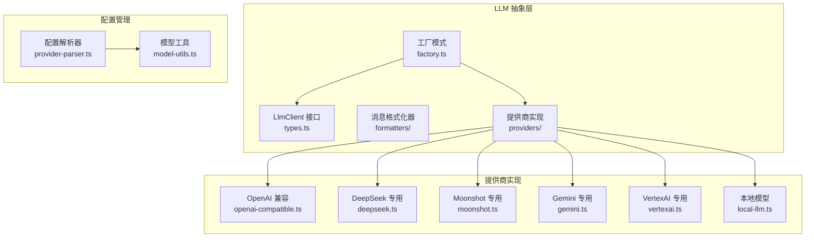

**图表来源**
- [factory.ts:1-97](file://src/lib/llm/factory.ts#L1-L97)
- [types.ts:1-84](file://src/lib/llm/types.ts#L1-L84)

**章节来源**
- [factory.ts:1-97](file://src/lib/llm/factory.ts#L1-L97)
- [types.ts:1-84](file://src/lib/llm/types.ts#L1-L84)

## 核心组件

### LlmClient 接口设计

LlmClient 接口定义了统一的提供商抽象规范，确保所有提供商实现都遵循相同的方法签名和行为约定：

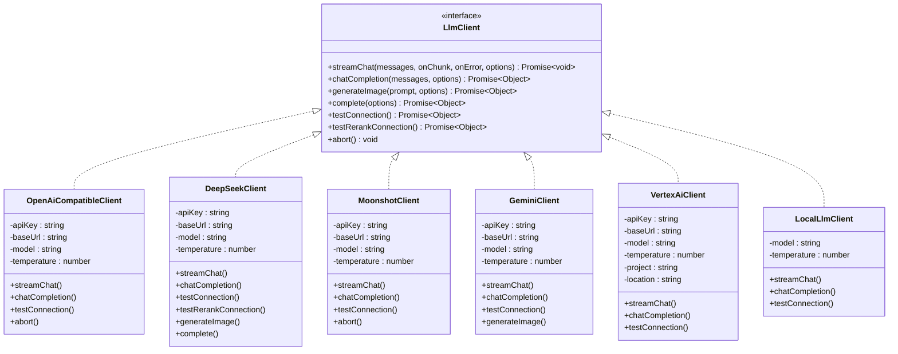

**图表来源**
- [types.ts:45-84](file://src/lib/llm/types.ts#L45-L84)
- [openai-compatible.ts:7-576](file://src/lib/llm/providers/openai-compatible.ts#L7-L576)
- [deepseek.ts:7-763](file://src/lib/llm/providers/deepseek.ts#L7-L763)
- [moonshot.ts:16-378](file://src/lib/llm/providers/moonshot.ts#L16-L378)
- [gemini.ts:7-605](file://src/lib/llm/providers/gemini.ts#L7-L605)
- [vertexai.ts:13-800](file://src/lib/llm/providers/vertexai.ts#L13-L800)
- [local-llm.ts:7-160](file://src/lib/llm/providers/local-llm.ts#L7-L160)

### 工厂模式实现

工厂模式是提供商抽象层的核心设计模式，通过 createLlmClient 函数根据提供商类型动态创建相应的客户端实例：

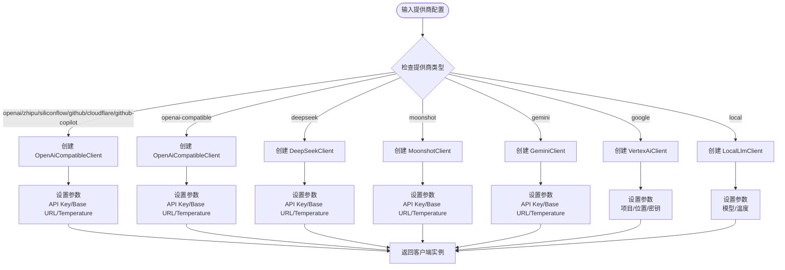

**图表来源**
- [factory.ts:23-96](file://src/lib/llm/factory.ts#L23-L96)

**章节来源**
- [factory.ts:23-96](file://src/lib/llm/factory.ts#L23-L96)

## 架构概览

提供商抽象层采用分层架构设计，实现了高度的模块化和可扩展性：

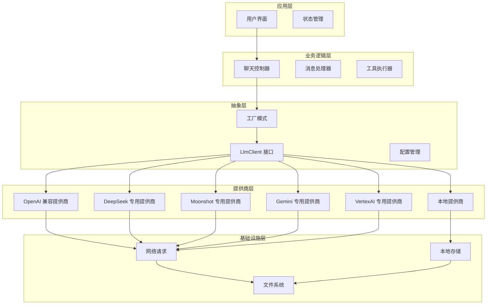

**图表来源**
- [factory.ts:1-97](file://src/lib/llm/factory.ts#L1-L97)
- [types.ts:1-84](file://src/lib/llm/types.ts#L1-L84)

### 数据流分析

提供商抽象层的数据流遵循标准化的处理流程：

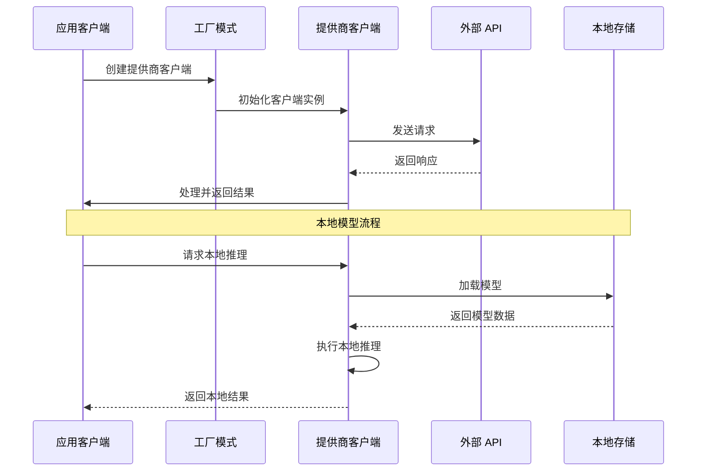

**图表来源**
- [factory.ts:23-96](file://src/lib/llm/factory.ts#L23-L96)
- [local-llm.ts:56-110](file://src/lib/llm/providers/local-llm.ts#L56-L110)

## 详细组件分析

### OpenAI 兼容提供商

OpenAiCompatibleClient 是最通用的提供商实现，支持多种 OpenAI 兼容的 API：

#### 核心特性
- **流式和非流式响应处理**
- **工具调用支持（Function Calling）**
- **温度值限制和参数验证**
- **HTML 错误页面检测**
- **深度思考模式支持**

#### 参数传递策略

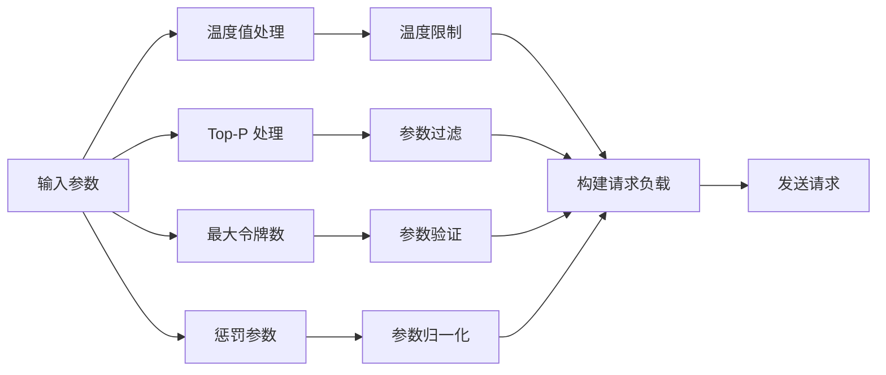

**图表来源**
- [openai-compatible.ts:403-495](file://src/lib/llm/providers/openai-compatible.ts#L403-L495)

**章节来源**
- [openai-compatible.ts:1-576](file://src/lib/llm/providers/openai-compatible.ts#L1-L576)

### DeepSeek 专用提供商

DeepSeekClient 实现了针对 DeepSeek API 的专门优化：

#### 特殊功能
- **严格的 Schema 验证（Strict Mode）**
- **深度思考标签处理**
- **推理内容保留**
- **工具调用增强支持**
- **重排功能测试**

#### 温度值限制

DeepSeek 对温度值有严格的限制要求：

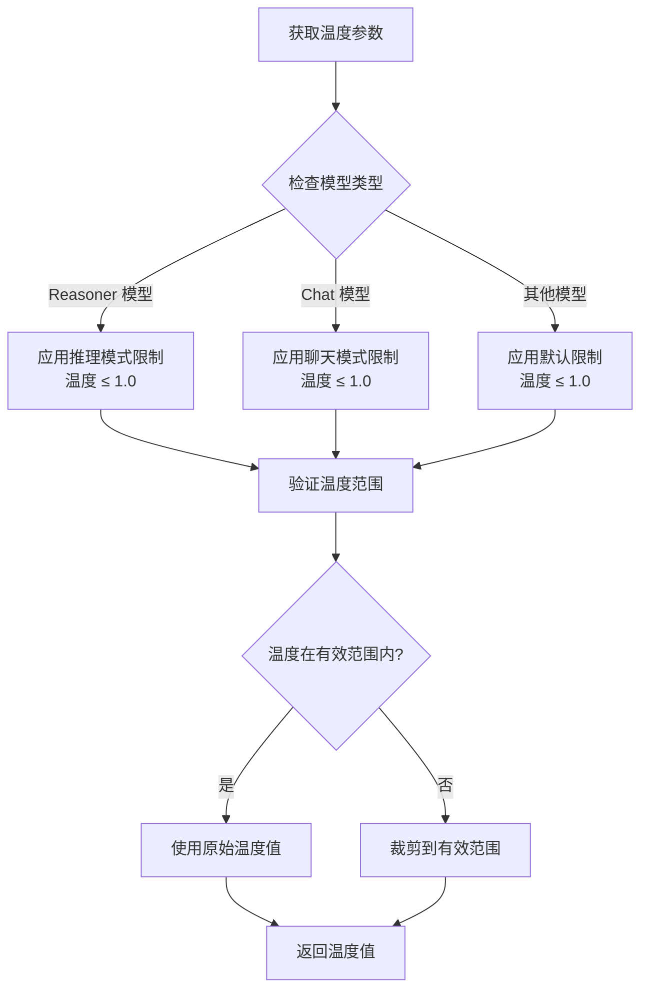

**图表来源**
- [deepseek.ts:447-524](file://src/lib/llm/providers/deepseek.ts#L447-L524)

**章节来源**
- [deepseek.ts:1-763](file://src/lib/llm/providers/deepseek.ts#L1-L763)

### Moonshot 专用提供商

MoonshotClient 专门为 Moonshot API（Kimi）提供了优化支持：

#### 核心特性
- **禁用严格模式（strict: false）**
- **推理内容保留**
- **增强的工具解析**
- **温度值限制（≤ 1.0）**

#### 错误处理机制

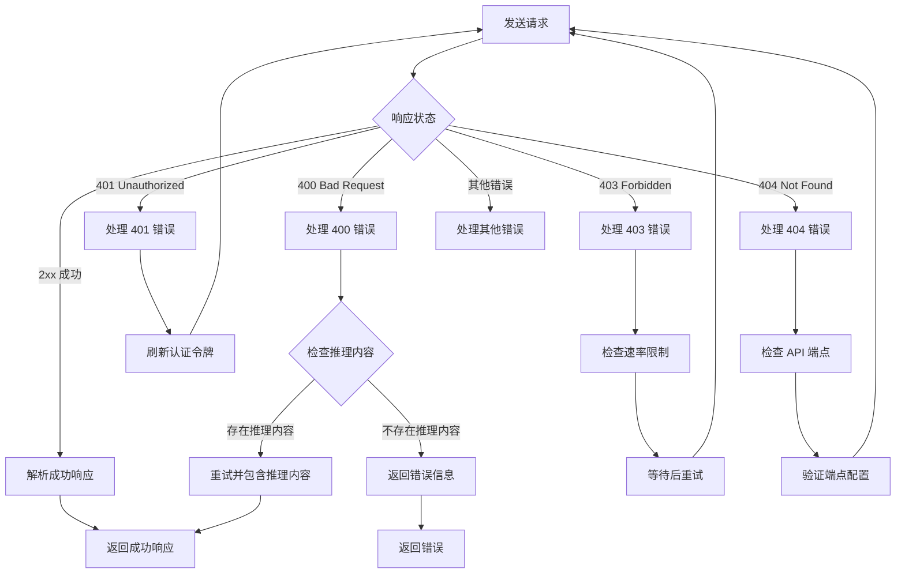

**图表来源**
- [moonshot.ts:104-333](file://src/lib/llm/providers/moonshot.ts#L104-L333)

**章节来源**
- [moonshot.ts:1-378](file://src/lib/llm/providers/moonshot.ts#L1-L378)

### Gemini 专用提供商

GeminiClient 实现了 Google Gemini API 的完整支持：

#### 多模态支持
- **文本和图像处理**
- **本地文件上传**
- **思考模式支持**
- **原生搜索集成**

#### 文件处理机制

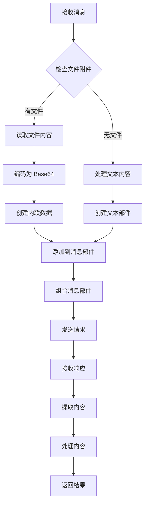

**图表来源**
- [gemini.ts:187-214](file://src/lib/llm/providers/gemini.ts#L187-L214)

**章节来源**
- [gemini.ts:1-605](file://src/lib/llm/providers/gemini.ts#L1-L605)

### VertexAI 专用提供商

VertexAiClient 提供了 Google Cloud Vertex AI 的企业级支持：

#### 服务账户认证
- **JWT 令牌生成**
- **OAuth 2.0 认证流程**
- **自动令牌刷新**

#### 高级功能
- **多模态内容处理**
- **思考模式配置**
- **原生搜索集成**
- **文件系统支持**

**章节来源**
- [vertexai.ts:1-800](file://src/lib/llm/providers/vertexai.ts#L1-L800)

### 本地提供商

LocalLlmClient 实现了本地模型推理能力：

#### 本地推理特性
- **离线模型运行**
- **本地文件系统集成**
- **实时模型加载**
- **性能优化**

#### 模型加载流程

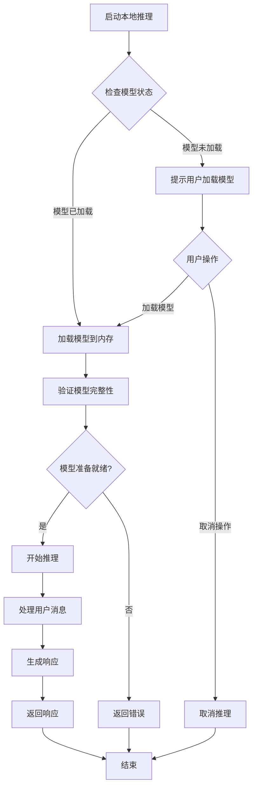

**图表来源**
- [local-llm.ts:56-110](file://src/lib/llm/providers/local-llm.ts#L56-L110)

**章节来源**
- [local-llm.ts:1-160](file://src/lib/llm/providers/local-llm.ts#L1-L160)

## 依赖关系分析

提供商抽象层的依赖关系体现了清晰的分层架构：

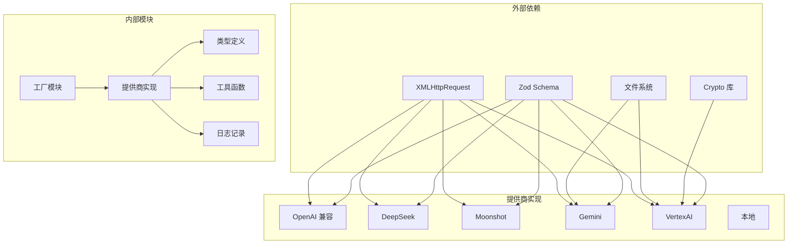

**图表来源**
- [factory.ts:1-10](file://src/lib/llm/factory.ts#L1-L10)
- [openai-compatible.ts:1-6](file://src/lib/llm/providers/openai-compatible.ts#L1-L6)

### 组件耦合度分析

提供商抽象层实现了低耦合高内聚的设计原则：

- **接口隔离**：LlmClient 接口定义了清晰的职责边界
- **依赖注入**：通过工厂模式实现松散耦合
- **单一职责**：每个提供商类专注于特定的功能实现
- **开闭原则**：易于添加新的提供商类型

**章节来源**
- [types.ts:45-84](file://src/lib/llm/types.ts#L45-L84)
- [factory.ts:23-96](file://src/lib/llm/factory.ts#L23-L96)

## 性能考量

### 流式处理优化

所有提供商都实现了流式处理机制，以提高用户体验：

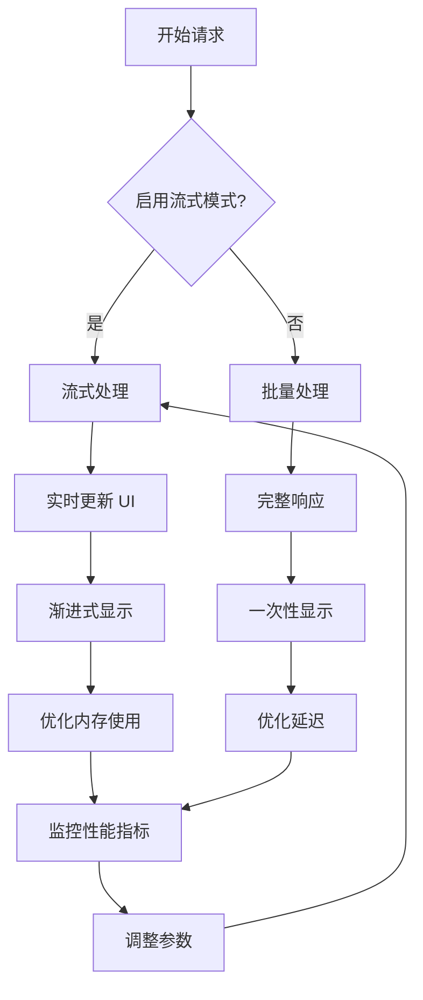

### 缓存和连接管理

- **连接池管理**：避免频繁建立网络连接
- **响应缓存**：缓存常用的模型规格和配置
- **令牌管理**：智能管理 API 访问令牌
- **错误重试**：实现指数退避的重试机制

## 故障排除指南

### 常见问题诊断

#### 网络连接问题
1. **检查 API 密钥有效性**
2. **验证 Base URL 配置**
3. **确认网络连接状态**
4. **检查防火墙设置**

#### 温度值限制错误
- **DeepSeek**: 温度值必须 ≤ 1.0
- **Moonshot**: 温度值必须 ≤ 1.0  
- **Zhipu**: 温度值必须 < 1.0

#### 工具调用失败
1. **验证工具 Schema 完整性**
2. **检查工具函数实现**
3. **确认参数序列化正确性**

**章节来源**
- [deepseek.ts:316-318](file://src/lib/llm/providers/deepseek.ts#L316-L318)
- [moonshot.ts:316-318](file://src/lib/llm/providers/moonshot.ts#L316-L318)
- [openai.ts:439-443](file://src/lib/llm/providers/openai.ts#L439-L443)

### 日志和调试

提供商抽象层内置了完善的日志记录机制：

- **请求日志**: 记录所有 API 请求详情
- **响应日志**: 记录 API 响应内容
- **错误日志**: 记录详细的错误信息
- **性能日志**: 监控响应时间和资源使用

## 结论

提供商抽象层通过精心设计的工厂模式和统一接口，成功实现了对多种大语言模型提供商的统一管理。该系统具有以下优势：

1. **高度可扩展性**: 新增提供商类型只需实现 LlmClient 接口
2. **统一的配置管理**: 通过 ExtendedModelConfig 实现标准化配置
3. **强大的错误处理**: 完善的异常捕获和恢复机制
4. **性能优化**: 流式处理和连接池管理
5. **安全保证**: 严格的参数验证和令牌管理

该抽象层为 Nexara 项目提供了坚实的基础，支持未来更多的提供商集成和功能扩展。通过遵循现有的设计模式和最佳实践，开发者可以轻松地添加新的提供商类型或扩展现有功能。