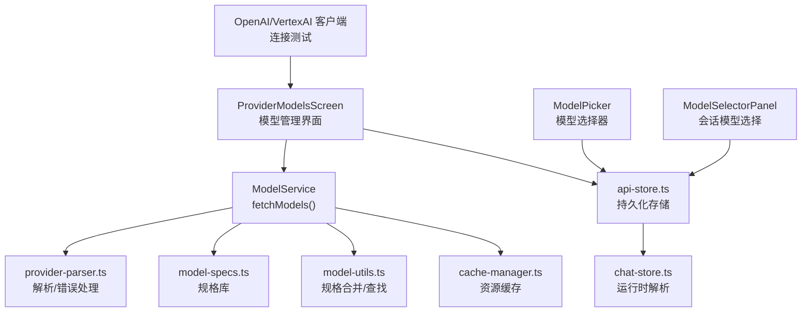
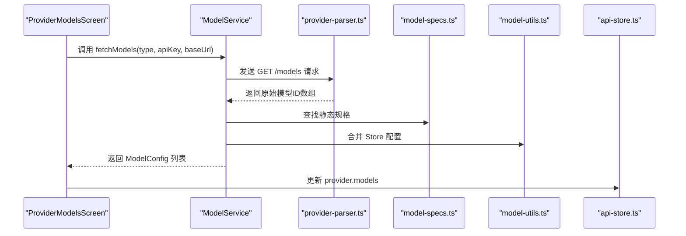
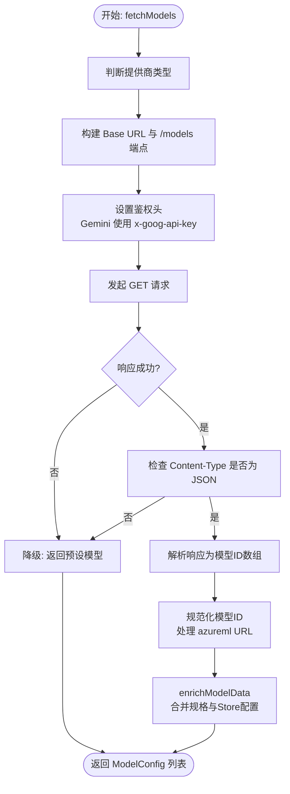
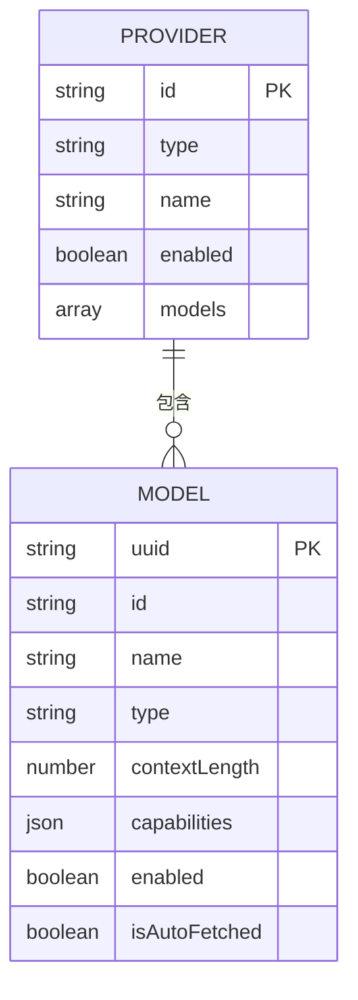
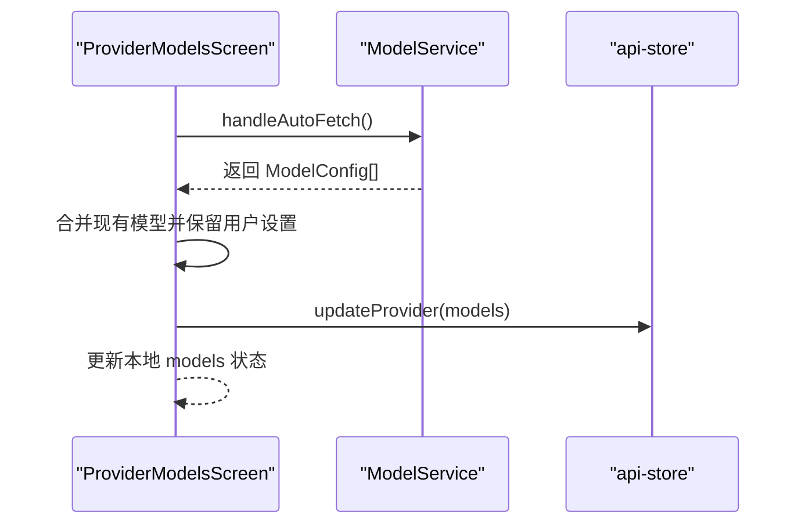
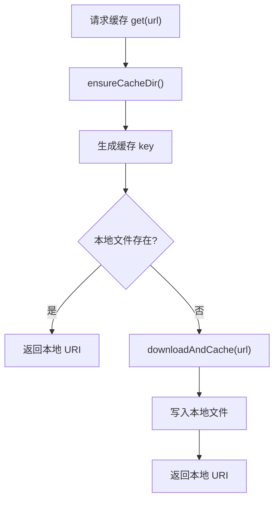
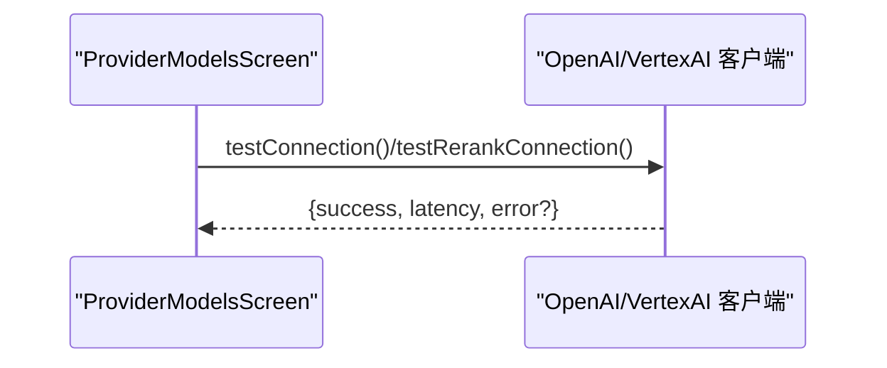
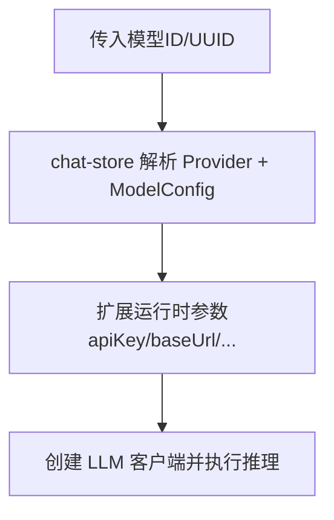
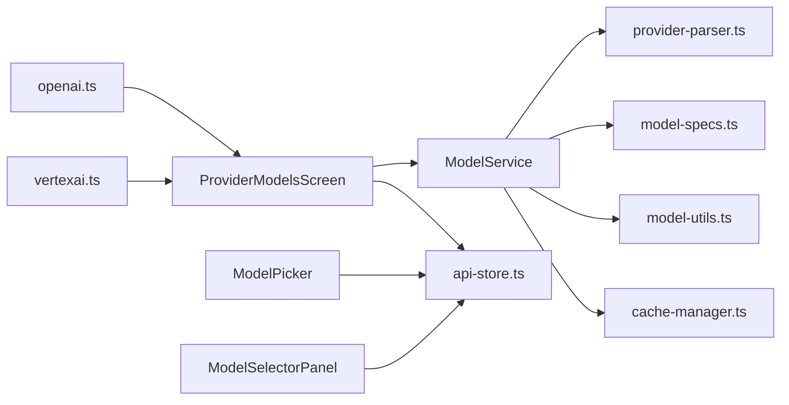

# 模型发现机制

<cite>
**本文档引用的文件**
- [src/lib/provider-parser.ts](file://src/lib/provider-parser.ts)
- [src/lib/llm/model-utils.ts](file://src/lib/llm/model-utils.ts)
- [src/lib/llm/model-specs.ts](file://src/lib/llm/model-specs.ts)
- [src/store/api-store.ts](file://src/store/api-store.ts)
- [src/features/settings/screens/ProviderModelsScreen.tsx](file://src/features/settings/screens/ProviderModelsScreen.tsx)
- [src/features/settings/ModelPicker.tsx](file://src/features/settings/ModelPicker.tsx)
- [src/features/chat/components/SessionSettingsSheet/ModelSelectorPanel.tsx](file://src/features/chat/components/SessionSettingsSheet/ModelSelectorPanel.tsx)
- [src/lib/cache/cache-manager.ts](file://src/lib/cache/cache-manager.ts)
- [src/lib/llm/providers/openai.ts](file://src/lib/llm/providers/openai.ts)
- [src/lib/llm/providers/vertexai.ts](file://src/lib/llm/providers/vertexai.ts)
- [src/store/chat-store.ts](file://src/store/chat-store.ts)
- [src/lib/rag/graph-extractor.ts](file://src/lib/rag/graph-extractor.ts)
</cite>

## 目录
1. [引言](#引言)
2. [项目结构](#项目结构)
3. [核心组件](#核心组件)
4. [架构总览](#架构总览)
5. [详细组件分析](#详细组件分析)
6. [依赖关系分析](#依赖关系分析)
7. [性能考虑](#性能考虑)
8. [故障排除指南](#故障排除指南)
9. [结论](#结论)

## 引言
本文件系统性阐述 Nexara 项目中的“模型发现机制”，涵盖模型列表获取、解析与缓存的完整流程；提供商特定的模型发现 API 调用方式（RESTful 接口、响应解析与错误处理）；模型元数据提取（ID、显示名、描述、参数范围、可用性状态）；模型缓存策略与过期机制、手动刷新功能；以及模型过滤、排序与搜索的实现细节。同时总结模型兼容性检查与版本管理的最佳实践。

## 项目结构
围绕模型发现机制的关键模块分布如下：
- 服务端/客户端交互与解析：src/lib/provider-parser.ts（ModelService）
- 模型规格与元数据：src/lib/llm/model-specs.ts、src/lib/llm/model-utils.ts
- 存储与状态：src/store/api-store.ts、src/store/chat-store.ts
- 用户界面与交互：src/features/settings/screens/ProviderModelsScreen.tsx、src/features/settings/ModelPicker.tsx、src/features/chat/components/SessionSettingsSheet/ModelSelectorPanel.tsx
- 缓存与资源：src/lib/cache/cache-manager.ts
- 客户端适配与测试：src/lib/llm/providers/openai.ts、src/lib/llm/providers/vertexai.ts
- 知识图谱解析与模型解析：src/lib/rag/graph-extractor.ts



图表来源
- [src/features/settings/screens/ProviderModelsScreen.tsx:382-617](file://src/features/settings/screens/ProviderModelsScreen.tsx#L382-L617)
- [src/lib/provider-parser.ts:38-215](file://src/lib/provider-parser.ts#L38-L215)
- [src/lib/llm/model-specs.ts:1-347](file://src/lib/llm/model-specs.ts#L1-L347)
- [src/lib/llm/model-utils.ts:1-35](file://src/lib/llm/model-utils.ts#L1-L35)
- [src/store/api-store.ts:1-161](file://src/store/api-store.ts#L1-L161)
- [src/lib/cache/cache-manager.ts:2-115](file://src/lib/cache/cache-manager.ts#L2-L115)
- [src/lib/llm/providers/openai.ts:1-200](file://src/lib/llm/providers/openai.ts#L1-L200)
- [src/lib/llm/providers/vertexai.ts:854-894](file://src/lib/llm/providers/vertexai.ts#L854-L894)
- [src/store/chat-store.ts:2429-2456](file://src/store/chat-store.ts#L2429-L2456)

章节来源
- [src/features/settings/screens/ProviderModelsScreen.tsx:382-617](file://src/features/settings/screens/ProviderModelsScreen.tsx#L382-L617)
- [src/lib/provider-parser.ts:38-215](file://src/lib/provider-parser.ts#L38-L215)
- [src/lib/llm/model-specs.ts:1-347](file://src/lib/llm/model-specs.ts#L1-L347)
- [src/lib/llm/model-utils.ts:1-35](file://src/lib/llm/model-utils.ts#L1-L35)
- [src/store/api-store.ts:1-161](file://src/store/api-store.ts#L1-L161)
- [src/lib/cache/cache-manager.ts:2-115](file://src/lib/cache/cache-manager.ts#L2-L115)
- [src/lib/llm/providers/openai.ts:1-200](file://src/lib/llm/providers/openai.ts#L1-L200)
- [src/lib/llm/providers/vertexai.ts:854-894](file://src/lib/llm/providers/vertexai.ts#L854-L894)
- [src/store/chat-store.ts:2429-2456](file://src/store/chat-store.ts#L2429-L2456)

## 核心组件
- ModelService：统一的模型发现入口，负责根据提供商类型构造 RESTful 请求、解析响应、降级策略与元数据增强。
- provider-parser.ts：封装 fetch 调用、内容类型校验、HTML 错误页捕获、模型 ID 规范化与 azureml URL 解析。
- model-specs.ts：内置模型规格数据库，提供上下文长度、类型、能力标签等静态元数据。
- model-utils.ts：在 Store 与规格库之间做合并与回退，确保 UI 层获得完整元数据。
- api-store.ts：Zustand 持久化存储，维护 ProviderConfig 与 ModelConfig 列表、启用状态与统计。
- ProviderModelsScreen.tsx：提供模型列表管理界面，支持自动抓取、过滤、测试连接、删除与批量操作。
- ModelPicker.tsx / ModelSelectorPanel.tsx：模型选择与过滤 UI，支持按名称、ID、提供商名称搜索与标签展示。
- cache-manager.ts：通用文件缓存，用于图标等资源的本地缓存与复用。
- OpenAI/VertexAI 客户端：提供连接测试与错误规范化，辅助模型可用性验证。

章节来源
- [src/lib/provider-parser.ts:38-215](file://src/lib/provider-parser.ts#L38-L215)
- [src/lib/llm/model-specs.ts:1-347](file://src/lib/llm/model-specs.ts#L1-L347)
- [src/lib/llm/model-utils.ts:1-35](file://src/lib/llm/model-utils.ts#L1-L35)
- [src/store/api-store.ts:1-161](file://src/store/api-store.ts#L1-L161)
- [src/features/settings/screens/ProviderModelsScreen.tsx:382-617](file://src/features/settings/screens/ProviderModelsScreen.tsx#L382-L617)
- [src/features/settings/ModelPicker.tsx:70-151](file://src/features/settings/ModelPicker.tsx#L70-L151)
- [src/features/chat/components/SessionSettingsSheet/ModelSelectorPanel.tsx:195-227](file://src/features/chat/components/SessionSettingsSheet/ModelSelectorPanel.tsx#L195-L227)
- [src/lib/cache/cache-manager.ts:2-115](file://src/lib/cache/cache-manager.ts#L2-L115)
- [src/lib/llm/providers/openai.ts:1-200](file://src/lib/llm/providers/openai.ts#L1-L200)
- [src/lib/llm/providers/vertexai.ts:854-894](file://src/lib/llm/providers/vertexai.ts#L854-L894)

## 架构总览
模型发现机制采用“服务层 + 规格库 + 存储层 + UI 层”的分层设计：
- 服务层：ModelService 统一处理 RESTful 请求与响应解析，并在失败时降级到预设模型。
- 规格层：model-specs.ts 提供静态规格，model-utils.ts 实现 Store 与规格的合并。
- 存储层：api-store.ts 持久化 Provider 与 Model 列表，支持启用状态与统计。
- UI 层：ProviderModelsScreen 提供自动抓取、过滤、测试与编辑；ModelPicker/ModelSelectorPanel 提供搜索与标签展示。
- 客户端层：OpenAI/VertexAI 客户端提供连接测试，辅助可用性验证。



图表来源
- [src/features/settings/screens/ProviderModelsScreen.tsx:558-617](file://src/features/settings/screens/ProviderModelsScreen.tsx#L558-L617)
- [src/lib/provider-parser.ts:38-215](file://src/lib/provider-parser.ts#L38-L215)
- [src/lib/llm/model-specs.ts:1-347](file://src/lib/llm/model-specs.ts#L1-L347)
- [src/lib/llm/model-utils.ts:1-35](file://src/lib/llm/model-utils.ts#L1-L35)
- [src/store/api-store.ts:1-161](file://src/store/api-store.ts#L1-L161)

## 详细组件分析

### 模型发现服务（ModelService）
- 功能职责
  - 根据提供商类型构造默认 Base URL 与 /models 端点。
  - 处理 Gemini 的特殊鉴权头（x-goog-api-key）与通用 Bearer 鉴权。
  - 对自定义 URL 做启发式补全（如追加 /v1）。
  - 解析 OpenAI 兼容格式的数据结构，支持 data 数组与直接数组两种形态，并对 azureml:// URL 进行模型名提取。
  - 校验 Content-Type，捕获 HTML 错误页面，异常时降级返回预设模型。
  - 将原始模型 ID 转换为 ModelConfig，补充类型、上下文长度、能力标签等元数据。
- 关键流程
  - RESTful 调用 → 响应解析 → 模型 ID 规范化 → 规格合并 → 返回 ModelConfig 列表。
- 错误处理
  - HTTP 错误码、非 JSON 响应、HTML 错误页均被识别并抛出，触发降级策略。
- 预设模型
  - 对 Google、GitHub Copilot、Local 等类型直接返回预设模型集合，提升首次体验。



图表来源
- [src/lib/provider-parser.ts:38-215](file://src/lib/provider-parser.ts#L38-L215)
- [src/lib/llm/model-utils.ts:1-35](file://src/lib/llm/model-utils.ts#L1-L35)
- [src/lib/llm/model-specs.ts:1-347](file://src/lib/llm/model-specs.ts#L1-L347)

章节来源
- [src/lib/provider-parser.ts:38-215](file://src/lib/provider-parser.ts#L38-L215)

### 模型规格与元数据（model-specs.ts 与 model-utils.ts）
- model-specs.ts
  - 定义模型规格数据库，包含 pattern、contextLength、type、capabilities、forcedReasoning、icon、note 等字段。
  - 支持字符串包含与正则匹配两种模式，便于灵活匹配模型名称。
- model-utils.ts
  - 优先从 Store 中查找模型配置，若存在则与规格库合并，确保用户手动设置不被覆盖。
  - 对未命中的模型，回退到规格库，保证 UI 层始终有完整元数据。

```mermaid
classDiagram
class ModelSpec {
+pattern : string|RegExp
+contextLength : number
+type : "chat"|"reasoning"|"image"|"embedding"|"rerank"
+capabilities : {vision,internet,reasoning}
+forcedReasoning : boolean
+icon : string
+note : string
}
class ModelConfig {
+uuid : string
+id : string
+name : string
+type : "chat"|"reasoning"|"image"|"embedding"|"rerank"
+contextLength : number
+capabilities : {vision,internet,reasoning}
+enabled : boolean
+isAutoFetched : boolean
}
class ModelService {
+fetchModels(type, apiKey, baseUrl) ModelConfig[]
-enrichModelData(id) ModelConfig
}
ModelService --> ModelSpec : "查找规格"
ModelService --> ModelConfig : "生成配置"
```

图表来源
- [src/lib/llm/model-specs.ts:1-347](file://src/lib/llm/model-specs.ts#L1-L347)
- [src/lib/llm/model-utils.ts:1-35](file://src/lib/llm/model-utils.ts#L1-L35)
- [src/lib/provider-parser.ts:161-178](file://src/lib/provider-parser.ts#L161-L178)

章节来源
- [src/lib/llm/model-specs.ts:1-347](file://src/lib/llm/model-specs.ts#L1-L347)
- [src/lib/llm/model-utils.ts:1-35](file://src/lib/llm/model-utils.ts#L1-L35)

### 存储与状态（api-store.ts）
- 维护 providers、enabledModels、globalStats、searchConfig 等状态。
- 提供 add/update/delete/toggle 等操作，支持将 enabledModels 同步到 providers 列表，保持单一可信源（SSOT）。
- 使用持久化中间件，确保模型列表与启用状态跨重启持久保存。



图表来源
- [src/store/api-store.ts:1-161](file://src/store/api-store.ts#L1-L161)

章节来源
- [src/store/api-store.ts:1-161](file://src/store/api-store.ts#L1-L161)

### UI 交互与过滤（ProviderModelsScreen、ModelPicker、ModelSelectorPanel）
- ProviderModelsScreen
  - 自动抓取：调用 ModelService.fetchModels，合并现有模型，保留用户设置（如类型、能力、启用状态）。
  - 过滤：基于 name/id 的模糊匹配；支持搜索框输入。
  - 测试：根据模型类型选择 testConnection 或 testRerankConnection，记录延迟与错误。
  - 手动刷新：覆盖现有模型，保留用户设置。
- ModelPicker / ModelSelectorPanel
  - 过滤：支持按名称、ID、提供商名称搜索。
  - 标签：根据类型与能力生成标签（Reasoning/Vision/Web/Rerank/Embedding/Chat/Context Length）。
  - 排序：按提供商聚合后展示，未实现显式排序逻辑，主要依赖 Store 中的顺序。



图表来源
- [src/features/settings/screens/ProviderModelsScreen.tsx:558-617](file://src/features/settings/screens/ProviderModelsScreen.tsx#L558-L617)
- [src/features/settings/screens/ProviderModelsScreen.tsx:674-700](file://src/features/settings/screens/ProviderModelsScreen.tsx#L674-L700)
- [src/features/settings/ModelPicker.tsx:70-151](file://src/features/settings/ModelPicker.tsx#L70-L151)
- [src/features/chat/components/SessionSettingsSheet/ModelSelectorPanel.tsx:195-227](file://src/features/chat/components/SessionSettingsSheet/ModelSelectorPanel.tsx#L195-L227)

章节来源
- [src/features/settings/screens/ProviderModelsScreen.tsx:382-617](file://src/features/settings/screens/ProviderModelsScreen.tsx#L382-L617)
- [src/features/settings/screens/ProviderModelsScreen.tsx:674-700](file://src/features/settings/screens/ProviderModelsScreen.tsx#L674-L700)
- [src/features/settings/ModelPicker.tsx:70-151](file://src/features/settings/ModelPicker.tsx#L70-L151)
- [src/features/chat/components/SessionSettingsSheet/ModelSelectorPanel.tsx:195-227](file://src/features/chat/components/SessionSettingsSheet/ModelSelectorPanel.tsx#L195-L227)

### 缓存策略与资源管理（cache-manager.ts）
- 目标：将远程资源（如图标）持久化到本地文件系统，减少网络请求与提升加载速度。
- 机制：确保缓存目录存在、生成缓存 key、命中则返回本地 URI，未命中则下载并缓存。
- 清理：提供清空缓存的方法，便于调试与释放空间。



图表来源
- [src/lib/cache/cache-manager.ts:2-115](file://src/lib/cache/cache-manager.ts#L2-L115)

章节来源
- [src/lib/cache/cache-manager.ts:2-115](file://src/lib/cache/cache-manager.ts#L2-L115)

### 客户端适配与连接测试（OpenAI/VertexAI）
- OpenAI 客户端
  - 支持流式与非流式聊天完成，内部处理 SSE 数据、工具调用与用量统计。
  - 提供 testConnection 方法用于连通性测试。
- VertexAI 客户端
  - 根据是否嵌入模型选择不同的端点（:predict vs :generateContent）。
  - 对非 JSON 响应与 HTML 错误页进行识别与错误归因。
  - 记录延迟时间，便于 UI 展示。



图表来源
- [src/lib/llm/providers/openai.ts:1-200](file://src/lib/llm/providers/openai.ts#L1-L200)
- [src/lib/llm/providers/vertexai.ts:854-894](file://src/lib/llm/providers/vertexai.ts#L854-L894)

章节来源
- [src/lib/llm/providers/openai.ts:1-200](file://src/lib/llm/providers/openai.ts#L1-L200)
- [src/lib/llm/providers/vertexai.ts:854-894](file://src/lib/llm/providers/vertexai.ts#L854-L894)

### 运行时解析与兼容性（chat-store、rag-graph-extractor）
- chat-store
  - 根据传入的模型 uuid/id 解析对应 Provider 与 ModelConfig，并扩展提供者密钥与基础地址等运行时参数。
- rag/graph-extractor
  - 在知识图谱抽取场景中，按 ID/UUID 解析模型，若多提供商支持同一模型，应用启发式优先级（如“Native/Official”）。



图表来源
- [src/store/chat-store.ts:2429-2456](file://src/store/chat-store.ts#L2429-L2456)
- [src/lib/rag/graph-extractor.ts:46-76](file://src/lib/rag/graph-extractor.ts#L46-L76)

章节来源
- [src/store/chat-store.ts:2429-2456](file://src/store/chat-store.ts#L2429-L2456)
- [src/lib/rag/graph-extractor.ts:46-76](file://src/lib/rag/graph-extractor.ts#L46-L76)

## 依赖关系分析
- 组件耦合
  - ModelService 依赖 provider-parser.ts（解析）、model-specs.ts（规格）、model-utils.ts（合并）。
  - UI 层依赖 Zustand 存储 api-store.ts，实现状态持久化与同步。
  - 客户端层（OpenAI/VertexAI）为 UI 的连接测试提供支撑。
- 外部依赖
  - fetch API 用于 RESTful 请求。
  - AsyncStorage 用于持久化存储。
  - Expo FileSystem 用于本地缓存。



图表来源
- [src/features/settings/screens/ProviderModelsScreen.tsx:382-617](file://src/features/settings/screens/ProviderModelsScreen.tsx#L382-L617)
- [src/lib/provider-parser.ts:38-215](file://src/lib/provider-parser.ts#L38-L215)
- [src/lib/llm/model-specs.ts:1-347](file://src/lib/llm/model-specs.ts#L1-L347)
- [src/lib/llm/model-utils.ts:1-35](file://src/lib/llm/model-utils.ts#L1-L35)
- [src/store/api-store.ts:1-161](file://src/store/api-store.ts#L1-L161)
- [src/lib/cache/cache-manager.ts:2-115](file://src/lib/cache/cache-manager.ts#L2-L115)
- [src/lib/llm/providers/openai.ts:1-200](file://src/lib/llm/providers/openai.ts#L1-L200)
- [src/lib/llm/providers/vertexai.ts:854-894](file://src/lib/llm/providers/vertexai.ts#L854-L894)

章节来源
- [src/features/settings/screens/ProviderModelsScreen.tsx:382-617](file://src/features/settings/screens/ProviderModelsScreen.tsx#L382-L617)
- [src/lib/provider-parser.ts:38-215](file://src/lib/provider-parser.ts#L38-L215)
- [src/lib/llm/model-specs.ts:1-347](file://src/lib/llm/model-specs.ts#L1-L347)
- [src/lib/llm/model-utils.ts:1-35](file://src/lib/llm/model-utils.ts#L1-L35)
- [src/store/api-store.ts:1-161](file://src/store/api-store.ts#L1-L161)
- [src/lib/cache/cache-manager.ts:2-115](file://src/lib/cache/cache-manager.ts#L2-L115)
- [src/lib/llm/providers/openai.ts:1-200](file://src/lib/llm/providers/openai.ts#L1-L200)
- [src/lib/llm/providers/vertexai.ts:854-894](file://src/lib/llm/providers/vertexai.ts#L854-L894)

## 性能考虑
- 网络请求优化
  - 对自定义 URL 进行启发式补全，减少无效请求与错误重试。
  - Content-Type 校验与 HTML 错误页捕获，避免无效解析与渲染。
- 解析与合并
  - 规格库匹配采用字符串包含与正则两种方式，兼顾灵活性与性能；建议在 UI 层对搜索词做去空白与小写化，减少不必要的大小写差异。
- 缓存
  - 使用本地文件缓存图标等静态资源，显著降低重复加载成本。
- 存储
  - 使用持久化中间件，避免频繁网络请求带来的卡顿；同时注意存储体积增长，必要时提供清理入口。

## 故障排除指南
- 常见错误与定位
  - HTTP 错误码：检查提供商类型与 Base URL，确认鉴权头是否正确设置。
  - Content-Type 非 JSON：确认接口返回是否为标准 JSON，避免 HTML 错误页。
  - HTML 错误页：解析响应体前先检查首字符是否为 <，并抛出明确错误。
  - 预设模型降级：当网络请求失败或返回为空时，系统会回退到预设模型，确保基本可用。
- UI 层提示
  - ProviderModelsScreen 在抓取失败时弹出错误提示，并在成功时显示模型数量。
  - 测试连接结果会在 UI 中展示延迟与错误信息，便于快速定位问题。
- 客户端层
  - OpenAI/VertexAI 客户端在非 JSON 或 HTML 响应时返回明确错误信息，便于上层统一处理。

章节来源
- [src/lib/provider-parser.ts:96-112](file://src/lib/provider-parser.ts#L96-L112)
- [src/features/settings/screens/ProviderModelsScreen.tsx:611-617](file://src/features/settings/screens/ProviderModelsScreen.tsx#L611-L617)
- [src/lib/llm/providers/vertexai.ts:884-894](file://src/lib/llm/providers/vertexai.ts#L884-L894)

## 结论
本模型发现机制通过统一的服务层、完善的规格库与存储层，结合 UI 的过滤与测试能力，实现了从“提供商 API 拉取 → 响应解析 → 元数据增强 → 持久化与展示”的闭环。其错误降级与预设模型策略提升了健壮性，而缓存与连接测试则改善了用户体验。建议在后续迭代中引入更细粒度的缓存过期策略与版本标记，以进一步提升可维护性与一致性。