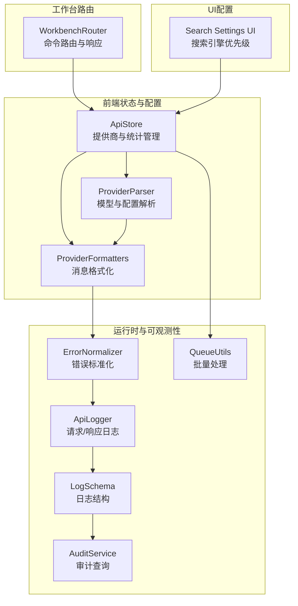
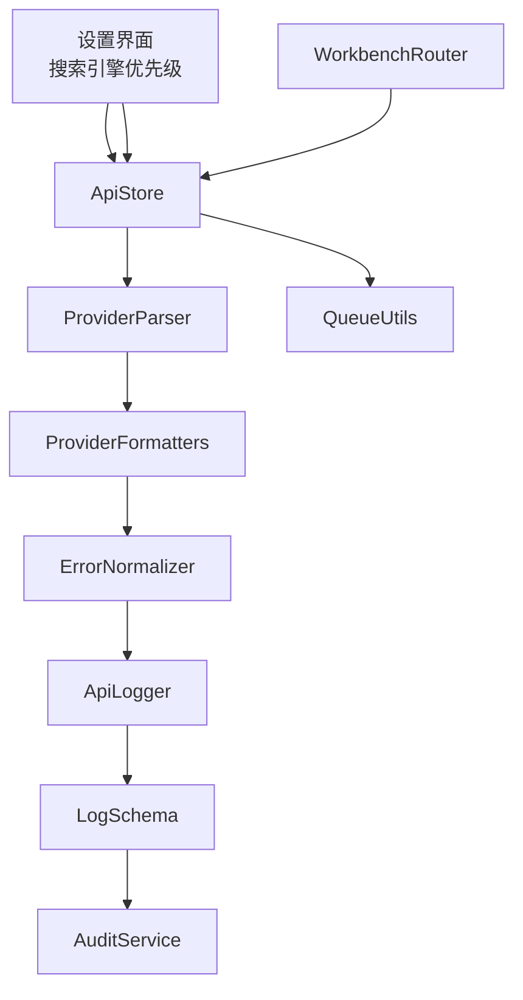
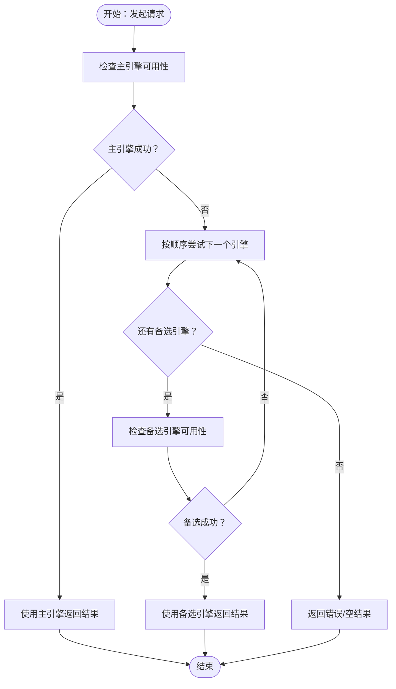
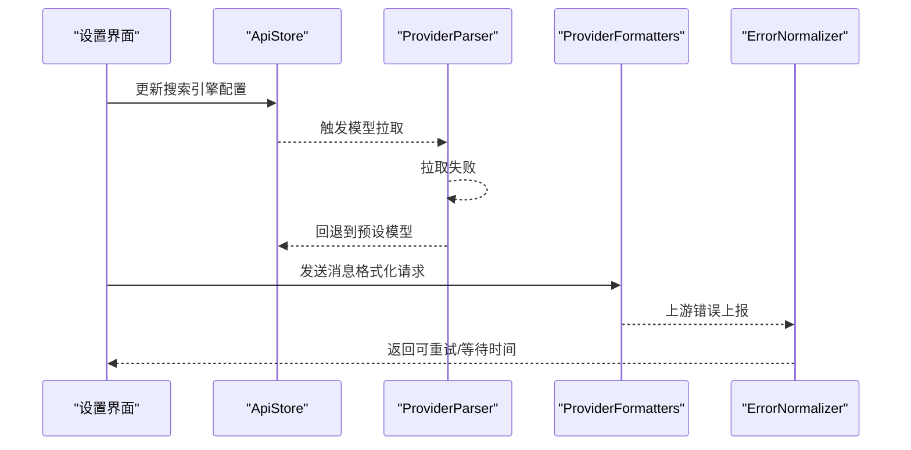
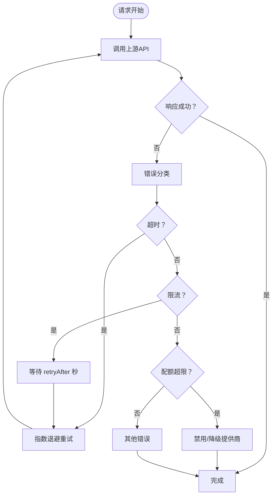
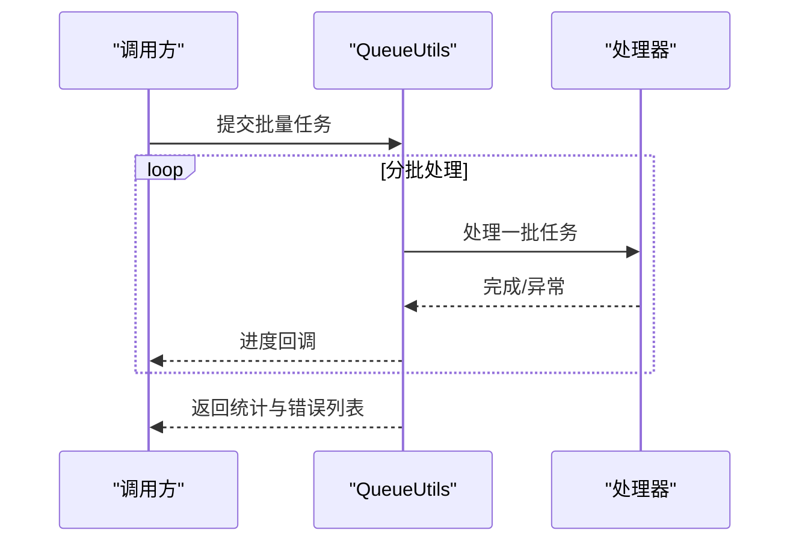
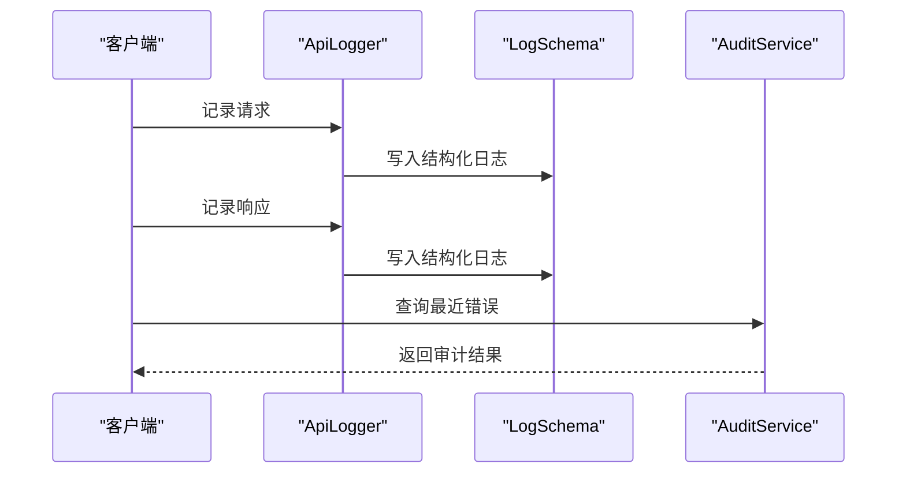
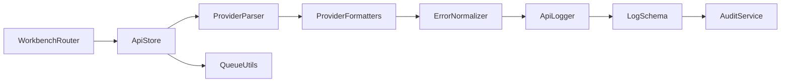

# 请求路由策略

<cite>
**本文引用的文件**
- [src/store/api-store.ts](file://src/store/api-store.ts)
- [src/lib/provider-parser.ts](file://src/lib/provider-parser.ts)
- [src/lib/llm/formatters/provider-formatters.ts](file://src/lib/llm/formatters/provider-formatters.ts)
- [src/lib/llm/error-normalizer.ts](file://src/lib/llm/error-normalizer.ts)
- [src/lib/llm/api-logger.ts](file://src/lib/llm/api-logger.ts)
- [src/lib/logging/LogSchema.ts](file://src/lib/logging/LogSchema.ts)
- [src/lib/services/audit-service.ts](file://src/lib/services/audit-service.ts)
- [src/lib/queue-utils.ts](file://src/lib/queue-utils.ts)
- [src/services/workbench/WorkbenchRouter.ts](file://src/services/workbench/WorkbenchRouter.ts)
- [app/settings/search.tsx](file://app/settings/search.tsx)
</cite>

## 目录
1. [简介](#简介)
2. [项目结构](#项目结构)
3. [核心组件](#核心组件)
4. [架构总览](#架构总览)
5. [详细组件分析](#详细组件分析)
6. [依赖关系分析](#依赖关系分析)
7. [性能考量](#性能考量)
8. [故障排查指南](#故障排查指南)
9. [结论](#结论)
10. [附录](#附录)

## 简介
本技术文档围绕“请求路由策略”展开，系统阐述多提供商请求分发机制的设计与实现要点，涵盖负载均衡与故障转移、请求优先级与备用提供商选择、自动切换、超时与重试、熔断与节流、并发控制与队列管理、以及日志记录、性能监控与统计分析。文档同时给出配置项与动态调整策略，帮助读者在理解现有实现的基础上进行扩展与优化。

## 项目结构
本项目在前端侧通过状态存储集中管理提供商配置与统计信息，并结合消息格式化器、错误标准化器与日志记录器形成完整的请求路由与可观测性闭环；在工作台侧通过路由器对命令进行路由与响应封装，便于扩展到更复杂的请求-响应编排场景。

**图表来源**
- [src/store/api-store.ts:1-161](file://src/store/api-store.ts#L1-L161)
- [src/lib/provider-parser.ts:1-233](file://src/lib/provider-parser.ts#L1-L233)
- [src/lib/llm/formatters/provider-formatters.ts:1-323](file://src/lib/llm/formatters/provider-formatters.ts#L1-L323)
- [src/lib/llm/error-normalizer.ts:1-249](file://src/lib/llm/error-normalizer.ts#L1-L249)
- [src/lib/llm/api-logger.ts:1-59](file://src/lib/llm/api-logger.ts#L1-L59)
- [src/lib/logging/LogSchema.ts:1-42](file://src/lib/logging/LogSchema.ts#L1-L42)
- [src/lib/services/audit-service.ts:99-147](file://src/lib/services/audit-service.ts#L99-L147)
- [src/lib/queue-utils.ts:1-49](file://src/lib/queue-utils.ts#L1-L49)
- [src/services/workbench/WorkbenchRouter.ts:1-75](file://src/services/workbench/WorkbenchRouter.ts#L1-L75)
- [app/settings/search.tsx:241-269](file://app/settings/search.tsx#L241-L269)

**章节来源**
- [src/store/api-store.ts:1-161](file://src/store/api-store.ts#L1-L161)
- [src/lib/provider-parser.ts:1-233](file://src/lib/provider-parser.ts#L1-L233)
- [src/lib/llm/formatters/provider-formatters.ts:1-323](file://src/lib/llm/formatters/provider-formatters.ts#L1-L323)
- [src/lib/llm/error-normalizer.ts:1-249](file://src/lib/llm/error-normalizer.ts#L1-L249)
- [src/lib/llm/api-logger.ts:1-59](file://src/lib/llm/api-logger.ts#L1-L59)
- [src/lib/logging/LogSchema.ts:1-42](file://src/lib/logging/LogSchema.ts#L1-L42)
- [src/lib/services/audit-service.ts:99-147](file://src/lib/services/audit-service.ts#L99-L147)
- [src/lib/queue-utils.ts:1-49](file://src/lib/queue-utils.ts#L1-L49)
- [src/services/workbench/WorkbenchRouter.ts:1-75](file://src/services/workbench/WorkbenchRouter.ts#L1-L75)
- [app/settings/search.tsx:241-269](file://app/settings/search.tsx#L241-L269)

## 核心组件
- 提供商与统计管理（ApiStore）
  - 统一维护提供商列表、启用状态、模型启用映射与全局令牌统计，支持持久化与部分序列化。
  - 提供搜索引擎配置（引擎类型、顺序、结果数量及各引擎密钥/地址），用于多引擎搜索的优先级与回退策略。
- 提供商解析与模型获取（ProviderParser）
  - 解析特殊服务商配置（如 VertexAI 服务账号），并根据类型拉取或回退预设模型清单，保证模型可用性。
- 消息格式化（ProviderFormatters）
  - 针对不同提供商的消息格式差异进行历史消息转换与系统提示增强，确保下游兼容性与稳定性。
- 错误标准化（ErrorNormalizer）
  - 将网络、鉴权、限流、配额、超时等错误归一化为统一结构，提供可重试标记与等待时间，支撑自动重试与熔断决策。
- 请求日志（ApiLogger + LogSchema + AuditService）
  - 记录请求/响应元数据，统一日志结构，支持按会话检索与最近错误查询，辅助定位与审计。
- 批量处理与队列（QueueUtils）
  - 在不阻塞主线程的前提下分批处理大量任务，提供进度回调与错误聚合，保障 UI 流畅与可观测性。
- 工作台路由（WorkbenchRouter）
  - 将命令按类型路由至处理器，统一响应与错误包装，便于扩展到更复杂的请求-响应编排场景。

**章节来源**
- [src/store/api-store.ts:1-161](file://src/store/api-store.ts#L1-L161)
- [src/lib/provider-parser.ts:1-233](file://src/lib/provider-parser.ts#L1-L233)
- [src/lib/llm/formatters/provider-formatters.ts:1-323](file://src/lib/llm/formatters/provider-formatters.ts#L1-L323)
- [src/lib/llm/error-normalizer.ts:1-249](file://src/lib/llm/error-normalizer.ts#L1-L249)
- [src/lib/llm/api-logger.ts:1-59](file://src/lib/llm/api-logger.ts#L1-L59)
- [src/lib/logging/LogSchema.ts:1-42](file://src/lib/logging/LogSchema.ts#L1-L42)
- [src/lib/services/audit-service.ts:99-147](file://src/lib/services/audit-service.ts#L99-L147)
- [src/lib/queue-utils.ts:1-49](file://src/lib/queue-utils.ts#L1-L49)
- [src/services/workbench/WorkbenchRouter.ts:1-75](file://src/services/workbench/WorkbenchRouter.ts#L1-L75)

## 架构总览
下图展示了请求路由策略在系统中的位置与交互关系：前端状态驱动提供商选择与模型格式化，错误标准化与日志记录贯穿请求生命周期，审计服务提供查询能力，批量工具保障后台任务的可控执行，工作台路由为命令式交互提供统一入口。

**图表来源**
- [src/store/api-store.ts:1-161](file://src/store/api-store.ts#L1-L161)
- [src/lib/provider-parser.ts:1-233](file://src/lib/provider-parser.ts#L1-L233)
- [src/lib/llm/formatters/provider-formatters.ts:1-323](file://src/lib/llm/formatters/provider-formatters.ts#L1-L323)
- [src/lib/llm/error-normalizer.ts:1-249](file://src/lib/llm/error-normalizer.ts#L1-L249)
- [src/lib/llm/api-logger.ts:1-59](file://src/lib/llm/api-logger.ts#L1-L59)
- [src/lib/logging/LogSchema.ts:1-42](file://src/lib/logging/LogSchema.ts#L1-L42)
- [src/lib/services/audit-service.ts:99-147](file://src/lib/services/audit-service.ts#L99-L147)
- [src/lib/queue-utils.ts:1-49](file://src/lib/queue-utils.ts#L1-L49)
- [src/services/workbench/WorkbenchRouter.ts:1-75](file://src/services/workbench/WorkbenchRouter.ts#L1-L75)
- [app/settings/search.tsx:241-269](file://app/settings/search.tsx#L241-L269)

## 详细组件分析

### 负载均衡与故障转移策略
- 多引擎搜索优先级与回退
  - 通过搜索引擎配置中的引擎顺序与最大结果数，实现“主备引擎”的优先级与回退策略。UI 支持长按调整引擎顺序，直接影响回退优先级。
  - 当主引擎返回异常或无结果时，系统可基于配置顺序依次尝试备选引擎，从而实现故障转移。
- 提供商选择与模型启用映射
  - ApiStore 维护提供商启用状态与模型启用映射，结合 ProviderParser 的模型拉取/回退逻辑，确保在上游不可用时自动切换到可用提供商或预设模型。

**图表来源**
- [src/store/api-store.ts:14-26](file://src/store/api-store.ts#L14-L26)
- [app/settings/search.tsx:241-269](file://app/settings/search.tsx#L241-L269)

**章节来源**
- [src/store/api-store.ts:14-26](file://src/store/api-store.ts#L14-L26)
- [app/settings/search.tsx:241-269](file://app/settings/search.tsx#L241-L269)

### 请求优先级设置与备用提供商选择
- 引擎优先级
  - UI 中的长按拖动功能允许用户将高优先级引擎移动到左侧，从而提升其在回退链中的优先级。
- 提供商优先级
  - 在多提供商场景下，可通过提供商启用状态与模型启用映射实现“优先使用启用且模型可用”的策略，必要时回退到其他提供商或预设模型。

**章节来源**
- [app/settings/search.tsx:241-269](file://app/settings/search.tsx#L241-L269)
- [src/store/api-store.ts:97-123](file://src/store/api-store.ts#L97-L123)
- [src/lib/provider-parser.ts:195-214](file://src/lib/provider-parser.ts#L195-L214)

### 自动切换机制
- 模型拉取失败回退
  - 当上游模型列表拉取失败时，自动回退到预设模型集合，保证系统可用性。
- 错误分类与重试建议
  - ErrorNormalizer 将错误归类并提供 retryAfter 等信息，为自动切换与重试提供依据。

**图表来源**
- [src/store/api-store.ts:14-26](file://src/store/api-store.ts#L14-L26)
- [src/lib/provider-parser.ts:151-156](file://src/lib/provider-parser.ts#L151-L156)
- [src/lib/llm/formatters/provider-formatters.ts:1-323](file://src/lib/llm/formatters/provider-formatters.ts#L1-L323)
- [src/lib/llm/error-normalizer.ts:40-95](file://src/lib/llm/error-normalizer.ts#L40-L95)

**章节来源**
- [src/lib/provider-parser.ts:151-156](file://src/lib/provider-parser.ts#L151-L156)
- [src/lib/llm/error-normalizer.ts:40-95](file://src/lib/llm/error-normalizer.ts#L40-L95)

### 请求超时处理、重试策略与熔断器模式
- 错误分类与重试
  - ErrorNormalizer 对超时、限流、配额等错误进行分类，并提供 retryable 与 retryAfter 字段，指导上层进行指数退避重试或等待。
- 熔断与节流
  - 虽未见显式熔断器实现，但限流错误可结合 retryAfter 进行“被动熔断”（等待后再试）。对于持续失败的提供商，可通过禁用或降低优先级实现“主动熔断”。

**图表来源**
- [src/lib/llm/error-normalizer.ts:40-95](file://src/lib/llm/error-normalizer.ts#L40-L95)
- [src/lib/llm/error-normalizer.ts:197-230](file://src/lib/llm/error-normalizer.ts#L197-L230)

**章节来源**
- [src/lib/llm/error-normalizer.ts:40-95](file://src/lib/llm/error-normalizer.ts#L40-L95)
- [src/lib/llm/error-normalizer.ts:197-230](file://src/lib/llm/error-normalizer.ts#L197-L230)

### 并发请求控制、队列管理与资源限制
- 批量任务分批处理
  - QueueUtils 提供分批与延迟机制，避免一次性处理过多任务导致 UI 卡顿；支持进度回调与错误聚合，便于监控与恢复。
- 工作台命令路由
  - WorkbenchRouter 对命令进行注册与处理，统一响应与错误包装，适合在受限资源环境下进行有序的任务编排。

**图表来源**
- [src/lib/queue-utils.ts:5-49](file://src/lib/queue-utils.ts#L5-L49)
- [src/services/workbench/WorkbenchRouter.ts:21-71](file://src/services/workbench/WorkbenchRouter.ts#L21-L71)

**章节来源**
- [src/lib/queue-utils.ts:5-49](file://src/lib/queue-utils.ts#L5-L49)
- [src/services/workbench/WorkbenchRouter.ts:21-71](file://src/services/workbench/WorkbenchRouter.ts#L21-L71)

### 请求日志记录、性能监控与统计分析
- 请求/响应日志
  - ApiLogger 记录请求与响应元数据，统一使用 Logger 实例，便于与全局日志体系集成。
- 日志结构与审计
  - LogSchema 定义结构化日志条目，AuditService 提供按会话、时间范围与动作过滤的查询接口，支持最近错误检索。
- 统计与令牌使用
  - ApiStore 维护全局令牌统计（输入/输出/总计）与最后使用时间，可用于性能监控与成本分析。

**图表来源**
- [src/lib/llm/api-logger.ts:23-43](file://src/lib/llm/api-logger.ts#L23-L43)
- [src/lib/logging/LogSchema.ts:14-29](file://src/lib/logging/LogSchema.ts#L14-L29)
- [src/lib/services/audit-service.ts:137-147](file://src/lib/services/audit-service.ts#L137-L147)
- [src/store/api-store.ts:125-136](file://src/store/api-store.ts#L125-L136)

**章节来源**
- [src/lib/llm/api-logger.ts:23-43](file://src/lib/llm/api-logger.ts#L23-L43)
- [src/lib/logging/LogSchema.ts:14-29](file://src/lib/logging/LogSchema.ts#L14-L29)
- [src/lib/services/audit-service.ts:137-147](file://src/lib/services/audit-service.ts#L137-L147)
- [src/store/api-store.ts:125-136](file://src/store/api-store.ts#L125-L136)

### 配置选项与动态调整策略
- 搜索引擎配置
  - 包括默认引擎、引擎顺序、最大结果数，以及各引擎的密钥/地址配置。UI 支持动态调整顺序，影响回退优先级。
- 提供商与模型配置
  - 支持添加、更新、删除提供商，切换启用状态，以及模型级别的启用/禁用同步。
- 动态调整
  - 通过设置界面与状态存储的联动，可在不重启应用的情况下调整优先级与启用状态，实现快速的策略变更。

**章节来源**
- [src/store/api-store.ts:14-26](file://src/store/api-store.ts#L14-L26)
- [src/store/api-store.ts:62-87](file://src/store/api-store.ts#L62-L87)
- [src/store/api-store.ts:97-123](file://src/store/api-store.ts#L97-L123)
- [app/settings/search.tsx:241-269](file://app/settings/search.tsx#L241-L269)

## 依赖关系分析
- 组件耦合
  - ApiStore 是核心枢纽，向上游提供解析与格式化能力，向下承载日志与审计能力，耦合度适中。
  - ProviderParser 与 ProviderFormatters 之间存在使用关系，前者负责模型可用性保障，后者负责格式兼容。
  - ErrorNormalizer 与 ApiLogger 形成“错误-日志”闭环，支撑可观测性。
- 外部依赖
  - Async Storage 用于持久化 ApiStore 状态。
  - Logger 与数据库查询用于审计与日志存储。

**图表来源**
- [src/store/api-store.ts:1-161](file://src/store/api-store.ts#L1-L161)
- [src/lib/provider-parser.ts:1-233](file://src/lib/provider-parser.ts#L1-L233)
- [src/lib/llm/formatters/provider-formatters.ts:1-323](file://src/lib/llm/formatters/provider-formatters.ts#L1-L323)
- [src/lib/llm/error-normalizer.ts:1-249](file://src/lib/llm/error-normalizer.ts#L1-L249)
- [src/lib/llm/api-logger.ts:1-59](file://src/lib/llm/api-logger.ts#L1-L59)
- [src/lib/logging/LogSchema.ts:1-42](file://src/lib/logging/LogSchema.ts#L1-L42)
- [src/lib/services/audit-service.ts:99-147](file://src/lib/services/audit-service.ts#L99-L147)
- [src/lib/queue-utils.ts:1-49](file://src/lib/queue-utils.ts#L1-L49)
- [src/services/workbench/WorkbenchRouter.ts:1-75](file://src/services/workbench/WorkbenchRouter.ts#L1-L75)

**章节来源**
- [src/store/api-store.ts:1-161](file://src/store/api-store.ts#L1-L161)
- [src/lib/provider-parser.ts:1-233](file://src/lib/provider-parser.ts#L1-L233)
- [src/lib/llm/formatters/provider-formatters.ts:1-323](file://src/lib/llm/formatters/provider-formatters.ts#L1-L323)
- [src/lib/llm/error-normalizer.ts:1-249](file://src/lib/llm/error-normalizer.ts#L1-L249)
- [src/lib/llm/api-logger.ts:1-59](file://src/lib/llm/api-logger.ts#L1-L59)
- [src/lib/logging/LogSchema.ts:1-42](file://src/lib/logging/LogSchema.ts#L1-L42)
- [src/lib/services/audit-service.ts:99-147](file://src/lib/services/audit-service.ts#L99-L147)
- [src/lib/queue-utils.ts:1-49](file://src/lib/queue-utils.ts#L1-L49)
- [src/services/workbench/WorkbenchRouter.ts:1-75](file://src/services/workbench/WorkbenchRouter.ts#L1-L75)

## 性能考量
- UI 线程保护
  - 使用分批与延迟机制处理大批量任务，避免阻塞主线程，保持交互流畅。
- 日志与审计开销
  - 结构化日志与审计查询应结合采样与限流策略，避免高频写入造成性能瓶颈。
- 模型拉取与回退
  - 在网络不稳定时优先使用预设模型，减少失败重试次数，提高整体吞吐。

[本节为通用性能建议，不直接分析具体文件]

## 故障排查指南
- 定位最近错误
  - 使用审计服务按会话或时间范围查询最近错误，结合日志条目定位问题根因。
- 错误分类与处理
  - 根据 ErrorNormalizer 的分类结果采取相应措施：超时重试、等待限流、禁用配额耗尽提供商。
- 日志核对
  - 通过 ApiLogger 记录的请求/响应元数据核对下游行为，确认格式化与路由是否正确。

**章节来源**
- [src/lib/services/audit-service.ts:137-147](file://src/lib/services/audit-service.ts#L137-L147)
- [src/lib/llm/error-normalizer.ts:40-95](file://src/lib/llm/error-normalizer.ts#L40-L95)
- [src/lib/llm/api-logger.ts:23-43](file://src/lib/llm/api-logger.ts#L23-L43)

## 结论
本项目在前端侧通过状态存储、解析与格式化、错误标准化与日志审计构建了完善的请求路由与可观测性体系。多引擎搜索与提供商回退策略提供了稳健的故障转移能力；批量处理与路由机制保障了并发与有序执行；日志与审计接口则为性能监控与问题定位提供了坚实基础。未来可在现有基础上引入显式熔断器、动态权重与更细粒度的资源配额控制，以进一步提升系统的弹性与可运维性。

## 附录
- 关键流程参考路径
  - 负载均衡与回退流程：[src/store/api-store.ts:14-26](file://src/store/api-store.ts#L14-L26)，[app/settings/search.tsx:241-269](file://app/settings/search.tsx#L241-L269)
  - 错误分类与重试：[src/lib/llm/error-normalizer.ts:40-95](file://src/lib/llm/error-normalizer.ts#L40-L95)，[src/lib/llm/error-normalizer.ts:197-230](file://src/lib/llm/error-normalizer.ts#L197-L230)
  - 日志与审计：[src/lib/llm/api-logger.ts:23-43](file://src/lib/llm/api-logger.ts#L23-L43)，[src/lib/logging/LogSchema.ts:14-29](file://src/lib/logging/LogSchema.ts#L14-L29)，[src/lib/services/audit-service.ts:137-147](file://src/lib/services/audit-service.ts#L137-L147)
  - 并发与队列：[src/lib/queue-utils.ts:5-49](file://src/lib/queue-utils.ts#L5-L49)，[src/services/workbench/WorkbenchRouter.ts:21-71](file://src/services/workbench/WorkbenchRouter.ts#L21-L71)