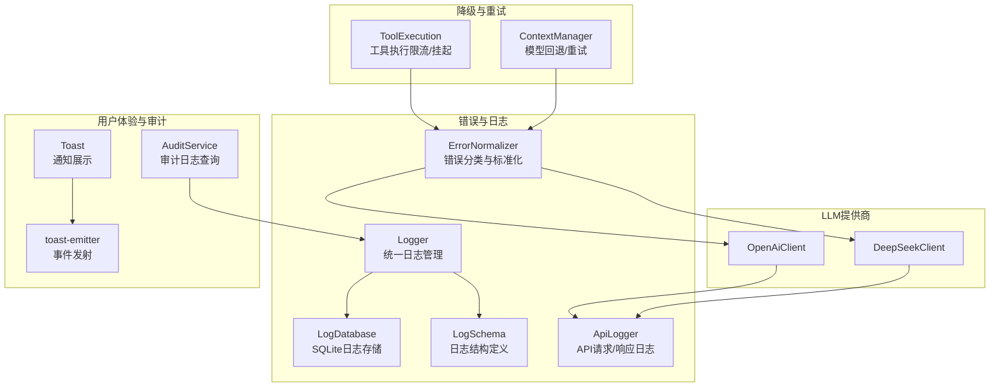
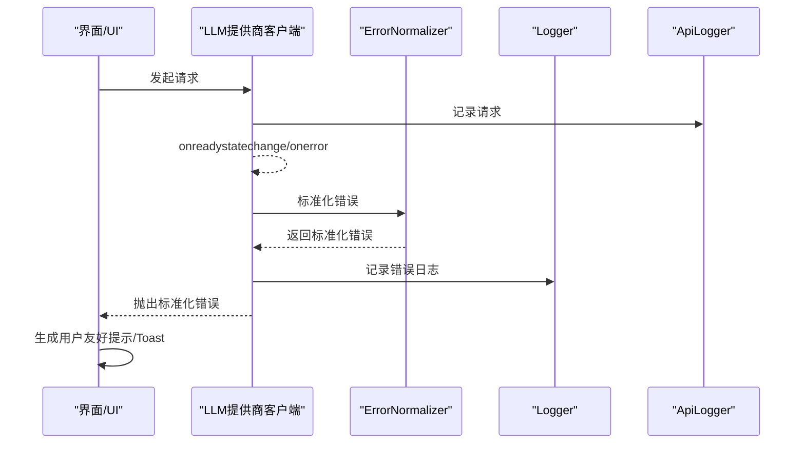
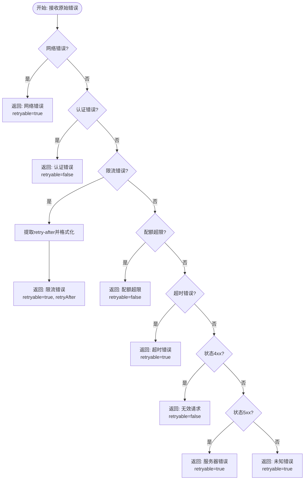
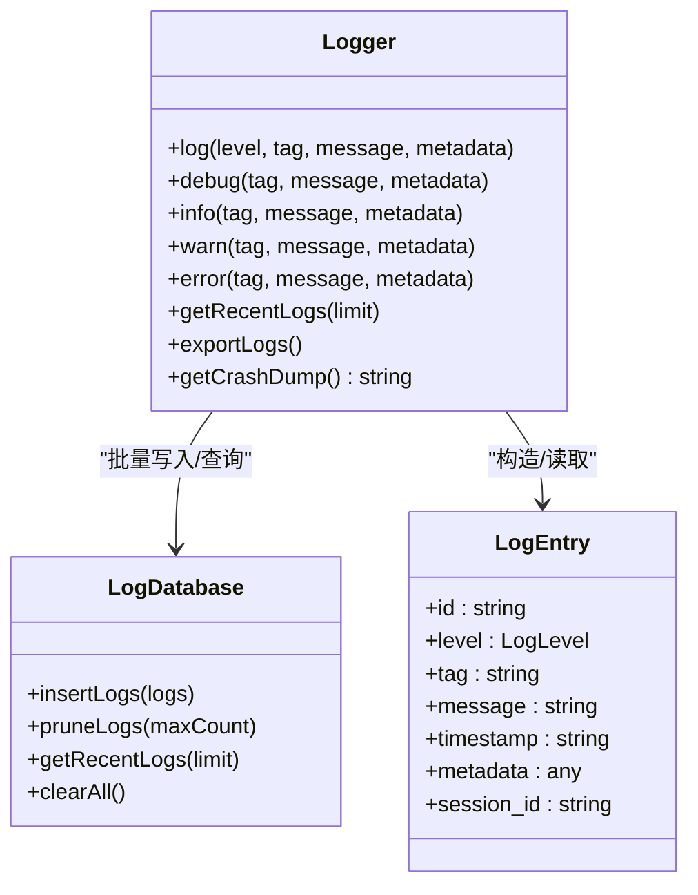
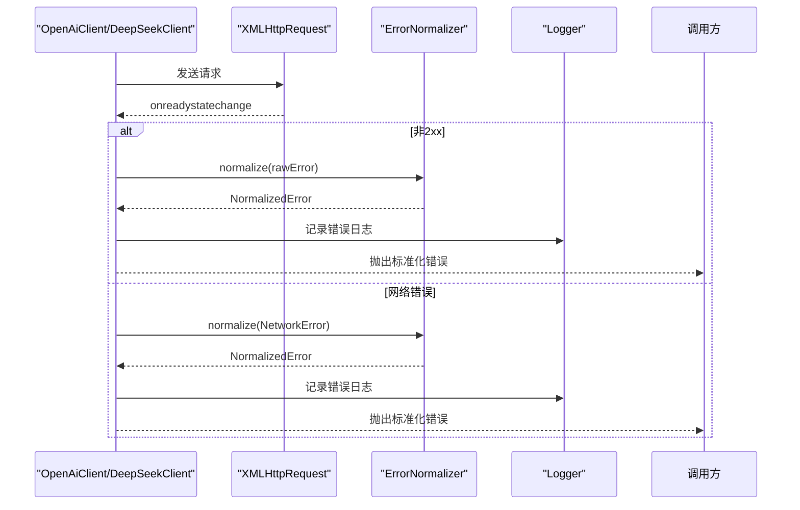
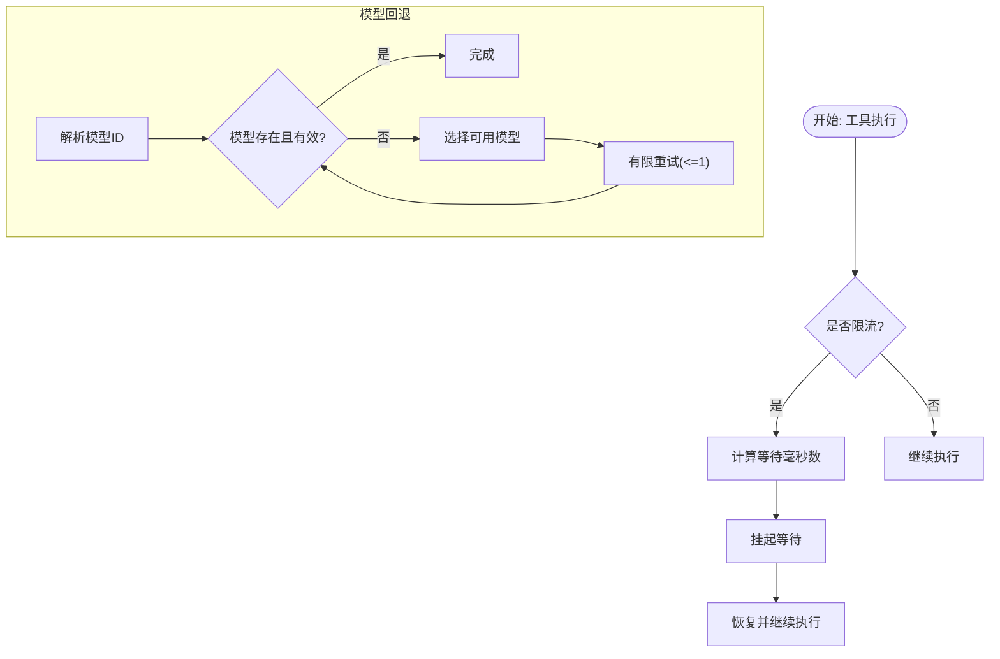
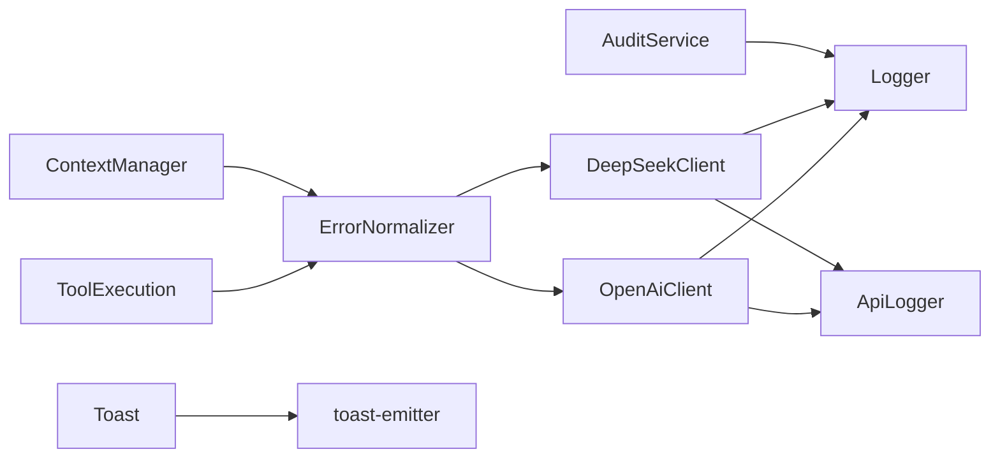

# 错误处理与降级

<cite>
**本文引用的文件**
- [error-normalizer.ts](file://src/lib/llm/error-normalizer.ts)
- [Logger.ts](file://src/lib/logging/Logger.ts)
- [LogDatabase.ts](file://src/lib/logging/LogDatabase.ts)
- [LogSchema.ts](file://src/lib/logging/LogSchema.ts)
- [api-logger.ts](file://src/lib/llm/api-logger.ts)
- [openai.ts](file://src/lib/llm/providers/openai.ts)
- [deepseek.ts](file://src/lib/llm/providers/deepseek.ts)
- [tool-execution.ts](file://src/store/chat/tool-execution.ts)
- [Toast.tsx](file://src/components/ui/Toast.tsx)
- [toast-emitter.ts](file://src/lib/utils/toast-emitter.ts)
- [ContextManager.ts](file://src/features/chat/utils/ContextManager.ts)
- [audit-service.ts](file://src/lib/services/audit-service.ts)
</cite>

## 目录
1. [简介](#简介)
2. [项目结构](#项目结构)
3. [核心组件](#核心组件)
4. [架构总览](#架构总览)
5. [详细组件分析](#详细组件分析)
6. [依赖关系分析](#依赖关系分析)
7. [性能考量](#性能考量)
8. [故障排查指南](#故障排查指南)
9. [结论](#结论)
10. [附录](#附录)

## 简介
本文件聚焦于多提供商环境下的错误处理与自动降级策略，覆盖网络错误、API错误、认证失败、限流、配额超限、超时以及未知错误的分类与标准化；解释错误码映射与用户友好提示生成；阐述自动降级（备用提供商切换、功能降级与回退）、重试策略（指数退避、最大重试次数）与告警监控；并提供用户体验优化与故障恢复的最佳实践。

## 项目结构
围绕错误处理与降级的关键目录与文件如下：
- 错误标准化与日志
  - 错误分类与标准化：src/lib/llm/error-normalizer.ts
  - 统一日志系统：src/lib/logging/Logger.ts、LogDatabase.ts、LogSchema.ts
  - API请求/响应日志：src/lib/llm/api-logger.ts
- 多提供商LLM客户端
  - OpenAI兼容客户端：src/lib/llm/providers/openai.ts
  - DeepSeek客户端：src/lib/llm/providers/deepseek.ts
- 降级与重试
  - 工具执行限流与挂起：src/store/chat/tool-execution.ts
  - 上下文模型回退与重试：src/features/chat/utils/ContextManager.ts
- 用户体验与告警
  - Toast通知与事件发射：src/components/ui/Toast.tsx、src/lib/utils/toast-emitter.ts
  - 审计日志查询与错误统计：src/lib/services/audit-service.ts

**图表来源**
- [error-normalizer.ts:1-250](file://src/lib/llm/error-normalizer.ts#L1-L250)
- [Logger.ts:1-280](file://src/lib/logging/Logger.ts#L1-L280)
- [LogDatabase.ts:1-132](file://src/lib/logging/LogDatabase.ts#L1-L132)
- [LogSchema.ts:1-43](file://src/lib/logging/LogSchema.ts#L1-L43)
- [api-logger.ts:1-60](file://src/lib/llm/api-logger.ts#L1-L60)
- [openai.ts:1-749](file://src/lib/llm/providers/openai.ts#L1-L749)
- [deepseek.ts:1-763](file://src/lib/llm/providers/deepseek.ts#L1-L763)
- [tool-execution.ts:207-234](file://src/store/chat/tool-execution.ts#L207-L234)
- [ContextManager.ts:234-257](file://src/features/chat/utils/ContextManager.ts#L234-L257)
- [Toast.tsx:1-109](file://src/components/ui/Toast.tsx#L1-L109)
- [toast-emitter.ts:1-14](file://src/lib/utils/toast-emitter.ts#L1-L14)
- [audit-service.ts:99-147](file://src/lib/services/audit-service.ts#L99-L147)

**章节来源**
- [error-normalizer.ts:1-250](file://src/lib/llm/error-normalizer.ts#L1-L250)
- [Logger.ts:1-280](file://src/lib/logging/Logger.ts#L1-L280)
- [LogDatabase.ts:1-132](file://src/lib/logging/LogDatabase.ts#L1-L132)
- [LogSchema.ts:1-43](file://src/lib/logging/LogSchema.ts#L1-L43)
- [api-logger.ts:1-60](file://src/lib/llm/api-logger.ts#L1-L60)
- [openai.ts:1-749](file://src/lib/llm/providers/openai.ts#L1-L749)
- [deepseek.ts:1-763](file://src/lib/llm/providers/deepseek.ts#L1-L763)
- [tool-execution.ts:207-234](file://src/store/chat/tool-execution.ts#L207-L234)
- [ContextManager.ts:234-257](file://src/features/chat/utils/ContextManager.ts#L234-L257)
- [Toast.tsx:1-109](file://src/components/ui/Toast.tsx#L1-L109)
- [toast-emitter.ts:1-14](file://src/lib/utils/toast-emitter.ts#L1-L14)
- [audit-service.ts:99-147](file://src/lib/services/audit-service.ts#L99-L147)

## 核心组件
- 错误分类与标准化
  - 错误类别：网络、认证、限流、无效请求、服务器错误、配额超限、超时、未知
  - 标准化输出：category、message（用户友好）、technicalMessage（技术信息）、retryable、retryAfter（秒）
  - 标准化器：根据状态码、消息关键字、超时条件、配额关键词等进行判定，并提取retry-after
- 统一日志系统
  - 环形缓冲区保存最近日志，支持批量写入SQLite，按级别与会话ID组织
  - 支持导出日志、清理旧日志、防抖批量写入、写入锁避免并发冲突
- API请求/响应日志
  - 包装统一日志系统，记录请求与响应，便于调试
- LLM提供商客户端
  - OpenAI/DeepSeek客户端在onreadystatechange与onerror中捕获错误，统一调用ErrorNormalizer标准化后抛出
- 降级与重试
  - 工具执行遇到限流时挂起等待指定毫秒数，恢复后继续
  - 上下文模型解析过程中对模型ID进行回退与有限重试
- 用户体验与告警
  - Toast通知与事件发射器，结合审计服务查询最近错误日志

**章节来源**
- [error-normalizer.ts:1-250](file://src/lib/llm/error-normalizer.ts#L1-L250)
- [Logger.ts:1-280](file://src/lib/logging/Logger.ts#L1-L280)
- [LogDatabase.ts:1-132](file://src/lib/logging/LogDatabase.ts#L1-L132)
- [LogSchema.ts:1-43](file://src/lib/logging/LogSchema.ts#L1-L43)
- [api-logger.ts:1-60](file://src/lib/llm/api-logger.ts#L1-L60)
- [openai.ts:376-385](file://src/lib/llm/providers/openai.ts#L376-L385)
- [deepseek.ts:433-442](file://src/lib/llm/providers/deepseek.ts#L433-L442)
- [tool-execution.ts:207-234](file://src/store/chat/tool-execution.ts#L207-L234)
- [ContextManager.ts:234-257](file://src/features/chat/utils/ContextManager.ts#L234-L257)
- [Toast.tsx:1-109](file://src/components/ui/Toast.tsx#L1-L109)
- [toast-emitter.ts:1-14](file://src/lib/utils/toast-emitter.ts#L1-L14)
- [audit-service.ts:99-147](file://src/lib/services/audit-service.ts#L99-L147)

## 架构总览
多提供商环境下的错误处理与降级流程如下：

**图表来源**
- [openai.ts:376-385](file://src/lib/llm/providers/openai.ts#L376-L385)
- [deepseek.ts:433-442](file://src/lib/llm/providers/deepseek.ts#L433-L442)
- [error-normalizer.ts:40-124](file://src/lib/llm/error-normalizer.ts#L40-L124)
- [Logger.ts:74-130](file://src/lib/logging/Logger.ts#L74-L130)
- [api-logger.ts:23-43](file://src/lib/llm/api-logger.ts#L23-L43)

## 详细组件分析

### 错误分类与标准化（ErrorNormalizer）
- 分类依据
  - 网络错误：基于消息包含、错误名称/代码匹配
  - 认证错误：401/403或包含相关关键字
  - 限流错误：429或包含相关关键字，提取retry-after
  - 配额超限：包含配额/限制/账单相关关键字
  - 超时错误：包含timeout/ETIMEDOUT或TimeoutError
  - 4xx/5xx：分别映射为无效请求/服务器错误
  - 未知：兜底
- 输出结构
  - category、message、technicalMessage、retryable、retryAfter（秒）

**图表来源**
- [error-normalizer.ts:40-124](file://src/lib/llm/error-normalizer.ts#L40-L124)
- [error-normalizer.ts:129-192](file://src/lib/llm/error-normalizer.ts#L129-L192)
- [error-normalizer.ts:197-248](file://src/lib/llm/error-normalizer.ts#L197-L248)

**章节来源**
- [error-normalizer.ts:1-250](file://src/lib/llm/error-normalizer.ts#L1-L250)

### 统一日志系统（Logger/LogDatabase）
- 写入策略
  - 环形缓冲区：保留最近N条日志，用于崩溃回溯与UI展示
  - 待写入队列：普通日志批量写入，错误日志立即写入
  - 防抖与写入锁：定时器+布尔锁避免并发事务冲突
- 存储与查询
  - SQLite表结构：日志主键、级别、标签、消息、时间戳、元数据、会话ID
  - 清理策略：按数量上限裁剪
  - 查询：按时间倒序获取最近日志

**图表来源**
- [Logger.ts:18-280](file://src/lib/logging/Logger.ts#L18-L280)
- [LogDatabase.ts:10-132](file://src/lib/logging/LogDatabase.ts#L10-L132)
- [LogSchema.ts:14-43](file://src/lib/logging/LogSchema.ts#L14-L43)

**章节来源**
- [Logger.ts:1-280](file://src/lib/logging/Logger.ts#L1-L280)
- [LogDatabase.ts:1-132](file://src/lib/logging/LogDatabase.ts#L1-L132)
- [LogSchema.ts:1-43](file://src/lib/logging/LogSchema.ts#L1-L43)

### API请求/响应日志（ApiLogger）
- 包装Logger，记录请求与响应，便于调试与审计
- 兼容性：提供废弃方法与空实现，避免破坏现有调用

**章节来源**
- [api-logger.ts:1-60](file://src/lib/llm/api-logger.ts#L1-L60)

### LLM提供商客户端（OpenAI/DeepSeek）
- 错误捕获
  - onreadystatechange：非2xx时调用handleError
  - onerror：构造网络错误并标准化
- 标准化传递
  - 将category/retryable/retryAfter/technicalMessage附加到Error对象，供上层UI消费

**图表来源**
- [openai.ts:376-385](file://src/lib/llm/providers/openai.ts#L376-L385)
- [openai.ts:730-747](file://src/lib/llm/providers/openai.ts#L730-L747)
- [deepseek.ts:433-442](file://src/lib/llm/providers/deepseek.ts#L433-L442)
- [deepseek.ts:744-761](file://src/lib/llm/providers/deepseek.ts#L744-L761)
- [error-normalizer.ts:40-124](file://src/lib/llm/error-normalizer.ts#L40-L124)
- [Logger.ts:74-130](file://src/lib/logging/Logger.ts#L74-L130)

**章节来源**
- [openai.ts:1-749](file://src/lib/llm/providers/openai.ts#L1-L749)
- [deepseek.ts:1-763](file://src/lib/llm/providers/deepseek.ts#L1-L763)

### 自动降级与回退策略
- 工具执行限流与挂起
  - 当检测到限流等待时间大于0时，更新步骤为挂起状态并等待对应毫秒数，恢复后切换回常规调用状态
- 上下文模型回退与重试
  - 在解析模型ID过程中，若目标模型不存在或已知损坏，选择可用模型作为回退，并进行有限次重试

**图表来源**
- [tool-execution.ts:207-234](file://src/store/chat/tool-execution.ts#L207-L234)
- [ContextManager.ts:234-257](file://src/features/chat/utils/ContextManager.ts#L234-L257)

**章节来源**
- [tool-execution.ts:207-234](file://src/store/chat/tool-execution.ts#L207-L234)
- [ContextManager.ts:234-257](file://src/features/chat/utils/ContextManager.ts#L234-L257)

### 用户体验与告警（Toast与审计）
- Toast通知
  - 通过事件发射器接收全局toast事件，统一展示成功/错误/警告/信息类型通知
- 审计与错误查询
  - 审计服务支持按会话、动作、资源类型、时间范围查询日志，支持最近错误列表查询

**章节来源**
- [Toast.tsx:1-109](file://src/components/ui/Toast.tsx#L1-L109)
- [toast-emitter.ts:1-14](file://src/lib/utils/toast-emitter.ts#L1-L14)
- [audit-service.ts:99-147](file://src/lib/services/audit-service.ts#L99-L147)

## 依赖关系分析
- 错误标准化器被各LLM提供商客户端调用，统一错误语义
- 日志系统被ErrorNormalizer与ApiLogger调用，形成统一的错误与调试日志
- 工具执行与上下文管理在运行时根据标准化错误决定降级与重试策略
- Toast与审计服务为用户反馈与问题定位提供支撑

**图表来源**
- [error-normalizer.ts:40-124](file://src/lib/llm/error-normalizer.ts#L40-L124)
- [openai.ts:730-747](file://src/lib/llm/providers/openai.ts#L730-L747)
- [deepseek.ts:744-761](file://src/lib/llm/providers/deepseek.ts#L744-L761)
- [Logger.ts:74-130](file://src/lib/logging/Logger.ts#L74-L130)
- [api-logger.ts:23-43](file://src/lib/llm/api-logger.ts#L23-L43)
- [tool-execution.ts:207-234](file://src/store/chat/tool-execution.ts#L207-L234)
- [ContextManager.ts:234-257](file://src/features/chat/utils/ContextManager.ts#L234-L257)
- [Toast.tsx:50-61](file://src/components/ui/Toast.tsx#L50-L61)
- [toast-emitter.ts:10-14](file://src/lib/utils/toast-emitter.ts#L10-L14)
- [audit-service.ts:99-147](file://src/lib/services/audit-service.ts#L99-L147)

**章节来源**
- [error-normalizer.ts:1-250](file://src/lib/llm/error-normalizer.ts#L1-L250)
- [openai.ts:1-749](file://src/lib/llm/providers/openai.ts#L1-L749)
- [deepseek.ts:1-763](file://src/lib/llm/providers/deepseek.ts#L1-L763)
- [Logger.ts:1-280](file://src/lib/logging/Logger.ts#L1-L280)
- [api-logger.ts:1-60](file://src/lib/llm/api-logger.ts#L1-L60)
- [tool-execution.ts:207-234](file://src/store/chat/tool-execution.ts#L207-L234)
- [ContextManager.ts:234-257](file://src/features/chat/utils/ContextManager.ts#L234-L257)
- [Toast.tsx:1-109](file://src/components/ui/Toast.tsx#L1-L109)
- [toast-emitter.ts:1-14](file://src/lib/utils/toast-emitter.ts#L1-L14)
- [audit-service.ts:99-147](file://src/lib/services/audit-service.ts#L99-L147)

## 性能考量
- 日志写入批量化与防抖：减少SQLite写入频率，提升吞吐
- 写入锁与事务：避免并发写入导致的事务冲突与崩溃
- 环形缓冲区：降低内存占用，快速获取最近日志
- 错误日志即时写入：确保关键错误不丢失
- 客户端侧限流挂起：避免无意义重试，降低带宽与服务器压力

[本节为通用性能讨论，无需具体文件引用]

## 故障排查指南
- 快速定位
  - 使用审计服务查询最近错误日志，按会话/时间范围筛选
  - 通过日志系统导出最近日志，结合API请求/响应日志定位问题
- 常见场景
  - 网络错误：检查设备网络、代理与DNS；查看标准化错误retryable=true
  - 认证失败：核对API密钥有效性与权限；标准化错误retryable=false
  - 限流：遵循retry-after等待；必要时切换备用提供商或降级功能
  - 配额超限：升级套餐或等待周期；标准化错误retryable=false
  - 超时：增加超时阈值或重试；检查服务端健康状况
- 用户反馈
  - 使用Toast展示错误提示，结合触觉反馈增强感知
  - 对严重错误（ERROR级别）确保即时可见与可导出

**章节来源**
- [audit-service.ts:99-147](file://src/lib/services/audit-service.ts#L99-L147)
- [Logger.ts:239-277](file://src/lib/logging/Logger.ts#L239-L277)
- [api-logger.ts:23-43](file://src/lib/llm/api-logger.ts#L23-L43)
- [Toast.tsx:26-48](file://src/components/ui/Toast.tsx#L26-L48)

## 结论
该系统通过统一的错误分类与标准化、完善的日志与审计能力、以及在工具执行与模型解析层面的自动降级与回退策略，实现了多提供商环境下稳健的错误处理与用户体验保障。配合Toast与审计查询，能够快速定位问题并指导用户采取正确行动。建议在生产环境中持续完善重试策略参数化与告警联动，进一步提升稳定性与可观测性。

[本节为总结性内容，无需具体文件引用]

## 附录
- 错误分类与映射
  - 网络：网络相关错误，retryable=true
  - 认证：401/403或包含认证关键字，retryable=false
  - 限流：429或包含限流关键字，提取retry-after，retryable=true
  - 无效请求：4xx，retryable=false
  - 服务器错误：5xx，retryable=true
  - 配额超限：包含配额/账单关键字，retryable=false
  - 超时：timeout/ETIMEDOUT，retryable=true
  - 未知：兜底，retryable=true
- 用户友好提示生成
  - 根据category与retryAfter生成简洁明确的提示文案
  - 技术信息保留于technicalMessage，便于高级用户与支持人员查阅
- 重试策略建议
  - 指数退避：基础等待时间×2，上限至合理阈值
  - 最大重试次数：建议1~3次，结合retryAfter与业务影响评估
  - 限流场景：优先遵循retry-after，避免盲目重试
- 告警与监控
  - ERROR级别日志自动触发告警
  - 审计服务定期导出最近错误，纳入运维巡检

[本节为概念性附录，无需具体文件引用]