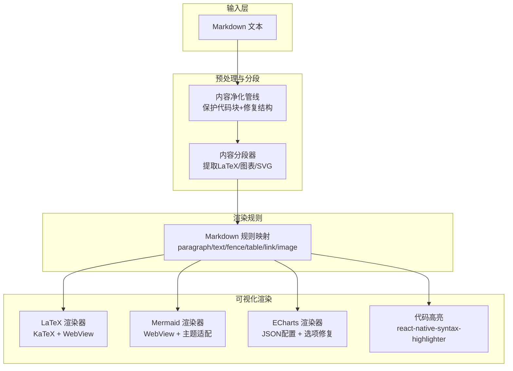
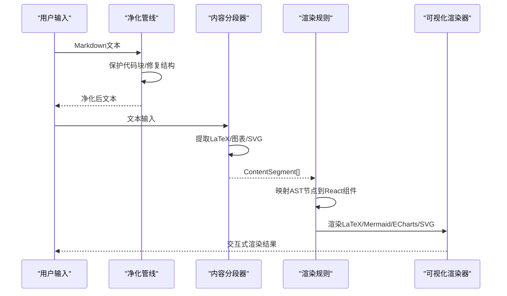
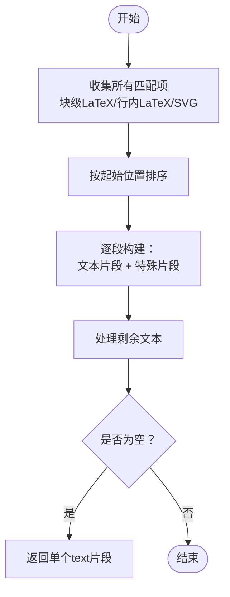
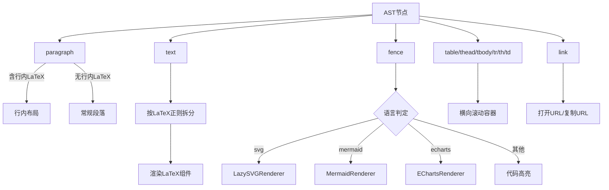
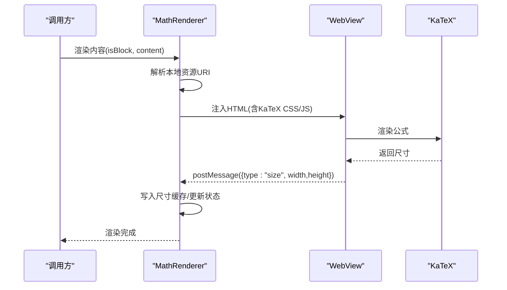
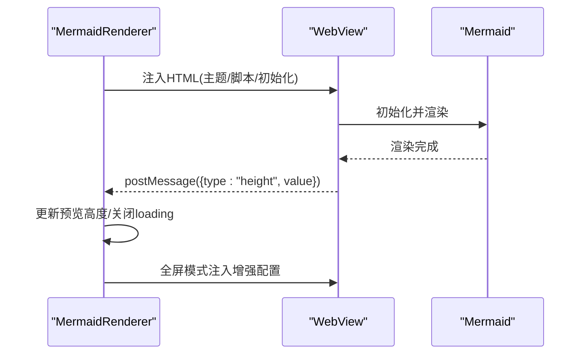
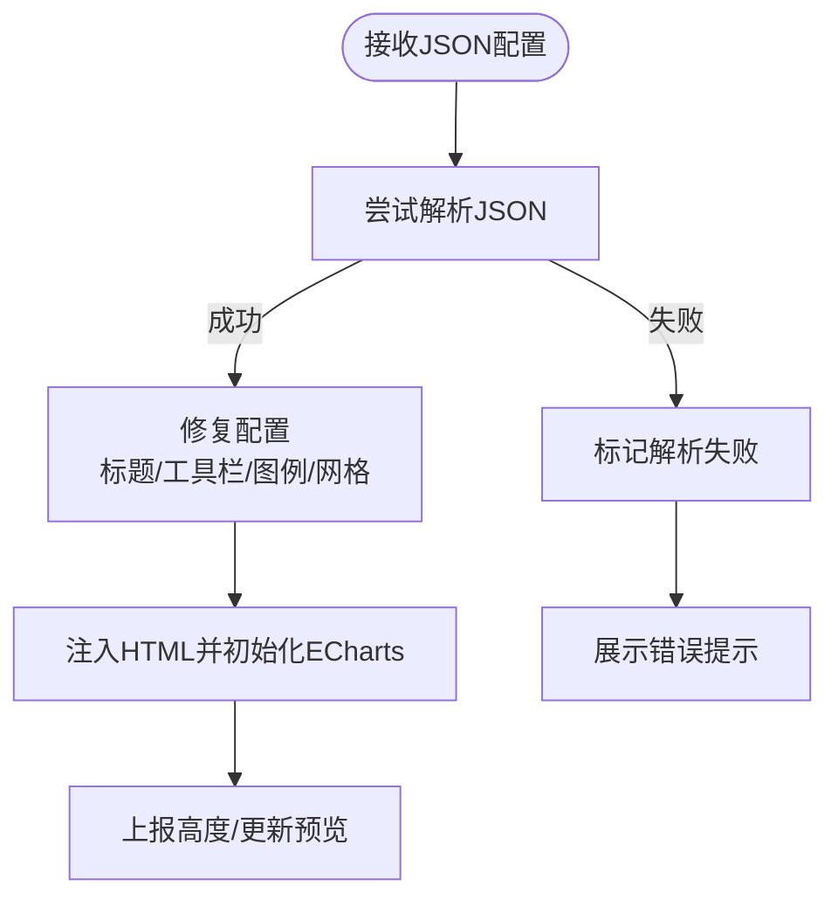
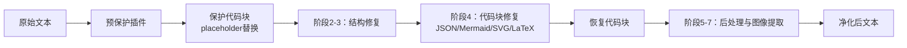
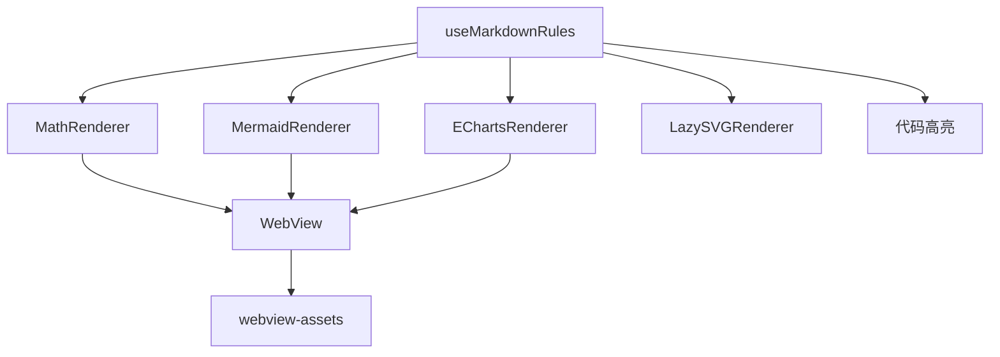

# Markdown解析器

<cite>
**本文档引用的文件**
- [markdown-parser.ts](file://src/lib/markdown-parser.ts)
- [markdown-utils.ts](file://src/lib/markdown/markdown-utils.ts)
- [useMarkdownRules.tsx](file://src/features/chat/hooks/useMarkdownRules.tsx)
- [MermaidRenderer.tsx](file://src/components/chat/MermaidRenderer.tsx)
- [EChartsRenderer.tsx](file://src/components/chat/EChartsRenderer.tsx)
- [MathRenderer.tsx](file://src/components/chat/MathRenderer.tsx)
- [webview-assets.ts](file://src/lib/webview-assets.ts)
- [sanitizer/index.ts](file://src/lib/sanitizer/index.ts)
</cite>

## 目录
1. [简介](#简介)
2. [项目结构](#项目结构)
3. [核心组件](#核心组件)
4. [架构总览](#架构总览)
5. [详细组件分析](#详细组件分析)
6. [依赖关系分析](#依赖关系分析)
7. [性能考量](#性能考量)
8. [故障排除指南](#故障排除指南)
9. [结论](#结论)
10. [附录](#附录)

## 简介
本技术文档面向Nexara的Markdown解析与渲染子系统，系统性阐述以下能力：
- Markdown语法解析与AST构建流程
- 渲染树生成与节点规则映射
- Mermaid图表渲染、ECharts可视化图表与LaTeX数学公式渲染的实现细节
- 代码高亮处理与SVG渲染优化
- 解析器扩展机制、插件系统与自定义渲染器集成方法
- 性能优化策略与内存管理方案
- 错误处理、回退机制与兼容性保障

## 项目结构
该解析与渲染体系主要由三部分组成：
- 预处理与内容分段：将Markdown中的LaTeX、Mermaid、ECharts、SVG等特殊内容抽取为安全片段，避免后续渲染阶段被破坏
- 渲染规则与组件：将Markdown AST节点映射到React组件，实现富文本、代码块、表格、链接、图片等渲染
- 可视化与公式渲染：通过WebView注入库脚本，实现Mermaid、ECharts与KaTeX的高质量渲染，并提供懒加载与全屏交互

**图表来源**
- [markdown-parser.ts:15-120](file://src/lib/markdown-parser.ts#L15-L120)
- [sanitizer/index.ts:48-103](file://src/lib/sanitizer/index.ts#L48-L103)
- [useMarkdownRules.tsx:39-342](file://src/features/chat/hooks/useMarkdownRules.tsx#L39-L342)

**章节来源**
- [markdown-parser.ts:15-120](file://src/lib/markdown-parser.ts#L15-L120)
- [markdown-utils.ts:7-9](file://src/lib/markdown/markdown-utils.ts#L7-L9)
- [useMarkdownRules.tsx:39-342](file://src/features/chat/hooks/useMarkdownRules.tsx#L39-L342)

## 核心组件
- 内容分段器：识别并分离LaTeX（行内/块级）、Mermaid、ECharts、SVG等特殊内容，输出统一的ContentSegment数组
- 渲染规则映射：将Markdown AST节点映射到React组件，支持段落、文本、代码块、表格、链接、图片等
- 可视化渲染器：MathRenderer（KaTeX）、MermaidRenderer（Mermaid）、EChartsRenderer（ECharts），均通过WebView承载
- 资源加载与回退：webview-assets提供本地打包资源与CDN回退机制
- 内容净化管线：保护代码块与特殊结构，修复标题、列表、表格、分隔线等，同时对LaTeX、Mermaid、ECharts、SVG进行专门处理

**章节来源**
- [markdown-parser.ts:6-120](file://src/lib/markdown-parser.ts#L6-L120)
- [useMarkdownRules.tsx:39-342](file://src/features/chat/hooks/useMarkdownRules.tsx#L39-L342)
- [MermaidRenderer.tsx:32-251](file://src/components/chat/MermaidRenderer.tsx#L32-L251)
- [EChartsRenderer.tsx:35-296](file://src/components/chat/EChartsRenderer.tsx#L35-L296)
- [MathRenderer.tsx:75-260](file://src/components/chat/MathRenderer.tsx#L75-L260)
- [webview-assets.ts:26-71](file://src/lib/webview-assets.ts#L26-L71)
- [sanitizer/index.ts:48-103](file://src/lib/sanitizer/index.ts#L48-L103)

## 架构总览
整体流程分为“预处理—分段—规则映射—可视化渲染”四个阶段，确保：
- 结构修复与内容保护：先净化再恢复，避免破坏代码块与特殊语法
- 渲染一致性：将LaTeX、Mermaid、ECharts、SVG等统一为可复用的React组件
- 性能与体验：懒加载、尺寸缓存、主题适配、全屏交互与横竖屏切换

**图表来源**
- [sanitizer/index.ts:48-103](file://src/lib/sanitizer/index.ts#L48-L103)
- [markdown-parser.ts:15-120](file://src/lib/markdown-parser.ts#L15-L120)
- [useMarkdownRules.tsx:39-342](file://src/features/chat/hooks/useMarkdownRules.tsx#L39-L342)
- [MermaidRenderer.tsx:52-115](file://src/components/chat/MermaidRenderer.tsx#L52-L115)
- [EChartsRenderer.tsx:81-150](file://src/components/chat/EChartsRenderer.tsx#L81-L150)
- [MathRenderer.tsx:133-216](file://src/components/chat/MathRenderer.tsx#L133-L216)

## 详细组件分析

### 内容分段器（Markdown内容预处理）
职责：
- 识别块级与行内LaTeX、代码块中的SVG、Mermaid、ECharts等特殊语法
- 按出现顺序合并为ContentSegment序列，保留文本片段与特殊片段
- 对无特殊内容的纯文本，返回单一text片段

关键点：
- 使用正则匹配并去重（行内LaTeX不包含在块级LaTeX内部）
- 按起始位置排序，确保渲染顺序正确
- 通过key区分不同类型的片段，便于React稳定渲染

**图表来源**
- [markdown-parser.ts:15-120](file://src/lib/markdown-parser.ts#L15-L120)

**章节来源**
- [markdown-parser.ts:15-120](file://src/lib/markdown-parser.ts#L15-L120)

### 渲染规则映射（useMarkdownRules）
职责：
- 将Markdown AST节点映射到React组件，覆盖段落、文本、代码块、表格、链接、图片等
- 在文本节点中识别行内LaTeX并拆分渲染
- 对代码块进行语言判定与高亮，或交由特殊渲染器处理（SVG、Mermaid、ECharts）

关键点：
- paragraph：检测是否包含行内LaTeX，若存在则采用行内布局
- text：按$...$/$$...$$拆分，分别渲染为原生LaTeX组件
- fence：根据语言选择LazySVGRenderer、MermaidRenderer、EChartsRenderer或代码高亮
- table：横向滚动容器，适配移动端阅读
- link：支持打开外部链接与复制URL

**图表来源**
- [useMarkdownRules.tsx:39-342](file://src/features/chat/hooks/useMarkdownRules.tsx#L39-L342)

**章节来源**
- [useMarkdownRules.tsx:39-342](file://src/features/chat/hooks/useMarkdownRules.tsx#L39-L342)

### LaTeX数学公式渲染（MathRenderer）
职责：
- 使用KaTeX在WebView中渲染LaTeX，支持行内与块级公式
- 通过尺寸缓存与预估尺寸避免布局抖动
- 支持懒加载与全屏交互

实现要点：
- 尺寸缓存：全局Map缓存公式渲染后的宽高，避免重复测量
- 预估尺寸：行内公式按字符数与命令复杂度估算，块级公式占满宽度
- WebView注入：HTML中直接执行渲染逻辑，减少消息往返
- 回退与错误：捕获渲染异常并通过消息回传错误信息

**图表来源**
- [MathRenderer.tsx:75-260](file://src/components/chat/MathRenderer.tsx#L75-L260)
- [webview-assets.ts:26-71](file://src/lib/webview-assets.ts#L26-L71)

**章节来源**
- [MathRenderer.tsx:75-260](file://src/components/chat/MathRenderer.tsx#L75-L260)
- [webview-assets.ts:26-71](file://src/lib/webview-assets.ts#L26-L71)

### Mermaid图表渲染（MermaidRenderer）
职责：
- 在WebView中渲染Mermaid图表，支持懒加载卡片与全屏交互
- 自动上报高度，适配不同主题与缩放级别
- 支持横竖屏切换与全屏模式

实现要点：
- HTML模板：注入Mermaid脚本与主题配置，设置视口与样式
- 高度上报：通过postMessage回传容器高度，控制预览高度范围
- 全屏交互：Modal + FAB旋转图标，支持横屏锁定与解锁

**图表来源**
- [MermaidRenderer.tsx:52-115](file://src/components/chat/MermaidRenderer.tsx#L52-L115)
- [MermaidRenderer.tsx:177-250](file://src/components/chat/MermaidRenderer.tsx#L177-L250)

**章节来源**
- [MermaidRenderer.tsx:32-251](file://src/components/chat/MermaidRenderer.tsx#L32-L251)

### ECharts可视化渲染（EChartsRenderer）
职责：
- 解析JSON配置，渲染ECharts图表，支持懒加载卡片与全屏交互
- 自动修复与优化配置（标题、工具栏、图例、网格等），提升移动端体验

实现要点：
- JSON解析：尝试直接解析，失败时记录错误并提示
- 配置修复：在全屏模式下启用工具栏与图例，调整网格top值
- 高度上报：通过postMessage回传容器高度，控制预览高度范围

**图表来源**
- [EChartsRenderer.tsx:54-80](file://src/components/chat/EChartsRenderer.tsx#L54-L80)
- [EChartsRenderer.tsx:101-150](file://src/components/chat/EChartsRenderer.tsx#L101-L150)

**章节来源**
- [EChartsRenderer.tsx:35-296](file://src/components/chat/EChartsRenderer.tsx#L35-L296)

### 代码高亮与SVG渲染
- 代码高亮：使用react-native-syntax-highlighter，按语言高亮，支持复制
- SVG渲染：LazySVGRenderer默认隐藏，点击“查看”后懒加载；支持全屏查看与缩放

**章节来源**
- [useMarkdownRules.tsx:129-225](file://src/features/chat/hooks/useMarkdownRules.tsx#L129-L225)
- [MathRenderer.tsx:436-523](file://src/components/chat/MathRenderer.tsx#L436-L523)

### 内容净化管线（插件化架构）
职责：
- 保护代码块与内联代码，避免被结构修复插件修改
- 按阶段执行插件：预保护、保护代码块、修复结构、代码块修复、恢复并后处理
- 针对LaTeX、Mermaid、ECharts、SVG等进行专门修复与验证

**图表来源**
- [sanitizer/index.ts:48-103](file://src/lib/sanitizer/index.ts#L48-L103)
- [sanitizer/index.ts:108-145](file://src/lib/sanitizer/index.ts#L108-L145)

**章节来源**
- [sanitizer/index.ts:48-103](file://src/lib/sanitizer/index.ts#L48-L103)
- [sanitizer/index.ts:108-145](file://src/lib/sanitizer/index.ts#L108-L145)

## 依赖关系分析
- 组件耦合：
  - useMarkdownRules依赖MathRenderer、MermaidRenderer、EChartsRenderer、LazySVGRenderer
  - 渲染器依赖webview-assets进行本地资源解析与CDN回退
- 数据流：
  - 预处理输出ContentSegment，渲染规则将其转换为React组件树
  - 渲染器通过WebView与外部库交互，通过postMessage回传尺寸/状态
- 外部依赖：
  - KaTeX、Mermaid、ECharts通过本地bundle或CDN加载
  - 代码高亮依赖react-native-syntax-highlighter

**图表来源**
- [useMarkdownRules.tsx:19-21](file://src/features/chat/hooks/useMarkdownRules.tsx#L19-L21)
- [MermaidRenderer.tsx](file://src/components/chat/MermaidRenderer.tsx#L9)
- [EChartsRenderer.tsx](file://src/components/chat/EChartsRenderer.tsx#L9)
- [MathRenderer.tsx](file://src/components/chat/MathRenderer.tsx#L8)
- [webview-assets.ts:5-10](file://src/lib/webview-assets.ts#L5-L10)

**章节来源**
- [useMarkdownRules.tsx:19-21](file://src/features/chat/hooks/useMarkdownRules.tsx#L19-L21)
- [MermaidRenderer.tsx](file://src/components/chat/MermaidRenderer.tsx#L9)
- [EChartsRenderer.tsx](file://src/components/chat/EChartsRenderer.tsx#L9)
- [MathRenderer.tsx](file://src/components/chat/MathRenderer.tsx#L8)
- [webview-assets.ts:26-71](file://src/lib/webview-assets.ts#L26-L71)

## 性能考量
- 尺寸缓存与预估：
  - MathRenderer引入全局尺寸缓存，避免重复测量与布局抖动
  - 行内LaTeX采用预估尺寸，块级公式占满宽度
- 懒加载与硬件加速：
  - 渲染器默认懒加载，WebView启用硬件层类型
  - Mermaid/ECharts在预览模式禁用交互，仅在全屏启用
- 资源加载优化：
  - 本地bundle优先，失败时CDN回退，减少首屏等待
  - 缓存已解析的本地URI，避免重复解析
- 渲染树优化：
  - 文本节点按LaTeX拆分渲染，避免整段重排
  - 表格使用横向滚动容器，降低纵向滚动压力

**章节来源**
- [MathRenderer.tsx:65-127](file://src/components/chat/MathRenderer.tsx#L65-L127)
- [MermaidRenderer.tsx:177-200](file://src/components/chat/MermaidRenderer.tsx#L177-L200)
- [EChartsRenderer.tsx:231-251](file://src/components/chat/EChartsRenderer.tsx#L231-L251)
- [webview-assets.ts:14-49](file://src/lib/webview-assets.ts#L14-L49)

## 故障排除指南
- 渲染器无法加载外部库：
  - 检查resolveLocalLibUri是否成功解析本地URI
  - 确认scriptTagWithFallback是否正确生成回退脚本
- Mermaid/ECharts高度异常：
  - 确认WebView的postMessage回调是否收到高度数据
  - 检查全屏模式下的配置修复逻辑（工具栏、图例、网格）
- LaTeX渲染失败：
  - 捕获WebView中的错误消息，检查公式合法性
  - 确认KaTeX CSS/JS是否成功加载
- SVG渲染问题：
  - 确认SVG内容是否通过LazySVGRenderer懒加载
  - 检查viewBox与高度计算逻辑

**章节来源**
- [webview-assets.ts:26-71](file://src/lib/webview-assets.ts#L26-L71)
- [MermaidRenderer.tsx:186-198](file://src/components/chat/MermaidRenderer.tsx#L186-L198)
- [EChartsRenderer.tsx:240-249](file://src/components/chat/EChartsRenderer.tsx#L240-L249)
- [MathRenderer.tsx:241-256](file://src/components/chat/MathRenderer.tsx#L241-L256)
- [MathRenderer.tsx:289-313](file://src/components/chat/MathRenderer.tsx#L289-L313)

## 结论
Nexara的Markdown解析与渲染体系通过“内容净化—内容分段—规则映射—可视化渲染”的分层设计，实现了对LaTeX、Mermaid、ECharts、SVG等富内容的高质量渲染。其插件化净化管线确保了结构修复与内容保护的一致性；渲染器通过WebView与本地资源回退机制，兼顾性能与稳定性；尺寸缓存与懒加载策略有效降低了内存与CPU开销。未来可在以下方面持续优化：
- 插件系统的可配置化与热插拔
- 更细粒度的缓存失效策略
- 渲染器的并发与批处理优化

## 附录
- Markdown样式常量：提供统一的字体、行高、边距等样式配置，便于主题切换
- 预处理兼容：保留为向前兼容的薄包装，实际逻辑由净化管线承担

**章节来源**
- [markdown-utils.ts:15-52](file://src/lib/markdown/markdown-utils.ts#L15-L52)