# 图像处理工具

<cite>
**本文引用的文件**
- [src/lib/image-utils.ts](file://src/lib/image-utils.ts)
- [src/lib/rag/image-service.ts](file://src/lib/rag/image-service.ts)
- [src/lib/sanitizer/plugins/image-extractor.ts](file://src/lib/sanitizer/plugins/image-extractor.ts)
- [src/lib/sanitizer/types.ts](file://src/lib/sanitizer/types.ts)
- [src/lib/services/image-generation.ts](file://src/lib/services/image-generation.ts)
- [src/components/rag/ImagePreviewModal.tsx](file://src/components/rag/ImagePreviewModal.tsx)
- [src/lib/rag/document-processor.ts](file://src/lib/rag/document-processor.ts)
- [src/lib/queue-utils.ts](file://src/lib/queue-utils.ts)
- [src/lib/llm/providers/vertexai.ts](file://src/lib/llm/providers/vertexai.ts)
</cite>

## 目录
1. [简介](#简介)
2. [项目结构](#项目结构)
3. [核心组件](#核心组件)
4. [架构总览](#架构总览)
5. [详细组件分析](#详细组件分析)
6. [依赖关系分析](#依赖关系分析)
7. [性能考量](#性能考量)
8. [故障排查指南](#故障排查指南)
9. [结论](#结论)
10. [附录](#附录)

## 简介
本技术文档面向 Nexara 图像处理工具，聚焦以下能力与机制：
- 图像格式转换、尺寸调整、压缩优化与质量控制
- 图像安全处理：恶意文件检测与内容净化流程
- 图像预览生成、缩略图创建与批量处理算法
- 图像处理管道的配置选项与性能调优
- 错误处理与异常恢复策略

文档基于仓库中的实际实现进行分析，并通过可视化图示帮助读者理解模块间交互与数据流。

## 项目结构
与图像处理相关的关键模块分布如下：
- 图像工具与缓存：src/lib/image-utils.ts
- 图像描述服务（视觉模型）：src/lib/rag/image-service.ts
- 图像提取净化插件：src/lib/sanitizer/plugins/image-extractor.ts
- 净化系统类型定义：src/lib/sanitizer/types.ts
- 图像生成服务：src/lib/services/image-generation.ts
- 图像预览模态框：src/components/rag/ImagePreviewModal.tsx
- 文档处理器（含图像处理分支）：src/lib/rag/document-processor.ts
- 批处理队列工具：src/lib/queue-utils.ts
- 大模型提供商（含图像处理集成点）：src/lib/llm/providers/vertexai.ts

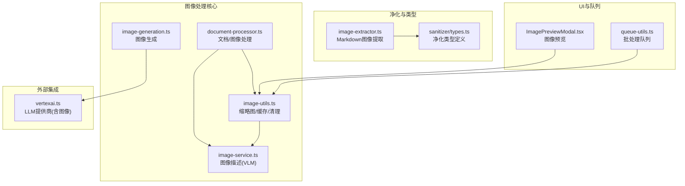

**图表来源**
- [src/lib/image-utils.ts:1-318](file://src/lib/image-utils.ts#L1-L318)
- [src/lib/rag/image-service.ts:1-98](file://src/lib/rag/image-service.ts#L1-L98)
- [src/lib/services/image-generation.ts:1-96](file://src/lib/services/image-generation.ts#L1-L96)
- [src/lib/rag/document-processor.ts:1-141](file://src/lib/rag/document-processor.ts#L1-L141)
- [src/lib/sanitizer/plugins/image-extractor.ts:1-24](file://src/lib/sanitizer/plugins/image-extractor.ts#L1-L24)
- [src/lib/sanitizer/types.ts:1-40](file://src/lib/sanitizer/types.ts#L1-L40)
- [src/components/rag/ImagePreviewModal.tsx:1-43](file://src/components/rag/ImagePreviewModal.tsx#L1-L43)
- [src/lib/queue-utils.ts:1-49](file://src/lib/queue-utils.ts#L1-L49)
- [src/lib/llm/providers/vertexai.ts:694-715](file://src/lib/llm/providers/vertexai.ts#L694-L715)

**章节来源**
- [src/lib/image-utils.ts:1-318](file://src/lib/image-utils.ts#L1-L318)
- [src/lib/rag/image-service.ts:1-98](file://src/lib/rag/image-service.ts#L1-L98)
- [src/lib/services/image-generation.ts:1-96](file://src/lib/services/image-generation.ts#L1-L96)
- [src/lib/rag/document-processor.ts:1-141](file://src/lib/rag/document-processor.ts#L1-L141)
- [src/lib/sanitizer/plugins/image-extractor.ts:1-24](file://src/lib/sanitizer/plugins/image-extractor.ts#L1-L24)
- [src/lib/sanitizer/types.ts:1-40](file://src/lib/sanitizer/types.ts#L1-L40)
- [src/components/rag/ImagePreviewModal.tsx:1-43](file://src/components/rag/ImagePreviewModal.tsx#L1-L43)
- [src/lib/queue-utils.ts:1-49](file://src/lib/queue-utils.ts#L1-L49)
- [src/lib/llm/providers/vertexai.ts:694-715](file://src/lib/llm/providers/vertexai.ts#L694-L715)

## 核心组件
- 缩略图与缓存管理：提供缩略图生成、缓存复制、持久化存储、缓存清理与统计查询。
- 图像描述服务：基于视觉语言模型（VLM）对图像进行描述，支持多语言提示词。
- 图像生成服务：根据用户提示生成图像，支持多种模型与提供商适配。
- 文档处理器：识别并处理图像文件，读取 Base64 并调用图像描述服务。
- 净化插件：从 Markdown 中提取图像并可选移除原文中的图片标记。
- 批处理队列：在不阻塞 UI 的前提下分批处理大量任务。
- 预览组件：提供全屏图像预览与关闭交互。

**章节来源**
- [src/lib/image-utils.ts:1-318](file://src/lib/image-utils.ts#L1-L318)
- [src/lib/rag/image-service.ts:1-98](file://src/lib/rag/image-service.ts#L1-L98)
- [src/lib/services/image-generation.ts:1-96](file://src/lib/services/image-generation.ts#L1-L96)
- [src/lib/rag/document-processor.ts:1-141](file://src/lib/rag/document-processor.ts#L1-L141)
- [src/lib/sanitizer/plugins/image-extractor.ts:1-24](file://src/lib/sanitizer/plugins/image-extractor.ts#L1-L24)
- [src/lib/queue-utils.ts:1-49](file://src/lib/queue-utils.ts#L1-L49)
- [src/components/rag/ImagePreviewModal.tsx:1-43](file://src/components/rag/ImagePreviewModal.tsx#L1-L43)

## 架构总览
图像处理管道从“输入图像”开始，经过“描述/生成/预览/净化/缓存”等多个环节，最终输出稳定可用的结果。关键流程包括：
- 输入图像读取与 Base64 转换
- 视觉模型描述或图像生成
- 缩略图生成与缓存持久化
- Markdown 图像提取与净化
- 批量处理与进度反馈
- UI 预览与交互

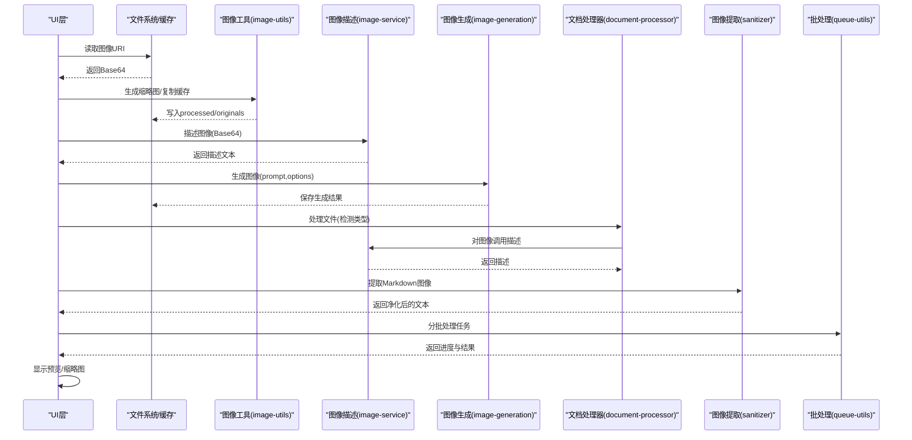

**图表来源**
- [src/lib/image-utils.ts:25-67](file://src/lib/image-utils.ts#L25-L67)
- [src/lib/rag/image-service.ts:48-94](file://src/lib/rag/image-service.ts#L48-L94)
- [src/lib/services/image-generation.ts:64-92](file://src/lib/services/image-generation.ts#L64-L92)
- [src/lib/rag/document-processor.ts:117-137](file://src/lib/rag/document-processor.ts#L117-L137)
- [src/lib/sanitizer/plugins/image-extractor.ts:6-23](file://src/lib/sanitizer/plugins/image-extractor.ts#L6-L23)
- [src/lib/queue-utils.ts:5-48](file://src/lib/queue-utils.ts#L5-L48)
- [src/components/rag/ImagePreviewModal.tsx:15-42](file://src/components/rag/ImagePreviewModal.tsx#L15-L42)

## 详细组件分析

### 缩略图与缓存管理（image-utils）
- 功能要点
  - 缩略图生成：基于宽高限制与压缩参数，统一输出 JPEG 格式缩略图。
  - 缓存复制：将图像复制到应用缓存目录，支持缩略图与原始图两类子目录。
  - 持久化存储：生成临时结果后立即复制到持久化目录，避免缓存清理导致的数据丢失。
  - 清理策略：按修改时间清理旧缓存，默认保留 7 天。
  - 统计查询：统计两类缓存数量与总大小。
  - 生成图像保存：AI 生成图像时，同时生成确定性命名的缩略图与原始图。
  - 原图推断：根据缩略图路径推断对应原始图路径。
- 关键流程（缩略图生成）

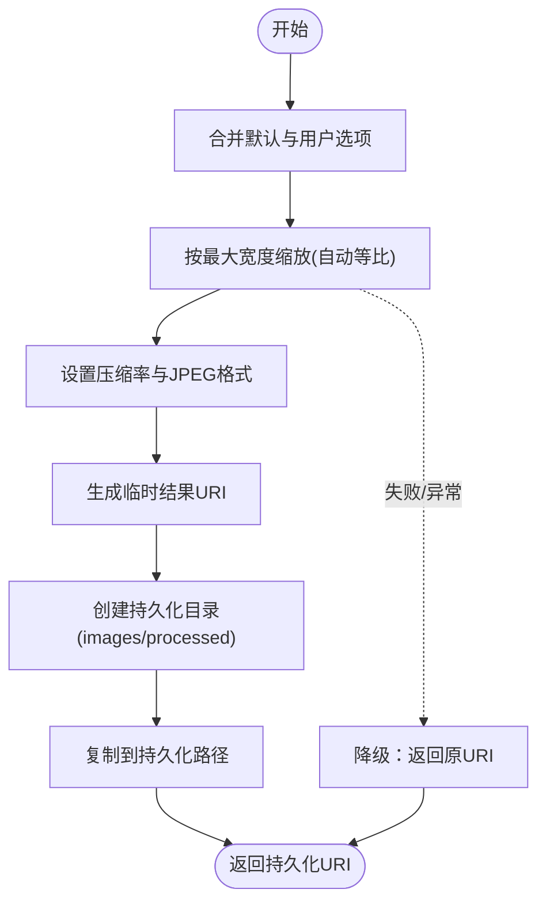

**图表来源**
- [src/lib/image-utils.ts:25-67](file://src/lib/image-utils.ts#L25-L67)

**章节来源**
- [src/lib/image-utils.ts:1-318](file://src/lib/image-utils.ts#L1-L318)

### 图像描述服务（image-service）
- 功能要点
  - 模型发现：优先使用设置中的视觉模型；若未设置则遍历启用的提供商与模型，寻找具备视觉能力的模型。
  - 请求构造：根据当前语言选择提示词，拼装包含文本与图像的多模态消息。
  - 客户端调用：通过工厂创建的 LLM 客户端发起对话请求，获取描述文本。
  - 异常处理：当未找到可用模型或描述失败时抛出明确错误。
- 调用序列（图像描述）

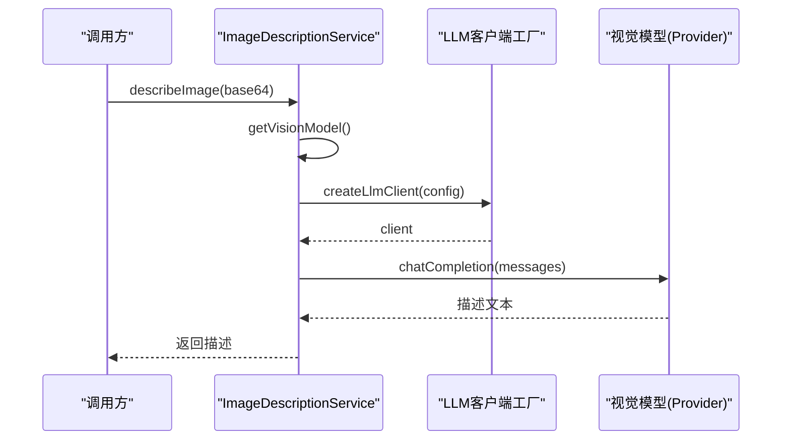

**图表来源**
- [src/lib/rag/image-service.ts:16-41](file://src/lib/rag/image-service.ts#L16-L41)
- [src/lib/rag/image-service.ts:48-94](file://src/lib/rag/image-service.ts#L48-L94)

**章节来源**
- [src/lib/rag/image-service.ts:1-98](file://src/lib/rag/image-service.ts#L1-L98)

### 图像生成服务（image-generation）
- 功能要点
  - 模型发现：优先使用设置中的默认图像模型；否则遍历启用提供商与模型，匹配类型为 image 或包含关键词的模型。
  - 客户端适配：通过工厂创建支持图像生成的客户端实例。
  - 请求执行：调用客户端的图像生成接口，返回生成结果 URL 与可选修订提示。
  - 异常处理：当未找到可用模型或客户端不支持图像生成时抛出明确错误。
- 调用序列（图像生成）

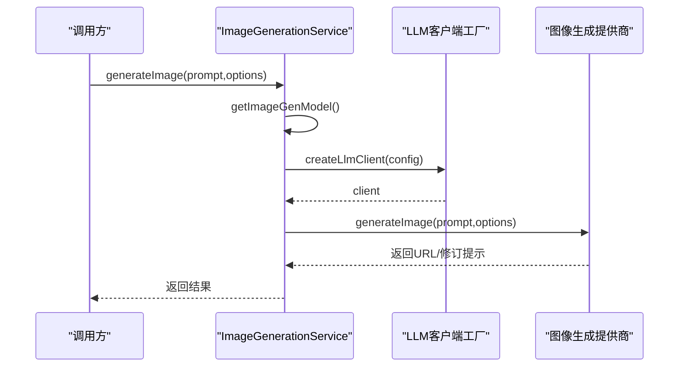

**图表来源**
- [src/lib/services/image-generation.ts:18-56](file://src/lib/services/image-generation.ts#L18-L56)
- [src/lib/services/image-generation.ts:64-92](file://src/lib/services/image-generation.ts#L64-L92)

**章节来源**
- [src/lib/services/image-generation.ts:1-96](file://src/lib/services/image-generation.ts#L1-L96)

### 文档处理器（document-processor）
- 功能要点
  - 文件类型检测：根据扩展名与 MIME 判断是否为图像。
  - 图像处理：读取 Base64 后调用图像描述服务生成描述文本；失败时返回空内容以避免无效数据进入后续流程。
  - 其他类型：支持文本、PDF、DOCX、XLSX 等文档类型的解析。
- 流程图（图像处理分支）

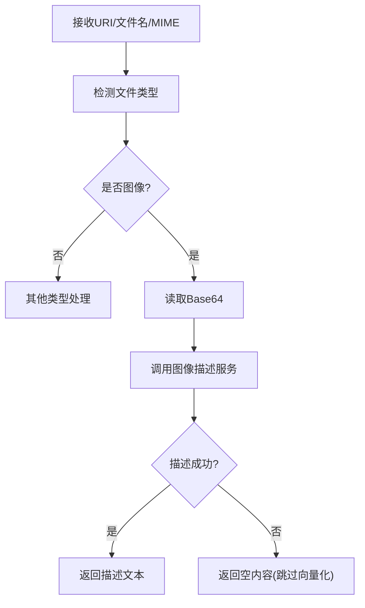

**图表来源**
- [src/lib/rag/document-processor.ts:17-38](file://src/lib/rag/document-processor.ts#L17-L38)
- [src/lib/rag/document-processor.ts:117-137](file://src/lib/rag/document-processor.ts#L117-L137)

**章节来源**
- [src/lib/rag/document-processor.ts:1-141](file://src/lib/rag/document-processor.ts#L1-L141)

### 净化插件（image-extractor）
- 功能要点
  - 在特定阶段从 Markdown 文本中提取图像标签，收集 src 与 alt 信息。
  - 可选移除原文中的图片标记，便于后续处理或导出。
  - 上下文传递：通过 SanitizerContext 将提取到的图像列表传递给后续步骤。
- 流程图（图像提取）

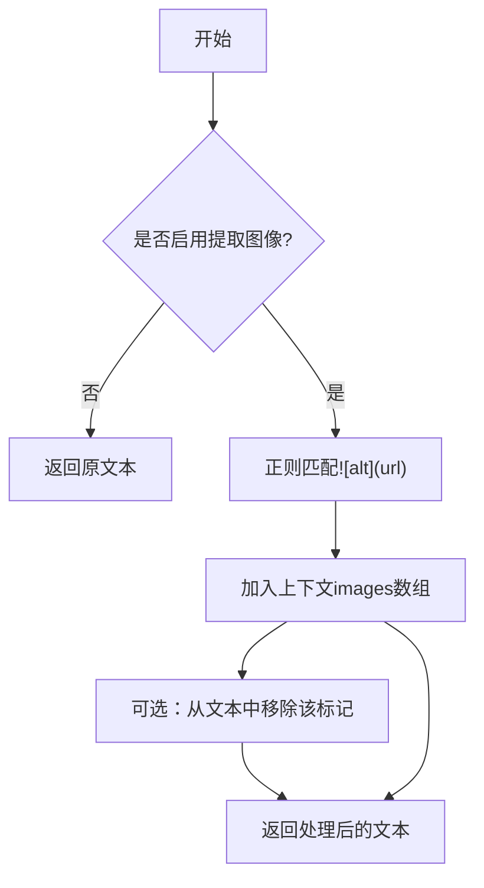

**图表来源**
- [src/lib/sanitizer/plugins/image-extractor.ts:6-23](file://src/lib/sanitizer/plugins/image-extractor.ts#L6-L23)
- [src/lib/sanitizer/types.ts:22-39](file://src/lib/sanitizer/types.ts#L22-L39)

**章节来源**
- [src/lib/sanitizer/plugins/image-extractor.ts:1-24](file://src/lib/sanitizer/plugins/image-extractor.ts#L1-L24)
- [src/lib/sanitizer/types.ts:1-40](file://src/lib/sanitizer/types.ts#L1-L40)

### 批处理队列（queue-utils）
- 功能要点
  - 分批处理：将大列表切分为小批次，避免长时间占用主线程。
  - 并发控制：同一批次内并发执行，跨批次间延时让出控制权。
  - 进度回调：提供完成数/总数的进度通知。
  - 错误聚合：记录失败项与错误集合，便于上层汇总处理。
- 流程图（批处理）

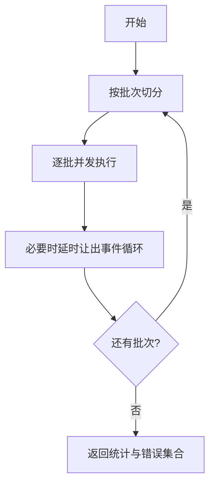

**图表来源**
- [src/lib/queue-utils.ts:5-48](file://src/lib/queue-utils.ts#L5-L48)

**章节来源**
- [src/lib/queue-utils.ts:1-49](file://src/lib/queue-utils.ts#L1-L49)

### 图像预览（ImagePreviewModal）
- 功能要点
  - 全屏预览：根据屏幕尺寸设置预览区域大小，保持宽高比。
  - 动画过渡：入场/出场使用缩放动画增强体验。
  - 关闭交互：点击右上角关闭按钮触发关闭回调。
- 流程图（预览）

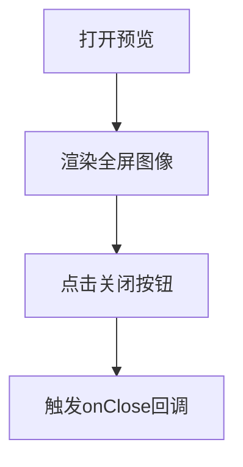

**图表来源**
- [src/components/rag/ImagePreviewModal.tsx:15-42](file://src/components/rag/ImagePreviewModal.tsx#L15-L42)

**章节来源**
- [src/components/rag/ImagePreviewModal.tsx:1-43](file://src/components/rag/ImagePreviewModal.tsx#L1-L43)

### 外部集成点（vertexai）
- 功能要点
  - 大模型提供商内部对图像数据进行本地落盘保存，避免 Base64 大数据带来的性能问题。
  - 保存后调用图像工具生成缩略图，保证后续展示与检索的一致性。
- 流程图（提供商图像处理）

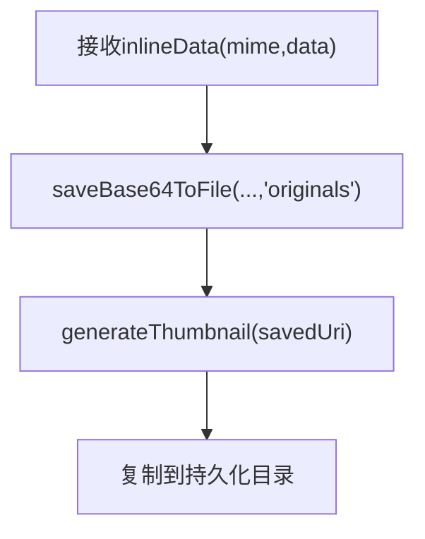

**图表来源**
- [src/lib/llm/providers/vertexai.ts:703-715](file://src/lib/llm/providers/vertexai.ts#L703-L715)
- [src/lib/image-utils.ts:25-67](file://src/lib/image-utils.ts#L25-L67)

**章节来源**
- [src/lib/llm/providers/vertexai.ts:694-715](file://src/lib/llm/providers/vertexai.ts#L694-L715)
- [src/lib/image-utils.ts:116-144](file://src/lib/image-utils.ts#L116-L144)

## 依赖关系分析
- 组件耦合
  - 图像工具与文件系统紧密耦合，负责缓存与持久化。
  - 图像描述服务依赖视觉模型与 LLM 客户端工厂。
  - 文档处理器依赖图像描述服务与文件系统读取。
  - 净化插件与净化类型系统解耦，通过上下文传递数据。
  - 批处理工具独立于业务逻辑，仅依赖传入的处理器函数。
  - 预览组件与图像工具解耦，通过 URI 交互。
- 外部依赖
  - 视觉模型提供商（如 Vertex AI）对图像数据进行本地落盘与缩略图生成。
  - Expo Image Manipulator 与 FileSystem 提供底层图像处理与文件操作能力。

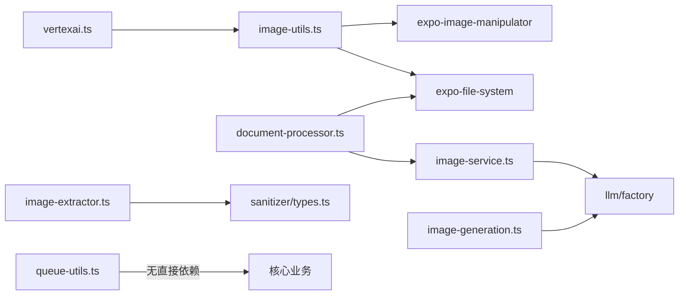

**图表来源**
- [src/lib/image-utils.ts:1-3](file://src/lib/image-utils.ts#L1-L3)
- [src/lib/rag/image-service.ts:1-4](file://src/lib/rag/image-service.ts#L1-L4)
- [src/lib/services/image-generation.ts:1-4](file://src/lib/services/image-generation.ts#L1-L4)
- [src/lib/rag/document-processor.ts:1-6](file://src/lib/rag/document-processor.ts#L1-L6)
- [src/lib/sanitizer/plugins/image-extractor.ts:1](file://src/lib/sanitizer/plugins/image-extractor.ts#L1)
- [src/lib/sanitizer/types.ts:1-40](file://src/lib/sanitizer/types.ts#L1-L40)
- [src/lib/llm/providers/vertexai.ts:703-708](file://src/lib/llm/providers/vertexai.ts#L703-L708)
- [src/lib/queue-utils.ts:1](file://src/lib/queue-utils.ts#L1)

**章节来源**
- [src/lib/image-utils.ts:1-318](file://src/lib/image-utils.ts#L1-L318)
- [src/lib/rag/image-service.ts:1-98](file://src/lib/rag/image-service.ts#L1-L98)
- [src/lib/services/image-generation.ts:1-96](file://src/lib/services/image-generation.ts#L1-L96)
- [src/lib/rag/document-processor.ts:1-141](file://src/lib/rag/document-processor.ts#L1-L141)
- [src/lib/sanitizer/plugins/image-extractor.ts:1-24](file://src/lib/sanitizer/plugins/image-extractor.ts#L1-L24)
- [src/lib/sanitizer/types.ts:1-40](file://src/lib/sanitizer/types.ts#L1-L40)
- [src/lib/llm/providers/vertexai.ts:694-715](file://src/lib/llm/providers/vertexai.ts#L694-L715)
- [src/lib/queue-utils.ts:1-49](file://src/lib/queue-utils.ts#L1-L49)

## 性能考量
- 缩略图生成
  - 使用固定 JPEG 压缩参数与最大宽度限制，减少体积与内存占用。
  - 自动等比缩放避免失真，适合快速浏览与传输。
- 缓存与持久化
  - 生成后立即复制到持久化目录，降低缓存清理风险。
  - 定期清理旧缓存，控制磁盘占用。
- 批处理
  - 分批并发+延时让出事件循环，避免 UI 卡顿。
  - 可调节批次大小与延迟，平衡吞吐与响应。
- 大模型图像处理
  - 将 Base64 图像转存为文件再处理，避免内存与性能问题。
  - 生成缩略图以提升后续展示效率。
- UI 预览
  - 全屏自适应尺寸，避免过度绘制。
  - 动画过渡平滑，提升交互体验。

[本节为通用性能指导，无需具体文件分析]

## 故障排查指南
- 缩略图生成失败
  - 现象：返回原图 URI。
  - 排查：确认输入 URI 可访问、文件系统权限正常、目标目录可写。
  - 参考路径：[src/lib/image-utils.ts:25-67](file://src/lib/image-utils.ts#L25-L67)
- 缓存复制/写入失败
  - 现象：返回原 URI 或抛出错误。
  - 排查：检查缓存目录可用性、磁盘空间、文件名合法性。
  - 参考路径：[src/lib/image-utils.ts:75-107](file://src/lib/image-utils.ts#L75-L107)
- 缓存清理失败
  - 现象：日志警告但不中断。
  - 排查：确认 images 目录存在性与权限。
  - 参考路径：[src/lib/image-utils.ts:150-187](file://src/lib/image-utils.ts#L150-L187)
- 图像描述服务无可用模型
  - 现象：抛出“未找到视觉模型”错误。
  - 排查：检查已启用提供商与模型的视觉能力标志。
  - 参考路径：[src/lib/rag/image-service.ts:48-54](file://src/lib/rag/image-service.ts#L48-L54)
- 图像生成服务客户端不支持
  - 现象：抛出“不支持图像生成”的错误。
  - 排查：确认所选模型类型或提供商实现。
  - 参考路径：[src/lib/services/image-generation.ts:82-84](file://src/lib/services/image-generation.ts#L82-L84)
- 文档处理器图像描述失败
  - 现象：返回空内容，避免无效数据进入向量化。
  - 排查：检查网络、模型可用性与输入 Base64。
  - 参考路径：[src/lib/rag/document-processor.ts:122-136](file://src/lib/rag/document-processor.ts#L122-L136)
- 批处理错误聚合
  - 现象：部分任务失败但不影响整体流程。
  - 排查：查看错误集合与失败计数，定位具体项。
  - 参考路径：[src/lib/queue-utils.ts:11-48](file://src/lib/queue-utils.ts#L11-L48)

**章节来源**
- [src/lib/image-utils.ts:25-67](file://src/lib/image-utils.ts#L25-L67)
- [src/lib/image-utils.ts:75-107](file://src/lib/image-utils.ts#L75-L107)
- [src/lib/image-utils.ts:150-187](file://src/lib/image-utils.ts#L150-L187)
- [src/lib/rag/image-service.ts:48-54](file://src/lib/rag/image-service.ts#L48-L54)
- [src/lib/services/image-generation.ts:82-84](file://src/lib/services/image-generation.ts#L82-L84)
- [src/lib/rag/document-processor.ts:122-136](file://src/lib/rag/document-processor.ts#L122-L136)
- [src/lib/queue-utils.ts:11-48](file://src/lib/queue-utils.ts#L11-L48)

## 结论
Nexara 的图像处理工具围绕“安全、高效、可控”的设计目标构建：
- 通过缩略图与缓存策略保障性能与稳定性；
- 通过视觉模型与图像生成服务实现智能内容理解与创作；
- 通过净化插件与批处理工具提升内容质量与处理吞吐；
- 通过清晰的错误处理与降级策略确保系统鲁棒性。

建议在生产环境中结合业务场景进一步细化配置参数（如压缩率、最大宽高、批处理粒度），并持续监控缓存清理与错误统计指标。

[本节为总结性内容，无需具体文件分析]

## 附录
- 配置选项与调优建议
  - 缩略图生成
    - 最大宽度/高度：根据展示需求设定，兼顾清晰度与体积。
    - 压缩率：在清晰度与体积间折衷，建议从默认值起步。
  - 缓存清理
    - 最大缓存时间：根据设备容量与使用频率调整。
  - 批处理
    - 批次大小与延迟：根据任务复杂度与设备性能动态调整。
  - 图像生成
    - 默认模型：在设置中指定首选模型，减少发现开销。
  - 净化插件
    - 提取图像：按需开启，避免影响正文结构。
- 安全处理机制
  - 恶意文件检测：建议在上游接入文件类型校验与白名单策略。
  - 内容净化：利用净化插件抽取并可选移除 Markdown 图像标记，防止敏感信息泄露。
  - 大数据落地：在提供商侧将 Base64 图像转存为文件，降低内存压力与风险。

[本节为通用指导，无需具体文件分析]