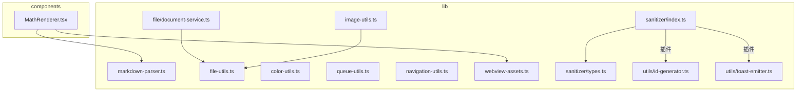
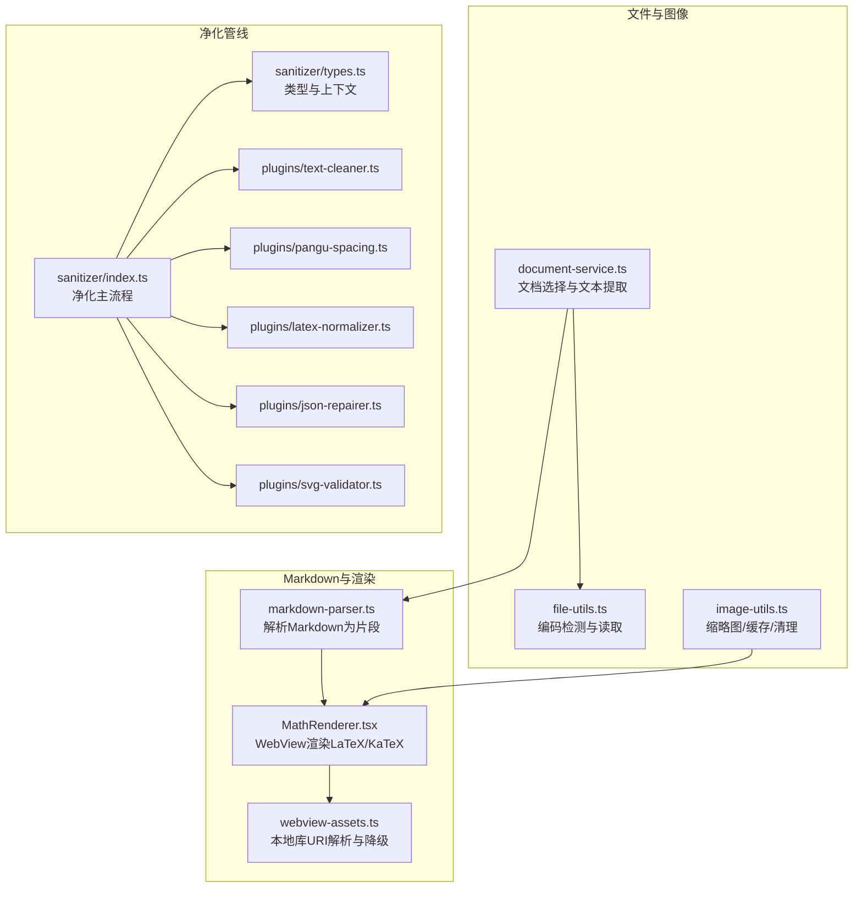
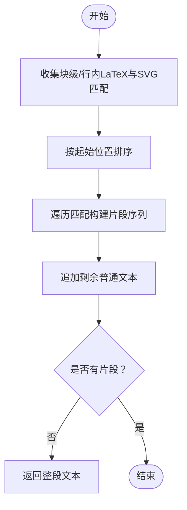
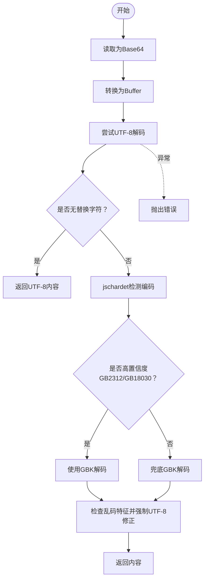
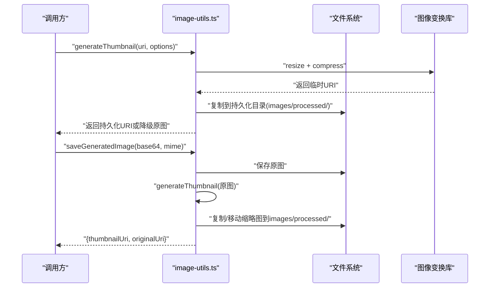
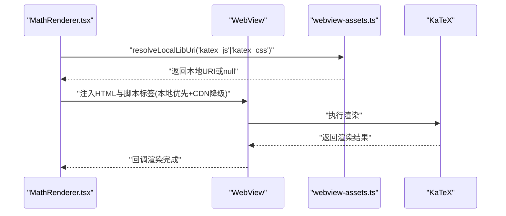
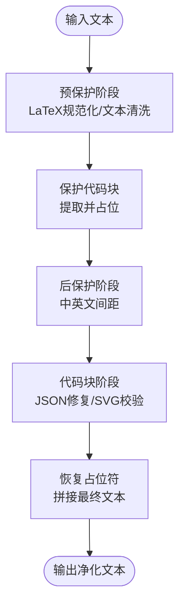
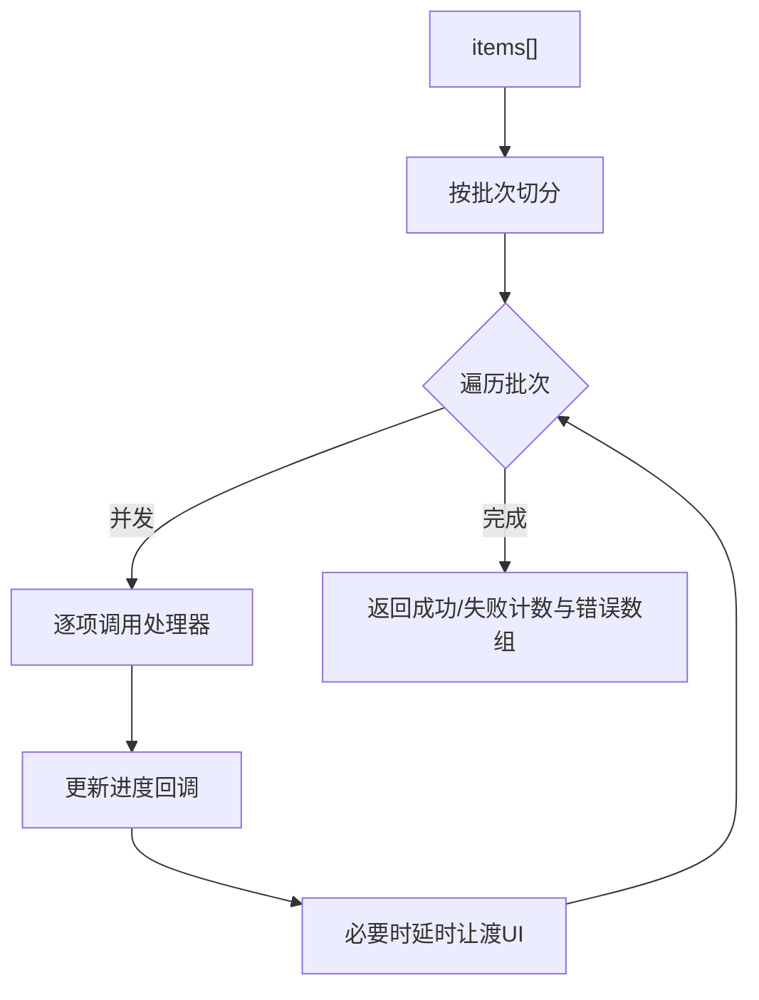
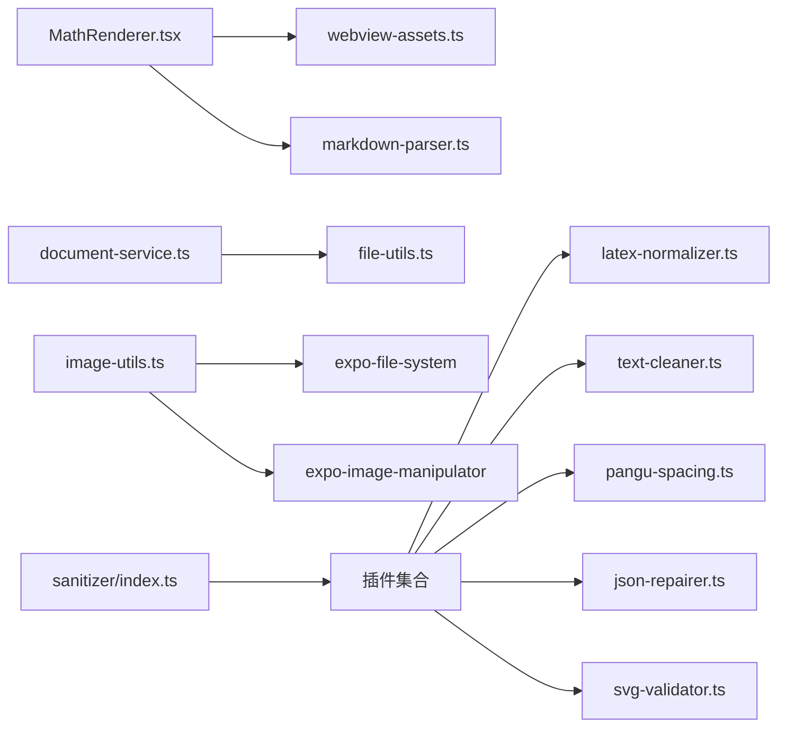

# 工具库和实用程序

<cite>
**本文引用的文件**
- [README.md](file://README.md)
- [markdown-parser.ts](file://src/lib/markdown-parser.ts)
- [file-utils.ts](file://src/lib/file-utils.ts)
- [image-utils.ts](file://src/lib/image-utils.ts)
- [color-utils.ts](file://src/lib/color-utils.ts)
- [queue-utils.ts](file://src/lib/queue-utils.ts)
- [navigation-utils.ts](file://src/lib/navigation-utils.ts)
- [webview-assets.ts](file://src/lib/webview-assets.ts)
- [id-generator.ts](file://src/lib/utils/id-generator.ts)
- [toast-emitter.ts](file://src/lib/utils/toast-emitter.ts)
- [document-service.ts](file://src/lib/file/document-service.ts)
- [MathRenderer.tsx](file://src/components/chat/MathRenderer.tsx)
- [sanitizer/index.ts](file://src/lib/sanitizer/index.ts)
- [sanitizer/types.ts](file://src/lib/sanitizer/types.ts)
- [sanitizer/plugins/text-cleaner.ts](file://src/lib/sanitizer/plugins/text-cleaner.ts)
- [sanitizer/plugins/pangu-spacing.ts](file://src/lib/sanitizer/plugins/pangu-spacing.ts)
- [sanitizer/plugins/latex-normalizer.ts](file://src/lib/sanitizer/plugins/latex-normalizer.ts)
- [sanitizer/plugins/json-repairer.ts](file://src/lib/sanitizer/plugins/json-repairer.ts)
- [sanitizer/plugins/svg-validator.ts](file://src/lib/sanitizer/plugins/svg-validator.ts)
</cite>

## 目录
1. [简介](#简介)
2. [项目结构](#项目结构)
3. [核心组件](#核心组件)
4. [架构总览](#架构总览)
5. [详细组件分析](#详细组件分析)
6. [依赖关系分析](#依赖关系分析)
7. [性能考量](#性能考量)
8. [故障排查指南](#故障排查指南)
9. [结论](#结论)
10. [附录](#附录)

## 简介
本文件面向Nexara工具库与实用程序，系统梳理文件处理、图像处理、数学与渲染、通用工具函数、Markdown解析与净化管线，并给出安全与性能优化建议、使用示例与集成指南，以及测试与质量保障方法。文档同时提供可视化架构图与流程图，帮助开发者快速理解与高效集成。

## 项目结构
Nexara的工具库主要位于src/lib目录下，按功能域划分：
- 文档与文件处理：document-service.ts、file-utils.ts
- 图像处理与缓存：image-utils.ts
- Markdown与数学渲染：markdown-parser.ts、MathRenderer.tsx、webview-assets.ts
- 内容净化管线：sanitizer/（含插件体系）
- 通用工具：color-utils.ts、queue-utils.ts、navigation-utils.ts、utils（id-generator.ts、toast-emitter.ts）

**图表来源**
- [markdown-parser.ts:1-121](file://src/lib/markdown-parser.ts#L1-L121)
- [file-utils.ts:1-109](file://src/lib/file-utils.ts#L1-L109)
- [image-utils.ts:1-318](file://src/lib/image-utils.ts#L1-L318)
- [color-utils.ts:1-90](file://src/lib/color-utils.ts#L1-L90)
- [queue-utils.ts:1-49](file://src/lib/queue-utils.ts#L1-L49)
- [navigation-utils.ts:1-18](file://src/lib/navigation-utils.ts#L1-L18)
- [webview-assets.ts:1-72](file://src/lib/webview-assets.ts#L1-L72)
- [sanitizer/index.ts:39-79](file://src/lib/sanitizer/index.ts#L39-L79)
- [sanitizer/types.ts:1-39](file://src/lib/sanitizer/types.ts#L1-L39)
- [utils/id-generator.ts:1-13](file://src/lib/utils/id-generator.ts#L1-L13)
- [utils/toast-emitter.ts:1-15](file://src/lib/utils/toast-emitter.ts#L1-L15)
- [file/document-service.ts:1-67](file://src/lib/file/document-service.ts#L1-L67)
- [MathRenderer.tsx:1-98](file://src/components/chat/MathRenderer.tsx#L1-L98)

**章节来源**
- [README.md:1-161](file://README.md#L1-L161)

## 核心组件
- Markdown内容解析与分段：将Markdown文本拆分为普通文本、行内/块级LaTeX、SVG代码块等片段，便于后续渲染与处理。
- 文件读取与编码处理：自动检测并解码UTF-8/GBK等编码，处理乱码特征，提供统一字符串输出。
- 图像处理与缓存：缩略图生成、缓存复制、AI生成图片命名规范、缓存清理与统计。
- 数学公式渲染：基于KaTeX的WebView渲染，支持行内/块级公式，尺寸估算与缓存，避免抖动。
- 内容净化管线：插件化净化，支持预保护阶段（LaTeX规范化、AI文本清洗）、保护代码块、后保护阶段（中英文间距、JSON修复、SVG校验）。
- 通用工具：批量处理队列、导航防抖、ID生成、吐司事件发射、WebView本地库解析与降级脚本标签生成。

**章节来源**
- [markdown-parser.ts:15-120](file://src/lib/markdown-parser.ts#L15-L120)
- [file-utils.ts:41-96](file://src/lib/file-utils.ts#L41-L96)
- [image-utils.ts:25-67](file://src/lib/image-utils.ts#L25-L67)
- [MathRenderer.tsx:75-98](file://src/components/chat/MathRenderer.tsx#L75-L98)
- [sanitizer/index.ts:48-79](file://src/lib/sanitizer/index.ts#L48-L79)
- [sanitizer/types.ts:29-39](file://src/lib/sanitizer/types.ts#L29-L39)
- [queue-utils.ts:5-48](file://src/lib/queue-utils.ts#L5-L48)
- [navigation-utils.ts:8-17](file://src/lib/navigation-utils.ts#L8-L17)
- [webview-assets.ts:26-71](file://src/lib/webview-assets.ts#L26-L71)
- [id-generator.ts:7-12](file://src/lib/utils/id-generator.ts#L7-L12)
- [toast-emitter.ts:10-14](file://src/lib/utils/toast-emitter.ts#L10-L14)

## 架构总览
下图展示工具库与渲染组件的交互关系，突出Markdown解析、LaTeX渲染、图像处理与净化管线的关键路径。

**图表来源**
- [markdown-parser.ts:15-120](file://src/lib/markdown-parser.ts#L15-L120)
- [MathRenderer.tsx:75-98](file://src/components/chat/MathRenderer.tsx#L75-L98)
- [webview-assets.ts:26-71](file://src/lib/webview-assets.ts#L26-L71)
- [file-utils.ts:41-96](file://src/lib/file-utils.ts#L41-L96)
- [document-service.ts:47-63](file://src/lib/file/document-service.ts#L47-L63)
- [image-utils.ts:25-67](file://src/lib/image-utils.ts#L25-L67)
- [sanitizer/index.ts:48-79](file://src/lib/sanitizer/index.ts#L48-L79)
- [sanitizer/types.ts:29-39](file://src/lib/sanitizer/types.ts#L29-L39)
- [sanitizer/plugins/text-cleaner.ts:8-34](file://src/lib/sanitizer/plugins/text-cleaner.ts#L8-L34)
- [sanitizer/plugins/pangu-spacing.ts:6-16](file://src/lib/sanitizer/plugins/pangu-spacing.ts#L6-L16)
- [sanitizer/plugins/latex-normalizer.ts:6-14](file://src/lib/sanitizer/plugins/latex-normalizer.ts#L6-L14)
- [sanitizer/plugins/json-repairer.ts:7-25](file://src/lib/sanitizer/plugins/json-repairer.ts#L7-L25)
- [sanitizer/plugins/svg-validator.ts:7-28](file://src/lib/sanitizer/plugins/svg-validator.ts#L7-L28)

## 详细组件分析

### Markdown解析器
- 功能概述：识别块级与行内LaTeX、SVG代码块，将Markdown切分为有序片段；若无特殊内容则返回整段文本。
- 关键点：
  - 使用正则收集匹配项并按起始位置排序，确保片段顺序正确。
  - 避免行内LaTeX与块级LaTeX相互覆盖，先处理块级再处理行内。
  - 末尾剩余文本作为普通文本段追加。
- 复杂度：O(n + k log k)，n为输入长度，k为匹配数量。

**图表来源**
- [markdown-parser.ts:15-120](file://src/lib/markdown-parser.ts#L15-L120)

**章节来源**
- [markdown-parser.ts:15-120](file://src/lib/markdown-parser.ts#L15-L120)

### 文件处理工具
- 功能概述：读取文件为Base64，自动检测编码（UTF-8优先，其次jschardet检测），处理典型乱码特征，最终统一返回可读字符串；提供文件大小格式化。
- 安全与健壮性：
  - 优先UTF-8解码，若出现替换字符则进一步检测编码。
  - 对疑似“UTF-8被误读为GBK”的特征字符进行二次修正。
  - 统一异常捕获与错误消息包装。
- 性能建议：
  - 大文件建议分块读取或异步处理，避免阻塞主线程。
  - 复用Buffer与检测结果，减少重复分配。

**图表来源**
- [file-utils.ts:41-96](file://src/lib/file-utils.ts#L41-L96)

**章节来源**
- [file-utils.ts:41-96](file://src/lib/file-utils.ts#L41-L96)

### 图像处理工具
- 功能概述：生成缩略图、复制到缓存目录、保存Base64图片、清理旧缓存、保存AI生成图片并建立确定性命名、推断原图URI、获取缓存统计。
- 关键流程：
  - 缩略图：使用图像变换库生成，随后复制到持久化目录，失败时降级返回原图URI。
  - AI生成图片：先保存原图，再生成缩略图，最后按约定移动至目标目录，保持命名一致性。
  - 缓存清理：按修改时间清理超过阈值的旧文件。
- 性能与可靠性：
  - 生成缩略图后立即复制到持久化目录，避免临时缓存被系统回收。
  - 统一的命名与目录结构，便于后续查找与清理。

**图表来源**
- [image-utils.ts:25-67](file://src/lib/image-utils.ts#L25-L67)
- [image-utils.ts:194-237](file://src/lib/image-utils.ts#L194-L237)

**章节来源**
- [image-utils.ts:25-67](file://src/lib/image-utils.ts#L25-L67)
- [image-utils.ts:194-237](file://src/lib/image-utils.ts#L194-L237)
- [image-utils.ts:150-187](file://src/lib/image-utils.ts#L150-L187)
- [image-utils.ts:242-272](file://src/lib/image-utils.ts#L242-L272)
- [image-utils.ts:280-317](file://src/lib/image-utils.ts#L280-L317)

### 数学公式渲染组件
- 功能概述：使用WebView与KaTeX渲染LaTeX，支持行内/块级公式；通过尺寸缓存避免布局抖动；提供本地库URI解析与CDN降级方案。
- 关键点：
  - 行内公式采用预估尺寸，块级公式允许有限自适应。
  - 通过webview-assets解析本地KaTeX资源，失败时回退CDN。
  - 主题切换时更新背景与文字颜色。

**图表来源**
- [MathRenderer.tsx:75-98](file://src/components/chat/MathRenderer.tsx#L75-L98)
- [webview-assets.ts:26-71](file://src/lib/webview-assets.ts#L26-L71)

**章节来源**
- [MathRenderer.tsx:75-98](file://src/components/chat/MathRenderer.tsx#L75-L98)
- [webview-assets.ts:26-71](file://src/lib/webview-assets.ts#L26-L71)

### 内容净化管线
- 功能概述：插件化净化流程，支持预保护（LaTeX规范化、AI文本清洗）、保护代码块、后保护（中英文间距、JSON修复、SVG校验）。
- 关键点：
  - 提供占位符机制保护代码块，避免净化破坏语法。
  - 插件按阶段执行，可启用/禁用与定制。
  - JSON修复针对echarts与json代码块自动修复常见语法问题；SVG校验标记明显错误块。

**图表来源**
- [sanitizer/index.ts:48-79](file://src/lib/sanitizer/index.ts#L48-L79)
- [sanitizer/types.ts:29-39](file://src/lib/sanitizer/types.ts#L29-L39)
- [sanitizer/plugins/latex-normalizer.ts:6-14](file://src/lib/sanitizer/plugins/latex-normalizer.ts#L6-L14)
- [sanitizer/plugins/text-cleaner.ts:8-34](file://src/lib/sanitizer/plugins/text-cleaner.ts#L8-L34)
- [sanitizer/plugins/pangu-spacing.ts:6-16](file://src/lib/sanitizer/plugins/pangu-spacing.ts#L6-L16)
- [sanitizer/plugins/json-repairer.ts:7-25](file://src/lib/sanitizer/plugins/json-repairer.ts#L7-L25)
- [sanitizer/plugins/svg-validator.ts:7-28](file://src/lib/sanitizer/plugins/svg-validator.ts#L7-L28)

**章节来源**
- [sanitizer/index.ts:48-79](file://src/lib/sanitizer/index.ts#L48-L79)
- [sanitizer/types.ts:29-39](file://src/lib/sanitizer/types.ts#L29-L39)
- [sanitizer/plugins/latex-normalizer.ts:6-14](file://src/lib/sanitizer/plugins/latex-normalizer.ts#L6-L14)
- [sanitizer/plugins/text-cleaner.ts:8-34](file://src/lib/sanitizer/plugins/text-cleaner.ts#L8-L34)
- [sanitizer/plugins/pangu-spacing.ts:6-16](file://src/lib/sanitizer/plugins/pangu-spacing.ts#L6-L16)
- [sanitizer/plugins/json-repairer.ts:7-25](file://src/lib/sanitizer/plugins/json-repairer.ts#L7-L25)
- [sanitizer/plugins/svg-validator.ts:7-28](file://src/lib/sanitizer/plugins/svg-validator.ts#L7-L28)

### 通用工具函数
- 批量处理队列：分批处理大量任务，每批并发执行并延迟让渡UI线程，提供进度回调与错误聚合。
- 导航防抖：限制短时间内重复触发导航动作，避免用户误触。
- ID生成：基于时间戳与随机字符串生成稳定唯一ID，规避RN环境下的加密polyfill问题。
- 吐司事件发射：基于事件总线的轻量通知机制，便于跨组件通信。

**图表来源**
- [queue-utils.ts:5-48](file://src/lib/queue-utils.ts#L5-L48)

**章节来源**
- [queue-utils.ts:5-48](file://src/lib/queue-utils.ts#L5-L48)
- [navigation-utils.ts:8-17](file://src/lib/navigation-utils.ts#L8-L17)
- [id-generator.ts:7-12](file://src/lib/utils/id-generator.ts#L7-L12)
- [toast-emitter.ts:10-14](file://src/lib/utils/toast-emitter.ts#L10-L14)

## 依赖关系分析
- 组件耦合：
  - MathRenderer依赖webview-assets解析本地库URI，依赖markdown-parser的片段结构（在上层渲染流程中）。
  - document-service依赖文件读取工具与文档处理模块，负责将系统文档转换为聊天附件。
  - image-utils依赖文件系统与图像变换库，提供缩略图与缓存管理。
  - sanitizer为主干净化流程，各插件独立、低耦合，通过统一接口接入。
- 外部依赖：
  - WebView与KaTeX用于数学公式渲染。
  - expo-file-system与expo-image-manipulator用于文件与图像操作。
  - jschardet与iconv-lite用于编码检测与转换。
  - jsonrepair与ai-text-sanitizer用于JSON修复与AI文本清洗。

**图表来源**
- [MathRenderer.tsx:75-98](file://src/components/chat/MathRenderer.tsx#L75-L98)
- [webview-assets.ts:26-71](file://src/lib/webview-assets.ts#L26-L71)
- [markdown-parser.ts:15-120](file://src/lib/markdown-parser.ts#L15-L120)
- [document-service.ts:47-63](file://src/lib/file/document-service.ts#L47-L63)
- [file-utils.ts:41-96](file://src/lib/file-utils.ts#L41-L96)
- [image-utils.ts:25-67](file://src/lib/image-utils.ts#L25-L67)
- [sanitizer/index.ts:48-79](file://src/lib/sanitizer/index.ts#L48-L79)
- [sanitizer/plugins/*.ts:8-34](file://src/lib/sanitizer/plugins/text-cleaner.ts#L8-L34)

**章节来源**
- [MathRenderer.tsx:75-98](file://src/components/chat/MathRenderer.tsx#L75-L98)
- [webview-assets.ts:26-71](file://src/lib/webview-assets.ts#L26-L71)
- [markdown-parser.ts:15-120](file://src/lib/markdown-parser.ts#L15-L120)
- [document-service.ts:47-63](file://src/lib/file/document-service.ts#L47-L63)
- [file-utils.ts:41-96](file://src/lib/file-utils.ts#L41-L96)
- [image-utils.ts:25-67](file://src/lib/image-utils.ts#L25-L67)
- [sanitizer/index.ts:48-79](file://src/lib/sanitizer/index.ts#L48-L79)
- [sanitizer/plugins/text-cleaner.ts:8-34](file://src/lib/sanitizer/plugins/text-cleaner.ts#L8-L34)

## 性能考量
- UI线程让渡：批量处理使用小批次并发与短延时，避免主线程阻塞。
- WebView资源本地化：优先使用本地打包资源，失败时CDN降级，减少网络抖动与首屏等待。
- 图像缓存策略：生成缩略图后立即持久化，定期清理超期缓存，控制磁盘占用。
- 编码检测优化：优先UTF-8直解，仅在必要时进行复杂检测与二次修正。
- 尺寸缓存：LaTeX渲染组件对尺寸进行全局缓存，避免反复测量导致的布局抖动与重绘。

[本节为通用指导，无需具体文件来源]

## 故障排查指南
- 文件读取失败：
  - 检查URI有效性与权限；确认编码检测路径是否命中；关注替换字符与乱码特征。
  - 参考路径：[file-utils.ts:92-96](file://src/lib/file-utils.ts#L92-L96)
- 图像缩略图为空或原图返回：
  - 检查图像变换库返回值与文件系统复制状态；确认持久化目录存在且可写。
  - 参考路径：[image-utils.ts:62-66](file://src/lib/image-utils.ts#L62-L66)
- WebView无法加载KaTeX：
  - 确认本地URI解析成功；检查平台差异（Android需下载）；验证CDN降级脚本标签生成。
  - 参考路径：[webview-assets.ts:32-49](file://src/lib/webview-assets.ts#L32-L49)
- 数学公式渲染异常：
  - 检查公式语法与分隔符；确认LaTeX规范化插件是否生效；查看WebView注入脚本是否执行。
  - 参考路径：[sanitizer/plugins/latex-normalizer.ts:6-14](file://src/lib/sanitizer/plugins/latex-normalizer.ts#L6-L14)
- 净化后JSON失效：
  - 检查json-repairer是否对目标语言块生效；确认修复失败时回退原始内容。
  - 参考路径：[sanitizer/plugins/json-repairer.ts:7-25](file://src/lib/sanitizer/plugins/json-repairer.ts#L7-L25)

**章节来源**
- [file-utils.ts:92-96](file://src/lib/file-utils.ts#L92-L96)
- [image-utils.ts:62-66](file://src/lib/image-utils.ts#L62-L66)
- [webview-assets.ts:32-49](file://src/lib/webview-assets.ts#L32-L49)
- [sanitizer/plugins/latex-normalizer.ts:6-14](file://src/lib/sanitizer/plugins/latex-normalizer.ts#L6-L14)
- [sanitizer/plugins/json-repairer.ts:7-25](file://src/lib/sanitizer/plugins/json-repairer.ts#L7-L25)

## 结论
Nexara工具库围绕“文件/图像/渲染/净化/通用”五大领域构建了高内聚、低耦合的实用程序集。通过插件化的净化管线、稳健的编码处理、可靠的图像缓存策略与WebView本地化资源方案，既满足了高性能需求，也兼顾了安全性与可维护性。建议在实际集成中遵循本文的使用示例、安全与性能建议，并结合测试与质量保障流程持续优化。

[本节为总结性内容，无需具体文件来源]

## 附录

### 使用示例与集成指南
- Markdown解析与渲染
  - 使用解析器将Markdown切分为片段，交由渲染组件处理。
  - 参考路径：[markdown-parser.ts:15-120](file://src/lib/markdown-parser.ts#L15-L120)、[MathRenderer.tsx:75-98](file://src/components/chat/MathRenderer.tsx#L75-L98)
- 文件读取与编码处理
  - 读取任意编码文件，自动检测并返回UTF-8字符串。
  - 参考路径：[file-utils.ts:41-96](file://src/lib/file-utils.ts#L41-L96)
- 图像处理与缓存
  - 生成缩略图并复制到持久化目录；保存AI生成图片并建立命名规范；定期清理旧缓存。
  - 参考路径：[image-utils.ts:25-67](file://src/lib/image-utils.ts#L25-L67)、[image-utils.ts:194-237](file://src/lib/image-utils.ts#L194-L237)、[image-utils.ts:150-187](file://src/lib/image-utils.ts#L150-L187)
- 内容净化
  - 按阶段启用插件，保护代码块，修复JSON与LaTeX，改善中英文间距。
  - 参考路径：[sanitizer/index.ts:48-79](file://src/lib/sanitizer/index.ts#L48-L79)、[sanitizer/plugins/*.ts:8-34](file://src/lib/sanitizer/plugins/text-cleaner.ts#L8-L34)
- 通用工具
  - 批量处理队列、导航防抖、ID生成、吐司事件发射。
  - 参考路径：[queue-utils.ts:5-48](file://src/lib/queue-utils.ts#L5-L48)、[navigation-utils.ts:8-17](file://src/lib/navigation-utils.ts#L8-L17)、[id-generator.ts:7-12](file://src/lib/utils/id-generator.ts#L7-L12)、[toast-emitter.ts:10-14](file://src/lib/utils/toast-emitter.ts#L10-L14)

### 测试方法与质量保证
- 单元测试
  - Markdown解析：覆盖块级/行内LaTeX、SVG、无特殊内容等场景。
  - 文件读取：UTF-8/GBK/混合编码、替换字符、乱码特征、异常路径。
  - 图像处理：缩略图生成、缓存复制、命名规范、清理策略、统计查询。
  - 净化管线：插件启用/禁用、占位符恢复、JSON修复、LaTeX规范化、SVG校验。
- 集成测试
  - WebView渲染：本地资源可用性、CDN降级、主题切换。
  - 导航防抖：短时间内多次触发的行为一致性。
- 质量保障
  - 代码覆盖率：重点覆盖异常分支与边缘条件。
  - 性能监控：批量处理耗时、WebView首帧时间、缓存命中率。
  - 日志与告警：关键错误与降级路径的日志记录与上报。

[本节为通用指导，无需具体文件来源]