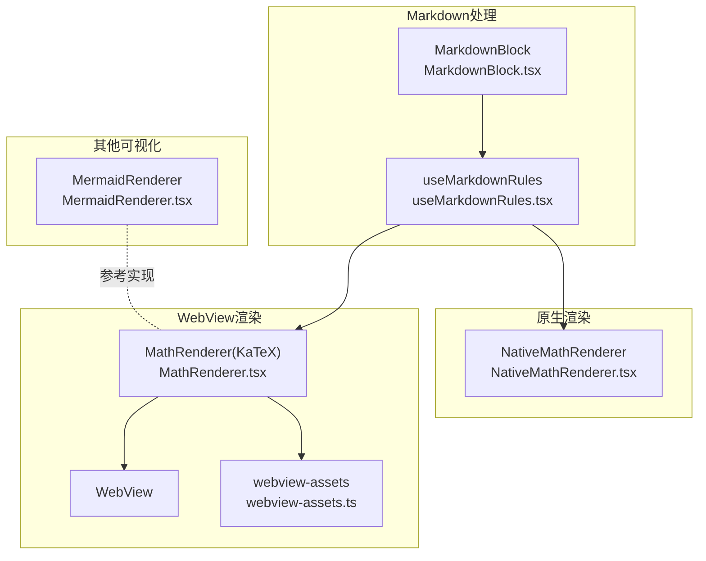
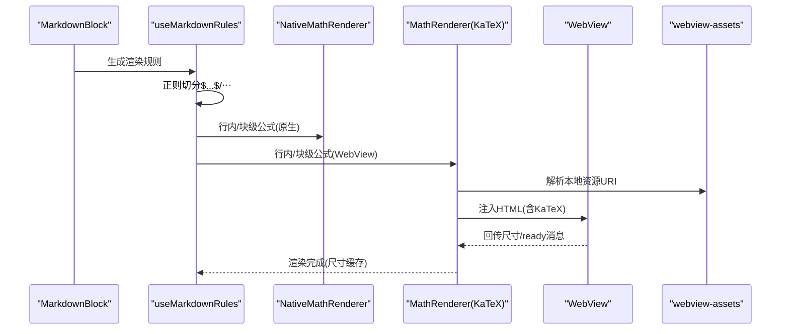
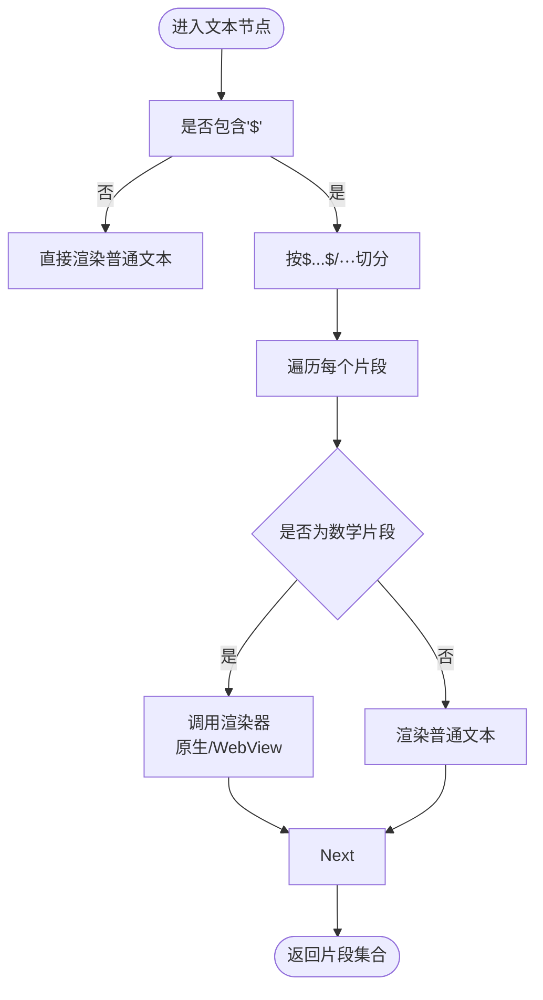
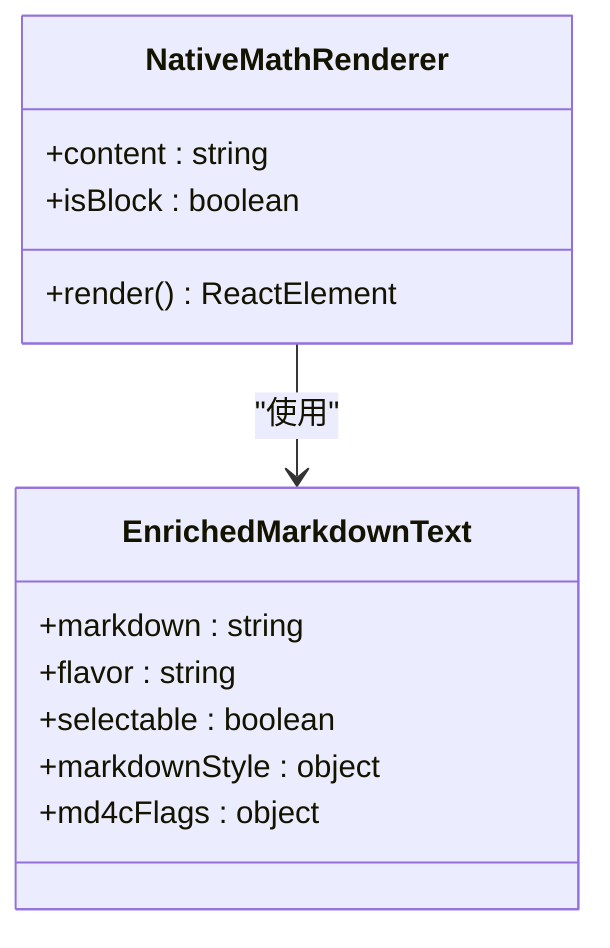
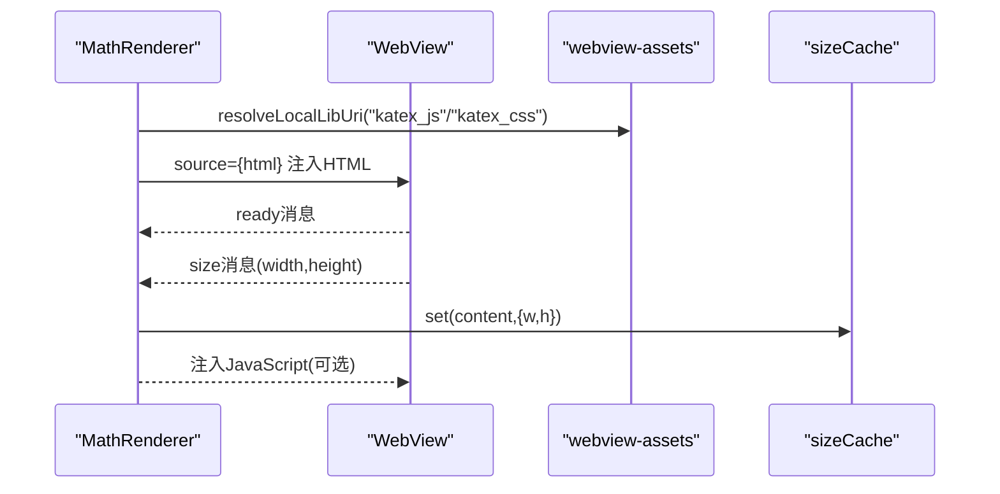
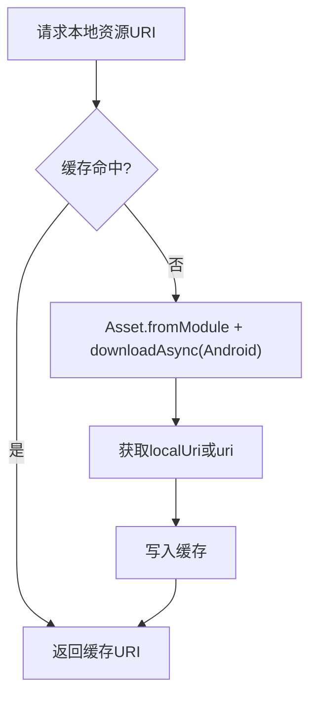
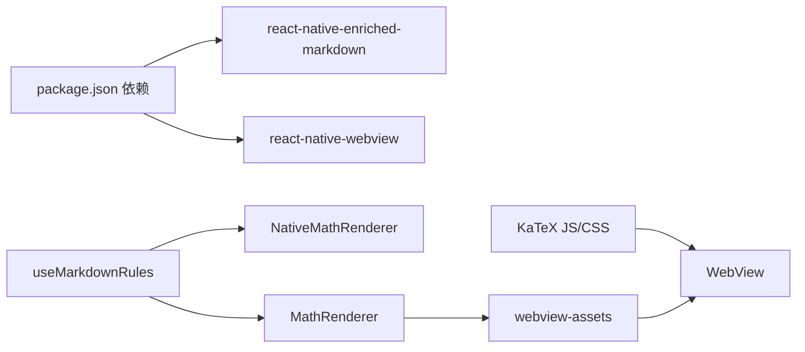

# 数学计算工具

<cite>
**本文引用的文件**
- [MathRenderer.tsx](file://src/components/chat/MathRenderer.tsx)
- [NativeMathRenderer.tsx](file://src/components/chat/NativeMathRenderer.tsx)
- [useMarkdownRules.tsx](file://src/features/chat/hooks/useMarkdownRules.tsx)
- [MarkdownBlock.tsx](file://src/features/chat/components/message/blocks/MarkdownBlock.tsx)
- [webview-assets.ts](file://src/lib/webview-assets.ts)
- [MermaidRenderer.tsx](file://src/components/chat/MermaidRenderer.tsx)
- [package.json](file://package.json)
</cite>

## 目录
1. [简介](#简介)
2. [项目结构](#项目结构)
3. [核心组件](#核心组件)
4. [架构总览](#架构总览)
5. [详细组件分析](#详细组件分析)
6. [依赖关系分析](#依赖关系分析)
7. [性能考量](#性能考量)
8. [故障排查指南](#故障排查指南)
9. [结论](#结论)
10. [附录](#附录)

## 简介
本文件面向Nexara数学计算工具的技术文档，聚焦于数学公式渲染引擎的设计与实现，涵盖：
- LaTeX解析与渲染路径（KaTeX WebView方案与原生react-native-enriched-markdown方案）
- Markdown数学语法支持（行内与块级公式识别与拆分）
- 实时渲染机制与尺寸缓存策略
- 渲染优化（预估尺寸、全局缓存、懒加载、主题适配）
- 原生数学渲染器的性能与兼容性权衡
- 调试方法与渲染质量评估标准
- 扩展接口与自定义渲染器开发指南

## 项目结构
数学渲染能力主要分布在以下模块：
- Markdown解析与规则：useMarkdownRules负责识别$...$与$$...$$，并委派给原生或WebView渲染器
- 原生渲染器：NativeMathRenderer使用react-native-enriched-markdown进行零WebView开销渲染
- WebView渲染器：MathRenderer使用KaTeX在WebView中渲染，内置尺寸缓存与消息回传
- 辅助库：webview-assets提供本地资源解析与CDN降级脚本标签
- 其他可视化：MermaidRenderer用于流程图等，便于理解多渲染器协同

**图表来源**
- [MarkdownBlock.tsx:13-51](file://src/features/chat/components/message/blocks/MarkdownBlock.tsx#L13-L51)
- [useMarkdownRules.tsx:32-126](file://src/features/chat/hooks/useMarkdownRules.tsx#L32-L126)
- [NativeMathRenderer.tsx:19-64](file://src/components/chat/NativeMathRenderer.tsx#L19-L64)
- [MathRenderer.tsx:75-260](file://src/components/chat/MathRenderer.tsx#L75-L260)
- [webview-assets.ts:26-71](file://src/lib/webview-assets.ts#L26-L71)
- [MermaidRenderer.tsx:32-252](file://src/components/chat/MermaidRenderer.tsx#L32-L252)

**章节来源**
- [MarkdownBlock.tsx:13-51](file://src/features/chat/components/message/blocks/MarkdownBlock.tsx#L13-L51)
- [useMarkdownRules.tsx:32-126](file://src/features/chat/hooks/useMarkdownRules.tsx#L32-L126)

## 核心组件
- Markdown数学语法识别与拆分：在文本节点中按$...$与$$...$$切分，分别交由原生或WebView渲染器处理
- 原生数学渲染器：NativeMathRenderer，基于react-native-enriched-markdown，零WebView开销，适合行内与块级公式
- WebView数学渲染器：MathRenderer，基于KaTeX，通过WebView渲染，内置尺寸缓存与消息回传，避免布局抖动
- 资源加载与降级：webview-assets提供本地资源URI解析与CDN降级脚本标签生成

**章节来源**
- [useMarkdownRules.tsx:83-126](file://src/features/chat/hooks/useMarkdownRules.tsx#L83-L126)
- [NativeMathRenderer.tsx:19-64](file://src/components/chat/NativeMathRenderer.tsx#L19-L64)
- [MathRenderer.tsx:75-260](file://src/components/chat/MathRenderer.tsx#L75-L260)
- [webview-assets.ts:26-71](file://src/lib/webview-assets.ts#L26-L71)

## 架构总览
数学渲染的整体流程如下：
- MarkdownBlock接收消息内容，调用useMarkdownRules生成渲染规则
- useMarkdownRules识别数学语法，将行内与块级公式分别交给NativeMathRenderer或MathRenderer
- NativeMathRenderer直接渲染；MathRenderer在WebView中初始化KaTeX，立即渲染并通过消息回传尺寸
- webview-assets负责本地资源解析与CDN降级，确保离线可用性

**图表来源**
- [MarkdownBlock.tsx:24-50](file://src/features/chat/components/message/blocks/MarkdownBlock.tsx#L24-L50)
- [useMarkdownRules.tsx:83-126](file://src/features/chat/hooks/useMarkdownRules.tsx#L83-L126)
- [NativeMathRenderer.tsx:19-64](file://src/components/chat/NativeMathRenderer.tsx#L19-L64)
- [MathRenderer.tsx:133-216](file://src/components/chat/MathRenderer.tsx#L133-L216)
- [webview-assets.ts:26-71](file://src/lib/webview-assets.ts#L26-L71)

## 详细组件分析

### 组件A：Markdown数学语法支持与公式块处理
- 识别逻辑：在段落节点中检测是否存在行内公式标记，若存在，则将文本按$...$与$$...$$切分为片段
- 渲染策略：行内公式使用原生渲染器，块级公式同样可走原生或WebView，具体取决于组件选择
- 交互细节：行内公式容器设置flexShrink与margin，块级公式容器居中并占满宽度

**图表来源**
- [useMarkdownRules.tsx:83-126](file://src/features/chat/hooks/useMarkdownRules.tsx#L83-L126)

**章节来源**
- [useMarkdownRules.tsx:44-126](file://src/features/chat/hooks/useMarkdownRules.tsx#L44-L126)

### 组件B：原生数学渲染器（react-native-enriched-markdown）
- 设计要点：零WebView开销，主题色适配，行内/块级容器样式分离
- 数学定界：若传入内容不含定界符，则根据isBlock自动包裹，确保enriched-markdown正确识别
- 样式控制：通过markdownStyle统一设置数学字体、颜色与段落行高

**图表来源**
- [NativeMathRenderer.tsx:19-64](file://src/components/chat/NativeMathRenderer.tsx#L19-L64)

**章节来源**
- [NativeMathRenderer.tsx:19-64](file://src/components/chat/NativeMathRenderer.tsx#L19-L64)

### 组件C：WebView数学渲染器（KaTeX）
- 初始化：在WebView中注入HTML，包含KaTeX CSS/JS（本地优先，失败降级CDN），立即执行渲染
- 尺寸策略：行内公式预估固定宽高，块级公式允许有限自适应；首次测量成功后写入全局Map缓存
- 消息回传：通过window.ReactNativeWebView.postMessage回传尺寸，避免布局抖动
- 优化点：预估尺寸兜底、尺寸缓存、透明背景、禁用滚动与水平滚动条、硬件加速层类型

**图表来源**
- [MathRenderer.tsx:75-260](file://src/components/chat/MathRenderer.tsx#L75-L260)
- [webview-assets.ts:26-71](file://src/lib/webview-assets.ts#L26-L71)

**章节来源**
- [MathRenderer.tsx:15-49](file://src/components/chat/MathRenderer.tsx#L15-L49)
- [MathRenderer.tsx:65-94](file://src/components/chat/MathRenderer.tsx#L65-L94)
- [MathRenderer.tsx:133-216](file://src/components/chat/MathRenderer.tsx#L133-L216)
- [MathRenderer.tsx:241-257](file://src/components/chat/MathRenderer.tsx#L241-L257)

### 组件D：资源解析与CDN降级（webview-assets）
- 本地资源：通过expo-asset将bundle/css打包为file:// URI
- 降级策略：本地URI失败时，onerror动态插入CDN脚本
- 缓存机制：对已解析URI进行缓存，避免重复下载与解析

**图表来源**
- [webview-assets.ts:26-71](file://src/lib/webview-assets.ts#L26-L71)

**章节来源**
- [webview-assets.ts:26-71](file://src/lib/webview-assets.ts#L26-L71)

### 组件E：Mermaid渲染器（对比参考）
- 作用：展示WebView渲染器的通用模式（懒加载卡片、全屏交互、主题与安全级别）
- 对比意义：MathRenderer的尺寸回传与懒加载策略可借鉴Mermaid的预览高度上报与全屏模式

**章节来源**
- [MermaidRenderer.tsx:32-252](file://src/components/chat/MermaidRenderer.tsx#L32-L252)

## 依赖关系分析
- 依赖声明：react-native-enriched-markdown、react-native-webview、KaTeX资源（CSS/JS）
- 关键依赖链：
  - useMarkdownRules → NativeMathRenderer（原生）
  - useMarkdownRules → MathRenderer（WebView）
  - MathRenderer → webview-assets → KaTeX资源
  - MermaidRenderer与MathRenderer共享WebView渲染范式

**图表来源**
- [package.json:69-84](file://package.json#L69-L84)
- [webview-assets.ts:5-10](file://src/lib/webview-assets.ts#L5-L10)
- [useMarkdownRules.tsx:18-21](file://src/features/chat/hooks/useMarkdownRules.tsx#L18-L21)
- [MathRenderer.tsx:79-85](file://src/components/chat/MathRenderer.tsx#L79-L85)

**章节来源**
- [package.json:69-84](file://package.json#L69-L84)

## 性能考量
- 原生vsWebView权衡
  - 原生（NativeMathRenderer）：零WebView开销、内存占用低、流式输出体验佳，适合大量行内公式场景
  - WebView（MathRenderer）：功能完备、生态成熟，但内存与启动开销较高，需配合尺寸缓存与懒加载
- 渲染优化
  - 预估尺寸：行内公式按字符数、命令数、上下标、花括号等特征估算宽高，避免测量抖动
  - 全局尺寸缓存：首次测量成功后写入Map，后续复用，减少重复渲染
  - 透明背景与禁用滚动：降低绘制开销，提升滚动流畅度
- 资源加载
  - 本地优先+CDN降级，保障离线可用性与稳定性
  - Android平台显式downloadAsync，避免debug模式下资源未解压导致的失败

**章节来源**
- [NativeMathRenderer.tsx:11-18](file://src/components/chat/NativeMathRenderer.tsx#L11-L18)
- [MathRenderer.tsx:15-49](file://src/components/chat/MathRenderer.tsx#L15-L49)
- [MathRenderer.tsx:65-94](file://src/components/chat/MathRenderer.tsx#L65-L94)
- [webview-assets.ts:32-49](file://src/lib/webview-assets.ts#L32-L49)

## 故障排查指南
- 公式不显示或空白
  - 检查WebView是否收到“ready”消息；确认本地资源URI解析成功
  - 若仅出现闪烁，确认尺寸回传是否触发，sizeCache是否写入
- 布局抖动或重排
  - 确认行内公式是否使用预估尺寸；检查content变化时缓存是否命中
- 渲染质量与清晰度
  - 检查KaTeX CSS/JS版本与CDN降级是否生效；确认主题色与字号设置
- 调试步骤
  - 打开WebView调试（Android/iOS平台）查看console日志
  - 在MathRenderer中监听onMessage，打印size/error消息
  - 在NativeMathRenderer中验证定界符包裹与主题色

**章节来源**
- [MathRenderer.tsx:241-257](file://src/components/chat/MathRenderer.tsx#L241-L257)
- [webview-assets.ts:61-71](file://src/lib/webview-assets.ts#L61-L71)

## 结论
Nexara数学渲染体系采用“原生优先、WebView兜底”的双轨策略：
- 行内公式优先使用原生渲染器，获得更低内存与更好的流式体验
- 块级公式与复杂场景使用WebView+KaTeX，确保渲染一致性与功能完备
- 通过预估尺寸、全局缓存与资源降级，兼顾性能与稳定性
- 扩展性强：新增渲染器可复用WebView模式或原生渲染器模式，保持一致的API与主题适配

## 附录

### 数学公式渲染质量评估标准
- 正确性：LaTeX命令识别率、边界情况（上下标、分数、根号、积分）覆盖度
- 渲染一致性：与桌面端LaTeX/KaTeX渲染结果对比，误差阈值
- 可读性：字号、行距、颜色与主题匹配度
- 性能：首帧时间、内存占用、滚动流畅度、离线可用性

### 自定义渲染器开发指南
- 原生渲染器模式
  - 适用：轻量公式、频繁渲染、低内存要求
  - 接口：接收content与isBlock，返回ReactElement
  - 注意：确保定界符处理与主题色一致
- WebView渲染器模式
  - 适用：复杂公式、完整MathML/LaTeX生态
  - 接口：返回WebView组件，注入HTML并回传尺寸
  - 注意：资源解析与CDN降级、尺寸缓存、错误回退
- 通用规范
  - 主题适配：深浅色切换时颜色与字号一致
  - 性能优化：预估尺寸、懒加载、缓存复用
  - 错误处理：捕获渲染异常，降级为纯文本或占位

**章节来源**
- [NativeMathRenderer.tsx:19-64](file://src/components/chat/NativeMathRenderer.tsx#L19-L64)
- [MathRenderer.tsx:133-216](file://src/components/chat/MathRenderer.tsx#L133-L216)
- [MermaidRenderer.tsx:52-115](file://src/components/chat/MermaidRenderer.tsx#L52-L115)