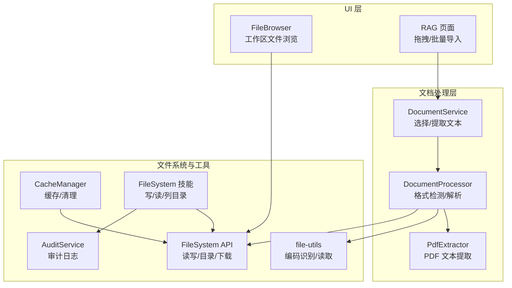
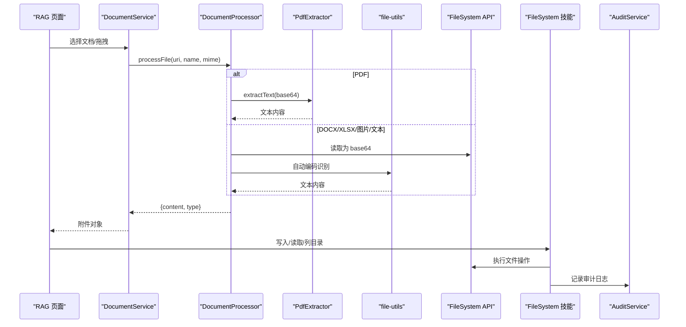
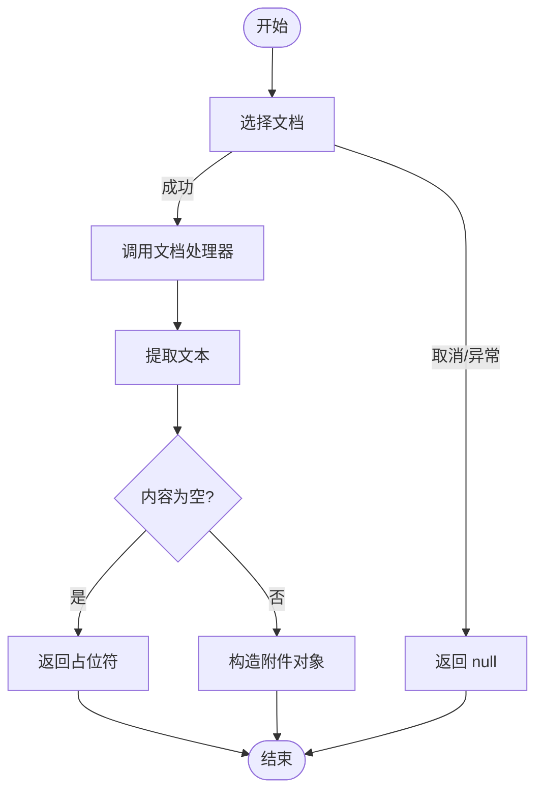
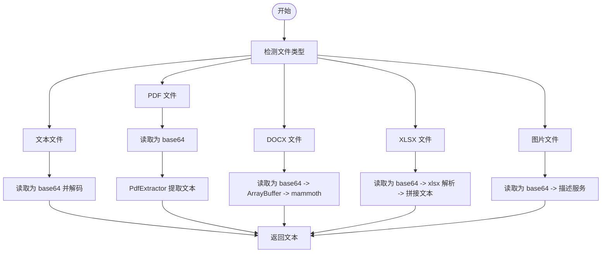
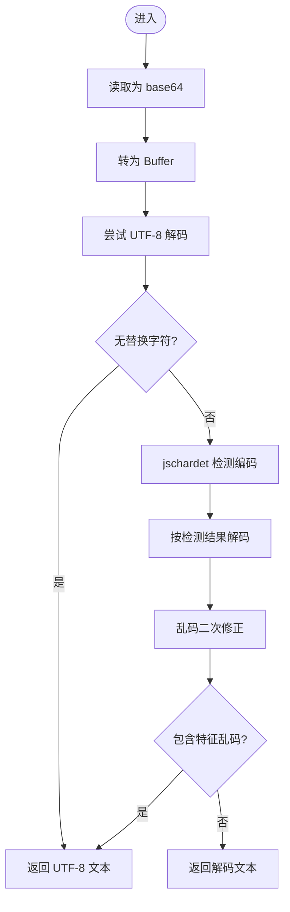
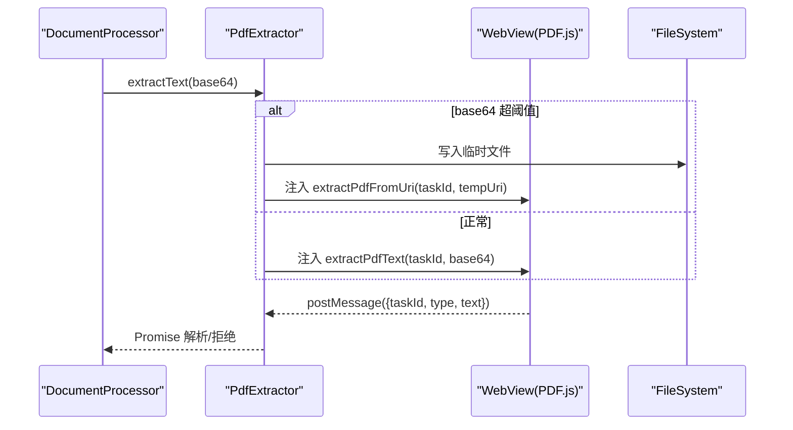
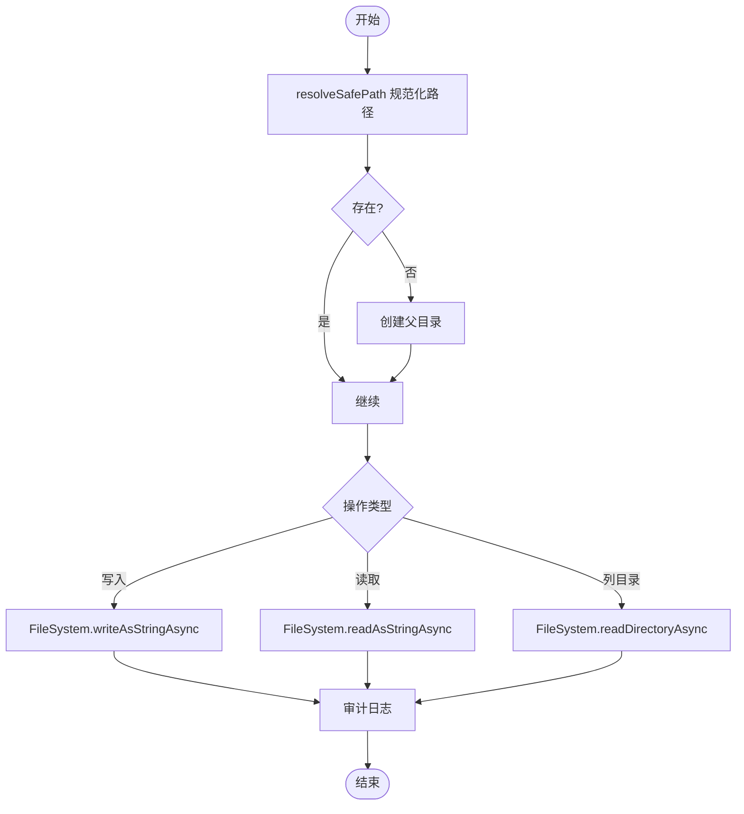
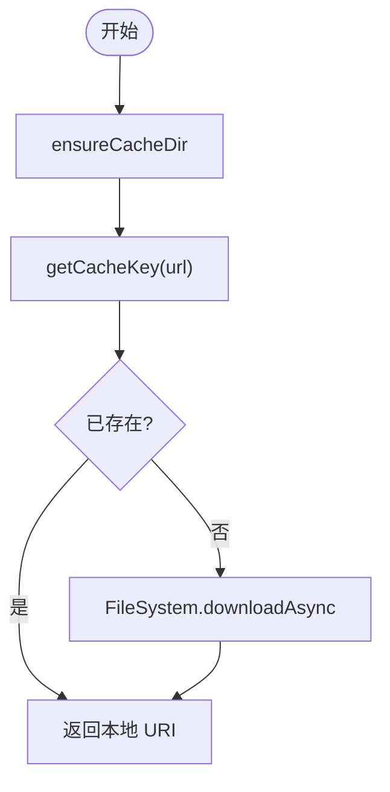
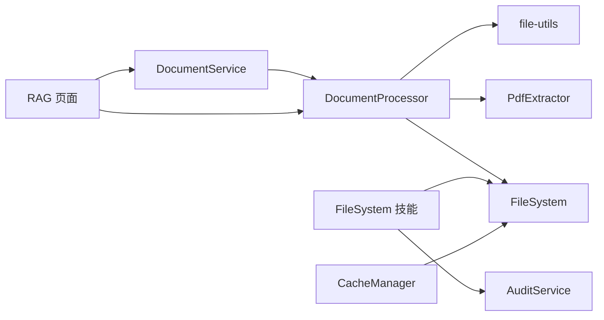

# 文件处理工具

<cite>
**本文引用的文件**
- [src/lib/file/document-service.ts](file://src/lib/file/document-service.ts)
- [src/lib/rag/document-processor.ts](file://src/lib/rag/document-processor.ts)
- [src/lib/file-utils.ts](file://src/lib/file-utils.ts)
- [src/lib/cache/cache-manager.ts](file://src/lib/cache/cache-manager.ts)
- [src/components/rag/PdfExtractor.tsx](file://src/components/rag/PdfExtractor.tsx)
- [app/(tabs)/rag.tsx](file://app/(tabs)/rag.tsx)
- [src/features/chat/components/WorkspaceSheet/FileBrowser.tsx](file://src/features/chat/components/WorkspaceSheet/FileBrowser.tsx)
- [src/lib/skills/definitions/filesystem.ts](file://src/lib/skills/definitions/filesystem.ts)
- [src/lib/services/audit-service.ts](file://src/lib/services/audit-service.ts)
- [scripts/mocks/expo-file-system.ts](file://scripts/mocks/expo-file-system.ts)
</cite>

## 目录
1. [简介](#简介)
2. [项目结构](#项目结构)
3. [核心组件](#核心组件)
4. [架构总览](#架构总览)
5. [详细组件分析](#详细组件分析)
6. [依赖关系分析](#依赖关系分析)
7. [性能考量](#性能考量)
8. [故障排查指南](#故障排查指南)
9. [结论](#结论)
10. [附录](#附录)

## 简介
本文件处理工具围绕 React Native 环境下的文件系统操作与文档处理能力构建，覆盖以下关键领域：
- 文件系统操作：读写、目录浏览、批量处理与错误处理
- 文档处理：格式检测、内容提取、图像描述、PDF 解析
- 缓存机制：远程资源本地化缓存与清理
- 安全验证：路径沙箱、审计日志与风险控制
- 性能优化：编码自动识别、大文件处理、批处理与超时控制

## 项目结构
与文件处理相关的关键模块分布如下：
- 文件服务与工具：document-service、file-utils
- 文档处理管线：document-processor、PdfExtractor
- 文件系统技能与审计：filesystem 技能定义、audit-service
- 缓存管理：cache-manager
- UI 层集成：FileBrowser、RAG 页面中的拖拽与批量导入

**图示来源**
- [src/features/chat/components/WorkspaceSheet/FileBrowser.tsx:1-227](file://src/features/chat/components/WorkspaceSheet/FileBrowser.tsx#L1-L227)
- [app/(tabs)/rag.tsx](file://app/(tabs)/rag.tsx#L530-L920)
- [src/lib/file/document-service.ts:1-67](file://src/lib/file/document-service.ts#L1-L67)
- [src/lib/rag/document-processor.ts:1-141](file://src/lib/rag/document-processor.ts#L1-L141)
- [src/components/rag/PdfExtractor.tsx:1-182](file://src/components/rag/PdfExtractor.tsx#L1-L182)
- [src/lib/file-utils.ts:1-109](file://src/lib/file-utils.ts#L1-L109)
- [src/lib/cache/cache-manager.ts:1-116](file://src/lib/cache/cache-manager.ts#L1-L116)
- [src/lib/skills/definitions/filesystem.ts:1-318](file://src/lib/skills/definitions/filesystem.ts#L1-L318)
- [src/lib/services/audit-service.ts:1-202](file://src/lib/services/audit-service.ts#L1-L202)

**章节来源**
- [src/lib/file/document-service.ts:1-67](file://src/lib/file/document-service.ts#L1-L67)
- [src/lib/rag/document-processor.ts:1-141](file://src/lib/rag/document-processor.ts#L1-L141)
- [src/lib/file-utils.ts:1-109](file://src/lib/file-utils.ts#L1-L109)
- [src/lib/cache/cache-manager.ts:1-116](file://src/lib/cache/cache-manager.ts#L1-L116)
- [src/components/rag/PdfExtractor.tsx:1-182](file://src/components/rag/PdfExtractor.tsx#L1-L182)
- [app/(tabs)/rag.tsx](file://app/(tabs)/rag.tsx#L530-L920)
- [src/features/chat/components/WorkspaceSheet/FileBrowser.tsx:1-227](file://src/features/chat/components/WorkspaceSheet/FileBrowser.tsx#L1-L227)
- [src/lib/skills/definitions/filesystem.ts:1-318](file://src/lib/skills/definitions/filesystem.ts#L1-L318)
- [src/lib/services/audit-service.ts:1-202](file://src/lib/services/audit-service.ts#L1-L202)

## 核心组件
- 文档服务：封装系统文档选择与文本提取，统一返回聊天附件对象
- 文档处理器：根据扩展名与 MIME 类型判断文件类型，分派至对应解析器（文本、PDF、DOCX、XLSX、图片）
- 文件工具：自动识别编码（UTF-8/GBK/其他），处理乱码特征，提供统一读取接口
- PDF 提取器：基于 WebView + PDF.js 在 RN 中实现 PDF 文本提取，支持大文件临时落盘
- 文件系统技能：在受控沙箱内执行读写与目录列举，记录审计日志
- 缓存管理：远程资源本地化缓存，提供查询、下载与清理
- 审计服务：异步队列化写入数据库，支持查询与统计

**章节来源**
- [src/lib/file/document-service.ts:1-67](file://src/lib/file/document-service.ts#L1-L67)
- [src/lib/rag/document-processor.ts:1-141](file://src/lib/rag/document-processor.ts#L1-L141)
- [src/lib/file-utils.ts:1-109](file://src/lib/file-utils.ts#L1-L109)
- [src/components/rag/PdfExtractor.tsx:1-182](file://src/components/rag/PdfExtractor.tsx#L1-L182)
- [src/lib/skills/definitions/filesystem.ts:1-318](file://src/lib/skills/definitions/filesystem.ts#L1-L318)
- [src/lib/cache/cache-manager.ts:1-116](file://src/lib/cache/cache-manager.ts#L1-L116)
- [src/lib/services/audit-service.ts:1-202](file://src/lib/services/audit-service.ts#L1-L202)

## 架构总览
文件处理从 UI 层触发，经由文档服务进入文档处理器，按文件类型进行解析；对于 PDF 通过 PdfExtractor 使用 WebView + PDF.js 提取文本；文本内容统一经由文件工具进行编码识别与读取；写入与目录操作通过 FileSystem 技能在沙箱内执行，并记录审计日志；缓存管理负责远程资源的本地化存储。

**图示来源**
- [app/(tabs)/rag.tsx](file://app/(tabs)/rag.tsx#L530-L920)
- [src/lib/file/document-service.ts:1-67](file://src/lib/file/document-service.ts#L1-L67)
- [src/lib/rag/document-processor.ts:1-141](file://src/lib/rag/document-processor.ts#L1-L141)
- [src/components/rag/PdfExtractor.tsx:1-182](file://src/components/rag/PdfExtractor.tsx#L1-L182)
- [src/lib/file-utils.ts:1-109](file://src/lib/file-utils.ts#L1-L109)
- [src/lib/skills/definitions/filesystem.ts:1-318](file://src/lib/skills/definitions/filesystem.ts#L1-L318)
- [src/lib/services/audit-service.ts:1-202](file://src/lib/services/audit-service.ts#L1-L202)

## 详细组件分析

### 文档服务（DocumentService）
- 功能要点
  - 通过系统文档选择器获取附件，设置复制到缓存目录
  - 对选定文件调用文档处理器进行内容提取
  - 统一返回包含名称、大小、MIME、URI 的附件对象
- 错误处理
  - 选择取消或异常时返回空值
  - 提取失败时返回占位字符串，避免中断流程

**图示来源**
- [src/lib/file/document-service.ts:1-67](file://src/lib/file/document-service.ts#L1-L67)

**章节来源**
- [src/lib/file/document-service.ts:1-67](file://src/lib/file/document-service.ts#L1-L67)

### 文档处理器（DocumentProcessor）
- 功能要点
  - 文件类型检测：依据扩展名与 MIME 判断 text/pdf/docx/xlsx/image
  - 文本文件：通过文件工具读取并自动编码识别
  - PDF：读取为 base64 后交由 PdfExtractor 提取文本
  - DOCX：读取为 base64 并转换为 ArrayBuffer，使用 mammoth 提取纯文本
  - XLSX：读取为 base64，逐表转文本并拼接
  - 图片：读取为 base64，调用图像描述服务生成描述文本
- 错误处理
  - PDF 未初始化时报错
  - 图像描述失败时返回空内容，由上层检查拦截

**图示来源**
- [src/lib/rag/document-processor.ts:1-141](file://src/lib/rag/document-processor.ts#L1-L141)
- [src/components/rag/PdfExtractor.tsx:1-182](file://src/components/rag/PdfExtractor.tsx#L1-L182)
- [src/lib/file-utils.ts:1-109](file://src/lib/file-utils.ts#L1-L109)

**章节来源**
- [src/lib/rag/document-processor.ts:1-141](file://src/lib/rag/document-processor.ts#L1-L141)
- [src/components/rag/PdfExtractor.tsx:1-182](file://src/components/rag/PdfExtractor.tsx#L1-L182)
- [src/lib/file-utils.ts:1-109](file://src/lib/file-utils.ts#L1-L109)

### 文件工具（file-utils）
- 功能要点
  - 读取文件为 base64，再转 Buffer
  - 优先 UTF-8 解码，若包含替换字符则使用 jschardet 检测编码
  - 若检测到典型乱码特征，强制回退到 UTF-8 解码
  - 提供文件大小格式化工具
- 性能与可靠性
  - 避免对大文件进行多次解码尝试
  - 乱码二次修正降低误判概率

**图示来源**
- [src/lib/file-utils.ts:1-109](file://src/lib/file-utils.ts#L1-L109)

**章节来源**
- [src/lib/file-utils.ts:1-109](file://src/lib/file-utils.ts#L1-L109)

### PDF 提取器（PdfExtractor）
- 功能要点
  - WebView 内嵌 PDF.js，支持 base64 与文件 URI 两种输入
  - 大于阈值的 PDF 自动写入缓存临时文件，避免内存压力
  - 任务管理：生成唯一 taskId，超时清理，消息通道回传结果
- 错误处理
  - 超时抛出明确错误
  - WebView 消息解析异常捕获

**图示来源**
- [src/components/rag/PdfExtractor.tsx:1-182](file://src/components/rag/PdfExtractor.tsx#L1-L182)

**章节来源**
- [src/components/rag/PdfExtractor.tsx:1-182](file://src/components/rag/PdfExtractor.tsx#L1-L182)

### 文件系统技能（Write/Read/List）
- 功能要点
  - 路径安全：统一在沙箱目录下执行，禁止父目录访问
  - 写入：自动创建父目录，支持 UTF-8/base64 编码
  - 读取：支持 UTF-8/base64，返回内容与大小
  - 列目录：返回条目清单（含类型与大小）
  - 审计：记录操作动作、资源路径、状态与元数据
- 风险控制
  - 写入标记为高风险，严格沙箱与审计
  - RAG 同步：写入后尝试同步到知识库文档

**图示来源**
- [src/lib/skills/definitions/filesystem.ts:1-318](file://src/lib/skills/definitions/filesystem.ts#L1-L318)
- [src/lib/services/audit-service.ts:1-202](file://src/lib/services/audit-service.ts#L1-L202)

**章节来源**
- [src/lib/skills/definitions/filesystem.ts:1-318](file://src/lib/skills/definitions/filesystem.ts#L1-L318)
- [src/lib/services/audit-service.ts:1-202](file://src/lib/services/audit-service.ts#L1-L202)

### 缓存管理（CacheManager）
- 功能要点
  - 确保存在缓存目录，生成带哈希的缓存文件名
  - 查询缓存、下载并缓存、清空缓存
  - 失败时抛出错误，便于 UI 层降级处理
- 使用场景
  - 远程 SVG/图标等静态资源本地化，提升离线可用性

**图示来源**
- [src/lib/cache/cache-manager.ts:1-116](file://src/lib/cache/cache-manager.ts#L1-L116)

**章节来源**
- [src/lib/cache/cache-manager.ts:1-116](file://src/lib/cache/cache-manager.ts#L1-L116)

### 工作区文件浏览器（FileBrowser）
- 功能要点
  - 基于 documentDirectory 下的 agent_sandbox/workspace 显示文件树
  - 支持上一级导航、刷新、排序与大小格式化展示
- 安全与体验
  - 隐藏隐藏文件，目录优先排序
  - 加载/刷新状态提示

**章节来源**
- [src/features/chat/components/WorkspaceSheet/FileBrowser.tsx:1-227](file://src/features/chat/components/WorkspaceSheet/FileBrowser.tsx#L1-L227)

### RAG 页面中的文件导入与批处理
- 功能要点
  - 支持系统文档选择与拖拽导入
  - 通过文档处理器统一处理，生成内容与类型
  - 图片文件额外保存缩略图以便 UI 展示
  - 批量处理控制并发与延迟，确保 PDF 顺序处理
- 错误处理
  - 空内容抛错并提示
  - 成功/失败统计与 Toast 提示

**章节来源**
- [app/(tabs)/rag.tsx](file://app/(tabs)/rag.tsx#L530-L920)

## 依赖关系分析
- 组件耦合
  - DocumentService 依赖 DocumentProcessor
  - DocumentProcessor 依赖 FileSystem、file-utils、PdfExtractor
  - FileSystem 技能依赖 FileSystem 与审计服务
  - CacheManager 依赖 FileSystem
  - RAG 页面同时依赖 DocumentService 与 DocumentProcessor
- 外部依赖
  - PDF.js（WebView 内嵌）
  - mammoth（DOCX 解析）
  - xlsx（XLSX 解析）
  - iconv-lite/jschardet（编码识别）

**图示来源**
- [src/lib/file/document-service.ts:1-67](file://src/lib/file/document-service.ts#L1-L67)
- [src/lib/rag/document-processor.ts:1-141](file://src/lib/rag/document-processor.ts#L1-L141)
- [src/lib/file-utils.ts:1-109](file://src/lib/file-utils.ts#L1-L109)
- [src/components/rag/PdfExtractor.tsx:1-182](file://src/components/rag/PdfExtractor.tsx#L1-L182)
- [src/lib/skills/definitions/filesystem.ts:1-318](file://src/lib/skills/definitions/filesystem.ts#L1-L318)
- [src/lib/services/audit-service.ts:1-202](file://src/lib/services/audit-service.ts#L1-L202)
- [src/lib/cache/cache-manager.ts:1-116](file://src/lib/cache/cache-manager.ts#L1-L116)
- [app/(tabs)/rag.tsx](file://app/(tabs)/rag.tsx#L530-L920)

**章节来源**
- [src/lib/file/document-service.ts:1-67](file://src/lib/file/document-service.ts#L1-L67)
- [src/lib/rag/document-processor.ts:1-141](file://src/lib/rag/document-processor.ts#L1-L141)
- [src/lib/file-utils.ts:1-109](file://src/lib/file-utils.ts#L1-L109)
- [src/components/rag/PdfExtractor.tsx:1-182](file://src/components/rag/PdfExtractor.tsx#L1-L182)
- [src/lib/skills/definitions/filesystem.ts:1-318](file://src/lib/skills/definitions/filesystem.ts#L1-L318)
- [src/lib/services/audit-service.ts:1-202](file://src/lib/services/audit-service.ts#L1-L202)
- [src/lib/cache/cache-manager.ts:1-116](file://src/lib/cache/cache-manager.ts#L1-L116)
- [app/(tabs)/rag.tsx](file://app/(tabs)/rag.tsx#L530-L920)

## 性能考量
- 编码识别
  - 优先 UTF-8，失败后检测编码并进行二次修正，减少乱码带来的后续处理成本
- 大文件与内存
  - PDF 大文件写入缓存临时文件，避免 WebView 内存压力
  - 文档处理器对 DOCX 使用 ArrayBuffer，避免不必要的字符串转换
- 批处理与并发
  - RAG 页面批量导入采用串行（PDF 顺序）与延迟，平衡性能与稳定性
- 缓存策略
  - 远程资源本地化缓存，减少网络请求与重复下载

[本节为通用性能讨论，不直接分析具体文件，故无章节来源]

## 故障排查指南
- 文档选择失败
  - 检查系统文档选择器返回状态与异常日志
  - 确认附件复制到缓存目录成功
- 文本提取为空
  - 检查文档处理器返回内容是否为空
  - 对 PDF 确认 PdfExtractor 初始化与 WebView 可用
- 编码乱码
  - 查看编码识别日志与二次修正逻辑
  - 确认文件实际编码与 jschardet 检测结果
- 文件写入失败
  - 检查沙箱路径与父目录创建
  - 查看审计日志中的错误信息
- 缓存下载失败
  - 检查网络与缓存目录权限
  - 失败时抛出错误，UI 层应有降级处理

**章节来源**
- [src/lib/file/document-service.ts:1-67](file://src/lib/file/document-service.ts#L1-L67)
- [src/lib/rag/document-processor.ts:1-141](file://src/lib/rag/document-processor.ts#L1-L141)
- [src/lib/file-utils.ts:1-109](file://src/lib/file-utils.ts#L1-L109)
- [src/components/rag/PdfExtractor.tsx:1-182](file://src/components/rag/PdfExtractor.tsx#L1-L182)
- [src/lib/skills/definitions/filesystem.ts:1-318](file://src/lib/skills/definitions/filesystem.ts#L1-L318)
- [src/lib/services/audit-service.ts:1-202](file://src/lib/services/audit-service.ts#L1-L202)
- [src/lib/cache/cache-manager.ts:1-116](file://src/lib/cache/cache-manager.ts#L1-L116)

## 结论
该文件处理工具通过清晰的职责划分与强安全约束，实现了跨格式文档的稳定解析与高效缓存。结合审计日志与批处理策略，在保证安全性的同时兼顾了性能与用户体验。建议在生产环境中持续监控审计日志与缓存命中率，并针对特定格式（如复杂表格）进一步优化解析策略。

[本节为总结性内容，不直接分析具体文件，故无章节来源]

## 附录
- 最佳实践
  - 优先使用文档服务与文档处理器统一切入点
  - 对大文件（PDF/图片）启用缓存与临时落盘
  - 写入前确保父目录存在，遵循沙箱路径规则
  - 对外部依赖（PDF.js、mammoth、xlsx）版本保持兼容
- 使用场景示例
  - 系统文档选择：通过 DocumentService 获取附件并提取文本
  - 批量导入：RAG 页面拖拽/选择多文件，按序处理并入库
  - 图片描述：对图片文件生成描述文本，便于检索与摘要

[本节为概念性内容，不直接分析具体文件，故无章节来源]