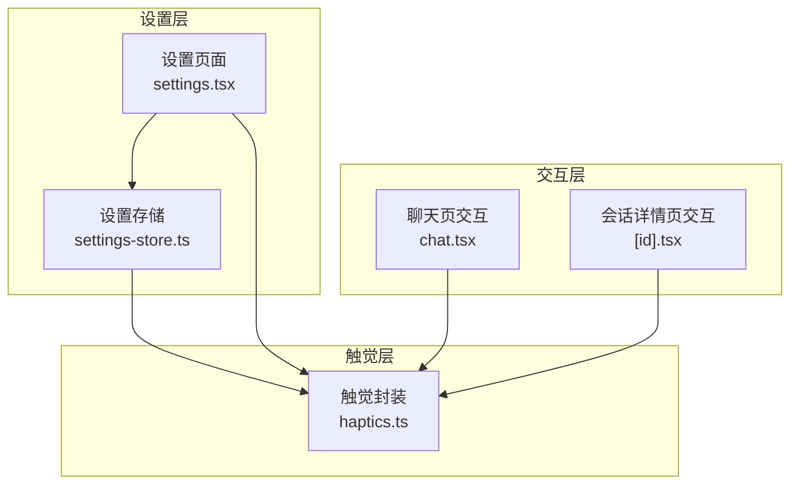
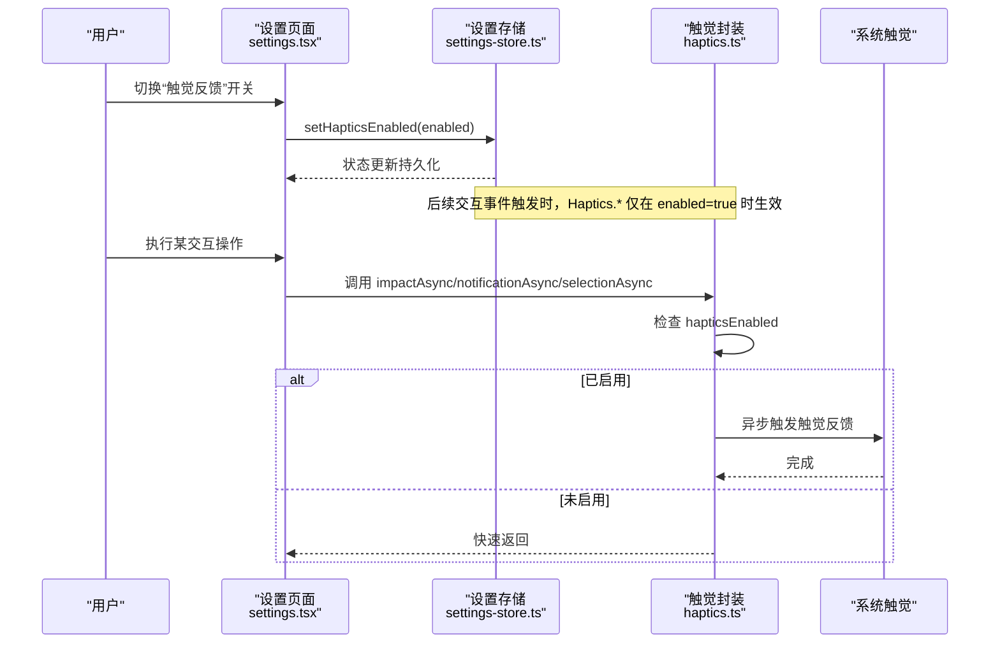
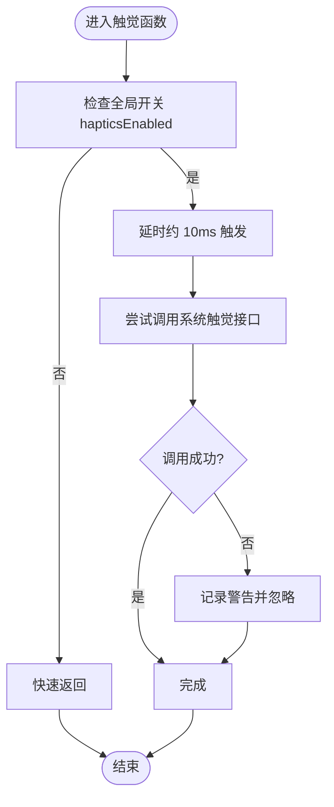
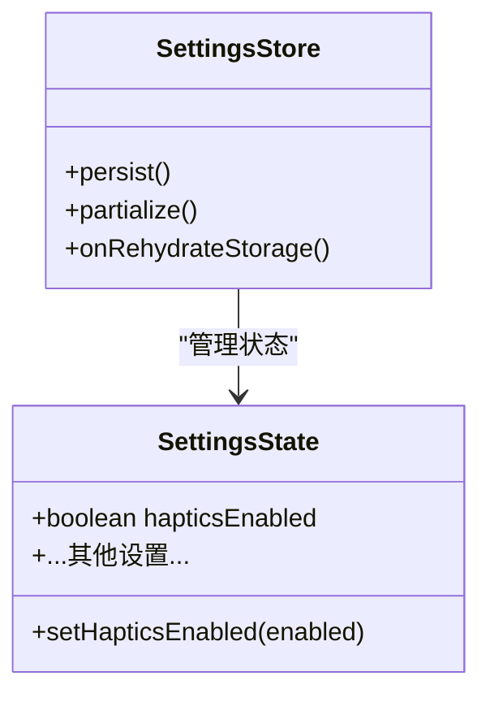
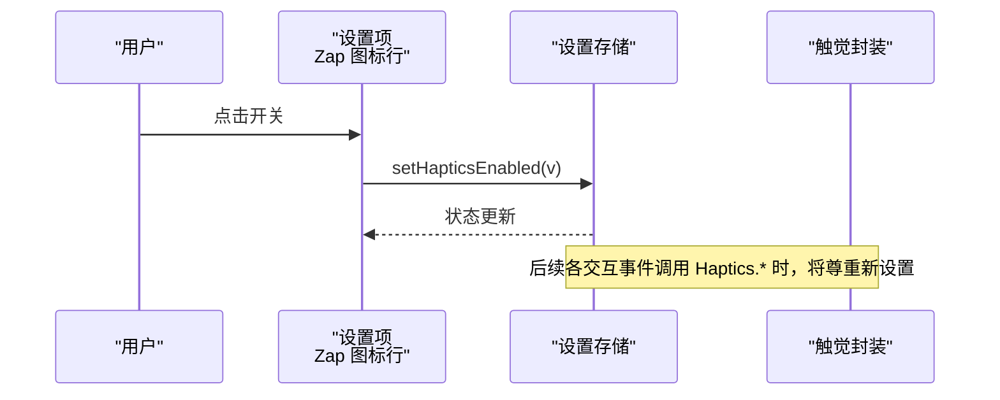
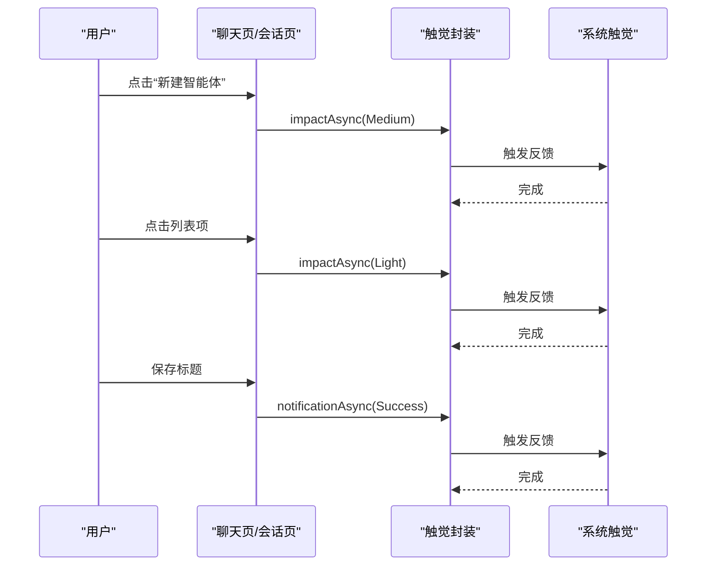
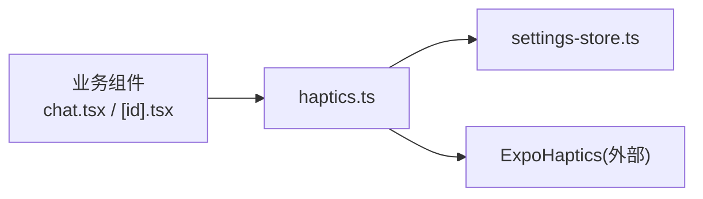

# 触觉反馈工具

<cite>
**本文引用的文件**
- [src/lib/haptics.ts](file://src/lib/haptics.ts)
- [src/store/settings-store.ts](file://src/store/settings-store.ts)
- [app/(tabs)/settings.tsx](file://app/(tabs)/settings.tsx)
- [app/(tabs)/chat.tsx](file://app/(tabs)/chat.tsx)
- [app/chat/[id].tsx](file://app/chat/[id].tsx)
</cite>

## 目录
1. [简介](#简介)
2. [项目结构](#项目结构)
3. [核心组件](#核心组件)
4. [架构总览](#架构总览)
5. [详细组件分析](#详细组件分析)
6. [依赖关系分析](#依赖关系分析)
7. [性能考量](#性能考量)
8. [故障排查指南](#故障排查指南)
9. [结论](#结论)
10. [附录](#附录)

## 简介
本文件为 Nexara 触觉反馈工具的技术文档，聚焦于触觉反馈系统在应用中的实现与集成方式。内容涵盖：
- 触觉反馈的全局封装与调用点
- 不同触觉效果（选择、通知、冲击）的使用场景与设计理念
- 时序管理与延迟策略
- 与用户交互的协调机制
- 可访问性与个性化配置
- 测试与用户体验评估建议

## 项目结构
触觉反馈相关代码主要分布在以下位置：
- 全局触觉封装：src/lib/haptics.ts
- 设置存储与持久化：src/store/settings-store.ts
- 设置页面与交互入口：app/(tabs)/settings.tsx
- 典型交互场景（聊天页等）：app/(tabs)/chat.tsx、app/chat/[id].tsx

图表来源
- [src/lib/haptics.ts:1-51](file://src/lib/haptics.ts#L1-L51)
- [src/store/settings-store.ts:19-93](file://src/store/settings-store.ts#L19-L93)
- [app/(tabs)/settings.tsx:550-562](file://app/(tabs)/settings.tsx#L550-L562)
- [app/(tabs)/chat.tsx:84-100](file://app/(tabs)/chat.tsx#L84-L100)
- [app/chat/[id].tsx:388-397](file://app/chat/[id].tsx#L388-L397)

章节来源
- [src/lib/haptics.ts:1-51](file://src/lib/haptics.ts#L1-L51)
- [src/store/settings-store.ts:19-93](file://src/store/settings-store.ts#L19-L93)
- [app/(tabs)/settings.tsx:550-562](file://app/(tabs)/settings.tsx#L550-L562)
- [app/(tabs)/chat.tsx:84-100](file://app/(tabs)/chat.tsx#L84-L100)
- [app/chat/[id].tsx:388-397](file://app/chat/[id].tsx#L388-L397)

## 核心组件
- 触觉封装模块（haptics.ts）
  - 封装 selectionAsync、notificationAsync、impactAsync 三类触觉反馈，并统一遵循全局开关 hapticsEnabled。
  - 对外导出 ExpoHaptics 的常量类型，便于上层直接使用。
  - 通过 setTimeout 延迟触发，避免与 UI 渲染关键路径竞争。
- 设置存储（settings-store.ts）
  - 提供 hapticsEnabled 字段与 setHapticsEnabled 方法，支持持久化与水合（hydrate）。
- 设置页面（settings.tsx）
  - 在“外观与主题”分组中提供触觉反馈开关项，绑定到设置存储。

章节来源
- [src/lib/haptics.ts:13-47](file://src/lib/haptics.ts#L13-L47)
- [src/lib/haptics.ts:49-51](file://src/lib/haptics.ts#L49-L51)
- [src/store/settings-store.ts:19-93](file://src/store/settings-store.ts#L19-L93)
- [app/(tabs)/settings.tsx:550-562](file://app/(tabs)/settings.tsx#L550-L562)

## 架构总览
触觉反馈的调用链路自上而下如下：
- 用户在设置页面切换触觉开关
- 设置变更写入设置存储并持久化
- 各业务组件在交互事件发生时调用触觉封装函数
- 触觉封装根据全局开关决定是否执行，并在 UI 关键路径之外异步触发

图表来源
- [app/(tabs)/settings.tsx:550-562](file://app/(tabs)/settings.tsx#L550-L562)
- [src/store/settings-store.ts:92-93](file://src/store/settings-store.ts#L92-L93)
- [src/lib/haptics.ts:9-11](file://src/lib/haptics.ts#L9-L11)
- [src/lib/haptics.ts:13-47](file://src/lib/haptics.ts#L13-L47)

## 详细组件分析

### 触觉封装模块（haptics.ts）
- 设计要点
  - 全局开关：isHapticsEnabled 读取设置存储中的 hapticsEnabled，确保所有调用点一致的行为。
  - 三类反馈：
    - selectionAsync：用于选择类交互（如列表项点击、切换等）。
    - notificationAsync：用于结果反馈（如成功、警告、错误）。
    - impactAsync：用于强调性反馈（如提交、确认、重要动作）。
  - 延迟策略：统一使用短延迟（约 10ms）触发，避免与 UI 动画/渲染抢占资源。
  - 错误兜底：捕获异常并打印警告，保证不影响主流程。
- 复杂度与性能
  - 时间复杂度：O(1)；空间复杂度：O(1)。
  - 延迟触发避免阻塞主线程，适合高频调用场景。

图表来源
- [src/lib/haptics.ts:9-11](file://src/lib/haptics.ts#L9-L11)
- [src/lib/haptics.ts:13-47](file://src/lib/haptics.ts#L13-L47)

章节来源
- [src/lib/haptics.ts:1-51](file://src/lib/haptics.ts#L1-L51)

### 设置存储（settings-store.ts）
- 设计要点
  - hapticsEnabled 作为布尔字段，支持 setHapticsEnabled 更新。
  - 通过持久化中间件将设置写入本地存储，并在应用启动后进行水合。
  - 部分序列化字段包含 hapticsEnabled，确保跨版本兼容与迁移。
- 复杂度与性能
  - 状态更新为 O(1)；持久化写入为 I/O，但发生在后台或空闲时机。

图表来源
- [src/store/settings-store.ts:19-93](file://src/store/settings-store.ts#L19-L93)
- [src/store/settings-store.ts:208-242](file://src/store/settings-store.ts#L208-L242)

章节来源
- [src/store/settings-store.ts:19-93](file://src/store/settings-store.ts#L19-L93)
- [src/store/settings-store.ts:208-242](file://src/store/settings-store.ts#L208-L242)

### 设置页面（settings.tsx）
- 设计要点
  - 在“外观与主题”分组中提供触觉反馈开关项，标题与描述国际化。
  - 绑定到 hapticsEnabled 与 setHapticsEnabled，实现即时生效。
- 复杂度与性能
  - UI 层为 O(1) 交互；设置变更通过存储持久化，不影响当前交互。

图表来源
- [app/(tabs)/settings.tsx:550-562](file://app/(tabs)/settings.tsx#L550-L562)
- [src/store/settings-store.ts:92-93](file://src/store/settings-store.ts#L92-L93)
- [src/lib/haptics.ts:9-11](file://src/lib/haptics.ts#L9-L11)

章节来源
- [app/(tabs)/settings.tsx:550-562](file://app/(tabs)/settings.tsx#L550-L562)

### 典型交互场景（chat.tsx 与 [id].tsx）
- 场景一：新建/进入智能体、悬浮按钮点击
  - 使用 Medium 冲击反馈，强调重要入口与动作完成。
- 场景二：列表项点击、主题切换、菜单项选择
  - 使用 Light 冲击反馈，提供轻量确认感。
- 场景三：标题保存、删除消息、知识图谱提取成功
  - 使用通知反馈（Success），传达操作结果。
- 场景四：手动向量化、摘要生成、重新生成/重发消息
  - 使用 Medium 冲击反馈，提示耗时或重要操作开始。

图表来源
- [app/(tabs)/chat.tsx:84-100](file://app/(tabs)/chat.tsx#L84-L100)
- [app/(tabs)/chat.tsx:182-184](file://app/(tabs)/chat.tsx#L182-L184)
- [app/chat/[id].tsx:388-397](file://app/chat/[id].tsx#L388-L397)
- [app/chat/[id].tsx:436-458](file://app/chat/[id].tsx#L436-L458)

章节来源
- [app/(tabs)/chat.tsx:84-100](file://app/(tabs)/chat.tsx#L84-L100)
- [app/(tabs)/chat.tsx:182-184](file://app/(tabs)/chat.tsx#L182-L184)
- [app/chat/[id].tsx:388-397](file://app/chat/[id].tsx#L388-L397)
- [app/chat/[id].tsx:436-458](file://app/chat/[id].tsx#L436-L458)

## 依赖关系分析
- 组件耦合
  - 触觉封装对设置存储存在单向依赖（只读状态），耦合度低，便于替换与测试。
  - 业务组件通过统一封装调用触觉，降低重复逻辑与分散风险。
- 外部依赖
  - 依赖 ExpoHaptics 提供的系统触觉能力，封装层负责策略与容错。
- 循环依赖
  - 无循环依赖迹象；设置存储与触觉封装之间为单向数据流。

图表来源
- [src/lib/haptics.ts:1-2](file://src/lib/haptics.ts#L1-L2)
- [src/store/settings-store.ts:19-93](file://src/store/settings-store.ts#L19-L93)
- [app/(tabs)/chat.tsx:84-100](file://app/(tabs)/chat.tsx#L84-L100)
- [app/chat/[id].tsx:388-397](file://app/chat/[id].tsx#L388-L397)

章节来源
- [src/lib/haptics.ts:1-2](file://src/lib/haptics.ts#L1-L2)
- [src/store/settings-store.ts:19-93](file://src/store/settings-store.ts#L19-L93)
- [app/(tabs)/chat.tsx:84-100](file://app/(tabs)/chat.tsx#L84-L100)
- [app/chat/[id].tsx:388-397](file://app/chat/[id].tsx#L388-L397)

## 性能考量
- 延迟触发策略
  - 通过短延迟（约 10ms）触发触觉，避免与 UI 渲染关键路径竞争，减少卡顿风险。
- 并发与抖动
  - 在高频交互（如滚动、连续点击）中，建议合并或去抖，避免过多触觉叠加造成干扰。
- 资源占用
  - 触觉调用为轻量 I/O，整体开销极小；异常捕获避免异常传播影响主线程。
- 建议
  - 对于长耗时操作（如摘要生成、向量化），可在开始与结束分别触发一次反馈，形成“开始—完成”的双触觉信号，提升感知闭环。

## 故障排查指南
- 症状：触觉无效
  - 检查设置页面的“触觉反馈”开关是否开启。
  - 确认设置存储中 hapticsEnabled 是否正确持久化。
- 症状：频繁报错或卡顿
  - 触觉封装内部已捕获异常并记录警告；若仍出现卡顿，检查是否存在高并发触觉请求，建议引入节流/去抖。
- 症状：反馈强度不符合预期
  - 当前封装未提供强度控制参数；如需差异化强度，可在封装层扩展参数映射（例如 Light/Medium/Heavy → ImpactFeedbackStyle 的映射）。

章节来源
- [src/lib/haptics.ts:13-47](file://src/lib/haptics.ts#L13-L47)
- [src/store/settings-store.ts:92-93](file://src/store/settings-store.ts#L92-L93)

## 结论
Nexara 的触觉反馈体系以简洁的封装与全局开关为核心，结合短延迟触发策略，在保证性能的同时提升了交互反馈质量。通过在关键交互节点使用不同类型的反馈（冲击、通知、选择），形成了清晰的反馈语义与感知节奏。未来可在封装层增加强度与模式配置，进一步增强个性化与可访问性。

## 附录

### 触觉效果设计与应用场景
- 冲击反馈（Impact）
  - Medium：重要动作开始/完成（如新建、提交、重新生成）。
  - Light：轻量确认/选择（如列表项点击、主题切换）。
- 通知反馈（Notification）
  - Success：操作成功（如标题保存、知识图谱提取）。
- 选择反馈（Selection）
  - 适用于列表项选择、切换等场景（当前封装已提供，具体使用点可按需扩展）。

章节来源
- [app/(tabs)/chat.tsx:84-100](file://app/(tabs)/chat.tsx#L84-L100)
- [app/(tabs)/chat.tsx:182-184](file://app/(tabs)/chat.tsx#L182-L184)
- [app/chat/[id].tsx:388-397](file://app/chat/[id].tsx#L388-L397)
- [app/chat/[id].tsx:436-458](file://app/chat/[id].tsx#L436-L458)

### 可访问性与个性化配置
- 可访问性
  - 提供全局开关，允许用户关闭触觉反馈，满足对触觉敏感或偏好静音的用户需求。
- 个性化
  - 可在封装层扩展“强度/模式”配置，结合用户偏好进行差异化呈现。
  - 建议提供“仅在静音模式下震动”等策略，以适配不同设备与环境。

章节来源
- [src/store/settings-store.ts:92-93](file://src/store/settings-store.ts#L92-L93)
- [src/lib/haptics.ts:9-11](file://src/lib/haptics.ts#L9-L11)

### 测试与用户体验评估
- 测试方法
  - 单元测试：验证封装函数在不同开关状态下的行为（启用/禁用）。
  - 集成测试：在设置页面切换开关后，验证后续交互是否按预期触发触觉。
  - 回归测试：在高频交互场景下，验证触觉触发频率与 UI 流畅度。
- 用户体验评估
  - 反馈及时性：触觉应在交互完成后几乎立即触发，避免感知延迟。
  - 一致性：相同动作在不同页面应使用相同的反馈类型与强度。
  - 干扰度：避免在同一交互周期内多次叠加反馈，保持感知清晰。