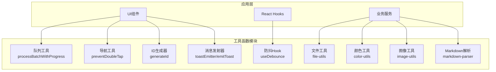
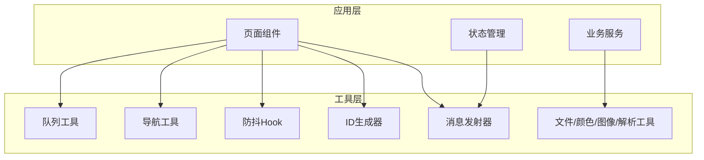
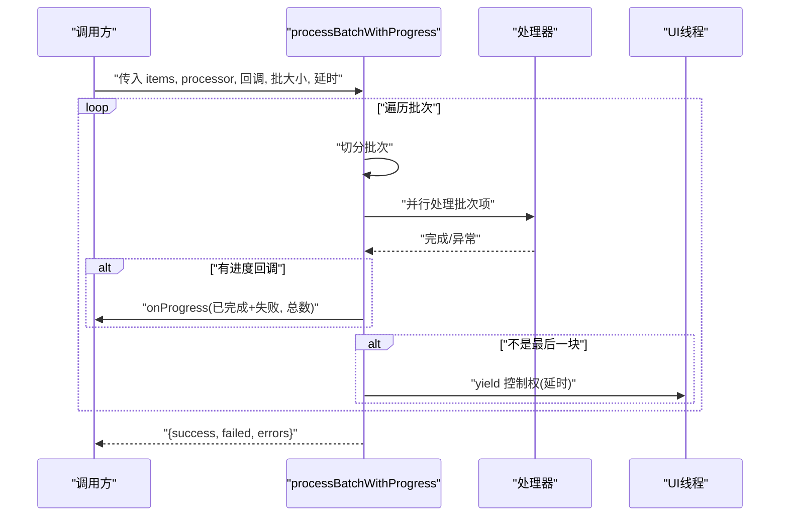
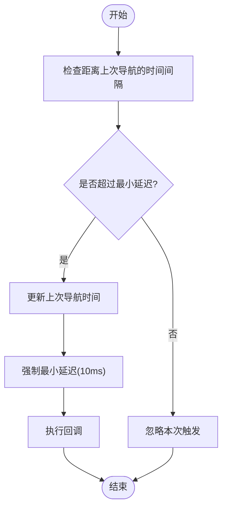
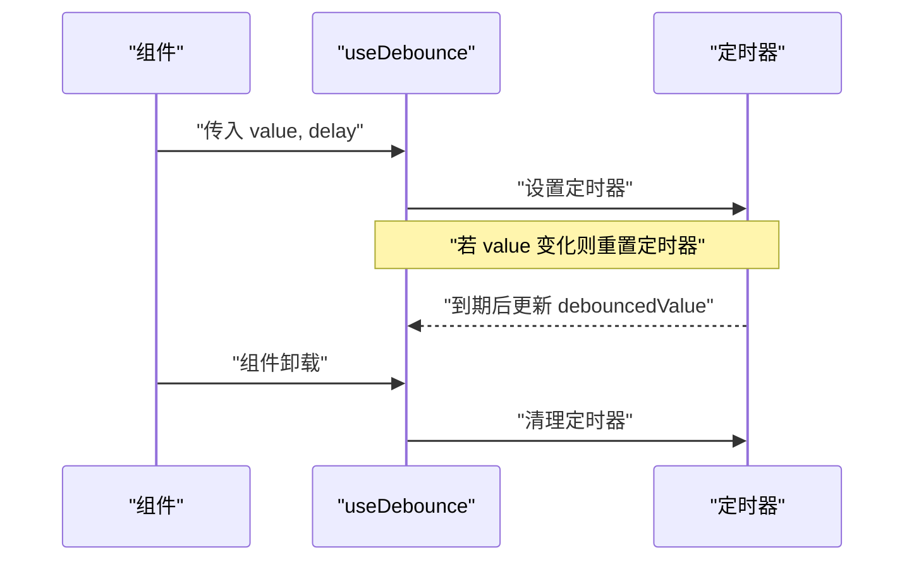
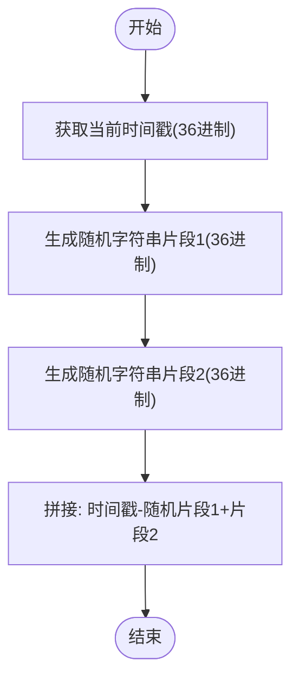
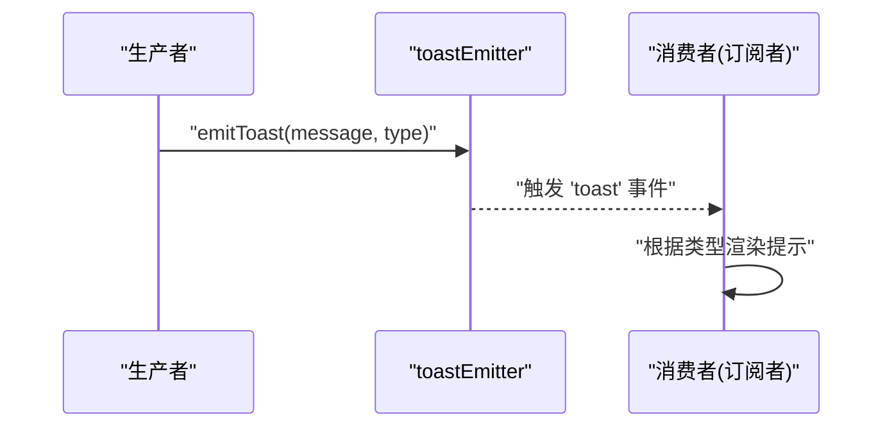
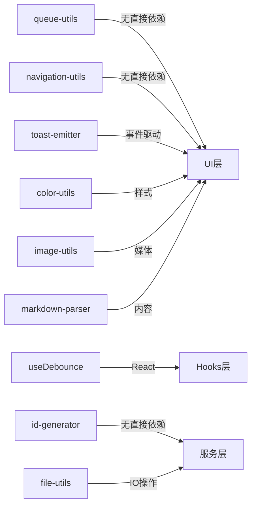

# 通用工具函数

<cite>
**本文档引用的文件**
- [src/lib/queue-utils.ts](file://src/lib/queue-utils.ts)
- [src/lib/navigation-utils.ts](file://src/lib/navigation-utils.ts)
- [src/hooks/useDebounce.ts](file://src/hooks/useDebounce.ts)
- [src/lib/utils/id-generator.ts](file://src/lib/utils/id-generator.ts)
- [src/lib/utils/toast-emitter.ts](file://src/lib/utils/toast-emitter.ts)
- [src/lib/file-utils.ts](file://src/lib/file-utils.ts)
- [src/lib/color-utils.ts](file://src/lib/color-utils.ts)
- [src/lib/image-utils.ts](file://src/lib/image-utils.ts)
- [src/lib/markdown-parser.ts](file://src/lib/markdown-parser.ts)
</cite>

## 目录
1. [简介](#简介)
2. [项目结构](#项目结构)
3. [核心组件](#核心组件)
4. [架构概览](#架构概览)
5. [详细组件分析](#详细组件分析)
6. [依赖关系分析](#依赖关系分析)
7. [性能考虑](#性能考虑)
8. [故障排除指南](#故障排除指南)
9. [结论](#结论)
10. [附录](#附录)

## 简介
本文件为 Nexara 项目的通用工具函数技术文档，涵盖防抖节流、队列管理、导航辅助、字符串与标识符生成、消息通知以及文件/媒体/解析工具等模块。文档从架构设计、数据流、处理逻辑、集成点、错误处理与性能特征等方面进行系统化分析，并提供组合使用模式、最佳实践、测试方法与质量保证措施，以及扩展接口与自定义工具开发指南。

## 项目结构
通用工具函数主要分布在以下位置：
- 队列与批处理：src/lib/queue-utils.ts
- 导航防抖：src/lib/navigation-utils.ts
- 防抖 Hook：src/hooks/useDebounce.ts
- 标识符生成：src/lib/utils/id-generator.ts
- 消息通知：src/lib/utils/toast-emitter.ts
- 文件工具：src/lib/file-utils.ts
- 颜色工具：src/lib/color-utils.ts
- 图像工具：src/lib/image-utils.ts
- Markdown 解析：src/lib/markdown-parser.ts

**图表来源**
- [src/lib/queue-utils.ts:1-49](file://src/lib/queue-utils.ts#L1-L49)
- [src/lib/navigation-utils.ts:1-18](file://src/lib/navigation-utils.ts#L1-L18)
- [src/hooks/useDebounce.ts:1-26](file://src/hooks/useDebounce.ts#L1-L26)
- [src/lib/utils/id-generator.ts:1-13](file://src/lib/utils/id-generator.ts#L1-L13)
- [src/lib/utils/toast-emitter.ts:1-15](file://src/lib/utils/toast-emitter.ts#L1-L15)
- [src/lib/file-utils.ts](file://src/lib/file-utils.ts)
- [src/lib/color-utils.ts](file://src/lib/color-utils.ts)
- [src/lib/image-utils.ts](file://src/lib/image-utils.ts)
- [src/lib/markdown-parser.ts](file://src/lib/markdown-parser.ts)

**章节来源**
- [src/lib/queue-utils.ts:1-49](file://src/lib/queue-utils.ts#L1-L49)
- [src/lib/navigation-utils.ts:1-18](file://src/lib/navigation-utils.ts#L1-L18)
- [src/hooks/useDebounce.ts:1-26](file://src/hooks/useDebounce.ts#L1-L26)
- [src/lib/utils/id-generator.ts:1-13](file://src/lib/utils/id-generator.ts#L1-L13)
- [src/lib/utils/toast-emitter.ts:1-15](file://src/lib/utils/toast-emitter.ts#L1-L15)

## 核心组件
本节对各工具函数模块进行功能与使用场景的深入分析：

- 队列与批处理（processBatchWithProgress）
  - 功能：在不阻塞 UI 的前提下批量处理大量任务，支持进度回调、错误收集与分片执行。
  - 关键参数：items、processor、onProgress、batchSize、delayMs。
  - 返回值：包含成功数、失败数与错误数组的对象。
  - 使用场景：大数据导入、批量网络请求、文件扫描与转换等。
  - 性能特性：通过 Promise.all 并行处理单批次项，批次间延时让出事件循环，避免主线程卡顿。

- 导航防抖（preventDoubleTap）
  - 功能：限制短时间内重复触发的导航动作，防止用户误触导致的重复跳转。
  - 关键参数：callback、delay（默认 1000ms）。
  - 使用场景：按钮点击、列表项选择、路由跳转等交互入口。
  - 安全性：内部强制最小延迟以确保线程安全。

- 防抖 Hook（useDebounce）
  - 功能：返回一个在指定延迟后才更新的值，中间值变化会重置计时器。
  - 关键参数：value、delay。
  - 使用场景：搜索输入框、窗口尺寸监听、滚动位置计算等高频变更场景。
  - 生命周期：在组件卸载时清理定时器，避免内存泄漏。

- 标识符生成（generateId）
  - 功能：生成基于时间戳与随机字符串的唯一标识符，避免依赖加密随机源。
  - 格式：timestamp-randomString。
  - 使用场景：临时对象、草稿记录、UI 唯一键等。

- 消息通知（toastEmitter/emitToast）
  - 功能：基于事件发射器的消息通知机制，支持多种类型（成功/错误/信息/警告）。
  - 使用场景：全局提示、异步操作反馈、错误上报等。
  - 集成方式：订阅 toastEmitter 事件并渲染对应 UI。

- 文件工具（file-utils）
  - 功能：封装文件读写、路径处理、格式检测等常用操作。
  - 使用场景：配置文件管理、日志输出、资源打包等。

- 颜色工具（color-utils）
  - 功能：颜色格式转换、亮度计算、主题适配等。
  - 使用场景：动态主题切换、图标着色、可视化配色。

- 图像工具（image-utils）
  - 功能：图像压缩、格式转换、尺寸调整、元数据读取等。
  - 使用场景：聊天附件、知识图谱节点图标、预览图生成。

- Markdown 解析（markdown-parser）
  - 功能：将 Markdown 文本解析为可渲染的结构或 HTML。
  - 使用场景：消息内容渲染、文档展示、富文本编辑器预览。

**章节来源**
- [src/lib/queue-utils.ts:5-48](file://src/lib/queue-utils.ts#L5-L48)
- [src/lib/navigation-utils.ts:8-17](file://src/lib/navigation-utils.ts#L8-L17)
- [src/hooks/useDebounce.ts:11-25](file://src/hooks/useDebounce.ts#L11-L25)
- [src/lib/utils/id-generator.ts:7-12](file://src/lib/utils/id-generator.ts#L7-L12)
- [src/lib/utils/toast-emitter.ts:10-14](file://src/lib/utils/toast-emitter.ts#L10-L14)
- [src/lib/file-utils.ts](file://src/lib/file-utils.ts)
- [src/lib/color-utils.ts](file://src/lib/color-utils.ts)
- [src/lib/image-utils.ts](file://src/lib/image-utils.ts)
- [src/lib/markdown-parser.ts](file://src/lib/markdown-parser.ts)

## 架构概览
通用工具函数采用“按职责分层”的组织方式，既可作为独立模块被应用层直接调用，也可通过更高层的服务进行编排。整体架构强调：
- 无副作用与纯函数优先：如 ID 生成、颜色转换等。
- 异步与非阻塞：队列批处理与防抖 Hook。
- 松耦合与高内聚：每个工具专注于单一职责并通过简单接口暴露能力。

**图表来源**
- [src/lib/queue-utils.ts:1-49](file://src/lib/queue-utils.ts#L1-L49)
- [src/lib/navigation-utils.ts:1-18](file://src/lib/navigation-utils.ts#L1-L18)
- [src/hooks/useDebounce.ts:1-26](file://src/hooks/useDebounce.ts#L1-L26)
- [src/lib/utils/id-generator.ts:1-13](file://src/lib/utils/id-generator.ts#L1-L13)
- [src/lib/utils/toast-emitter.ts:1-15](file://src/lib/utils/toast-emitter.ts#L1-L15)
- [src/lib/file-utils.ts](file://src/lib/file-utils.ts)
- [src/lib/color-utils.ts](file://src/lib/color-utils.ts)
- [src/lib/image-utils.ts](file://src/lib/image-utils.ts)
- [src/lib/markdown-parser.ts](file://src/lib/markdown-parser.ts)

## 详细组件分析

### 队列与批处理组件分析
该组件通过分片与异步调度实现大规模数据的平滑处理，避免 UI 卡顿。

**图表来源**
- [src/lib/queue-utils.ts:5-48](file://src/lib/queue-utils.ts#L5-L48)

**章节来源**
- [src/lib/queue-utils.ts:5-48](file://src/lib/queue-utils.ts#L5-L48)

### 导航防抖组件分析
该组件通过时间戳控制与最小延迟确保导航动作不会在短时间内重复触发。

**图表来源**
- [src/lib/navigation-utils.ts:8-17](file://src/lib/navigation-utils.ts#L8-L17)

**章节来源**
- [src/lib/navigation-utils.ts:8-17](file://src/lib/navigation-utils.ts#L8-L17)

### 防抖 Hook 组件分析
该 Hook 在组件生命周期中管理定时器，确保只有在稳定状态时才更新值。

**图表来源**
- [src/hooks/useDebounce.ts:11-25](file://src/hooks/useDebounce.ts#L11-L25)

**章节来源**
- [src/hooks/useDebounce.ts:11-25](file://src/hooks/useDebounce.ts#L11-L25)

### 标识符生成组件分析
该组件生成基于时间戳与随机字符串的唯一标识符，避免依赖加密随机源。

**图表来源**
- [src/lib/utils/id-generator.ts:7-12](file://src/lib/utils/id-generator.ts#L7-L12)

**章节来源**
- [src/lib/utils/id-generator.ts:7-12](file://src/lib/utils/id-generator.ts#L7-L12)

### 消息通知组件分析
该组件基于事件发射器实现跨组件的消息通知。

**图表来源**
- [src/lib/utils/toast-emitter.ts:10-14](file://src/lib/utils/toast-emitter.ts#L10-L14)

**章节来源**
- [src/lib/utils/toast-emitter.ts:10-14](file://src/lib/utils/toast-emitter.ts#L10-L14)

### 字符串与文件处理组件分析
- 文件工具：提供文件读写、路径处理、格式检测等能力，适用于配置管理与资源处理。
- 颜色工具：提供颜色格式转换、亮度计算、主题适配等能力，适用于动态主题与可视化。
- 图像工具：提供图像压缩、格式转换、尺寸调整、元数据读取等能力，适用于聊天与知识图谱场景。
- Markdown 解析：提供 Markdown 到结构或 HTML 的解析能力，适用于消息渲染与文档展示。

**章节来源**
- [src/lib/file-utils.ts](file://src/lib/file-utils.ts)
- [src/lib/color-utils.ts](file://src/lib/color-utils.ts)
- [src/lib/image-utils.ts](file://src/lib/image-utils.ts)
- [src/lib/markdown-parser.ts](file://src/lib/markdown-parser.ts)

## 依赖关系分析
通用工具函数之间的依赖关系相对松散，遵循单一职责原则，便于替换与扩展。

**图表来源**
- [src/lib/queue-utils.ts:1-49](file://src/lib/queue-utils.ts#L1-L49)
- [src/lib/navigation-utils.ts:1-18](file://src/lib/navigation-utils.ts#L1-L18)
- [src/hooks/useDebounce.ts:1-26](file://src/hooks/useDebounce.ts#L1-L26)
- [src/lib/utils/id-generator.ts:1-13](file://src/lib/utils/id-generator.ts#L1-L13)
- [src/lib/utils/toast-emitter.ts:1-15](file://src/lib/utils/toast-emitter.ts#L1-L15)
- [src/lib/file-utils.ts](file://src/lib/file-utils.ts)
- [src/lib/color-utils.ts](file://src/lib/color-utils.ts)
- [src/lib/image-utils.ts](file://src/lib/image-utils.ts)
- [src/lib/markdown-parser.ts](file://src/lib/markdown-parser.ts)

**章节来源**
- [src/lib/queue-utils.ts:1-49](file://src/lib/queue-utils.ts#L1-L49)
- [src/lib/navigation-utils.ts:1-18](file://src/lib/navigation-utils.ts#L1-L18)
- [src/hooks/useDebounce.ts:1-26](file://src/hooks/useDebounce.ts#L1-L26)
- [src/lib/utils/id-generator.ts:1-13](file://src/lib/utils/id-generator.ts#L1-L13)
- [src/lib/utils/toast-emitter.ts:1-15](file://src/lib/utils/toast-emitter.ts#L1-L15)
- [src/lib/file-utils.ts](file://src/lib/file-utils.ts)
- [src/lib/color-utils.ts](file://src/lib/color-utils.ts)
- [src/lib/image-utils.ts](file://src/lib/image-utils.ts)
- [src/lib/markdown-parser.ts](file://src/lib/markdown-parser.ts)

## 性能考虑
- 队列批处理
  - 并行度控制：通过 batchSize 控制单批次并发数量，避免过度并发导致内存与 CPU 压力。
  - 事件循环让出：批次间延时让出主线程，减少 UI 卡顿。
  - 错误聚合：集中收集错误并返回，便于上层统一处理。
- 导航防抖
  - 最小延迟保障：强制 10ms 延迟，降低竞态条件风险。
  - 时间戳控制：避免重复触发，提升用户体验。
- 防抖 Hook
  - 清理策略：组件卸载时清除定时器，防止内存泄漏。
  - 计时器复位：频繁变更时仅在稳定后更新，降低重渲染成本。
- 标识符生成
  - 低碰撞概率：结合时间戳与多段随机字符串，适合短生命周期对象。
- 消息通知
  - 事件驱动：避免全局状态污染，降低耦合度。
- 文件/颜色/图像/解析工具
  - IO 与计算分离：将耗时操作放在后台或 Web Worker 中（如适用），避免阻塞主线程。

[本节为通用性能建议，无需特定文件来源]

## 故障排除指南
- 队列批处理
  - 症状：长时间无进度回调或最终结果为空。
  - 排查：确认 processor 是否抛出未捕获异常；检查批次大小与延时设置是否合理。
  - 处理：为 processor 添加 try-catch 包裹；适当增大批次或延时。
- 导航防抖
  - 症状：点击无效或响应迟缓。
  - 排查：检查 delay 参数是否过大；确认回调是否在异步上下文中执行。
  - 处理：调整 delay；确保回调在安全线程中执行。
- 防抖 Hook
  - 症状：组件卸载后仍有更新或内存泄漏。
  - 排查：确认是否正确清理定时器。
  - 处理：确保在 useEffect 返回函数中清理定时器。
- 标识符生成
  - 症状：ID 冲突或格式异常。
  - 排查：确认生成逻辑是否被修改；检查随机字符串长度。
  - 处理：保持现有生成策略；必要时增加随机段数。
- 消息通知
  - 症状：消息不显示或重复显示。
  - 排查：检查订阅者是否正确注册；确认事件名称一致性。
  - 处理：统一事件名称；确保订阅与发布在同一实例中。

**章节来源**
- [src/lib/queue-utils.ts:18-28](file://src/lib/queue-utils.ts#L18-L28)
- [src/lib/navigation-utils.ts:8-17](file://src/lib/navigation-utils.ts#L8-L17)
- [src/hooks/useDebounce.ts:19-22](file://src/hooks/useDebounce.ts#L19-L22)
- [src/lib/utils/id-generator.ts:7-12](file://src/lib/utils/id-generator.ts#L7-L12)
- [src/lib/utils/toast-emitter.ts:10-14](file://src/lib/utils/toast-emitter.ts#L10-L14)

## 结论
Nexara 的通用工具函数以简洁、高效、可组合为核心设计目标，覆盖了前端开发中的常见痛点：UI 卡顿、重复交互、高频变更与全局通知。通过合理的批处理策略、防抖机制与事件驱动模型，这些工具能够在保证性能的同时提升用户体验。建议在实际项目中遵循单一职责、参数化配置与错误隔离的原则，结合业务场景灵活组合使用。

[本节为总结性内容，无需特定文件来源]

## 附录

### 组合使用模式与最佳实践
- 输入校验与防抖：在搜索或筛选场景中，先使用防抖 Hook 缓解高频变更，再交由队列工具进行批量处理。
- 导航安全：在按钮与列表项中统一使用导航防抖，避免重复跳转。
- 全局反馈：通过消息发射器统一处理异步结果，订阅端负责 UI 展示。
- 资源管理：文件与图像工具配合使用，先进行格式与尺寸检查，再进行转换或压缩。

[本节为概念性内容，无需特定文件来源]

### 测试方法与质量保证
- 单元测试
  - 队列批处理：模拟不同批次大小与延时，验证进度回调与错误收集。
  - 导航防抖：构造快速连续点击，验证最小延迟与重复触发防护。
  - 防抖 Hook：模拟多次值变更，验证最终稳定值与清理逻辑。
  - 标识符生成：生成大量 ID，统计冲突率与格式正确性。
  - 消息通知：发布多种类型消息，验证订阅端渲染一致性。
- 集成测试
  - 将多个工具组合到典型流程中（如搜索-过滤-导出），验证端到端行为。
- 性能测试
  - 使用大体量数据集评估批处理吞吐量与 UI 响应时间。
  - 对比不同批次大小与延时参数对性能的影响。

[本节为通用测试建议，无需特定文件来源]

### 扩展接口与自定义工具开发指南
- 设计原则
  - 单一职责：每个工具只解决一个问题。
  - 明确接口：参数与返回值清晰，避免隐式依赖。
  - 可配置性：提供合理默认值与可调参数。
  - 错误处理：对外暴露错误集合或统一异常类型。
- 开发步骤
  - 明确需求与边界，拆分为独立函数或 Hook。
  - 编写单元测试与集成测试，覆盖正常与异常路径。
  - 在应用层进行小范围试用，收集性能与稳定性反馈。
  - 提供文档与示例，便于团队复用。

[本节为通用开发建议，无需特定文件来源]