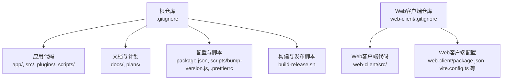
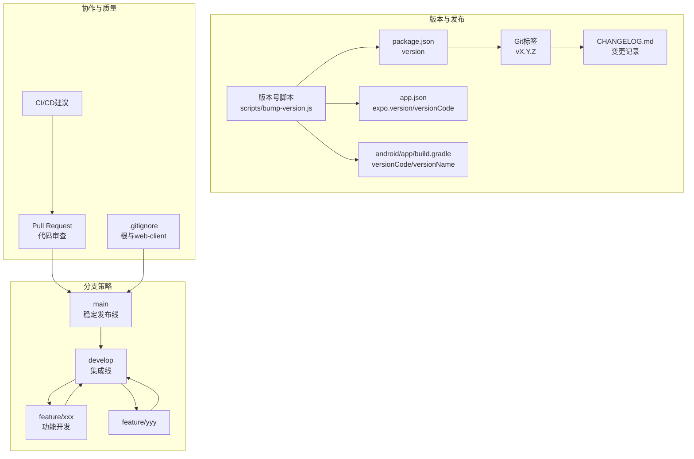
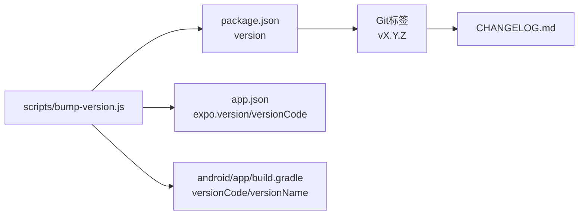

# Git工作流程

<cite>
**本文引用的文件**
- [.gitignore](file://.gitignore)
- [README.md](file://README.md)
- [package.json](file://package.json)
- [CHANGELOG.md](file://CHANGELOG.md)
- [scripts/bump-version.js](file://scripts/bump-version.js)
- [.prettierrc](file://.prettierrc)
- [web-client/.gitignore](file://web-client/.gitignore)
</cite>

## 目录
1. [简介](#简介)
2. [项目结构](#项目结构)
3. [核心组件](#核心组件)
4. [架构总览](#架构总览)
5. [详细组件分析](#详细组件分析)
6. [依赖关系分析](#依赖关系分析)
7. [性能考虑](#性能考虑)
8. [故障排查指南](#故障排查指南)
9. [结论](#结论)
10. [附录](#附录)

## 简介
本指南为Nexara项目制定标准化的Git工作流程，覆盖分支策略、提交信息规范、语义化版本控制、Pull Request流程与代码审查标准、版本标签与发布流程、冲突解决与回滚策略、.gitignore配置与忽略文件最佳实践，以及团队协作与贡献指南。该流程旨在提升协作效率、保障代码质量与发布稳定性，并与现有脚本与配置保持一致。

## 项目结构
Nexara是一个基于Expo + React Native的多平台应用，同时包含Web客户端（web-client）。仓库中存在根目录与web-client目录各自的.gitignore，且项目已具备版本号管理脚本与变更日志维护习惯。

**章节来源**
- [README.md: 1-161:1-161](file://README.md#L1-L161)
- [.gitignore: 1-67:1-67](file://.gitignore#L1-L67)
- [web-client/.gitignore: 1-200:1-200](file://web-client/.gitignore#L1-L200)

## 核心组件
- 分支与版本管理：采用集中式主干分支策略，结合develop与feature分支；版本号通过脚本统一更新，配合CHANGELOG维护。
- 提交与审查：以“类型: 内容（影响范围）”的结构化提交信息为主，辅以PR模板与审查清单。
- 发布与回滚：通过版本标签与变更日志进行发布追踪，回滚采用“反向提交”或“回退到上一个稳定标签”的方式。
- 忽略文件：根与web-client分别维护.gitignore，确保敏感文件与构建产物不进入版本库。

**章节来源**
- [package.json: 1-120:1-120](file://package.json#L1-L120)
- [scripts/bump-version.js: 1-65:1-65](file://scripts/bump-version.js#L1-L65)
- [CHANGELOG.md: 1-69:1-69](file://CHANGELOG.md#L1-L69)
- [.gitignore: 1-67:1-67](file://.gitignore#L1-L67)
- [web-client/.gitignore: 1-200:1-200](file://web-client/.gitignore#L1-L200)

## 架构总览
下图展示Nexara的Git工作流架构：从feature分支开发到develop集成，再到main发布，配合版本号脚本与变更日志。

**图表来源**
- [scripts/bump-version.js: 1-65:1-65](file://scripts/bump-version.js#L1-L65)
- [package.json: 1-120:1-120](file://package.json#L1-L120)
- [CHANGELOG.md: 1-69:1-69](file://CHANGELOG.md#L1-L69)
- [.gitignore: 1-67:1-67](file://.gitignore#L1-L67)
- [web-client/.gitignore: 1-200:1-200](file://web-client/.gitignore#L1-L200)

**章节来源**
- [scripts/bump-version.js: 1-65:1-65](file://scripts/bump-version.js#L1-L65)
- [package.json: 1-120:1-120](file://package.json#L1-L120)
- [CHANGELOG.md: 1-69:1-69](file://CHANGELOG.md#L1-L69)
- [.gitignore: 1-67:1-67](file://.gitignore#L1-L67)
- [web-client/.gitignore: 1-200:1-200](file://web-client/.gitignore#L1-L200)

## 详细组件分析

### 分支策略与命名规范
- main：仅接收来自develop的合并与发布标签，作为最终稳定发布线。
- develop：日常集成线，所有feature完成后合并至此，再进行发布准备。
- feature分支：用于具体功能开发，命名建议采用“feature/模块-简述”，如feature/chat-enhancement。
- hotfix分支（建议）：紧急修复可从main切出hotfix/xxx，修复后合并回main与develop。

分支合并策略
- feature合并：通过Pull Request合并至develop，禁止直接push到develop/main。
- develop合并：通过Pull Request合并至main，合并后打标签并更新CHANGELOG。
- 代码审查：至少一名维护者批准，确保无破坏性变更与测试通过。

**章节来源**
- [README.md: 62-70:62-70](file://README.md#L62-L70)

### 提交信息格式规范与语义化版本控制
提交信息格式
- 结构：类型: 内容（影响范围）
- 类型示例：feat, fix, docs, refactor, perf, test, chore
- 示例：feat(chat): 支持多模型切换（chat-store, services）

语义化版本控制
- 当前版本来源：package.json中的version字段。
- 版本号更新：通过脚本统一更新package.json、app.json与android构建配置，确保三处一致。
- 版本号策略：建议遵循语义化版本规范，小版本用于新增功能，补丁版本用于修复。

**章节来源**
- [package.json: 1-120:1-120](file://package.json#L1-L120)
- [scripts/bump-version.js: 1-65:1-65](file://scripts/bump-version.js#L1-L65)

### Pull Request流程与代码审查标准
PR流程
- 创建PR：从feature分支指向develop；若为紧急修复，指向main并随后合并回develop。
- 描述规范：简述变更内容、影响范围、测试要点与风险提示。
- 审查清单：是否符合提交信息规范、是否引入破坏性变更、是否通过测试、是否需要更新文档或CHANGELOG。

审查标准
- 代码风格：遵循.prettierrc配置，确保统一格式。
- 安全与隐私：不提交敏感信息；密钥与证书放入忽略列表。
- 性能与兼容：避免引入性能退化；注意多平台兼容性。

**章节来源**
- [.prettierrc: 1-7:1-7](file://.prettierrc#L1-L7)

### 版本标签管理与发布流程
版本标签管理
- 标签命名：使用vX.Y.Z格式，与package.json版本一致。
- 打标签时机：develop合并到main后，且CHANGELOG已更新。

发布流程
- 步骤1：在develop上执行版本号脚本，更新各配置文件。
- 步骤2：在main上创建标签并推送。
- 步骤3：更新CHANGELOG，补充本次变更摘要。
- 步骤4：（可选）在CI中生成发布说明与构建产物。

**章节来源**
- [scripts/bump-version.js: 1-65:1-65](file://scripts/bump-version.js#L1-L65)
- [CHANGELOG.md: 1-69:1-69](file://CHANGELOG.md#L1-L69)

### 冲突解决策略与回滚操作
冲突解决策略
- 预防：频繁从develop拉取最新变更；小步提交，减少合并冲突。
- 解决：在feature分支本地先rebase或merge develop，解决冲突后再推送到远程。
- 评审：冲突解决过程需在PR中说明，确保可追溯。

回滚操作
- 小范围回滚：使用git revert创建反向提交，保留历史。
- 大范围回滚：定位到上一个稳定标签，reset或revert到该标签，必要时打新标签发布。

**章节来源**
- [CHANGELOG.md: 1-69:1-69](file://CHANGELOG.md#L1-L69)

### .gitignore配置说明与忽略文件最佳实践
根目录.gitignore
- 忽略对象：node_modules、Expo临时目录、Metro健康检查、调试日志、macOS系统文件、本地环境变量、TypeScript构建缓存、生成的原生目录、安全敏感文件等。
- 最佳实践：将敏感文件与构建产物统一忽略；区分本地与共享配置，避免误提交。

web-client/.gitignore
- 忽略对象：web客户端特有的构建产物与开发工具配置。
- 最佳实践：与根目录.gitignore保持一致的忽略策略，避免将编译输出与IDE配置提交到仓库。

**章节来源**
- [.gitignore: 1-67:1-67](file://.gitignore#L1-L67)
- [web-client/.gitignore: 1-200:1-200](file://web-client/.gitignore#L1-L200)

### 团队协作规范与贡献指南
协作规范
- 分支命名：feature/模块-简述；hotfix/问题描述；release/X.Y.Z（建议）。
- 提交信息：严格遵循格式，便于生成CHANGELOG与追溯问题。
- PR与审查：每次PR必须有审查通过与测试通过，避免直接push到受保护分支。

贡献指南
- 新贡献者：先在issue中讨论需求，再创建feature分支。
- 代码风格：统一使用Prettier配置，提交前格式化。
- 文档与日志：新增功能需更新README或相关文档；重大变更需更新CHANGELOG。

**章节来源**
- [README.md: 1-161:1-161](file://README.md#L1-L161)
- [.prettierrc: 1-7:1-7](file://.prettierrc#L1-L7)

## 依赖关系分析
下图展示版本号更新脚本与相关配置文件之间的依赖关系，体现版本管理的闭环。

**图表来源**
- [scripts/bump-version.js: 1-65:1-65](file://scripts/bump-version.js#L1-L65)
- [package.json: 1-120:1-120](file://package.json#L1-L120)

**章节来源**
- [scripts/bump-version.js: 1-65:1-65](file://scripts/bump-version.js#L1-L65)
- [package.json: 1-120:1-120](file://package.json#L1-L120)

## 性能考虑
- 频繁小步提交：减少合并冲突与审查负担。
- 保持分支整洁：定期rebase与squash，避免冗余提交历史。
- 构建产物忽略：确保.gitignore正确忽略构建目录，避免仓库膨胀。

## 故障排查指南
常见问题与处理
- 版本号不一致：确认package.json、app.json与build.gradle的版本同步更新。
- 忽略文件未生效：检查.gitignore路径与大小写，确认未被.gitignore覆盖。
- 合并冲突：在feature分支本地先merge/rebase develop，解决冲突后再推送。

**章节来源**
- [scripts/bump-version.js: 1-65:1-65](file://scripts/bump-version.js#L1-L65)
- [.gitignore: 1-67:1-67](file://.gitignore#L1-L67)

## 结论
通过标准化的分支策略、严格的提交信息规范、统一的版本号管理与发布流程，以及完善的.gitignore与协作规范，Nexara项目可以显著提升开发效率与发布质量。建议团队在CI中加入代码风格检查与自动化测试，进一步强化流程的可靠性。

## 附录
- 变更日志维护：每次重要变更在CHANGELOG中记录，便于生成发布说明。
- 版本标签：发布后及时打标签，确保可追溯与可回滚。

**章节来源**
- [CHANGELOG.md: 1-69:1-69](file://CHANGELOG.md#L1-L69)