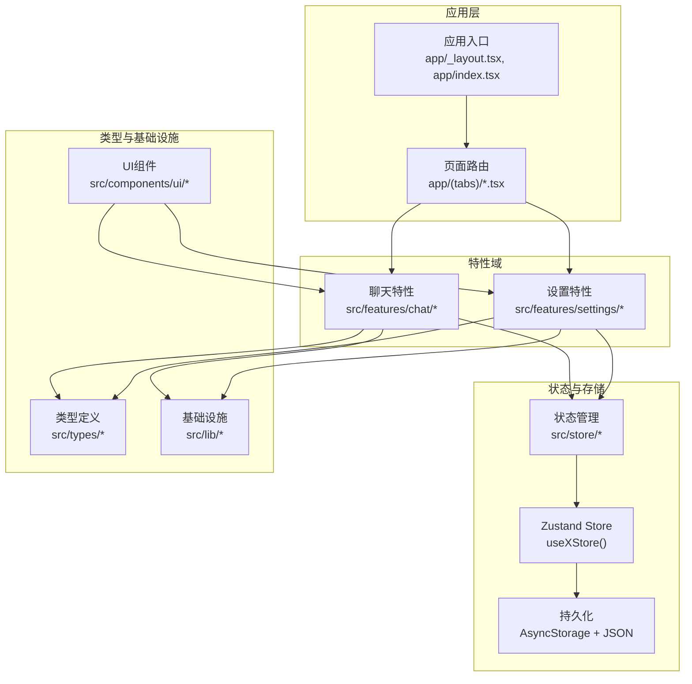
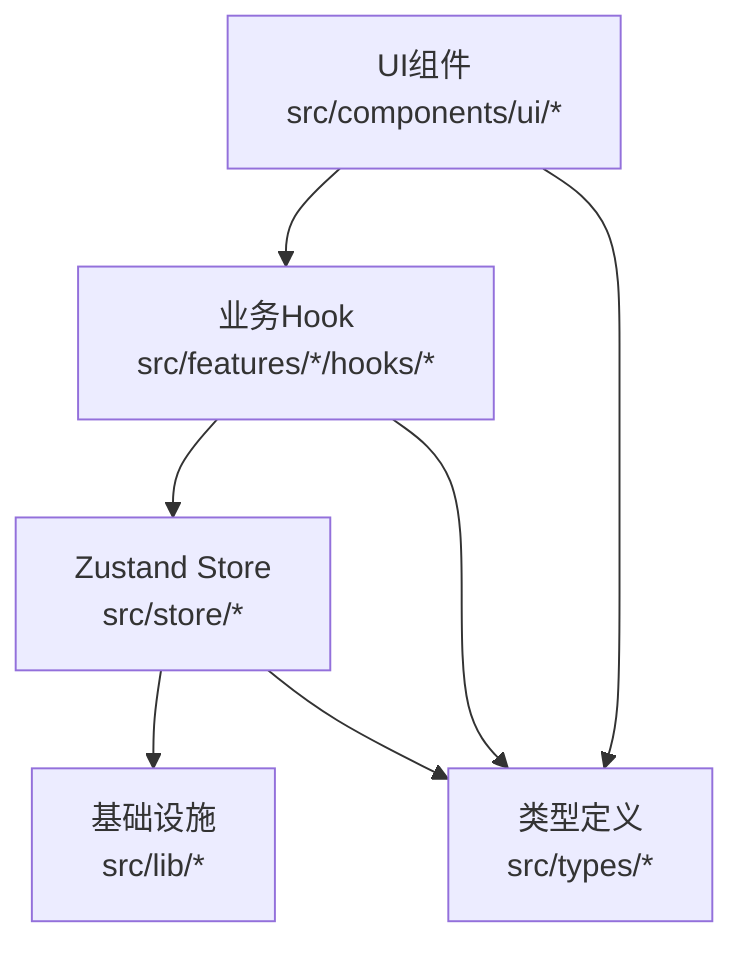
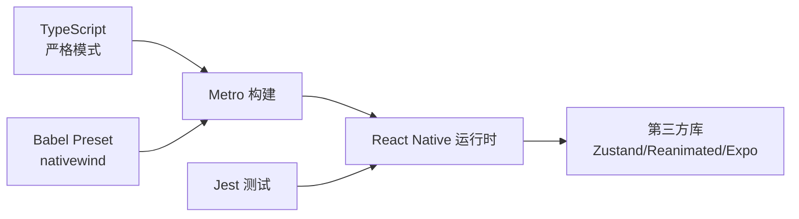

# 代码规范与最佳实践

<cite>
**本文引用的文件**
- [.prettierrc](file://.prettierrc)
- [package.json](file://package.json)
- [tsconfig.json](file://tsconfig.json)
- [babel.config.js](file://babel.config.js)
- [metro.config.js](file://metro.config.js)
- [jest.config.js](file://jest.config.js)
- [src/types/chat.ts](file://src/types/chat.ts)
- [src/types/rag.ts](file://src/types/rag.ts)
- [src/types/super-assistant.ts](file://src/types/super-assistant.ts)
- [src/@types/modules.d.ts](file://src/@types/modules.d.ts)
- [src/store/chat-store.ts](file://src/store/chat-store.ts)
- [src/store/settings-store.ts](file://src/store/settings-store.ts)
- [src/hooks/useDebounce.ts](file://src/hooks/useDebounce.ts)
- [src/components/ui/Button.tsx](file://src/components/ui/Button.tsx)
- [src/features/chat/hooks/useChat.ts](file://src/features/chat/hooks/useChat.ts)
- [src/features/chat/hooks/useMarkdownRules.tsx](file://src/features/chat/hooks/useMarkdownRules.tsx)
</cite>

## 目录
1. [简介](#简介)
2. [项目结构](#项目结构)
3. [核心组件](#核心组件)
4. [架构总览](#架构总览)
5. [详细组件分析](#详细组件分析)
6. [依赖关系分析](#依赖关系分析)
7. [性能考量](#性能考量)
8. [故障排查指南](#故障排查指南)
9. [结论](#结论)
10. [附录](#附录)

## 简介
本指南面向Nexara项目，提供一套完整的代码规范与最佳实践，涵盖TypeScript编码标准、Prettier格式化、ESLint静态检查、React Native组件编写规范、文件与目录结构、错误处理与日志记录、性能优化以及代码审查清单与质量保证流程。目标是统一团队开发风格，提升代码一致性、可维护性与可测试性。

## 项目结构
Nexara采用基于功能域与层的混合组织方式：
- 应用入口与页面：app/ 下的路由页面与标签页
- 核心业务域：src/features/（聊天、设置等）、src/services/（服务层）、src/lib/（基础设施）
- 状态管理：src/store/（Zustand + 持久化）
- 类型系统：src/types/（领域模型与类型声明）
- 组件库：src/components/ui/（通用UI组件）
- Hook与工具：src/hooks/、src/lib/utils/ 等
- Web客户端：web-client/（独立的Web端）

图表来源
- [src/store/chat-store.ts:1-210](file://src/store/chat-store.ts#L1-L210)
- [src/store/settings-store.ts:1-75](file://src/store/settings-store.ts#L1-L75)
- [src/types/chat.ts:1-60](file://src/types/chat.ts#L1-L60)
- [src/types/rag.ts:1-30](file://src/types/rag.ts#L1-L30)
- [src/components/ui/Button.tsx:1-40](file://src/components/ui/Button.tsx#L1-L40)

章节来源
- [package.json:1-120](file://package.json#L1-L120)
- [tsconfig.json:1-14](file://tsconfig.json#L1-L14)
- [babel.config.js:1-14](file://babel.config.js#L1-L14)
- [metro.config.js:1-13](file://metro.config.js#L1-L13)
- [jest.config.js:1-9](file://jest.config.js#L1-L9)

## 核心组件
- 类型系统：通过src/types/下的接口与联合类型定义领域模型，确保跨层一致的数据契约。
- 状态管理：使用Zustand创建模块化store，结合persist实现本地持久化，避免在store中引入复杂业务逻辑。
- 组件与Hook：UI组件集中在src/components/ui/，业务相关Hook集中在src/features/*/hooks/，遵循单一职责与可复用原则。
- 构建与测试：Metro + Babel + Jest配置，TypeScript严格模式，Prettier统一格式化。

章节来源
- [src/types/chat.ts:1-314](file://src/types/chat.ts#L1-L314)
- [src/types/rag.ts:1-66](file://src/types/rag.ts#L1-L66)
- [src/types/super-assistant.ts:1-107](file://src/types/super-assistant.ts#L1-L107)
- [src/store/chat-store.ts:1-210](file://src/store/chat-store.ts#L1-L210)
- [src/store/settings-store.ts:1-75](file://src/store/settings-store.ts#L1-L75)
- [src/components/ui/Button.tsx:1-161](file://src/components/ui/Button.tsx#L1-L161)
- [src/hooks/useDebounce.ts:1-26](file://src/hooks/useDebounce.ts#L1-L26)
- [src/features/chat/hooks/useChat.ts:1-117](file://src/features/chat/hooks/useChat.ts#L1-L117)
- [src/features/chat/hooks/useMarkdownRules.tsx:1-343](file://src/features/chat/hooks/useMarkdownRules.tsx#L1-L343)

## 架构总览
Nexara采用“特性域 + 层”架构：
- 表现层：React Native组件与页面
- 特性层：聊天、设置等特性域，封装业务逻辑与交互
- 状态层：Zustand store，负责状态聚合与持久化
- 基础设施层：数据库、LLM客户端、文件系统、网络等
- 类型层：统一的类型定义，贯穿各层

图表来源
- [src/store/chat-store.ts:1-210](file://src/store/chat-store.ts#L1-L210)
- [src/store/settings-store.ts:1-75](file://src/store/settings-store.ts#L1-L75)
- [src/types/chat.ts:1-120](file://src/types/chat.ts#L1-L120)
- [src/components/ui/Button.tsx:1-60](file://src/components/ui/Button.tsx#L1-L60)

## 详细组件分析

### TypeScript编码标准
- 命名约定
  - 接口与类型：采用帕斯卡命名（如Agent、Session、RagConfiguration）
  - 枚举/联合类型：采用帕斯卡命名（如ExecutionMode）
  - 常量：采用大写下划线（如DEFAULT_SPA_PREFERENCES）
  - 文件名：采用帕斯卡命名（如Button.tsx），避免使用连字符
- 接口定义
  - 使用明确的字段注释与可选字段标记，便于跨层协作
  - 对外暴露的接口尽量稳定，避免频繁变更
- 类型注解
  - 严格模式开启，确保空值与类型安全
  - 复杂对象使用Partial、Pick、Record等工具类型提升可读性
- 模块组织
  - 类型集中于src/types/，按领域划分文件
  - 组件与Hook按功能域组织，避免跨域耦合

章节来源
- [src/types/chat.ts:1-314](file://src/types/chat.ts#L1-L314)
- [src/types/rag.ts:1-66](file://src/types/rag.ts#L1-L66)
- [src/types/super-assistant.ts:1-107](file://src/types/super-assistant.ts#L1-L107)
- [tsconfig.json:1-14](file://tsconfig.json#L1-L14)

### Prettier格式化规则
- 单引号、尾随逗号、行长100、制表符宽度2、分号
- 与项目脚手架一致，确保团队统一风格

章节来源
- [.prettierrc:1-8](file://.prettierrc#L1-L8)

### ESLint静态检查配置
- 当前仓库未发现ESLint配置文件；建议在根目录新增eslint.config.js，并集成@react-native-community、typescript-eslint、prettier规则集，启用no-unused-vars、no-explicit-any、prefer-const等规则，确保类型安全与代码质量。

章节来源
- [package.json:97-114](file://package.json#L97-L114)

### React Native组件编写规范
- 函数组件与Hooks
  - 组件以函数组件为主，避免类组件
  - 使用React.memo、useMemo、useCallback优化渲染与闭包
  - Hook职责单一，避免在组件内直接访问store
- 状态管理模式
  - UI状态在store中只保留轻量状态（如展开/收起、加载中）
  - 复杂业务逻辑迁移至Hook或Service，组件仅负责渲染与事件
- 可访问性与主题
  - 组件支持主题色与明暗模式，通过ThemeProvider注入
  - 提供variants与sizes枚举，约束样式扩展

章节来源
- [src/components/ui/Button.tsx:1-161](file://src/components/ui/Button.tsx#L1-L161)
- [src/features/chat/hooks/useChat.ts:1-117](file://src/features/chat/hooks/useChat.ts#L1-L117)
- [src/features/chat/hooks/useMarkdownRules.tsx:1-343](file://src/features/chat/hooks/useMarkdownRules.tsx#L1-L343)

### 文件与目录结构最佳实践
- 按功能域组织：src/features/chat、src/features/settings等
- 组件与Hook分离：ui组件与业务Hook分别存放
- 类型集中：src/types下按领域拆分
- store模块化：每个store文件聚焦单一领域，避免跨store耦合
- 持久化：store使用persist中间件，仅保存必要字段，避免存储大对象

章节来源
- [src/store/chat-store.ts:1-210](file://src/store/chat-store.ts#L1-L210)
- [src/store/settings-store.ts:1-75](file://src/store/settings-store.ts#L1-L75)

### 错误处理与日志记录
- 错误处理
  - store中对异步操作进行try/catch，失败时更新消息状态或显示错误提示
  - 对外部依赖（如文件系统、网络）进行健壮性检查与降级处理
- 日志记录
  - 使用console输出调试信息，避免生产环境泄露敏感数据
  - 对关键路径（如RAG检索、消息生成）增加日志埋点，便于问题定位

章节来源
- [src/store/chat-store.ts:72-106](file://src/store/chat-store.ts#L72-L106)
- [src/store/chat-store.ts:677-730](file://src/store/chat-store.ts#L677-L730)

### 性能优化
- 渲染优化
  - 使用React.memo、useMemo、useCallback减少重渲染
  - 列表使用FlashList，避免FlatList性能瓶颈
- 数据加载
  - 分页加载与按需加载，避免一次性加载大量数据
  - 对store进行局部订阅，避免全局状态变化引发不必要的重渲染
- 状态管理
  - 将UI状态与业务状态分离，store仅保留必要状态
  - 使用持久化中间件时，选择性持久化字段，控制存储体积

章节来源
- [src/features/chat/hooks/useChat.ts:1-117](file://src/features/chat/hooks/useChat.ts#L1-L117)
- [src/components/ui/Button.tsx:1-161](file://src/components/ui/Button.tsx#L1-L161)
- [package.json:23-24](file://package.json#L23-L24)

### 代码审查清单
- 类型与接口
  - 是否使用明确的类型注解？是否存在any？
  - 接口字段是否合理？可选字段是否标注清晰？
- 组件与Hook
  - 是否遵循单一职责？是否过度依赖store？
  - 是否使用memo与useCallback优化性能？
- 状态管理
  - store是否仅保存UI状态？复杂逻辑是否迁移到Hook或Service？
  - 是否正确使用持久化中间件？是否持久化了必要字段？
- 错误处理
  - 是否对异步操作进行异常捕获？错误提示是否友好？
- 性能
  - 是否存在不必要的重渲染？是否使用了合适的列表组件？
- 代码风格
  - 是否符合Prettier规则？命名是否一致？

章节来源
- [src/store/chat-store.ts:1-210](file://src/store/chat-store.ts#L1-L210)
- [src/store/settings-store.ts:1-75](file://src/store/settings-store.ts#L1-L75)
- [.prettierrc:1-8](file://.prettierrc#L1-L8)

## 依赖关系分析
- 构建与运行
  - Metro + Babel + NativeWind：统一构建链路，支持Tailwind样式与原生动画
  - TypeScript严格模式：提升类型安全
- 测试
  - Jest配置：支持TS/TSX，忽略部分第三方库
- 第三方库
  - Zustand用于状态管理，AsyncStorage持久化
  - Reanimated、Worklets用于高性能动画
  - Expo生态组件与服务

图表来源
- [tsconfig.json:1-14](file://tsconfig.json#L1-L14)
- [babel.config.js:1-14](file://babel.config.js#L1-L14)
- [metro.config.js:1-13](file://metro.config.js#L1-L13)
- [jest.config.js:1-9](file://jest.config.js#L1-L9)
- [package.json:14-96](file://package.json#L14-L96)

章节来源
- [package.json:1-120](file://package.json#L1-L120)
- [tsconfig.json:1-14](file://tsconfig.json#L1-L14)
- [babel.config.js:1-14](file://babel.config.js#L1-L14)
- [metro.config.js:1-13](file://metro.config.js#L1-L13)
- [jest.config.js:1-9](file://jest.config.js#L1-L9)

## 性能考量
- 渲染性能
  - 使用FlashList渲染长列表
  - 对高开销组件使用memo与浅比较
- 状态与存储
  - 避免在store中存储大对象或频繁变化的状态
  - 使用局部订阅，减少无关重渲染
- I/O与网络
  - 对文件读取与网络请求进行节流与缓存
  - 对图片与富文本渲染进行懒加载与尺寸优化

章节来源
- [package.json:23-24](file://package.json#L23-L24)
- [src/features/chat/hooks/useChat.ts:1-117](file://src/features/chat/hooks/useChat.ts#L1-L117)

## 故障排查指南
- RAG检索超时
  - 现象：检索长时间无响应
  - 处理：增加超时机制与错误回退，清理处理状态，避免UI卡死
- 图像处理失败
  - 现象：图像无法读取或渲染
  - 处理：捕获异常并降级为占位提示，记录错误日志
- 消息生成中断
  - 现象：生成过程中断
  - 处理：在store中维护activeRequests，支持abort与状态清理

章节来源
- [src/store/chat-store.ts:677-730](file://src/store/chat-store.ts#L677-L730)
- [src/store/chat-store.ts:323-337](file://src/store/chat-store.ts#L323-L337)

## 结论
通过统一的TypeScript类型体系、Zustand状态管理、React Native组件与Hook规范、严格的构建与测试配置，以及完善的错误处理与性能优化策略，Nexara能够实现高质量、可维护、可扩展的跨平台应用。建议尽快补充ESLint配置并持续完善代码审查流程，确保团队协作的一致性与稳定性。

## 附录
- 术语
  - Store：Zustand状态容器
  - Hook：封装业务逻辑的自定义Hook
  - UI状态：仅影响界面显示的轻量状态
- 参考实现路径
  - [聊天Store定义:1-210](file://src/store/chat-store.ts#L1-L210)
  - [设置Store定义:1-75](file://src/store/settings-store.ts#L1-L75)
  - [聊天Hook示例:1-117](file://src/features/chat/hooks/useChat.ts#L1-L117)
  - [按钮组件示例:1-161](file://src/components/ui/Button.tsx#L1-L161)
  - [Markdown规则Hook:1-343](file://src/features/chat/hooks/useMarkdownRules.tsx#L1-L343)