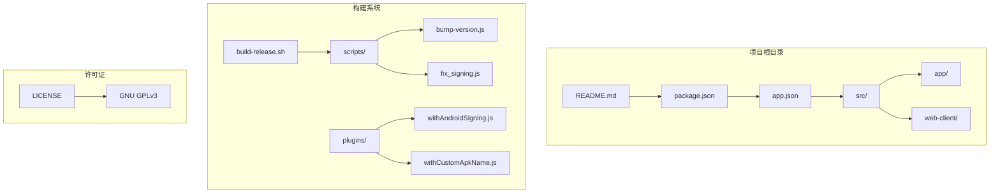
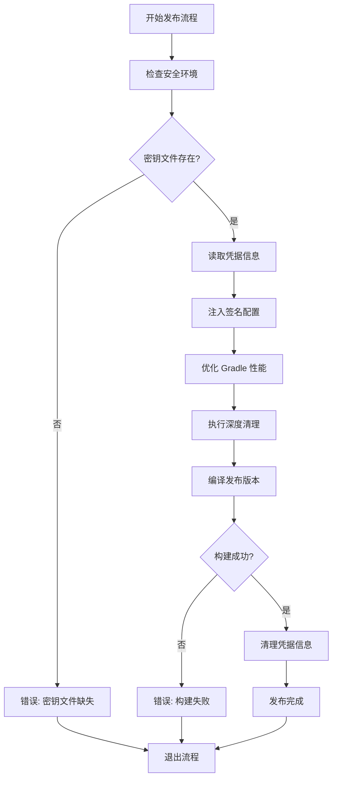
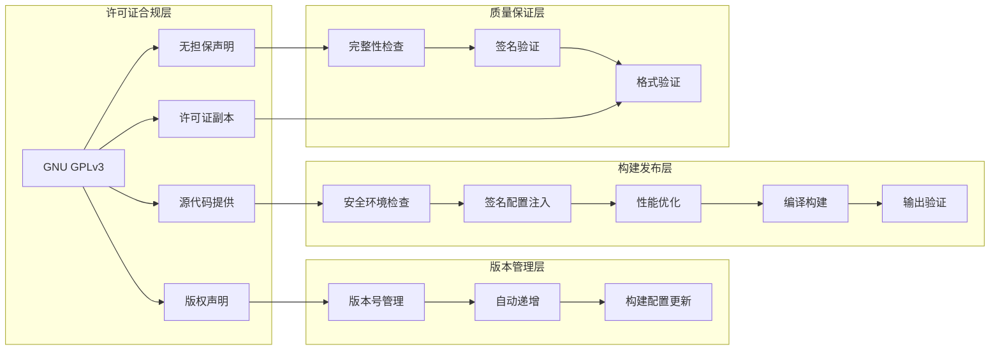
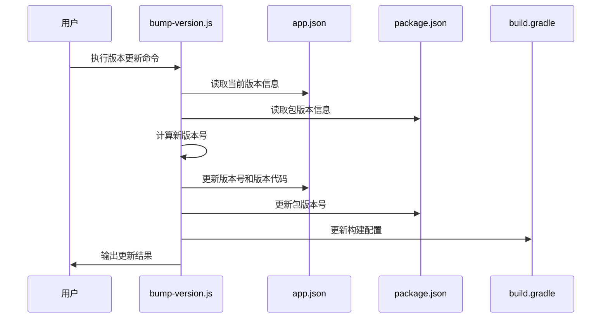
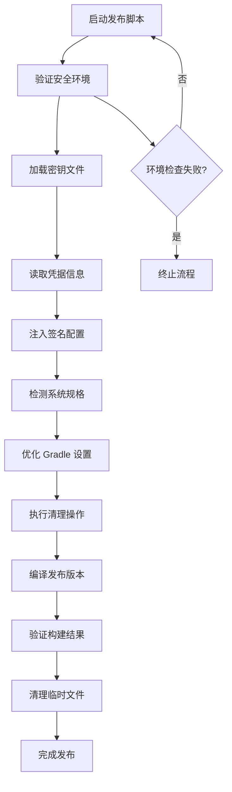
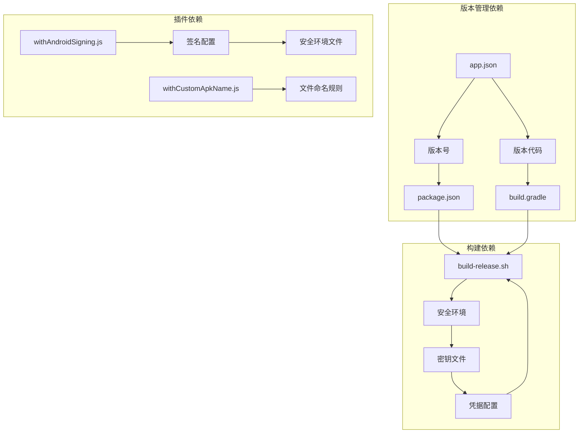

# 发布协议

<cite>
**本文档引用的文件**
- [README.md](file://README.md)
- [LICENSE](file://LICENSE)
- [package.json](file://package.json)
- [app.json](file://app.json)
- [build-release.sh](file://build-release.sh)
- [scripts/bump-version.js](file://scripts/bump-version.js)
- [plugins/withAndroidSigning.js](file://plugins/withAndroidSigning.js)
- [plugins/withCustomApkName.js](file://plugins/withCustomApkName.js)
- [scripts/fix_signing.js](file://scripts/fix_signing.js)
</cite>

## 目录
1. [简介](#简介)
2. [项目结构](#项目结构)
3. [核心组件](#核心组件)
4. [架构概览](#架构概览)
5. [详细组件分析](#详细组件分析)
6. [依赖关系分析](#依赖关系分析)
7. [性能考虑](#性能考虑)
8. [故障排除指南](#故障排除指南)
9. [结论](#结论)

## 简介

Nexara 是一个基于 GNU General Public License v3.0 (GPLv3) 许可证发布的开源 Android AI 助手客户端。该项目采用本地优先的数据管理模式，专注于多提供商模型访问和 RAG 知识引擎。根据 GPLv3 许可证的要求，所有分发的软件副本都必须包含原始版权通知、无担保声明以及许可证副本。

## 项目结构

Nexara 项目采用现代化的 React Native 架构，结合 Expo SDK 54 和 TypeScript 实现。项目结构清晰地分离了移动端应用、Web 客户端、构建脚本和发布配置。

**图表来源**
- [README.md:1-161](file://README.md#L1-L161)
- [package.json:1-120](file://package.json#L1-L120)
- [app.json:1-64](file://app.json#L1-L64)

**章节来源**
- [README.md:1-161](file://README.md#L1-L161)
- [package.json:1-120](file://package.json#L1-L120)
- [app.json:1-64](file://app.json#L1-L64)

## 核心组件

### 许可证管理组件

Nexara 严格遵守 GPLv3 许可证要求，确保所有分发版本都符合开源协议标准：

- **版权声明**: 项目明确标注版权归属和许可证类型
- **源代码提供**: 分发时必须包含完整的源代码或提供获取方式
- **无担保声明**: 明确声明软件按"现状"提供，不提供任何担保
- **许可证副本**: 每个分发版本都必须包含完整的许可证文本

### 版本控制系统

项目实现了完善的版本管理机制，包括：

- **版本号格式**: 采用语义化版本控制 (major.minor.patch)
- **版本代码**: Android 应用程序版本代码自动递增
- **构建配置**: 通过脚本自动化版本更新流程

### 构建发布系统

**图表来源**
- [build-release.sh:1-99](file://build-release.sh#L1-L99)
- [scripts/bump-version.js:1-65](file://scripts/bump-version.js#L1-L65)

**章节来源**
- [LICENSE:1-620](file://LICENSE#L1-L620)
- [build-release.sh:1-99](file://build-release.sh#L1-L99)
- [scripts/bump-version.js:1-65](file://scripts/bump-version.js#L1-L65)

## 架构概览

Nexara 的发布架构围绕 GPLv3 许可证要求构建，确保合规性和可追溯性：

**图表来源**
- [LICENSE:71-449](file://LICENSE#L71-L449)
- [app.json:6-28](file://app.json#L6-L28)
- [package.json:3](file://package.json#L3)

## 详细组件分析

### 版本管理系统

版本管理系统实现了自动化的版本更新和构建配置同步：

#### 版本更新流程

**图表来源**
- [scripts/bump-version.js:12-65](file://scripts/bump-version.js#L12-L65)

#### 版本管理特性

- **语义化版本控制**: 支持补丁版本和次要版本更新
- **自动版本代码递增**: Android 应用版本代码自动增加
- **多文件同步更新**: 确保所有配置文件版本一致性
- **构建配置同步**: 自动更新 Gradle 构建文件

**章节来源**
- [scripts/bump-version.js:1-65](file://scripts/bump-version.js#L1-L65)
- [app.json:6](file://app.json#L6)

### 构建发布系统

构建发布系统提供了完整的自动化构建流程，确保发布质量和安全性：

#### 发布流程分析

**图表来源**
- [build-release.sh:15-99](file://build-release.sh#L15-L99)

#### 安全配置管理

插件系统实现了安全的签名配置管理：

- **动态密钥加载**: 从安全环境文件加载密钥信息
- **回退机制**: 当安全环境不可用时使用调试签名
- **配置注入**: 自动将签名配置注入到构建文件中

**章节来源**
- [build-release.sh:1-99](file://build-release.sh#L1-L99)
- [plugins/withAndroidSigning.js:1-62](file://plugins/withAndroidSigning.js#L1-L62)

### 文件命名规范

自定义 APK 命名系统确保发布文件的可识别性和追踪性：

| 文件类型 | 命名模式 | 示例 |
|---------|---------|------|
| 签名发布版 | Nexara-v[版本]-Release-Signed-[日期].apk | Nexara-v1.2.75-Release-Signed-20261201.apk |
| 未签名发布版 | Nexara-v[版本]-Release-Unsigned-[日期].apk | Nexara-v1.2.75-Release-Unsigned-20261201.apk |
| 调试版本 | Nexara-v[版本]-Debug-[日期].apk | Nexara-v1.2.75-Debug-20261201.apk |

**章节来源**
- [plugins/withCustomApkName.js:1-85](file://plugins/withCustomApkName.js#L1-L85)

## 依赖关系分析

### 许可证兼容性矩阵

| 依赖组件 | 许可证类型 | 兼容性 | 备注 |
|---------|-----------|--------|------|
| @op-engineering/op-sqlite | MIT | ✅ 兼容 | 数据库核心依赖 |
| llama.rn | MIT | ✅ 兼容 | 本地推理引擎 |
| react-native | MIT | ✅ 兼容 | 移动端框架 |
| expo | MIT | ✅ 兼容 | 开发框架 |
| react | MIT | ✅ 兼容 | 用户界面库 |
| @notifee/react-native | Apache-2.0 | ✅ 兼容 | 通知服务 |
| @react-native-community/slider | MIT | ✅ 兼容 | UI 组件 |

### 版本管理依赖

**图表来源**
- [app.json:6](file://app.json#L6)
- [package.json:3](file://package.json#L3)
- [build-release.sh:25-31](file://build-release.sh#L25-L31)

**章节来源**
- [package.json:14-95](file://package.json#L14-L95)
- [app.json:6](file://app.json#L6)

## 性能考虑

### 构建性能优化

构建系统实现了智能的性能优化策略：

- **内存优化**: 根据系统内存自动调整 JVM 堆大小
- **并行构建**: 利用多核处理器优化构建速度
- **清理策略**: 深度清理构建缓存确保一致性
- **条件编译**: 根据硬件规格选择最优配置

### 发布流程效率

发布流程经过精心设计以提高效率：

- **自动化程度**: 减少手动干预步骤
- **错误处理**: 完善的错误检测和恢复机制
- **日志记录**: 详细的执行过程跟踪
- **资源管理**: 自动清理临时文件和资源

## 故障排除指南

### 常见问题及解决方案

#### 版本更新失败

**问题症状**: 版本更新脚本执行失败
**可能原因**:
- 权限不足
- 配置文件损坏
- 依赖组件缺失

**解决步骤**:
1. 检查文件权限
2. 验证配置文件格式
3. 确认依赖组件安装

#### 构建签名问题

**问题症状**: 发布版本签名失败
**可能原因**:
- 密钥文件缺失
- 凭据信息错误
- 构建配置不正确

**解决步骤**:
1. 验证安全环境文件存在
2. 检查密钥文件完整性
3. 确认凭据信息正确性

#### 构建性能问题

**问题症状**: 构建过程缓慢或失败
**可能原因**:
- 内存不足
- 磁盘空间不足
- 网络连接问题

**解决步骤**:
1. 检查系统资源使用情况
2. 清理磁盘空间
3. 验证网络连接稳定性

**章节来源**
- [build-release.sh:15-31](file://build-release.sh#L15-L31)
- [scripts/bump-version.js:13-16](file://scripts/bump-version.js#L13-L16)

## 结论

Nexara 的发布协议体系体现了对 GPLv3 许可证的严格遵守和对开源社区的承诺。通过自动化的版本管理、安全的构建流程和完善的质量保证机制，项目确保了发布过程的合规性和可靠性。

### 主要特点总结

1. **完全合规**: 严格遵循 GPLv3 许可证的所有要求
2. **自动化程度高**: 最小化手动干预，提高效率
3. **安全性强**: 安全的密钥管理和凭据保护机制
4. **可追溯性**: 完整的版本历史和构建记录
5. **质量保证**: 多层次的质量检查和验证机制

该发布协议体系为开源项目的发布管理提供了最佳实践参考，确保了项目的可持续发展和社区贡献者的权益保护。