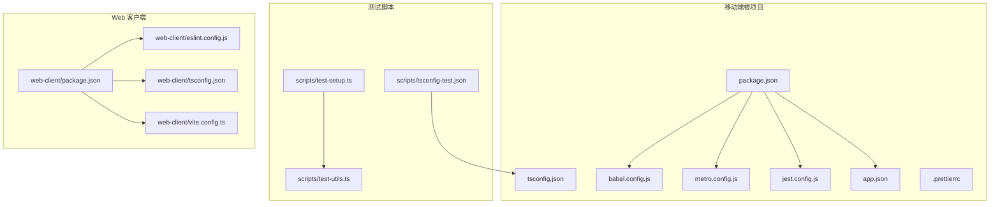
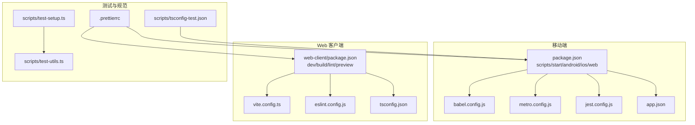
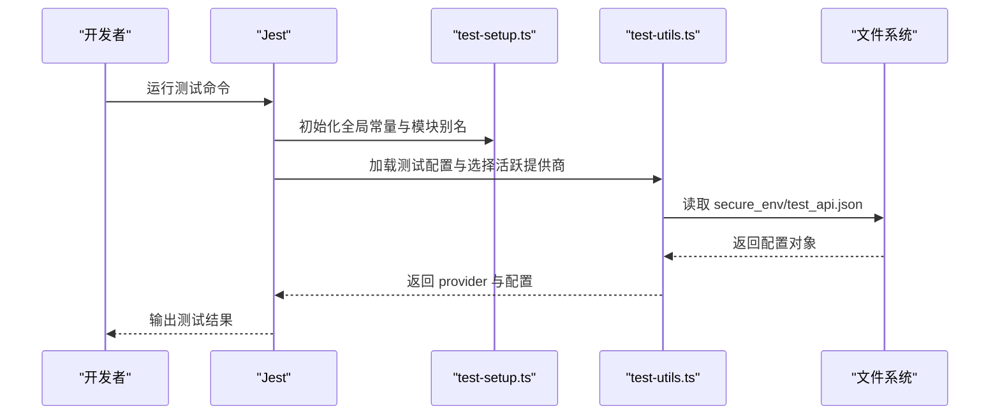
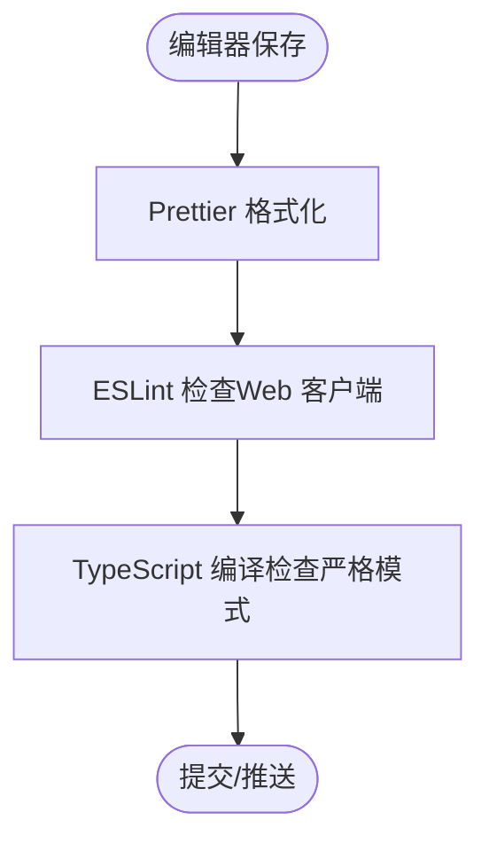
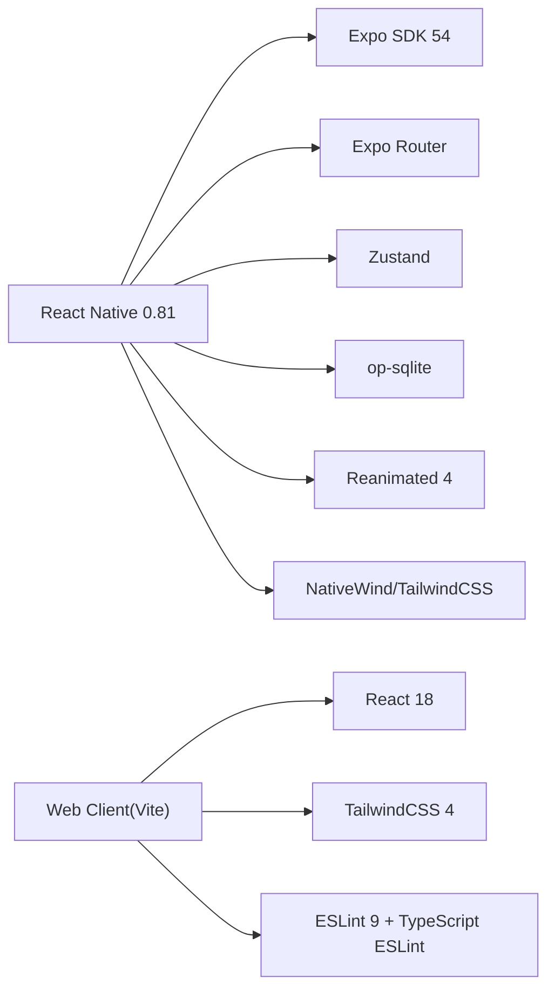

# 开发指南

<cite>
**本文引用的文件**
- [package.json](file://package.json)
- [tsconfig.json](file://tsconfig.json)
- [babel.config.js](file://babel.config.js)
- [metro.config.js](file://metro.config.js)
- [jest.config.js](file://jest.config.js)
- [.prettierrc](file://.prettierrc)
- [app.json](file://app.json)
- [README.md](file://README.md)
- [scripts/test-setup.ts](file://scripts/test-setup.ts)
- [scripts/test-utils.ts](file://scripts/test-utils.ts)
- [scripts/tsconfig-test.json](file://scripts/tsconfig-test.json)
- [web-client/eslint.config.js](file://web-client/eslint.config.js)
- [web-client/package.json](file://web-client/package.json)
- [web-client/tsconfig.json](file://web-client/tsconfig.json)
- [web-client/vite.config.ts](file://web-client/vite.config.ts)
</cite>

## 目录
1. [简介](#简介)
2. [项目结构](#项目结构)
3. [核心组件](#核心组件)
4. [架构总览](#架构总览)
5. [详细组件分析](#详细组件分析)
6. [依赖分析](#依赖分析)
7. [性能考虑](#性能考虑)
8. [故障排除指南](#故障排除指南)
9. [结论](#结论)
10. [附录](#附录)

## 简介
本开发指南面向 Nexara 项目的前端与移动端开发者，覆盖开发环境搭建、代码规范与最佳实践、调试与性能分析、测试策略与工具使用、Git 工作流程与代码审查流程，以及常见问题的排查与解决。Nexara 基于 Expo SDK 54 + React Native（新架构），采用 TypeScript、NativeWind（TailwindCSS）、Expo Router 文件路由、Zustand 状态管理，并通过 op-sqlite 提供本地数据库能力。

## 项目结构
项目采用“单仓多包”的组织方式：
- 移动端应用根目录：app.json、package.json、tsconfig.json、babel.config.js、metro.config.js、jest.config.js、.prettierrc 等核心配置
- 测试脚本与工具：scripts/ 下的测试初始化、配置加载与环境准备
- Web 客户端：web-client/ 子项目，独立的 Vite + React 18 + TailwindCSS 4 应用，用于远程管理与可视化

**图表来源**
- [package.json:1-120](file://package.json#L1-L120)
- [babel.config.js:1-14](file://babel.config.js#L1-L14)
- [metro.config.js:1-13](file://metro.config.js#L1-L13)
- [jest.config.js:1-9](file://jest.config.js#L1-L9)
- [app.json:1-64](file://app.json#L1-L64)
- [.prettierrc:1-8](file://.prettierrc#L1-L8)
- [scripts/test-setup.ts:1-13](file://scripts/test-setup.ts#L1-L13)
- [scripts/test-utils.ts:1-48](file://scripts/test-utils.ts#L1-L48)
- [scripts/tsconfig-test.json:1-19](file://scripts/tsconfig-test.json#L1-L19)
- [web-client/package.json:1-52](file://web-client/package.json#L1-L52)
- [web-client/eslint.config.js:1-24](file://web-client/eslint.config.js#L1-L24)
- [web-client/tsconfig.json:1-8](file://web-client/tsconfig.json#L1-L8)
- [web-client/vite.config.ts:1-17](file://web-client/vite.config.ts#L1-L17)

**章节来源**
- [README.md:1-161](file://README.md#L1-L161)
- [package.json:1-120](file://package.json#L1-L120)
- [app.json:1-64](file://app.json#L1-L64)

## 核心组件
- 构建与打包
  - Metro 配置：watchFolders、nodeModulesPaths、assetExts 扩展与 NativeWind 集成
  - Babel 预设：babel-preset-expo 与 nativewind/babel，插件启用 worklets-core 与 reanimated
- 测试框架
  - Jest 预设：react-native，transformIgnorePatterns 放行部分依赖，testPathIgnorePatterns 排除原生平台目录
  - 测试初始化：模块别名注册、全局常量与 polyfill
  - 测试配置：tsconfig-test.json 继承主 tsconfig，配置路径映射与 ts-node require
- 规范与格式化
  - Prettier：单引号、尾随逗号、行长、制表符宽度、分号
  - ESLint（Web 客户端）：推荐规则、React Hooks、React Refresh、TypeScript ESLint
- 应用元数据
  - app.json：应用名称、版本、权限、iOS/Android 标识、插件列表（含自定义插件）

**章节来源**
- [metro.config.js:1-13](file://metro.config.js#L1-L13)
- [babel.config.js:1-14](file://babel.config.js#L1-L14)
- [jest.config.js:1-9](file://jest.config.js#L1-L9)
- [scripts/test-setup.ts:1-13](file://scripts/test-setup.ts#L1-L13)
- [scripts/test-utils.ts:1-48](file://scripts/test-utils.ts#L1-L48)
- [scripts/tsconfig-test.json:1-19](file://scripts/tsconfig-test.json#L1-L19)
- [.prettierrc:1-8](file://.prettierrc#L1-L8)
- [web-client/eslint.config.js:1-24](file://web-client/eslint.config.js#L1-L24)
- [app.json:1-64](file://app.json#L1-L64)

## 架构总览
下图展示移动端与 Web 客户端的构建与运行关系，以及测试与规范工具的协作：

**图表来源**
- [package.json:1-120](file://package.json#L1-L120)
- [babel.config.js:1-14](file://babel.config.js#L1-L14)
- [metro.config.js:1-13](file://metro.config.js#L1-L13)
- [jest.config.js:1-9](file://jest.config.js#L1-L9)
- [app.json:1-64](file://app.json#L1-L64)
- [web-client/package.json:1-52](file://web-client/package.json#L1-L52)
- [web-client/vite.config.ts:1-17](file://web-client/vite.config.ts#L1-L17)
- [web-client/eslint.config.js:1-24](file://web-client/eslint.config.js#L1-L24)
- [web-client/tsconfig.json:1-8](file://web-client/tsconfig.json#L1-L8)
- [scripts/test-setup.ts:1-13](file://scripts/test-setup.ts#L1-L13)
- [scripts/test-utils.ts:1-48](file://scripts/test-utils.ts#L1-L48)
- [scripts/tsconfig-test.json:1-19](file://scripts/tsconfig-test.json#L1-L19)
- [.prettierrc:1-8](file://.prettierrc#L1-L8)

## 详细组件分析

### 构建与打包配置
- Metro 配置要点
  - watchFolders 与 nodeModulesPaths 确保模块解析与热更新行为符合预期
  - assetExts 新增 bundle 扩展以支持资源类型
  - 与 NativeWind 集成，输入样式文件为 global.css
- Babel 配置要点
  - 使用 nativewind 的 JSX 导入源，确保 Tailwind 类名在 RN 环境生效
  - 启用 worklets-core 与 reanimated 插件，满足动画与工作线程需求
- TypeScript 配置要点
  - 继承 expo/tsconfig.base，启用严格模式
  - 排除 web-client、测试目录与参考 UI 目录，避免编译污染
- 应用元数据
  - app.json 中声明权限、插件与平台标识，便于调试与发布

**图表来源**
- [metro.config.js:1-13](file://metro.config.js#L1-L13)
- [babel.config.js:1-14](file://babel.config.js#L1-L14)
- [tsconfig.json:1-14](file://tsconfig.json#L1-L14)
- [app.json:1-64](file://app.json#L1-L64)

**章节来源**
- [metro.config.js:1-13](file://metro.config.js#L1-L13)
- [babel.config.js:1-14](file://babel.config.js#L1-L14)
- [tsconfig.json:1-14](file://tsconfig.json#L1-L14)
- [app.json:1-64](file://app.json#L1-L64)

### 测试策略与工具
- 测试框架与配置
  - Jest 预设：react-native，transformIgnorePatterns 放行常用 RN 与 Expo 依赖
  - testPathIgnorePatterns 排除原生平台目录，聚焦跨平台测试
- 测试初始化与环境
  - test-setup.ts：设置 __DEV__ 常量、注册模块别名（如 async-storage、op-sqlite、expo-file-system）
  - test-utils.ts：加载 secure_env/test_api.json，polyfill XMLHttpRequest，按优先级选择活跃提供商
  - tsconfig-test.json：继承主 tsconfig，配置路径映射与 ts-node require
- 测试执行建议
  - 使用 npm/yarn 脚本启动测试，结合 transformIgnorePatterns 保证第三方库正确转换
  - 在 CI 中统一注入测试配置文件，避免缺失时报错

**图表来源**
- [jest.config.js:1-9](file://jest.config.js#L1-L9)
- [scripts/test-setup.ts:1-13](file://scripts/test-setup.ts#L1-L13)
- [scripts/test-utils.ts:1-48](file://scripts/test-utils.ts#L1-L48)
- [scripts/tsconfig-test.json:1-19](file://scripts/tsconfig-test.json#L1-L19)

**章节来源**
- [jest.config.js:1-9](file://jest.config.js#L1-L9)
- [scripts/test-setup.ts:1-13](file://scripts/test-setup.ts#L1-L13)
- [scripts/test-utils.ts:1-48](file://scripts/test-utils.ts#L1-L48)
- [scripts/tsconfig-test.json:1-19](file://scripts/tsconfig-test.json#L1-L19)

### 代码规范与格式化
- Prettier 规则
  - 单引号、尾随逗号、行长、制表符宽度、分号
- ESLint（Web 客户端）
  - 推荐规则、React Hooks、React Refresh、TypeScript ESLint
  - 语言选项启用 ECMAScript 2020，浏览器全局变量
- TypeScript 严格模式
  - 主 tsconfig 启用 strict，提升类型安全

**图表来源**
- [.prettierrc:1-8](file://.prettierrc#L1-L8)
- [web-client/eslint.config.js:1-24](file://web-client/eslint.config.js#L1-L24)
- [tsconfig.json:1-14](file://tsconfig.json#L1-L14)

**章节来源**
- [.prettierrc:1-8](file://.prettierrc#L1-L8)
- [web-client/eslint.config.js:1-24](file://web-client/eslint.config.js#L1-L24)
- [tsconfig.json:1-14](file://tsconfig.json#L1-L14)

### 调试与性能分析
- 移动端调试
  - 使用 Expo DevClient 与 Metro 服务，结合 app.json 中的 scheme 与权限配置
  - 利用 Expo Dev Menu 进行网络拦截、截图、性能分析等
- Web 客户端调试
  - Vite dev 服务，支持热更新与快速迭代
- 性能分析建议
  - 关注 Reanimated 与 Worklets 的使用，避免主线程阻塞
  - 使用 Metro 与 React DevTools 分析组件渲染与状态变化
  - 结合 Web 客户端的 ECharts、Mermaid 等可视化组件进行数据与图表性能评估

**章节来源**
- [app.json:1-64](file://app.json#L1-L64)
- [web-client/package.json:1-52](file://web-client/package.json#L1-L52)
- [web-client/vite.config.ts:1-17](file://web-client/vite.config.ts#L1-L17)

## 依赖分析
- 核心运行时依赖
  - Expo SDK 54、React 19、React Native 0.81、Expo Router、Zustand、op-sqlite、Reanimated 4、NativeWind、TailwindCSS
- 开发时依赖
  - TypeScript ~5.9、Jest、ts-jest、tsx、prettier、@types/*、babel-preset-expo、patch-package
- Web 客户端依赖
  - Vite、React 18、TailwindCSS 4、ESLint 9、TypeScript ESLint、Framer Motion、ECharts、Mermaid

**图表来源**
- [package.json:1-120](file://package.json#L1-L120)
- [web-client/package.json:1-52](file://web-client/package.json#L1-L52)

**章节来源**
- [package.json:1-120](file://package.json#L1-L120)
- [web-client/package.json:1-52](file://web-client/package.json#L1-L52)

## 性能考虑
- 构建与打包
  - Metro watchFolders 与 assetExts 配置影响增量构建速度
  - Babel 与 Reanimated 插件需谨慎升级，避免破坏工作线程与动画性能
- 运行时
  - 使用 Reanimated 4 与 Worklets Core 提升动画与计算性能
  - op-sqlite 的 FTS5 与向量 BLOB 存储需合理设计索引与查询计划
- Web 客户端
  - Vite Rollup 输出命名策略减少缓存失效
  - TailwindCSS 4 与 PostCSS 优化样式体积

**章节来源**
- [metro.config.js:1-13](file://metro.config.js#L1-L13)
- [babel.config.js:1-14](file://babel.config.js#L1-L14)
- [package.json:1-120](file://package.json#L1-L120)
- [web-client/vite.config.ts:1-17](file://web-client/vite.config.ts#L1-L17)

## 故障排除指南
- Metro/打包问题
  - 症状：无法解析模块或资源未更新
  - 处理：确认 watchFolders 与 nodeModulesPaths 设置；清理 Metro 缓存后重试
- Babel/Reanimated 插件报错
  - 症状：动画异常或编译失败
  - 处理：核对 babel-preset-expo 与插件顺序；确保版本兼容
- Jest 测试失败
  - 症状：第三方库未转换或找不到配置文件
  - 处理：检查 transformIgnorePatterns；确保 secure_env/test_api.json 存在且可读
- Web 客户端 Lint/构建错误
  - 症状：ESLint 报错或 Vite 构建失败
  - 处理：遵循 eslint.config.js 推荐规则；检查 tsconfig 引用与插件配置
- 权限与平台配置
  - 症状：相机/相册/存储权限不足
  - 处理：核对 app.json 中 permissions 与 bundleIdentifier/package 设置

**章节来源**
- [metro.config.js:1-13](file://metro.config.js#L1-L13)
- [babel.config.js:1-14](file://babel.config.js#L1-L14)
- [jest.config.js:1-9](file://jest.config.js#L1-L9)
- [scripts/test-utils.ts:1-48](file://scripts/test-utils.ts#L1-L48)
- [web-client/eslint.config.js:1-24](file://web-client/eslint.config.js#L1-L24)
- [web-client/vite.config.ts:1-17](file://web-client/vite.config.ts#L1-L17)
- [app.json:1-64](file://app.json#L1-L64)

## 结论
本指南提供了 Nexara 项目从环境搭建到测试与调试的全链路实践建议。通过统一的构建与规范配置、完善的测试初始化与工具链、以及清晰的 Git 工作流程与代码审查流程，团队可以高效地推进开发与质量保障。

## 附录
- 快速开始（来自仓库说明）
  - 克隆仓库、安装依赖、预构建、运行 Android 模拟器或真机
- 版本与脚本
  - package.json 中包含 start/android/ios/web 等常用脚本
- Web 客户端
  - 提供 dev/build/lint/preview 等脚本，独立于移动端运行

**章节来源**
- [README.md:62-70](file://README.md#L62-L70)
- [README.md:134-142](file://README.md#L134-L142)
- [package.json:5-12](file://package.json#L5-L12)
- [web-client/package.json:6-11](file://web-client/package.json#L6-L11)