# 开发指南

<cite>
**本文引用的文件**
- [package.json](file://package.json)
- [tsconfig.json](file://tsconfig.json)
- [babel.config.js](file://babel.config.js)
- [metro.config.js](file://metro.config.js)
- [jest.config.js](file://jest.config.js)
- [.prettierrc](file://.prettierrc)
- [app.json](file://app.json)
- [README.md](file://README.md)
- [scripts/test-setup.ts](file://scripts/test-setup.ts)
- [scripts/test-utils.ts](file://scripts/test-utils.ts)
- [scripts/tsconfig-test.json](file://scripts/tsconfig-test.json)
- [web-client/eslint.config.js](file://web-client/eslint.config.js)
- [web-client/package.json](file://web-client/package.json)
- [web-client/tsconfig.json](file://web-client/tsconfig.json)
- [web-client/vite.config.ts](file://web-client/vite.config.ts)
- [src/lib/artifact-parser.ts](file://src/lib/artifact-parser.ts)
- [src/lib/__tests__/artifact-parser.test.ts](file://src/lib/__tests__/artifact-parser.test.ts)
- [src/types/artifact.ts](file://src/types/artifact.ts)
- [src/constants/artifact-config.ts](file://src/constants/artifact-config.ts)
- [src/components/chat/renderers/RendererRegistry.ts](file://src/components/chat/renderers/RendererRegistry.ts)
- [src/components/chat/renderers/index.ts](file://src/components/chat/renderers/index.ts)
- [src/components/chat/renderers/types.ts](file://src/components/chat/renderers/types.ts)
- [src/components/chat/renderers/echarts-renderer-config.tsx](file://src/components/chat/renderers/echarts-renderer-config.tsx)
- [src/components/chat/renderers/mermaid-renderer-config.tsx](file://src/components/chat/renderers/mermaid-renderer-config.tsx)
- [src/store/artifact-store.ts](file://src/store/artifact-store.ts)
- [src/features/chat/utils/artifact-extractor.ts](file://src/features/chat/utils/artifact-extractor.ts)
- [scripts/agent-test/README.md](file://scripts/agent-test/README.md)
- [scripts/agent-test/cli.ts](file://scripts/agent-test/cli.ts)
- [scripts/agent-test/config.ts](file://scripts/agent-test/config.ts)
- [scripts/agent-test/diagnostician/error-classifier.ts](file://scripts/agent-test/diagnostician/error-classifier.ts)
- [scripts/agent-test/diagnostician/fix-strategies.ts](file://scripts/agent-test/diagnostician/fix-strategies.ts)
- [scripts/agent-test/diagnostician/stack-parser.ts](file://scripts/agent-test/diagnostician/stack-parser.ts)
- [scripts/agent-test/fix/rollback-manager.ts](file://scripts/agent-test/fix/rollback-manager.ts)
- [scripts/agent-test/fix/safe-modifier.ts](file://scripts/agent-test/fix/safe-modifier.ts)
- [scripts/agent-test/runner/benchmark-runner.ts](file://scripts/agent-test/runner/benchmark-runner.ts)
- [scripts/agent-test/runner/jest-runner.ts](file://scripts/agent-test/runner/jest-runner.ts)
- [scripts/agent-test/parser/jest-parser.ts](file://scripts/agent-test/parser/jest-parser.ts)
- [scripts/agent-test/utils/file-ops.ts](file://scripts/agent-test/utils/file-ops.ts)
</cite>

## 更新摘要
**所做更改**
- 新增智能测试框架章节，详细介绍 Agent Test Framework 的完整架构
- 添加诊断引擎、自动修复系统、基准测试和视觉回归测试功能说明
- 更新测试策略与工具章节，反映新的自动化测试基础设施
- 新增 CLI 接口、配置管理、日志记录等核心组件说明
- 补充错误分类器、堆栈解析器、回滚管理器等诊断工具的技术文档

## 目录
1. [简介](#简介)
2. [项目结构](#项目结构)
3. [核心组件](#核心组件)
4. [架构总览](#架构总览)
5. [详细组件分析](#详细组件分析)
6. [智能测试框架](#智能测试框架)
7. [诊断引擎](#诊断引擎)
8. [自动修复系统](#自动修复系统)
9. [基准测试](#基准测试)
10. [视觉回归测试](#视觉回归测试)
11. [配置管理](#配置管理)
12. [日志与报告](#日志与报告)
13. [依赖分析](#依赖分析)
14. [性能考虑](#性能考虑)
15. [故障排除指南](#故障排除指南)
16. [结论](#结论)
17. [附录](#附录)

## 简介
本开发指南面向 Nexara 项目的前端与移动端开发者，覆盖开发环境搭建、代码规范与最佳实践、调试与性能分析、测试策略与工具使用、Git 工作流程与代码审查流程，以及常见问题的排查与解决。Nexara 基于 Expo SDK 54 + React Native（新架构），采用 TypeScript、NativeWind（TailwindCSS）、Expo Router 文件路由、Zustand 状态管理，并通过 op-sqlite 提供本地数据库能力。

**更新** 新增智能测试框架章节，涵盖 Agent Test Framework 的完整架构，包括 CLI 接口、诊断引擎、自动修复系统、基准测试和视觉回归测试功能。

## 项目结构
项目采用"单仓多包"的组织方式：
- 移动端应用根目录：app.json、package.json、tsconfig.json、babel.config.js、metro.config.js、jest.config.js、.prettierrc 等核心配置
- 测试脚本与工具：scripts/ 下的测试初始化、配置加载与环境准备
- 智能测试框架：scripts/agent-test/ 下的完整测试基础设施，包括 CLI、诊断引擎、修复系统、基准测试等
- Web 客户端：web-client/ 子项目，独立的 Vite + React 18 + TailwindCSS 4 应用，用于远程管理与可视化
- 工件系统：src/lib/ 下的工件解析器、src/components/chat/renderers/ 下的渲染器系统、src/store/ 下的工件存储

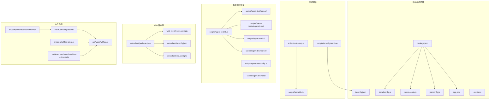

**图表来源**
- [package.json:1-120](file://package.json#L1-L120)
- [babel.config.js:1-14](file://babel.config.js#L1-L14)
- [metro.config.js:1-13](file://metro.config.js#L1-L13)
- [jest.config.js:1-9](file://jest.config.js#L1-L9)
- [app.json:1-64](file://app.json#L1-L64)
- [.prettierrc:1-8](file://.prettierrc#L1-L8)
- [scripts/test-setup.ts:1-13](file://scripts/test-setup.ts#L1-L13)
- [scripts/test-utils.ts:1-48](file://scripts/test-utils.ts#L1-L48)
- [scripts/tsconfig-test.json:1-19](file://scripts/tsconfig-test.json#L1-L19)
- [scripts/agent-test/README.md:1-153](file://scripts/agent-test/README.md#L1-L153)
- [scripts/agent-test/cli.ts:1-503](file://scripts/agent-test/cli.ts#L1-L503)
- [scripts/agent-test/config.ts:1-118](file://scripts/agent-test/config.ts#L1-L118)
- [web-client/package.json:1-52](file://web-client/package.json#L1-L52)
- [web-client/eslint.config.js:1-24](file://web-client/eslint.config.js#L1-L24)
- [web-client/tsconfig.json:1-8](file://web-client/tsconfig.json#L1-L8)
- [web-client/vite.config.ts:1-17](file://web-client/vite.config.ts#L1-L17)
- [src/lib/artifact-parser.ts:1-238](file://src/lib/artifact-parser.ts#L1-L238)
- [src/types/artifact.ts:1-51](file://src/types/artifact.ts#L1-L51)
- [src/store/artifact-store.ts:1-343](file://src/store/artifact-store.ts#L1-L343)
- [src/components/chat/renderers/RendererRegistry.ts:1-53](file://src/components/chat/renderers/RendererRegistry.ts#L1-L53)
- [src/features/chat/utils/artifact-extractor.ts:1-229](file://src/features/chat/utils/artifact-extractor.ts#L1-L229)

**章节来源**
- [README.md:1-161](file://README.md#L1-L161)
- [package.json:1-120](file://package.json#L1-L120)
- [app.json:1-64](file://app.json#L1-L64)

## 核心组件
- 构建与打包
  - Metro 配置：watchFolders、nodeModulesPaths、assetExts 扩展与 NativeWind 集成
  - Babel 预设：babel-preset-expo 与 nativewind/babel，插件启用 worklets-core 与 reanimated
- 测试框架
  - Jest 预设：react-native，transformIgnorePatterns 放行部分依赖，testPathIgnorePatterns 排除原生平台目录
  - 测试初始化：模块别名注册、全局常量与 polyfill
  - 测试配置：tsconfig-test.json 继承主 tsconfig，配置路径映射与 ts-node require
  - 智能测试框架：Agent Test Framework 提供 CLI 接口、诊断引擎、自动修复系统
- 规范与格式化
  - Prettier：单引号、尾随逗号、行长、制表符宽度、分号
  - ESLint（Web 客户端）：推荐规则、React Hooks、React Refresh、TypeScript ESLint
- 应用元数据
  - app.json：应用名称、版本、权限、iOS/Android 标识、插件列表（含自定义插件）

**章节来源**
- [metro.config.js:1-13](file://metro.config.js#L1-L13)
- [babel.config.js:1-14](file://babel.config.js#L1-L14)
- [jest.config.js:1-9](file://jest.config.js#L1-L9)
- [scripts/test-setup.ts:1-13](file://scripts/test-setup.ts#L1-L13)
- [scripts/test-utils.ts:1-48](file://scripts/test-utils.ts#L1-L48)
- [scripts/tsconfig-test.json:1-19](file://scripts/tsconfig-test.json#L1-L19)
- [scripts/agent-test/cli.ts:1-503](file://scripts/agent-test/cli.ts#L1-L503)
- [scripts/agent-test/diagnostician/error-classifier.ts:1-527](file://scripts/agent-test/diagnostician/error-classifier.ts#L1-L527)
- [scripts/agent-test/fix/safe-modifier.ts:1-411](file://scripts/agent-test/fix/safe-modifier.ts#L1-L411)
- [.prettierrc:1-8](file://.prettierrc#L1-L8)
- [web-client/eslint.config.js:1-24](file://web-client/eslint.config.js#L1-L24)
- [app.json:1-64](file://app.json#L1-L64)

## 架构总览
下图展示移动端与 Web 客户端的构建与运行关系，以及测试与规范工具的协作，包括新增的智能测试框架：

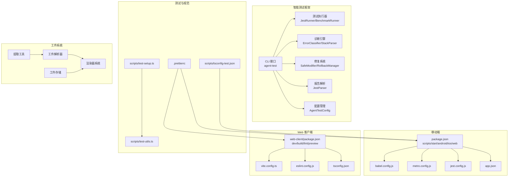

**图表来源**
- [package.json:1-120](file://package.json#L1-L120)
- [babel.config.js:1-14](file://babel.config.js#L1-L14)
- [metro.config.js:1-13](file://metro.config.js#L1-L13)
- [jest.config.js:1-9](file://jest.config.js#L1-L9)
- [app.json:1-64](file://app.json#L1-L64)
- [scripts/agent-test/README.md:1-153](file://scripts/agent-test/README.md#L1-L153)
- [scripts/agent-test/cli.ts:1-503](file://scripts/agent-test/cli.ts#L1-L503)
- [scripts/agent-test/config.ts:1-118](file://scripts/agent-test/config.ts#L1-L118)
- [web-client/package.json:1-52](file://web-client/package.json#L1-L52)
- [web-client/vite.config.ts:1-17](file://web-client/vite.config.ts#L1-L17)
- [web-client/eslint.config.js:1-24](file://web-client/eslint.config.js#L1-L24)
- [web-client/tsconfig.json:1-8](file://web-client/tsconfig.json#L1-L8)
- [scripts/test-setup.ts:1-13](file://scripts/test-setup.ts#L1-L13)
- [scripts/test-utils.ts:1-48](file://scripts/test-utils.ts#L1-L48)
- [scripts/tsconfig-test.json:1-19](file://scripts/tsconfig-test.json#L1-L19)
- [.prettierrc:1-8](file://.prettierrc#L1-L8)
- [src/lib/artifact-parser.ts:1-238](file://src/lib/artifact-parser.ts#L1-L238)
- [src/components/chat/renderers/RendererRegistry.ts:1-53](file://src/components/chat/renderers/RendererRegistry.ts#L1-L53)
- [src/store/artifact-store.ts:1-343](file://src/store/artifact-store.ts#L1-L343)
- [src/features/chat/utils/artifact-extractor.ts:1-229](file://src/features/chat/utils/artifact-extractor.ts#L1-L229)

## 详细组件分析

### 构建与打包配置
- Metro 配置要点
  - watchFolders 与 nodeModulesPaths 确保模块解析与热更新行为符合预期
  - assetExts 新增 bundle 扩展以支持资源类型
  - 与 NativeWind 集成，输入样式文件为 global.css
- Babel 配置要点
  - 使用 nativewind 的 JSX 导入源，确保 Tailwind 类名在 RN 环境生效
  - 启用 worklets-core 与 reanimated 插件，满足动画与工作线程需求
- TypeScript 配置要点
  - 继承 expo/tsconfig.base，启用严格模式
  - 排除 web-client、测试目录与参考 UI 目录，避免编译污染
- 应用元数据
  - app.json 中声明权限、插件与平台标识，便于调试与发布

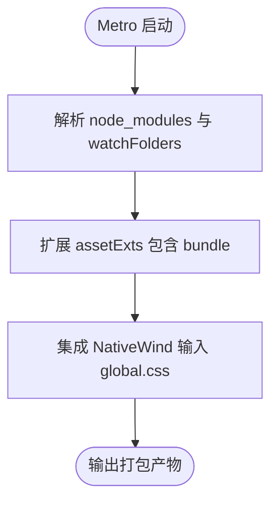

**图表来源**
- [metro.config.js:1-13](file://metro.config.js#L1-L13)
- [babel.config.js:1-14](file://babel.config.js#L1-L14)
- [tsconfig.json:1-14](file://tsconfig.json#L1-L14)
- [app.json:1-64](file://app.json#L1-L64)

**章节来源**
- [metro.config.js:1-13](file://metro.config.js#L1-L13)
- [babel.config.js:1-14](file://babel.config.js#L1-L14)
- [tsconfig.json:1-14](file://tsconfig.json#L1-L14)
- [app.json:1-64](file://app.json#L1-L64)

### 测试策略与工具
- 测试框架与配置
  - Jest 预设：react-native，transformIgnorePatterns 放行常用 RN 与 Expo 依赖
  - testPathIgnorePatterns 排除原生平台目录，聚焦跨平台测试
- 测试初始化与环境
  - test-setup.ts：设置 __DEV__ 常量、注册模块别名（如 async-storage、op-sqlite、expo-file-system）
  - test-utils.ts：加载 secure_env/test_api.json，polyfill XMLHttpRequest，按优先级选择活跃提供商
  - tsconfig-test.json：继承主 tsconfig，配置路径映射与 ts-node require
- 智能测试框架
  - Agent Test Framework：提供 CLI 接口、诊断引擎、自动修复系统、基准测试和视觉回归测试
  - 支持多种运行模式：run、diagnose、fix、benchmark、visual
  - 完整的错误分类和修复策略库
- 测试执行建议
  - 使用 npm/yarn 脚本启动测试，结合 transformIgnorePatterns 保证第三方库正确转换
  - 在 CI 中统一注入测试配置文件，避免缺失时报错

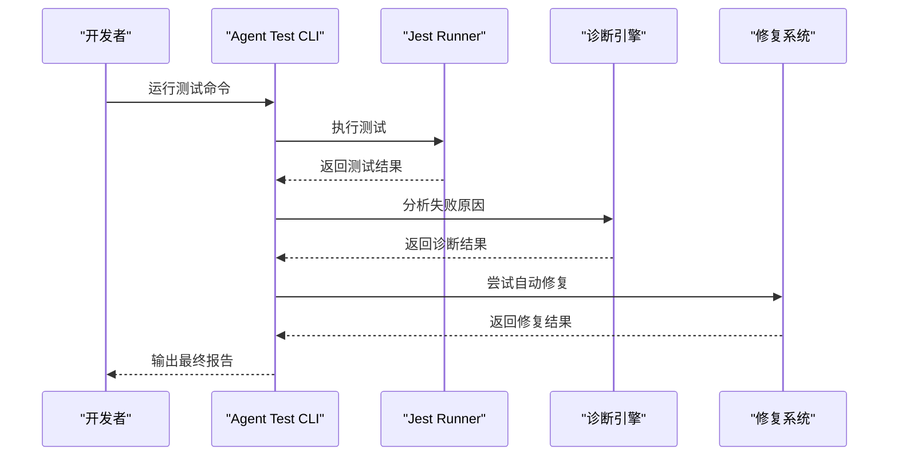

**图表来源**
- [scripts/agent-test/cli.ts:107-186](file://scripts/agent-test/cli.ts#L107-L186)
- [scripts/agent-test/runner/jest-runner.ts:25-62](file://scripts/agent-test/runner/jest-runner.ts#L25-L62)
- [scripts/agent-test/diagnostician/error-classifier.ts:327-454](file://scripts/agent-test/diagnostician/error-classifier.ts#L327-L454)
- [scripts/agent-test/fix/safe-modifier.ts:41-125](file://scripts/agent-test/fix/safe-modifier.ts#L41-L125)

**章节来源**
- [jest.config.js:1-9](file://jest.config.js#L1-L9)
- [scripts/test-setup.ts:1-13](file://scripts/test-setup.ts#L1-L13)
- [scripts/test-utils.ts:1-48](file://scripts/test-utils.ts#L1-L48)
- [scripts/tsconfig-test.json:1-19](file://scripts/tsconfig-test.json#L1-L19)
- [scripts/agent-test/README.md:17-34](file://scripts/agent-test/README.md#L17-L34)
- [scripts/agent-test/cli.ts:107-186](file://scripts/agent-test/cli.ts#L107-L186)

### 代码规范与格式化
- Prettier 规则
  - 单引号、尾随逗号、行长、制表符宽度、分号
- ESLint（Web 客户端）
  - 推荐规则、React Hooks、React Refresh、TypeScript ESLint
  - 语言选项启用 ECMAScript 2020，浏览器全局变量
- TypeScript 严格模式
  - 主 tsconfig 启用 strict，提升类型安全

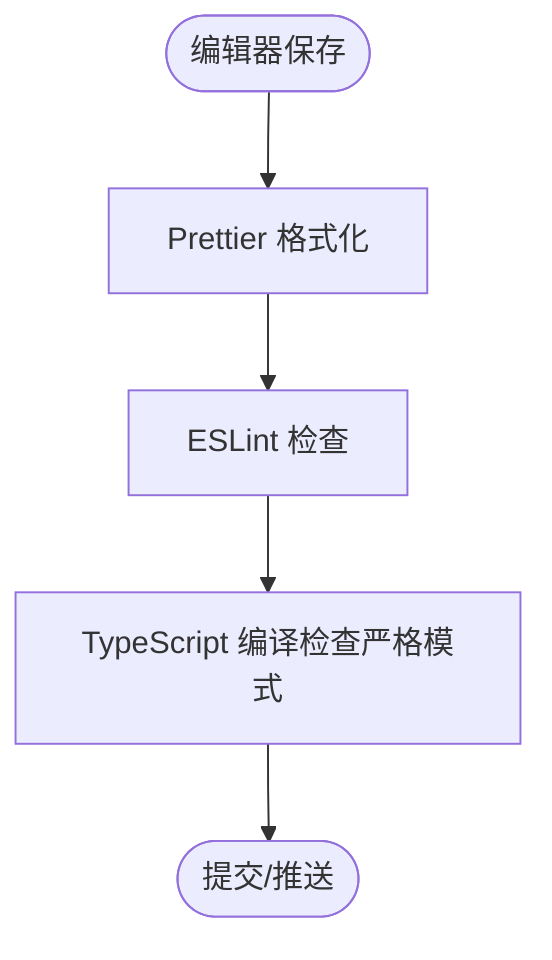

**图表来源**
- [.prettierrc:1-8](file://.prettierrc#L1-L8)
- [web-client/eslint.config.js:1-24](file://web-client/eslint.config.js#L1-L24)
- [tsconfig.json:1-14](file://tsconfig.json#L1-L14)

**章节来源**
- [.prettierrc:1-8](file://.prettierrc#L1-L8)
- [web-client/eslint.config.js:1-24](file://web-client/eslint.config.js#L1-L24)
- [tsconfig.json:1-14](file://tsconfig.json#L1-L14)

### 调试与性能分析
- 移动端调试
  - 使用 Expo DevClient 与 Metro 服务，结合 app.json 中的 scheme 与权限配置
  - 利用 Expo Dev Menu 进行网络拦截、截图、性能分析等
- Web 客户端调试
  - Vite dev 服务，支持热更新与快速迭代
- 性能分析建议
  - 关注 Reanimated 与 Worklets 的使用，避免主线程阻塞
  - 使用 Metro 与 React DevTools 分析组件渲染与状态变化
  - 结合 Web 客户端的 ECharts、Mermaid 等可视化组件进行数据与图表性能评估

**章节来源**
- [app.json:1-64](file://app.json#L1-L64)
- [web-client/package.json:1-52](file://web-client/package.json#L1-L52)
- [web-client/vite.config.ts:1-17](file://web-client/vite.config.ts#L1-L17)

## 智能测试框架

### 框架概述
Agent Test Framework 是 Nexara 项目新增的智能测试基础设施，提供完整的测试生命周期管理，包括测试执行、诊断分析、自动修复、性能基准和视觉回归检测。

#### 核心特性
- **多模式运行**：支持 run、diagnose、fix、benchmark、visual 五种运行模式
- **智能诊断**：基于错误分类器和堆栈解析器的自动化问题分析
- **自动修复**：基于修复策略库的代码自动修复能力
- **性能监控**：内置基准测试执行器，支持性能退化检测
- **可视化报告**：生成详细的测试报告和诊断信息

#### CLI 接口
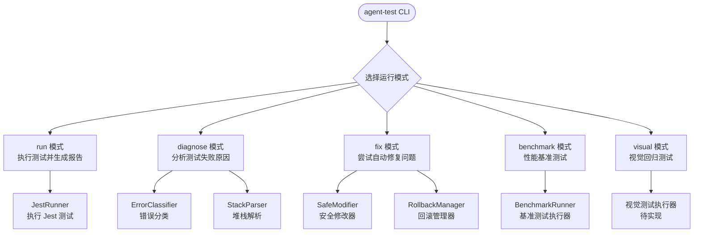

**图表来源**
- [scripts/agent-test/cli.ts:21-77](file://scripts/agent-test/cli.ts#L21-L77)
- [scripts/agent-test/runner/jest-runner.ts:25-62](file://scripts/agent-test/runner/jest-runner.ts#L25-L62)
- [scripts/agent-test/diagnostician/error-classifier.ts:327-454](file://scripts/agent-test/diagnostician/error-classifier.ts#L327-L454)
- [scripts/agent-test/fix/safe-modifier.ts:41-125](file://scripts/agent-test/fix/safe-modifier.ts#L41-L125)
- [scripts/agent-test/runner/benchmark-runner.ts:130-187](file://scripts/agent-test/runner/benchmark-runner.ts#L130-L187)

**章节来源**
- [scripts/agent-test/README.md:1-153](file://scripts/agent-test/README.md#L1-L153)
- [scripts/agent-test/cli.ts:1-503](file://scripts/agent-test/cli.ts#L1-L503)

### CLI 接口设计
CLI 提供灵活的命令行接口，支持多种运行模式和配置选项。

#### 命令行参数
- `--mode=<mode>`：运行模式（run、fix、diagnose、benchmark、visual）
- `--scope=<pattern>`：测试范围（文件路径或 glob 模式）
- `--testNamePattern=<p>`：测试名称匹配模式
- `--coverage`：生成覆盖率报告
- `--no-fix`：禁用自动修复（诊断模式）
- `--updateSnapshot`：更新快照
- `--verbose`：详细输出
- `--help`：显示帮助信息

#### 基本用法示例
```bash
# 运行所有测试
npm run test:agent

# 指定测试范围
npm run test:agent -- --scope=src/lib

# 启用覆盖率报告
npm run test:agent -- --coverage

# 详细输出
npm run test:agent -- --verbose

# 更新快照
npm run test:agent -- --updateSnapshot
```

**章节来源**
- [scripts/agent-test/README.md:17-34](file://scripts/agent-test/README.md#L17-L34)
- [scripts/agent-test/cli.ts:34-77](file://scripts/agent-test/cli.ts#L34-L77)

### 测试执行器
JestRunner 提供统一的测试执行接口，支持各种测试配置和选项。

#### 核心功能
- **测试执行**：调用 Jest 执行测试用例
- **参数构建**：根据配置构建 Jest 命令行参数
- **结果处理**：捕获执行结果和错误信息
- **版本检查**：验证 Jest 可用性和版本信息

#### 支持的选项
- `scope`：测试范围（文件路径或 glob 模式）
- `testNamePattern`：测试名称匹配模式
- `coverage`：生成覆盖率报告
- `jsonOutput`：JSON 报告输出路径
- `updateSnapshot`：更新快照

**章节来源**
- [scripts/agent-test/runner/jest-runner.ts:10-129](file://scripts/agent-test/runner/jest-runner.ts#L10-L129)

## 诊断引擎

### 错误分类器
ErrorClassifier 是诊断引擎的核心组件，负责分析测试失败信息并进行智能分类。

#### 错误分类体系
框架支持以下错误类型：
- `type_error`：类型错误（如访问 undefined 属性）
- `logic_error`：逻辑错误（如断言失败）
- `async_error`：异步错误（如超时）
- `mock_error`：Mock 错误（如模块未找到）
- `module_error`：模块错误
- `validation_error`：验证错误（如 ZodError）
- `parse_error`：解析错误（如 JSON 解析失败）
- `react_error`：React 错误（如更新深度超出限制）
- `regression`：回归错误（如快照不匹配）
- `performance`：性能错误
- `unknown`：未知错误

#### 错误模式库
框架内置了丰富的错误模式匹配规则，包括：
- **类型错误**：访问 undefined 属性、调用非函数对象
- **断言失败**：Expected/Received 格式的断言错误
- **异步超时**：Async callback 超时错误
- **模块未找到**：Cannot find module 错误
- **Zod 验证**：ZodError 验证错误
- **JSON 解析**：Unexpected token JSON 解析错误
- **React 更新**：Maximum update depth exceeded
- **快照不匹配**：Snapshot mismatched
- **性能退化**：性能基准测试失败

#### 分类算法
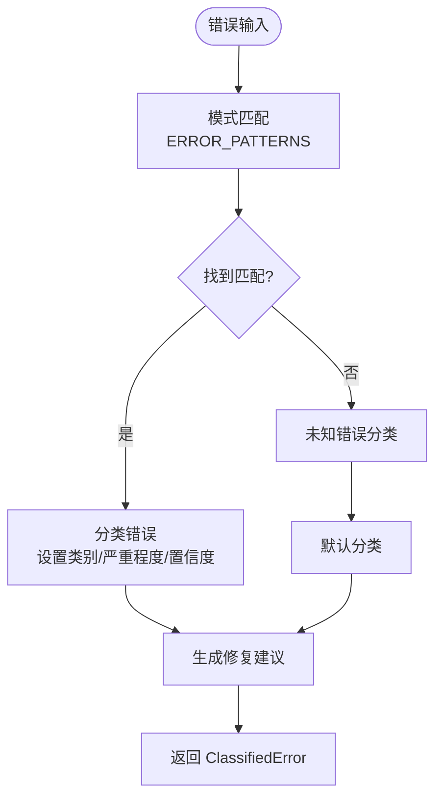

**图表来源**
- [scripts/agent-test/diagnostician/error-classifier.ts:327-454](file://scripts/agent-test/diagnostician/error-classifier.ts#L327-L454)
- [scripts/agent-test/diagnostician/error-classifier.ts:65-321](file://scripts/agent-test/diagnostician/error-classifier.ts#L65-L321)

**章节来源**
- [scripts/agent-test/diagnostician/error-classifier.ts:18-51](file://scripts/agent-test/diagnostician/error-classifier.ts#L18-L51)
- [scripts/agent-test/diagnostician/error-classifier.ts:65-321](file://scripts/agent-test/diagnostician/error-classifier.ts#L65-L321)
- [scripts/agent-test/diagnostician/error-classifier.ts:327-454](file://scripts/agent-test/diagnostician/error-classifier.ts#L327-L454)

### 堆栈解析器
StackParser 负责解析堆栈跟踪信息，提取关键的调试信息。

#### 解析功能
- **堆栈帧提取**：解析不同格式的堆栈跟踪（含函数名、文件路径、行号）
- **根因定位**：识别项目文件中的根因帧
- **代码上下文**：获取错误发生处的代码上下文
- **调用链分析**：生成简洁的调用链摘要

#### 支持的堆栈格式
- `at FunctionName (file:line:column)`
- `at file:line:column`
- `at functionName (path:line)`

#### 上下文提取
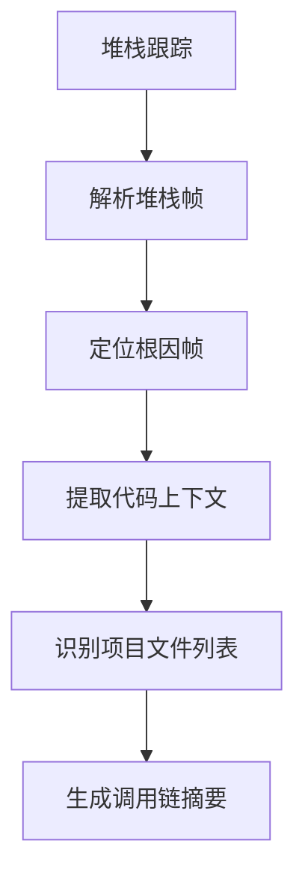

**图表来源**
- [scripts/agent-test/diagnostician/stack-parser.ts:67-100](file://scripts/agent-test/diagnostician/stack-parser.ts#L67-L100)
- [scripts/agent-test/diagnostician/stack-parser.ts:217-236](file://scripts/agent-test/diagnostician/stack-parser.ts#L217-L236)

**章节来源**
- [scripts/agent-test/diagnostician/stack-parser.ts:19-34](file://scripts/agent-test/diagnostician/stack-parser.ts#L19-L34)
- [scripts/agent-test/diagnostician/stack-parser.ts:67-100](file://scripts/agent-test/diagnostician/stack-parser.ts#L67-L100)
- [scripts/agent-test/diagnostician/stack-parser.ts:217-236](file://scripts/agent-test/diagnostician/stack-parser.ts#L217-L236)

## 自动修复系统

### 修复策略库
修复策略库定义了针对不同类型错误的修复方案，支持自动化的代码修复。

#### 策略类型
- **添加可选链**：为属性访问添加可选链操作符
- **修复 Mock 实现**：创建或修复缺失的 Mock 文件
- **更新快照**：生成更新快照的修复建议
- **增加超时时间**：为异步操作增加超时配置

#### 策略执行流程
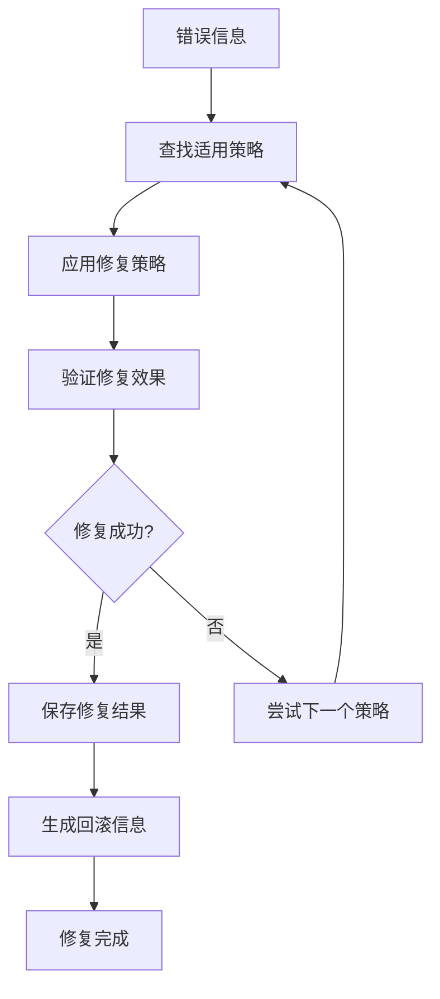

**图表来源**
- [scripts/agent-test/diagnostician/fix-strategies.ts:349-368](file://scripts/agent-test/diagnostician/fix-strategies.ts#L349-L368)

**章节来源**
- [scripts/agent-test/diagnostician/fix-strategies.ts:18-49](file://scripts/agent-test/diagnostician/fix-strategies.ts#L18-L49)
- [scripts/agent-test/diagnostician/fix-strategies.ts:54-127](file://scripts/agent-test/diagnostician/fix-strategies.ts#L54-L127)
- [scripts/agent-test/diagnostician/fix-strategies.ts:134-196](file://scripts/agent-test/diagnostician/fix-strategies.ts#L134-L196)
- [scripts/agent-test/diagnostician/fix-strategies.ts:203-247](file://scripts/agent-test/diagnostician/fix-strategies.ts#L203-L247)
- [scripts/agent-test/diagnostician/fix-strategies.ts:254-311](file://scripts/agent-test/diagnostician/fix-strategies.ts#L254-L311)

### 安全修改器
SafeModifier 提供安全的代码修改能力，确保修改过程的可靠性和可回滚性。

#### 核心功能
- **文件备份**：修改前自动备份原始文件
- **差异生成**：生成详细的代码修改差异
- **安全写入**：验证写入操作的成功性
- **回滚支持**：提供完整的回滚机制

#### 修改选项
- `backup`：是否创建备份（默认 true）
- `dryRun`：是否只预览不实际修改（默认 false）
- `verbose`：是否输出详细日志（默认 false）

#### 支持的操作
- **内容替换**：替换文件中的文本内容
- **文本插入**：在指定行号插入文本
- **行删除**：删除指定范围的代码行

**章节来源**
- [scripts/agent-test/fix/safe-modifier.ts:18-36](file://scripts/agent-test/fix/safe-modifier.ts#L18-L36)
- [scripts/agent-test/fix/safe-modifier.ts:58-125](file://scripts/agent-test/fix/safe-modifier.ts#L58-L125)
- [scripts/agent-test/fix/safe-modifier.ts:135-165](file://scripts/agent-test/fix/safe-modifier.ts#L135-L165)
- [scripts/agent-test/fix/safe-modifier.ts:175-207](file://scripts/agent-test/fix/safe-modifier.ts#L175-L207)
- [scripts/agent-test/fix/safe-modifier.ts:217-249](file://scripts/agent-test/fix/safe-modifier.ts#L217-L249)

### 回滚管理器
RollbackManager 管理代码修改的回滚，维护完整的回滚历史和状态跟踪。

#### 回滚记录
- **唯一标识**：为每次修改生成唯一的回滚 ID
- **时间戳**：记录修改发生的时间
- **描述信息**：提供修改的简要描述
- **状态跟踪**：跟踪修改的状态（applied/rolled_back/failed）

#### 回滚功能
- **单次回滚**：回滚指定的修改记录
- **批量回滚**：回滚最近的多次修改
- **历史查询**：查询完整的回滚历史
- **清理过期记录**：自动清理过期的回滚记录

#### 回滚统计
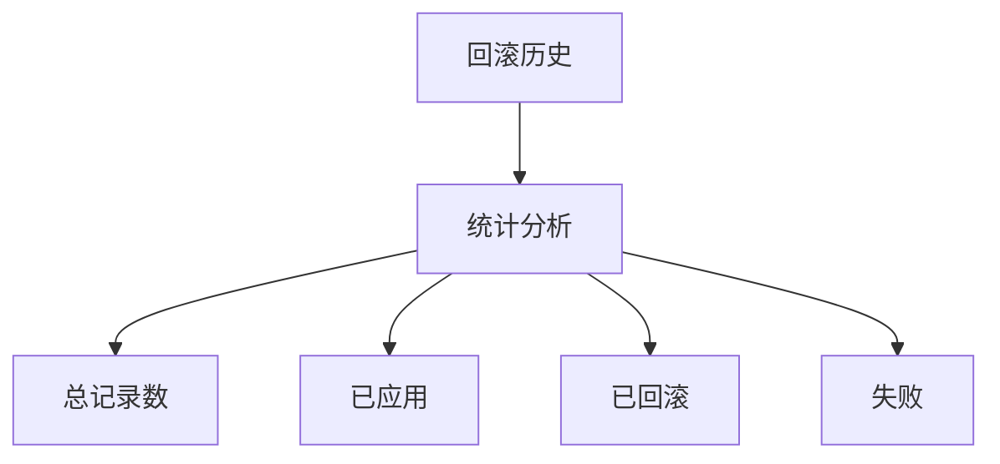

**图表来源**
- [scripts/agent-test/fix/rollback-manager.ts:208-222](file://scripts/agent-test/fix/rollback-manager.ts#L208-L222)

**章节来源**
- [scripts/agent-test/fix/rollback-manager.ts:18-37](file://scripts/agent-test/fix/rollback-manager.ts#L18-L37)
- [scripts/agent-test/fix/rollback-manager.ts:60-91](file://scripts/agent-test/fix/rollback-manager.ts#L60-L91)
- [scripts/agent-test/fix/rollback-manager.ts:131-156](file://scripts/agent-test/fix/rollback-manager.ts#L131-L156)
- [scripts/agent-test/fix/rollback-manager.ts:208-222](file://scripts/agent-test/fix/rollback-manager.ts#L208-L222)

## 基准测试

### 测试配置
BenchmarkRunner 提供完整的性能基准测试执行能力，支持多种性能指标的测试。

#### 预定义测试套件
框架内置了以下基准测试配置：

| 测试名称 | 描述 | 测试文件 | 迭代次数 | 预热次数 | P95 阈值 | P99 阈值 | 平均值阈值 |
|---------|------|----------|----------|----------|----------|----------|------------|
| sqlite-crud | SQLite 单次 CRUD 操作延迟 | src/lib/db/__tests__/benchmark.test.ts | 1000 | 100 | 10ms | 20ms | 5ms |
| vector-search-100 | 100 条数据向量检索延迟 | src/lib/rag/__tests__/vector-store.benchmark.ts | 100 | 10 | 50ms | 100ms | 20ms |
| vector-search-1000 | 1000 条数据向量检索延迟 | src/lib/rag/__tests__/vector-store.benchmark.ts | 100 | 10 | 200ms | 500ms | 100ms |
| text-splitting-1kb | 1KB 文档文本切块延迟 | src/lib/rag/__tests__/text-splitter.benchmark.ts | 500 | 50 | 5ms | 10ms | 2ms |
| text-splitting-10kb | 10KB 文档文本切块延迟 | src/lib/rag/__tests__/text-splitter.benchmark.ts | 200 | 20 | 20ms | 50ms | 10ms |
| stream-parsing | 1000 tokens 流式解析延迟 | src/lib/llm/__tests__/stream-parser.benchmark.ts | 100 | 10 | 20ms | 50ms | 10ms |
| store-dispatch-100 | 连续 100 次 Store dispatch 耗时 | src/store/__tests__/chat-store.benchmark.ts | 50 | 5 | 100ms | 200ms | 50ms |

#### 性能指标
- **平均值（meanMs）**：所有测试的平均耗时
- **中位数（medianMs）**：测试耗时的中位数
- **最小值（minMs）**：测试耗时的最小值
- **最大值（maxMs）**：测试耗时的最大值
- **P95 分位数**：95% 分位的耗时
- **P99 分位数**：99% 分位的耗时
- **标准差（stdDev）**：耗时的标准差

#### 退化检测
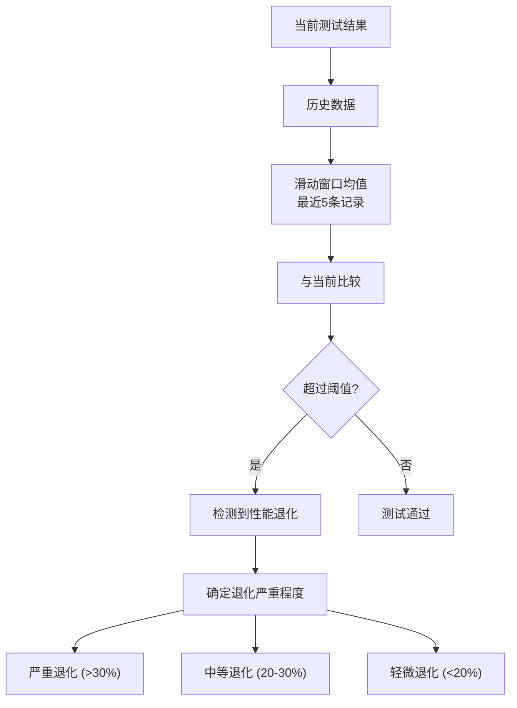

**图表来源**
- [scripts/agent-test/runner/benchmark-runner.ts:320-343](file://scripts/agent-test/runner/benchmark-runner.ts#L320-L343)

**章节来源**
- [scripts/agent-test/runner/benchmark-runner.ts:20-124](file://scripts/agent-test/runner/benchmark-runner.ts#L20-L124)
- [scripts/agent-test/runner/benchmark-runner.ts:145-187](file://scripts/agent-test/runner/benchmark-runner.ts#L145-L187)
- [scripts/agent-test/runner/benchmark-runner.ts:320-343](file://scripts/agent-test/runner/benchmark-runner.ts#L320-L343)

### 历史记录管理
基准测试自动维护历史记录，支持性能趋势分析和退化检测。

#### 历史数据结构
- **时间戳**：测试执行的时间
- **Git 信息**：提交哈希和分支信息
- **环境信息**：Node.js 版本和操作系统
- **性能指标**：完整的性能统计数据

#### 趋势分析


**图表来源**
- [scripts/agent-test/runner/benchmark-runner.ts:224-241](file://scripts/agent-test/runner/benchmark-runner.ts#L224-L241)
- [scripts/agent-test/runner/benchmark-runner.ts:345-361](file://scripts/agent-test/runner/benchmark-runner.ts#L345-L361)

**章节来源**
- [scripts/agent-test/runner/benchmark-runner.ts:224-241](file://scripts/agent-test/runner/benchmark-runner.ts#L224-L241)
- [scripts/agent-test/runner/benchmark-runner.ts:345-361](file://scripts/agent-test/runner/benchmark-runner.ts#L345-L361)

## 视觉回归测试
视觉回归测试功能目前处于待实现状态，框架已预留相应的接口和配置结构。

### 预留功能
- **基准图像管理**：`.agent-test/baseline/` 目录用于存储基准图像
- **快照管理**：`.agent-test/snapshots/` 目录用于存储当前快照
- **差异对比**：`.agent-test/diffs/` 目录用于存储差异图像
- **阈值配置**：支持像素差异阈值设置

### 待实现特性
- **图像捕获**：自动捕获页面截图
- **图像比较**：比较当前快照与基准图像
- **差异可视化**：生成差异图像和报告
- **自动化流程**：集成到 CI/CD 流程中

**章节来源**
- [scripts/agent-test/README.md:122-132](file://scripts/agent-test/README.md#L122-L132)
- [scripts/agent-test/config.ts:24-35](file://scripts/agent-test/config.ts#L24-L35)

## 配置管理

### 配置结构
AgentTestConfig 定义了智能测试框架的完整配置结构。

#### 核心配置项
- **jest**：Jest 测试配置
  - `preset`：Jest 预设（默认：react-native）
  - `configPath`：自定义配置文件路径
  - `coverageThreshold`：覆盖率阈值配置
- **diagnosis**：诊断配置
  - `maxProcessingTimeMs`：最大处理时间（默认：5000ms）
  - `confidenceThreshold`：置信度阈值（默认：0.7）
  - `autoFixEnabled`：自动修复开关（默认：false）
- **visual**：视觉测试配置
  - `baselineDir`：基准图像目录（默认：.agent-test/baseline）
  - `snapshotDir`：快照目录（默认：.agent-test/snapshots）
  - `diffDir`：差异目录（默认：.agent-test/diffs）
  - `threshold`：差异阈值（默认：0.1）
- **output**：输出配置
  - `resultsDir`：结果目录（默认：.agent-test/results）
  - `reportsDir`：报告目录（默认：.agent-test/reports）
  - `logsDir`：日志目录（默认：.agent-test/logs）

#### 配置加载机制
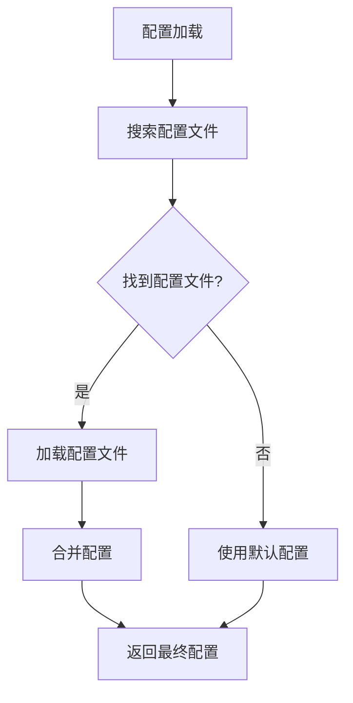

**图表来源**
- [scripts/agent-test/config.ts:62-90](file://scripts/agent-test/config.ts#L62-L90)
- [scripts/agent-test/config.ts:95-110](file://scripts/agent-test/config.ts#L95-L110)

**章节来源**
- [scripts/agent-test/config.ts:8-35](file://scripts/agent-test/config.ts#L8-L35)
- [scripts/agent-test/config.ts:62-90](file://scripts/agent-test/config.ts#L62-L90)
- [scripts/agent-test/config.ts:95-110](file://scripts/agent-test/config.ts#L95-L110)

### 配置文件格式
支持 JSON 和 TypeScript 两种配置文件格式：

#### JSON 配置示例
```json
{
  "jest": {
    "preset": "react-native",
    "coverageThreshold": {
      "lines": 80,
      "branches": 70,
      "functions": 80,
      "statements": 80
    }
  },
  "diagnosis": {
    "maxProcessingTimeMs": 5000,
    "confidenceThreshold": 0.7,
    "autoFixEnabled": false
  },
  "output": {
    "resultsDir": ".agent-test/results",
    "reportsDir": ".agent-test/reports"
  }
}
```

#### TypeScript 配置示例
```typescript
// agent-test.config.ts
import type { AgentTestConfig } from '@nexara/agent-test';

const config: AgentTestConfig = {
  jest: {
    preset: 'react-native',
  },
  diagnosis: {
    maxProcessingTimeMs: 5000,
    confidenceThreshold: 0.7,
  },
  output: {
    resultsDir: '.agent-test/results',
    reportsDir: '.agent-test/reports',
  },
};

export default config;
```

**章节来源**
- [scripts/agent-test/config.ts:74-82](file://scripts/agent-test/config.ts#L74-L82)
- [scripts/agent-test/README.md:95-120](file://scripts/agent-test/README.md#L95-L120)

## 日志与报告

### 日志系统
Logger 提供统一的日志记录功能，支持不同级别的日志输出。

#### 日志级别
- **debug**：调试信息（仅在详细模式下显示）
- **info**：一般信息
- **success**：成功信息
- **warn**：警告信息
- **error**：错误信息

#### 日志格式
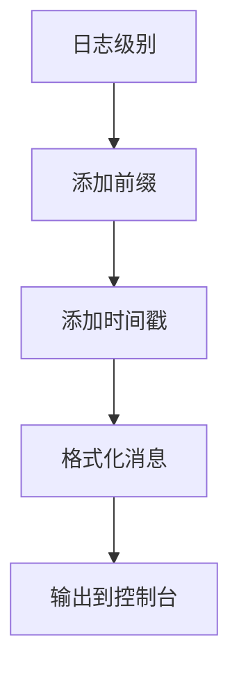

**图表来源**
- [scripts/agent-test/cli.ts:12-12](file://scripts/agent-test/cli.ts#L12-L12)

### 报告生成
框架自动生成详细的测试报告，包括测试结果、覆盖率和诊断信息。

#### 报告结构
- **元数据**：测试执行时间、Git 信息、环境信息
- **摘要**：总测试数、通过数、失败数、跳过数、通过率
- **详细结果**：每个测试的执行结果和错误信息
- **覆盖率**：语句、分支、函数、语句覆盖率
- **诊断信息**：错误分类、根因分析、修复建议

#### 退出码
- **0**：所有测试通过
- **1**：有测试失败
- **2**：执行错误

**章节来源**
- [scripts/agent-test/cli.ts:160-185](file://scripts/agent-test/cli.ts#L160-L185)
- [scripts/agent-test/README.md:134-141](file://scripts/agent-test/README.md#L134-L141)

## 依赖分析
- 核心运行时依赖
  - Expo SDK 54、React 19、React Native 0.81、Expo Router、Zustand、op-sqlite、Reanimated 4、NativeWind、TailwindCSS
- 开发时依赖
  - TypeScript ~5.9、Jest、ts-jest、tsx、prettier、@types/*、babel-preset-expo、patch-package
  - **新增**：@nexara/agent-test 智能测试框架
- Web 客户端依赖
  - Vite、React 18、TailwindCSS 4、ESLint 9、TypeScript ESLint、Framer Motion、ECharts、Mermaid
- 智能测试框架依赖
  - **Agent Test Framework**：CLI 工具、诊断引擎、修复系统、基准测试执行器
  - **Node.js 内置模块**：child_process、fs、path、os
  - **第三方库**：jsonrepair（JSON 格式修复）

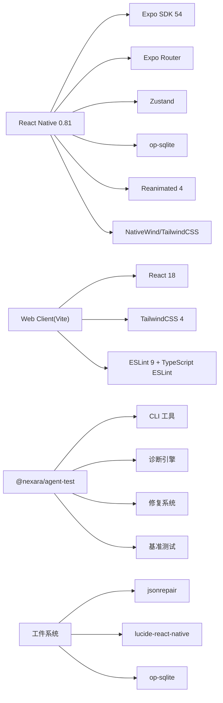

**图表来源**
- [package.json:1-120](file://package.json#L1-L120)
- [web-client/package.json:1-52](file://web-client/package.json#L1-L52)
- [scripts/agent-test/package.json:1-32](file://scripts/agent-test/package.json#L1-L32)
- [src/lib/artifact-parser.ts:11](file://src/lib/artifact-parser.ts#L11)

**章节来源**
- [package.json:1-120](file://package.json#L1-L120)
- [web-client/package.json:1-52](file://web-client/package.json#L1-L52)
- [scripts/agent-test/package.json:1-32](file://scripts/agent-test/package.json#L1-L32)

## 性能考虑
- 构建与打包
  - Metro watchFolders 与 assetExts 配置影响增量构建速度
  - Babel 与 Reanimated 插件需谨慎升级，避免破坏工作线程与动画性能
- 运行时
  - 使用 Reanimated 4 与 Worklets Core 提升动画与计算性能
  - op-sqlite 的 FTS5 与向量 BLOB 存储需合理设计索引与查询计划
- 智能测试框架性能
  - **CLI 启动优化**：使用 tsx 直接运行，避免额外的构建步骤
  - **诊断性能**：错误分类和堆栈解析使用缓存和预编译正则表达式
  - **基准测试优化**：预热运行减少冷启动影响，滑动窗口分析提高稳定性
  - **文件操作安全**：备份和回滚机制确保修改安全性
- 工件系统性能
  - 工件解析器使用缓存和预编译正则表达式提升解析性能
  - 渲染器注册表采用 Map 数据结构提供 O(1) 查找性能
  - 工件存储使用索引优化查询性能
- Web 客户端
  - Vite Rollup 输出命名策略减少缓存失效
  - TailwindCSS 4 与 PostCSS 优化样式体积

**章节来源**
- [metro.config.js:1-13](file://metro.config.js#L1-L13)
- [babel.config.js:1-14](file://babel.config.js#L1-L14)
- [package.json:1-120](file://package.json#L1-L120)
- [web-client/vite.config.ts:1-17](file://web-client/vite.config.ts#L1-L17)
- [scripts/agent-test/diagnostician/error-classifier.ts:337-354](file://scripts/agent-test/diagnostician/error-classifier.ts#L337-L354)
- [scripts/agent-test/runner/benchmark-runner.ts:256-260](file://scripts/agent-test/runner/benchmark-runner.ts#L256-L260)
- [scripts/agent-test/fix/safe-modifier.ts:351-361](file://scripts/agent-test/fix/safe-modifier.ts#L351-L361)
- [src/components/chat/renderers/RendererRegistry.ts:10-53](file://src/components/chat/renderers/RendererRegistry.ts#L10-L53)
- [src/store/artifact-store.ts:131-343](file://src/store/artifact-store.ts#L131-L343)

## 故障排除指南
- Metro/打包问题
  - 症状：无法解析模块或资源未更新
  - 处理：确认 watchFolders 与 nodeModulesPaths 设置；清理 Metro 缓存后重试
- Babel/Reanimated 插件报错
  - 症状：动画异常或编译失败
  - 处理：核对 babel-preset-expo 与插件顺序；确保版本兼容
- Jest 测试失败
  - 症状：第三方库未转换或找不到配置文件
  - 处理：检查 transformIgnorePatterns；确保 secure_env/test_api.json 存在且可读
- 智能测试框架问题
  - 症状：CLI 无法启动或测试执行失败
  - 处理：检查 Node.js 版本要求（>=18.0.0）；确认 tsx 和 jest 依赖安装
  - 症状：诊断功能异常
  - 处理：检查错误分类器配置；验证堆栈解析器的文件路径解析
  - 症状：自动修复失败
  - 处理：检查文件权限；确认备份目录可写；验证回滚管理器配置
- 基准测试问题
  - 症状：性能测试结果不稳定
  - 处理：增加迭代次数；检查预热运行配置；验证系统负载
  - 症状：历史数据丢失
  - 处理：检查历史目录权限；确认文件系统空间充足
- Web 客户端 Lint/构建错误
  - 症状：ESLint 报错或 Vite 构建失败
  - 处理：遵循 eslint.config.js 推荐规则；检查 tsconfig 引用与插件配置
- 工件系统问题
  - 症状：工件解析失败或渲染异常
  - 处理：检查工件类型配置；验证渲染器注册；确认工件内容格式
- 权限与平台配置
  - 症状：相机/相册/存储权限不足
  - 处理：核对 app.json 中 permissions 与 bundleIdentifier/package 设置

**章节来源**
- [metro.config.js:1-13](file://metro.config.js#L1-L13)
- [babel.config.js:1-14](file://babel.config.js#L1-L14)
- [jest.config.js:1-9](file://jest.config.js#L1-L9)
- [scripts/test-utils.ts:1-48](file://scripts/test-utils.ts#L1-L48)
- [web-client/eslint.config.js:1-24](file://web-client/eslint.config.js#L1-L24)
- [web-client/vite.config.ts:1-17](file://web-client/vite.config.ts#L1-L17)
- [app.json:1-64](file://app.json#L1-L64)
- [scripts/agent-test/package.json:21-26](file://scripts/agent-test/package.json#L21-L26)
- [scripts/agent-test/cli.ts:130-139](file://scripts/agent-test/cli.ts#L130-L139)
- [scripts/agent-test/diagnostician/error-classifier.ts:337-354](file://scripts/agent-test/diagnostician/error-classifier.ts#L337-L354)
- [scripts/agent-test/fix/safe-modifier.ts:67-73](file://scripts/agent-test/fix/safe-modifier.ts#L67-L73)
- [scripts/agent-test/runner/benchmark-runner.ts:256-260](file://scripts/agent-test/runner/benchmark-runner.ts#L256-L260)
- [src/lib/artifact-parser.ts:1-238](file://src/lib/artifact-parser.ts#L1-L238)
- [src/components/chat/renderers/RendererRegistry.ts:1-53](file://src/components/chat/renderers/RendererRegistry.ts#L1-L53)

## 结论
本指南提供了 Nexara 项目从环境搭建到测试与调试的全链路实践建议。通过统一的构建与规范配置、完善的测试初始化与工具链、清晰的工件系统架构设计、**新增的智能测试框架**，以及完善的 Git 工作流程与代码审查流程，团队可以高效地推进开发与质量保障。

**更新** 新增的智能测试框架章节详细介绍了 Agent Test Framework 的完整架构，包括 CLI 接口、诊断引擎、自动修复系统、基准测试和视觉回归测试功能，为项目的自动化测试和质量保障提供了强大的技术支持。

## 附录
- 快速开始（来自仓库说明）
  - 克隆仓库、安装依赖、预构建、运行 Android 模拟器或真机
- 版本与脚本
  - package.json 中包含 start/android/ios/web 等常用脚本
  - **新增**：test:agent 脚本用于运行智能测试框架
- Web 客户端
  - 提供 dev/build/lint/preview 等脚本，独立于移动端运行
- 工件系统
  - 提供完整的工件解析、渲染、存储和提取功能
  - 支持多种工件类型和自定义渲染器扩展
- 智能测试框架
  - **新增**：完整的测试生命周期管理，包括诊断、修复、基准测试
  - **新增**：CLI 接口支持多种运行模式和配置选项
  - **新增**：自动化的错误分类和修复策略
  - **新增**：性能基准测试和历史记录管理

**章节来源**
- [README.md:62-70](file://README.md#L62-L70)
- [README.md:134-142](file://README.md#L134-L142)
- [package.json:5-12](file://package.json#L5-L12)
- [web-client/package.json:6-11](file://web-client/package.json#L6-L11)
- [scripts/agent-test/README.md:1-153](file://scripts/agent-test/README.md#L1-L153)
- [scripts/agent-test/package.json:7-11](file://scripts/agent-test/package.json#L7-L11)
- [src/lib/__tests__/artifact-parser.test.ts:1-212](file://src/lib/__tests__/artifact-parser.test.ts#L1-L212)
- [src/components/chat/renderers/index.ts:1-19](file://src/components/chat/renderers/index.ts#L1-L19)