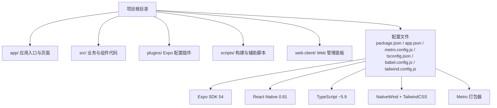
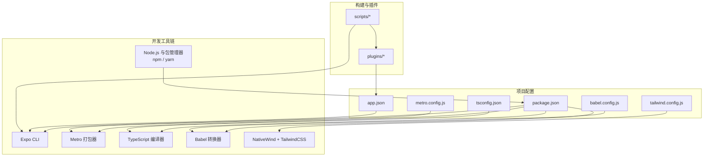
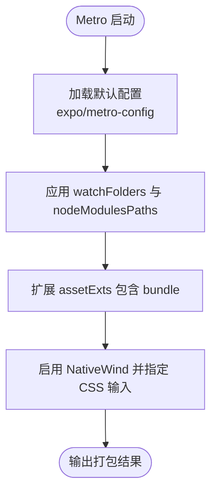
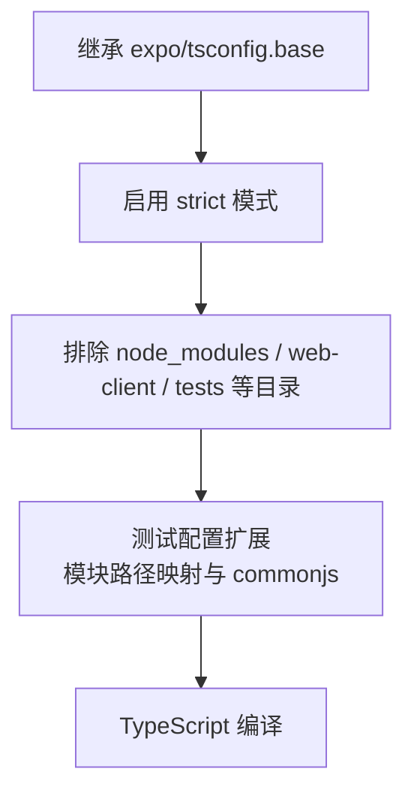
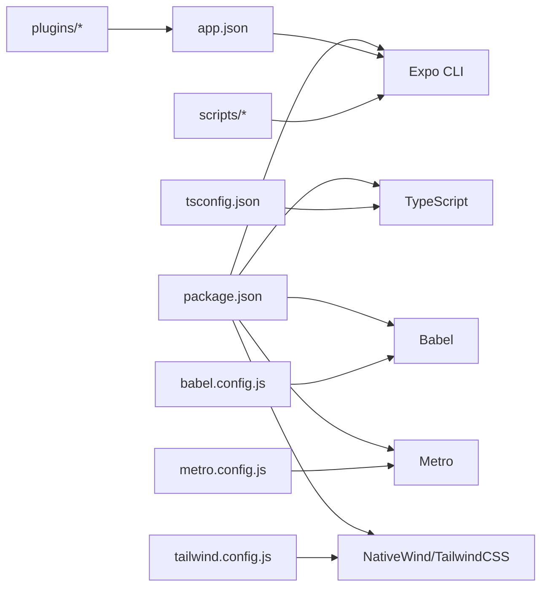

# 开发环境搭建

<cite>
**本文引用的文件**
- [package.json](file://package.json)
- [app.json](file://app.json)
- [metro.config.js](file://metro.config.js)
- [tsconfig.json](file://tsconfig.json)
- [babel.config.js](file://babel.config.js)
- [tailwind.config.js](file://tailwind.config.js)
- [README.md](file://README.md)
- [scripts/bump-version.js](file://scripts/bump-version.js)
- [scripts/diagnose_gradle.js](file://scripts/diagnose_gradle.js)
- [plugins/withAndroidDebugConfig.js](file://plugins/withAndroidDebugConfig.js)
- [plugins/withAndroidSigning.js](file://plugins/withAndroidSigning.js)
- [scripts/tsconfig-test.json](file://scripts/tsconfig-test.json)
</cite>

## 目录
1. [简介](#简介)
2. [项目结构](#项目结构)
3. [核心组件](#核心组件)
4. [架构总览](#架构总览)
5. [详细组件分析](#详细组件分析)
6. [依赖关系分析](#依赖关系分析)
7. [性能考虑](#性能考虑)
8. [故障排除指南](#故障排除指南)
9. [结论](#结论)
10. [附录](#附录)

## 简介
本指南面向希望在本地搭建 Nexara 项目的开发者，覆盖从系统要求、Node.js 与包管理器选择、Expo CLI 安装与配置、Metro 打包器定制、TypeScript 编译器配置，到 Android Studio 与 Xcode 的安装与准备，以及 VS Code/WebStorm 等 IDE 的推荐配置。文中所有技术要点均来自仓库中的实际配置文件与脚本，确保可操作性与准确性。

## 项目结构
Nexara 是一个基于 Expo SDK 54 + React Native（新架构）的跨平台移动应用，采用 TypeScript 与 NativeWind（TailwindCSS）进行样式开发，并通过 Expo Router 实现文件系统路由。项目根目录包含应用入口、配置文件、Metro 与 TypeScript 配置、Babel 配置、Tailwind 预设、构建脚本与插件等关键文件。

**图表来源**
- [package.json:1-120](file://package.json#L1-L120)
- [app.json:1-64](file://app.json#L1-L64)
- [metro.config.js:1-13](file://metro.config.js#L1-L13)
- [tsconfig.json:1-14](file://tsconfig.json#L1-L14)
- [babel.config.js:1-14](file://babel.config.js#L1-L14)
- [tailwind.config.js:1-34](file://tailwind.config.js#L1-L34)

**章节来源**
- [README.md:1-161](file://README.md#L1-L161)
- [package.json:1-120](file://package.json#L1-L120)
- [app.json:1-64](file://app.json#L1-L64)

## 核心组件
- 包管理与脚本
  - 使用 npm 作为默认包管理器，提供 start/android/ios/web 等常用脚本。
  - 通过 npx expo prebuild 进行预构建，随后使用 npm run android 启动 Android 设备或模拟器。
- Expo CLI 与运行模式
  - 支持通过命令行启动 iOS/Android/Web，结合 Expo Dev Client 与 Expo Go（需按平台配置）。
- Metro 打包器
  - 基于 expo/metro-config，默认启用新架构，集成 NativeWind CSS 输入。
- TypeScript 编译器
  - 继承 expo/tsconfig.base，启用严格模式；排除 web-client 与测试目录。
- Babel 与 NativeWind
  - 使用 babel-preset-expo 与 nativewind/babel，启用 JSX 导入源为 nativewind。
- Tailwind 预设与主题
  - 使用 nativewind/preset，content 覆盖 app 与 src 目录，主题映射 CSS 变量。

**章节来源**
- [package.json:5-13](file://package.json#L5-L13)
- [package.json:14-96](file://package.json#L14-L96)
- [app.json:2-62](file://app.json#L2-L62)
- [metro.config.js:1-13](file://metro.config.js#L1-L13)
- [tsconfig.json:1-14](file://tsconfig.json#L1-L14)
- [babel.config.js:1-14](file://babel.config.js#L1-L14)
- [tailwind.config.js:1-34](file://tailwind.config.js#L1-L34)

## 架构总览
下图展示开发环境关键组件之间的关系与交互流程，包括 Node.js/包管理器、Expo CLI、Metro、TypeScript、Babel、Tailwind/NativeWind 以及构建脚本与插件。

**图表来源**
- [package.json:1-120](file://package.json#L1-L120)
- [app.json:1-64](file://app.json#L1-L64)
- [metro.config.js:1-13](file://metro.config.js#L1-L13)
- [tsconfig.json:1-14](file://tsconfig.json#L1-L14)
- [babel.config.js:1-14](file://babel.config.js#L1-L14)
- [tailwind.config.js:1-34](file://tailwind.config.js#L1-L34)
- [scripts/bump-version.js:1-65](file://scripts/bump-version.js#L1-L65)
- [plugins/withAndroidDebugConfig.js:1-54](file://plugins/withAndroidDebugConfig.js#L1-L54)
- [plugins/withAndroidSigning.js:1-62](file://plugins/withAndroidSigning.js#L1-L62)

## 详细组件分析

### Node.js 与包管理器
- 版本要求
  - 项目未显式声明最低 Node.js 版本，但建议使用 LTS（如 18.x 或更高版本），以获得稳定性和兼容性。
- 包管理器
  - 默认使用 npm（package.json 中的 scripts 与依赖均针对 npm 场景）；也可使用 yarn，但需确保与项目脚本兼容。
- 安装与初始化
  - 使用 npm install 安装依赖；
  - 使用 npx expo prebuild 进行预构建；
  - 使用 npm run android 启动 Android 设备或模拟器。

**章节来源**
- [package.json:5-13](file://package.json#L5-L13)
- [README.md:62-70](file://README.md#L62-L70)

### Expo CLI 安装与配置
- 安装
  - 通过 npm 全局安装 expo-cli 或直接使用 npx expo；
  - 项目已配置 app.json，包含 scheme、iOS/Android 权限与插件列表。
- 运行
  - 启动命令：npm run start 或 npx expo start；
  - 运行 Android：npm run android；
  - 运行 iOS：npm run ios；
  - 运行 Web：npm run web。
- Expo Go 与 Dev Client
  - 项目启用了 expo-dev-client，可在真机上使用 Expo Dev Client 进行调试；
  - 如需使用 Expo Go，请确保项目配置允许（通常通过 dev-client 与 scheme 配置即可）。

**章节来源**
- [package.json:5-9](file://package.json#L5-L9)
- [app.json:2-62](file://app.json#L2-L62)
- [README.md:62-70](file://README.md#L62-L70)

### Metro 打包器配置与自定义
- 默认配置
  - 基于 expo/metro-config，默认启用新架构；
  - watchFolders 与 nodeModulesPaths 已明确指向项目根目录；
  - 新增 assetExts.bundle 以支持额外资源类型。
- NativeWind 集成
  - 通过 withNativeWind(config, { input: './global.css' }) 指定输入样式文件。
- 自定义建议
  - 若需扩展解析路径或资源后缀，可在 resolver 层面添加；
  - 若需启用更多实验特性（如 Hermes、JSI），请结合 Expo 配置与插件进行调整。

**图表来源**
- [metro.config.js:1-13](file://metro.config.js#L1-L13)

**章节来源**
- [metro.config.js:1-13](file://metro.config.js#L1-L13)

### TypeScript 编译器配置
- 基础继承
  - 继承 expo/tsconfig.base，确保与 Expo SDK 54 的类型与编译行为一致。
- 严格模式
  - 启用 strict 严格模式，提升类型安全。
- 排除范围
  - 排除 node_modules、参考 UI 目录、工作树与 web-client 目录，避免不必要的编译。
- 测试配置
  - scripts/tsconfig-test.json 提供测试场景下的模块路径映射与 commonjs 模块化策略，便于单元测试。

**图表来源**
- [tsconfig.json:1-14](file://tsconfig.json#L1-L14)
- [scripts/tsconfig-test.json:1-19](file://scripts/tsconfig-test.json#L1-L19)

**章节来源**
- [tsconfig.json:1-14](file://tsconfig.json#L1-L14)
- [scripts/tsconfig-test.json:1-19](file://scripts/tsconfig-test.json#L1-L19)

### Babel 与 NativeWind
- 预设与插件
  - 使用 babel-preset-expo，并将 jsxImportSource 指向 nativewind；
  - 启用 nativewind/babel 以支持 TailwindCSS 类名转换；
  - 启用 react-native-worklets-core/plugin 与 react-native-reanimated/plugin。
- 作用
  - 将 TS/JSX 转换为可运行的 JS，并将 Tailwind 类名在运行时解析为原生样式。

**章节来源**
- [babel.config.js:1-14](file://babel.config.js#L1-L14)

### Tailwind/NativeWind 主题与内容扫描
- 预设与内容
  - 使用 nativewind/preset；
  - content 覆盖 app 与 src 目录，确保类名被正确提取与摇树优化。
- 主题映射
  - 将 Tailwind 颜色映射到 CSS 变量，适配 NativeWind 的运行时解析。

**章节来源**
- [tailwind.config.js:1-34](file://tailwind.config.js#L1-L34)

### Android Studio 与 Xcode 安装指南
- Android Studio
  - 安装 Android Studio 与 Android SDK/NDK；
  - 配置 ANDROID_HOME 或在 IDE 中设置 SDK 路径；
  - 准备模拟器或连接真机（开启开发者选项与 USB 调试）。
- Xcode（macOS）
  - 安装 Xcode 与 Command Line Tools；
  - 准备 iOS 模拟器或连接真机（需配置开发者账号与签名）。
- 注意事项
  - 项目已启用新架构（newArchEnabled: true），确保 Android Studio 与 Xcode 版本满足 React Native 0.81 的要求。

**章节来源**
- [app.json:10](file://app.json#L10)
- [README.md:52-60](file://README.md#L52-L60)

### 环境变量与密钥配置
- 安卓签名
  - 插件会读取 secure_env/secure.properties 与 keystore 文件，若不存在则回退到 debug.keystore；
  - 该机制用于在 CI 或本地注入签名参数。
- 建议
  - 在本地开发时保留 debug.keystore 以避免构建失败；
  - 生产构建前准备 secure.properties 与 keystore 文件。

**章节来源**
- [plugins/withAndroidSigning.js:1-62](file://plugins/withAndroidSigning.js#L1-L62)

### 构建脚本与 Gradle 诊断
- 版本升级脚本
  - scripts/bump-version.js 支持 patch 与 minor 两种升级方式，同步更新 app.json、package.json 与 android/app/build.gradle 的 versionCode 与 versionName。
- Gradle 诊断
  - scripts/diagnose_gradle.js 逐行打印 build.gradle 内容，便于排查签名与版本配置问题。

**章节来源**
- [scripts/bump-version.js:1-65](file://scripts/bump-version.js#L1-L65)
- [scripts/diagnose_gradle.js:1-11](file://scripts/diagnose_gradle.js#L1-L11)

### IDE 推荐配置（VS Code / WebStorm）
- VS Code
  - 安装 TypeScript TSServer、ESLint、Prettier、Tailwind IntelliSense、ES7+ React/Redux/React Hooks Snippets；
  - 设置默认终端为 npm 脚本，启用 ESLint 与 Prettier；
  - 在 settings.json 中配置 TypeScript 严格模式与路径映射（可参考 tsconfig.json）。
- WebStorm
  - 启用 TypeScript 支持与 ESLint；
  - 配置 Path Mappings 与 Node Interpreter；
  - 使用内置 Terminal 执行 npm run android/ios/web。

**章节来源**
- [tsconfig.json:1-14](file://tsconfig.json#L1-L14)

## 依赖关系分析
下图展示开发环境关键依赖与配置之间的耦合关系，强调 TypeScript、Metro、Babel、Tailwind/NativeWind 与 Expo 的协同。

**图表来源**
- [package.json:1-120](file://package.json#L1-L120)
- [app.json:1-64](file://app.json#L1-L64)
- [metro.config.js:1-13](file://metro.config.js#L1-L13)
- [tsconfig.json:1-14](file://tsconfig.json#L1-L14)
- [babel.config.js:1-14](file://babel.config.js#L1-L14)
- [tailwind.config.js:1-34](file://tailwind.config.js#L1-L34)
- [scripts/bump-version.js:1-65](file://scripts/bump-version.js#L1-L65)
- [plugins/withAndroidDebugConfig.js:1-54](file://plugins/withAndroidDebugConfig.js#L1-L54)
- [plugins/withAndroidSigning.js:1-62](file://plugins/withAndroidSigning.js#L1-L62)

**章节来源**
- [package.json:1-120](file://package.json#L1-L120)
- [app.json:1-64](file://app.json#L1-L64)

## 性能考虑
- 启用新架构（New Architecture）
  - app.json 已开启 newArchEnabled，有助于提升运行时性能与内存效率。
- Metro Watch 与解析路径
  - 明确 watchFolders 与 nodeModulesPaths，减少不必要的扫描开销。
- Tailwind/NativeWind
  - content 范围限定在 app 与 src，避免对 web-client 等目录进行无谓扫描。
- 构建缓存
  - 使用 npx expo prebuild 与缓存策略，缩短后续构建时间。

**章节来源**
- [app.json:10](file://app.json#L10)
- [metro.config.js:8-9](file://metro.config.js#L8-L9)
- [tailwind.config.js:4](file://tailwind.config.js#L4)

## 故障排除指南
- Metro 无法解析模块或资源
  - 检查 resolver.nodeModulesPaths 与 assetExts 是否符合预期；
  - 确认 watchFolders 是否包含当前工作目录。
- TypeScript 编译错误
  - 严格模式下注意可选链与非空断言的使用；
  - 确保 exclude 正确屏蔽 web-client 与测试目录。
- Android 构建签名失败
  - 检查 secure_env/secure.properties 与 keystore 文件是否存在；
  - 使用 scripts/diagnose_gradle.js 定位 build.gradle 中的签名配置问题。
- 版本升级不生效
  - 使用 scripts/bump-version.js 执行 patch 或 minor 升级；
  - 确认 app.json、package.json 与 build.gradle 的 versionCode/versionName 已同步更新。

**章节来源**
- [metro.config.js:1-13](file://metro.config.js#L1-L13)
- [tsconfig.json:6-13](file://tsconfig.json#L6-L13)
- [plugins/withAndroidSigning.js:13-54](file://plugins/withAndroidSigning.js#L13-L54)
- [scripts/diagnose_gradle.js:1-11](file://scripts/diagnose_gradle.js#L1-L11)
- [scripts/bump-version.js:12-65](file://scripts/bump-version.js#L12-L65)

## 结论
Nexara 的开发环境以 Expo SDK 54 + React Native 0.81 为核心，结合 TypeScript、Metro、Babel 与 NativeWind/TailwindCSS，形成一套现代化、可扩展的移动端开发栈。按照本指南完成 Node.js 与包管理器、Expo CLI、Metro、TypeScript、Tailwind/NativeWind 以及 Android Studio/Xcode 的配置后，即可顺利启动项目并在多平台上进行调试与构建。

## 附录
- 快速开始命令（来自 README）
  - git clone 仓库地址
  - cd Nexara
  - npm install
  - npx expo prebuild
  - npm run android

**章节来源**
- [README.md:62-70](file://README.md#L62-L70)