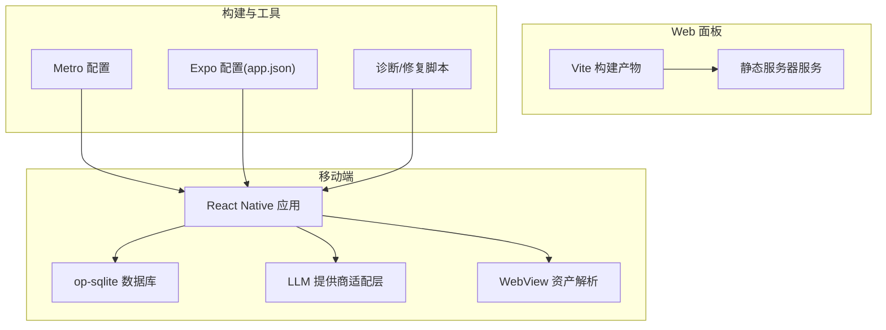
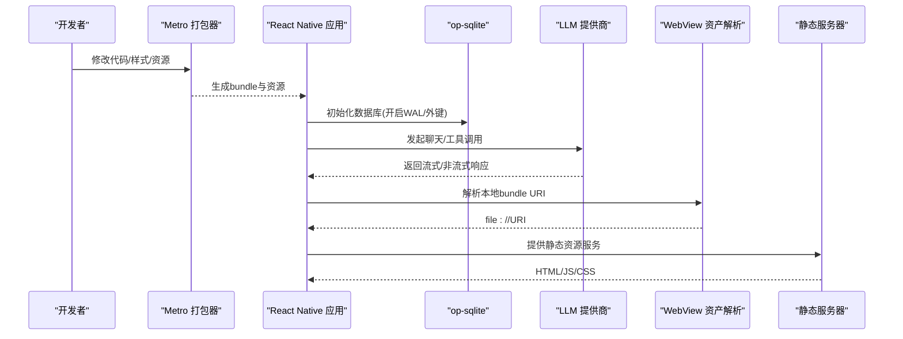
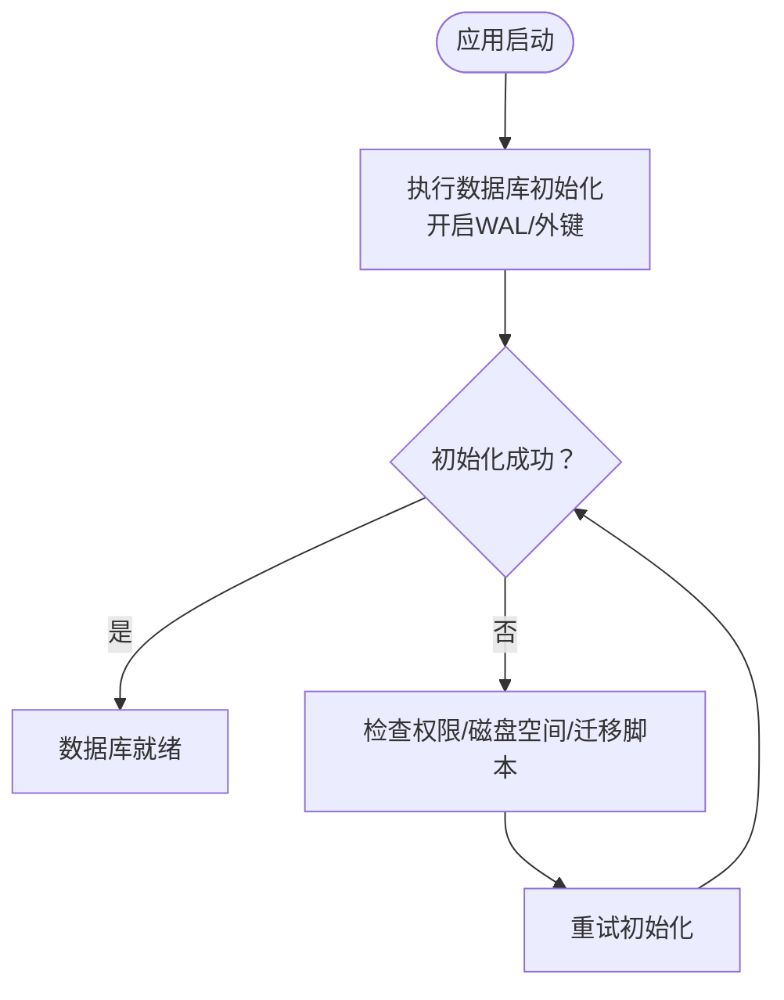
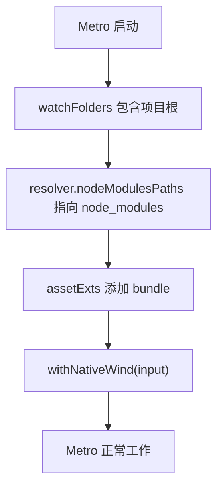
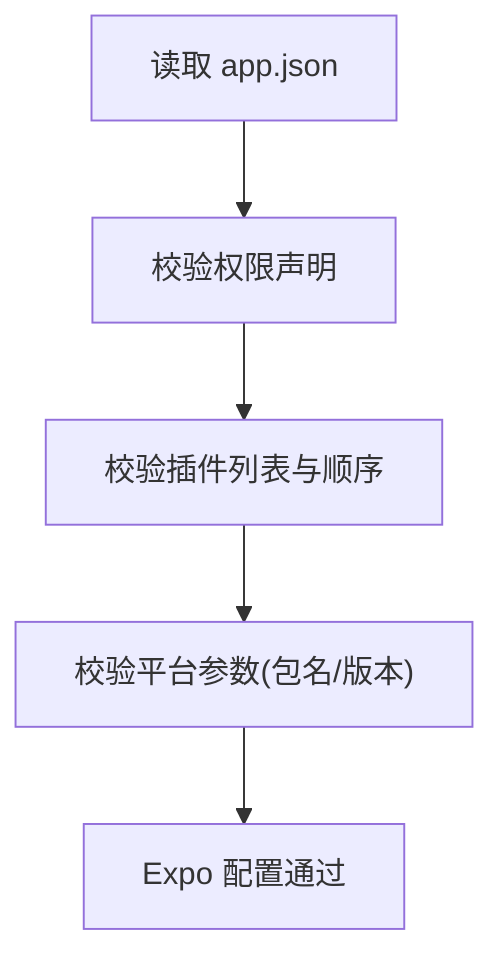
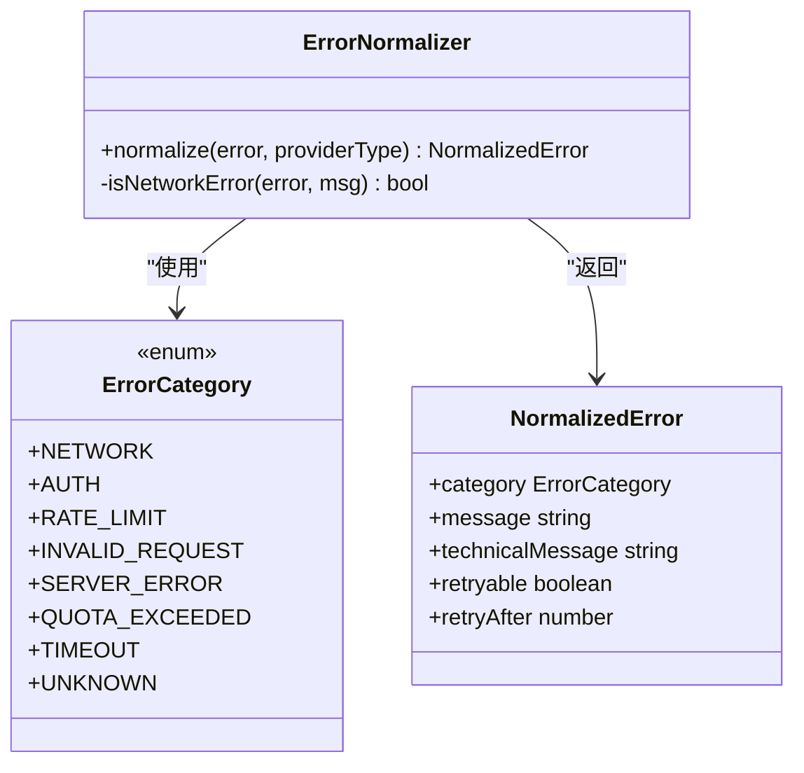
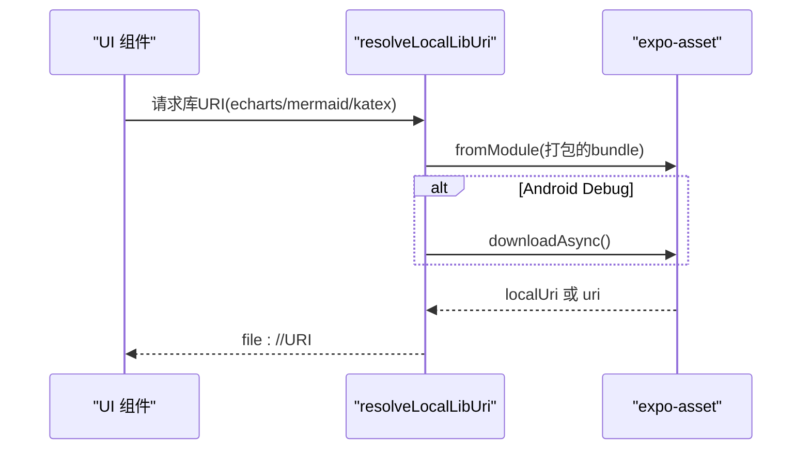
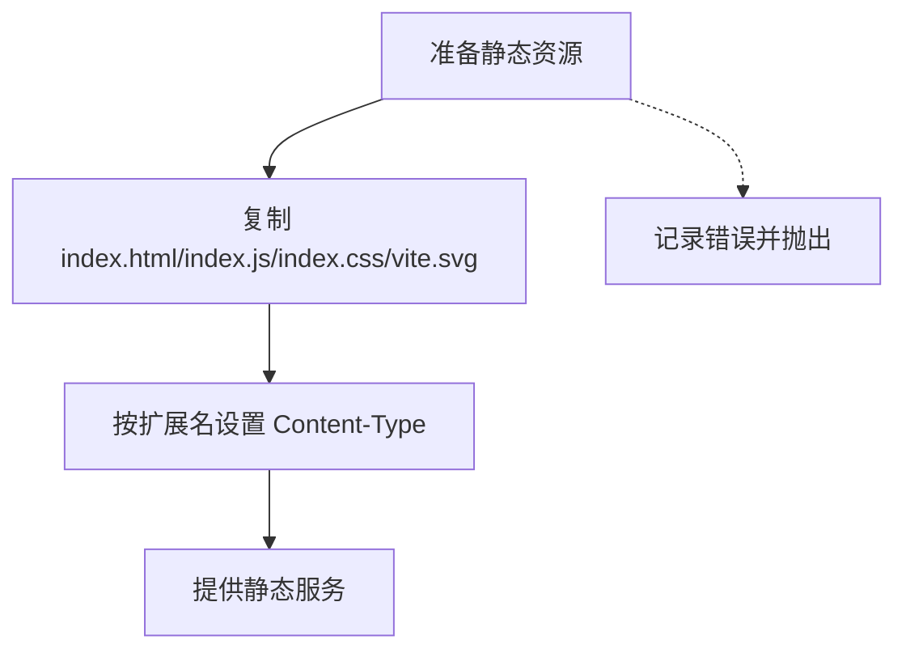
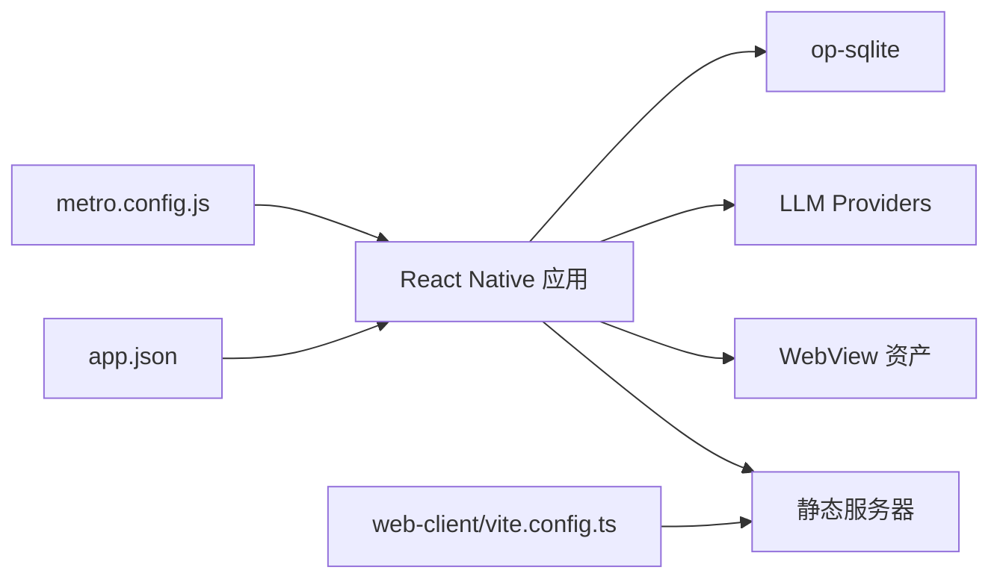

# 故障排除与常见问题

<cite>
**本文引用的文件**
- [README.md](file://README.md)
- [package.json](file://package.json)
- [metro.config.js](file://metro.config.js)
- [app.json](file://app.json)
- [scripts/diagnose_gradle.js](file://scripts/diagnose_gradle.js)
- [scripts/fix_signing.js](file://scripts/fix_signing.js)
- [scripts/test-llm.ts](file://scripts/test-llm.ts)
- [scripts/test-setup.ts](file://scripts/test-setup.ts)
- [src/lib/db/index.ts](file://src/lib/db/index.ts)
- [src/lib/llm/error-normalizer.ts](file://src/lib/llm/error-normalizer.ts)
- [src/lib/llm/providers/deepseek.ts](file://src/lib/llm/providers/deepseek.ts)
- [src/lib/webview-assets.ts](file://src/lib/webview-assets.ts)
- [src/services/workbench/StaticServerService.ts](file://src/services/workbench/StaticServerService.ts)
- [web-client/vite.config.ts](file://web-client/vite.config.ts)
- [scripts/mocks/op-sqlite.ts](file://scripts/mocks/op-sqlite.ts)
- [scripts/mocks/async-storage.ts](file://scripts/mocks/async-storage.ts)
- [scripts/mocks/expo-file-system.ts](file://scripts/mocks/expo-file-system.ts)
</cite>

## 目录
1. [简介](#简介)
2. [项目结构](#项目结构)
3. [核心组件](#核心组件)
4. [架构总览](#架构总览)
5. [详细组件分析](#详细组件分析)
6. [依赖关系分析](#依赖关系分析)
7. [性能考虑](#性能考虑)
8. [故障排除指南](#故障排除指南)
9. [结论](#结论)
10. [附录](#附录)

## 简介
本指南聚焦于Nexara项目的常见问题与排障流程，覆盖构建错误、运行时异常、性能问题、Metro Bundler问题、Expo相关问题（网络、证书、权限）、数据库初始化失败、本地推理模型加载失败、Workbench/Web面板问题，以及紧急修复脚本的使用与安全注意事项。文档同时提供跨平台（Windows、macOS、Linux）的通用建议与定位思路。

## 项目结构
Nexara是一个基于Expo SDK 54 + React Native的Android应用，采用TypeScript与NativeWind，数据库为op-sqlite，本地推理使用llama.rn，Web面板由Vite驱动。关键目录与文件如下：
- app/ 与 src/：应用与业务逻辑主体
- web-client/：配套Web管理面板
- scripts/：构建与诊断脚本（含签名修复、Gradle诊断、LLM连通性测试等）
- metro.config.js：Metro打包器配置
- app.json：Expo配置（插件、权限、平台参数）
- package.json：依赖与脚本入口

**图表来源**
- [metro.config.js:1-13](file://metro.config.js#L1-L13)
- [app.json:1-64](file://app.json#L1-L64)
- [src/lib/db/index.ts:1-13](file://src/lib/db/index.ts#L1-L13)
- [src/lib/llm/error-normalizer.ts:1-139](file://src/lib/llm/error-normalizer.ts#L1-L139)
- [src/lib/webview-assets.ts:1-41](file://src/lib/webview-assets.ts#L1-L41)
- [src/services/workbench/StaticServerService.ts:127-300](file://src/services/workbench/StaticServerService.ts#L127-L300)
- [web-client/vite.config.ts:1-16](file://web-client/vite.config.ts#L1-L16)

**章节来源**
- [README.md:1-161](file://README.md#L1-L161)
- [package.json:1-120](file://package.json#L1-L120)
- [metro.config.js:1-13](file://metro.config.js#L1-L13)
- [app.json:1-64](file://app.json#L1-L64)

## 核心组件
- 数据库层：使用op-sqlite，启动即启用WAL模式与外键约束，确保并发与一致性。
- LLM层：统一错误归一化与多种提供商适配，便于快速定位网络、鉴权、限流、请求格式、服务器错误等类别。
- WebView资产：通过expo-asset将Metro打包的.bundled文件解析为file://URI，保障WebView内JS/CSS可用。
- Workbench静态服务器：将Web面板资源复制到WWW目录并按扩展名设置Content-Type，提供静态文件服务。
- Metro配置：启用NativeWind样式与watchFolders，确保热更新与样式生效。
- Expo配置：声明权限、插件、平台参数，影响打包与运行期行为。

**章节来源**
- [src/lib/db/index.ts:1-13](file://src/lib/db/index.ts#L1-L13)
- [src/lib/llm/error-normalizer.ts:1-139](file://src/lib/llm/error-normalizer.ts#L1-L139)
- [src/lib/webview-assets.ts:1-41](file://src/lib/webview-assets.ts#L1-L41)
- [src/services/workbench/StaticServerService.ts:127-300](file://src/services/workbench/StaticServerService.ts#L127-L300)
- [metro.config.js:1-13](file://metro.config.js#L1-L13)
- [app.json:1-64](file://app.json#L1-L64)

## 架构总览
下图展示从Metro打包到运行时组件的关键交互路径，包括数据库初始化、LLM错误归一化、WebView资产解析与Workbench静态服务。

**图表来源**
- [metro.config.js:1-13](file://metro.config.js#L1-L13)
- [src/lib/db/index.ts:1-13](file://src/lib/db/index.ts#L1-L13)
- [src/lib/llm/error-normalizer.ts:1-139](file://src/lib/llm/error-normalizer.ts#L1-L139)
- [src/lib/webview-assets.ts:1-41](file://src/lib/webview-assets.ts#L1-L41)
- [src/services/workbench/StaticServerService.ts:127-300](file://src/services/workbench/StaticServerService.ts#L127-L300)

## 详细组件分析

### 组件A：数据库初始化与一致性
- 关键点：启动时启用WAL模式与外键约束，提升并发与数据完整性。
- 常见问题：首次安装或迁移后数据库损坏、权限不足导致无法写入。
- 诊断要点：确认initDb执行日志；检查数据库文件是否存在；查看外键约束是否生效。

**图表来源**
- [src/lib/db/index.ts:1-13](file://src/lib/db/index.ts#L1-L13)

**章节来源**
- [src/lib/db/index.ts:1-13](file://src/lib/db/index.ts#L1-L13)

### 组件B：Metro Bundler与样式/资源
- 关键点：Metro默认配置结合NativeWind，watchFolders与nodeModulesPaths需正确指向项目根。
- 常见问题：样式不生效、资源找不到、热更新失效。
- 诊断要点：确认watchFolders包含项目根；resolver.nodeModulesPaths正确；assetExts包含bundle；NativeWind集成正常。

**图表来源**
- [metro.config.js:1-13](file://metro.config.js#L1-L13)

**章节来源**
- [metro.config.js:1-13](file://metro.config.js#L1-L13)

### 组件C：Expo配置与权限
- 关键点：app.json声明权限、插件与平台参数，影响打包与运行期能力。
- 常见问题：权限缺失导致相机/录音/存储访问失败；插件冲突引发构建失败。
- 诊断要点：核对android.permissions列表；确认插件顺序与版本兼容；iOS/Android标识符正确。

**图表来源**
- [app.json:1-64](file://app.json#L1-L64)

**章节来源**
- [app.json:1-64](file://app.json#L1-L64)

### 组件D：LLM错误归一化与提供商适配
- 关键点：统一错误分类（网络、鉴权、限流、无效请求、服务器错误、配额、超时、未知），并提供可重试策略与用户友好提示。
- 常见问题：网络异常、API密钥错误、429限流、请求格式错误、5xx服务器错误。
- 诊断要点：根据category与retryable字段决定重试策略；记录technicalMessage便于定位。

**图表来源**
- [src/lib/llm/error-normalizer.ts:1-139](file://src/lib/llm/error-normalizer.ts#L1-L139)

**章节来源**
- [src/lib/llm/error-normalizer.ts:1-139](file://src/lib/llm/error-normalizer.ts#L1-L139)

### 组件E：WebView资产解析
- 关键点：通过expo-asset将Metro打包的.bundled文件解析为file://URI，Android在debug模式需要downloadAsync。
- 常见问题：WebView无法加载本地JS/CSS、URI为空、Android debug模式白屏。
- 诊断要点：确认resolveLocalLibUri返回有效URI；Android平台下载完成后再使用；缓存命中与回退逻辑。

**图表来源**
- [src/lib/webview-assets.ts:1-41](file://src/lib/webview-assets.ts#L1-L41)

**章节来源**
- [src/lib/webview-assets.ts:1-41](file://src/lib/webview-assets.ts#L1-L41)

### 组件F：Workbench静态服务器
- 关键点：将Web面板资源复制到WWW目录，按扩展名设置Content-Type，确保index.html与.bundled资源正确返回。
- 常见问题：静态资源404、Content-Type错误、复制失败。
- 诊断要点：确认WWW目录存在且可写；检查扩展名映射；观察准备阶段日志。

**图表来源**
- [src/services/workbench/StaticServerService.ts:127-300](file://src/services/workbench/StaticServerService.ts#L127-L300)

**章节来源**
- [src/services/workbench/StaticServerService.ts:127-300](file://src/services/workbench/StaticServerService.ts#L127-L300)

### 组件G：Vite Web面板构建
- 关键点：Rollup输出命名规则强制.bundled扩展名，与静态服务器期望一致。
- 常见问题：资源命名不匹配导致404、构建失败。
- 诊断要点：确认rollupOptions.output规则；检查构建产物路径。

**章节来源**
- [web-client/vite.config.ts:1-16](file://web-client/vite.config.ts#L1-L16)

## 依赖关系分析
- 构建链路：Metro配置 → Expo插件 → 业务代码 → WebView资源 → Workbench静态服务
- 运行链路：Expo配置 → 权限与平台参数 → 数据库初始化 → LLM调用 → 错误归一化 → UI反馈

**图表来源**
- [metro.config.js:1-13](file://metro.config.js#L1-L13)
- [app.json:1-64](file://app.json#L1-L64)
- [src/lib/db/index.ts:1-13](file://src/lib/db/index.ts#L1-L13)
- [src/lib/llm/error-normalizer.ts:1-139](file://src/lib/llm/error-normalizer.ts#L1-L139)
- [src/lib/webview-assets.ts:1-41](file://src/lib/webview-assets.ts#L1-L41)
- [src/services/workbench/StaticServerService.ts:127-300](file://src/services/workbench/StaticServerService.ts#L127-L300)
- [web-client/vite.config.ts:1-16](file://web-client/vite.config.ts#L1-L16)

**章节来源**
- [package.json:1-120](file://package.json#L1-L120)

## 性能考虑
- 数据库：WAL模式提升并发写入性能；外键约束保证一致性但可能增加写入开销；建议定期清理无用数据与索引。
- LLM：合理设置温度与上下文长度；对长文本进行分段与摘要；启用流式响应减少首字节延迟。
- WebView：复用已下载的本地URI，避免重复下载；按需加载库文件。
- Metro/Vite：保持watchFolders与资源扩展配置正确，减少不必要的重新打包；生产构建开启压缩与分包策略。

[本节为通用指导，无需具体文件分析]

## 故障排除指南

### 一、构建与打包类
- Metro Bundler问题
  - 症状：样式不生效、资源找不到、热更新失效、打包缓慢。
  - 诊断与修复：
    - 确认watchFolders包含项目根，resolver.nodeModulesPaths正确指向node_modules，assetExts包含bundle。
    - 检查NativeWind输入路径与Metro配置是否一致。
    - 清理Metro缓存后重试。
  - 参考文件：
    - [metro.config.js:1-13](file://metro.config.js#L1-L13)

- Gradle/签名问题（Android）
  - 症状：签名配置错误、release构建失败、APK无法签名。
  - 诊断与修复：
    - 使用Gradle诊断脚本查看build.gradle结构，确认signingConfigs与buildTypes配置。
    - 使用签名修复脚本自动注入release签名配置并修正release块中的signingConfig引用。
    - 确保keystore与密钥属性存在于gradle.properties或环境变量中。
  - 参考文件：
    - [scripts/diagnose_gradle.js:1-11](file://scripts/diagnose_gradle.js#L1-L11)
    - [scripts/fix_signing.js:1-118](file://scripts/fix_signing.js#L1-L118)

- Expo预构建与插件
  - 症状：预构建失败、插件冲突、权限未生效。
  - 诊断与修复：
    - 执行npx expo prebuild，确保插件顺序与版本兼容。
    - 核对app.json中的permissions与插件列表，必要时调整。
  - 参考文件：
    - [app.json:1-64](file://app.json#L1-L64)

### 二、运行时异常与网络
- 网络连接失败
  - 症状：请求超时、连接被拒绝、DNS解析失败。
  - 诊断与修复：
    - 检查ErrorNormalizer的网络错误识别逻辑，确认message与retryable标记。
    - 在网络层添加重试与退避策略，记录technicalMessage便于定位。
  - 参考文件：
    - [src/lib/llm/error-normalizer.ts:1-139](file://src/lib/llm/error-normalizer.ts#L1-L139)

- API错误与限流
  - 症状：429限流、401鉴权失败、403禁止、5xx服务器错误。
  - 诊断与修复：
    - 根据状态码分类，区分INVALID_REQUEST、AUTH、RATE_LIMIT、SERVER_ERROR。
    - 对RATE_LIMIT与SERVER_ERROR启用指数退避重试；对INVALID_REQUEST提示用户修正输入。
  - 参考文件：
    - [src/lib/llm/error-normalizer.ts:1-139](file://src/lib/llm/error-normalizer.ts#L1-L139)
    - [src/lib/llm/providers/deepseek.ts:744-762](file://src/lib/llm/providers/deepseek.ts#L744-L762)

- LLM连通性测试
  - 症状：提供商无法返回流式响应或工具调用。
  - 诊断与修复：
    - 使用LLM测试脚本加载配置并选择活跃提供商，绕过工厂直接实例化客户端进行流式聊天与工具调用测试。
    - 记录流式回调与错误回调，定位网络、鉴权或模型参数问题。
  - 参考文件：
    - [scripts/test-llm.ts:1-153](file://scripts/test-llm.ts#L1-L153)
    - [scripts/test-setup.ts:1-13](file://scripts/test-setup.ts#L1-L13)

### 三、数据库与本地推理
- 数据库初始化失败
  - 症状：WAL模式开启失败、外键约束不生效、数据库文件无法创建。
  - 诊断与修复：
    - 确认initDb执行日志；检查应用数据目录权限与磁盘空间；必要时删除旧数据库文件后重试。
  - 参考文件：
    - [src/lib/db/index.ts:1-13](file://src/lib/db/index.ts#L1-L13)

- 本地推理模型加载失败（llama.rn）
  - 症状：模型无法加载、GPU加速不可用、推理卡顿。
  - 诊断与修复：
    - 确认模型文件路径与格式（GGUF）；检查GPU/硬件兼容性；降低模型尺寸或批处理大小；查看llama.rn日志。
  - 参考文件：
    - [README.md:32-34](file://README.md#L32-L34)

- 测试环境模拟（数据库/存储/文件系统）
  - 症状：单元测试或脚本无法访问op-sqlite/AsyncStorage/FileSystem。
  - 诊断与修复：
    - 使用mock模块别名替换真实依赖，确保测试环境可用。
  - 参考文件：
    - [scripts/mocks/op-sqlite.ts:1-5](file://scripts/mocks/op-sqlite.ts#L1-L5)
    - [scripts/mocks/async-storage.ts:1-11](file://scripts/mocks/async-storage.ts#L1-L11)
    - [scripts/mocks/expo-file-system.ts:1-11](file://scripts/mocks/expo-file-system.ts#L1-L11)

### 四、Workbench与Web面板
- 静态资源404或类型错误
  - 症状：浏览器打开Workbench页面空白或资源加载失败。
  - 诊断与修复：
    - 检查WWW目录是否存在与可写；确认扩展名映射与Content-Type设置；查看准备阶段日志。
  - 参考文件：
    - [src/services/workbench/StaticServerService.ts:127-300](file://src/services/workbench/StaticServerService.ts#L127-L300)

- WebView资源无法加载
  - 症状：Mermaid/ECharts/KaTeX等库无法显示。
  - 诊断与修复：
    - 确认resolveLocalLibUri返回有效file://URI；Android debug模式需先downloadAsync；检查.bundled资源是否被打包。
  - 参考文件：
    - [src/lib/webview-assets.ts:1-41](file://src/lib/webview-assets.ts#L1-L41)

- Web面板构建产物不匹配
  - 症状：静态服务器找不到.bundled资源。
  - 诊断与修复：
    - 确认Vite rollupOptions.output命名规则与静态服务器期望一致。
  - 参考文件：
    - [web-client/vite.config.ts:1-16](file://web-client/vite.config.ts#L1-L16)

### 五、跨平台（Windows/macOS/Linux）通用建议
- 环境变量与密钥
  - 症状：签名/提供商密钥读取失败。
  - 修复：在各平台正确设置环境变量或gradle.properties；确保路径分隔符与大小写敏感性。
- 磁盘空间与权限
  - 症状：构建/数据库/WebView资源写入失败。
  - 修复：释放空间、修正目录权限、避免使用只读挂载。
- 网络代理与防火墙
  - 症状：LLM提供商访问受限。
  - 修复：配置系统代理或更换网络；检查防火墙放行端口。

### 六、紧急修复脚本使用说明与安全注意事项
- 诊断Gradle脚本
  - 用途：打印build.gradle逐行内容，辅助人工检查配置。
  - 使用：在项目根执行对应Node命令。
  - 安全：仅读取文件，不修改。
  - 参考文件：
    - [scripts/diagnose_gradle.js:1-11](file://scripts/diagnose_gradle.js#L1-L11)

- 修复签名脚本
  - 用途：自动注入release签名配置并修正release块中的signingConfig引用。
  - 使用：在项目根执行对应Node命令；确保keystore与密钥属性已配置。
  - 安全：脚本会写入build.gradle，建议先备份；仅在受控环境下运行。
  - 参考文件：
    - [scripts/fix_signing.js:1-118](file://scripts/fix_signing.js#L1-L118)

- LLM连通性测试脚本
  - 用途：快速验证提供商连通性与工具调用能力。
  - 使用：在项目根执行对应Node命令；按提示准备测试配置。
  - 安全：仅本地运行，不上传数据；注意密钥保护。
  - 参考文件：
    - [scripts/test-llm.ts:1-153](file://scripts/test-llm.ts#L1-L153)
    - [scripts/test-setup.ts:1-13](file://scripts/test-setup.ts#L1-L13)

## 结论
本指南围绕Nexara的核心组件与常见问题提供了系统化的诊断与修复路径。建议在开发与发布流程中：
- 建立标准化的Metro与Expo配置检查清单
- 在LLM层引入统一错误归一化与重试策略
- 对数据库与WebView资源建立自动化健康检查
- 使用脚本化工具快速定位Gradle/签名/网络问题
- 在跨平台环境中统一环境变量与密钥管理

[本节为总结，无需具体文件分析]

## 附录
- 快速参考
  - 数据库初始化：确认WAL与外键；检查日志与权限
  - Metro配置：watchFolders、nodeModulesPaths、assetExts、NativeWind
  - Expo配置：权限、插件、平台参数
  - LLM错误：网络/鉴权/限流/请求格式/服务器错误分类
  - WebView：Android debug模式需downloadAsync
  - Workbench：WWW目录与Content-Type映射
  - 脚本：Gradle诊断、签名修复、LLM测试

[本节为概览，无需具体文件分析]