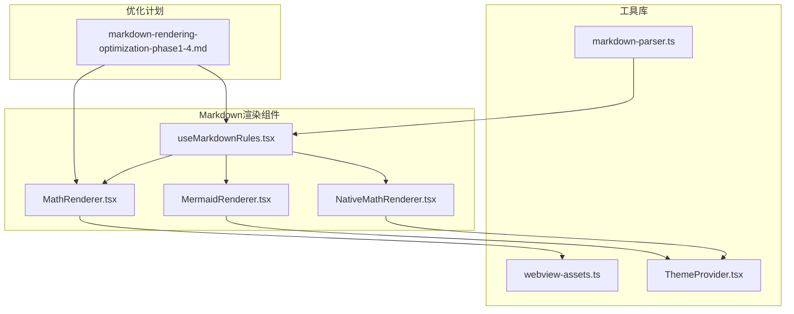
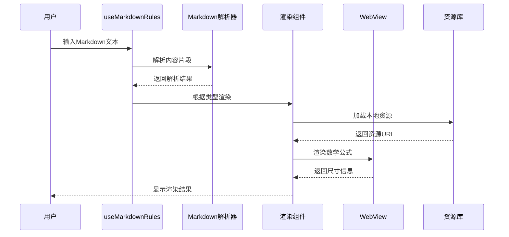
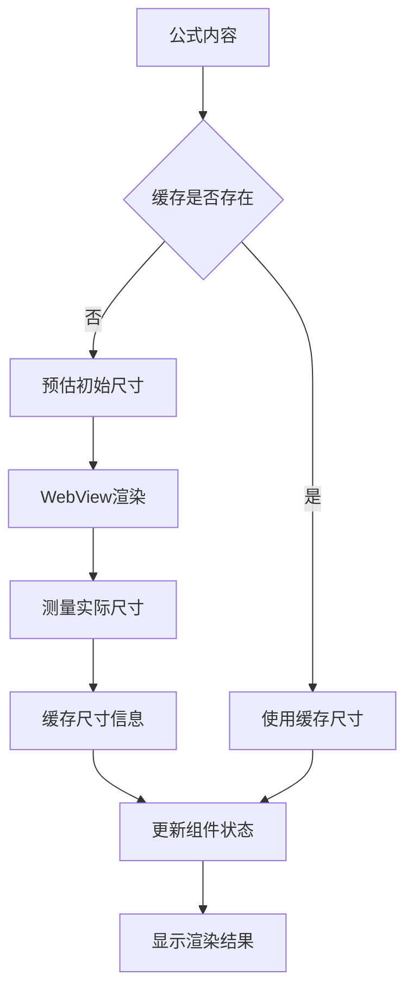
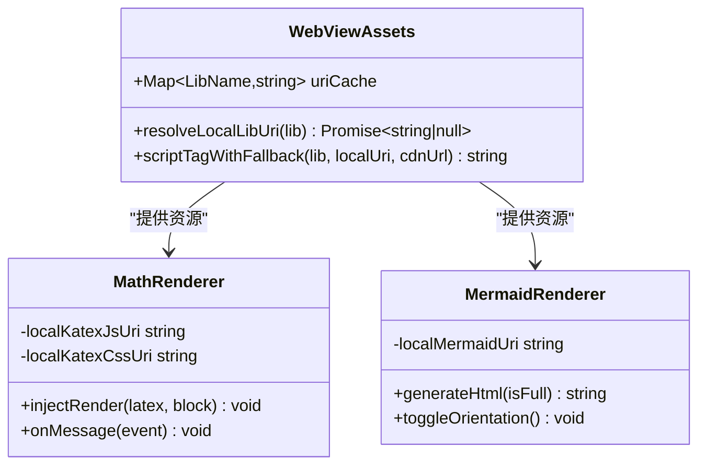
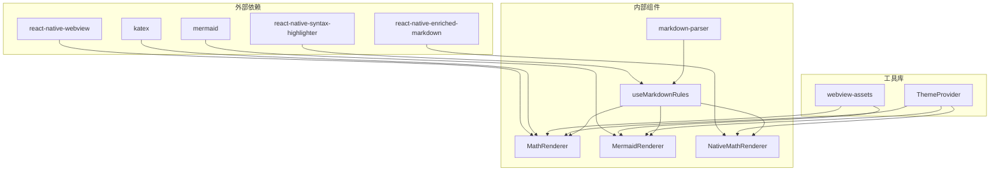

# Markdown渲染优化

<cite>
**本文档引用的文件**
- [README.md](file://README.md)
- [MathRenderer.tsx](file://src/components/chat/MathRenderer.tsx)
- [NativeMathRenderer.tsx](file://src/components/chat/NativeMathRenderer.tsx)
- [MermaidRenderer.tsx](file://src/components/chat/MermaidRenderer.tsx)
- [useMarkdownRules.tsx](file://src/features/chat/hooks/useMarkdownRules.tsx)
- [markdown-parser.ts](file://src/lib/markdown-parser.ts)
- [webview-assets.ts](file://src/lib/webview-assets.ts)
- [markdown-rendering-optimization-phase1-4.md](file://.agent/docs/plans/markdown-rendering-optimization-phase1-4.md)
- [ThemeProvider.tsx](file://src/theme/ThemeProvider.tsx)
</cite>

## 目录
1. [简介](#简介)
2. [项目结构](#项目结构)
3. [核心组件](#核心组件)
4. [架构概览](#架构概览)
5. [详细组件分析](#详细组件分析)
6. [依赖关系分析](#依赖关系分析)
7. [性能考虑](#性能考虑)
8. [故障排除指南](#故障排除指南)
9. [结论](#结论)

## 简介

Nexara 是一个专注于本地数据管理和多提供商模型访问的 Android AI 助手客户端。该项目在 Markdown 渲染方面进行了全面的优化，特别是在数学公式渲染、图表展示和中文排版方面。

根据项目文档，Nexara 支持多种渲染能力：
- Markdown、LaTeX、Mermaid 图表和 ECharts 渲染
- 数学公式在聊天中的实时渲染
- 知识图谱提取和查询重写
- 本地推理和离线使用能力

## 项目结构

项目的 Markdown 渲染系统主要分布在以下几个核心目录：

**图表来源**
- [MathRenderer.tsx:1-604](file://src/components/chat/MathRenderer.tsx#L1-L604)
- [useMarkdownRules.tsx:1-343](file://src/features/chat/hooks/useMarkdownRules.tsx#L1-L343)

**章节来源**
- [README.md:40-47](file://README.md#L40-L47)
- [markdown-rendering-optimization-phase1-4.md:1-737](file://.agent/docs/plans/markdown-rendering-optimization-phase1-4.md#L1-L737)

## 核心组件

### 数学公式渲染组件

项目实现了两种数学公式渲染方案：

1. **WebView 方案** (`MathRenderer.tsx`)
   - 使用 KaTeX 通过 WebView 渲染
   - 支持行内和块级数学公式
   - 实现了全局尺寸缓存机制
   - 提供离线资源加载能力

2. **原生方案** (`NativeMathRenderer.tsx`)
   - 基于 react-native-enriched-markdown
   - 零 WebView 开销
   - 完美的流式输出体验
   - 极低内存占用

**章节来源**
- [MathRenderer.tsx:75-260](file://src/components/chat/MathRenderer.tsx#L75-L260)
- [NativeMathRenderer.tsx:19-64](file://src/components/chat/NativeMathRenderer.tsx#L19-L64)

### 图表渲染组件

Mermaid 图表渲染器提供了丰富的交互功能：

- 懒加载卡片模式
- 全屏交互模式
- 物理横屏旋转支持
- 自适应高度检测
- 主题切换支持

**章节来源**
- [MermaidRenderer.tsx:32-252](file://src/components/chat/MermaidRenderer.tsx#L32-L252)

### Markdown 规则钩子

`useMarkdownRules.tsx` 提供了完整的 Markdown 渲染规则：

- 行内数学公式检测和渲染
- 代码块语法高亮
- 表格横向滚动支持
- 链接交互处理
- 图片渲染支持

**章节来源**
- [useMarkdownRules.tsx:38-342](file://src/features/chat/hooks/useMarkdownRules.tsx#L38-L342)

## 架构概览

**图表来源**
- [useMarkdownRules.tsx:83-126](file://src/features/chat/hooks/useMarkdownRules.tsx#L83-L126)
- [MathRenderer.tsx:133-216](file://src/components/chat/MathRenderer.tsx#L133-L216)
- [webview-assets.ts:26-49](file://src/lib/webview-assets.ts#L26-L49)

## 详细组件分析

### 数学公式渲染优化

项目在数学公式渲染方面实现了多项优化：

#### 全局尺寸缓存机制

**图表来源**
- [MathRenderer.tsx:87-131](file://src/components/chat/MathRenderer.tsx#L87-L131)

#### 预估算法优化

项目实现了智能的公式尺寸预估算法：

- 基于公式长度的线性预估
- LaTeX 命令的空间需求计算
- 上下标和花括号的额外空间补偿
- 屏幕宽度限制和最小尺寸保证

**章节来源**
- [MathRenderer.tsx:15-49](file://src/components/chat/MathRenderer.tsx#L15-L49)

### 中文排版优化

根据优化计划文档，项目实施了多项中文排版改进：

#### Android 字体填充统一

通过设置 `includeFontPadding: false` 和 `textAlignVertical: 'center'` 来消除 Android 中文的额外上下填充。

#### 中西文混排间距

实现了基于 pangu.js 规则的中西文混排自动间距：
- 中文后紧跟拉丁字母/数字 → 插入空格
- 拉丁字母/数字后紧跟中文 → 插入空格

**章节来源**
- [markdown-rendering-optimization-phase1-4.md:285-293](file://.agent/docs/plans/markdown-rendering-optimization-phase1-4.md#L285-L293)

### 资源管理优化

项目实现了智能的 WebView 资源管理：

**图表来源**
- [webview-assets.ts:26-71](file://src/lib/webview-assets.ts#L26-L71)
- [MathRenderer.tsx:77-85](file://src/components/chat/MathRenderer.tsx#L77-L85)

**章节来源**
- [webview-assets.ts:1-72](file://src/lib/webview-assets.ts#L1-L72)

## 依赖关系分析

**图表来源**
- [MathRenderer.tsx:1-13](file://src/components/chat/MathRenderer.tsx#L1-L13)
- [useMarkdownRules.tsx:16-22](file://src/features/chat/hooks/useMarkdownRules.tsx#L16-L22)

**章节来源**
- [MathRenderer.tsx:1-13](file://src/components/chat/MathRenderer.tsx#L1-L13)
- [useMarkdownRules.tsx:16-22](file://src/features/chat/hooks/useMarkdownRules.tsx#L16-L22)

## 性能考虑

### 渲染性能优化

1. **尺寸预估和缓存**
   - 避免动态测量导致的布局抖动
   - 全局尺寸缓存减少重复计算
   - 预估尺寸作为兜底方案

2. **资源加载优化**
   - 本地资源优先加载
   - CDN 降级机制
   - 资源 URI 缓存

3. **内存管理**
   - WebView 资源的合理释放
   - 组件状态的及时清理
   - 图表渲染的懒加载策略

### 用户体验优化

1. **流畅的交互**
   - 零 WebView 开销的原生渲染方案
   - 流式输出体验
   - 即时的主题切换响应

2. **可靠性保障**
   - 离线环境下的资源加载
   - 错误处理和降级策略
   - 性能监控和告警

## 故障排除指南

### 常见问题及解决方案

#### 数学公式渲染问题

**问题症状**：数学公式无法显示或显示异常

**排查步骤**：
1. 检查 WebView 资源加载状态
2. 验证 KaTeX 资源的本地和 CDN 加载
3. 确认公式内容格式正确

**解决方案**：
- 确保 `resolveLocalLibUri` 正常返回资源 URI
- 检查 CDN 降级机制是否正常工作
- 验证公式内容是否符合 LaTeX 语法

#### 图表渲染问题

**问题症状**：Mermaid 图表无法显示或显示不完整

**排查步骤**：
1. 检查图表内容格式
2. 验证 WebView JavaScript 执行
3. 确认主题切换时的资源重新加载

**解决方案**：
- 确保图表内容去除代码块标记
- 检查 `generateHtml` 方法的正确性
- 验证 `onMessage` 回调的处理逻辑

#### 中文排版问题

**问题症状**：中文文本显示异常或排版不美观

**排查步骤**：
1. 检查字体填充设置
2. 验证中西文混排规则
3. 确认行高设置的合理性

**解决方案**：
- 确保 `includeFontPadding: false` 设置正确
- 验证中西文混排正则表达式的准确性
- 检查不同字号下的行高计算

**章节来源**
- [MathRenderer.tsx:241-256](file://src/components/chat/MathRenderer.tsx#L241-L256)
- [MermaidRenderer.tsx:186-197](file://src/components/chat/MermaidRenderer.tsx#L186-L197)

## 结论

Nexara 项目的 Markdown 渲染优化展现了全面的技术考量和用户体验优化。通过实现多种渲染方案、智能的资源管理和性能优化策略，项目在保持功能完整性的同时，显著提升了渲染质量和用户交互体验。

主要成就包括：
- 实现了数学公式渲染的双重方案，兼顾性能和功能
- 优化了中文排版，解决了 Android 平台的特殊问题
- 建立了完善的资源管理系统，支持离线使用
- 通过模块化设计提高了代码的可维护性和扩展性

这些优化为后续的功能扩展和技术升级奠定了坚实的基础，也为类似项目的 Markdown 渲染优化提供了宝贵的参考经验。