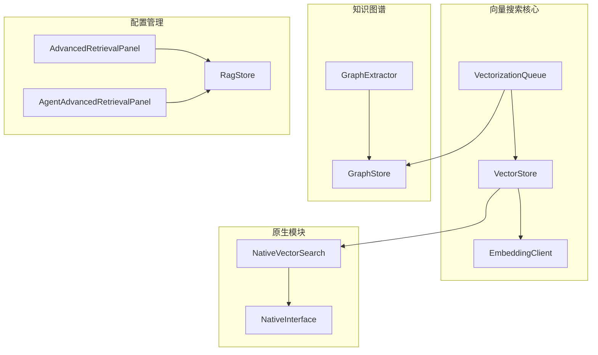
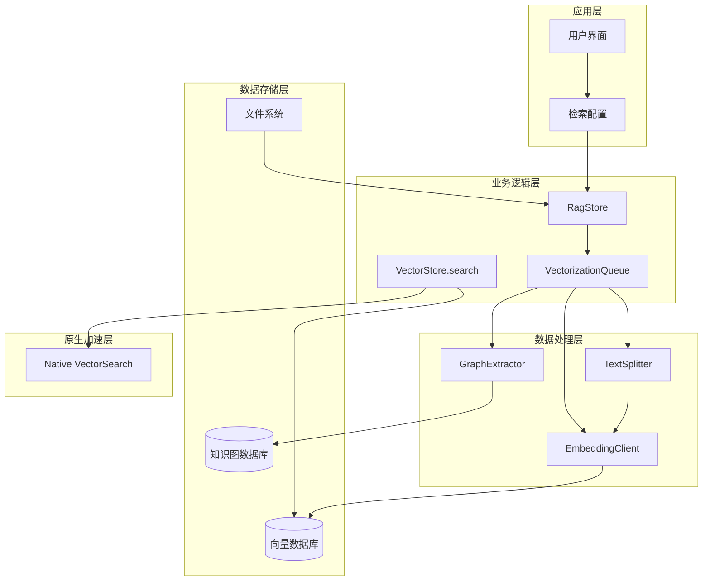
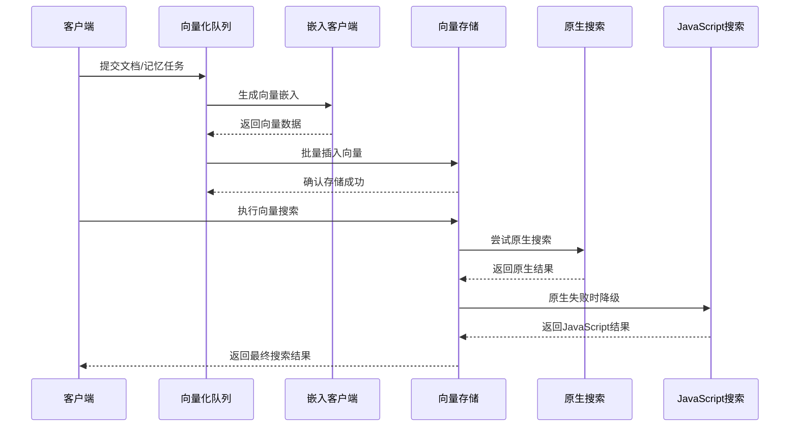
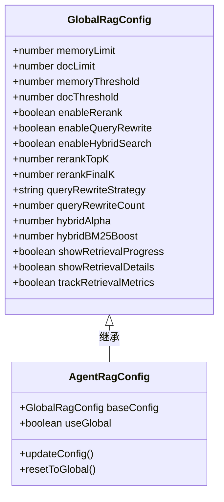
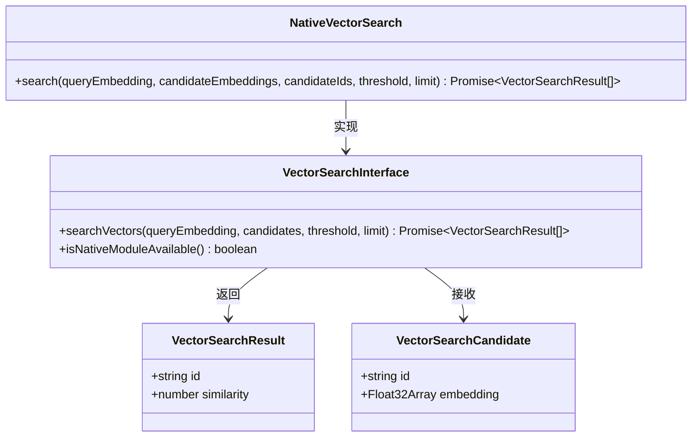
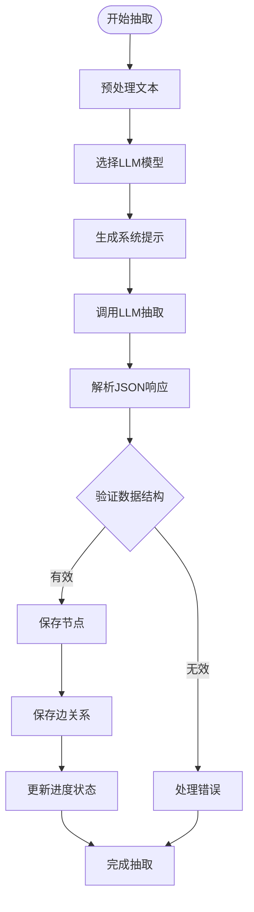
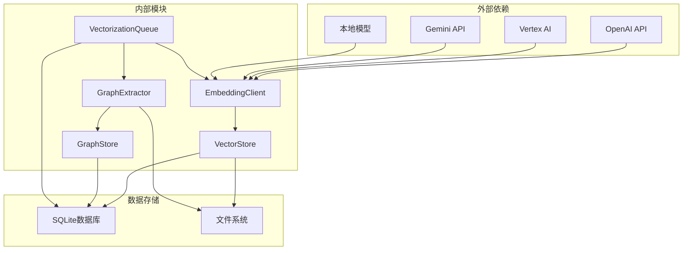

# 向量搜索基础设施

<cite>
**本文档引用的文件**
- [src/native/VectorSearch/index.ts](file://src/native/VectorSearch/index.ts)
- [src/native/VectorSearch/NativeVectorSearch.ts](file://src/native/VectorSearch/NativeVectorSearch.ts)
- [src/lib/rag/vector-store.ts](file://src/lib/rag/vector-store.ts)
- [src/lib/rag/vectorization-queue.ts](file://src/lib/rag/vectorization-queue.ts)
- [src/lib/rag/embedding.ts](file://src/lib/rag/embedding.ts)
- [src/lib/rag/graph-store.ts](file://src/lib/rag/graph-store.ts)
- [src/lib/rag/graph-extractor.ts](file://src/lib/rag/graph-extractor.ts)
- [src/store/rag-store.ts](file://src/store/rag-store.ts)
- [src/types/rag.ts](file://src/types/rag.ts)
- [src/features/settings/components/AdvancedRetrievalPanel.tsx](file://src/features/settings/components/AdvancedRetrievalPanel.tsx)
- [src/features/settings/components/AgentAdvancedRetrievalPanel.tsx](file://src/features/settings/components/AgentAdvancedRetrievalPanel.tsx)
- [src/services/workbench/WorkbenchRouter.ts](file://src/services/workbench/WorkbenchRouter.ts)
</cite>

## 目录
1. [简介](#简介)
2. [项目结构](#项目结构)
3. [核心组件](#核心组件)
4. [架构概览](#架构概览)
5. [详细组件分析](#详细组件分析)
6. [依赖关系分析](#依赖关系分析)
7. [性能考虑](#性能考虑)
8. [故障排除指南](#故障排除指南)
9. [结论](#结论)

## 简介

向量搜索基础设施是 Nexara 应用程序中用于实现智能检索和知识管理的核心系统。该系统基于向量嵌入技术，结合本地和云端的嵌入模型，为用户提供高效、准确的信息检索能力。

该基础设施主要包含以下核心功能：
- 向量存储和检索
- 文档向量化处理
- 知识图谱抽取和管理
- 智能检索配置
- 任务队列管理
- 原生加速搜索

## 项目结构

向量搜索基础设施采用模块化设计，主要分布在以下几个核心目录中：

**图表来源**
- [src/lib/rag/vector-store.ts:22-376](file://src/lib/rag/vector-store.ts#L22-L376)
- [src/lib/rag/vectorization-queue.ts:22-804](file://src/lib/rag/vectorization-queue.ts#L22-L804)
- [src/lib/rag/graph-store.ts:29-548](file://src/lib/rag/graph-store.ts#L29-L548)

**章节来源**
- [src/lib/rag/vector-store.ts:1-376](file://src/lib/rag/vector-store.ts#L1-L376)
- [src/lib/rag/vectorization-queue.ts:1-804](file://src/lib/rag/vectorization-queue.ts#L1-L804)
- [src/lib/rag/graph-store.ts:1-548](file://src/lib/rag/graph-store.ts#L1-L548)

## 核心组件

### 向量存储系统

向量存储系统是整个基础设施的数据层核心，负责向量数据的持久化和检索。

**主要特性：**
- 支持原生和JavaScript两种搜索实现
- 自动维度验证和错误处理
- 批量向量插入和事务管理
- 智能过滤和排序机制

**章节来源**
- [src/lib/rag/vector-store.ts:22-376](file://src/lib/rag/vector-store.ts#L22-L376)

### 向量化队列

向量化队列管理系统负责文档和记忆的异步处理，确保资源的有效利用和任务的可靠执行。

**核心功能：**
- 支持文档向量化和记忆归档
- 串行处理避免资源竞争
- 断点续传和任务恢复
- 智能重试机制

**章节来源**
- [src/lib/rag/vectorization-queue.ts:22-804](file://src/lib/rag/vectorization-queue.ts#L22-L804)

### 嵌入客户端

嵌入客户端提供统一的向量生成接口，支持多种提供商和模型类型。

**支持的提供商：**
- OpenAI兼容API
- Vertex AI
- Gemini API
- 本地模型 (llama.rn)

**章节来源**
- [src/lib/rag/embedding.ts:20-294](file://src/lib/rag/embedding.ts#L20-L294)

### 知识图谱系统

知识图谱系统负责从文本中抽取实体和关系，构建结构化的知识网络。

**主要功能：**
- 实体识别和分类
- 关系抽取和权重计算
- 图数据库管理和查询
- 多语言支持和本地化

**章节来源**
- [src/lib/rag/graph-store.ts:29-548](file://src/lib/rag/graph-store.ts#L29-L548)
- [src/lib/rag/graph-extractor.ts:25-313](file://src/lib/rag/graph-extractor.ts#L25-L313)

## 架构概览

向量搜索基础设施采用分层架构设计，确保系统的可扩展性和维护性：

**图表来源**
- [src/store/rag-store.ts:147-800](file://src/store/rag-store.ts#L147-L800)
- [src/lib/rag/vector-store.ts:62-113](file://src/lib/rag/vector-store.ts#L62-L113)
- [src/lib/rag/vectorization-queue.ts:158-250](file://src/lib/rag/vectorization-queue.ts#L158-L250)

## 详细组件分析

### 向量搜索流程

向量搜索系统的工作流程如下：

**图表来源**
- [src/lib/rag/vectorization-queue.ts:158-250](file://src/lib/rag/vectorization-queue.ts#L158-L250)
- [src/lib/rag/vector-store.ts:62-113](file://src/lib/rag/vector-store.ts#L62-L113)

**章节来源**
- [src/lib/rag/vector-store.ts:62-215](file://src/lib/rag/vector-store.ts#L62-L215)
- [src/lib/rag/vectorization-queue.ts:256-414](file://src/lib/rag/vectorization-queue.ts#L256-L414)

### 检索配置系统

检索配置系统提供了灵活的参数调整能力：

**图表来源**
- [src/features/settings/components/AdvancedRetrievalPanel.tsx:11-445](file://src/features/settings/components/AdvancedRetrievalPanel.tsx#L11-L445)
- [src/features/settings/components/AgentAdvancedRetrievalPanel.tsx:19-521](file://src/features/settings/components/AgentAdvancedRetrievalPanel.tsx#L19-L521)

**章节来源**
- [src/features/settings/components/AdvancedRetrievalPanel.tsx:11-445](file://src/features/settings/components/AdvancedRetrievalPanel.tsx#L11-L445)
- [src/features/settings/components/AgentAdvancedRetrievalPanel.tsx:19-521](file://src/features/settings/components/AgentAdvancedRetrievalPanel.tsx#L19-L521)

### 原生向量搜索模块

原生向量搜索模块提供了高性能的向量相似度计算：

**图表来源**
- [src/native/VectorSearch/NativeVectorSearch.ts:4-18](file://src/native/VectorSearch/NativeVectorSearch.ts#L4-L18)
- [src/native/VectorSearch/index.ts:3-53](file://src/native/VectorSearch/index.ts#L3-L53)

**章节来源**
- [src/native/VectorSearch/NativeVectorSearch.ts:1-18](file://src/native/VectorSearch/NativeVectorSearch.ts#L1-L18)
- [src/native/VectorSearch/index.ts:1-53](file://src/native/VectorSearch/index.ts#L1-L53)

### 知识图谱抽取流程

知识图谱抽取系统的工作流程：

**图表来源**
- [src/lib/rag/graph-extractor.ts:149-310](file://src/lib/rag/graph-extractor.ts#L149-L310)

**章节来源**
- [src/lib/rag/graph-extractor.ts:25-313](file://src/lib/rag/graph-extractor.ts#L25-L313)

## 依赖关系分析

向量搜索基础设施的依赖关系呈现清晰的层次结构：

**图表来源**
- [src/lib/rag/embedding.ts:20-89](file://src/lib/rag/embedding.ts#L20-L89)
- [src/lib/rag/vector-store.ts:1-376](file://src/lib/rag/vector-store.ts#L1-L376)

**章节来源**
- [src/lib/rag/embedding.ts:1-294](file://src/lib/rag/embedding.ts#L1-L294)
- [src/lib/rag/vector-store.ts:1-376](file://src/lib/rag/vector-store.ts#L1-L376)

## 性能考虑

向量搜索基础设施在设计时充分考虑了性能优化：

### 内存管理
- 向量数据以二进制格式存储，减少内存占用
- 支持增量哈希检查，避免重复向量化
- 智能批处理机制，平衡内存使用和处理效率

### 并发控制
- 串行处理队列，避免资源竞争
- 心跳机制检测和恢复中断任务
- 指数退避重试策略

### 搜索优化
- 原生模块优先，JavaScript降级备份
- 智能阈值过滤，减少不必要的计算
- 维度验证和错误处理

## 故障排除指南

### 常见问题及解决方案

**向量维度不匹配**
- 症状：搜索返回0结果，控制台显示维度错误
- 解决方案：检查嵌入模型配置，确保查询向量和存储向量维度一致

**嵌入模型加载失败**
- 症状：本地模型无法加载，向量化任务失败
- 解决方案：检查模型文件完整性，验证模型槽位配置

**网络连接超时**
- 症状：远程API调用超时或频繁重试
- 解决方案：检查网络连接，调整超时参数，考虑使用本地模型

**知识图谱抽取失败**
- 症状：图谱提取任务报错但不崩溃
- 解决方案：检查LLM模型配置，验证JSON输出格式，查看日志获取详细错误信息

**章节来源**
- [src/lib/rag/vector-store.ts:201-210](file://src/lib/rag/vector-store.ts#L201-L210)
- [src/lib/rag/vectorization-queue.ts:200-235](file://src/lib/rag/vectorization-queue.ts#L200-L235)

## 结论

向量搜索基础设施是一个设计精良、功能完整的智能检索系统。其核心优势包括：

1. **模块化设计**：清晰的分层架构便于维护和扩展
2. **多提供商支持**：灵活适配不同类型的嵌入模型
3. **原生加速**：通过原生模块提升搜索性能
4. **智能配置**：丰富的检索参数调节能力
5. **可靠性保障**：完善的错误处理和任务恢复机制

该系统为Nexara应用程序提供了强大的知识管理和智能检索能力，为用户创造更好的使用体验。随着功能的不断完善和技术的持续演进，该基础设施将继续为应用程序的发展提供坚实的技术支撑。