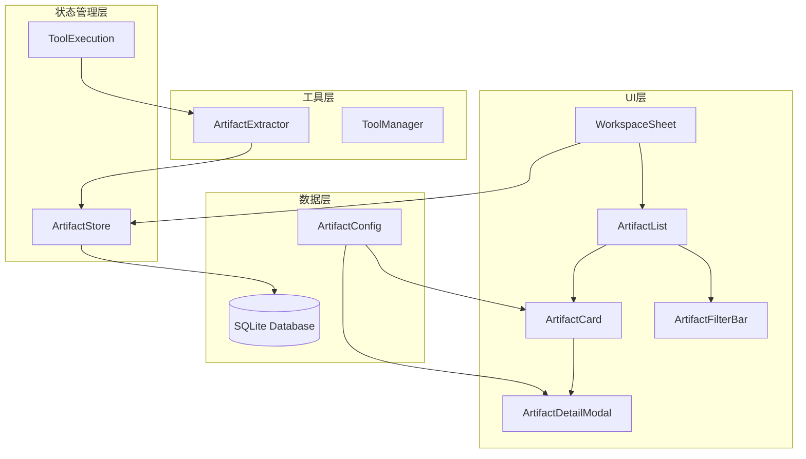
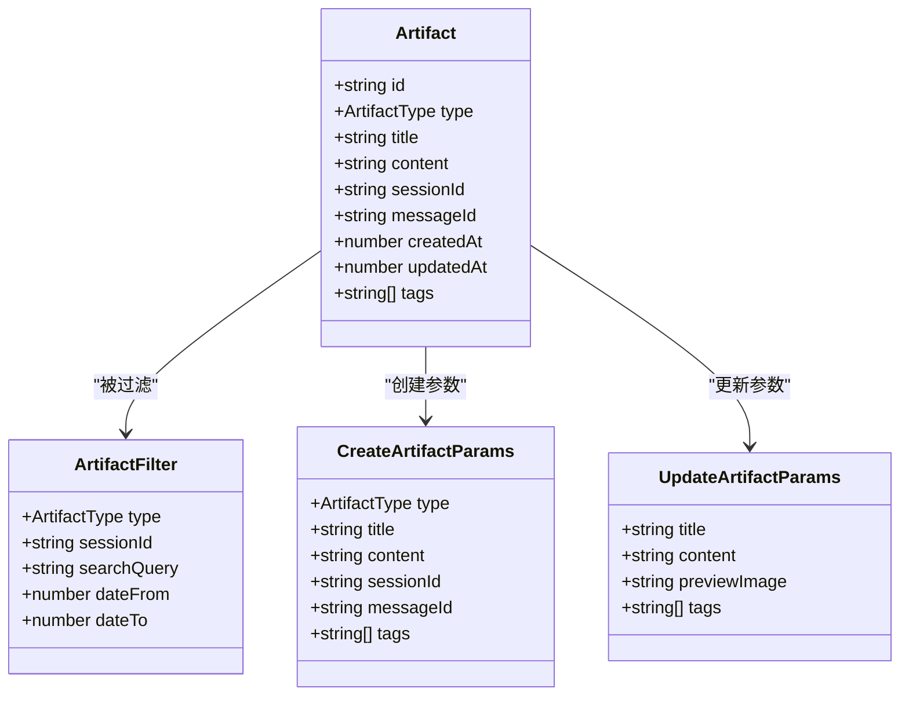
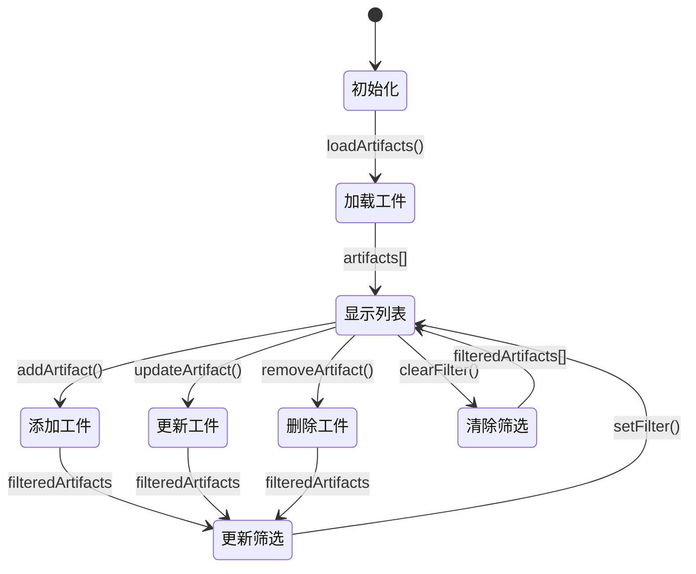
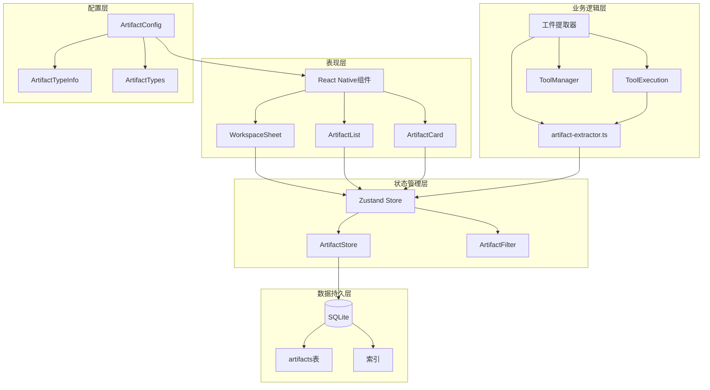
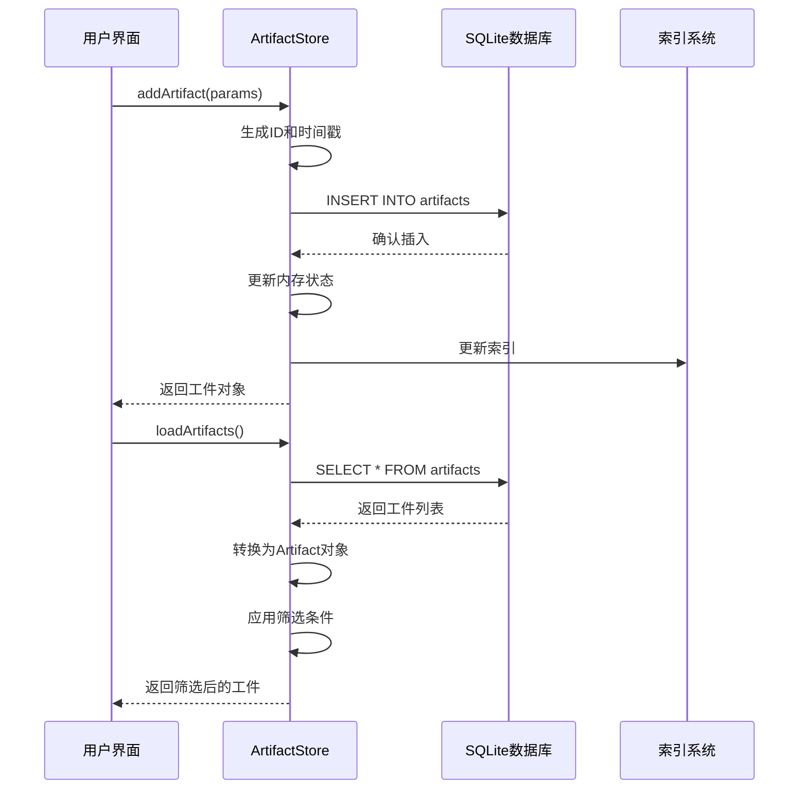
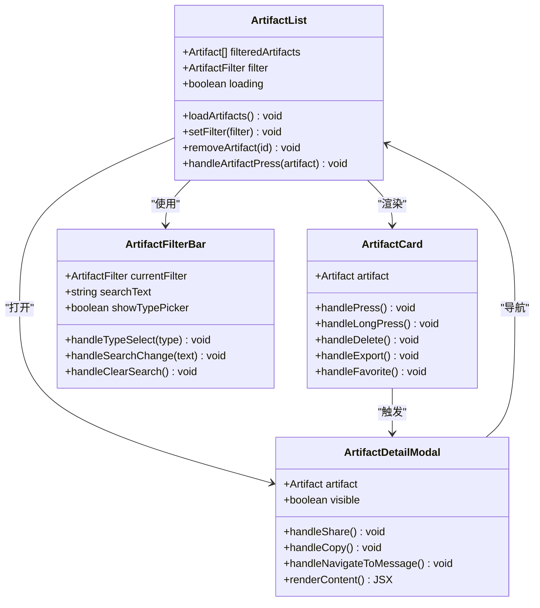
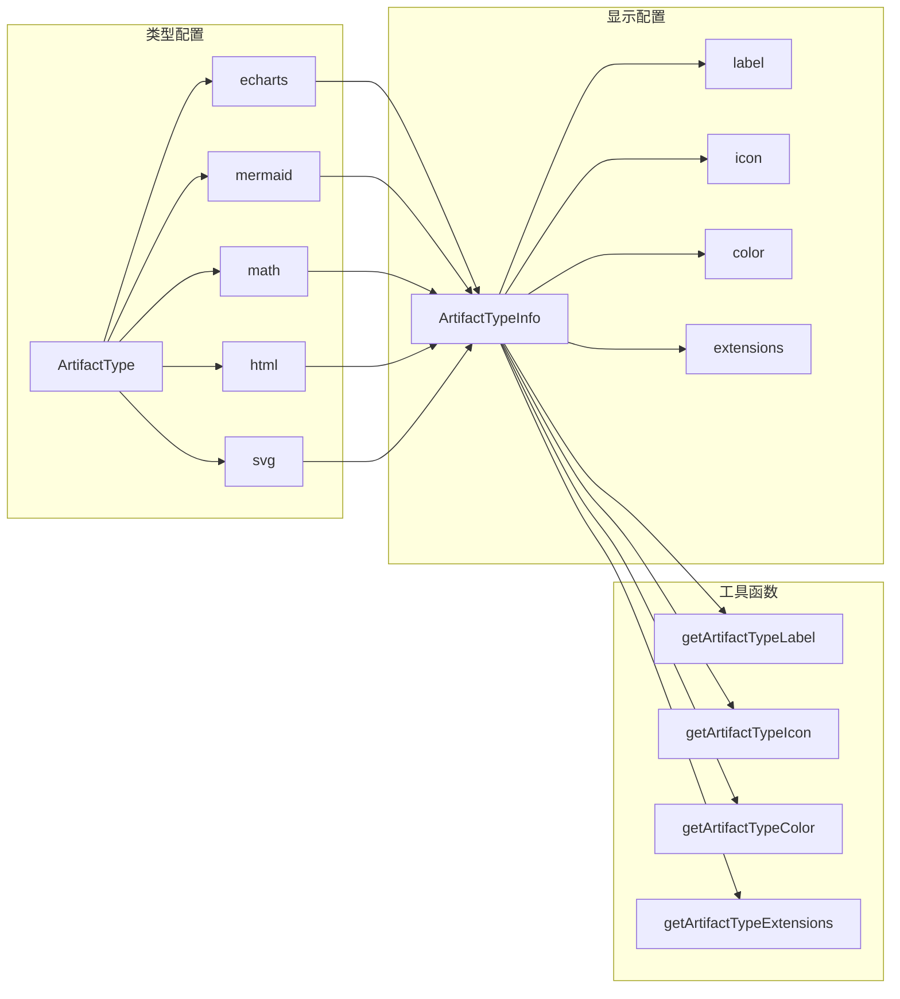
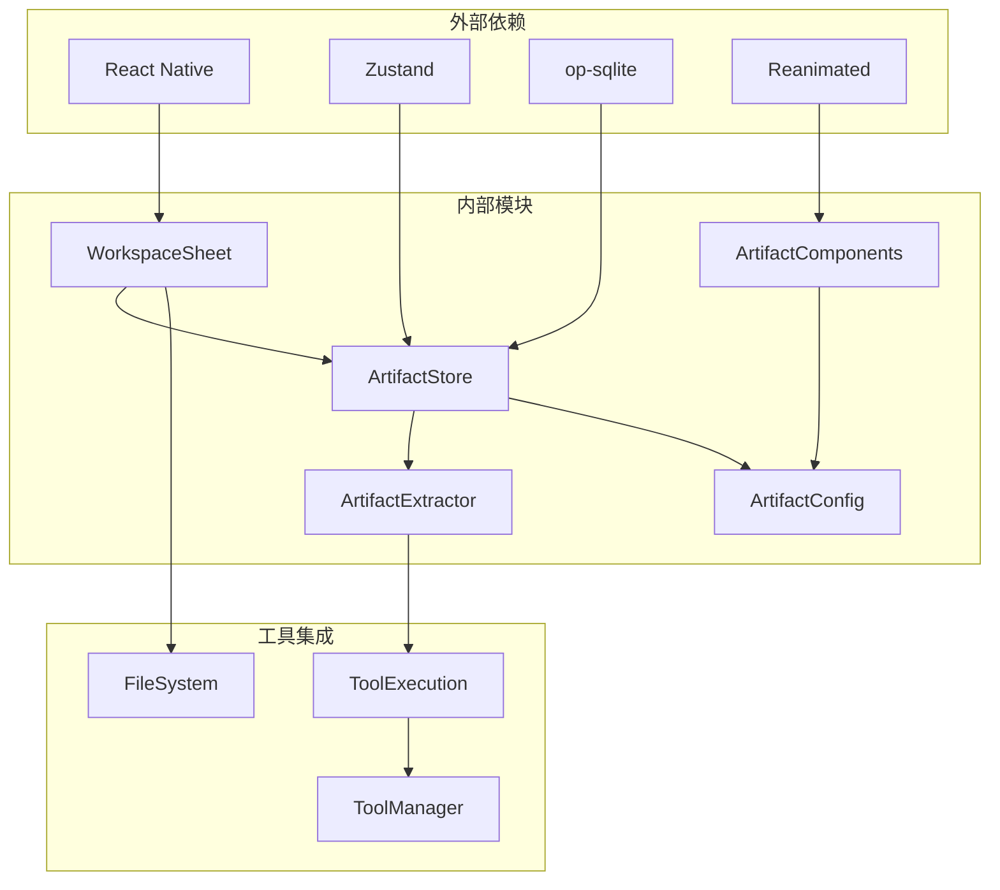

# 工件系统实现

<cite>
**本文档引用的文件**
- [README.md](file://README.md)
- [artifacts-workspace-implementation.md](file://plans/artifacts-workspace-implementation.md)
- [artifact.ts](file://src/types/artifact.ts)
- [artifact-config.ts](file://src/constants/artifact-config.ts)
- [artifact-store.ts](file://src/store/artifact-store.ts)
- [artifact-extractor.ts](file://src/features/chat/utils/artifact-extractor.ts)
- [ArtifactList.tsx](file://src/features/chat/components/WorkspaceSheet/ArtifactList.tsx)
- [ArtifactCard.tsx](file://src/features/chat/components/WorkspaceSheet/ArtifactCard.tsx)
- [ArtifactDetailModal.tsx](file://src/features/chat/components/WorkspaceSheet/ArtifactDetailModal.tsx)
- [ArtifactFilterBar.tsx](file://src/features/chat/components/WorkspaceSheet/ArtifactFilterBar.tsx)
- [WorkspaceSheet.tsx](file://src/features/chat/components/WorkspaceSheet/index.tsx)
- [db/index.ts](file://src/lib/db/index.ts)
- [tool-execution.ts](file://src/store/chat/tool-execution.ts)
</cite>

## 目录
1. [简介](#简介)
2. [项目结构](#项目结构)
3. [核心组件](#核心组件)
4. [架构概览](#架构概览)
5. [详细组件分析](#详细组件分析)
6. [依赖关系分析](#依赖关系分析)
7. [性能考虑](#性能考虑)
8. [故障排除指南](#故障排除指南)
9. [结论](#结论)

## 简介

Nexara是一个专注于Android平台的AI助手客户端，其工件系统实现了对会话中生成的各种内容（图表、流程图、数学公式、代码等）的统一管理和持久化存储。该系统通过自动提取工具从工具执行结果中识别和提取工件，提供完整的工件生命周期管理。

工件系统的核心目标包括：
- **全局工件索引**：统一展示所有会话生成的工件
- **会话关联**：工件与来源会话保持关联，可快速跳转
- **持久化存储**：工件独立存储，不随消息删除而丢失
- **导出分享**：支持导出为多种格式
- **搜索筛选**：按类型、时间、会话等维度筛选

## 项目结构

工件系统采用模块化设计，主要包含以下层次：

**图表来源**
- [WorkspaceSheet.tsx:1-328](file://src/features/chat/components/WorkspaceSheet/index.tsx#L1-L328)
- [artifact-store.ts:1-255](file://src/store/artifact-store.ts#L1-L255)
- [artifact-extractor.ts:1-229](file://src/features/chat/utils/artifact-extractor.ts#L1-L229)

**章节来源**
- [README.md:12-47](file://README.md#L12-L47)
- [artifacts-workspace-implementation.md:21-31](file://plans/artifacts-workspace-implementation.md#L21-L31)

## 核心组件

### 数据模型设计

工件系统定义了完整的数据模型来描述各种类型的工件：

**图表来源**
- [artifact.ts:8-45](file://src/types/artifact.ts#L8-L45)

### 状态管理架构

工件状态管理系统基于Zustand实现，提供了完整的CRUD操作和筛选功能：

**图表来源**
- [artifact-store.ts:95-254](file://src/store/artifact-store.ts#L95-L254)

**章节来源**
- [artifact.ts:1-45](file://src/types/artifact.ts#L1-L45)
- [artifact-store.ts:1-255](file://src/store/artifact-store.ts#L1-L255)

## 架构概览

工件系统采用分层架构设计，确保各层职责清晰分离：

**图表来源**
- [artifact-extractor.ts:1-229](file://src/features/chat/utils/artifact-extractor.ts#L1-L229)
- [artifact-store.ts:95-254](file://src/store/artifact-store.ts#L95-L254)
- [artifact-config.ts:1-78](file://src/constants/artifact-config.ts#L1-L78)

## 详细组件分析

### 工件提取器

工件提取器是系统的核心组件，负责从工具执行结果中自动识别和提取工件：

**图表来源**
- [artifact-extractor.ts:157-200](file://src/features/chat/utils/artifact-extractor.ts#L157-L200)

#### 提取算法特点

1. **多格式支持**：支持ECharts、Mermaid、Math、HTML、SVG等多种工件类型
2. **智能标题生成**：根据内容自动提取有意义的标题
3. **去重机制**：避免重复提取相同的工件
4. **错误处理**：提取失败不影响工具执行流程

**章节来源**
- [artifact-extractor.ts:1-229](file://src/features/chat/utils/artifact-extractor.ts#L1-L229)

### 工件存储系统

工件存储系统提供了完整的数据持久化解决方案：

**图表来源**
- [artifact-store.ts:124-170](file://src/store/artifact-store.ts#L124-L170)
- [artifact-store.ts:102-122](file://src/store/artifact-store.ts#L102-L122)

#### 数据库设计

工件表结构设计充分考虑了查询性能和数据完整性：

| 字段名 | 类型 | 约束 | 描述 |
|--------|------|------|------|
| id | TEXT | PRIMARY KEY | 工件唯一标识符 |
| type | TEXT | NOT NULL | 工件类型 |
| title | TEXT | NOT NULL | 工件标题 |
| content | TEXT | NOT NULL | 工件内容 |
| preview_image | TEXT |  | 预览图URL |
| session_id | TEXT | NOT NULL, FOREIGN KEY | 关联会话ID |
| message_id | TEXT | NOT NULL | 关联消息ID |
| created_at | INTEGER | NOT NULL | 创建时间戳 |
| updated_at | INTEGER | NOT NULL | 更新时间戳 |
| tags | TEXT |  | 标签JSON数组 |

**章节来源**
- [artifact-store.ts:142-157](file://src/store/artifact-store.ts#L142-L157)

### 工件UI组件

工件UI组件提供了丰富的用户交互体验：

**图表来源**
- [ArtifactList.tsx:25-184](file://src/features/chat/components/WorkspaceSheet/ArtifactList.tsx#L25-L184)
- [ArtifactCard.tsx:66-198](file://src/features/chat/components/WorkspaceSheet/ArtifactCard.tsx#L66-L198)
- [ArtifactDetailModal.tsx:60-285](file://src/features/chat/components/WorkspaceSheet/ArtifactDetailModal.tsx#L60-L285)

#### 交互特性

1. **动画效果**：使用Reanimated实现流畅的过渡动画
2. **手势支持**：支持长按菜单、点击反馈等手势
3. **实时筛选**：支持按类型和关键词实时筛选
4. **收藏功能**：支持工件收藏管理
5. **导出分享**：支持内容复制和分享

**章节来源**
- [ArtifactList.tsx:1-208](file://src/features/chat/components/WorkspaceSheet/ArtifactList.tsx#L1-L208)
- [ArtifactCard.tsx:1-255](file://src/features/chat/components/WorkspaceSheet/ArtifactCard.tsx#L1-L255)
- [ArtifactDetailModal.tsx:1-371](file://src/features/chat/components/WorkspaceSheet/ArtifactDetailModal.tsx#L1-L371)

### 工件类型配置

系统提供了完整的工件类型配置机制：

**图表来源**
- [artifact-config.ts:8-78](file://src/constants/artifact-config.ts#L8-L78)

**章节来源**
- [artifact-config.ts:1-78](file://src/constants/artifact-config.ts#L1-L78)

## 依赖关系分析

工件系统的依赖关系体现了清晰的分层架构：

**图表来源**
- [WorkspaceSheet.tsx:13-15](file://src/features/chat/components/WorkspaceSheet/index.tsx#L13-L15)
- [artifact-store.ts:6-14](file://src/store/artifact-store.ts#L6-L14)

### 关键依赖说明

1. **状态管理**：使用Zustand替代Redux，提供更简洁的状态管理
2. **数据库访问**：基于op-sqlite实现高性能的本地存储
3. **动画系统**：使用Reanimated 4实现流畅的用户体验
4. **文件系统**：集成Expo FileSystem处理文件读写

**章节来源**
- [db/index.ts:1-13](file://src/lib/db/index.ts#L1-L13)
- [tool-execution.ts:349-378](file://src/store/chat/tool-execution.ts#L349-L378)

## 性能考虑

工件系统在设计时充分考虑了性能优化：

### 查询优化
- **索引策略**：为session_id、type、created_at建立复合索引
- **懒加载**：工件列表支持分页加载，避免一次性加载大量数据
- **缓存机制**：内存中维护工件列表缓存，减少数据库查询

### 存储优化
- **数据压缩**：工件内容采用压缩存储，节省空间
- **异步操作**：数据库操作采用异步执行，避免阻塞主线程
- **批量处理**：支持批量工件创建和更新操作

### 内存管理
- **虚拟列表**：使用FlatList实现虚拟滚动，只渲染可见项
- **图片缓存**：预览图采用LRU缓存策略
- **垃圾回收**：及时清理不再使用的工件引用

## 故障排除指南

### 常见问题及解决方案

#### 工件提取失败
**问题现象**：工具执行成功但未生成工件
**可能原因**：
- 工具结果格式不符合预期
- 提取正则表达式匹配失败
- 工具执行状态为失败

**解决方法**：
1. 检查工具输出格式是否正确
2. 查看控制台日志中的提取错误信息
3. 验证工件类型映射配置

#### 工件存储异常
**问题现象**：工件无法保存或加载
**可能原因**：
- 数据库连接失败
- SQL语句执行错误
- 网络同步问题

**解决方法**：
1. 检查数据库初始化状态
2. 验证SQL语句语法
3. 查看错误日志获取详细信息

#### UI渲染问题
**问题现象**：工件列表显示异常或卡顿
**可能原因**：
- 组件重新渲染次数过多
- 数据量过大导致性能问题
- 动画效果影响渲染性能

**解决方法**：
1. 使用React.memo优化组件渲染
2. 实施数据分页加载
3. 调整动画参数提升性能

**章节来源**
- [artifact-store.ts:118-122](file://src/store/artifact-store.ts#L118-L122)
- [artifact-extractor.ts:370-373](file://src/features/chat/utils/artifact-extractor.ts#L370-L373)

## 结论

Nexara的工件系统实现了完整的工件生命周期管理，具有以下优势：

1. **架构清晰**：采用分层设计，职责分离明确
2. **功能完整**：支持多种工件类型和丰富的交互功能
3. **性能优秀**：通过索引优化和异步处理确保流畅体验
4. **扩展性强**：模块化设计便于功能扩展和维护

系统通过自动提取、智能存储和友好的用户界面，为用户提供了一站式的工件管理解决方案。未来可以进一步优化的方向包括增强工件导出功能、完善标签系统和提升搜索体验。