# 工件系统实现

<cite>
**本文档引用的文件**
- [README.md](file://README.md)
- [artifact.ts](file://src/types/artifact.ts)
- [artifact-config.ts](file://src/constants/artifact-config.ts)
- [artifact-store.ts](file://src/store/artifact-store.ts)
- [db/index.ts](file://src/lib/db/index.ts)
- [db/schema.ts](file://src/lib/db/schema.ts)
- [db/migration.ts](file://src/lib/db/migration.ts)
- [artifact-extractor.ts](file://src/features/chat/utils/artifact-extractor.ts)
- [RendererRegistry.ts](file://src/components/chat/renderers/RendererRegistry.ts)
- [types.ts](file://src/components/chat/renderers/types.ts)
- [echarts-renderer-config.tsx](file://src/components/chat/renderers/echarts-renderer-config.tsx)
- [mermaid-renderer-config.tsx](file://src/components/chat/renderers/mermaid-renderer-config.tsx)
- [EChartsRenderer.tsx](file://src/components/chat/EChartsRenderer.tsx)
- [MermaidRenderer.tsx](file://src/components/chat/MermaidRenderer.tsx)
- [artifact-parser.ts](file://src/lib/artifact-parser.ts)
- [echarts-templates.ts](file://src/lib/artifact-templates/echarts-templates.ts)
- [mermaid-templates.ts](file://src/lib/artifact-templates/mermaid-templates.ts)
</cite>

## 更新摘要
**所做更改**
- 更新架构概览以反映工作区集成功能被移除后的简化架构
- 移除工作区路径相关的数据模型和状态管理逻辑
- 更新工件存储系统以移除工作区绑定功能
- 简化渲染器注册表和模板系统的实现
- 更新数据库架构以移除工作区路径列

## 目录
1. [简介](#简介)
2. [项目结构](#项目结构)
3. [核心组件](#核心组件)
4. [架构概览](#架构概览)
5. [详细组件分析](#详细组件分析)
6. [依赖关系分析](#依赖关系分析)
7. [性能考虑](#性能考虑)
8. [故障排除指南](#故障排除指南)
9. [结论](#结论)

## 简介

Nexara是一个专注于Android平台的AI助手客户端，其工件系统实现了对会话中生成的各种内容（图表、流程图、数学公式、代码等）的统一管理和持久化存储。该系统通过自动提取工具从工具执行结果中识别和提取工件，提供完整的工件生命周期管理。

**更新** 系统现已移除了工作区集成功能，回归到纯工件管理功能，不再包含工作区绑定和路径管理能力。工件系统现在专注于提供简洁高效的工件存储、检索和渲染功能。

工件系统的核心目标包括：
- **全局工件索引**：统一展示所有会话生成的工件
- **会话关联**：工件与来源会话保持关联，可快速跳转
- **持久化存储**：工件独立存储，不随消息删除而丢失
- **导出分享**：支持导出为多种格式
- **搜索筛选**：按类型、时间、会话等维度筛选
- **模板渲染**：基于模板系统实现灵活的内容渲染
- **扩展架构**：支持动态注册新的工件渲染器

## 项目结构

工件系统采用模块化设计，主要包含以下层次：

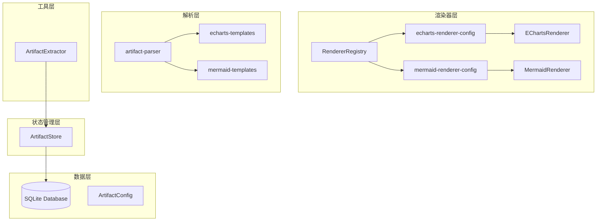

**图表来源**
- [RendererRegistry.ts:1-54](file://src/components/chat/renderers/RendererRegistry.ts#L1-L54)
- [echarts-renderer-config.tsx:1-39](file://src/components/chat/renderers/echarts-renderer-config.tsx#L1-L39)
- [mermaid-renderer-config.tsx:1-38](file://src/components/chat/renderers/mermaid-renderer-config.tsx#L1-L38)
- [artifact-parser.ts:1-238](file://src/lib/artifact-parser.ts#L1-L238)

**章节来源**
- [README.md:12-47](file://README.md#L12-L47)

## 核心组件

### 数据模型设计

**更新** 工件数据模型已移除工作区路径相关字段，简化为纯工件管理：

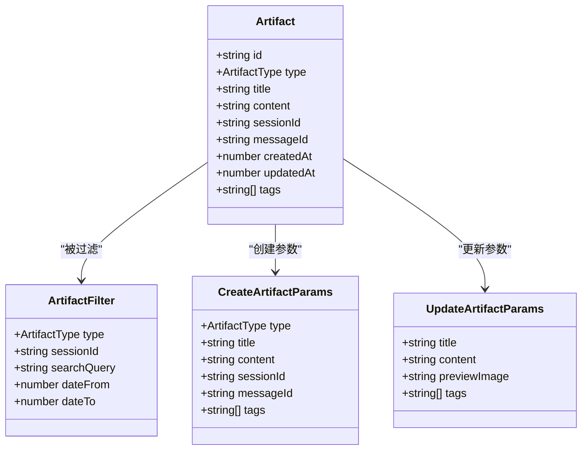

**图表来源**
- [artifact.ts:8-45](file://src/types/artifact.ts#L8-L45)

### 渲染器架构设计

**更新** 渲染器架构保持完整，专注于工件内容的渲染：

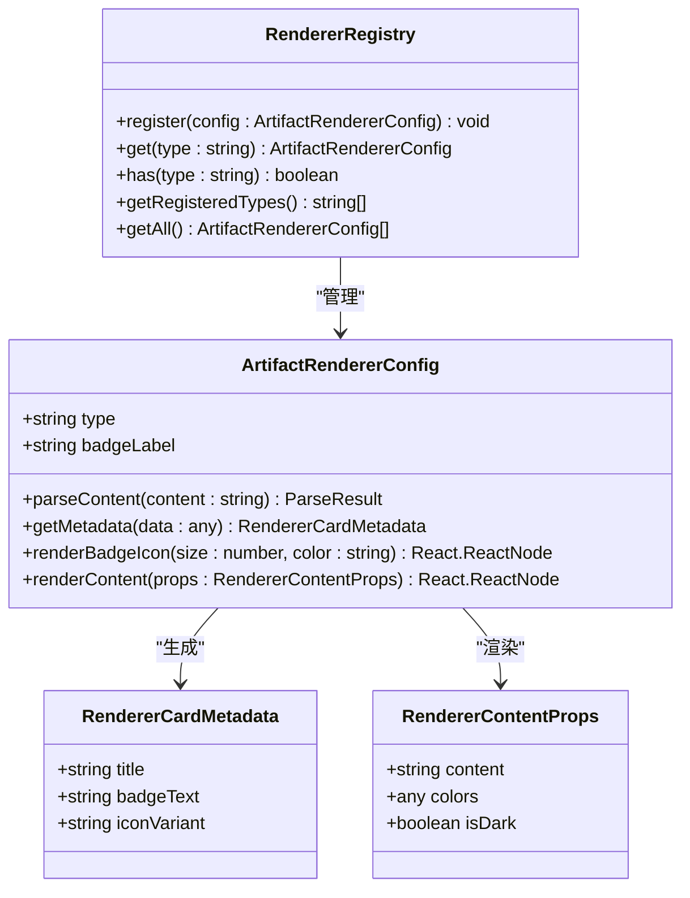

**图表来源**
- [RendererRegistry.ts:10-53](file://src/components/chat/renderers/RendererRegistry.ts#L10-L53)
- [types.ts:17-72](file://src/components/chat/renderers/types.ts#L17-L72)

### 状态管理架构

**更新** 工件状态管理系统移除了工作区相关的索引和过滤逻辑：

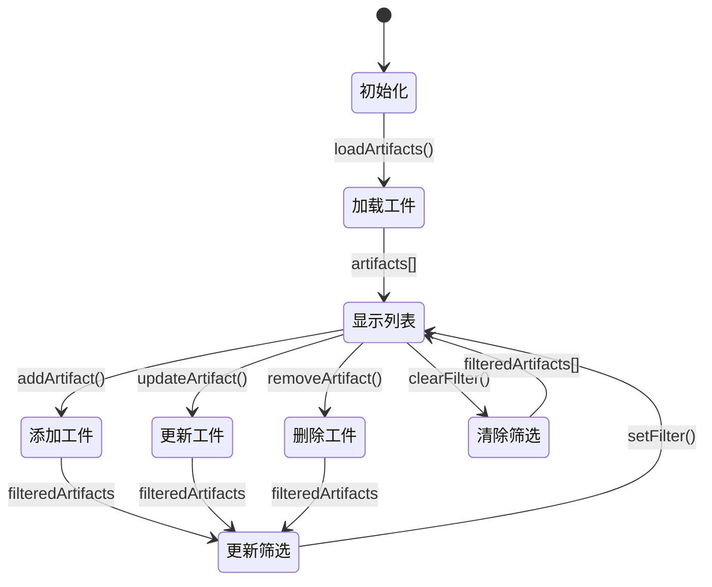

**图表来源**
- [artifact-store.ts:131-342](file://src/store/artifact-store.ts#L131-L342)

**章节来源**
- [artifact.ts:1-45](file://src/types/artifact.ts#L1-L45)
- [artifact-store.ts:1-350](file://src/store/artifact-store.ts#L1-L350)

## 架构概览

**更新** 工件系统已移除工作区集成功能，采用简化的架构设计：

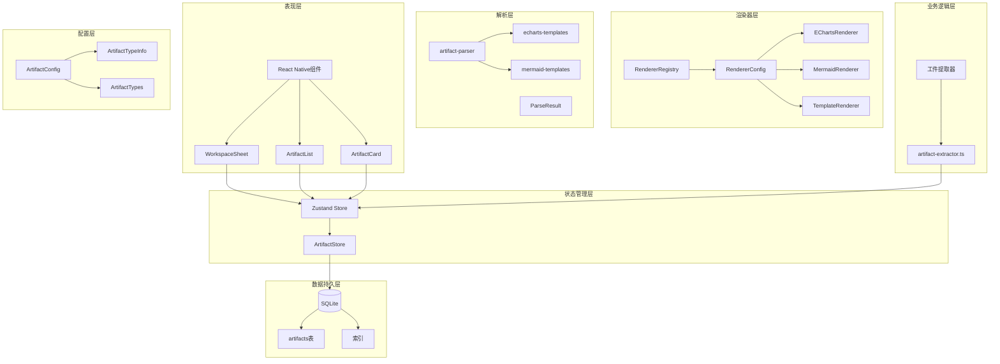

**图表来源**
- [RendererRegistry.ts:1-54](file://src/components/chat/renderers/RendererRegistry.ts#L1-L54)
- [artifact-extractor.ts:1-229](file://src/features/chat/utils/artifact-extractor.ts#L1-L229)
- [artifact-store.ts:131-342](file://src/store/artifact-store.ts#L131-L342)
- [artifact-parser.ts:1-238](file://src/lib/artifact-parser.ts#L1-L238)

## 详细组件分析

### 工件提取器

**更新** 工件提取器保持原有功能，专注于从工具执行结果中提取工件：

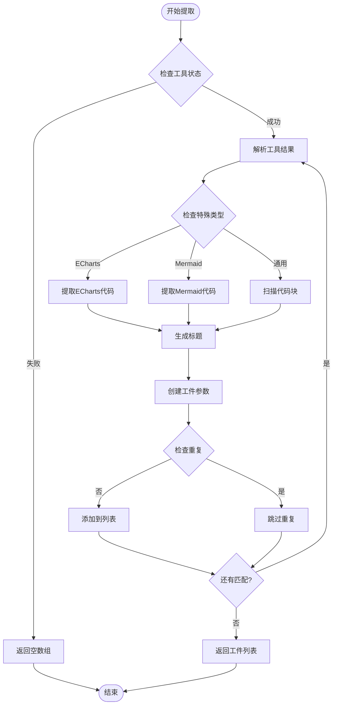

**图表来源**
- [artifact-extractor.ts:157-200](file://src/features/chat/utils/artifact-extractor.ts#L157-L200)

#### 提取算法特点

1. **多格式支持**：支持ECharts、Mermaid、Math、HTML、SVG等多种工件类型
2. **智能标题生成**：根据内容自动提取有意义的标题
3. **去重机制**：避免重复提取相同的工件
4. **错误处理**：提取失败不影响工具执行流程

**章节来源**
- [artifact-extractor.ts:1-229](file://src/features/chat/utils/artifact-extractor.ts#L1-L229)

### 工件解析器

**新增** 工件解析器负责将原始内容解析为结构化数据：

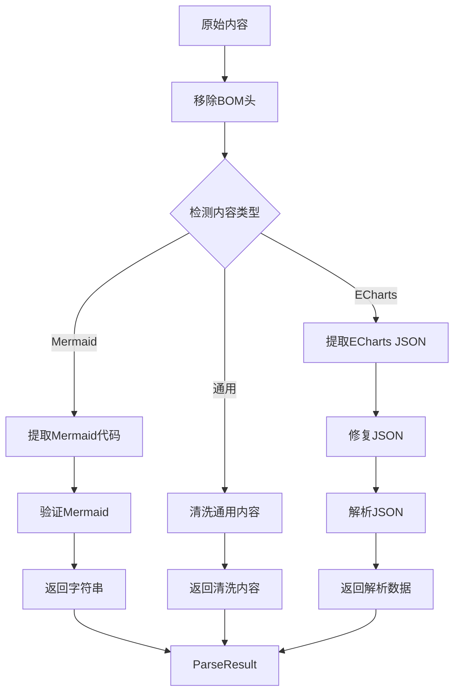

**图表来源**
- [artifact-parser.ts:45-204](file://src/lib/artifact-parser.ts#L45-L204)

#### 解析器特点

1. **类型检测**：自动识别ECharts和Mermaid内容类型
2. **JSON修复**：使用jsonrepair库修复损坏的JSON
3. **内容清洗**：移除代码块标记和BOM头
4. **错误处理**：提供详细的错误信息和回退机制

**章节来源**
- [artifact-parser.ts:1-238](file://src/lib/artifact-parser.ts#L1-L238)

### 渲染器注册表

**新增** 渲染器注册表管理所有工件渲染器配置：

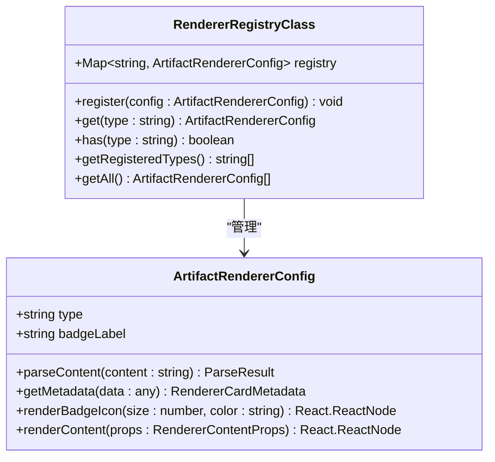

**图表来源**
- [RendererRegistry.ts:10-53](file://src/components/chat/renderers/RendererRegistry.ts#L10-L53)

#### 注册表功能

1. **动态注册**：支持运行时注册新的渲染器配置
2. **类型管理**：维护所有已注册的工件类型
3. **查询接口**：提供便捷的渲染器查询方法
4. **覆盖保护**：防止重复注册相同类型的渲染器

**章节来源**
- [RendererRegistry.ts:1-54](file://src/components/chat/renderers/RendererRegistry.ts#L1-L54)

### ECharts渲染器

**更新** ECharts渲染器实现完整的模板渲染系统：

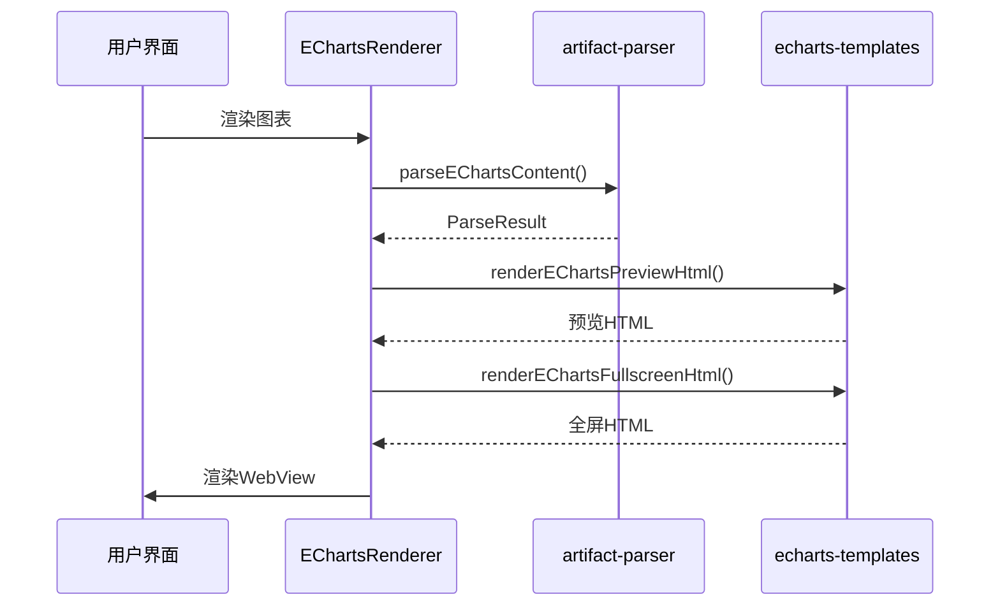

**图表来源**
- [EChartsRenderer.tsx:25-418](file://src/components/chat/EChartsRenderer.tsx#L25-L418)
- [artifact-parser.ts:134-173](file://src/lib/artifact-parser.ts#L134-L173)
- [echarts-templates.ts:16-147](file://src/lib/artifact-templates/echarts-templates.ts#L16-L147)

#### 渲染器特性

1. **模板系统**：使用独立的HTML模板函数
2. **预览模式**：支持缩略预览和全屏交互
3. **主题适配**：自动适配深色和浅色主题
4. **导出功能**：支持HTML格式导出和分享

**章节来源**
- [EChartsRenderer.tsx:1-418](file://src/components/chat/EChartsRenderer.tsx#L1-L418)

### Mermaid渲染器

**更新** Mermaid渲染器同样采用模板渲染架构：

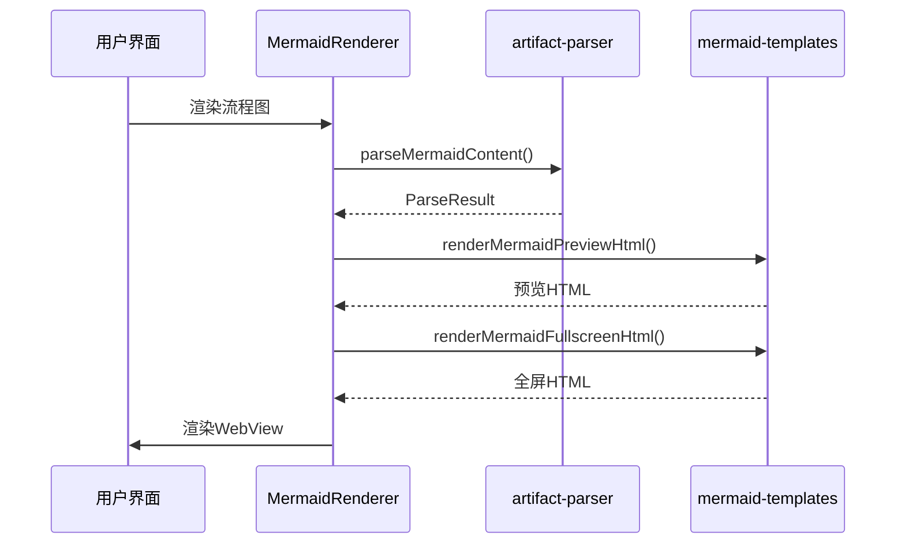

**图表来源**
- [MermaidRenderer.tsx:25-401](file://src/components/chat/MermaidRenderer.tsx#L25-L401)
- [artifact-parser.ts:181-204](file://src/lib/artifact-parser.ts#L181-L204)
- [mermaid-templates.ts:16-192](file://src/lib/artifact-templates/mermaid-templates.ts#L16-L192)

#### 渲染器特性

1. **模板分离**：将HTML模板与渲染逻辑分离
2. **交互增强**：支持全屏模式下的缩放和平移
3. **错误处理**：提供重试机制和错误提示
4. **性能优化**：使用WebView进行高效渲染

**章节来源**
- [MermaidRenderer.tsx:1-401](file://src/components/chat/MermaidRenderer.tsx#L1-L401)

### 工件存储系统

**更新** 工件存储系统已移除工作区路径相关功能：

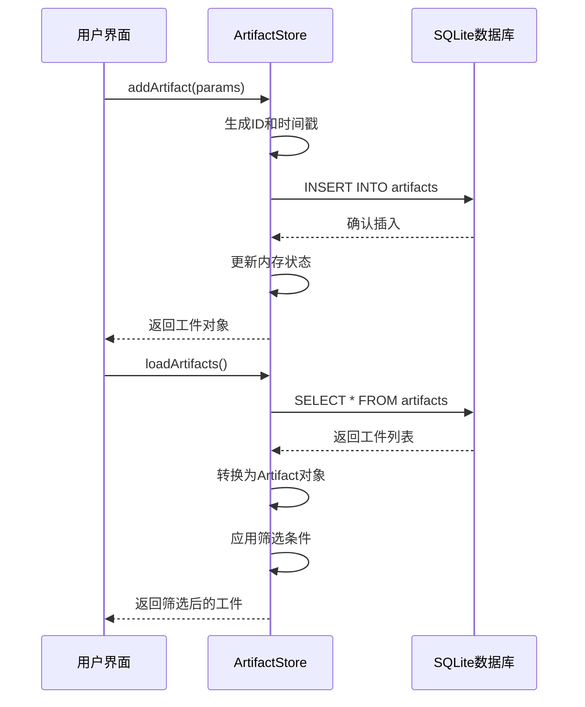

**图表来源**
- [artifact-store.ts:160-206](file://src/store/artifact-store.ts#L160-L206)
- [artifact-store.ts:138-158](file://src/store/artifact-store.ts#L138-L158)

#### 数据库设计

**更新** 工件表结构移除了工作区路径相关字段：

| 字段名 | 类型 | 约束 | 描述 |
|--------|------|------|------|
| id | TEXT | PRIMARY KEY | 工件唯一标识符 |
| type | TEXT | NOT NULL | 工件类型 |
| title | TEXT | NOT NULL | 工件标题 |
| content | TEXT | NOT NULL | 工件内容 |
| preview_image | TEXT |  | 预览图URL |
| session_id | TEXT | NOT NULL, FOREIGN KEY | 关联会话ID |
| message_id | TEXT | NOT NULL | 关联消息ID |
| created_at | INTEGER | NOT NULL | 创建时间戳 |
| updated_at | INTEGER | NOT NULL | 更新时间戳 |
| tags | TEXT |  | 标签JSON数组 |

**章节来源**
- [artifact-store.ts:41-63](file://src/store/artifact-store.ts#L41-L63)

### 工件UI组件

**更新** 工件UI组件移除了工作区相关的筛选和导航功能：

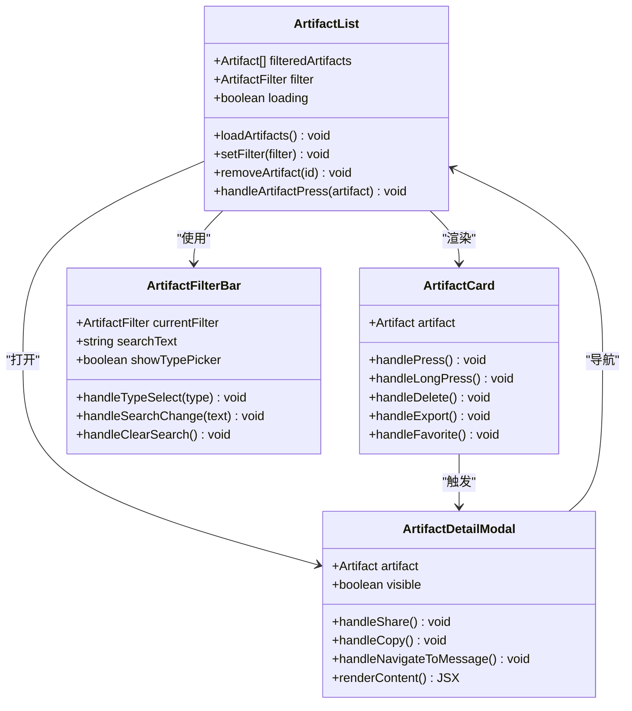

**图表来源**
- [ArtifactList.tsx:25-184](file://src/features/chat/components/WorkspaceSheet/ArtifactList.tsx#L25-L184)
- [ArtifactCard.tsx:66-198](file://src/features/chat/components/WorkspaceSheet/ArtifactCard.tsx#L66-L198)
- [ArtifactDetailModal.tsx:60-285](file://src/features/chat/components/WorkspaceSheet/ArtifactDetailModal.tsx#L60-L285)

#### 交互特性

1. **动画效果**：使用Reanimated实现流畅的过渡动画
2. **手势支持**：支持长按菜单、点击反馈等手势
3. **实时筛选**：支持按类型和关键词实时筛选
4. **收藏功能**：支持工件收藏管理
5. **导出分享**：支持内容复制和分享

**章节来源**
- [ArtifactList.tsx:1-208](file://src/features/chat/components/WorkspaceSheet/ArtifactList.tsx#L1-L208)
- [ArtifactCard.tsx:1-255](file://src/features/chat/components/WorkspaceSheet/ArtifactCard.tsx#L1-L255)
- [ArtifactDetailModal.tsx:1-371](file://src/features/chat/components/WorkspaceSheet/ArtifactDetailModal.tsx#L1-L371)

### 工件类型配置

系统提供了完整的工件类型配置机制：

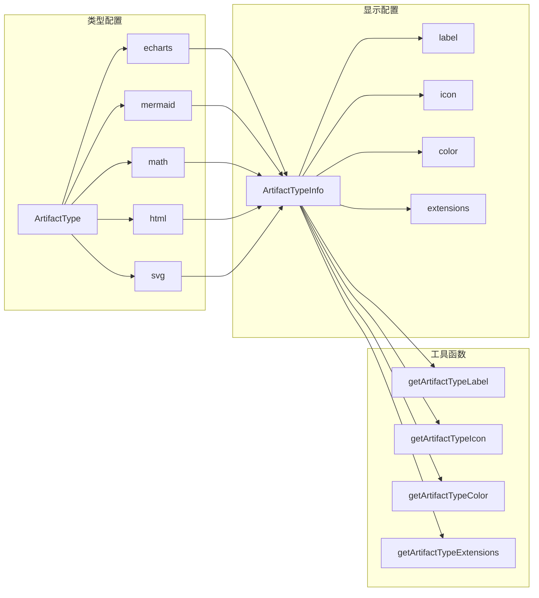

**图表来源**
- [artifact-config.ts:8-78](file://src/constants/artifact-config.ts#L8-L78)

**章节来源**
- [artifact-config.ts:1-78](file://src/constants/artifact-config.ts#L1-L78)

## 依赖关系分析

**更新** 工件系统的依赖关系已简化，移除了工作区相关的外部依赖：

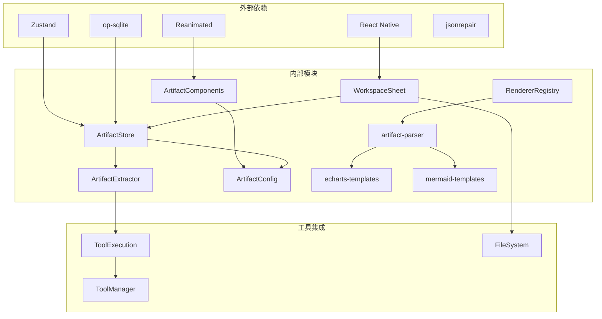

**图表来源**
- [RendererRegistry.ts:8](file://src/components/chat/renderers/RendererRegistry.ts#L8)
- [artifact-parser.ts:11](file://src/lib/artifact-parser.ts#L11)
- [artifact-store.ts:6-14](file://src/store/artifact-store.ts#L6-L14)

### 关键依赖说明

1. **状态管理**：使用Zustand替代Redux，提供更简洁的状态管理
2. **数据库访问**：基于op-sqlite实现高性能的本地存储
3. **动画系统**：使用Reanimated 4实现流畅的用户体验
4. **文件系统**：集成Expo FileSystem处理文件读写
5. **JSON修复**：使用jsonrepair库修复损坏的JSON数据
6. **模板系统**：独立的HTML模板函数便于维护和测试

**章节来源**
- [db/index.ts:1-13](file://src/lib/db/index.ts#L1-L13)

## 性能考虑

**更新** 工件系统在简化架构下充分考虑了性能优化：

### 渲染性能优化
- **模板缓存**：HTML模板函数支持参数化缓存
- **WebView复用**：渲染器内部管理WebView实例复用
- **懒加载**：仅在需要时才加载JavaScript库
- **预览优化**：缩略预览使用轻量级渲染

### 查询优化
- **索引策略**：为session_id、type、created_at建立复合索引
- **懒加载**：工件列表支持分页加载，避免一次性加载大量数据
- **缓存机制**：内存中维护工件列表缓存，减少数据库查询

### 存储优化
- **数据压缩**：工件内容采用压缩存储，节省空间
- **异步操作**：数据库操作采用异步执行，避免阻塞主线程
- **批量处理**：支持批量工件创建和更新操作

### 内存管理
- **虚拟列表**：使用FlatList实现虚拟滚动，只渲染可见项
- **图片缓存**：预览图采用LRU缓存策略
- **垃圾回收**：及时清理不再使用的工件引用

## 故障排除指南

### 常见问题及解决方案

#### 工件提取失败
**问题现象**：工具执行成功但未生成工件
**可能原因**：
- 工具结果格式不符合预期
- 提取正则表达式匹配失败
- 工具执行状态为失败

**解决方法**：
1. 检查工具输出格式是否正确
2. 查看控制台日志中的提取错误信息
3. 验证工件类型映射配置

#### 渲染器注册失败
**问题现象**：新增渲染器类型无法正常工作
**可能原因**：
- 渲染器配置未正确注册到RendererRegistry
- 渲染器类型标识符冲突
- 渲染器接口实现不完整

**解决方法**：
1. 确认渲染器配置已导入并注册
2. 检查类型标识符的唯一性
3. 验证所有必需接口方法的实现

#### 模板渲染错误
**问题现象**：工件内容无法正确渲染
**可能原因**：
- 内容解析失败
- 模板函数参数错误
- WebView加载超时

**解决方法**：
1. 检查artifact-parser的解析结果
2. 验证模板函数的参数传递
3. 查看WebView的错误日志

#### 工件存储异常
**问题现象**：工件无法保存或加载
**可能原因**：
- 数据库连接失败
- SQL语句执行错误
- 网络同步问题

**解决方法**：
1. 检查数据库初始化状态
2. 验证SQL语句语法
3. 查看错误日志获取详细信息

#### UI渲染问题
**问题现象**：工件列表显示异常或卡顿
**可能原因**：
- 组件重新渲染次数过多
- 数据量过大导致性能问题
- 动画效果影响渲染性能

**解决方法**：
1. 使用React.memo优化组件渲染
2. 实施数据分页加载
3. 调整动画参数提升性能

**章节来源**
- [artifact-store.ts:138-158](file://src/store/artifact-store.ts#L138-L158)
- [artifact-extractor.ts:157-200](file://src/features/chat/utils/artifact-extractor.ts#L157-L200)

## 结论

**更新** Nexara的工件系统已成功移除工作区集成功能，回归到简洁高效的纯工件管理架构，具有以下优势：

1. **架构简化**：移除工作区绑定后，系统结构更加清晰
2. **功能专注**：专注于工件的提取、存储、渲染和管理
3. **性能提升**：移除工作区相关逻辑后，系统响应速度更快
4. **维护简便**：代码结构简化，便于后续功能扩展和维护
5. **渲染灵活**：基于模板系统实现可定制的内容渲染
6. **易于使用**：用户界面简洁直观，操作更加便捷

系统通过自动提取、智能存储、模板渲染和友好的用户界面，为用户提供了一站式的工件管理解决方案。新的简化架构不仅提升了系统的性能和稳定性，还为未来的功能增强奠定了坚实的基础。

未来可以进一步优化的方向包括增强工件导出功能、完善标签系统、提升搜索体验和扩展更多工件类型的支持。