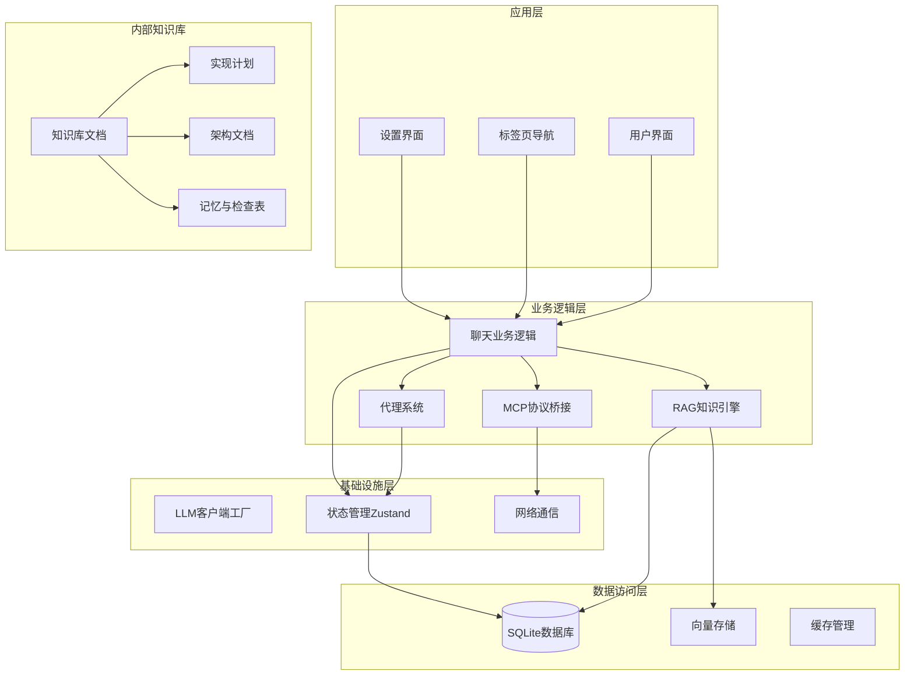
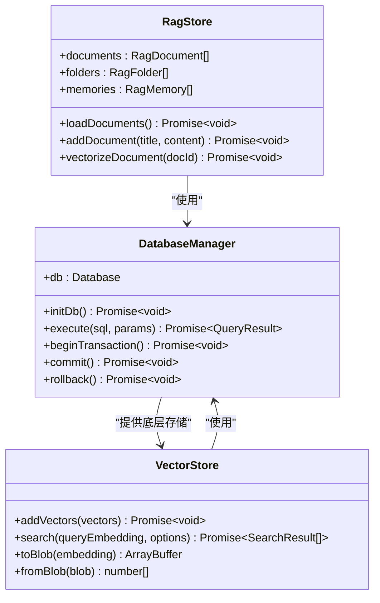
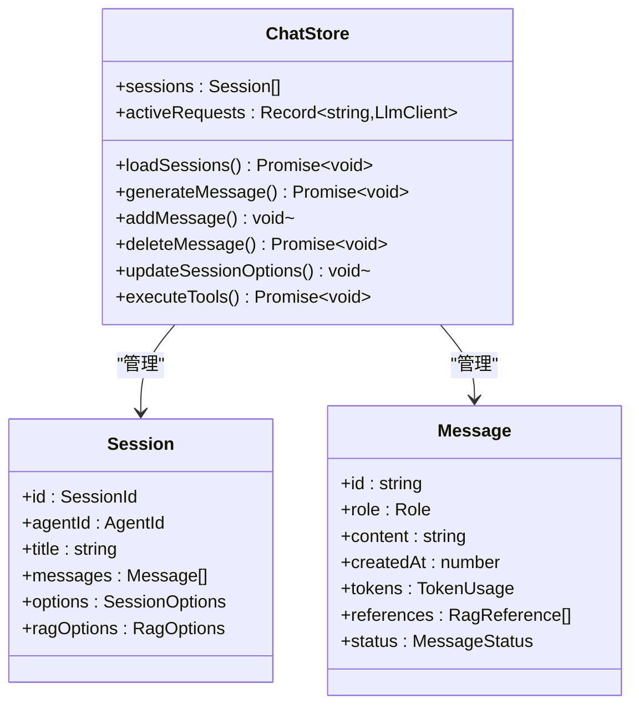
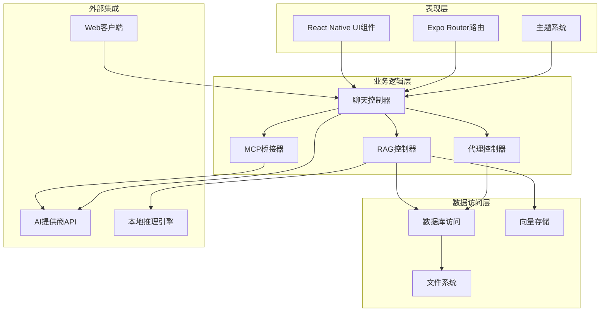
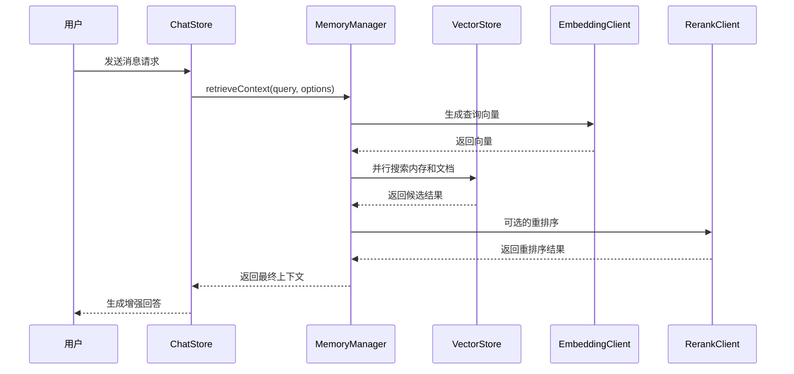
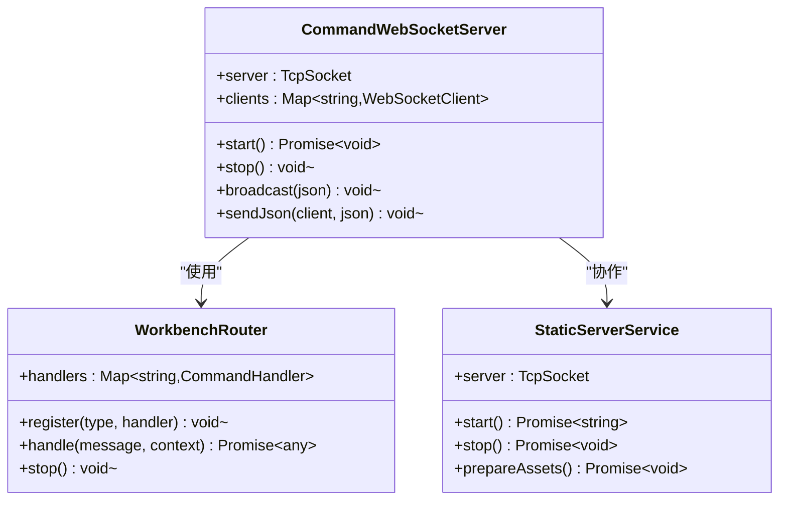
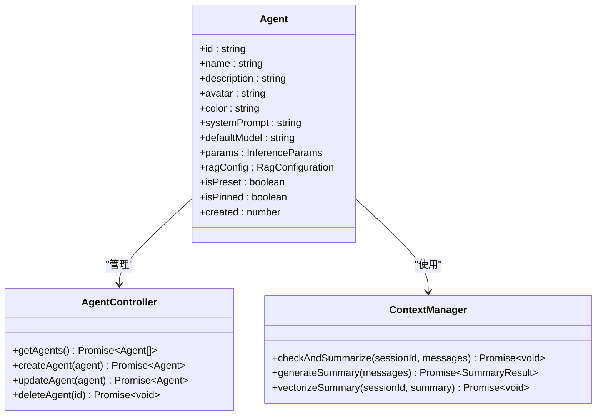
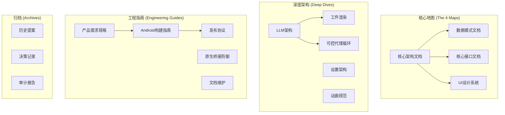
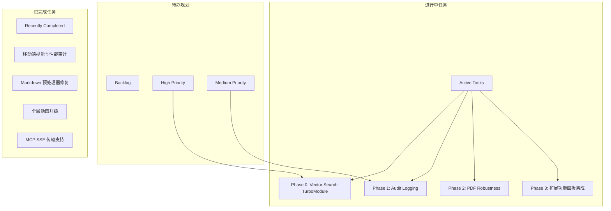
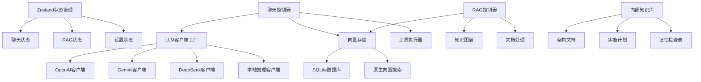

# 知识管理系统

<cite>
**本文档引用的文件**
- [README.md](file://README.md)
- [app/_layout.tsx](file://app/_layout.tsx)
- [app/(tabs)/_layout.tsx](file://app/(tabs)/_layout.tsx)
- [src/store/chat-store.ts](file://src/store/chat-store.ts)
- [src/store/rag-store.ts](file://src/store/rag-store.ts)
- [src/store/settings-store.ts](file://src/store/settings-store.ts)
- [src/lib/db/index.ts](file://src/lib/db/index.ts)
- [src/lib/rag/memory-manager.ts](file://src/lib/rag/memory-manager.ts)
- [src/lib/rag/vector-store.ts](file://src/lib/rag/vector-store.ts)
- [src/lib/rag/graph-store.ts](file://src/lib/rag/graph-store.ts)
- [src/lib/llm/factory.ts](file://src/lib/llm/factory.ts)
- [src/features/chat/utils/ContextManager.ts](file://src/features/chat/utils/ContextManager.ts)
- [src/services/workbench/CommandWebSocketServer.ts](file://src/services/workbench/CommandWebSocketServer.ts)
- [src/services/workbench/WorkbenchRouter.ts](file://src/services/workbench/WorkbenchRouter.ts)
- [src/services/workbench/StaticServerService.ts](file://src/services/workbench/StaticServerService.ts)
- [src/services/workbench/StoreSyncService.ts](file://src/services/workbench/StoreSyncService.ts)
- [src/types/chat.ts](file://src/types/chat.ts)
- [web-client/src/App.tsx](file://web-client/src/App.tsx)
- [.agent/README.md](file://.agent/README.md)
- [.agent/todo.md](file://.agent/todo.md)
- [.agent/docs/CODE_STRUCTURE.md](file://.agent/docs/CODE_STRUCTURE.md)
- [.agent/docs/DATA_SCHEMA.md](file://.agent/docs/DATA_SCHEMA.md)
- [.agent/docs/CORE_INTERFACES.md](file://.agent/docs/CORE_INTERFACES.md)
- [.agent/docs/UI_KIT.md](file://.agent/docs/UI_KIT.md)
- [.agent/docs/architecture/LLM_ARCHITECTURE.md](file://.agent/docs/architecture/LLM_ARCHITECTURE.md)
- [.agent/docs/architecture/ARTIFACT_RENDERING.md](file://.agent/docs/architecture/ARTIFACT_RENDERING.md)
- [.agent/docs/architecture/STEERABLE_LOOP.md](file://.agent/docs/architecture/STEERABLE_LOOP.md)
- [.agent/docs/plans/nexara-architecture-optimization-v3.md](file://.agent/docs/plans/nexara-architecture-optimization-v3.md)
- [.agent/docs/plans/vector-search-turbomodule-plan.md](file://.agent/docs/plans/vector-search-turbomodule-plan.md)
- [.agent/docs/ANDROID_BUILD_GUIDE.md](file://.agent/docs/ANDROID_BUILD_GUIDE.md)
- [.agent/docs/RELEASE_PROTOCOL.md](file://.agent/docs/RELEASE_PROTOCOL.md)
</cite>

## 更新摘要
**所做更改**
- 新增基于 .agent/ 目录的完整内部知识库架构文档体系
- 更新知识库管理系统的文档结构和内容组织方式
- 增加架构文档、实现计划、性能优化等多个维度的文档体系
- 完善知识库的版本控制和维护流程

## 目录
1. [简介](#简介)
2. [项目结构](#项目结构)
3. [核心组件](#核心组件)
4. [架构概览](#架构概览)
5. [详细组件分析](#详细组件分析)
6. [内部知识库架构](#内部知识库架构)
7. [依赖关系分析](#依赖关系分析)
8. [性能考量](#性能考量)
9. [故障排除指南](#故障排除指南)
10. [结论](#结论)

## 简介

Nexara 是一个基于 React Native 的 Android AI 助手客户端，专注于本地优先的数据管理和多提供商模型接入。该系统实现了完整的知识管理系统，包括：

- **多提供商聊天**：支持 OpenAI、Anthropic、Gemini、Vertex AI、DeepSeek、Moonshot、智谱、SiliconFlow、GitHub Copilot、Cloudflare 等 12+ 个 AI 服务商
- **RAG 知识引擎**：基于 SQLite + FTS5 的内置向量库，支持文档导入、分块向量化、上下文检索
- **智能代理系统**：预设代理和自定义代理，支持配置化的系统提示词和模型绑定
- **MCP 协议支持**：通过 SSE 或 HTTP 传输连接外部 MCP 服务器
- **本地推理**：通过 llama.rn 在设备端运行 GGUF 模型
- **Workbench 实验性功能**：内置 WebSocket 和静态文件服务器，提供配套 Web 管理面板
- **内部知识库系统**：基于 .agent/ 目录的完整文档体系，包括架构文档、实现计划、性能优化等多个维度

## 项目结构

项目采用模块化架构设计，主要分为以下几个层次：

**图表来源**
- [app/_layout.tsx:1-191](file://app/_layout.tsx#L1-L191)
- [app/(tabs)/_layout.tsx:1-61](file://app/(tabs)/_layout.tsx#L1-L61)
- [.agent/README.md:1-51](file://.agent/README.md#L1-L51)

**章节来源**
- [README.md:1-161](file://README.md#L1-L161)
- [app/_layout.tsx:1-191](file://app/_layout.tsx#L1-L191)
- [.agent/README.md:1-51](file://.agent/README.md#L1-L51)

## 核心组件

### 数据库系统

系统使用 op-sqlite 作为核心数据库，支持 WAL 模式和外键约束：

**图表来源**
- [src/lib/db/index.ts:1-13](file://src/lib/db/index.ts#L1-L13)
- [src/lib/rag/vector-store.ts:1-200](file://src/lib/rag/vector-store.ts#L1-L200)
- [src/store/rag-store.ts:1-800](file://src/store/rag-store.ts#L1-L800)

### 聊天状态管理

使用 Zustand 实现高性能的状态管理：

**图表来源**
- [src/store/chat-store.ts:1-800](file://src/store/chat-store.ts#L1-L800)
- [src/types/chat.ts:135-200](file://src/types/chat.ts#L135-L200)

**章节来源**
- [src/store/chat-store.ts:1-800](file://src/store/chat-store.ts#L1-L800)
- [src/store/rag-store.ts:1-800](file://src/store/rag-store.ts#L1-L800)
- [src/store/settings-store.ts:1-244](file://src/store/settings-store.ts#L1-L244)

## 架构概览

系统采用分层架构设计，实现了清晰的关注点分离：

**图表来源**
- [app/_layout.tsx:82-191](file://app/_layout.tsx#L82-L191)
- [src/services/workbench/CommandWebSocketServer.ts:1-488](file://src/services/workbench/CommandWebSocketServer.ts#L1-L488)

## 详细组件分析

### RAG 知识引擎

RAG 引擎是系统的核心组件，实现了完整的检索增强生成流程：

**图表来源**
- [src/lib/rag/memory-manager.ts:1-800](file://src/lib/rag/memory-manager.ts#L1-L800)
- [src/lib/rag/vector-store.ts:62-200](file://src/lib/rag/vector-store.ts#L62-L200)

#### 检索流程优化

系统实现了多种检索优化策略：

1. **并行搜索**：同时执行记忆搜索和文档搜索
2. **混合检索**：结合向量相似度和关键词搜索
3. **重排序机制**：使用重排序模型提升相关性
4. **增量处理**：支持增量向量化和知识图谱提取

**章节来源**
- [src/lib/rag/memory-manager.ts:120-712](file://src/lib/rag/memory-manager.ts#L120-L712)
- [src/lib/rag/vector-store.ts:62-200](file://src/lib/rag/vector-store.ts#L62-L200)

### Workbench 服务器

Workbench 提供了完整的远程管理功能：

**图表来源**
- [src/services/workbench/CommandWebSocketServer.ts:33-488](file://src/services/workbench/CommandWebSocketServer.ts#L33-L488)
- [src/services/workbench/WorkbenchRouter.ts:18-75](file://src/services/workbench/WorkbenchRouter.ts#L18-L75)
- [src/services/workbench/StaticServerService.ts:21-301](file://src/services/workbench/StaticServerService.ts#L21-L301)

**章节来源**
- [src/services/workbench/CommandWebSocketServer.ts:1-488](file://src/services/workbench/CommandWebSocketServer.ts#L1-L488)
- [src/services/workbench/WorkbenchRouter.ts:1-75](file://src/services/workbench/WorkbenchRouter.ts#L1-L75)
- [src/services/workbench/StaticServerService.ts:1-301](file://src/services/workbench/StaticServerService.ts#L1-L301)

### 代理系统

系统支持预设代理和自定义代理：

**图表来源**
- [src/types/chat.ts:15-36](file://src/types/chat.ts#L15-L36)
- [src/features/chat/utils/ContextManager.ts:28-482](file://src/features/chat/utils/ContextManager.ts#L28-L482)

**章节来源**
- [src/types/chat.ts:1-200](file://src/types/chat.ts#L1-L200)
- [src/features/chat/utils/ContextManager.ts:1-482](file://src/features/chat/utils/ContextManager.ts#L1-L482)

## 内部知识库架构

### 知识库核心地图

基于 .agent/ 目录建立了完整的知识库架构，包含四大核心地图：

**图表来源**
- [.agent/README.md:9-46](file://.agent/README.md#L9-L46)

### 文档分类体系

知识库采用严格的文档分类和版本控制机制：

#### 核心架构文档
- **CODE_STRUCTURE.md**：项目目录结构映射和开发规范
- **DATA_SCHEMA.md**：数据模式与核心类型定义
- **CORE_INTERFACES.md**：服务契约和接口定义
- **UI_KIT.md**：设计系统和组件规范

#### 深度架构文档
- **LLM_ARCHITECTURE.md**：LLM抽象层完整架构指引
- **ARTIFACT_RENDERING.md**：工件渲染架构 (v2)
- **STEERABLE_LOOP.md**：可控代理循环架构
- **SETTINGS_ARCHITECTURE.md**：四层设置面板架构
- **ANIMATION_SPECS.md**：移动端过渡动画规范

#### 工程指南文档
- **PRODUCT_REQUIREMENTS.md**：产品需求规格 (PRD)
- **ANDROID_BUILD_GUIDE.md**：Android 构建指南
- **RELEASE_PROTOCOL.md**：发布流程协议
- **NATIVE_BRIDGE_DEFENSE.md**：原生桥接防御指南
- **DOCS_MAINTENANCE.md**：文档维护工作流

#### 归档文档
包含历史提案、决策记录 (ADR) 与旧版审计报告。

**章节来源**
- [.agent/README.md:1-51](file://.agent/README.md#L1-L51)
- [.agent/docs/CODE_STRUCTURE.md:1-57](file://.agent/docs/CODE_STRUCTURE.md#L1-L57)
- [.agent/docs/DATA_SCHEMA.md:1-82](file://.agent/docs/DATA_SCHEMA.md#L1-L82)
- [.agent/docs/CORE_INTERFACES.md:1-230](file://.agent/docs/CORE_INTERFACES.md#L1-L230)
- [.agent/docs/UI_KIT.md:1-123](file://.agent/docs/UI_KIT.md#L1-L123)

### 实施计划体系

基于 .agent/docs/plans/ 目录建立了完整的实施计划体系：

#### 主要实施计划
- **nexara-architecture-optimization-v3.md**：架构优化实施方案 (v3)
- **vector-search-turbomodule-plan.md**：Vector Search TurboModule 实施方案
- 各种功能实现计划和开发日志

#### 任务管理系统
基于 .agent/todo.md 建立了完整的项目仪表盘：

**图表来源**
- [.agent/todo.md:8-67](file://.agent/todo.md#L8-L67)

**章节来源**
- [.agent/todo.md:1-67](file://.agent/todo.md#L1-L67)
- [.agent/docs/plans/nexara-architecture-optimization-v3.md:1-232](file://.agent/docs/plans/nexara-architecture-optimization-v3.md#L1-L232)
- [.agent/docs/plans/vector-search-turbomodule-plan.md:1-787](file://.agent/docs/plans/vector-search-turbomodule-plan.md#L1-L787)

### 记忆与检查表系统

基于 .agent/memory/ 和 .agent/checklists/ 目录建立了知识传承和质量保证体系：

#### 会话交接指南
- **SESSION_HANDOVER.md**：详细的会话交接流程和注意事项

#### 测试检查表
- **TESTING_GUIDE.md**：全面的测试覆盖检查表和质量标准

#### 开发工作流
- **reconstruct-worktree.md**：Git 工作树重建和版本管理流程
- **build-android-release.md**：Android 发布构建标准流程

**章节来源**
- [.agent/memory/SESSION_HANDOVER.md](file://.agent/memory/SESSION_HANDOVER.md)
- [.agent/memory/TESTING_GUIDE.md](file://.agent/memory/TESTING_GUIDE.md)
- [.agent/checklists/](file://.agent/checklists/)
- [.agent/workflows/](file://.agent/workflows/)

## 依赖关系分析

系统采用了现代化的依赖注入和模块化设计：

**图表来源**
- [src/lib/llm/factory.ts:23-97](file://src/lib/llm/factory.ts#L23-L97)
- [src/lib/rag/vector-store.ts:22-200](file://src/lib/rag/vector-store.ts#L22-L200)
- [src/store/chat-store.ts:212-360](file://src/store/chat-store.ts#L212-L360)
- [.agent/README.md:9-46](file://.agent/README.md#L9-L46)

**章节来源**
- [src/lib/llm/factory.ts:1-97](file://src/lib/llm/factory.ts#L1-L97)
- [src/store/chat-store.ts:1-800](file://src/store/chat-store.ts#L1-L800)

## 性能考量

系统在多个层面实现了性能优化：

### 内存管理
- 使用分页加载机制，避免一次性加载大量历史消息
- 智能的向量存储和清理策略
- 增量摘要生成，减少重复计算

### 网络优化
- 并行执行多个检索任务
- 智能的超时和重试机制
- 流式响应处理

### 存储优化
- WAL 模式提升并发性能
- 原生向量搜索加速
- 智能的缓存策略

### 知识库性能优化
基于 .agent/docs/plans/nexara-architecture-optimization-v3.md 的 Vector Search TurboModule 实现：

#### TurboModule 性能提升
- **当前性能**：向量数量 5000 时耗时 ~500ms
- **目标性能**：向量数量 5000 时耗时 ~60ms
- **性能提升**：约 8x 性能提升

#### 技术实现
- **JSI 零拷贝**：避免 JSON 序列化开销
- **并行计算**：OpenMP 多线程支持
- **原生实现**：C++ 实现相似度计算
- **自动降级**：JS 实现作为降级方案

**章节来源**
- [.agent/docs/plans/nexara-architecture-optimization-v3.md:65-73](file://.agent/docs/plans/nexara-architecture-optimization-v3.md#L65-L73)
- [.agent/docs/plans/vector-search-turbomodule-plan.md:22-44](file://.agent/docs/plans/vector-search-turbomodule-plan.md#L22-L44)

## 故障排除指南

### 常见问题及解决方案

1. **数据库初始化失败**
   - 检查 SQLite 权限设置
   - 验证数据库文件完整性
   - 查看初始化日志输出

2. **RAG 检索超时**
   - 检查网络连接状态
   - 验证嵌入模型配置
   - 调整检索参数设置

3. **Workbench 连接问题**
   - 确认端口 3000 和 3001 未被占用
   - 检查防火墙设置
   - 验证本地 IP 地址获取

4. **知识库文档更新问题**
   - 确认文档版本号同步
   - 验证核心类型定义一致性
   - 检查接口契约更新

5. **Vector Search TurboModule 编译问题**
   - 确认 React Native New Architecture 已启用
   - 检查 C++17 标准支持
   - 验证 OpenMP 兼容性

**章节来源**
- [app/_layout.tsx:87-137](file://app/_layout.tsx#L87-L137)
- [src/services/workbench/CommandWebSocketServer.ts:108-132](file://src/services/workbench/CommandWebSocketServer.ts#L108-L132)
- [.agent/docs/ANDROID_BUILD_GUIDE.md:1-155](file://.agent/docs/ANDROID_BUILD_GUIDE.md#L1-L155)

## 结论

Nexara 知识管理系统展现了现代移动 AI 应用的优秀架构实践。系统通过以下关键特性实现了卓越的用户体验：

- **本地优先**：所有数据存储在设备本地，确保隐私安全
- **多提供商支持**：灵活的提供商集成，支持 12+ 个 AI 服务商
- **智能检索**：完整的 RAG 管道，支持混合检索和重排序
- **可扩展性**：模块化设计，易于扩展新功能
- **性能优化**：多层次的性能优化策略
- **知识库系统**：基于 .agent/ 目录的完整内部知识库架构，包括架构文档、实现计划、性能优化等多个维度的文档体系

**更新** 系统现已建立完整的内部知识库架构，实现了文档的版本控制、维护流程和质量保证，为项目的长期发展奠定了坚实的文档基础。

该系统为构建企业级知识管理应用提供了坚实的技术基础，特别是在本地数据处理和多模型集成方面展现了强大的技术实力。通过内部知识库系统的建立，项目实现了更好的知识传承、质量控制和团队协作效率。