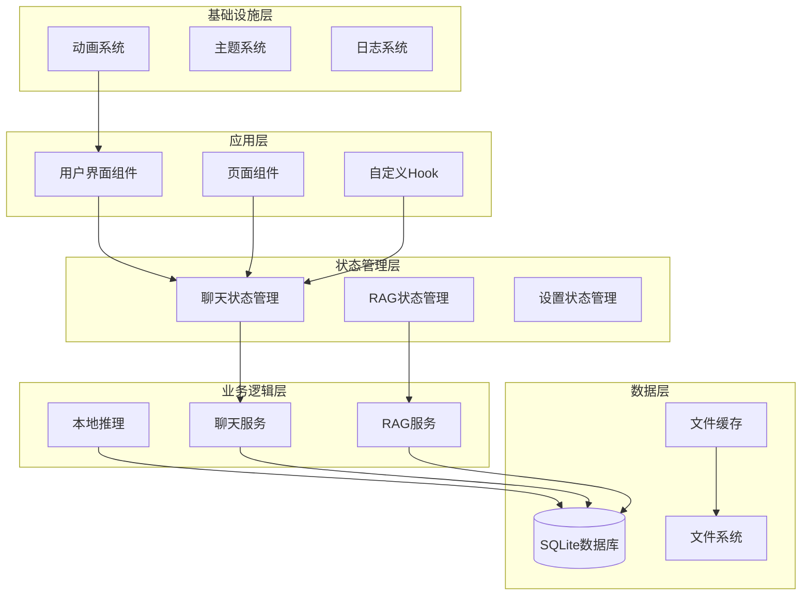
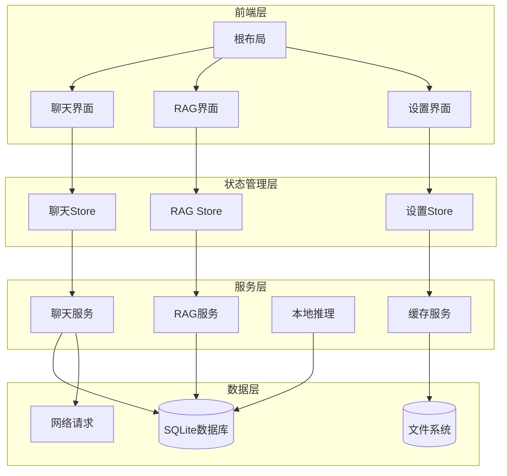
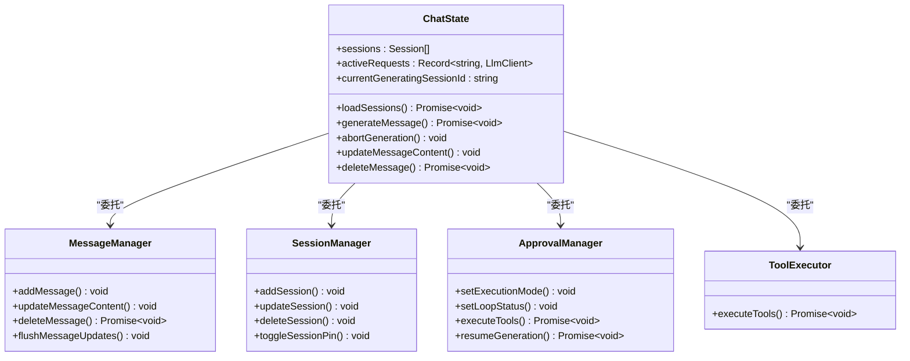
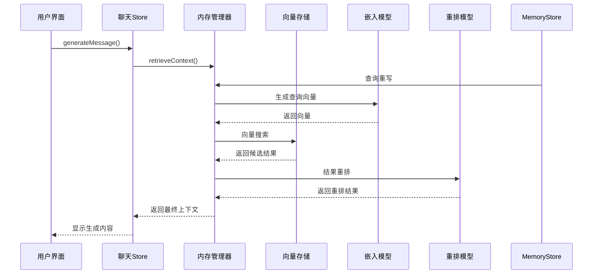
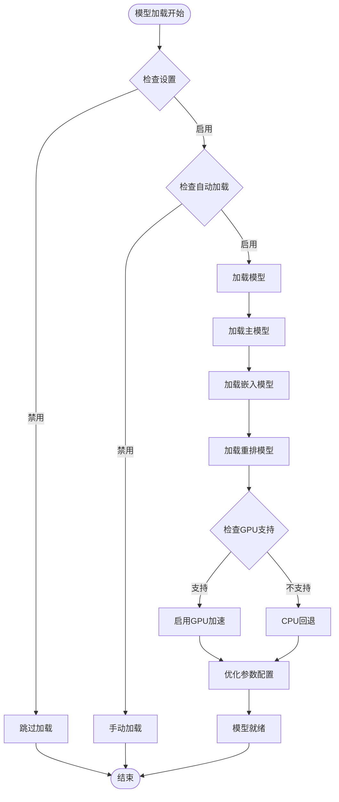
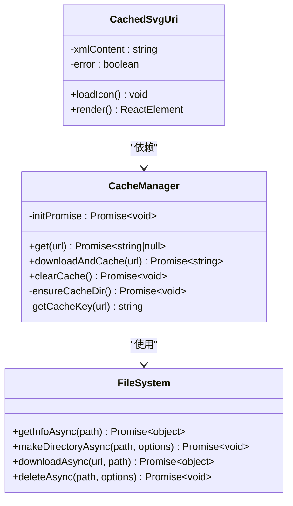

# 移动端性能优化

<cite>
**本文档引用的文件**
- [README.md](file://README.md)
- [package.json](file://package.json)
- [app/_layout.tsx](file://app/_layout.tsx)
- [src/store/chat-store.ts](file://src/store/chat-store.ts)
- [src/features/chat/hooks/useChat.ts](file://src/features/chat/hooks/useChat.ts)
- [src/lib/cache/cache-manager.ts](file://src/lib/cache/cache-manager.ts)
- [src/components/ui/CachedSvgUri.tsx](file://src/components/ui/CachedSvgUri.tsx)
- [src/features/chat/components/message/MessageRow.tsx](file://src/features/chat/components/message/MessageRow.tsx)
- [src/lib/db/index.ts](file://src/lib/db/index.ts)
- [src/lib/local-inference/LocalModelServer.ts](file://src/lib/local-inference/LocalModelServer.ts)
- [src/lib/rag/memory-manager.ts](file://src/lib/rag/memory-manager.ts)
- [src/store/rag-store.ts](file://src/store/rag-store.ts)
- [src/theme/animations.ts](file://src/theme/animations.ts)
- [metro.config.js](file://metro.config.js)
- [plugins/withArm64Only.js](file://plugins/withArm64Only.js)
- [scripts/disable_r8.js](file://scripts/disable_r8.js)
</cite>

## 目录
1. [简介](#简介)
2. [项目结构](#项目结构)
3. [核心组件](#核心组件)
4. [架构概览](#架构概览)
5. [详细组件分析](#详细组件分析)
6. [依赖分析](#依赖分析)
7. [性能考量](#性能考量)
8. [故障排除指南](#故障排除指南)
9. [结论](#结论)

## 简介
本项目是一个基于 React Native 和 Expo 的 Android AI 助手客户端，专注于本地优先的数据管理和多提供商模型访问。项目采用多种性能优化策略，包括数据库优化、缓存机制、动画优化、构建配置优化等，旨在提供流畅的移动端用户体验。

## 项目结构
项目采用模块化的架构设计，主要分为以下几个层次：



**图表来源**
- [app/_layout.tsx:82-191](file://app/_layout.tsx#L82-L191)
- [src/store/chat-store.ts:212-360](file://src/store/chat-store.ts#L212-L360)
- [src/store/rag-store.ts:147-200](file://src/store/rag-store.ts#L147-L200)

**章节来源**
- [README.md:10-61](file://README.md#L10-L61)
- [package.json:14-96](file://package.json#L14-L96)

## 核心组件
项目的核心性能优化组件包括：

### 数据库优化
- **WAL模式启用**：通过预创建数据库连接并启用WAL模式提升并发性能
- **索引优化**：使用FTS5全文搜索引擎和向量存储优化查询性能
- **分页加载**：聊天消息采用按需分页加载，减少内存占用

### 缓存系统
- **SVG图标缓存**：本地文件系统缓存远程SVG资源，避免重复下载
- **文件缓存管理**：统一的缓存目录管理，支持缓存清理

### 动画优化
- **Reanimated集成**：使用高性能的Reanimated 4进行动画渲染
- **动画配置优化**：针对不同场景的动画配置，平衡视觉效果和性能

**章节来源**
- [src/lib/db/index.ts:1-13](file://src/lib/db/index.ts#L1-L13)
- [src/lib/cache/cache-manager.ts:11-116](file://src/lib/cache/cache-manager.ts#L11-L116)
- [src/theme/animations.ts:1-76](file://src/theme/animations.ts#L1-L76)

## 架构概览



**图表来源**
- [app/_layout.tsx:154-191](file://app/_layout.tsx#L154-L191)
- [src/store/chat-store.ts:212-240](file://src/store/chat-store.ts#L212-L240)
- [src/store/rag-store.ts:147-170](file://src/store/rag-store.ts#L147-L170)

## 详细组件分析

### 聊天状态管理系统



**图表来源**
- [src/store/chat-store.ts:108-210](file://src/store/chat-store.ts#L108-L210)
- [src/store/chat-store.ts:214-220](file://src/store/chat-store.ts#L214-L220)

聊天状态管理采用了模块化的设计模式，将不同的职责分离到专门的管理器中：

**章节来源**
- [src/store/chat-store.ts:212-360](file://src/store/chat-store.ts#L212-L360)
- [src/features/chat/hooks/useChat.ts:1-117](file://src/features/chat/hooks/useChat.ts#L1-L117)

### RAG检索系统



**图表来源**
- [src/lib/rag/memory-manager.ts:11-80](file://src/lib/rag/memory-manager.ts#L11-L80)
- [src/store/chat-store.ts:617-733](file://src/store/chat-store.ts#L617-L733)

RAG检索系统实现了多阶段的优化策略：

**章节来源**
- [src/lib/rag/memory-manager.ts:120-187](file://src/lib/rag/memory-manager.ts#L120-L187)
- [src/lib/rag/memory-manager.ts:263-350](file://src/lib/rag/memory-manager.ts#L263-L350)

### 本地推理优化



**图表来源**
- [src/lib/local-inference/LocalModelServer.ts:103-159](file://src/lib/local-inference/LocalModelServer.ts#L103-L159)
- [src/lib/local-inference/LocalModelServer.ts:180-236](file://src/lib/local-inference/LocalModelServer.ts#L180-L236)

本地推理系统采用了多项优化策略：

**章节来源**
- [src/lib/local-inference/LocalModelServer.ts:161-236](file://src/lib/local-inference/LocalModelServer.ts#L161-L236)
- [src/lib/local-inference/LocalModelServer.ts:238-335](file://src/lib/local-inference/LocalModelServer.ts#L238-L335)

### 缓存系统



**图表来源**
- [src/lib/cache/cache-manager.ts:11-116](file://src/lib/cache/cache-manager.ts#L11-L116)
- [src/components/ui/CachedSvgUri.tsx:22-99](file://src/components/ui/CachedSvgUri.tsx#L22-L99)

缓存系统提供了多层保护机制：

**章节来源**
- [src/lib/cache/cache-manager.ts:60-102](file://src/lib/cache/cache-manager.ts#L60-L102)
- [src/components/ui/CachedSvgUri.tsx:29-75](file://src/components/ui/CachedSvgUri.tsx#L29-L75)

## 依赖分析

```mermaid
graph LR
subgraph "核心依赖"
RN[React Native 0.81.5]
Expo[Expo SDK 54]
Zustand[Zustand 5.0.9]
SQLite[@op-engineering/op-sqlite 15.1.14]
end
subgraph "动画系统"
Reanimated[react-native-reanimated 4.1.6]
NativeWind[nativewind 4.2.1]
end
subgraph "AI推理"
LlamaRN[llama.rn 0.10.0]
LlamaCpp[llama.cpp]
end
subgraph "UI组件"
Skia[@shopify/react-native-skia 2.2.12]
FlashList[@shopify/flash-list 2.0.2]
Icons[lucide-react-native 0.562.0]
end
RN --> Zustand
RN --> SQLite
RN --> Reanimated
RN --> NativeWind
RN --> LlamaRN
LlamaRN --> LlamaCpp
RN --> Skia
RN --> FlashList
```

**图表来源**
- [package.json:14-96](file://package.json#L14-L96)

**章节来源**
- [package.json:14-96](file://package.json#L14-L96)

## 性能考量

### 数据库性能优化
- **WAL模式**：启用预写日志(WAL)模式提升并发读写性能
- **外键约束**：启用外键约束保证数据完整性
- **分页加载**：聊天消息采用分页加载策略，避免一次性加载大量数据

### 内存管理
- **状态分离**：将聊天状态分为会话元数据和消息内容，支持按需加载
- **组件优化**：使用React.memo优化消息组件渲染
- **动画优化**：使用Reanimated 4进行硬件加速的动画渲染

### 网络优化
- **缓存策略**：SVG图标本地缓存，减少网络请求
- **超时控制**：RAG检索设置30秒超时，防止UI冻结
- **并行处理**：向量搜索和关键词搜索并行执行

### 构建优化
- **架构限制**：仅支持ARM64架构，减少APK体积约50%
- **代码压缩**：禁用R8混淆，提高构建稳定性
- **Metro配置**：优化打包配置，支持NativeWind样式

**章节来源**
- [src/lib/db/index.ts:7-12](file://src/lib/db/index.ts#L7-L12)
- [src/features/chat/components/message/MessageRow.tsx:40-130](file://src/features/chat/components/message/MessageRow.tsx#L40-L130)
- [src/lib/rag/memory-manager.ts:665-680](file://src/lib/rag/memory-manager.ts#L665-L680)
- [plugins/withArm64Only.js:7-52](file://plugins/withArm64Only.js#L7-L52)
- [scripts/disable_r8.js:1-83](file://scripts/disable_r8.js#L1-L83)

## 故障排除指南

### 常见性能问题及解决方案

**启动缓慢问题**
- 检查数据库初始化是否在主线程执行
- 确认缓存目录是否正确创建
- 验证本地模型是否正确加载

**内存泄漏问题**
- 确保Reanimated动画正确清理
- 检查图片资源是否正确释放
- 验证文件监听器是否及时注销

**RAG检索超时**
- 检查网络连接状态
- 验证嵌入模型配置
- 确认向量数据库是否正常

**章节来源**
- [app/_layout.tsx:87-137](file://app/_layout.tsx#L87-L137)
- [src/lib/local-inference/LocalModelServer.ts:231-235](file://src/lib/local-inference/LocalModelServer.ts#L231-L235)
- [src/lib/rag/memory-manager.ts:159-183](file://src/lib/rag/memory-manager.ts#L159-L183)

## 结论
本项目通过多层次的性能优化策略，在保证功能完整性的同时，显著提升了移动端的运行效率和用户体验。主要优化措施包括：

1. **数据库优化**：WAL模式、索引优化、分页加载
2. **缓存系统**：本地文件缓存、SVG图标缓存
3. **动画优化**：Reanimated硬件加速、动画配置优化
4. **构建优化**：架构限制、代码压缩、Metro配置
5. **内存管理**：状态分离、组件优化、资源释放

这些优化措施共同作用，为用户提供了流畅、稳定的移动端AI助手体验。建议在后续开发中继续关注性能监控和持续优化，以适应不断增长的用户需求和数据规模。