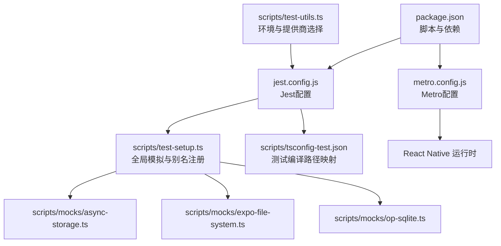
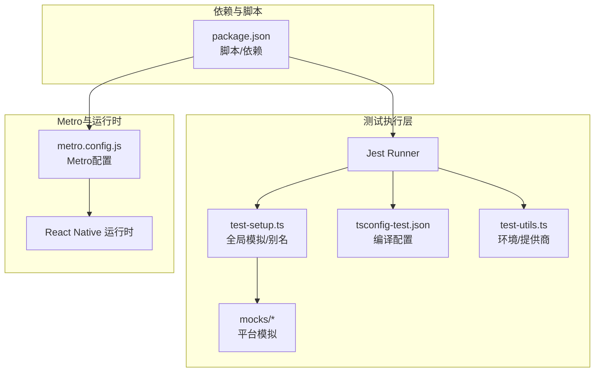
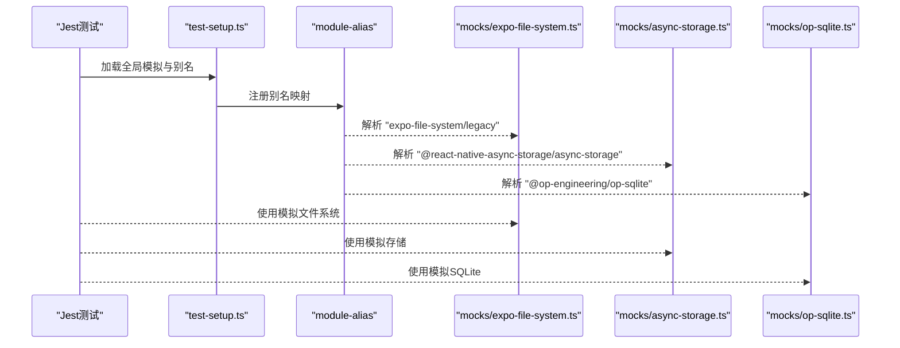
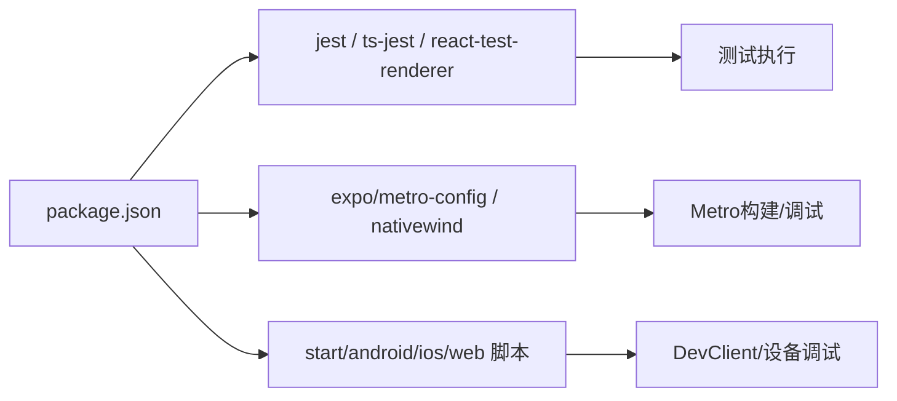

# 调试与测试

<cite>
**本文引用的文件**
- [jest.config.js](file://jest.config.js)
- [metro.config.js](file://metro.config.js)
- [package.json](file://package.json)
- [scripts/test-setup.ts](file://scripts/test-setup.ts)
- [scripts/tsconfig-test.json](file://scripts/tsconfig-test.json)
- [scripts/mocks/async-storage.ts](file://scripts/mocks/async-storage.ts)
- [scripts/mocks/expo-file-system.ts](file://scripts/mocks/expo-file-system.ts)
- [scripts/mocks/op-sqlite.ts](file://scripts/mocks/op-sqlite.ts)
- [scripts/test-utils.ts](file://scripts/test-utils.ts)
</cite>

## 目录
1. [简介](#简介)
2. [项目结构](#项目结构)
3. [核心组件](#核心组件)
4. [架构总览](#架构总览)
5. [详细组件分析](#详细组件分析)
6. [依赖分析](#依赖分析)
7. [性能考虑](#性能考虑)
8. [故障排查指南](#故障排查指南)
9. [结论](#结论)
10. [附录](#附录)

## 简介
本指南面向Nexara项目的开发者与测试工程师，系统性介绍调试与测试体系：包括React Native调试工具（Chrome DevTools、Flipper、Expo DevClient）、Metro调试器配置与断点设置；Jest测试框架的配置与使用（单元测试、集成测试、模拟对象）；测试工具链设置（含全局模拟与路径别名）；以及性能分析工具（React DevTools Profiler、Flipper Performance插件）的实践建议。同时提供常见Bug的调试技巧与测试覆盖率要求建议。

## 项目结构
围绕调试与测试的相关文件主要分布在以下位置：
- 测试框架与运行时：jest.config.js、scripts/test-setup.ts、scripts/tsconfig-test.json、scripts/mocks/*、scripts/test-utils.ts
- Metro打包与调试：metro.config.js
- 依赖与脚本：package.json

**图表来源**
- [jest.config.js:1-9](file://jest.config.js#L1-L9)
- [scripts/test-setup.ts:1-13](file://scripts/test-setup.ts#L1-L13)
- [scripts/tsconfig-test.json:1-19](file://scripts/tsconfig-test.json#L1-L19)
- [scripts/mocks/async-storage.ts:1-11](file://scripts/mocks/async-storage.ts#L1-L11)
- [scripts/mocks/expo-file-system.ts:1-11](file://scripts/mocks/expo-file-system.ts#L1-L11)
- [scripts/mocks/op-sqlite.ts:1-5](file://scripts/mocks/op-sqlite.ts#L1-L5)
- [metro.config.js:1-13](file://metro.config.js#L1-L13)
- [package.json:1-120](file://package.json#L1-L120)
- [scripts/test-utils.ts:1-48](file://scripts/test-utils.ts#L1-L48)

**章节来源**
- [jest.config.js:1-9](file://jest.config.js#L1-L9)
- [metro.config.js:1-13](file://metro.config.js#L1-L13)
- [package.json:1-120](file://package.json#L1-L120)

## 核心组件
- Jest测试框架：通过preset与transformIgnorePatterns确保RN生态兼容，过滤node_modules中非目标模块以提升性能。
- Metro调试器：默认配置由expo/metro-config提供，并启用nativewind输入；watchFolders与resolver扩展保证本地开发与资源解析稳定。
- 全局模拟与路径别名：在test-setup.ts中注入__DEV__、注册module-alias别名，指向scripts/mocks下的平台模拟实现。
- 测试编译配置：tsconfig-test.json继承主tsconfig，通过paths与ts-node require实现测试环境的模块解析。
- 平台模拟库：针对AsyncStorage、expo-file-system、@op-engineering/op-sqlite提供轻量级异步模拟，避免真实I/O与数据库初始化开销。
- 测试工具辅助：test-utils.ts负责加载外部测试配置、polyfill环境（如xhr2）、根据CLI参数选择活跃提供商。

**章节来源**
- [jest.config.js:1-9](file://jest.config.js#L1-L9)
- [metro.config.js:1-13](file://metro.config.js#L1-L13)
- [scripts/test-setup.ts:1-13](file://scripts/test-setup.ts#L1-L13)
- [scripts/tsconfig-test.json:1-19](file://scripts/tsconfig-test.json#L1-L19)
- [scripts/mocks/async-storage.ts:1-11](file://scripts/mocks/async-storage.ts#L1-L11)
- [scripts/mocks/expo-file-system.ts:1-11](file://scripts/mocks/expo-file-system.ts#L1-L11)
- [scripts/mocks/op-sqlite.ts:1-5](file://scripts/mocks/op-sqlite.ts#L1-L5)
- [scripts/test-utils.ts:1-48](file://scripts/test-utils.ts#L1-L48)

## 架构总览
下图展示测试与调试相关组件之间的关系与数据流：

**图表来源**
- [jest.config.js:1-9](file://jest.config.js#L1-L9)
- [scripts/test-setup.ts:1-13](file://scripts/test-setup.ts#L1-L13)
- [scripts/tsconfig-test.json:1-19](file://scripts/tsconfig-test.json#L1-L19)
- [scripts/mocks/async-storage.ts:1-11](file://scripts/mocks/async-storage.ts#L1-L11)
- [scripts/mocks/expo-file-system.ts:1-11](file://scripts/mocks/expo-file-system.ts#L1-L11)
- [scripts/mocks/op-sqlite.ts:1-5](file://scripts/mocks/op-sqlite.ts#L1-L5)
- [scripts/test-utils.ts:1-48](file://scripts/test-utils.ts#L1-L48)
- [metro.config.js:1-13](file://metro.config.js#L1-L13)
- [package.json:1-120](file://package.json#L1-L120)

## 详细组件分析

### Jest测试框架配置与使用
- 预设与转换：preset采用react-native，transformIgnorePatterns排除大量第三方包，仅对特定模块进行transform，减少测试启动时间。
- 测试路径忽略：忽略node_modules与原生平台目录，聚焦业务代码测试。
- 使用建议：
  - 单元测试：针对纯函数与Hook逻辑，优先使用react-test-renderer与Jest快照。
  - 集成测试：覆盖组件渲染、状态变更与副作用，结合全局模拟减少外部依赖。
  - 模拟对象：优先使用test-setup.ts注册的别名与mocks目录中的实现，确保一致性。

**章节来源**
- [jest.config.js:1-9](file://jest.config.js#L1-L9)
- [package.json:97-114](file://package.json#L97-L114)

### Metro调试器配置与断点设置
- 默认配置：基于expo/metro-config，启用nativewind输入，确保CSS/样式热更新与构建正确。
- 关键项：watchFolders包含项目根目录，resolver.nodeModulesPaths指向node_modules，assetExts追加.bundle以支持资源解析。
- 断点调试流程：
  1. 在代码中设置断点（例如在src/features/chat/utils或store相关逻辑处）。
  2. 启动Expo DevClient或设备模拟器。
  3. 打开Chrome DevTools（在DevClient菜单中启用）。
  4. 触发对应交互后，断点命中，可在Sources面板查看调用栈与变量。
  5. 结合Console与Network面板定位问题。

**章节来源**
- [metro.config.js:1-13](file://metro.config.js#L1-L13)

### 测试工具链设置（全局模拟与路径别名）
- 全局模拟：在test-setup.ts中注入__DEV__，便于RN条件分支与日志输出。
- 别名注册：通过module-alias将平台模块映射到scripts/mocks下的实现，确保测试中不依赖真实平台能力。
- 编译路径映射：tsconfig-test.json继承主tsconfig，通过paths与ts-node require，使测试入口可解析别名模块。

**图表来源**
- [scripts/test-setup.ts:1-13](file://scripts/test-setup.ts#L1-L13)
- [scripts/mocks/expo-file-system.ts:1-11](file://scripts/mocks/expo-file-system.ts#L1-L11)
- [scripts/mocks/async-storage.ts:1-11](file://scripts/mocks/async-storage.ts#L1-L11)
- [scripts/mocks/op-sqlite.ts:1-5](file://scripts/mocks/op-sqlite.ts#L1-L5)
- [scripts/tsconfig-test.json:1-19](file://scripts/tsconfig-test.json#L1-L19)

**章节来源**
- [scripts/test-setup.ts:1-13](file://scripts/test-setup.ts#L1-L13)
- [scripts/tsconfig-test.json:1-19](file://scripts/tsconfig-test.json#L1-L19)
- [scripts/mocks/async-storage.ts:1-11](file://scripts/mocks/async-storage.ts#L1-L11)
- [scripts/mocks/expo-file-system.ts:1-11](file://scripts/mocks/expo-file-system.ts#L1-L11)
- [scripts/mocks/op-sqlite.ts:1-5](file://scripts/mocks/op-sqlite.ts#L1-L5)

### 模拟对象的创建与维护
- AsyncStorage模拟：提供getItem/setItem/removeItem/clear等常用方法的异步实现，返回空值或无操作，满足大多数读写场景。
- Expo文件系统模拟：提供readAsStringAsync与documentDirectory/cacheDirectory常量，支持基础的文件读取与目录占位。
- OP SQLite模拟：提供open返回的execute/executeAsync实现，返回空rows，避免初始化复杂度。
- 维护建议：
  - 保持模拟方法签名与真实API一致，便于替换。
  - 对于需要状态的场景，可在mock内部维护简单内存状态。
  - 新增平台依赖时，同步补充对应mock并更新别名注册。

**章节来源**
- [scripts/mocks/async-storage.ts:1-11](file://scripts/mocks/async-storage.ts#L1-L11)
- [scripts/mocks/expo-file-system.ts:1-11](file://scripts/mocks/expo-file-system.ts#L1-L11)
- [scripts/mocks/op-sqlite.ts:1-5](file://scripts/mocks/op-sqlite.ts#L1-L5)

### 测试工具辅助（环境与提供商）
- 配置加载：loadTestConfig从secure_env/test_api.json读取测试配置，若缺失则抛出明确错误提示。
- 环境Polyfill：setupEnvironment为OpenAI客户端提供XMLHttpRequest polyfill（xhr2），确保网络请求可用。
- 提供商选择：getActiveProvider按CLI参数、Zhipu、Vertex、Ollama顺序选择活跃提供商，若均不可用则报错。

**图表来源**
- [scripts/test-utils.ts:1-48](file://scripts/test-utils.ts#L1-L48)

**章节来源**
- [scripts/test-utils.ts:1-48](file://scripts/test-utils.ts#L1-L48)

## 依赖分析
- 测试依赖：Jest、ts-jest、react-test-renderer、@types/jest等，用于测试执行与类型支持。
- Metro与Nativewind：expo/metro-config与nativewind/metro组合，确保RN与Tailwind样式工作正常。
- 开发脚本：package.json中定义了start/android/ios/web等常用命令，配合DevClient进行调试。

**图表来源**
- [package.json:1-120](file://package.json#L1-L120)

**章节来源**
- [package.json:1-120](file://package.json#L1-L120)

## 性能考虑
- Metro热重载与资源解析：watchFolders与resolver.nodeModulesPaths优化了本地开发的监听与模块解析，减少不必要的扫描。
- Jest transformIgnorePatterns：仅对必要模块进行转换，缩短测试启动时间。
- React DevTools Profiler：在调试模式下启用，用于捕获组件渲染耗时与重渲染热点，结合Flipper Performance插件进行对比分析。
- Flipper Performance插件：可用于监控CPU、内存、网络与布局性能指标，定位卡顿与异常峰值。

[本节为通用指导，无需具体文件分析]

## 故障排查指南
- 测试无法找到模块或别名解析失败：
  - 检查test-setup.ts中的别名注册与mock文件是否存在。
  - 确认tsconfig-test.json的paths与require配置是否正确。
- 测试配置缺失：
  - 确保secure_env/test_api.json存在且包含至少一个有效提供商配置。
- 网络请求失败：
  - 确认setupEnvironment已注入XMLHttpRequest polyfill。
- Metro构建异常：
  - 检查metro.config.js中watchFolders与resolver.nodeModulesPaths是否指向正确路径。
- 断点不命中：
  - 确认使用Expo DevClient并启用Chrome DevTools。
  - 检查源码是否被transform，必要时调整transformIgnorePatterns。

**章节来源**
- [scripts/test-setup.ts:1-13](file://scripts/test-setup.ts#L1-L13)
- [scripts/tsconfig-test.json:1-19](file://scripts/tsconfig-test.json#L1-L19)
- [scripts/test-utils.ts:1-48](file://scripts/test-utils.ts#L1-L48)
- [metro.config.js:1-13](file://metro.config.js#L1-L13)

## 结论
Nexara项目的调试与测试体系以Jest为核心，结合Metro配置与全局模拟，形成可复用、可维护的测试与调试方案。通过合理的别名与mock策略、清晰的提供商选择逻辑以及性能分析工具，能够显著提升开发效率与质量稳定性。建议在新功能开发中遵循现有约定，逐步完善覆盖率与性能基线。

[本节为总结性内容，无需具体文件分析]

## 附录
- 常见覆盖率要求建议（示例）：
  - 单元测试：核心工具函数与纯逻辑≥80%
  - 集成测试：关键组件与Store逻辑≥60%
  - 端到端：关键用户路径≥40%
- 调试工具清单：
  - Chrome DevTools：断点、变量检查、网络与控制台
  - Flipper：设备连接、性能监控、数据库/存储查看
  - Expo DevClient：热重载、远程调试、崩溃日志
- 最佳实践：
  - 将模拟对象集中管理于scripts/mocks
  - 在test-setup.ts统一注册别名与全局模拟
  - 使用test-utils.ts封装环境与配置加载逻辑

[本节为通用建议，无需具体文件分析]