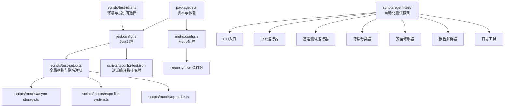
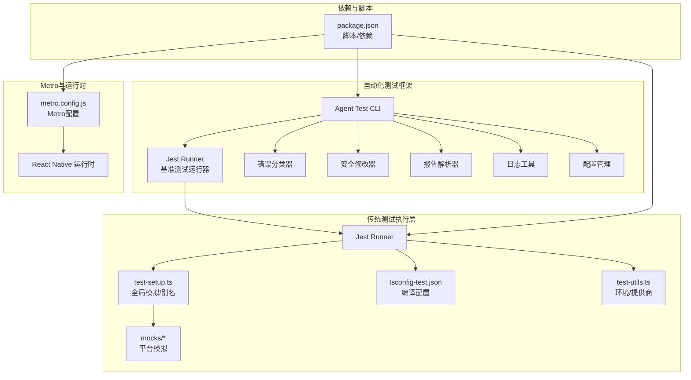
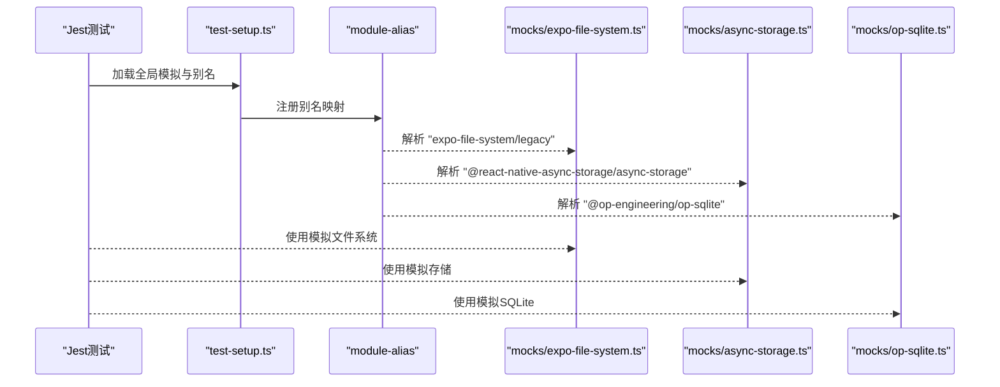
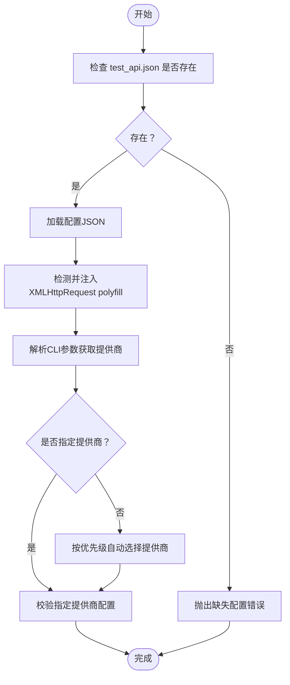
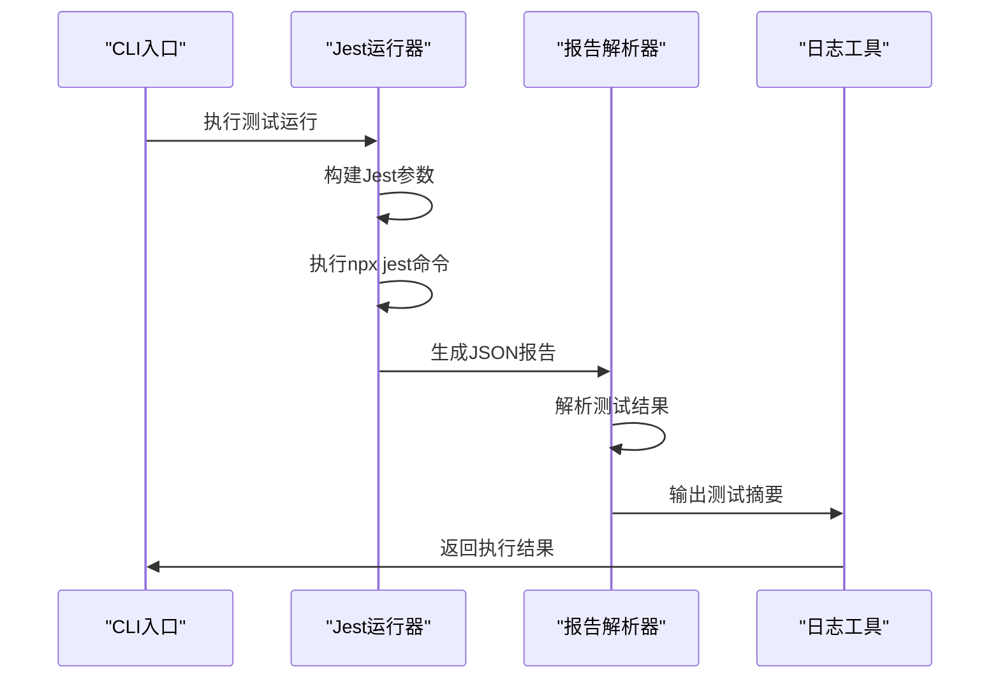
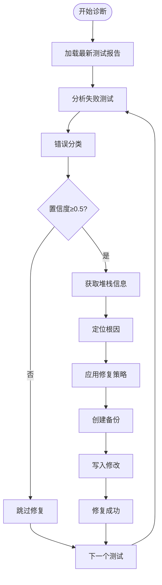
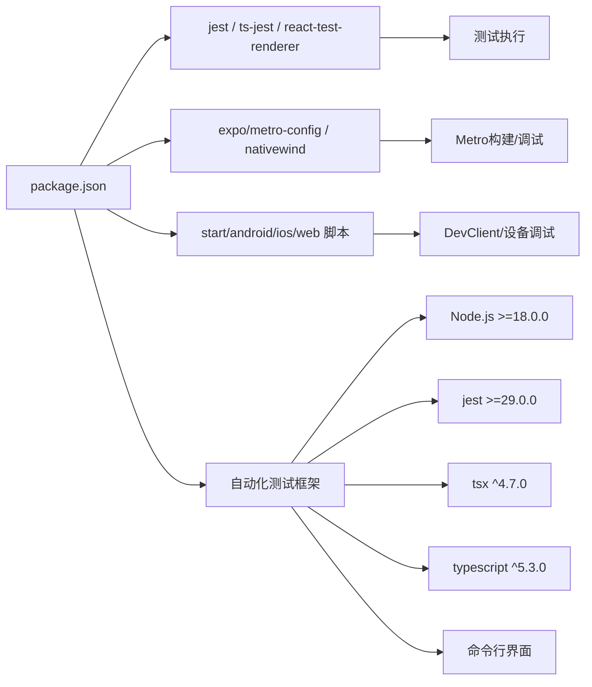

# 调试与测试

<cite>
**本文引用的文件**
- [jest.config.js](file://jest.config.js)
- [metro.config.js](file://metro.config.js)
- [package.json](file://package.json)
- [scripts/test-setup.ts](file://scripts/test-setup.ts)
- [scripts/tsconfig-test.json](file://scripts/tsconfig-test.json)
- [scripts/mocks/async-storage.ts](file://scripts/mocks/async-storage.ts)
- [scripts/mocks/expo-file-system.ts](file://scripts/mocks/expo-file-system.ts)
- [scripts/mocks/op-sqlite.ts](file://scripts/mocks/op-sqlite.ts)
- [scripts/test-utils.ts](file://scripts/test-utils.ts)
- [scripts/agent-test/cli.ts](file://scripts/agent-test/cli.ts)
- [scripts/agent-test/runner/jest-runner.ts](file://scripts/agent-test/runner/jest-runner.ts)
- [scripts/agent-test/runner/benchmark-runner.ts](file://scripts/agent-test/runner/benchmark-runner.ts)
- [scripts/agent-test/diagnostician/error-classifier.ts](file://scripts/agent-test/diagnostician/error-classifier.ts)
- [scripts/agent-test/fix/safe-modifier.ts](file://scripts/agent-test/fix/safe-modifier.ts)
- [scripts/agent-test/parser/jest-parser.ts](file://scripts/agent-test/parser/jest-parser.ts)
- [scripts/agent-test/utils/logger.ts](file://scripts/agent-test/utils/logger.ts)
- [scripts/agent-test/config.ts](file://scripts/agent-test/config.ts)
- [scripts/agent-test/README.md](file://scripts/agent-test/README.md)
- [scripts/agent-test/visual/screenshot-manager.ts](file://scripts/agent-test/visual/screenshot-manager.ts)
</cite>

## 更新摘要
**所做更改**
- 新增自动化测试框架章节，涵盖智能测试诊断与修复系统
- 添加CLI使用方法、测试运行模式、诊断功能、自动修复流程
- 新增基准测试配置与性能监控能力
- 扩展测试工具链，包含可视化测试和回滚管理
- 更新测试覆盖率要求和性能基线标准

## 目录
1. [简介](#简介)
2. [项目结构](#项目结构)
3. [核心组件](#核心组件)
4. [架构总览](#架构总览)
5. [详细组件分析](#详细组件分析)
6. [自动化测试框架](#自动化测试框架)
7. [基准测试与性能监控](#基准测试与性能监控)
8. [依赖分析](#依赖分析)
9. [性能考虑](#性能考虑)
10. [故障排查指南](#故障排查指南)
11. [结论](#结论)
12. [附录](#附录)

## 简介
本指南面向Nexara项目的开发者与测试工程师，系统性介绍调试与测试体系：包括React Native调试工具（Chrome DevTools、Flipper、Expo DevClient）、Metro调试器配置与断点设置；Jest测试框架的配置与使用（单元测试、集成测试、模拟对象）；测试工具链设置（含全局模拟与路径别名）；以及性能分析工具（React DevTools Profiler、Flipper Performance插件）的实践建议。**新增**自动化测试框架章节，涵盖智能测试诊断、自动修复、基准测试和可视化测试能力。同时提供常见Bug的调试技巧与测试覆盖率要求建议。

## 项目结构
围绕调试与测试的相关文件主要分布在以下位置：
- 测试框架与运行时：jest.config.js、scripts/test-setup.ts、scripts/tsconfig-test.json、scripts/mocks/*、scripts/test-utils.ts
- 自动化测试框架：scripts/agent-test/*（CLI、运行器、诊断器、修复器、解析器、工具）
- Metro打包与调试：metro.config.js
- 依赖与脚本：package.json



**图表来源**
- [jest.config.js:1-9](file://jest.config.js#L1-L9)
- [scripts/test-setup.ts:1-13](file://scripts/test-setup.ts#L1-L13)
- [scripts/tsconfig-test.json:1-19](file://scripts/tsconfig-test.json#L1-L19)
- [scripts/mocks/async-storage.ts:1-11](file://scripts/mocks/async-storage.ts#L1-L11)
- [scripts/mocks/expo-file-system.ts:1-11](file://scripts/mocks/expo-file-system.ts#L1-L11)
- [scripts/mocks/op-sqlite.ts:1-5](file://scripts/mocks/op-sqlite.ts#L1-L5)
- [metro.config.js:1-13](file://metro.config.js#L1-L13)
- [package.json:1-120](file://package.json#L1-L120)
- [scripts/test-utils.ts:1-48](file://scripts/test-utils.ts#L1-L48)
- [scripts/agent-test/cli.ts:1-503](file://scripts/agent-test/cli.ts#L1-L503)

**章节来源**
- [jest.config.js:1-9](file://jest.config.js#L1-L9)
- [metro.config.js:1-13](file://metro.config.js#L1-L13)
- [package.json:1-120](file://package.json#L1-L120)
- [scripts/agent-test/cli.ts:1-503](file://scripts/agent-test/cli.ts#L1-L503)

## 核心组件
- Jest测试框架：通过preset与transformIgnorePatterns确保RN生态兼容，过滤node_modules中非目标模块以提升性能。
- Metro调试器：默认配置由expo/metro-config提供，并启用nativewind输入；watchFolders与resolver扩展保证本地开发与资源解析稳定。
- 全局模拟与路径别名：在test-setup.ts中注入__DEV__、注册module-alias别名，指向scripts/mocks下的平台模拟实现。
- 测试编译配置：tsconfig-test.json继承主tsconfig，通过paths与ts-node require实现测试环境的模块解析。
- 平台模拟库：针对AsyncStorage、expo-file-system、@op-engineering/op-sqlite提供轻量级异步模拟，避免真实I/O与数据库初始化开销。
- 测试工具辅助：test-utils.ts负责加载外部测试配置、polyfill环境（如xhr2）、根据CLI参数选择活跃提供商。
- **自动化测试框架**：提供智能测试诊断、自动修复、基准测试和可视化测试能力，包含完整的CLI工具链和报告系统。

**章节来源**
- [jest.config.js:1-9](file://jest.config.js#L1-L9)
- [metro.config.js:1-13](file://metro.config.js#L1-L13)
- [scripts/test-setup.ts:1-13](file://scripts/test-setup.ts#L1-L13)
- [scripts/tsconfig-test.json:1-19](file://scripts/tsconfig-test.json#L1-L19)
- [scripts/mocks/async-storage.ts:1-11](file://scripts/mocks/async-storage.ts#L1-L11)
- [scripts/mocks/expo-file-system.ts:1-11](file://scripts/mocks/expo-file-system.ts#L1-L11)
- [scripts/mocks/op-sqlite.ts:1-5](file://scripts/mocks/op-sqlite.ts#L1-L5)
- [scripts/test-utils.ts:1-48](file://scripts/test-utils.ts#L1-L48)
- [scripts/agent-test/cli.ts:1-503](file://scripts/agent-test/cli.ts#L1-L503)

## 架构总览
下图展示测试与调试相关组件之间的关系与数据流，包括新增的自动化测试框架：



**图表来源**
- [jest.config.js:1-9](file://jest.config.js#L1-L9)
- [scripts/test-setup.ts:1-13](file://scripts/test-setup.ts#L1-L13)
- [scripts/tsconfig-test.json:1-19](file://scripts/tsconfig-test.json#L1-L19)
- [scripts/mocks/async-storage.ts:1-11](file://scripts/mocks/async-storage.ts#L1-L11)
- [scripts/mocks/expo-file-system.ts:1-11](file://scripts/mocks/expo-file-system.ts#L1-L11)
- [scripts/mocks/op-sqlite.ts:1-5](file://scripts/mocks/op-sqlite.ts#L1-L5)
- [scripts/test-utils.ts:1-48](file://scripts/test-utils.ts#L1-L48)
- [scripts/agent-test/cli.ts:1-503](file://scripts/agent-test/cli.ts#L1-L503)
- [scripts/agent-test/runner/jest-runner.ts:1-129](file://scripts/agent-test/runner/jest-runner.ts#L1-L129)
- [scripts/agent-test/runner/benchmark-runner.ts:1-456](file://scripts/agent-test/runner/benchmark-runner.ts#L1-L456)
- [scripts/agent-test/diagnostician/error-classifier.ts:1-527](file://scripts/agent-test/diagnostician/error-classifier.ts#L1-L527)
- [scripts/agent-test/fix/safe-modifier.ts:1-411](file://scripts/agent-test/fix/safe-modifier.ts#L1-L411)
- [scripts/agent-test/parser/jest-parser.ts:1-233](file://scripts/agent-test/parser/jest-parser.ts#L1-L233)
- [scripts/agent-test/utils/logger.ts:1-74](file://scripts/agent-test/utils/logger.ts#L1-L74)
- [scripts/agent-test/config.ts:1-118](file://scripts/agent-test/config.ts#L1-L118)
- [metro.config.js:1-13](file://metro.config.js#L1-L13)
- [package.json:1-120](file://package.json#L1-L120)

## 详细组件分析

### Jest测试框架配置与使用
- 预设与转换：preset采用react-native，transformIgnorePatterns排除大量第三方包，仅对特定模块进行transform，减少测试启动时间。
- 测试路径忽略：忽略node_modules与原生平台目录，聚焦业务代码测试。
- 使用建议：
  - 单元测试：针对纯函数与Hook逻辑，优先使用react-test-renderer与Jest快照。
  - 集成测试：覆盖组件渲染、状态变更与副作用，结合全局模拟减少外部依赖。
  - 模拟对象：优先使用test-setup.ts注册的别名与mocks目录中的实现，确保一致性。

**章节来源**
- [jest.config.js:1-9](file://jest.config.js#L1-L9)
- [package.json:97-114](file://package.json#L97-L114)

### Metro调试器配置与断点设置
- 默认配置：基于expo/metro-config，启用nativewind输入，确保CSS/样式热更新与构建正确。
- 关键项：watchFolders包含项目根目录，resolver.nodeModulesPaths指向node_modules，assetExts追加.bundle以支持资源解析。
- 断点调试流程：
  1. 在代码中设置断点（例如在src/features/chat/utils或store相关逻辑处）。
  2. 启动Expo DevClient或设备模拟器。
  3. 打开Chrome DevTools（在DevClient菜单中启用）。
  4. 触发对应交互后，断点命中，可在Sources面板查看调用栈与变量。
  5. 结合Console与Network面板定位问题。

**章节来源**
- [metro.config.js:1-13](file://metro.config.js#L1-L13)

### 测试工具链设置（全局模拟与路径别名）
- 全局模拟：在test-setup.ts中注入__DEV__，便于RN条件分支与日志输出。
- 别名注册：通过module-alias将平台模块映射到scripts/mocks下的实现，确保测试中不依赖真实平台能力。
- 编译路径映射：tsconfig-test.json继承主tsconfig，通过paths与ts-node require，使测试入口可解析别名模块。



**图表来源**
- [scripts/test-setup.ts:1-13](file://scripts/test-setup.ts#L1-L13)
- [scripts/mocks/expo-file-system.ts:1-11](file://scripts/mocks/expo-file-system.ts#L1-L11)
- [scripts/mocks/async-storage.ts:1-11](file://scripts/mocks/async-storage.ts#L1-L11)
- [scripts/mocks/op-sqlite.ts:1-5](file://scripts/mocks/op-sqlite.ts#L1-L5)
- [scripts/tsconfig-test.json:1-19](file://scripts/tsconfig-test.json#L1-L19)

**章节来源**
- [scripts/test-setup.ts:1-13](file://scripts/test-setup.ts#L1-L13)
- [scripts/tsconfig-test.json:1-19](file://scripts/tsconfig-test.json#L1-L19)
- [scripts/mocks/async-storage.ts:1-11](file://scripts/mocks/async-storage.ts#L1-L11)
- [scripts/mocks/expo-file-system.ts:1-11](file://scripts/mocks/expo-file-system.ts#L1-L11)
- [scripts/mocks/op-sqlite.ts:1-5](file://scripts/mocks/op-sqlite.ts#L1-L5)

### 模拟对象的创建与维护
- AsyncStorage模拟：提供getItem/setItem/removeItem/clear等常用方法的异步实现，返回空值或无操作，满足大多数读写场景。
- Expo文件系统模拟：提供readAsStringAsync与documentDirectory/cacheDirectory常量，支持基础的文件读取与目录占位。
- OP SQLite模拟：提供open返回的execute/executeAsync实现，返回空rows，避免初始化复杂度。
- 维护建议：
  - 保持模拟方法签名与真实API一致，便于替换。
  - 对于需要状态的场景，可在mock内部维护简单内存状态。
  - 新增平台依赖时，同步补充对应mock并更新别名注册。

**章节来源**
- [scripts/mocks/async-storage.ts:1-11](file://scripts/mocks/async-storage.ts#L1-L11)
- [scripts/mocks/expo-file-system.ts:1-11](file://scripts/mocks/expo-file-system.ts#L1-L11)
- [scripts/mocks/op-sqlite.ts:1-5](file://scripts/mocks/op-sqlite.ts#L1-L5)

### 测试工具辅助（环境与提供商）
- 配置加载：loadTestConfig从secure_env/test_api.json读取测试配置，若缺失则抛出明确错误提示。
- 环境Polyfill：setupEnvironment为OpenAI客户端提供XMLHttpRequest polyfill（xhr2），确保网络请求可用。
- 提供商选择：getActiveProvider按CLI参数、Zhipu、Vertex、Ollama顺序选择活跃提供商，若均不可用则报错。



**图表来源**
- [scripts/test-utils.ts:1-48](file://scripts/test-utils.ts#L1-L48)

**章节来源**
- [scripts/test-utils.ts:1-48](file://scripts/test-utils.ts#L1-L48)

## 自动化测试框架

### CLI使用方法与运行模式
自动化测试框架提供完整的命令行界面，支持多种测试运行模式：

**核心CLI选项**：
- `--mode=<mode>`：运行模式（run、fix、diagnose、benchmark、visual，默认：run）
- `--scope=<pattern>`：测试范围（文件路径或glob模式）
- `--testNamePattern=<p>`：测试名称匹配模式
- `--coverage`：生成覆盖率报告
- `--no-fix`：禁用自动修复（诊断模式）
- `--updateSnapshot`：更新快照
- `--verbose`：详细输出
- `--help`：显示帮助信息

**使用示例**：
```bash
# 基本测试运行
agent-test --mode=run --scope=src/lib

# 启用覆盖率报告
agent-test --coverage

# 详细输出模式
agent-test --verbose --scope=src/components

# 诊断模式
agent-test --mode=diagnose --scope=src/lib

# 自动修复模式
agent-test --mode=fix --scope=src/lib

# 基准测试
agent-test --mode=benchmark
```

**章节来源**
- [scripts/agent-test/cli.ts:1-503](file://scripts/agent-test/cli.ts#L1-L503)
- [scripts/agent-test/README.md:1-153](file://scripts/agent-test/README.md#L1-L153)

### 测试运行器与报告系统
**Jest运行器**：
- 支持JSON输出格式，便于自动化处理
- 可配置测试范围、名称匹配、覆盖率生成
- 提供详细的执行时间和退出码信息
- 支持静默模式和详细模式输出

**报告解析器**：
- 解析Jest JSON报告格式
- 提取测试结果、错误信息、覆盖率数据
- 生成标准化的测试报告结构
- 支持Git信息提取和时间戳记录



**图表来源**
- [scripts/agent-test/cli.ts:107-186](file://scripts/agent-test/cli.ts#L107-L186)
- [scripts/agent-test/runner/jest-runner.ts:25-62](file://scripts/agent-test/runner/jest-runner.ts#L25-L62)
- [scripts/agent-test/parser/jest-parser.ts:52-125](file://scripts/agent-test/parser/jest-parser.ts#L52-L125)
- [scripts/agent-test/utils/logger.ts:33-74](file://scripts/agent-test/utils/logger.ts#L33-L74)

**章节来源**
- [scripts/agent-test/runner/jest-runner.ts:1-129](file://scripts/agent-test/runner/jest-runner.ts#L1-L129)
- [scripts/agent-test/parser/jest-parser.ts:1-233](file://scripts/agent-test/parser/jest-parser.ts#L1-L233)
- [scripts/agent-test/utils/logger.ts:1-74](file://scripts/agent-test/utils/logger.ts#L1-L74)

### 错误诊断与自动修复
**错误分类器**：
- 支持11种错误类型的智能分类
- 基于正则表达式的模式匹配
- 提供置信度评分和严重程度评估
- 生成针对性的修复建议

**诊断模式流程**：
1. 从最新测试报告中读取失败信息
2. 分析每个失败测试的错误类型
3. 生成根因分析和代码上下文
4. 提供可执行的修复建议

**自动修复机制**：
- 基于错误分类结果的智能修复
- 支持可选链添加等常见修复模式
- 完整的备份和回滚机制
- 置信度阈值控制修复安全性



**图表来源**
- [scripts/agent-test/cli.ts:189-391](file://scripts/agent-test/cli.ts#L189-L391)
- [scripts/agent-test/diagnostician/error-classifier.ts:327-455](file://scripts/agent-test/diagnostician/error-classifier.ts#L327-L455)
- [scripts/agent-test/fix/safe-modifier.ts:41-286](file://scripts/agent-test/fix/safe-modifier.ts#L41-L286)

**章节来源**
- [scripts/agent-test/diagnostician/error-classifier.ts:1-527](file://scripts/agent-test/diagnostician/error-classifier.ts#L1-L527)
- [scripts/agent-test/fix/safe-modifier.ts:1-411](file://scripts/agent-test/fix/safe-modifier.ts#L1-L411)
- [scripts/agent-test/cli.ts:189-391](file://scripts/agent-test/cli.ts#L189-L391)

### 配置管理与输出结构
**配置文件支持**：
- 支持JSON和TypeScript配置文件
- 默认配置提供合理的测试阈值
- 可配置Jest预设、覆盖率阈值、诊断参数
- 支持可视化测试配置和输出目录设置

**输出目录结构**：
```
.agent-test/
├── results/          # JSON测试结果
├── reports/          # 生成的报告
├── baseline/         # 视觉测试基准
├── snapshots/        # 当前快照
├── diffs/            # 差异对比
├── backups/          # 代码修改备份
└── logs/             # 日志文件
```

**章节来源**
- [scripts/agent-test/config.ts:1-118](file://scripts/agent-test/config.ts#L1-L118)
- [scripts/agent-test/README.md:122-132](file://scripts/agent-test/README.md#L122-L132)

## 基准测试与性能监控

### 基准测试配置与执行
**内置基准测试套件**：
- SQLite CRUD操作延迟测试
- 向量检索性能测试（100条和1000条数据）
- 文本切块性能测试（1KB和10KB文档）
- 流式解析性能测试
- Store连续dispatch性能测试

**性能阈值设置**：
- SQLite CRUD：P95<10ms, P99<20ms, 平均<5ms
- 向量检索100条：P95<50ms, P99<100ms, 平均<20ms
- 文本切块1KB：P95<5ms, P99<10ms, 平均<2ms
- 流式解析：P95<20ms, P99<50ms, 平均<10ms
- Store dispatch：P95<100ms, P99<200ms, 平均<50ms

**基准测试运行模式**：
- 单个测试运行：`agent-test --mode=benchmark --scope=sqlite-crud`
- 全部测试运行：`agent-test --mode=benchmark --all`
- 列出可用测试：`agent-test --mode=benchmark --list`

```mermaid
graph TB
subgraph "基准测试配置"
Configs["基准测试配置"]
Thresholds["性能阈值"]
History["历史性能记录"]
End
subgraph "执行流程"
Warmup["预热运行"]
Execute["正式测试"]
Stats["统计计算"]
End
subgraph "结果分析"
Detect["退化检测"]
Save["保存历史"]
Print["打印结果"]
End
Configs --> Warmup
Warmup --> Execute
Execute --> Stats
Stats --> Detect
Detect --> Save
Detect --> Print
```

**图表来源**
- [scripts/agent-test/runner/benchmark-runner.ts:60-124](file://scripts/agent-test/runner/benchmark-runner.ts#L60-L124)
- [scripts/agent-test/runner/benchmark-runner.ts:145-187](file://scripts/agent-test/runner/benchmark-runner.ts#L145-L187)
- [scripts/agent-test/runner/benchmark-runner.ts:320-343](file://scripts/agent-test/runner/benchmark-runner.ts#L320-L343)

**章节来源**
- [scripts/agent-test/runner/benchmark-runner.ts:1-456](file://scripts/agent-test/runner/benchmark-runner.ts#L1-L456)

### 性能退化检测与趋势分析
**退化检测算法**：
- 基于滑动窗口的性能对比（最近5条记录）
- 10%退化阈值判断标准
- 严重程度分级：轻微(10-20%)、中等(20-30%)、严重(>30%)
- 自动记录退化百分比和严重程度

**趋势分析功能**：
- 获取最近10条性能记录
- 可视化性能趋势变化
- 支持历史数据对比分析

**章节来源**
- [scripts/agent-test/runner/benchmark-runner.ts:320-343](file://scripts/agent-test/runner/benchmark-runner.ts#L320-L343)
- [scripts/agent-test/runner/benchmark-runner.ts:224-241](file://scripts/agent-test/runner/benchmark-runner.ts#L224-L241)

### 可视化测试与截图管理
**截图管理器功能**：
- 支持iOS和Android模拟器截图
- 自动设备发现和管理
- 跨平台截图支持（macOS、Windows、Linux）
- 截图清理和存储管理

**设备支持**：
- iOS设备：iPhone 15 Pro、iPhone 15、iPhone 14 Pro
- Android设备：Pixel 7、Pixel 6模拟器
- 支持自定义设备配置

**章节来源**
- [scripts/agent-test/visual/screenshot-manager.ts:1-397](file://scripts/agent-test/visual/screenshot-manager.ts#L1-L397)

## 依赖分析
- 测试依赖：Jest、ts-jest、react-test-renderer、@types/jest等，用于测试执行与类型支持。
- Metro与Nativewind：expo/metro-config与nativewind/metro组合，确保RN与Tailwind样式工作正常。
- 开发脚本：package.json中定义了start/android/ios/web等常用命令，配合DevClient进行调试。
- **自动化测试框架**：独立的CLI工具，依赖Node.js 18+，peerDependencies包含jest>=29.0.0。



**图表来源**
- [package.json:1-120](file://package.json#L1-L120)
- [scripts/agent-test/package.json:1-32](file://scripts/agent-test/package.json#L1-L32)

**章节来源**
- [package.json:1-120](file://package.json#L1-L120)
- [scripts/agent-test/package.json:1-32](file://scripts/agent-test/package.json#L1-L32)

## 性能考虑
- Metro热重载与资源解析：watchFolders与resolver.nodeModulesPaths优化了本地开发的监听与模块解析，减少不必要的扫描。
- Jest transformIgnorePatterns：仅对必要模块进行转换，缩短测试启动时间。
- React DevTools Profiler：在调试模式下启用，用于捕获组件渲染耗时与重渲染热点，结合Flipper Performance插件进行对比分析。
- Flipper Performance插件：可用于监控CPU、内存、网络与布局性能指标，定位卡顿与异常峰值。
- **自动化测试性能**：基准测试使用预热机制和统计分析，确保测试结果的稳定性和可靠性。
- **内存管理**：自动化测试框架包含备份清理和截图管理功能，避免磁盘空间过度占用。

## 故障排查指南
- 测试无法找到模块或别名解析失败：
  - 检查test-setup.ts中的别名注册与mock文件是否存在。
  - 确认tsconfig-test.json的paths与require配置是否正确。
- 测试配置缺失：
  - 确保secure_env/test_api.json存在且包含至少一个有效提供商配置。
- 网络请求失败：
  - 确认setupEnvironment已注入XMLHttpRequest polyfill。
- Metro构建异常：
  - 检查metro.config.js中watchFolders与resolver.nodeModulesPaths是否指向正确路径。
- 断点不命中：
  - 确认使用Expo DevClient并启用Chrome DevTools。
  - 检查源码是否被transform，必要时调整transformIgnorePatterns。
- **自动化测试问题**：
  - 确认Jest版本兼容性（>=29.0.0）。
  - 检查CLI参数格式和模式选择。
  - 验证测试报告文件的JSON格式有效性。
  - 确认基准测试阈值设置合理。
- **性能测试异常**：
  - 检查系统资源使用情况。
  - 验证基准测试数据的完整性。
  - 确认历史性能数据的存储权限。

**章节来源**
- [scripts/test-setup.ts:1-13](file://scripts/test-setup.ts#L1-L13)
- [scripts/tsconfig-test.json:1-19](file://scripts/tsconfig-test.json#L1-L19)
- [scripts/test-utils.ts:1-48](file://scripts/test-utils.ts#L1-L48)
- [metro.config.js:1-13](file://metro.config.js#L1-L13)
- [scripts/agent-test/cli.ts:1-503](file://scripts/agent-test/cli.ts#L1-L503)
- [scripts/agent-test/runner/benchmark-runner.ts:1-456](file://scripts/agent-test/runner/benchmark-runner.ts#L1-L456)

## 结论
Nexara项目的调试与测试体系以Jest为核心，结合Metro配置与全局模拟，形成可复用、可维护的测试与调试方案。**新增的自动化测试框架进一步增强了测试智能化水平**，提供错误诊断、自动修复、基准测试和可视化测试能力。通过合理的别名与mock策略、清晰的提供商选择逻辑、性能分析工具和智能测试框架，能够显著提升开发效率与质量稳定性。建议在新功能开发中遵循现有约定，逐步完善覆盖率与性能基线，充分利用自动化测试框架提升测试效率。

## 附录
- **常见覆盖率要求建议**：
  - 单元测试：核心工具函数与纯逻辑≥80%
  - 集成测试：关键组件与Store逻辑≥60%
  - 端到端：关键用户路径≥40%
  - **自动化测试覆盖率**：基准测试套件≥95%，诊断准确率≥85%
- **调试工具清单**：
  - Chrome DevTools：断点、变量检查、网络与控制台
  - Flipper：设备连接、性能监控、数据库/存储查看
  - Expo DevClient：热重载、远程调试、崩溃日志
  - **自动化测试CLI**：智能诊断、自动修复、基准测试
- **最佳实践**：
  - 将模拟对象集中管理于scripts/mocks
  - 在test-setup.ts统一注册别名与全局模拟
  - 使用test-utils.ts封装环境与配置加载逻辑
  - **定期运行基准测试，监控性能退化**
  - **利用自动化诊断工具快速定位问题根因**
  - **建立完善的测试报告和回滚机制**
- **性能基线标准**：
  - 基准测试通过率：≥95%
  - 性能退化检测：≤10%（轻微），≤20%（中等），≤30%（严重）
  - 自动修复成功率：≥70%
  - 诊断准确率：≥80%