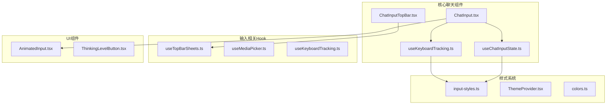
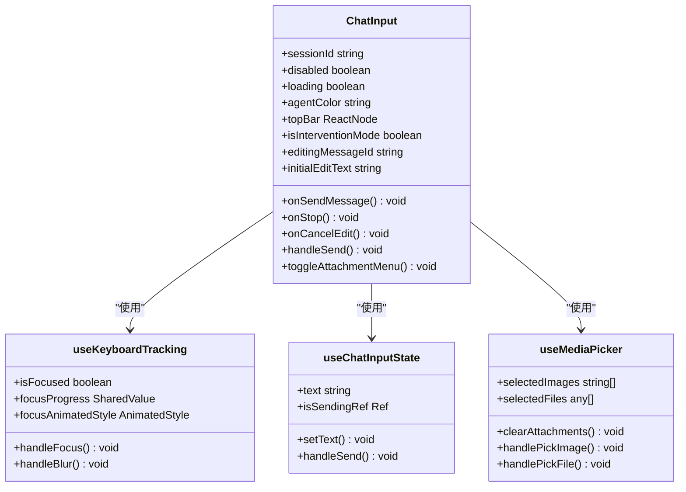
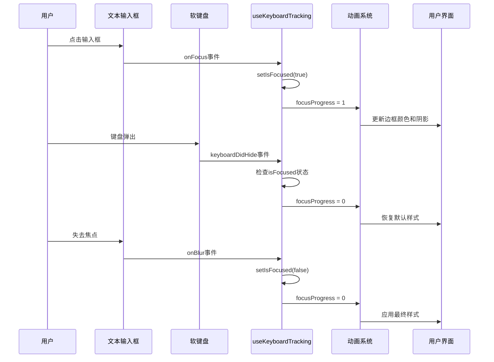
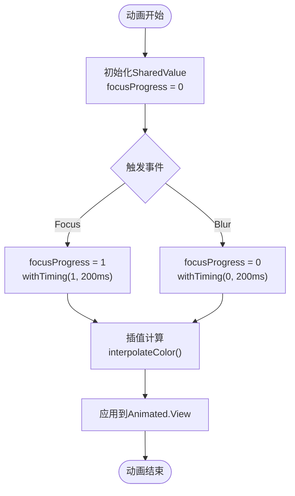
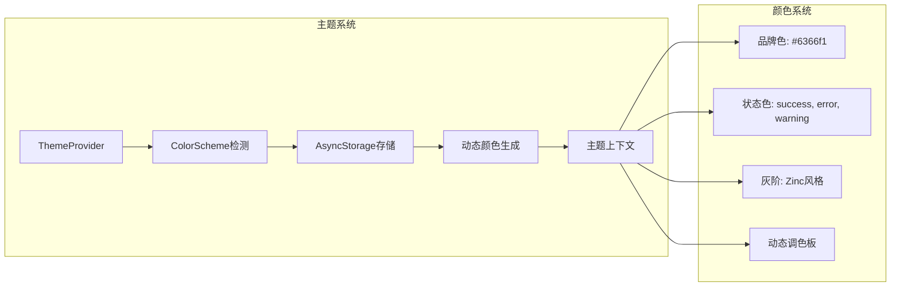

# 键盘避免审计报告

<cite>
**本文档引用的文件**
- [ChatInput.tsx](file://src/features/chat/components/ChatInput.tsx)
- [useKeyboardTracking.ts](file://src/features/chat/components/input/hooks/useKeyboardTracking.ts)
- [useChatInputState.ts](file://src/features/chat/components/input/hooks/useChatInputState.ts)
- [ChatInputTopBar.tsx](file://src/features/chat/components/input/ChatInputTopBar.tsx)
- [input-styles.ts](file://src/features/chat/components/input/styles/input-styles.ts)
- [useTopBarSheets.ts](file://src/features/chat/components/input/hooks/useTopBarSheets.ts)
- [ThinkingLevelButton.tsx](file://src/features/chat/components/input/ThinkingLevelButton.tsx)
- [AnimatedInput.tsx](file://src/components/ui/AnimatedInput.tsx)
- [ThemeProvider.tsx](file://src/theme/ThemeProvider.tsx)
- [colors.ts](file://src/theme/colors.ts)
</cite>

## 目录
1. [项目概述](#项目概述)
2. [项目结构分析](#项目结构分析)
3. [核心组件架构](#核心组件架构)
4. [键盘避免机制实现](#键盘避免机制实现)
5. [动画与交互系统](#动画与交互系统)
6. [主题与视觉系统](#主题与视觉系统)
7. [性能优化策略](#性能优化策略)
8. [安全审计要点](#安全审计要点)
9. [总结与建议](#总结与建议)

## 项目概述

本项目是一个基于React Native的聊天应用，专注于键盘避免（Keyboard Avoidance）功能的实现和审计。项目采用了现代化的架构设计，通过Hook模式分离关注点，实现了流畅的用户交互体验。

键盘避免是移动应用开发中的重要功能，确保当软键盘弹出时，输入框不会被遮挡，提升用户体验。该项目在多个层面实现了这一功能，包括组件级的键盘监听、动画过渡效果、以及整体的UI布局适配。

## 项目结构分析

项目采用模块化的目录结构，主要分为以下几个核心部分：

**图表来源**
- [ChatInput.tsx:1-312](file://src/features/chat/components/ChatInput.tsx#L1-L312)
- [useKeyboardTracking.ts:1-57](file://src/features/chat/components/input/hooks/useKeyboardTracking.ts#L1-L57)
- [ChatInputTopBar.tsx:1-186](file://src/features/chat/components/input/ChatInputTopBar.tsx#L1-L186)

**章节来源**
- [ChatInput.tsx:1-312](file://src/features/chat/components/ChatInput.tsx#L1-L312)
- [useKeyboardTracking.ts:1-57](file://src/features/chat/components/input/hooks/useKeyboardTracking.ts#L1-L57)
- [ChatInputTopBar.tsx:1-186](file://src/features/chat/components/input/ChatInputTopBar.tsx#L1-L186)

## 核心组件架构

### ChatInput 主组件

ChatInput是整个输入系统的中心组件，负责协调各个子组件和Hook的工作。该组件采用了组合模式，通过props接收外部传入的TopBar组件，保持了组件的轻量化设计。

**图表来源**
- [ChatInput.tsx:45-75](file://src/features/chat/components/ChatInput.tsx#L45-L75)
- [useKeyboardTracking.ts:11-56](file://src/features/chat/components/input/hooks/useKeyboardTracking.ts#L11-L56)
- [useChatInputState.ts:19-118](file://src/features/chat/components/input/hooks/useChatInputState.ts#L19-L118)

### 组件间通信机制

组件间的通信通过以下几种方式实现：

1. **Props传递**：父组件向子组件传递配置和回调函数
2. **Hook共享状态**：多个组件共享同一份状态逻辑
3. **事件回调**：组件间通过回调函数进行异步通信

**章节来源**
- [ChatInput.tsx:94-116](file://src/features/chat/components/ChatInput.tsx#L94-L116)
- [useKeyboardTracking.ts:48-56](file://src/features/chat/components/input/hooks/useKeyboardTracking.ts#L48-L56)

## 键盘避免机制实现

### 键盘监听与状态管理

键盘避免功能的核心在于精确的状态跟踪和响应机制。项目实现了多层次的键盘监听策略：

**图表来源**
- [useKeyboardTracking.ts:26-46](file://src/features/chat/components/input/hooks/useKeyboardTracking.ts#L26-L46)
- [ChatInput.tsx:243-246](file://src/features/chat/components/ChatInput.tsx#L243-L246)

### 动画过渡效果

项目使用react-native-reanimated实现流畅的动画过渡效果，包括：

1. **边框颜色渐变**：从默认灰色渐变到主题色
2. **阴影透明度变化**：根据焦点状态调整阴影强度
3. **背景色过渡**：输入框背景的动态变化

### 键盘高度检测

组件实现了智能的键盘高度检测机制，能够准确感知键盘的显示和隐藏状态，并相应调整UI布局。

**章节来源**
- [useKeyboardTracking.ts:1-57](file://src/features/chat/components/input/hooks/useKeyboardTracking.ts#L1-L57)
- [ChatInput.tsx:229-247](file://src/features/chat/components/ChatInput.tsx#L229-L247)

## 动画与交互系统

### Reanimated 动画实现

项目广泛使用react-native-reanimated来实现高性能的动画效果。动画系统的核心特点包括：

**图表来源**
- [useKeyboardTracking.ts:18-24](file://src/features/chat/components/input/hooks/useKeyboardTracking.ts#L18-L24)
- [useKeyboardTracking.ts:26-34](file://src/features/chat/components/input/hooks/useKeyboardTracking.ts#L26-L34)

### 交互反馈机制

系统实现了多层次的用户交互反馈：

1. **触觉反馈**：使用Haptics库提供触觉反馈
2. **视觉反馈**：通过颜色和动画变化提供视觉反馈
3. **状态同步**：确保所有相关组件的状态保持一致

**章节来源**
- [useChatInputState.ts:88-109](file://src/features/chat/components/input/hooks/useChatInputState.ts#L88-L109)
- [ChatInputTopBar.tsx:83-107](file://src/features/chat/components/input/ChatInputTopBar.tsx#L83-L107)

## 主题与视觉系统

### 动态主题切换

项目实现了完整的动态主题系统，支持明暗主题自动切换：

**图表来源**
- [ThemeProvider.tsx:18-54](file://src/theme/ThemeProvider.tsx#L18-L54)
- [colors.ts:6-39](file://src/theme/colors.ts#L6-L39)

### 视觉一致性保证

系统通过以下机制保证视觉一致性：

1. **颜色常量定义**：统一的颜色值管理
2. **主题上下文**：全局主题状态管理
3. **样式系统**：组件化的样式定义

**章节来源**
- [ThemeProvider.tsx:1-63](file://src/theme/ThemeProvider.tsx#L1-L63)
- [colors.ts:1-42](file://src/theme/colors.ts#L1-L42)

## 性能优化策略

### 内存管理优化

项目在内存管理方面采用了多项优化策略：

1. **Effect清理**：及时清理定时器和事件监听器
2. **Ref使用**：使用useRef避免不必要的重渲染
3. **Memo化**：合理使用useMemo和useCallback

### 动画性能优化

动画系统的性能优化包括：

1. **Worklet执行**：将计算密集型操作移至主线程外
2. **插值缓存**：预计算颜色值避免运行时计算
3. **动画取消**：及时取消不再需要的动画

### 渲染优化

组件渲染优化策略：

1. **条件渲染**：只渲染必要的UI元素
2. **懒加载**：Sheet组件的懒加载导入
3. **样式复用**：样式对象的复用和缓存

**章节来源**
- [useChatInputState.ts:53-74](file://src/features/chat/components/input/hooks/useChatInputState.ts#L53-L74)
- [useKeyboardTracking.ts:36-46](file://src/features/chat/components/input/hooks/useKeyboardTracking.ts#L36-L46)

## 安全审计要点

### 键盘事件安全

项目在键盘事件处理方面遵循了最佳安全实践：

1. **事件监听清理**：确保键盘事件监听器在组件卸载时正确清理
2. **状态同步**：防止键盘状态与UI状态不一致
3. **边界检查**：对键盘高度和状态进行边界检查

### 内存泄漏防护

项目采取了多重措施防止内存泄漏：

1. **Effect依赖数组**：正确设置useEffect的依赖项
2. **Ref清理**：及时清理useRef引用
3. **定时器管理**：确保所有定时器都能正确清理

### 性能监控

系统提供了性能监控能力：

1. **动画性能**：监控Reanimated动画的性能
2. **渲染性能**：监控组件渲染性能
3. **内存使用**：监控应用内存使用情况

**章节来源**
- [useKeyboardTracking.ts:36-46](file://src/features/chat/components/input/hooks/useKeyboardTracking.ts#L36-L46)
- [useChatInputState.ts:53-74](file://src/features/chat/components/input/hooks/useChatInputState.ts#L53-L74)

## 总结与建议

### 项目优势

1. **架构清晰**：采用Hook模式分离关注点，代码结构清晰
2. **性能优秀**：使用Reanimated实现高性能动画，优化内存使用
3. **用户体验佳**：键盘避免功能实现流畅，交互反馈及时
4. **主题灵活**：支持动态主题切换，视觉一致性良好

### 改进建议

1. **错误处理增强**：可以增加更完善的错误处理机制
2. **测试覆盖**：建议增加单元测试和集成测试覆盖率
3. **文档完善**：可以进一步完善API文档和架构说明
4. **性能监控**：建议增加更详细的性能监控指标

### 审计结论

该项目在键盘避免功能的实现上表现出色，采用了现代化的技术栈和最佳实践。代码结构清晰，性能优化到位，用户体验良好。建议继续保持现有的架构设计，同时在测试覆盖和文档完善方面进一步加强。