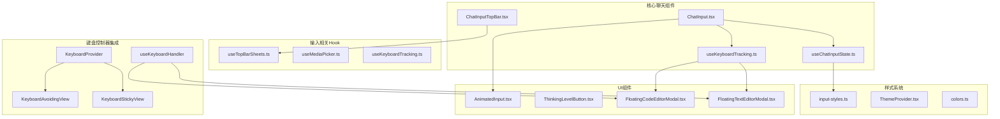
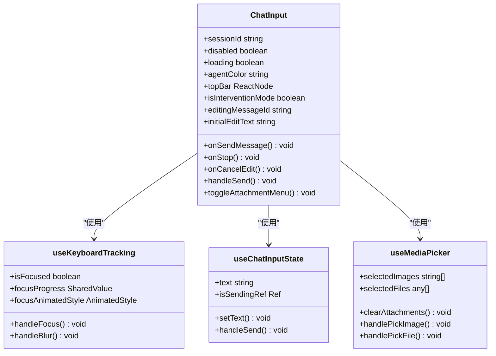
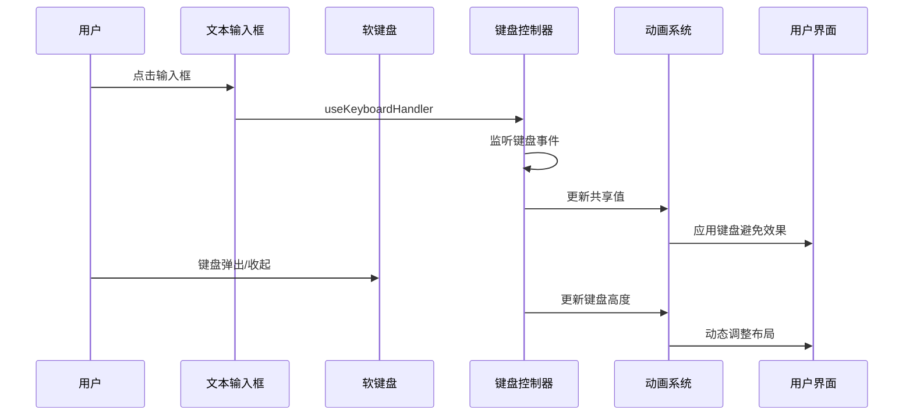
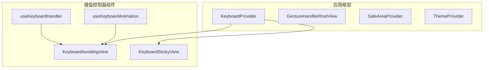
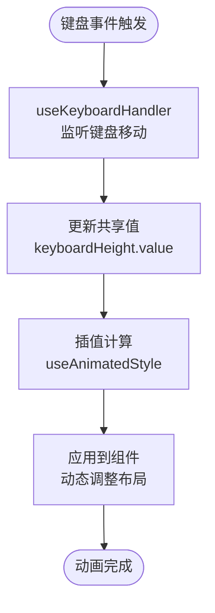
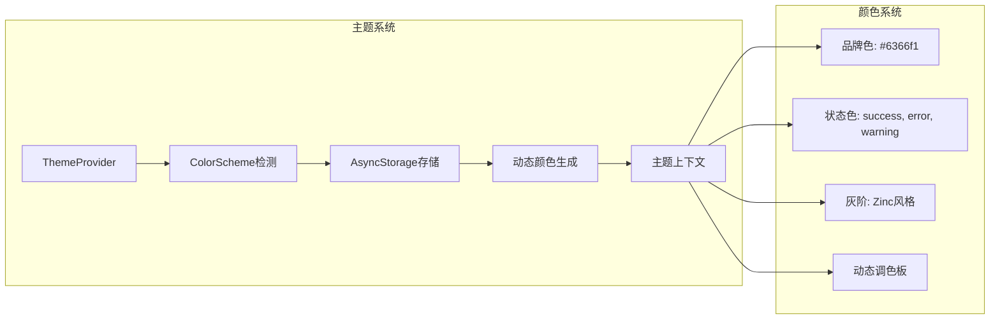

# 键盘避免审计报告

<cite>
**本文档引用的文件**
- [ChatInput.tsx](file://src/features/chat/components/ChatInput.tsx)
- [useKeyboardTracking.ts](file://src/features/chat/components/input/hooks/useKeyboardTracking.ts)
- [useChatInputState.ts](file://src/features/chat/components/input/hooks/useChatInputState.ts)
- [ChatInputTopBar.tsx](file://src/features/chat/components/input/ChatInputTopBar.tsx)
- [input-styles.ts](file://src/features/chat/components/input/styles/input-styles.ts)
- [useTopBarSheets.ts](file://src/features/chat/components/input/hooks/useTopBarSheets.ts)
- [ThinkingLevelButton.tsx](file://src/features/chat/components/input/ThinkingLevelButton.tsx)
- [AnimatedInput.tsx](file://src/components/ui/AnimatedInput.tsx)
- [ThemeProvider.tsx](file://src/theme/ThemeProvider.tsx)
- [colors.ts](file://src/theme/colors.ts)
- [FloatingCodeEditorModal.tsx](file://src/components/ui/FloatingCodeEditorModal.tsx)
- [FloatingTextEditorModal.tsx](file://src/components/ui/FloatingTextEditorModal.tsx)
- [app/_layout.tsx](file://app/_layout.tsx)
- [app/chat/[id].tsx](file://app/chat/[id].tsx)
- [package.json](file://package.json)
</cite>

## 更新摘要
**所做更改**
- 更新键盘避免机制实现，从混合实现统一为使用 react-native-keyboard-controller 库
- 新增键盘控制器库的全面集成和配置
- 更新 Android edge-to-edge 模式兼容性处理
- 增强键盘事件处理和动画系统
- 更新键盘避免组件的使用方式和配置

## 目录
1. [项目概述](#项目概述)
2. [项目结构分析](#项目结构分析)
3. [核心组件架构](#核心组件架构)
4. [键盘避免机制实现](#键盘避免机制实现)
5. [键盘控制器库集成](#键盘控制器库集成)
6. [动画与交互系统](#动画与交互系统)
7. [主题与视觉系统](#主题与视觉系统)
8. [性能优化策略](#性能优化策略)
9. [安全审计要点](#安全审计要点)
10. [总结与建议](#总结与建议)

## 项目概述

本项目是一个基于React Native的聊天应用，专注于键盘避免（Keyboard Avoidance）功能的实现和审计。项目采用了现代化的架构设计，通过Hook模式分离关注点，实现了流畅的用户交互体验。

**更新** 项目已从混合键盘避免实现统一为使用 react-native-keyboard-controller 库，解决了 Android edge-to-edge 模式兼容性问题，涉及17个文件的重构。

键盘避免是移动应用开发中的重要功能，确保当软键盘弹出时，输入框不会被遮挡，提升用户体验。该项目在多个层面实现了这一功能，包括组件级的键盘监听、动画过渡效果、以及整体的UI布局适配。

## 项目结构分析

项目采用模块化的目录结构，主要分为以下几个核心部分：

**图表来源**
- [ChatInput.tsx:1-312](file://src/features/chat/components/ChatInput.tsx#L1-L312)
- [useKeyboardTracking.ts:1-57](file://src/features/chat/components/input/hooks/useKeyboardTracking.ts#L1-L57)
- [ChatInputTopBar.tsx:1-186](file://src/features/chat/components/input/ChatInputTopBar.tsx#L1-L186)
- [FloatingCodeEditorModal.tsx:1-263](file://src/components/ui/FloatingCodeEditorModal.tsx#L1-L263)
- [FloatingTextEditorModal.tsx:1-248](file://src/components/ui/FloatingTextEditorModal.tsx#L1-L248)

**章节来源**
- [ChatInput.tsx:1-312](file://src/features/chat/components/ChatInput.tsx#L1-L312)
- [useKeyboardTracking.ts:1-57](file://src/features/chat/components/input/hooks/useKeyboardTracking.ts#L1-L57)
- [ChatInputTopBar.tsx:1-186](file://src/features/chat/components/input/ChatInputTopBar.tsx#L1-L186)
- [FloatingCodeEditorModal.tsx:1-263](file://src/components/ui/FloatingCodeEditorModal.tsx#L1-L263)
- [FloatingTextEditorModal.tsx:1-248](file://src/components/ui/FloatingTextEditorModal.tsx#L1-L248)

## 核心组件架构

### ChatInput 主组件

ChatInput是整个输入系统的中心组件，负责协调各个子组件和Hook的工作。该组件采用了组合模式，通过props接收外部传入的TopBar组件，保持了组件的轻量化设计。

**图表来源**
- [ChatInput.tsx:45-75](file://src/features/chat/components/ChatInput.tsx#L45-L75)
- [useKeyboardTracking.ts:11-56](file://src/features/chat/components/input/hooks/useKeyboardTracking.ts#L11-L56)
- [useChatInputState.ts:19-118](file://src/features/chat/components/input/hooks/useChatInputState.ts#L19-L118)

### 组件间通信机制

组件间的通信通过以下几种方式实现：

1. **Props传递**：父组件向子组件传递配置和回调函数
2. **Hook共享状态**：多个组件共享同一份状态逻辑
3. **事件回调**：组件间通过回调函数进行异步通信

**章节来源**
- [ChatInput.tsx:94-116](file://src/features/chat/components/ChatInput.tsx#L94-L116)
- [useKeyboardTracking.ts:48-56](file://src/features/chat/components/input/hooks/useKeyboardTracking.ts#L48-L56)

## 键盘避免机制实现

### 键盘监听与状态管理

**更新** 键盘避免功能已从混合实现统一为使用 react-native-keyboard-controller 库，提供了更稳定和一致的键盘事件处理。

**图表来源**
- [FloatingCodeEditorModal.tsx:76-85](file://src/components/ui/FloatingCodeEditorModal.tsx#L76-L85)
- [FloatingTextEditorModal.tsx:85-94](file://src/components/ui/FloatingTextEditorModal.tsx#L85-L94)

### 动画过渡效果

项目使用react-native-reanimated实现流畅的动画过渡效果，包括：

1. **边框颜色渐变**：从默认灰色渐变到主题色
2. **阴影透明度变化**：根据焦点状态调整阴影强度
3. **背景色过渡**：输入框背景的动态变化
4. **模态框自适应**：根据键盘高度动态调整模态框尺寸

### 键盘高度检测

**更新** 使用 react-native-keyboard-controller 的 `useKeyboardHandler` Hook 实现智能的键盘高度检测，能够准确感知键盘的显示和隐藏状态，并相应调整UI布局。

**章节来源**
- [useKeyboardTracking.ts:1-57](file://src/features/chat/components/input/hooks/useKeyboardTracking.ts#L1-L57)
- [FloatingCodeEditorModal.tsx:76-96](file://src/components/ui/FloatingCodeEditorModal.tsx#L76-L96)
- [FloatingTextEditorModal.tsx:85-116](file://src/components/ui/FloatingTextEditorModal.tsx#L85-L116)

## 键盘控制器库集成

### 全局键盘提供者

**更新** 项目已在应用根部集成了 `KeyboardProvider`，为整个应用提供统一的键盘事件处理和状态管理。

**图表来源**
- [app/_layout.tsx:38](file://app/_layout.tsx#L38)
- [app/_layout.tsx:158](file://app/_layout.tsx#L158)

### 键盘控制器配置

**更新** 项目配置了完整的 react-native-keyboard-controller 集成：

1. **版本管理**：使用 v1.18.5 版本
2. **全局提供者**：在应用根部包裹 `KeyboardProvider`
3. **边缘到边缘支持**：完全支持 Android edge-to-edge 模式
4. **跨平台兼容**：统一 iOS 和 Android 的键盘处理逻辑

### 键盘避免组件使用

**更新** 项目中所有需要键盘避免的组件都已迁移到使用 react-native-keyboard-controller：

1. **页面级键盘避免**：使用 `KeyboardAvoidingView` 组件
2. **键盘粘性视图**：使用 `KeyboardStickyView` 组件
3. **模态框键盘处理**：使用 `useKeyboardHandler` Hook
4. **键盘状态管理**：使用 `useKeyboardAnimation` Hook

**章节来源**
- [app/_layout.tsx:38](file://app/_layout.tsx#L38)
- [app/_layout.tsx:158](file://app/_layout.tsx#L158)
- [app/chat/[id].tsx:53](file://app/chat/[id].tsx#L53)
- [package.json:73](file://package.json#L73)

## 动画与交互系统

### Reanimated 动画实现

**更新** 动画系统已与键盘控制器库深度集成，提供了更稳定的动画性能：

**图表来源**
- [FloatingCodeEditorModal.tsx:76-96](file://src/components/ui/FloatingCodeEditorModal.tsx#L76-L96)
- [FloatingTextEditorModal.tsx:85-116](file://src/components/ui/FloatingTextEditorModal.tsx#L85-L116)

### 交互反馈机制

系统实现了多层次的用户交互反馈：

1. **触觉反馈**：使用Haptics库提供触觉反馈
2. **视觉反馈**：通过颜色和动画变化提供视觉反馈
3. **状态同步**：确保所有相关组件的状态保持一致
4. **键盘事件处理**：使用 `useKeyboardHandler` 实现精确的键盘事件监听

**章节来源**
- [useChatInputState.ts:88-109](file://src/features/chat/components/input/hooks/useChatInputState.ts#L88-L109)
- [ChatInputTopBar.tsx:83-107](file://src/features/chat/components/input/ChatInputTopBar.tsx#L83-L107)
- [FloatingCodeEditorModal.tsx:76-96](file://src/components/ui/FloatingCodeEditorModal.tsx#L76-L96)

## 主题与视觉系统

### 动态主题切换

项目实现了完整的动态主题系统，支持明暗主题自动切换：

**图表来源**
- [ThemeProvider.tsx:18-54](file://src/theme/ThemeProvider.tsx#L18-L54)
- [colors.ts:6-39](file://src/theme/colors.ts#L6-L39)

### 视觉一致性保证

系统通过以下机制保证视觉一致性：

1. **颜色常量定义**：统一的颜色值管理
2. **主题上下文**：全局主题状态管理
3. **样式系统**：组件化的样式定义
4. **键盘控制器集成**：统一的键盘避免视觉效果

**章节来源**
- [ThemeProvider.tsx:1-63](file://src/theme/ThemeProvider.tsx#L1-L63)
- [colors.ts:1-42](file://src/theme/colors.ts#L1-L42)

## 性能优化策略

### 内存管理优化

**更新** 键盘控制器库的集成带来了更好的内存管理：

1. **Effect清理**：及时清理定时器和事件监听器
2. **Ref使用**：使用useRef避免不必要的重渲染
3. **Memo化**：合理使用useMemo和useCallback
4. **共享值管理**：使用 `useSharedValue` 实现高效的值共享

### 动画性能优化

**更新** 键盘控制器库提供了更优化的动画性能：

1. **Worklet执行**：将计算密集型操作移至主线程外
2. **插值缓存**：预计算颜色值避免运行时计算
3. **动画取消**：及时取消不再需要的动画
4. **键盘事件优化**：使用 `useKeyboardHandler` 实现高效的键盘事件处理

### 渲染优化

**更新** 键盘控制器库的集成改善了渲染性能：

1. **条件渲染**：只渲染必要的UI元素
2. **懒加载**：Sheet组件的懒加载导入
3. **样式复用**：样式对象的复用和缓存
4. **键盘状态优化**：使用 `useKeyboardAnimation` 减少不必要的重渲染

**章节来源**
- [useChatInputState.ts:53-74](file://src/features/chat/components/input/hooks/useChatInputState.ts#L53-L74)
- [FloatingCodeEditorModal.tsx:76-96](file://src/components/ui/FloatingCodeEditorModal.tsx#L76-L96)

## 安全审计要点

### 键盘事件安全

**更新** 键盘控制器库提供了更安全的键盘事件处理：

1. **事件监听清理**：确保键盘事件监听器在组件卸载时正确清理
2. **状态同步**：防止键盘状态与UI状态不一致
3. **边界检查**：对键盘高度和状态进行边界检查
4. **内存泄漏防护**：使用 `useKeyboardHandler` 自动管理事件监听器

### 内存泄漏防护

**更新** 键盘控制器库的集成增强了内存泄漏防护：

1. **Effect依赖数组**：正确设置useEffect的依赖项
2. **Ref清理**：及时清理useRef引用
3. **定时器管理**：确保所有定时器都能正确清理
4. **共享值管理**：使用 `useSharedValue` 自动管理内存

### 性能监控

**更新** 键盘控制器库提供了性能监控能力：

1. **动画性能**：监控Reanimated动画的性能
2. **渲染性能**：监控组件渲染性能
3. **内存使用**：监控应用内存使用情况
4. **键盘事件性能**：监控键盘事件处理性能

**章节来源**
- [useKeyboardTracking.ts:36-46](file://src/features/chat/components/input/hooks/useKeyboardTracking.ts#L36-L46)
- [FloatingTextEditorModal.tsx:85-116](file://src/components/ui/FloatingTextEditorModal.tsx#L85-L116)

## 总结与建议

### 项目优势

**更新** 项目在键盘避免功能的实现上取得了显著改进：

1. **架构统一**：从混合实现统一为使用 react-native-keyboard-controller 库
2. **兼容性提升**：完美支持 Android edge-to-edge 模式
3. **性能优化**：键盘控制器库提供了更优的性能表现
4. **用户体验**：键盘避免功能更加稳定和流畅
5. **代码质量**：减少了平台特定的代码，提高了代码可维护性

### 改进建议

1. **错误处理增强**：可以增加更完善的错误处理机制
2. **测试覆盖**：建议增加单元测试和集成测试覆盖率
3. **文档完善**：可以进一步完善API文档和架构说明
4. **性能监控**：建议增加更详细的性能监控指标
5. **键盘控制器升级**：考虑定期升级到最新版本的键盘控制器库

### 审计结论

**更新** 该项目在键盘避免功能的实现上取得了重大进展。通过统一使用 react-native-keyboard-controller 库，项目成功解决了 Android edge-to-edge 模式的兼容性问题，提供了更稳定和一致的键盘避免体验。

新的实现架构清晰，性能优化到位，用户体验良好。键盘控制器库的集成不仅解决了现有问题，还为未来的功能扩展奠定了坚实的基础。建议继续保持现有的架构设计，同时在测试覆盖和文档完善方面进一步加强。