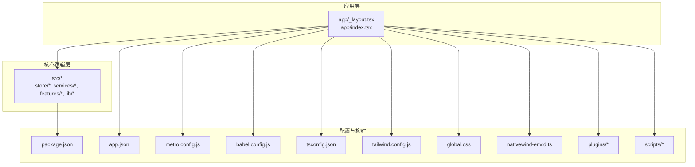
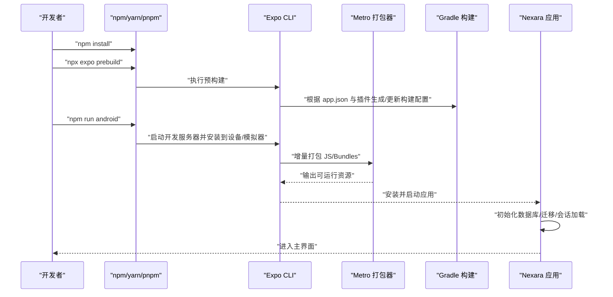
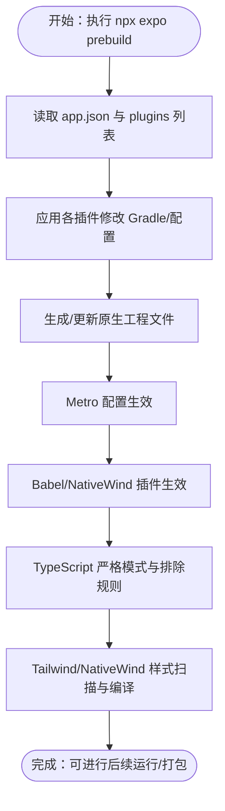
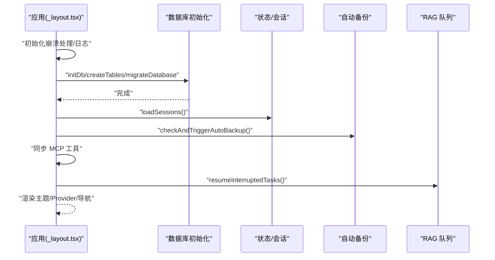
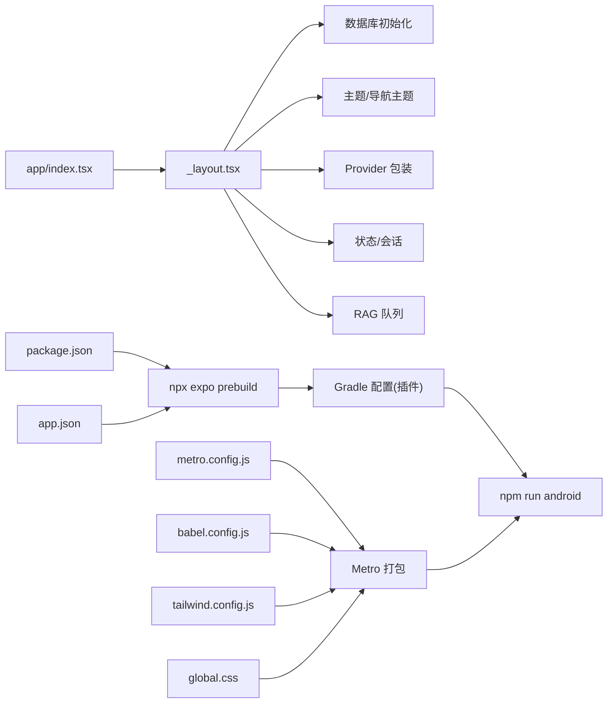

# 快速开始

<cite>
**本文引用的文件**
- [package.json](file://package.json)
- [README.md](file://README.md)
- [app.json](file://app.json)
- [metro.config.js](file://metro.config.js)
- [babel.config.js](file://babel.config.js)
- [tsconfig.json](file://tsconfig.json)
- [tailwind.config.js](file://tailwind.config.js)
- [global.css](file://global.css)
- [nativewind-env.d.ts](file://nativewind-env.d.ts)
- [plugins/withCustomApkName.js](file://plugins/withCustomApkName.js)
- [plugins/withAndroidDebugConfig.js](file://plugins/withAndroidDebugConfig.js)
- [scripts/diagnose_gradle.js](file://scripts/diagnose_gradle.js)
- [app/_layout.tsx](file://app/_layout.tsx)
- [app/index.tsx](file://app/index.tsx)
</cite>

## 目录
1. [简介](#简介)
2. [项目结构](#项目结构)
3. [核心组件](#核心组件)
4. [架构总览](#架构总览)
5. [详细组件分析](#详细组件分析)
6. [依赖关系分析](#依赖关系分析)
7. [性能考虑](#性能考虑)
8. [故障排查指南](#故障排查指南)
9. [结论](#结论)
10. [附录](#附录)

## 简介
本指南面向首次接触 Nexara 的开发者，帮助你在最短时间内完成环境准备、项目克隆、依赖安装、预构建与运行，并理解关键配置文件的作用与必要修改点。Nexara 是一个基于 Expo SDK 54 + React Native 的 Android AI 助手客户端，强调本地优先的数据管理与多提供商模型接入，支持 RAG、Agent、MCP 协议、本地推理与 Workbench 实验性功能。

## 项目结构
Nexara 采用以功能与层次划分的组织方式：
- app/：移动端路由与页面入口，使用 Expo Router 文件系统路由
- src/：核心业务逻辑、组件、服务、状态管理与类型定义
- plugins/：Expo 配置插件，用于 Gradle 构建期定制（如 APK 名称、调试配置、签名、前台服务等）
- scripts/：构建与诊断脚本（版本升级、Gradle 诊断、USB/IP 桥接等）
- web-client/：配套 Web 管理面板（可选）
- 配置文件：package.json、app.json、metro.config.js、babel.config.js、tsconfig.json、tailwind.config.js、global.css 等

**图表来源**
- [app/_layout.tsx:1-191](file://app/_layout.tsx#L1-L191)
- [app/index.tsx:1-18](file://app/index.tsx#L1-L18)
- [package.json:1-120](file://package.json#L1-L120)
- [app.json:1-64](file://app.json#L1-L64)
- [metro.config.js:1-13](file://metro.config.js#L1-L13)
- [babel.config.js:1-14](file://babel.config.js#L1-L14)
- [tsconfig.json:1-14](file://tsconfig.json#L1-L14)
- [tailwind.config.js:1-34](file://tailwind.config.js#L1-L34)
- [global.css:1-31](file://global.css#L1-L31)
- [nativewind-env.d.ts:1-3](file://nativewind-env.d.ts#L1-L3)
- [plugins/withCustomApkName.js:1-85](file://plugins/withCustomApkName.js#L1-L85)
- [plugins/withAndroidDebugConfig.js:1-54](file://plugins/withAndroidDebugConfig.js#L1-L54)
- [scripts/diagnose_gradle.js:1-11](file://scripts/diagnose_gradle.js#L1-L11)

**章节来源**
- [README.md:62-70](file://README.md#L62-L70)
- [README.md:134-142](file://README.md#L134-L142)

## 核心组件
- 应用入口与主题/导航初始化：app/_layout.tsx 负责数据库初始化、会话恢复、队列恢复、崩溃处理注册、主题映射与全局 Provider 包装
- 首屏路由：app/index.tsx 根据启动状态跳转到欢迎页或主聊天页
- 构建与样式：Metro、Babel、Tailwind/NativeWind 配置共同决定打包与样式编译行为
- 插件体系：Expo 配置插件在预构建阶段修改 Gradle，注入调试配置、APK 命名规则、签名与前台服务等

**章节来源**
- [app/_layout.tsx:1-191](file://app/_layout.tsx#L1-L191)
- [app/index.tsx:1-18](file://app/index.tsx#L1-L18)
- [metro.config.js:1-13](file://metro.config.js#L1-L13)
- [babel.config.js:1-14](file://babel.config.js#L1-L14)
- [tailwind.config.js:1-34](file://tailwind.config.js#L1-L34)
- [global.css:1-31](file://global.css#L1-L31)

## 架构总览
下图展示了从命令行到应用启动的关键路径，涵盖预构建、打包、运行与数据库初始化流程。

**图表来源**
- [package.json:5-12](file://package.json#L5-L12)
- [app.json:1-64](file://app.json#L1-L64)
- [plugins/withCustomApkName.js:1-85](file://plugins/withCustomApkName.js#L1-L85)
- [plugins/withAndroidDebugConfig.js:1-54](file://plugins/withAndroidDebugConfig.js#L1-L54)
- [app/_layout.tsx:82-137](file://app/_layout.tsx#L82-L137)

## 详细组件分析

### 环境准备与安装
- Node.js 与包管理器
  - 使用 npm、yarn 或 pnpm 均可；建议使用与团队一致的工具
  - 安装完成后，确保 npm/yarn/pnpm 版本满足项目要求（详见 package.json 的 devDependencies）
- Expo CLI
  - 通过 npx 直接运行，无需全局安装
  - 预构建与运行均通过 npx expo 调用
- Android 开发环境
  - 安装 Android Studio 并配置 Android SDK、平台工具与系统镜像
  - 启用开发者选项与 USB 调试，或准备模拟器
  - 确保 ANDROID_HOME 或 ANDROID_SDK_ROOT 环境变量正确指向 SDK 路径
  - 如需签名与发布，准备密钥库并在 app.json 的 android 字段配置

**章节来源**
- [README.md:62-70](file://README.md#L62-L70)
- [README.md:134-142](file://README.md#L134-L142)
- [app.json:20-39](file://app.json#L20-L39)

### 项目克隆与依赖安装
- 克隆仓库后，进入项目目录
- 安装依赖：npm install
  - 该命令会读取 package.json 的 dependencies 与 devDependencies，并执行 postinstall 钩子（如 patch-package）

**章节来源**
- [README.md:62-70](file://README.md#L62-L70)
- [README.md:134-142](file://README.md#L134-L142)
- [package.json:1-120](file://package.json#L1-L120)

### 预构建与构建配置
- 预构建：npx expo prebuild
  - 作用：根据 app.json 与 plugins 目录中的插件生成/更新原生工程配置（如 Gradle、Info.plist 等）
  - 关键插件：
    - 自定义 APK 名称：plugins/withCustomApkName.js
    - Android 调试配置：plugins/withAndroidDebugConfig.js
    - 其他插件：签名、宽色域、原生库标签、前台服务等
- Metro 配置：metro.config.js
  - 继承 Expo 默认配置，启用 NativeWind，扩展 watchFolders 与 asset 处理
- Babel 配置：babel.config.js
  - 预设包含 babel-preset-expo 与 nativewind/babel，并启用 react-native-reanimated 与 worklets 插件
- TypeScript 配置：tsconfig.json
  - 继承 expo/tsconfig.base，开启严格模式，排除 web-client 与测试目录
- Tailwind/NativeWind：tailwind.config.js 与 global.css
  - content 指向 app 与 src 下的 TS/JS/TSX 文件，使用 nativewind/preset
  - global.css 定义暗/亮主题颜色变量，供 Tailwind 类使用

**图表来源**
- [app.json:43-61](file://app.json#L43-L61)
- [plugins/withCustomApkName.js:1-85](file://plugins/withCustomApkName.js#L1-L85)
- [plugins/withAndroidDebugConfig.js:1-54](file://plugins/withAndroidDebugConfig.js#L1-L54)
- [metro.config.js:1-13](file://metro.config.js#L1-L13)
- [babel.config.js:1-14](file://babel.config.js#L1-L14)
- [tsconfig.json:1-14](file://tsconfig.json#L1-L14)
- [tailwind.config.js:1-34](file://tailwind.config.js#L1-L34)
- [global.css:1-31](file://global.css#L1-L31)

**章节来源**
- [app.json:1-64](file://app.json#L1-L64)
- [metro.config.js:1-13](file://metro.config.js#L1-L13)
- [babel.config.js:1-14](file://babel.config.js#L1-L14)
- [tsconfig.json:1-14](file://tsconfig.json#L1-L14)
- [tailwind.config.js:1-34](file://tailwind.config.js#L1-L34)
- [global.css:1-31](file://global.css#L1-L31)

### 运行与调试
- 运行 Android：npm run android
  - 通过 npx expo run:android 启动设备/模拟器上的应用
- 运行 iOS：npm run ios（如已配置）
- 运行 Web：npm run web
- 调试 Gradle 问题：scripts/diagnose_gradle.js
  - 读取 android/app/build.gradle 并逐行打印，便于定位构建配置问题

**章节来源**
- [package.json:5-12](file://package.json#L5-L12)
- [scripts/diagnose_gradle.js:1-11](file://scripts/diagnose_gradle.js#L1-L11)

### 应用启动流程与数据库初始化
- app/_layout.tsx 在应用启动时执行：
  - 初始化崩溃处理、日志系统
  - 初始化数据库、创建表、执行迁移
  - 加载会话、触发自动备份、同步 MCP 工具、恢复 RAG 队列
  - 设置主题、导航主题、Provider 包装与状态栏
- app/index.tsx 根据启动状态决定跳转至欢迎页或主聊天页

**图表来源**
- [app/_layout.tsx:82-137](file://app/_layout.tsx#L82-L137)

**章节来源**
- [app/_layout.tsx:1-191](file://app/_layout.tsx#L1-L191)
- [app/index.tsx:1-18](file://app/index.tsx#L1-L18)

### 配置文件详解与必要修改项
- package.json
  - scripts：包含 start、android、ios、web、版本升级脚本与 postinstall
  - dependencies/devDependencies：声明运行时与开发时依赖
  - op-sqlite：启用 FTS5
- app.json
  - expo 字段：应用元数据、图标、启动图、权限、iOS/Android 包标识与构建参数
  - plugins：启用 expo-router、expo-font、expo-image-picker 权限文案、自定义插件与资产插件
- metro.config.js
  - 继承默认配置，启用 NativeWind，扩展 nodeModulesPaths 与 assetExts
- babel.config.js
  - 预设与插件：babel-preset-expo、nativewind/babel、reanimated、worklets
- tsconfig.json
  - 继承 expo/base，开启严格模式，排除 web-client 与测试
- tailwind.config.js 与 global.css
  - content 扫描范围、nativewind/preset、颜色变量定义
- plugins/*
  - withCustomApkName.js：自定义 APK 输出命名规则
  - withAndroidDebugConfig.js：在 debug 构建注入 applicationIdSuffix 与应用名
- scripts/diagnose_gradle.js：诊断 build.gradle 内容

**章节来源**
- [package.json:1-120](file://package.json#L1-L120)
- [app.json:1-64](file://app.json#L1-L64)
- [metro.config.js:1-13](file://metro.config.js#L1-L13)
- [babel.config.js:1-14](file://babel.config.js#L1-L14)
- [tsconfig.json:1-14](file://tsconfig.json#L1-L14)
- [tailwind.config.js:1-34](file://tailwind.config.js#L1-L34)
- [global.css:1-31](file://global.css#L1-L31)
- [plugins/withCustomApkName.js:1-85](file://plugins/withCustomApkName.js#L1-L85)
- [plugins/withAndroidDebugConfig.js:1-54](file://plugins/withAndroidDebugConfig.js#L1-L54)
- [scripts/diagnose_gradle.js:1-11](file://scripts/diagnose_gradle.js#L1-L11)

## 依赖关系分析
- 应用入口依赖于多个核心模块：数据库初始化、主题系统、导航主题、Provider 包装、状态管理与本地模型加载
- 构建链路依赖 Metro、Babel、Tailwind/NativeWind 与 Expo 预构建
- 插件链路依赖 app.json 的 plugins 列表，按顺序修改 Gradle 配置

**图表来源**
- [app/index.tsx:1-18](file://app/index.tsx#L1-L18)
- [app/_layout.tsx:1-191](file://app/_layout.tsx#L1-L191)
- [package.json:5-12](file://package.json#L5-L12)
- [app.json:43-61](file://app.json#L43-L61)
- [metro.config.js:1-13](file://metro.config.js#L1-L13)
- [babel.config.js:1-14](file://babel.config.js#L1-L14)
- [tailwind.config.js:1-34](file://tailwind.config.js#L1-L34)
- [global.css:1-31](file://global.css#L1-L31)

**章节来源**
- [app/index.tsx:1-18](file://app/index.tsx#L1-L18)
- [app/_layout.tsx:1-191](file://app/_layout.tsx#L1-L191)
- [package.json:1-120](file://package.json#L1-L120)
- [app.json:1-64](file://app.json#L1-L64)

## 性能考虑
- 预构建仅在配置变更或插件更新时需要重新执行，避免频繁运行导致时间浪费
- Metro watchFolders 与 assetExts 的合理配置有助于减少不必要的扫描开销
- Tailwind/NativeWind 的 content 范围应尽量精确，避免扫描过多文件
- 严格 TypeScript 检查可提前发现潜在性能与类型问题
- Reanimated 与 worklets 插件启用可提升动画与计算性能，但需注意配置一致性

## 故障排查指南
- 预构建失败
  - 检查 app.json 的 plugins 列表与插件文件是否存在语法错误
  - 若修改了插件（如 withCustomApkName.js、withAndroidDebugConfig.js），需重新执行 npx expo prebuild
- Gradle 构建异常
  - 使用 scripts/diagnose_gradle.js 查看 android/app/build.gradle 的实际内容，确认插件注入是否生效
  - 确认 ANDROID_HOME/ANDROID_SDK_ROOT 环境变量正确
- 设备/模拟器无法连接或安装失败
  - 确保开发者选项与 USB 调试已启用
  - 尝试重启 ADB：adb kill-server && adb start-server
- 样式未生效
  - 确认 tailwind.config.js 的 content 路径包含对应组件文件
  - 确认 global.css 已被 Metro/NativeWind 正确引入
- 数据库初始化失败
  - 检查数据库初始化流程与迁移脚本，关注 app/_layout.tsx 中的日志与错误分支

**章节来源**
- [scripts/diagnose_gradle.js:1-11](file://scripts/diagnose_gradle.js#L1-L11)
- [plugins/withCustomApkName.js:1-85](file://plugins/withCustomApkName.js#L1-L85)
- [plugins/withAndroidDebugConfig.js:1-54](file://plugins/withAndroidDebugConfig.js#L1-L54)
- [tailwind.config.js:1-34](file://tailwind.config.js#L1-L34)
- [global.css:1-31](file://global.css#L1-L31)
- [app/_layout.tsx:82-137](file://app/_layout.tsx#L82-L137)

## 结论
按照本指南完成环境准备、依赖安装、预构建与运行后，你将能在 Android 设备或模拟器上成功启动 Nexara，并体验其核心功能。遇到问题时，可依据故障排查指南逐步定位与解决。随着对配置文件与插件机制的深入理解，你可以更灵活地定制构建流程与运行参数。

## 附录
- 快速开始命令（中文）
  - git clone https://github.com/NarcisWL/Nexara.git
  - cd Nexara
  - npm install
  - npx expo prebuild
  - npm run android
- 快速开始命令（英文）
  - git clone https://github.com/NarcisWL/Nexara.git
  - cd Nexara
  - npm install
  - npx expo prebuild
  - npm run android

**章节来源**
- [README.md:62-70](file://README.md#L62-L70)
- [README.md:134-142](file://README.md#L134-L142)