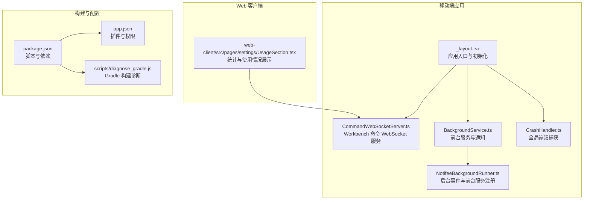
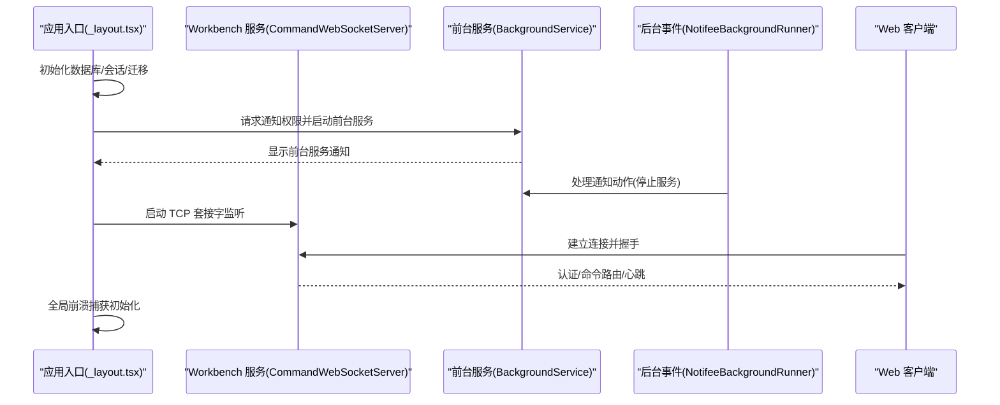
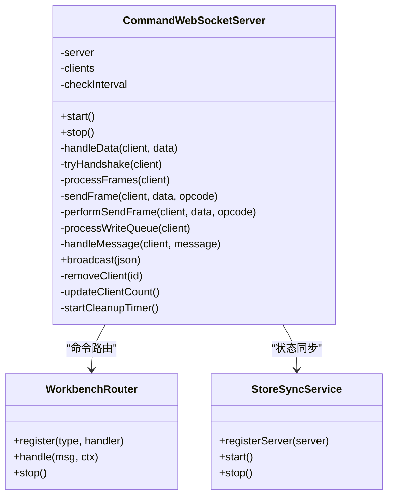
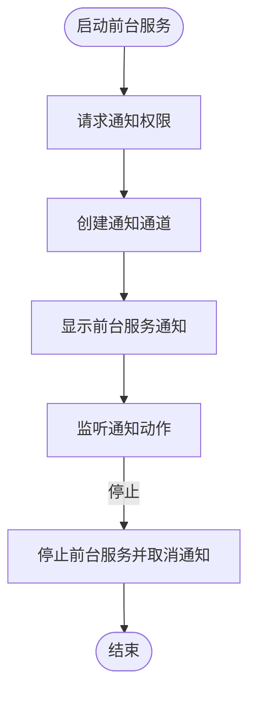
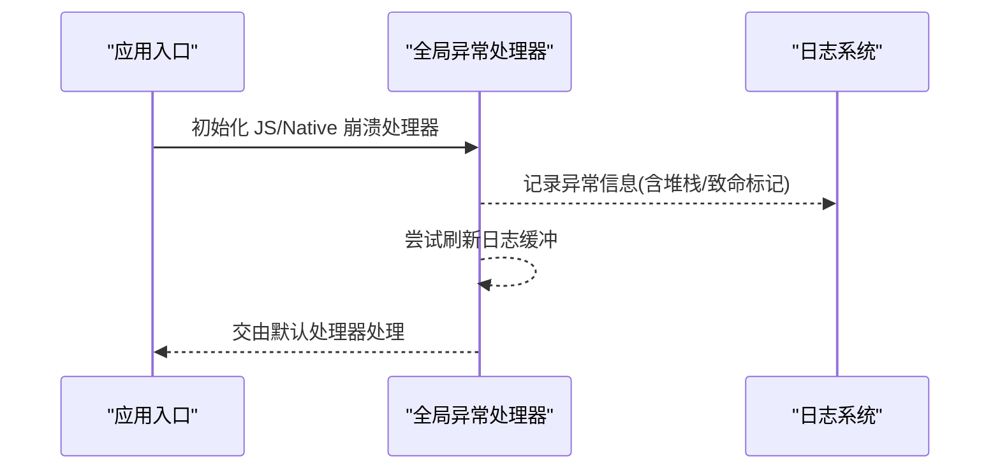
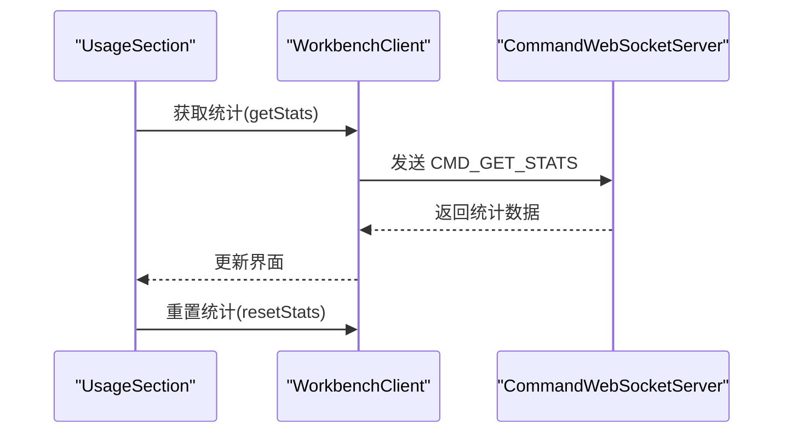
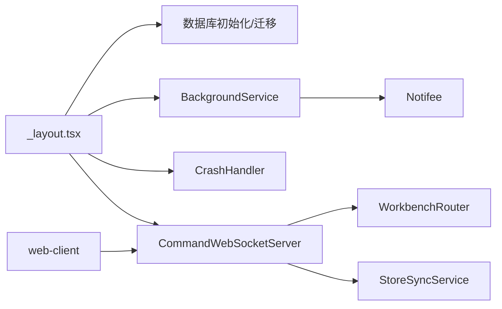

# 故障排除

<cite>
**本文引用的文件**
- [README.md](file://README.md)
- [package.json](file://package.json)
- [app.json](file://app.json)
- [app/_layout.tsx](file://app/_layout.tsx)
- [src/services/workbench/CommandWebSocketServer.ts](file://src/services/workbench/CommandWebSocketServer.ts)
- [src/services/BackgroundService.ts](file://src/services/BackgroundService.ts)
- [src/services/NotifeeBackgroundRunner.ts](file://src/services/NotifeeBackgroundRunner.ts)
- [src/lib/logging/CrashHandler.ts](file://src/lib/logging/CrashHandler.ts)
- [scripts/diagnose_gradle.js](file://scripts/diagnose_gradle.js)
- [web-client/src/pages/settings/UsageSection.tsx](file://web-client/src/pages/settings/UsageSection.tsx)
- [src/lib/rag/memory-manager.ts](file://src/lib/rag/memory-manager.ts)
</cite>

## 目录
1. [简介](#简介)
2. [项目结构](#项目结构)
3. [核心组件](#核心组件)
4. [架构总览](#架构总览)
5. [详细组件分析](#详细组件分析)
6. [依赖关系分析](#依赖关系分析)
7. [性能考量](#性能考量)
8. [故障排除指南](#故障排除指南)
9. [结论](#结论)
10. [附录](#附录)

## 简介
本指南面向 Nexara 项目的使用者与维护者，提供系统化的故障排除流程与方法，覆盖安装问题、运行时错误、性能问题与兼容性问题；并给出调试方法、诊断工具、日志分析、错误追踪与性能分析建议。同时区分开发与生产环境的排查策略，并说明崩溃报告的收集与分析方式，最后提供社区支持与问题反馈渠道。

## 项目结构
Nexara 是一个基于 Expo SDK 54 + React Native 的 Android 客户端，具备本地优先的数据管理、多提供商模型接入、RAG 知识引擎、Agent 系统、MCP 协议、本地推理与 Workbench 实验性功能。项目采用 TypeScript、Zustand 状态管理、op-sqlite 数据库、Reanimated 4 动画与 Vite + React 18 的 Web 客户端。

**图表来源**
- [app/_layout.tsx:1-191](file://app/_layout.tsx#L1-L191)
- [src/services/workbench/CommandWebSocketServer.ts:1-488](file://src/services/workbench/CommandWebSocketServer.ts#L1-L488)
- [src/services/BackgroundService.ts:1-117](file://src/services/BackgroundService.ts#L1-L117)
- [src/services/NotifeeBackgroundRunner.ts:1-28](file://src/services/NotifeeBackgroundRunner.ts#L1-L28)
- [src/lib/logging/CrashHandler.ts:1-52](file://src/lib/logging/CrashHandler.ts#L1-L52)
- [web-client/src/pages/settings/UsageSection.tsx:1-45](file://web-client/src/pages/settings/UsageSection.tsx#L1-L45)
- [package.json:1-120](file://package.json#L1-L120)
- [app.json:1-64](file://app.json#L1-L64)
- [scripts/diagnose_gradle.js:1-11](file://scripts/diagnose_gradle.js#L1-L11)

**章节来源**
- [README.md:1-161](file://README.md#L1-L161)
- [package.json:1-120](file://package.json#L1-L120)
- [app.json:1-64](file://app.json#L1-L64)

## 核心组件
- 应用入口与初始化：负责数据库初始化、会话加载、队列恢复、自动备份触发、主题与国际化等。
- Workbench 命令 WebSocket 服务：提供 TCP 套接字上的 WebSocket 兼容协议，承载认证、聊天、知识库、统计与备份等命令。
- 前台服务与通知：通过 Notifee 创建前台服务通知，支持停止操作；并提供电池优化建议。
- 全局崩溃捕获：统一捕获 JS 与 Native 层未处理异常，输出日志并尝试刷新缓冲。
- Web 客户端统计：通过 Workbench 客户端拉取统计信息，用于性能与用量监控。

**章节来源**
- [app/_layout.tsx:82-137](file://app/_layout.tsx#L82-L137)
- [src/services/workbench/CommandWebSocketServer.ts:33-178](file://src/services/workbench/CommandWebSocketServer.ts#L33-L178)
- [src/services/BackgroundService.ts:3-83](file://src/services/BackgroundService.ts#L3-L83)
- [src/lib/logging/CrashHandler.ts:8-52](file://src/lib/logging/CrashHandler.ts#L8-L52)
- [web-client/src/pages/settings/UsageSection.tsx:7-33](file://web-client/src/pages/settings/UsageSection.tsx#L7-L33)

## 架构总览
下图展示了移动端应用、Workbench 服务与 Web 客户端之间的交互关系，以及崩溃处理与前台服务的关键节点。

**图表来源**
- [app/_layout.tsx:13-18](file://app/_layout.tsx#L13-L18)
- [src/services/BackgroundService.ts:8-71](file://src/services/BackgroundService.ts#L8-L71)
- [src/services/NotifeeBackgroundRunner.ts:5-17](file://src/services/NotifeeBackgroundRunner.ts#L5-L17)
- [src/services/workbench/CommandWebSocketServer.ts:44-178](file://src/services/workbench/CommandWebSocketServer.ts#L44-L178)

## 详细组件分析

### 组件一：Workbench 命令 WebSocket 服务
该服务以 TCP 套接字为基础，实现 WebSocket 握手、帧解析、认证与命令路由，支持心跳检测与写队列原子化发送，具备端口占用重试与超时清理机制。

**图表来源**
- [src/services/workbench/CommandWebSocketServer.ts:33-488](file://src/services/workbench/CommandWebSocketServer.ts#L33-L488)

**章节来源**
- [src/services/workbench/CommandWebSocketServer.ts:44-178](file://src/services/workbench/CommandWebSocketServer.ts#L44-L178)
- [src/services/workbench/CommandWebSocketServer.ts:192-484](file://src/services/workbench/CommandWebSocketServer.ts#L192-L484)

### 组件二：前台服务与通知
前台服务通过 Notifee 创建持续通知，允许用户在通知栏直接停止服务；并提供电池优化设置入口建议。

**图表来源**
- [src/services/BackgroundService.ts:8-83](file://src/services/BackgroundService.ts#L8-L83)
- [src/services/NotifeeBackgroundRunner.ts:5-17](file://src/services/NotifeeBackgroundRunner.ts#L5-L17)

**章节来源**
- [src/services/BackgroundService.ts:85-113](file://src/services/BackgroundService.ts#L85-L113)
- [src/services/NotifeeBackgroundRunner.ts:19-28](file://src/services/NotifeeBackgroundRunner.ts#L19-L28)

### 组件三：全局崩溃捕获
在应用入口初始化崩溃处理器，分别捕获 JS 与 Native 层未处理异常，并尝试刷新日志缓冲。

**图表来源**
- [src/lib/logging/CrashHandler.ts:8-52](file://src/lib/logging/CrashHandler.ts#L8-L52)
- [app/_layout.tsx:14-18](file://app/_layout.tsx#L14-L18)

**章节来源**
- [src/lib/logging/CrashHandler.ts:14-31](file://src/lib/logging/CrashHandler.ts#L14-L31)
- [src/lib/logging/CrashHandler.ts:35-49](file://src/lib/logging/CrashHandler.ts#L35-L49)

### 组件四：Web 客户端统计与使用情况
Web 客户端通过 Workbench 客户端获取统计信息，便于在浏览器中查看全局用量与性能指标。

**图表来源**
- [web-client/src/pages/settings/UsageSection.tsx:16-33](file://web-client/src/pages/settings/UsageSection.tsx#L16-L33)
- [src/services/workbench/CommandWebSocketServer.ts:160-167](file://src/services/workbench/CommandWebSocketServer.ts#L160-L167)

**章节来源**
- [web-client/src/pages/settings/UsageSection.tsx:7-33](file://web-client/src/pages/settings/UsageSection.tsx#L7-L33)

## 依赖关系分析
- 应用入口依赖数据库初始化、会话加载、队列恢复与自动备份；同时注册前台服务与崩溃处理。
- Workbench 服务依赖路由与状态同步服务，提供命令处理能力。
- 前台服务依赖 Notifee，负责通知与后台事件处理。
- Web 客户端通过 Workbench 客户端与服务通信，获取统计信息。

**图表来源**
- [app/_layout.tsx:87-137](file://app/_layout.tsx#L87-L137)
- [src/services/workbench/CommandWebSocketServer.ts:134-178](file://src/services/workbench/CommandWebSocketServer.ts#L134-L178)
- [src/services/BackgroundService.ts:3-83](file://src/services/BackgroundService.ts#L3-L83)
- [src/lib/logging/CrashHandler.ts:8-52](file://src/lib/logging/CrashHandler.ts#L8-L52)

**章节来源**
- [app/_layout.tsx:87-137](file://app/_layout.tsx#L87-L137)
- [src/services/workbench/CommandWebSocketServer.ts:134-178](file://src/services/workbench/CommandWebSocketServer.ts#L134-L178)

## 性能考量
- RAG 检索与重排序：内存管理与检索指标可用于评估召回数量、最终结果数与最大相似度，辅助定位检索性能瓶颈。
- WebSocket 写入：大帧分片与写队列原子化发送降低丢包风险，但需关注网络拥塞与写入超时。
- 前台服务：持续通知与心跳检测提升可用性，但需注意电池优化与系统限制。

**章节来源**
- [src/lib/rag/memory-manager.ts:586-614](file://src/lib/rag/memory-manager.ts#L586-L614)
- [src/services/workbench/CommandWebSocketServer.ts:370-413](file://src/services/workbench/CommandWebSocketServer.ts#L370-L413)

## 故障排除指南

### 一、安装与构建问题
- 环境要求与脚本
  - 使用 npm 安装依赖后执行预构建，再运行 Android 设备或模拟器。
  - 若遇到端口占用导致服务启动失败，服务具备重试与回退逻辑，可等待或更换端口。
- Android 权限与签名
  - app.json 中声明了摄像头、存储、媒体读取等权限；若出现权限相关问题，请检查设备设置与权限弹窗。
  - 构建签名与打包配置可通过插件进行调整，必要时参考 Gradle 诊断脚本逐行检查构建脚本内容。
- 依赖版本冲突
  - package.json 中列出所有依赖与版本；若出现编译或运行期异常，优先核对依赖版本与平台兼容性。

**章节来源**
- [README.md:62-70](file://README.md#L62-L70)
- [app.json:30-38](file://app.json#L30-L38)
- [scripts/diagnose_gradle.js:1-11](file://scripts/diagnose_gradle.js#L1-L11)
- [package.json:14-95](file://package.json#L14-L95)

### 二、运行时错误

#### 1) Workbench 服务无法启动或端口被占用
- 现象
  - 控制台提示端口占用并重试，最终失败。
- 排查步骤
  - 检查端口占用进程并释放；确认服务端口配置与防火墙设置。
  - 查看服务启动日志中的重试次数与等待时间，确认是否达到最大重试上限。
- 相关实现位置
  - 端口占用重试与错误处理、路由注册与启动流程。

**章节来源**
- [src/services/workbench/CommandWebSocketServer.ts:113-131](file://src/services/workbench/CommandWebSocketServer.ts#L113-L131)
- [src/services/workbench/CommandWebSocketServer.ts:168-178](file://src/services/workbench/CommandWebSocketServer.ts#L168-L178)

#### 2) WebSocket 握手失败或认证被拒绝
- 现象
  - 客户端握手后立即断开，或收到认证必需提示。
- 排查步骤
  - 确认客户端按规范发送握手头与密钥；确保仅在认证成功后发送其他命令。
  - 检查服务端日志中握手与命令处理分支。
- 相关实现位置
  - 握手计算与响应、认证前置校验与命令路由。

**章节来源**
- [src/services/workbench/CommandWebSocketServer.ts:203-239](file://src/services/workbench/CommandWebSocketServer.ts#L203-L239)
- [src/services/workbench/CommandWebSocketServer.ts:415-444](file://src/services/workbench/CommandWebSocketServer.ts#L415-L444)

#### 3) 前台服务通知无法显示或无法停止
- 现象
  - 通知未显示、点击无响应或无法停止。
- 排查步骤
  - 检查通知权限是否授予；确认通知通道创建成功。
  - 通过通知动作触发停止逻辑，验证后台事件监听是否生效。
- 相关实现位置
  - 通知创建与前台服务类型；后台事件监听与停止流程。

**章节来源**
- [src/services/BackgroundService.ts:33-64](file://src/services/BackgroundService.ts#L33-L64)
- [src/services/NotifeeBackgroundRunner.ts:5-17](file://src/services/NotifeeBackgroundRunner.ts#L5-L17)

#### 4) 应用崩溃或 Native 异常
- 现象
  - 应用闪退或系统弹出崩溃提示。
- 排查步骤
  - 启动时初始化全局崩溃处理器，确保异常被捕获并记录。
  - 检查日志缓冲刷新与默认处理器链路，避免日志丢失。
- 相关实现位置
  - JS 与 Native 崩溃处理器初始化与回调。

**章节来源**
- [src/lib/logging/CrashHandler.ts:8-52](file://src/lib/logging/CrashHandler.ts#L8-L52)
- [app/_layout.tsx:14-18](file://app/_layout.tsx#L14-L18)

### 三、性能问题

#### 1) RAG 检索耗时过长
- 现象
  - 检索与重排序耗时显著增加。
- 排查步骤
  - 关注检索指标（搜索时间、重排序时间、总时间、召回数、最终结果数、最大相似度）。
  - 分析来源分布（记忆与文档），定位热点来源与阈值设置。
- 相关实现位置
  - 检索指标聚合与日志输出。

**章节来源**
- [src/lib/rag/memory-manager.ts:586-614](file://src/lib/rag/memory-manager.ts#L586-L614)

#### 2) WebSocket 写入阻塞或丢包
- 现象
  - 大消息发送缓慢或断连。
- 排查步骤
  - 检查分片大小与写队列原子化发送；关注 drain 事件与超时回退。
  - 观察日志中大帧记录，结合网络状况判断是否需要降低消息体大小。
- 相关实现位置
  - 分片写入与写队列处理。

**章节来源**
- [src/services/workbench/CommandWebSocketServer.ts:370-413](file://src/services/workbench/CommandWebSocketServer.ts#L370-L413)
- [src/services/workbench/CommandWebSocketServer.ts:326-341](file://src/services/workbench/CommandWebSocketServer.ts#L326-L341)

#### 3) 前台服务耗电过高
- 现象
  - 设备发热或电量消耗异常。
- 排查步骤
  - 检查通知频率与心跳间隔；确认电池优化策略与系统限制。
  - 如需后台运行，考虑关闭不必要的前台服务或降低心跳频率。
- 相关实现位置
  - 前台服务与心跳定时器。

**章节来源**
- [src/services/BackgroundService.ts:41-64](file://src/services/BackgroundService.ts#L41-L64)
- [src/services/workbench/CommandWebSocketServer.ts:471-484](file://src/services/workbench/CommandWebSocketServer.ts#L471-L484)

### 四、兼容性问题

#### 1) Android 权限与存储
- 现象
  - 相册/相机/存储访问受限导致功能不可用。
- 排查步骤
  - 在设备设置中检查权限状态；重新授权后重试。
  - 确认 app.json 中权限声明与运行时弹窗一致。
- 相关实现位置
  - 权限声明与运行时权限弹窗文案。

**章节来源**
- [app.json:30-38](file://app.json#L30-L38)

#### 2) 本地推理与模型
- 现象
  - 本地推理不稳定或模型不兼容。
- 排查步骤
  - 确认模型格式与 GPU 加速支持；逐步缩小问题范围。
  - 结合日志与指标观察推理耗时与稳定性。
- 相关实现位置
  - 本地推理模块与实验性功能标注。

**章节来源**
- [README.md:32-34](file://README.md#L32-L34)

### 五、调试与诊断

#### 1) 日志分析
- 应用入口初始化日志：数据库初始化、会话加载、队列恢复、自动备份触发等。
- Workbench 服务日志：连接、握手、命令处理、心跳与清理。
- 崩溃日志：JS 与 Native 异常记录，包含堆栈与致命标记。

**章节来源**
- [app/_layout.tsx:93-128](file://app/_layout.tsx#L93-L128)
- [src/services/workbench/CommandWebSocketServer.ts:64-105](file://src/services/workbench/CommandWebSocketServer.ts#L64-L105)
- [src/lib/logging/CrashHandler.ts:15-49](file://src/lib/logging/CrashHandler.ts#L15-L49)

#### 2) 错误追踪
- 前台服务动作追踪：通过通知动作停止服务，验证后台事件监听。
- WebSocket 命令追踪：确认命令类型与路由处理，定位认证与权限问题。

**章节来源**
- [src/services/NotifeeBackgroundRunner.ts:5-17](file://src/services/NotifeeBackgroundRunner.ts#L5-L17)
- [src/services/workbench/CommandWebSocketServer.ts:436-444](file://src/services/workbench/CommandWebSocketServer.ts#L436-L444)

#### 3) 性能分析
- 使用 Web 客户端统计页面查看全局用量与性能指标，结合 RAG 检索指标定位瓶颈。
- 关注 WebSocket 大帧日志与写队列状态，评估网络与吞吐。

**章节来源**
- [web-client/src/pages/settings/UsageSection.tsx:16-33](file://web-client/src/pages/settings/UsageSection.tsx#L16-L33)
- [src/lib/rag/memory-manager.ts:586-614](file://src/lib/rag/memory-manager.ts#L586-L614)

### 六、不同平台与环境的解决方案

#### 1) 开发环境
- 使用 Expo Dev Client 与热重载；启用调试日志与崩溃捕获。
- 通过 Web 客户端进行远程管理与统计查看。
- 使用 Gradle 诊断脚本快速定位构建问题。

**章节来源**
- [README.md:62-70](file://README.md#L62-L70)
- [scripts/diagnose_gradle.js:1-11](file://scripts/diagnose_gradle.js#L1-11)

#### 2) 生产环境
- 确保前台服务权限与通知通道稳定；提供电池优化设置入口。
- 严格控制 WebSocket 大帧与写队列，避免长时间阻塞。
- 通过崩溃处理器与日志系统收集异常信息，定期审计。

**章节来源**
- [src/services/BackgroundService.ts:85-113](file://src/services/BackgroundService.ts#L85-L113)
- [src/services/workbench/CommandWebSocketServer.ts:370-413](file://src/services/workbench/CommandWebSocketServer.ts#L370-L413)
- [src/lib/logging/CrashHandler.ts:8-52](file://src/lib/logging/CrashHandler.ts#L8-L52)

### 七、崩溃报告收集与分析
- 收集内容
  - JS 与 Native 异常信息、堆栈、致命标记与时间戳。
  - Workbench 服务日志（握手、命令、心跳、清理）。
  - 数据库初始化与迁移日志、会话加载与队列恢复日志。
- 分析方法
  - 优先定位异常发生阶段（JS 初始化、Native 层、网络层）。
  - 结合日志时间线与调用链，复现最小可重现场景。
  - 对照依赖版本与平台差异，缩小问题范围。

**章节来源**
- [src/lib/logging/CrashHandler.ts:15-49](file://src/lib/logging/CrashHandler.ts#L15-L49)
- [app/_layout.tsx:93-128](file://app/_layout.tsx#L93-L128)
- [src/services/workbench/CommandWebSocketServer.ts:64-105](file://src/services/workbench/CommandWebSocketServer.ts#L64-L105)

### 八、社区支持与问题反馈
- 项目主页与技术栈说明可作为背景参考。
- 提交问题前请附带：
  - 环境信息（平台、版本、权限状态）
  - 复现步骤与日志片段
  - 相关截图或最小可重现示例

**章节来源**
- [README.md:1-161](file://README.md#L1-L161)

## 结论
本指南围绕 Nexara 的核心组件与运行机制，提供了从安装、运行、性能到兼容性的系统化故障排除路径。通过日志分析、错误追踪与性能观测，结合开发与生产环境的差异化策略，能够有效定位并解决问题。建议在问题反馈时附带详尽的日志与环境信息，以加速定位与修复。

## 附录

### A. 常见问题清单
- 安装
  - 依赖安装失败：检查网络与缓存，重试安装。
  - 预构建失败：确认 Node 版本与 Expo CLI 版本匹配。
- 运行
  - 端口占用：释放端口或更换端口；查看重试日志。
  - 权限不足：在设置中授予所需权限。
  - 前台服务异常：检查通知权限与电池优化设置。
- 性能
  - RAG 检索慢：优化检索参数与阈值，减少热点来源。
  - WebSocket 大消息：拆分消息或降低频率。
- 兼容性
  - Android 权限与存储：核对 app.json 权限声明与设备设置。
  - 本地推理：确认模型格式与 GPU 支持。

### B. 诊断工具与脚本
- Gradle 诊断：逐行打印构建脚本，便于定位配置问题。
- Web 客户端统计：查看全局用量与性能指标，辅助定位问题。

**章节来源**
- [scripts/diagnose_gradle.js:1-11](file://scripts/diagnose_gradle.js#L1-L11)
- [web-client/src/pages/settings/UsageSection.tsx:16-33](file://web-client/src/pages/settings/UsageSection.tsx#L16-L33)