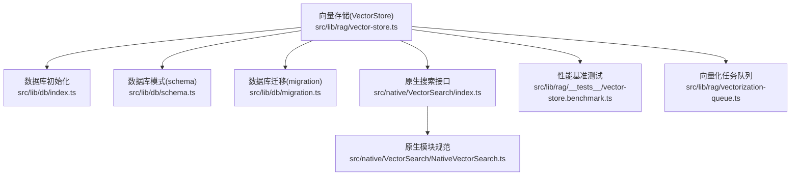
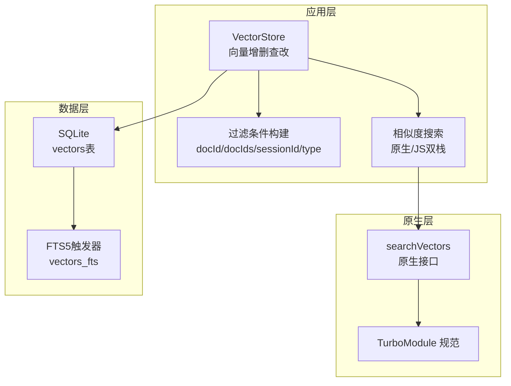
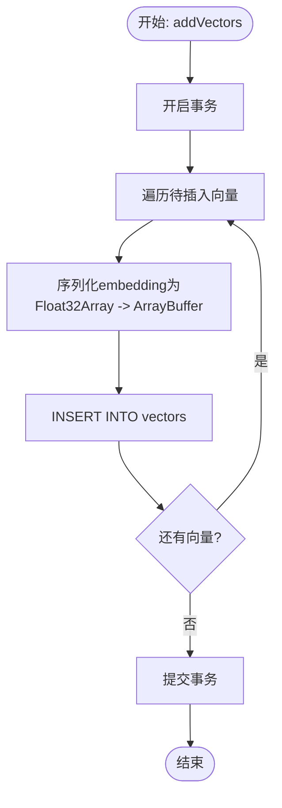
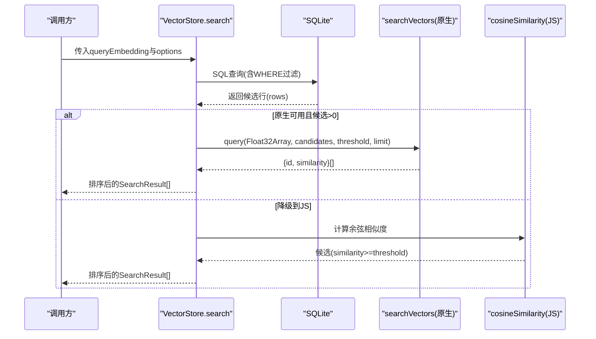
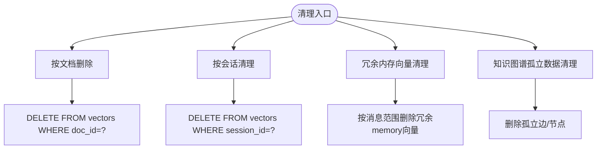
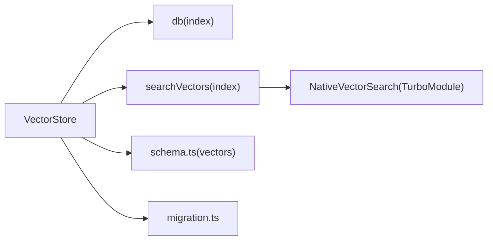

# 向量存储系统

<cite>
**本文引用的文件**
- [src/lib/rag/vector-store.ts](file://src/lib/rag/vector-store.ts)
- [src/native/VectorSearch/index.ts](file://src/native/VectorSearch/index.ts)
- [src/native/VectorSearch/NativeVectorSearch.ts](file://src/native/VectorSearch/NativeVectorSearch.ts)
- [src/lib/db/schema.ts](file://src/lib/db/schema.ts)
- [src/lib/db/migration.ts](file://src/lib/db/migration.ts)
- [src/lib/db/index.ts](file://src/lib/db/index.ts)
- [src/lib/rag/__tests__/vector-store.benchmark.ts](file://src/lib/rag/__tests__/vector-store.benchmark.ts)
- [src/lib/rag/vectorization-queue.ts](file://src/lib/rag/vectorization-queue.ts)
</cite>

## 目录
1. [简介](#简介)
2. [项目结构](#项目结构)
3. [核心组件](#核心组件)
4. [架构总览](#架构总览)
5. [详细组件分析](#详细组件分析)
6. [依赖关系分析](#依赖关系分析)
7. [性能考量](#性能考量)
8. [故障排查指南](#故障排查指南)
9. [结论](#结论)
10. [附录](#附录)

## 简介
本技术文档面向Nexara向量存储系统，围绕向量数据的BLOB存储机制、相似度计算算法、索引与查询优化、增量更新与删除、以及性能基准测试与容量规划进行深入解析。系统采用SQLite作为持久化存储，向量以Float32二进制BLOB形式存储，并通过原生模块加速相似度计算；同时提供基于SQL的过滤与全文检索能力，支撑大规模向量检索与知识图谱管理。

## 项目结构
向量存储相关的关键文件分布如下：
- 存储与检索：src/lib/rag/vector-store.ts
- 原生搜索接口：src/native/VectorSearch/index.ts、src/native/VectorSearch/NativeVectorSearch.ts
- 数据库模式与迁移：src/lib/db/schema.ts、src/lib/db/migration.ts、src/lib/db/index.ts
- 性能基准：src/lib/rag/__tests__/vector-store.benchmark.ts
- 向量化任务队列与持久化：src/lib/rag/vectorization-queue.ts

**图表来源**
- [src/lib/rag/vector-store.ts:1-376](file://src/lib/rag/vector-store.ts#L1-L376)
- [src/native/VectorSearch/index.ts:1-53](file://src/native/VectorSearch/index.ts#L1-L53)
- [src/native/VectorSearch/NativeVectorSearch.ts:1-18](file://src/native/VectorSearch/NativeVectorSearch.ts#L1-L18)
- [src/lib/db/schema.ts:153-170](file://src/lib/db/schema.ts#L153-L170)
- [src/lib/db/migration.ts:1-354](file://src/lib/db/migration.ts#L1-L354)
- [src/lib/db/index.ts:1-13](file://src/lib/db/index.ts#L1-L13)
- [src/lib/rag/__tests__/vector-store.benchmark.ts:1-78](file://src/lib/rag/__tests__/vector-store.benchmark.ts#L1-L78)
- [src/lib/rag/vectorization-queue.ts:638-803](file://src/lib/rag/vectorization-queue.ts#L638-L803)

**章节来源**
- [src/lib/rag/vector-store.ts:1-376](file://src/lib/rag/vector-store.ts#L1-L376)
- [src/lib/db/schema.ts:153-170](file://src/lib/db/schema.ts#L153-L170)
- [src/lib/db/migration.ts:1-354](file://src/lib/db/migration.ts#L1-L354)
- [src/lib/db/index.ts:1-13](file://src/lib/db/index.ts#L1-L13)
- [src/native/VectorSearch/index.ts:1-53](file://src/native/VectorSearch/index.ts#L1-L53)
- [src/native/VectorSearch/NativeVectorSearch.ts:1-18](file://src/native/VectorSearch/NativeVectorSearch.ts#L1-L18)
- [src/lib/rag/__tests__/vector-store.benchmark.ts:1-78](file://src/lib/rag/__tests__/vector-store.benchmark.ts#L1-L78)
- [src/lib/rag/vectorization-queue.ts:638-803](file://src/lib/rag/vectorization-queue.ts#L638-L803)

## 核心组件
- 向量记录模型：包含唯一ID、所属文档/会话、文本内容、嵌入向量、元数据、消息范围、创建时间等字段。
- 向量存储类：负责向量的BLOB序列化/反序列化、批量插入、过滤查询、相似度搜索（原生/降级）、删除与清理。
- 原生搜索接口：封装原生模块调用，提供阈值与数量限制的近似相似度检索。
- 数据库模式：vectors表以BLOB存储Float32向量，支持外键关联文档与会话，提供FTS5全文索引触发器。
- 性能基准：提供插入与平均查询耗时统计，辅助评估系统在不同规模下的表现。
- 向量化队列：持久化向量化任务状态，支持断点续传与恢复。

**章节来源**
- [src/lib/rag/vector-store.ts:5-21](file://src/lib/rag/vector-store.ts#L5-L21)
- [src/lib/rag/vector-store.ts:22-376](file://src/lib/rag/vector-store.ts#L22-L376)
- [src/native/VectorSearch/index.ts:15-52](file://src/native/VectorSearch/index.ts#L15-L52)
- [src/lib/db/schema.ts:153-170](file://src/lib/db/schema.ts#L153-L170)
- [src/lib/rag/__tests__/vector-store.benchmark.ts:10-77](file://src/lib/rag/__tests__/vector-store.benchmark.ts#L10-L77)
- [src/lib/rag/vectorization-queue.ts:638-803](file://src/lib/rag/vectorization-queue.ts#L638-L803)

## 架构总览
系统采用“应用层向量操作 + 原生加速 + SQLite持久化”的分层设计。应用层负责向量的增删改查与过滤，原生层负责高性能相似度计算，数据库层负责结构化存储与索引。

**图表来源**
- [src/lib/rag/vector-store.ts:62-113](file://src/lib/rag/vector-store.ts#L62-L113)
- [src/native/VectorSearch/index.ts:15-52](file://src/native/VectorSearch/index.ts#L15-L52)
- [src/native/VectorSearch/NativeVectorSearch.ts:4-17](file://src/native/VectorSearch/NativeVectorSearch.ts#L4-L17)
- [src/lib/db/schema.ts:186-216](file://src/lib/db/schema.ts#L186-L216)

## 详细组件分析

### 向量存储与BLOB机制
- 存储格式
  - 向量以Float32二进制BLOB存入SQLite，避免JSON字符串带来的体积与解析开销。
  - 插入时将number[]转换为Float32Array再转为ArrayBuffer，读取时反向转换。
- 字段与约束
  - vectors表包含doc_id、session_id、content、embedding(BLOB)、metadata(JSON)、start/end_message_id、created_at等。
  - 通过外键关联documents与sessions，支持按文档/会话精确清理。
- 迁移增强
  - 迁移脚本为vectors表补充start_message_id、end_message_id，便于基于消息范围的内存向量清理。
- 事务与一致性
  - 批量插入使用事务，保证原子性；异常回滚，避免部分写入。

**图表来源**
- [src/lib/rag/vector-store.ts:31-60](file://src/lib/rag/vector-store.ts#L31-L60)

**章节来源**
- [src/lib/rag/vector-store.ts:23-29](file://src/lib/rag/vector-store.ts#L23-L29)
- [src/lib/db/schema.ts:153-170](file://src/lib/db/schema.ts#L153-L170)
- [src/lib/db/migration.ts:58-70](file://src/lib/db/migration.ts#L58-L70)

### 相似度计算与查询流程
- 查询入口
  - 支持limit、threshold、filter（docId/docIds/sessionId/type）参数。
  - 先按SQL过滤，再在候选集中执行相似度计算。
- 原生路径
  - 若原生模块可用且候选集非空，则将候选embedding打包交给原生模块，返回相似度结果。
  - 原生接口接收Float32Array查询向量与候选集合，返回匹配的{id, similarity}。
- 降级路径（JS）
  - 计算余弦相似度，按阈值筛选，排序取前limit条。
  - 对维度不一致的向量进行跳过并记录警告。
- 余弦相似度实现要点
  - 分子为点积，分母为两向量模长乘积；任一零向量相似度为0。
  - 查询向量的模长可复用，减少重复计算。

**图表来源**
- [src/lib/rag/vector-store.ts:62-113](file://src/lib/rag/vector-store.ts#L62-L113)
- [src/native/VectorSearch/index.ts:15-52](file://src/native/VectorSearch/index.ts#L15-L52)
- [src/lib/rag/vector-store.ts:161-215](file://src/lib/rag/vector-store.ts#L161-L215)

**章节来源**
- [src/lib/rag/vector-store.ts:62-113](file://src/lib/rag/vector-store.ts#L62-L113)
- [src/native/VectorSearch/index.ts:15-52](file://src/native/VectorSearch/index.ts#L15-L52)
- [src/lib/rag/vector-store.ts:161-233](file://src/lib/rag/vector-store.ts#L161-L233)

### 索引与查询优化
- 现状与建议
  - 当前未见显式倒排/IVF/HNSW索引实现；系统通过原生模块加速相似度计算，结合SQL过滤与FTS5全文索引提升检索质量。
  - 对于大规模向量库，建议引入IVFFlat/HNSW等近似索引以降低O(N)线性扫描成本。
- FTS5全文索引
  - 通过触发器同步vectors表内容至vectors_fts，支持关键词检索与混合检索。
- 查询优化技巧
  - 使用filter缩小候选集（docId/docIds/sessionId/type），减少后续相似度计算量。
  - 控制threshold与limit，避免返回过多低质量结果。
  - 在高并发场景下，优先使用原生模块并确保候选embedding维度一致。

**章节来源**
- [src/lib/db/schema.ts:186-216](file://src/lib/db/schema.ts#L186-L216)
- [src/lib/rag/vector-store.ts:77-97](file://src/lib/rag/vector-store.ts#L77-L97)

### 增量更新与删除机制
- 文档级删除
  - 删除指定doc_id的所有向量，配合文档元数据更新vectorized与vector_count。
- 会话级清理
  - 按session_id删除内存向量，支持清理孤立会话。
- 内存向量去重清理
  - 基于context_summaries范围，删除冗余的记忆向量，避免重复存储。
- 知识图谱清理
  - 清理孤立边与无连接节点，保持KG完整性。

**图表来源**
- [src/lib/rag/vector-store.ts:235-251](file://src/lib/rag/vector-store.ts#L235-L251)
- [src/lib/rag/vector-store.ts:262-297](file://src/lib/rag/vector-store.ts#L262-L297)
- [src/lib/rag/vector-store.ts:299-324](file://src/lib/rag/vector-store.ts#L299-L324)

**章节来源**
- [src/lib/rag/vector-store.ts:235-251](file://src/lib/rag/vector-store.ts#L235-L251)
- [src/lib/rag/vector-store.ts:262-297](file://src/lib/rag/vector-store.ts#L262-L297)
- [src/lib/rag/vector-store.ts:299-324](file://src/lib/rag/vector-store.ts#L299-L324)

### 向量化任务队列与持久化
- 任务状态
  - 支持pending/processing/completed/failed/interrupted等状态，具备断点续传能力。
- 恢复逻辑
  - 通过心跳超时检测中断任务，加载并优先恢复interrupted/pending任务。
- 持久化
  - 使用vectorization_tasks表保存任务检查点，完成后清理。

**章节来源**
- [src/lib/rag/vectorization-queue.ts:638-803](file://src/lib/rag/vectorization-queue.ts#L638-L803)

## 依赖关系分析
- 组件耦合
  - VectorStore依赖数据库与原生搜索接口；原生接口依赖TurboModule规范。
  - 数据库层提供vectors表与FTS5触发器，迁移脚本保障字段演进。
- 外部依赖
  - @op-engineering/op-sqlite用于SQLite访问；React Native TurboModules提供原生桥接。
- 可能的循环依赖
  - 当前文件间无明显循环导入；各模块职责清晰。

**图表来源**
- [src/lib/rag/vector-store.ts:1-3](file://src/lib/rag/vector-store.ts#L1-L3)
- [src/native/VectorSearch/index.ts:13-13](file://src/native/VectorSearch/index.ts#L13-L13)
- [src/native/VectorSearch/NativeVectorSearch.ts:17-17](file://src/native/VectorSearch/NativeVectorSearch.ts#L17-L17)
- [src/lib/db/schema.ts:153-170](file://src/lib/db/schema.ts#L153-L170)
- [src/lib/db/migration.ts:1-354](file://src/lib/db/migration.ts#L1-L354)
- [src/lib/db/index.ts:1-13](file://src/lib/db/index.ts#L1-L13)

**章节来源**
- [src/lib/rag/vector-store.ts:1-3](file://src/lib/rag/vector-store.ts#L1-L3)
- [src/native/VectorSearch/index.ts:13-13](file://src/native/VectorSearch/index.ts#L13-L13)
- [src/native/VectorSearch/NativeVectorSearch.ts:17-17](file://src/native/VectorSearch/NativeVectorSearch.ts#L17-L17)
- [src/lib/db/schema.ts:153-170](file://src/lib/db/schema.ts#L153-L170)
- [src/lib/db/migration.ts:1-354](file://src/lib/db/migration.ts#L1-L354)
- [src/lib/db/index.ts:1-13](file://src/lib/db/index.ts#L1-L13)

## 性能考量
- 存储与序列化
  - Float32 BLOB存储减少体积与解析开销；批量插入使用事务提升吞吐。
- 相似度计算
  - 原生模块优先，候选集小规模时JS余弦相似度可接受；大规模建议引入近似索引。
- 查询路径
  - SQL过滤+原生相似度计算组合，阈值与limit控制输出规模。
- 基准测试
  - 提供插入与平均查询耗时统计，建议在目标设备上运行以评估UI响应性。

**章节来源**
- [src/lib/rag/vector-store.ts:31-60](file://src/lib/rag/vector-store.ts#L31-L60)
- [src/lib/rag/vector-store.ts:115-159](file://src/lib/rag/vector-store.ts#L115-L159)
- [src/lib/rag/__tests__/vector-store.benchmark.ts:10-77](file://src/lib/rag/__tests__/vector-store.benchmark.ts#L10-L77)

## 故障排查指南
- 维度不匹配
  - 现象：查询返回0候选且日志提示维度不一致。
  - 处理：确认生成embedding的模型维度与存储维度一致；必要时重建向量。
- 原生模块不可用
  - 现象：原生搜索失败，自动降级JS实现。
  - 处理：检查原生模块注册与打包；在低端设备上可预期降级。
- 清理无效数据
  - 使用按文档/会话清理与冗余内存向量清理功能，定期维护数据库。
- FTS5不可用
  - 现象：全文检索回退到LIKE。
  - 处理：确认op-sqlite扩展配置；或在应用层使用关键词过滤替代。

**章节来源**
- [src/lib/rag/vector-store.ts:176-205](file://src/lib/rag/vector-store.ts#L176-L205)
- [src/native/VectorSearch/index.ts:21-23](file://src/native/VectorSearch/index.ts#L21-L23)
- [src/lib/db/schema.ts:186-216](file://src/lib/db/schema.ts#L186-L216)

## 结论
Nexara向量存储系统以SQLite+BLOB为核心，结合原生模块加速相似度计算与FTS5全文索引，形成轻量而高效的本地向量检索方案。当前未实现IVFFlat/HNSW等近似索引，建议在数据规模扩大后引入相应索引类型以进一步提升查询性能。通过任务队列的持久化与恢复机制，系统具备良好的断点续传能力，适合移动端离线场景。

## 附录
- 数据库初始化与WAL模式
  - 初始化时启用WAL与外键约束，提升并发与一致性。
- FTS5触发器
  - 自动同步vectors表内容至vectors_fts，支持全文检索。

**章节来源**
- [src/lib/db/index.ts:7-12](file://src/lib/db/index.ts#L7-L12)
- [src/lib/db/schema.ts:186-216](file://src/lib/db/schema.ts#L186-L216)