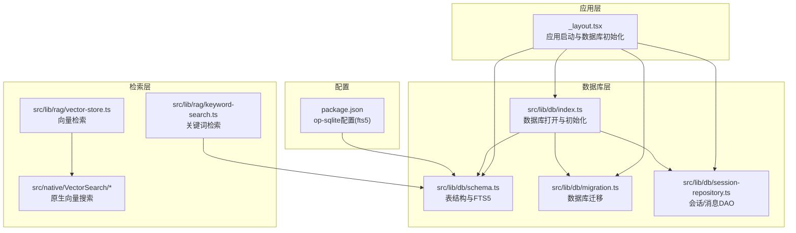
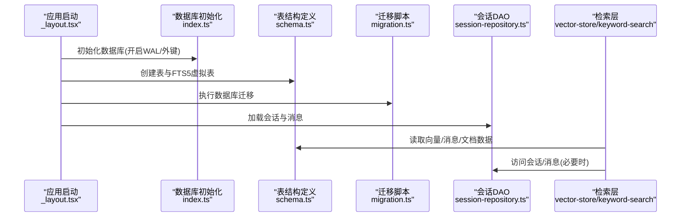
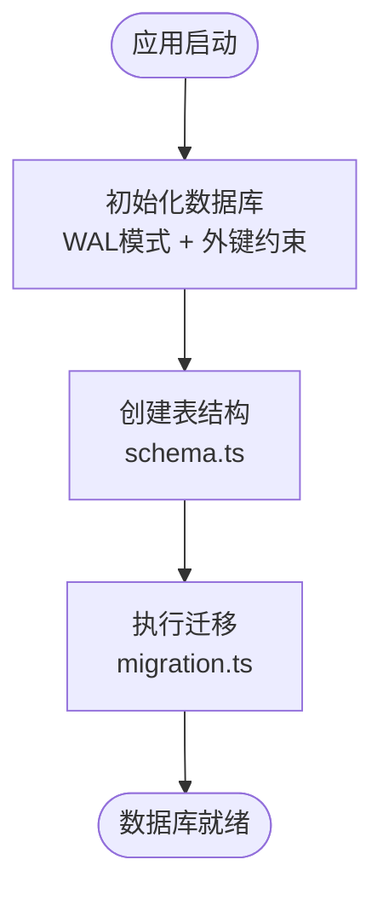
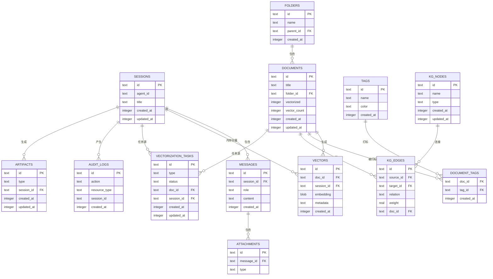
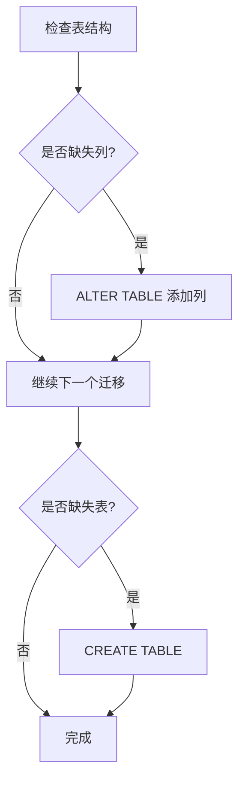
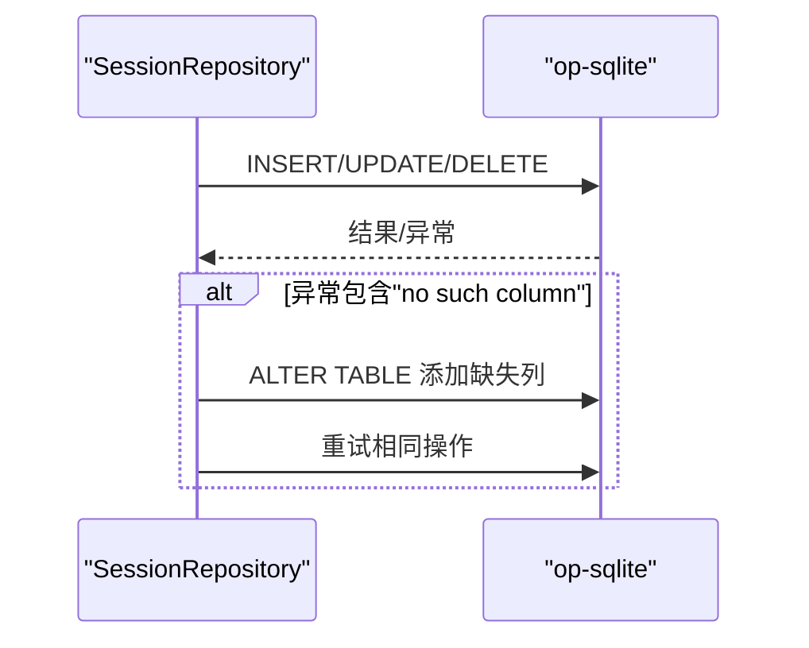
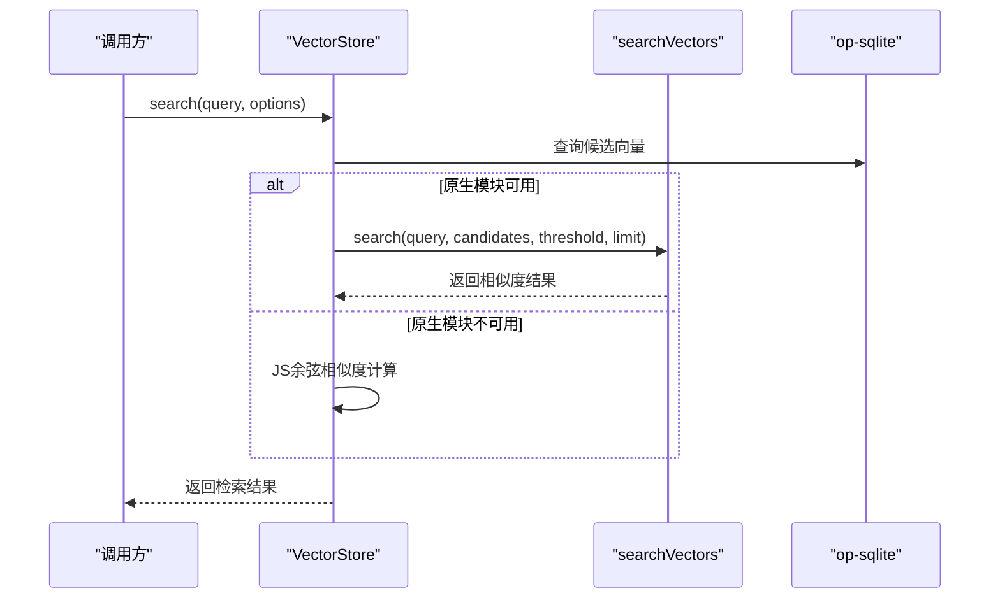
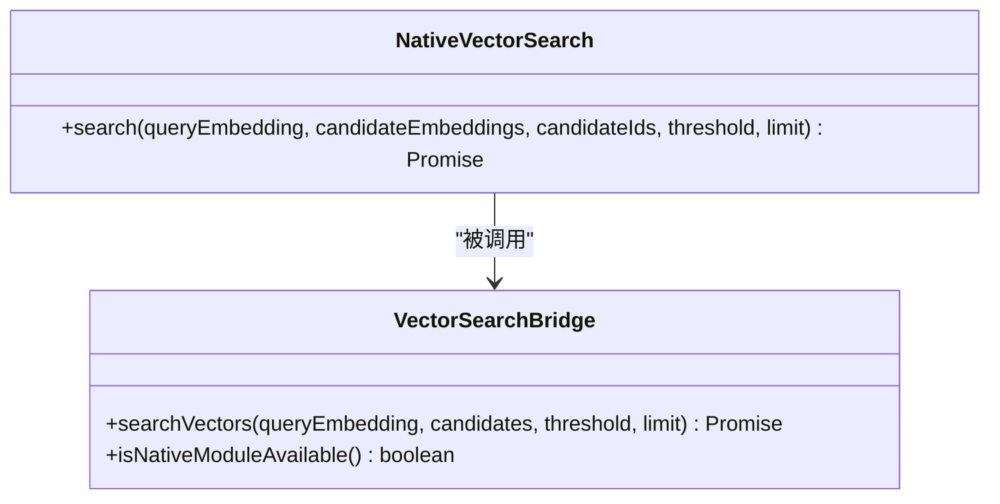
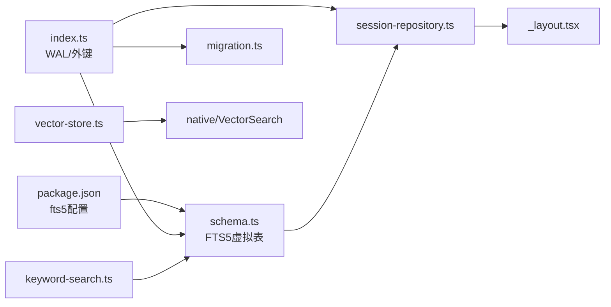

# 数据库架构设计

<cite>
**本文档引用的文件**
- [src/lib/db/index.ts](file://src/lib/db/index.ts)
- [src/lib/db/schema.ts](file://src/lib/db/schema.ts)
- [src/lib/db/migration.ts](file://src/lib/db/migration.ts)
- [src/lib/db/session-repository.ts](file://src/lib/db/session-repository.ts)
- [src/native/VectorSearch/NativeVectorSearch.ts](file://src/native/VectorSearch/NativeVectorSearch.ts)
- [src/native/VectorSearch/index.ts](file://src/native/VectorSearch/index.ts)
- [src/lib/rag/vector-store.ts](file://src/lib/rag/vector-store.ts)
- [src/lib/rag/keyword-search.ts](file://src/lib/rag/keyword-search.ts)
- [package.json](file://package.json)
- [app/_layout.tsx](file://app/_layout.tsx)
</cite>

## 目录
1. [简介](#简介)
2. [项目结构](#项目结构)
3. [核心组件](#核心组件)
4. [架构总览](#架构总览)
5. [详细组件分析](#详细组件分析)
6. [依赖关系分析](#依赖关系分析)
7. [性能考虑](#性能考虑)
8. [故障排除指南](#故障排除指南)
9. [结论](#结论)

## 简介
本文件面向Nexara项目的数据库架构设计，围绕基于@op-engineering/op-sqlite的本地数据库初始化配置进行深入解析，涵盖：
- WAL模式启用、外键约束设置与性能优化策略
- 数据库连接管理、事务处理与并发控制机制
- SQLite + FTS5 + 向量支持的技术选型与架构优势
- 数据库配置参数说明与最佳实践
- 安全配置、权限管理与数据加密策略

该架构以React Native + Expo生态为核心，采用op-sqlite提供跨平台SQLite能力，并结合原生向量搜索模块与FTS5全文检索，构建高性能、可扩展的本地知识检索与会话存储系统。

## 项目结构
数据库相关代码主要分布在以下位置：
- 数据库初始化与连接：src/lib/db/index.ts
- 表结构定义与FTS5虚拟表：src/lib/db/schema.ts
- 数据库迁移脚本：src/lib/db/migration.ts
- 会话与消息的数据访问层：src/lib/db/session-repository.ts
- 向量搜索原生接口：src/native/VectorSearch/*
- 向量检索与关键词检索实现：src/lib/rag/vector-store.ts、src/lib/rag/keyword-search.ts
- 应用启动流程中的数据库初始化：app/_layout.tsx
- op-sqlite配置（启用FTS5）：package.json

**图表来源**
- [app/_layout.tsx:82-152](file://app/_layout.tsx#L82-L152)
- [src/lib/db/index.ts:1-13](file://src/lib/db/index.ts#L1-L13)
- [src/lib/db/schema.ts:1-362](file://src/lib/db/schema.ts#L1-L362)
- [src/lib/db/migration.ts:1-354](file://src/lib/db/migration.ts#L1-L354)
- [src/lib/db/session-repository.ts:1-425](file://src/lib/db/session-repository.ts#L1-L425)
- [src/lib/rag/vector-store.ts:86-205](file://src/lib/rag/vector-store.ts#L86-L205)
- [src/lib/rag/keyword-search.ts:33-156](file://src/lib/rag/keyword-search.ts#L33-L156)
- [src/native/VectorSearch/index.ts:1-53](file://src/native/VectorSearch/index.ts#L1-L53)
- [package.json:115-117](file://package.json#L115-L117)

**章节来源**
- [app/_layout.tsx:82-152](file://app/_layout.tsx#L82-L152)
- [src/lib/db/index.ts:1-13](file://src/lib/db/index.ts#L1-L13)
- [src/lib/db/schema.ts:1-362](file://src/lib/db/schema.ts#L1-L362)
- [src/lib/db/migration.ts:1-354](file://src/lib/db/migration.ts#L1-L354)
- [src/lib/db/session-repository.ts:1-425](file://src/lib/db/session-repository.ts#L1-L425)
- [src/lib/rag/vector-store.ts:86-205](file://src/lib/rag/vector-store.ts#L86-L205)
- [src/lib/rag/keyword-search.ts:33-156](file://src/lib/rag/keyword-search.ts#L33-L156)
- [src/native/VectorSearch/index.ts:1-53](file://src/native/VectorSearch/index.ts#L1-L53)
- [package.json:115-117](file://package.json#L115-L117)

## 核心组件
- 数据库初始化与连接
  - 通过op-sqlite打开数据库实例，设置WAL模式与外键约束，确保并发写入性能与参照完整性。
- 表结构与索引
  - 定义会话、消息、附件、文件夹、文档、向量、上下文摘要、标签、知识图谱、向量化任务队列、审计日志、工件等核心表，并建立复合索引提升查询效率。
- 迁移管理
  - 通过迁移脚本安全升级表结构，兼容历史版本并补全缺失字段，保证数据一致性。
- 会话与消息DAO
  - 提供会话与消息的CRUD操作，内置自修复机制应对schema漂移，确保运行时稳定性。
- 检索层
  - 向量检索优先使用原生模块加速，降级到JavaScript实现；关键词检索使用FTS5虚拟表或LIKE回退方案。
- 原生向量搜索
  - 通过TurboModule暴露原生向量相似度计算接口，支持阈值与数量限制。

**章节来源**
- [src/lib/db/index.ts:7-12](file://src/lib/db/index.ts#L7-L12)
- [src/lib/db/schema.ts:3-361](file://src/lib/db/schema.ts#L3-L361)
- [src/lib/db/migration.ts:8-290](file://src/lib/db/migration.ts#L8-L290)
- [src/lib/db/session-repository.ts:14-148](file://src/lib/db/session-repository.ts#L14-L148)
- [src/lib/rag/vector-store.ts:115-159](file://src/lib/rag/vector-store.ts#L115-L159)
- [src/lib/rag/keyword-search.ts:33-156](file://src/lib/rag/keyword-search.ts#L33-L156)
- [src/native/VectorSearch/NativeVectorSearch.ts:4-17](file://src/native/VectorSearch/NativeVectorSearch.ts#L4-L17)

## 架构总览
下图展示了数据库初始化、表结构、迁移、DAO层与检索层之间的交互关系：

**图表来源**
- [app/_layout.tsx:88-99](file://app/_layout.tsx#L88-L99)
- [src/lib/db/index.ts:7-12](file://src/lib/db/index.ts#L7-L12)
- [src/lib/db/schema.ts:186-217](file://src/lib/db/schema.ts#L186-L217)
- [src/lib/db/migration.ts:8-290](file://src/lib/db/migration.ts#L8-L290)
- [src/lib/db/session-repository.ts:320-341](file://src/lib/db/session-repository.ts#L320-L341)
- [src/lib/rag/vector-store.ts:86-113](file://src/lib/rag/vector-store.ts#L86-L113)
- [src/lib/rag/keyword-search.ts:33-72](file://src/lib/rag/keyword-search.ts#L33-L72)

## 详细组件分析

### 数据库初始化与连接管理
- 初始化流程
  - 打开数据库实例，启用WAL模式以提升并发写入吞吐；开启外键约束保证参照完整性。
- 连接与并发
  - 通过op-sqlite提供的连接对象执行SQL，内部处理线程与锁机制；WAL模式允许读写并发，减少锁竞争。
- 事务处理
  - 当前DAO层未显式封装事务块，建议对批量写入场景（如导入会话、批量向量化）使用事务包裹以提升性能与一致性。

**图表来源**
- [src/lib/db/index.ts:7-12](file://src/lib/db/index.ts#L7-L12)
- [src/lib/db/schema.ts:3-361](file://src/lib/db/schema.ts#L3-L361)
- [src/lib/db/migration.ts:8-290](file://src/lib/db/migration.ts#L8-L290)

**章节来源**
- [src/lib/db/index.ts:7-12](file://src/lib/db/index.ts#L7-L12)
- [app/_layout.tsx:88-99](file://app/_layout.tsx#L88-L99)

### 表结构与索引设计
- 会话表sessions：存储会话元数据与配置，支持JSON字段保存复杂配置。
- 消息表messages：存储对话内容、工具调用、RAG结果、向量化状态等，建立会话索引与时间索引。
- 附件表attachments：多模态附件与消息关联。
- 文件夹/文档表：知识库组织与向量化状态跟踪。
- 向量表vectors：存储嵌入向量BLOB与元数据，支持文档与会话双关联。
- FTS5虚拟表vectors_fts：全文检索索引，配合触发器同步。
- 标签与知识图谱：支持智能标注与实体关系抽取。
- 向量化任务队列表：持久化任务状态，支持后台中断恢复。
- 审计日志表：记录关键操作与错误信息。
- 工件表：工作区集成产物。

**图表来源**
- [src/lib/db/schema.ts:3-361](file://src/lib/db/schema.ts#L3-L361)

**章节来源**
- [src/lib/db/schema.ts:3-361](file://src/lib/db/schema.ts#L3-L361)

### 迁移管理策略
- 版本演进
  - 通过迁移脚本逐步添加列、创建表、修复缺失字段，避免破坏性变更。
- 自动修复
  - 对于历史版本遗留的字段缺失，迁移脚本与DAO层自修复机制协同工作，确保系统稳定。
- 成本优化
  - 通过增量哈希与去重策略降低存储与查询成本。

**图表来源**
- [src/lib/db/migration.ts:12-361](file://src/lib/db/migration.ts#L12-L361)

**章节来源**
- [src/lib/db/migration.ts:8-354](file://src/lib/db/migration.ts#L8-L354)

### 会话与消息DAO
- 功能范围
  - 提供会话与消息的创建、查询、更新、删除，以及基于时间的分页查询。
- 自修复机制
  - 当检测到schema漂移（新增字段）时，自动创建缺失列并重试更新，增强鲁棒性。
- 性能注意
  - 批量写入建议使用事务；对高频查询建立合适索引（已存在部分索引）。

**图表来源**
- [src/lib/db/session-repository.ts:110-147](file://src/lib/db/session-repository.ts#L110-L147)

**章节来源**
- [src/lib/db/session-repository.ts:14-424](file://src/lib/db/session-repository.ts#L14-L424)

### 检索层：向量与关键词
- 向量检索
  - 优先使用原生模块进行相似度计算，若不可用则降级到JavaScript实现；支持阈值与数量限制。
- 关键词检索
  - 优先使用FTS5 MATCH查询，性能优于LIKE；当FTS5不可用时回退至LIKE组合查询。
- FTS5同步
  - 通过触发器在向量表插入/更新/删除时同步FTS5虚拟表，保证检索一致性。

**图表来源**
- [src/lib/rag/vector-store.ts:86-159](file://src/lib/rag/vector-store.ts#L86-L159)
- [src/native/VectorSearch/index.ts:15-48](file://src/native/VectorSearch/index.ts#L15-L48)
- [src/lib/rag/keyword-search.ts:33-156](file://src/lib/rag/keyword-search.ts#L33-L156)
- [src/lib/db/schema.ts:186-217](file://src/lib/db/schema.ts#L186-L217)

**章节来源**
- [src/lib/rag/vector-store.ts:86-205](file://src/lib/rag/vector-store.ts#L86-L205)
- [src/lib/rag/keyword-search.ts:33-156](file://src/lib/rag/keyword-search.ts#L33-L156)
- [src/native/VectorSearch/index.ts:15-53](file://src/native/VectorSearch/index.ts#L15-L53)

### 原生向量搜索接口
- 类型定义
  - 通过TurboModule定义search方法，接收查询向量、候选向量数组与ID数组，返回相似度结果。
- JavaScript桥接
  - 将Float32Array转换为原生可识别格式，调用原生模块并映射结果。

**图表来源**
- [src/native/VectorSearch/NativeVectorSearch.ts:4-17](file://src/native/VectorSearch/NativeVectorSearch.ts#L4-L17)
- [src/native/VectorSearch/index.ts:15-53](file://src/native/VectorSearch/index.ts#L15-L53)

**章节来源**
- [src/native/VectorSearch/NativeVectorSearch.ts:4-17](file://src/native/VectorSearch/NativeVectorSearch.ts#L4-L17)
- [src/native/VectorSearch/index.ts:15-53](file://src/native/VectorSearch/index.ts#L15-L53)

## 依赖关系分析
- op-sqlite配置
  - 在package.json中启用fts5扩展，使FTS5虚拟表与触发器可用。
- 模块耦合
  - 检索层依赖DAO层与schema定义；DAO层依赖数据库初始化；应用启动依赖DAO层加载数据。
- 外部依赖
  - React Native TurboModule提供原生向量搜索能力；Expo/React Native环境承载op-sqlite。

**图表来源**
- [package.json:115-117](file://package.json#L115-L117)
- [src/lib/db/schema.ts:186-217](file://src/lib/db/schema.ts#L186-L217)
- [src/lib/db/index.ts:7-12](file://src/lib/db/index.ts#L7-L12)
- [src/lib/db/migration.ts:8-290](file://src/lib/db/migration.ts#L8-L290)
- [src/lib/db/session-repository.ts:320-341](file://src/lib/db/session-repository.ts#L320-L341)
- [src/lib/rag/vector-store.ts:86-159](file://src/lib/rag/vector-store.ts#L86-L159)
- [src/lib/rag/keyword-search.ts:33-72](file://src/lib/rag/keyword-search.ts#L33-L72)
- [src/native/VectorSearch/index.ts:15-48](file://src/native/VectorSearch/index.ts#L15-L48)

**章节来源**
- [package.json:115-117](file://package.json#L115-L117)
- [src/lib/db/schema.ts:186-217](file://src/lib/db/schema.ts#L186-L217)
- [src/lib/db/index.ts:7-12](file://src/lib/db/index.ts#L7-L12)
- [src/lib/db/migration.ts:8-290](file://src/lib/db/migration.ts#L8-L290)
- [src/lib/db/session-repository.ts:320-341](file://src/lib/db/session-repository.ts#L320-L341)
- [src/lib/rag/vector-store.ts:86-159](file://src/lib/rag/vector-store.ts#L86-L159)
- [src/lib/rag/keyword-search.ts:33-72](file://src/lib/rag/keyword-search.ts#L33-L72)
- [src/native/VectorSearch/index.ts:15-48](file://src/native/VectorSearch/index.ts#L15-L48)

## 性能考虑
- WAL模式与外键
  - WAL模式显著提升并发写入性能，外键约束保障数据一致性，二者共同提升整体吞吐与可靠性。
- 索引策略
  - 已为消息表建立会话与时间复合索引，建议根据查询模式进一步评估是否需要更多索引。
- 检索性能
  - 向量检索优先使用原生模块；FTS5 MATCH查询优于LIKE；对大集合使用阈值与限制控制返回数量。
- 批量写入
  - 建议在导入/批量写入场景使用事务包裹，减少提交次数与锁竞争。
- 存储优化
  - 向量以BLOB存储，结合原生相似度计算避免额外序列化开销。

[本节为通用性能指导，无需特定文件引用]

## 故障排除指南
- FTS5不可用
  - 若FTS5未启用或不可用，系统将自动回退到LIKE查询；可通过检查op-sqlite配置与日志定位问题。
- 原生向量搜索失败
  - 当原生模块不可用或调用异常时，系统会降级到JavaScript实现；检查原生模块注册与参数类型。
- schema漂移
  - DAO层具备自修复能力，若仍失败，检查迁移脚本与数据库版本是否一致。
- 迁移失败
  - 迁移脚本包含容错处理，失败不会导致应用崩溃；建议手动验证表结构与索引。

**章节来源**
- [src/lib/db/schema.ts:209-216](file://src/lib/db/schema.ts#L209-L216)
- [src/lib/rag/vector-store.ts:103-113](file://src/lib/rag/vector-store.ts#L103-L113)
- [src/native/VectorSearch/index.ts:20-47](file://src/native/VectorSearch/index.ts#L20-L47)
- [src/lib/db/migration.ts:286-289](file://src/lib/db/migration.ts#L286-L289)

## 结论
Nexara的数据库架构以op-sqlite为核心，结合WAL模式、外键约束、FTS5全文检索与原生向量搜索，构建了高性能、可扩展且具备强一致性的本地知识检索与会话存储系统。通过完善的迁移与DAO自修复机制，系统在版本演进与运行时稳定性方面表现稳健。建议在批量写入场景引入事务，在高并发写入场景关注索引维护与查询计划优化，并持续监控FTS5与原生模块的可用性以确保检索性能。